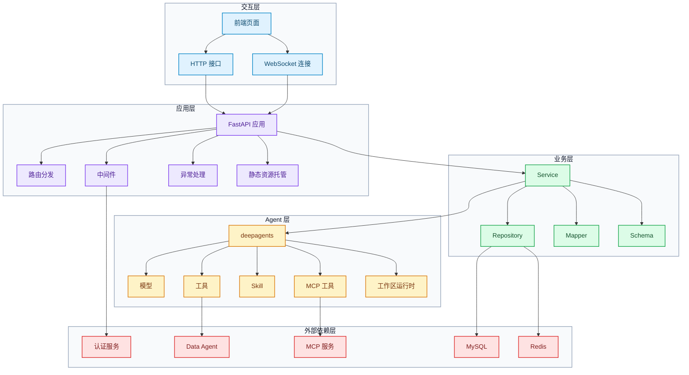
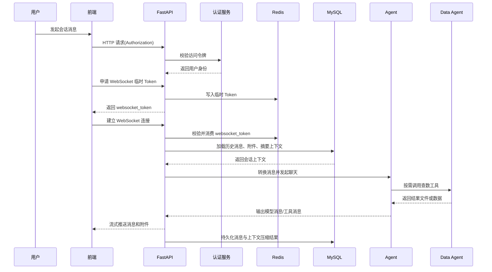

# Insight Agent 教学文档大纲

## 1. 项目介绍

### 1.1 功能介绍
`insight-agent` 是一个面向归因分析场景的智能体应用。它主要服务于业务分析、经营诊断和问题定位这类需要“先提出问题，再逐步收集证据，最后形成分析结论”的工作。和普通问答式聊天应用不同，这个项目强调的不只是模型给出一句回答，而是让系统能够围绕一个真实分析任务持续推进，直到生成阶段性结论、分析材料和可交付结果。

在很多真实业务场景里，用户面对的问题往往不是一句话就能回答清楚的。比如某个指标为什么下滑、某个业务区域为什么异常、某次活动为什么效果不达预期，这些问题通常都需要先拆解，再查数，再结合上下文做判断，最后把结果整理成可复用的输出。`insight-agent` 想做的事情，就是把这条原本依赖人工来回切换工具、查找信息、整理文档的链路，尽量收拢进一次连续的智能分析流程里。

对使用者来说，它的价值不只是“更快拿到一个答案”，而是把分析过程本身也沉淀下来。用户可以保留历史会话、继续追问前面的结论、复用已经上传的附件和已经生成的中间产物，从而把一次分析逐渐发展成一个可持续推进的工作过程，而不是一次性对话。


### 1.2 核心能力
- 提供完整的会话管理能力，包括创建会话、获取历史消息、删除会话
- 提供基于 WebSocket 的流式聊天能力，把模型回复、工具调用和工具结果实时返回给前端
- 基于 `deepagents` 组织 Agent 运行时，统一挂载模型、自定义工具、MCP 工具和 Skill
- 为每个用户会话分配独立工作区，用来承接上传附件、分析中间产物和最终报告文件
- 通过 `db_query` 查询业务数据，并把结果沉淀为工作区内可继续分析的文件
- 通过 `return_file` 把工作区中的分析结果文件作为附件返回给用户
- 通过消息 Schema 与 Mapper 打通前端消息、数据库记录和 Agent 运行时消息三种格式
- 支持上下文压缩与恢复，控制长对话成本，同时保持历史会话可继续追问
- 通过认证中间件、临时 WebSocket Token 和用户上下文实现用户鉴权与会话隔离

### 1.3 技术栈与依赖
- 后端：Python、FastAPI、SQLAlchemy、Redis、DeepAgents、LangChain 相关组件
- 前端：React、Vite、TypeScript、Zustand、shadcn/ui
- 数据与存储：MySQL、Redis
- 外部依赖：认证服务、Data Agent、MCP 服务

### 1.4 系统架构


- 交互层：前端页面通过 HTTP 与 WebSocket 调用后端接口
- 应用层：FastAPI 应用负责路由分发、中间件处理、异常处理和静态资源托管
- 业务层：Service、Repository、Mapper、Schema 共同完成会话管理、消息持久化与协议转换
- Agent 层：`deepagents` 负责组织模型、工具、Skill、MCP 工具和工作区运行时
- 外部依赖层：认证服务、Data Agent、MCP 服务、MySQL、Redis 为系统提供鉴权、数据、扩展能力和存储支持

### 1.5 一次完整请求的生命周期


- 用户在前端发起一次会话消息，请求先经过认证、路由和上下文准备
- 普通 HTTP 请求通过请求头携带访问令牌，WebSocket 链路先通过 HTTP 申请临时 Token 再建立连接
- 后端加载历史消息、附件信息和必要的摘要上下文，并转换成 Agent 可消费的消息格式
- Agent 在 Skill 约束下结合模型推理，决定直接回复、调用内建工具，或进一步使用 MCP 工具
- 工具执行产生的数据文件、分析结果或附件被写入对应会话工作区，并通过消息流实时回传
- 本轮产生的用户消息、模型消息、工具消息和上下文压缩结果被持续写入数据库，供后续追问和恢复使用

## 2. 项目基础模块

### 2.1 项目目录结构
```text
insight-agent/                项目根目录，统一组织后端、前端、配置与 Agent 资源
├── app/                      后端主目录，承载应用、Agent 和业务逻辑
│   ├── main.py               后端入口，负责创建应用、注册中间件与路由
│   ├── config.py             配置加载入口，统一解析运行配置
│   ├── core/                 Agent 核心目录，包含 Agent、MCP 和工具
│   ├── routers/              路由目录，对外提供 HTTP 与 WebSocket 接口
│   ├── services/             服务目录，组织聊天等核心业务流程
│   ├── schemas/              协议目录，定义前后端交互数据结构
│   ├── mappers/              转换目录，负责不同消息格式之间的映射
│   ├── entities/             实体目录，定义数据库实体模型
│   ├── repositories/         仓储目录，封装数据库读写逻辑
│   ├── middlewares/          中间件目录，处理认证与日志追踪
│   ├── exceptions/           异常目录，定义业务异常和统一异常处理
│   └── utils/                工具目录，封装数据库、Redis、HTTP、日志等能力
├── fd/                       前端目录，提供现成页面代码与构建资源
├── configs/                  配置目录，存放 `config.yml` 与 `.env`
├── sql/                      SQL 目录，存放数据库建表脚本
└── .deepagents/              DeepAgents 资源目录，存放 Skills 和会话工作区
```

### 2.2 项目依赖
依赖定义与安装方式：
- Python 依赖定义在 `pyproject.toml`

依赖如下：
- Web 框架与接口能力：`fastapi[standard]`
- 数据库与 ORM：`sqlalchemy`、`asyncmy`、`pymysql`
- 数据库辅助工具：`sqlacodegen`
- 缓存与临时状态：`redis`
- Agent 与模型相关：`deepagents`、`openai`、`langchain-openai`、`langchain-mcp-adapters`
- 配置与日志：`omegaconf`、`loguru`
- 数据分析与文件处理：`pandas`、`pdfplumber`、`pypdf`

附代码：
- [pyproject.toml](./insight-agent/pyproject.toml)

### 2.3 配置文件与配置加载
这个项目的配置主要分成两类：一类是适合放在仓库内、用于描述系统行为的普通配置；另一类是更敏感的环境配置，例如账号、密钥、地址和令牌。这两类配置分别落在 `configs/config.yml` 和 `configs/.env` 中，既方便管理，也能避免把敏感信息硬编码到代码里。

配置加载入口统一放在 `app/config.py`。应用启动时先从环境变量中读取 `.env`，再结合 `config.yml` 组织成项目内部统一使用的配置对象。

配置项主要包括：
- 数据库连接配置
- Redis 连接配置
- 模型相关配置
- MCP 服务配置
- 认证服务地址与接口配置
- 跨域配置
- 服务启动端口

附代码：
- [config.yml](./insight-agent/configs/config.yml)
- [.env](./insight-agent/configs/.env)
- [config.py](./insight-agent/app/config.py)

### 2.4 通用工具模块
`app/utils/` 用来集中放置通用基础能力，供路由、服务、工具和中间件统一复用，避免重复实现数据库、Redis、日志和上下文等底层逻辑。

#### 2.4.1 数据库工具
`db.py` 统一管理数据库引擎、会话工厂和 FastAPI 依赖注入入口。项目后续无论是 Repository、Service 还是 Router，都不直接创建数据库连接，而是从这里拿到统一的 `AsyncSession`。

模块职责：
- 根据配置生成数据库连接
- 统一创建并复用数据库引擎与会话工厂
- 对外提供 FastAPI 可直接注入的数据库会话依赖

设计重点：
- 数据库连接细节统一收口，业务层不直接处理连接创建
- 会话获取方式统一，后续 Router 和 Service 都走同一套入口
- 数据库层保持异步模式，和整个 FastAPI 调用链保持一致
- 应用关闭时可以统一释放数据库相关资源

项目主库的依赖函数通过 `get_app_db` 提前完成注册，后续业务代码可直接注入使用。

附代码：
- [db.py](./insight-agent/app/utils/db.py)

#### 2.4.2 Redis 工具
Redis 工具负责统一初始化和获取 Redis 客户端，主要服务于临时状态、短期缓存和一次性 Token 这类场景，避免业务代码重复维护连接。

附代码：
- [redis.py](./insight-agent/app/utils/redis.py)

#### 2.4.3 HTTP 客户端工具
HTTP 客户端工具负责统一封装对外部 HTTP 服务的调用入口，方便后续访问认证服务、Data Agent 或其他外部接口时复用同一套客户端配置。

附代码：
- [http_client.py](./insight-agent/app/utils/http_client.py)

#### 2.4.4 日志与上下文工具
日志工具负责统一日志初始化和输出格式；上下文工具负责管理请求级上下文信息，例如用户 ID。两者配合后，链路日志和业务调用就能共用同一份上下文数据。

日志落文件时会先从上下文中读取请求相关信息，例如 `request_id`、`trace_id`、`user_id`、请求路径和响应耗时，再和本次日志消息一起组装成 JSON，最终按 `jsonl` 格式写入文件。方便后续排查问题、链路检索和日志分析。

附代码：
- [log.py](./insight-agent/app/utils/log.py)
- [context.py](./insight-agent/app/utils/context.py)

### 2.5 异常体系与统一错误处理
异常模块统一放在 `app/exceptions/` 下，用来集中管理错误定义和错误返回格式，避免业务代码里到处手写 `HTTPException`。

#### 2.5.1 基础异常
基础异常定义在 `base.py` 中，项目里的自定义异常都从 `AppError` 继承。基础字段包括：
- `code`：业务错误码
- `message`：默认错误消息
- `status_code`：HTTP 状态码
- `detail`：可选的补充信息

在这个基础上，又定义了一组通用异常基类，例如：
- `ValidationError`：参数校验失败
- `AuthError`：认证失败
- `PermissionDeniedError`：权限不足
- `NotFoundError`：资源不存在
- `ConflictError`：资源冲突
- `BadRequestError`：请求参数错误

后面的业务异常直接基于这些基类继续细分。

附代码：
- [base.py](./insight-agent/app/exceptions/base.py)

#### 2.5.2 业务异常
业务异常按领域拆分到不同文件里，主要包括：
- `auth_error.py`：认证相关异常
- `chat_error.py`：聊天相关异常

已定义的业务异常包括：
- `MissingAccessTokenError`：缺少访问令牌
- `InvalidAccessTokenError`：访问令牌无效
- `AuthServiceUnavailableError`：认证服务不可用
- `AuthServiceResponseError`：认证服务响应异常
- `ConversationNotFound`：对话不存在

这种拆分方式对应的设计考虑包括：
- 错误定义和业务模块对应，查找更方便
- 每个异常都有稳定的错误码和错误消息
- 路由和服务里可以直接抛业务异常，不需要自己拼响应

附代码：
- [auth_error.py](./insight-agent/app/exceptions/auth_error.py)
- [chat_error.py](./insight-agent/app/exceptions/chat_error.py)

#### 2.5.3 统一异常处理器
异常处理器定义在 `handlers.py` 中，负责把不同来源的异常统一收敛成稳定的 JSON 返回格式。处理的异常类型包括：
- `AppError`
- FastAPI 的 `RequestValidationError`
- FastAPI 的 `HTTPException`
- 其他未捕获异常

最终返回结构会统一包含：
- `code`
- `exc_type`
- `message`
- `detail`
- `trace_id`（如果请求上下文中存在）

前端获得的错误结构因此保持稳定，后端日志中也能保留对应的异常信息和链路标识。

附代码：
- [handlers.py](./insight-agent/app/exceptions/handlers.py)

### 2.6 中间件

#### 2.6.1 `trace` 与日志体系
`trace` 中间件负责给每个请求补齐统一的链路信息，并把这些信息写入 `ContextVar`，供后续日志输出和业务处理复用。

这一中间件主要处理以下内容：
- 生成或继承 `request_id`
- 生成或继承 `trace_id`
- 提取客户端 IP、请求方法和请求路径
- 记录请求开始、处理中、完成或失败状态
- 统计请求耗时
- 把 `X-Request-ID` 和 `X-Trace-ID` 写回响应头

附代码：
- [trace.py](./insight-agent/app/middlewares/trace.py)

#### 2.6.2 `auth` 中间件设计
`auth` 中间件负责统一处理访问令牌校验。将认证放在中间件层，请求在进入具体业务路由之前先完成身份确认，这样后面的 Router、Service 和 Agent 调用都可以直接使用已经解析好的用户信息。

该实现会先根据请求路径判断接口是否需要鉴权。`/health`、`/docs`、`/openapi.json`、`/redoc` 等精确路径会直接放行，`/assets`、`/auth-api` 等前缀路径也会放行；真正进入业务处理的接口主要通过 `/api` 前缀统一纳入鉴权范围。由此可以将需要保护的业务接口与不需要保护的静态资源、文档接口区分开来。

执行鉴权时，中间件会：
- 从请求头里读取 `Authorization`
- 调用认证服务的 introspection 接口
- 校验访问令牌是否有效
- 把解析出的用户信息写入 `request.state.payload`
- 同时把用户 ID 写入上下文变量，供后续日志和业务链路使用

如果认证失败，不会继续进入业务逻辑，而是直接通过统一异常处理返回约定格式的错误响应。

附代码：
- [auth.py](./insight-agent/app/middlewares/auth.py)
- [auth_schema.py](./insight-agent/app/schemas/auth_schema.py)

## 3. Agent 组装

### 3.1 Agent 由哪些组件组成
Agent 运行时由模型、工作区、工具、MCP、Skill 和 `deepagents` 提供的运行时能力共同组成。

其中各部分职责如下：
- 模型：负责推理与决策，决定回复内容、是否调用工具、调用哪个工具
- 工作区：负责承接会话级文件、中间分析产物和最终交付文件
- 工具：负责执行数据库查询、文件返回等具体动作
- MCP：负责接入外部扩展能力
- Skill：负责注入任务方法论、执行规范和交付要求
- `TodoListMiddleware`：负责帮助 Agent 维护任务拆解和执行步骤
- `SubAgentMiddleware`：负责在复杂任务下支持子代理拆分与协作
- `SummarizationMiddleware`：负责在长对话场景下压缩上下文，降低上下文长度和推理成本


### 3.2 工作区机制
工作区是这个项目里很关键的一层。每个会话都会分配一个独立的 workspace，用来保存用户上传的附件、分析过程中的中间文件，以及最终生成的报告或交付物。

工作区机制主要解决三个问题：
- 会话级隔离：不同用户、不同会话的文件不会混在一起
- 文件承接：工具执行结果可以稳定落盘，而不是只停留在内存里
- 结果回传：生成的文件可以继续被 Agent 使用，也可以返回给前端作为附件展示

工作区设计和后面的工具系统、附件系统是直接关联的：
- `db_query` 查询出来的数据会写入工作区文件
- 文档和图片附件会先进入工作区，再决定如何进入模型上下文
- `return_file` 返回给前端的文件，本质上也是从工作区中取出

因此，工作区是 Agent 在这个项目里能够处理文件、沉淀中间结果和交付最终产物的基础前提。

### 3.3 工具
#### 3.3.1 `db_query`
`db_query` 是项目里最核心的业务工具之一，负责把自然语言查询需求发送给 Data Agent，并将最终结果写入对应会话工作区。

这一工具的职责可以概括为：
- 接收自然语言查询需求
- 调用外部 Data Agent 查询业务数据
- 解析 SSE 流式返回结果
- 将最终结果写入工作区文件
- 返回文件路径、字段信息和预览数据

这里有几个关键设计点：
- 数据库访问没有直接暴露给 Agent，而是通过 Data Agent 做隔离
- 查询结果不会只停留在内存里，而是会沉淀成工作区文件，方便后续继续分析
- 表格结果写成 CSV，非表格结果写成 JSON
- 返回结构里包含 `pandas_read_hint`、`preview_rows`、`row_count` 等信息，便于后续工具链继续使用

附代码：
- [db_query.py](./insight-agent/app/core/tools/db_query.py)

#### 3.3.2 `return_file`
`return_file` 负责把工作区中的文件返回给用户。这个工具本身不直接传输二进制内容，而是返回一个结构化结果，后续再由消息映射和前端展示逻辑把它转换成附件。

这一工具的职责可以概括为：
- 接收工作区相对路径
- 校验文件是否存在
- 校验路径是否越出工作区范围
- 返回标准化的文件信息结构

这里的设计重点包括：
- 路径只允许是工作区下的相对路径
- 需要显式处理路径逃逸问题
- 返回值中同时包含工作区路径和面向用户展示的原始文件名
- 工具结果可以继续被 Mapper 转换成附件结构，供前端直接展示

附代码：
- [return_file.py](./insight-agent/app/core/tools/return_file.py)

### 3.4 MCP 接入
#### 3.4.1 `mcp.py` 的实现与 Agent 接入
`mcp.py` 的作用是把配置文件中的多个 MCP 服务统一初始化成一个客户端。实现中会先根据配置里的 `transport` 字段，把不同服务映射到对应的连接类型，例如：
- `sse`
- `stdio`
- `websocket`
- `streamable_http`

随后，这些连接会被统一交给 `MultiServerMCPClient` 管理。这样项目内部不需要分别维护多个 MCP 服务实例，而是通过一个统一客户端获取全部 MCP 工具。

在 Agent 初始化时，`agent.py` 会先调用：

```python
mcp_tools = await mcp_client.get_tools()
```

然后把 MCP 工具和内建工具一起放进最终的工具列表：

```python
tools = [db_query, return_file, *mcp_tools]
```

这样 Agent 看见的是一份统一工具集，不需要区分某个工具来自项目内部实现还是来自 MCP 服务。

附代码：
- [mcp.py](./insight-agent/app/core/mcp.py)

### 3.5 Skill 系统
#### 3.5.1 Skill 的作用与目录组织
Skill 负责为 Agent 补充任务方法论、执行规范和交付要求。工具解决的是单步动作，例如查数、返回文件；Skill 解决的是“遇到某类任务时，应该按什么流程推进，产出什么结果”。

项目里的 Skill 放在 `.deepagents/skills/` 下，目录中既有文档处理类 Skill，也有面向归因分析场景的 `insight` Skill。Agent 初始化时会通过：

```python
create_deep_agent(
    ...,
    skills=["/skills/"],
)
```

把这一目录整体挂载进去，使 Agent 在运行时可以发现并使用这些 Skill。

#### 3.5.2 `insight` Skill 如何约束分析流程
`insight` Skill 负责把归因分析任务约束成固定工作流，避免 Agent 只停留在单点查数或自由发挥。

它约束的内容主要包括：
- 任务进入条件：当问题属于归因分析、经营诊断、活动复盘、营销分析等场景时，按分析模式推进，而不是只返回一条查询结果
- 数据获取方式：数据库数据统一通过 `db_query` 获取，后续分析优先基于查询结果文件继续处理
- 执行环境约束：工作区内的 Python 命令统一使用 `uv run`，依赖安装统一使用 `uv add`
- 分析动作约束：默认补齐基线对比、规模拆解、结构拆解、效率拆解、贡献拆解和异常识别
- 分析维度约束：围绕用户、渠道、商品、优惠、地域、时间、行为等维度展开，并按场景补充交叉分析
- 文件产物约束：原始查询结果、中间分析文件和最终交付文件分别落到约定目录中，便于继续分析和回传
- 报告交付约束：详细分析场景默认输出 HTML 报告，并包含摘要、指标卡片、多维拆解、结论与建议等结构
- 最终回复约束：回复中需要交代分析问题、数据来源、归因结论和生成文件

这些约束共同定义了归因分析任务的执行方式、文件组织方式和最终交付方式。

附代码：
- [insight/SKILL.md](./insight-agent/.deepagents/skills/insight/SKILL.md)

### 3.6 Agent 的组装与加载
`agent.py`负责统一定义 Agent 的目录结构、工作区后端、组件装配方式和实例获取方式。

目录与路径常量包括：
- `.deepagents/skills/`：Skill 目录
- `.deepagents/workspaces/`：会话工作区根目录

工作区目录按用户和会话组织：
- 路径格式为 `.deepagents/workspaces/user_{user_id}/{conversation_id}`
- `get_workspace_dir()` 负责确保目录存在，并在请求进入后为对应会话准备工作区

Agent 的后端通过 `_backend_factory()` 动态创建，包含两部分：
- 工作区后端：使用 `LocalShellBackend`，让 Agent 可以在会话工作区中读写文件和执行命令
- Skill 后端：使用 `FilesystemBackend`，把 `/skills/` 路由到 Skill 目录

Agent 的组装由 `_build_agent()` 完成，装配内容包括：
- 模型：从配置中读取模型名称、`base_url`、`api_key` 和其他参数
- 内建工具：`db_query`、`return_file`
- MCP 工具：通过 `mcp_client.get_tools()` 获取
- Backend：使用 `_backend_factory`
- Skill：通过 `skills=["/skills/"]` 挂载

实例获取通过 `get_agent()` 统一完成：
- Agent 实例保存在全局变量 `_agent` 中
- 第一次请求进入时按需创建
- 后续请求直接复用已有实例
- 通过 `_agent_lock` 保证并发场景下只创建一次

这种加载方式把模型、工具、MCP、Skill 和工作区后端集中在一个入口装配，后续聊天链路只需要调用 `get_agent()` 获取实例，不需要重复初始化。

附代码：
- [agent.py](./insight-agent/app/core/agent.py)

## 4. 接口设计

### 4.1 后端功能接口
- `GET /health`：健康检查
- `GET /api/chat/ls`：获取会话列表
- `POST /api/chat/create`：创建会话
- `POST /api/chat/update`：修改会话标题
- `POST /api/chat/delete`：删除会话
- `GET /api/chat/ls/{conversation_id}`：获取历史消息
- `POST /api/chat/attachment/upload`：上传附件
- `POST /api/chat/attachment/delete`：删除附件
- `GET /api/chat/attachment/get`：获取附件文件
- `POST /api/chat/ws-token`：创建 WebSocket 临时令牌
- `WS /api/chat/ws/chat`：流式聊天

附代码：
- [chat_schema.py](./insight-agent/app/schemas/chat_schema.py)

### 4.2 会话接口
会话相关接口包括：
- `GET /api/chat/ls`：按当前用户查询会话列表
- `POST /api/chat/create`：创建会话，初始标题为“新对话”，可指定是否创建草稿会话
- `POST /api/chat/update`：校验会话归属后更新标题
- `POST /api/chat/delete`：逻辑删除会话，并一并清理消息、上下文压缩记录和工作区目录

这组接口里，需要单独说明的是草稿会话。
草稿会话的处理流程如下：
- 前端可以先调用 `POST /api/chat/create` 创建 `is_draft=1` 的草稿会话
- 这类会话先出现在列表和工作区体系中，但还没有真正进入正式对话
- WebSocket 首次收到用户消息后，会检查会话是否仍处于草稿状态
- 如果仍是草稿，会先把 `is_draft` 更新为 `0`
- 后续这条会话再按正式会话继续写入消息、更新标题和维护上下文

这种设计用于解决“附件先上传、消息稍后发送”的场景。前端可以先创建一个草稿会话，把附件上传到对应工作区，等用户真正发出第一条消息时，再把它转换成正式会话。

附代码片段：
来源：[chat_schema.py](./insight-agent/app/schemas/chat_schema.py)

```python
class ConversationResponse(BaseModel):
    conversation_id: int
    title: str
    update_at: datetime


class ConversationListResponse(BaseModel):
    conversations: list[ConversationResponse]


class CreateConversationRequest(BaseModel):
    is_draft: Literal[0, 1] = Field(default=0, description="是否创建草稿对话")


class UpdateConversationRequest(BaseModel):
    conversation_id: int = Field(..., description="对话ID")
    title: str = Field(..., description="对话标题")


class DeleteConversationRequest(BaseModel):
    conversation_ids: list[int] = Field(..., description="对话ID列表")
```

### 4.3 附件接口
附件接口负责把文件写入会话工作区，并把工作区中的文件重新返回给前端。

附件相关接口包括：
- `POST /api/chat/attachment/upload`：上传附件到会话工作区
- `POST /api/chat/attachment/delete`：删除工作区中的附件
- `GET /api/chat/attachment/get`：获取工作区中的附件文件

这组接口里，需要单独说明的是上传流程。
附件上传流程如下：
- 接收 `conversation_id` 和 `file`
- 校验会话是否存在且属于当前用户
- 用 `_build_attachment_unique_name()` 生成唯一文件名，避免重名覆盖
- 用 `get_workspace_dir()` 获取会话工作区
- 用 `_build_attachment_path()` 校验路径，防止路径逃逸
- 按块写入文件
- 返回上传后的附件元数据

附代码片段：
来源：[chat_schema.py](./insight-agent/app/schemas/chat_schema.py)

```python
class Attachment(BaseModel):
    raw_name: str = Field(..., description="原始附件名称")
    path: str = Field(..., description="工作区相对路径")


class UploadAttachmentResponse(BaseModel):
    attachment: Attachment = Field(..., description="上传后的附件信息")


class DeleteAttachmentRequest(BaseModel):
    conversation_id: int = Field(..., description="对话ID")
    path: str = Field(..., description="相对工作区路径")
```

### 4.4 历史消息接口
接口为：
- `GET /api/chat/ls/{conversation_id}`：获取某个会话下的历史消息

这条接口的处理比较直接：
- 根据 `conversation_id` 调用 `message_repo.ls()` 查询消息
- 逐条调用 `message_mapper.entity_to_schema()` 转成前端可直接消费的 `MessageSchema`
- 组装为 `MessageListResponse` 返回

这里返回的是 Schema 层消息。前端历史消息展示、附件回显和后续继续聊天，都是以这一结构为基础。

附代码：
- [chat.py](./insight-agent/app/routers/api/chat.py)

### 4.5 WebSocket Token 接口
WebSocket Token 接口负责把已经完成 HTTP 认证的用户身份，转换成一个短时可消费的建连令牌。

接口为：
- `POST /api/chat/ws-token`

调用流程如下：
- 从 `request.state.payload.sub` 读取用户 ID
- 生成随机 `websocket_token`
- 调用 `websocket_token_repo.create()` 写入 Redis
- 返回 `WebSocketTokenResponse`

响应对象字段包括：
- `websocket_token`
- `expires_in`

这一接口的作用是把 HTTP 认证结果传递到后续 WebSocket 链路中。

附代码：
- [chat_schema.py](./insight-agent/app/schemas/chat_schema.py)

### 4.6 WebSocket 聊天接口
WebSocket 聊天接口负责承载实时对话过程。

接口为：
- `WS /api/chat/ws/chat?conversation_id=...&websocket_token=...`

建连流程如下：
- 从查询参数中读取 `websocket_token`
- 调用 `websocket_token_repo.consume()` 校验并消费令牌
- 把用户 ID 写入上下文变量
- 建立 WebSocket 连接
- 校验会话是否存在且属于当前用户

历史恢复流程如下：
- 读取当前会话的历史消息
- 逐条从 Entity 转成 Schema，再转成运行时消息
- 读取最近一次上下文压缩结果
- 如存在摘要，则用摘要替换历史消息前段

消息收发流程如下：
- 接收前端发送的 `WebSocketChatRequest`
- 校验 `message.role` 必须为 `user`
- 为用户消息补齐 `context_seq`
- 如会话仍是草稿，则更新为正式会话
- 调用 `chat_service.stream_chat()` 执行聊天
- 把返回的每条消息包装成 `WebSocketMessageResponse`
- 通过 `websocket.send_json()` 持续推送给前端

异常处理方式包括：
- 建连参数缺失或令牌无效时，直接关闭连接
- 会话不存在或无权限访问时，发送 `WebSocketErrorResponse` 后关闭连接
- 请求体格式不合法时，发送错误事件并继续等待下一条消息

关键请求和响应对象包括：
- `WebSocketChatRequest`
- `WebSocketMessageResponse`
- `WebSocketErrorResponse`

附代码：
- [chat.py](./insight-agent/app/routers/api/chat.py)

## 5. 数据模型与消息转换

### 5.1 项目中的三种消息格式
- Agent 运行时使用的 LangChain/DeepAgents 消息
- 前后端交互的 Schema 消息
- 数据库存储的 Entity 消息

LangChain/DeepAgents 消息是 Agent 真正消费和产出的运行时格式，Schema 和 Entity 都是在运行时消息基础上做适配

#### 5.1.1 运行时消息
运行时消息是 Agent 真正消费和产出的格式，主要有三种：
- `HumanMessage`：用户输入消息
- `AIMessage`：模型输出消息，可能包含 `tool_calls`
- `ToolMessage`：工具调用结果消息

在这个项目里，运行时消息在进入 Agent 前会被整理成兼容 LangChain 的字典结构。

`HumanMessage` 对应的核心字段是 `role` 和 `content`：

```python
{
    "role": "user",
    "content": [
        {"type": "text", "text": "..."},
        {"type": "image_url", "image_url": "data:image/png;base64,..."},
    ],
}
```

`content` 是 `list[dict]`，项目里主要有两种片段格式：
- 文本片段：`{"type": "text", "text": "..."}`
- 图片片段：`{"type": "image_url", "image_url": "..."}`

如果用户消息带有文档附件，项目不会直接把附件本身放进运行时消息，而是先把附件信息转成一段文本提示，再追加到 `content` 里；如果带的是图片附件，则会读取工作区文件并转成 `data URL` 放进 `content`。

`AIMessage` 对应的核心字段是 `content` 和 `tool_calls`：

```python
{
    "role": "assistant",
    "content": [
        {"type": "text", "text": "..."},
    ],
    "tool_calls": [
        {
            "type": "tool_call",
            "id": "...",
            "name": "...",
            "args": {...},
        }
    ],
}
```

其中：
- `content` 仍然是 `list[dict]`，主要承载文本内容
- `tool_calls` 是 `list[dict]`
- 每个 `tool_call` 包含 `id`、`name`、`args`

`ToolMessage` 对应的是工具执行结果，核心字段如下：

```python
{
    "role": "tool",
    "tool_call_id": "...",
    "name": "...",
    "content": "...",
}
```

其中：
- `tool_call_id` 用来和前面的工具调用对应
- `name` 是工具名称
- `content` 是工具执行结果，项目里统一按字符串处理

#### 5.1.2 Schema 消息
Schema 消息负责前后端交互，是运行时消息在应用层的结构化表达。项目的核心结构是 `MessageSchema`：

```python
class MessageSchema(BaseModel):
    message_id: int | None
    context_seq: int | None
    role: Literal["user", "assistant", "tool", "system"]
    parts: list[MessagePart]
    attachments: list[Attachment] | None
    finish_reason: Literal["stop", "tool_calls"] | None
    timestamp: datetime | None
```

其中几个关键字段的设计含义是：
- `message_id`：消息主键，主要用于数据库回放后的消息标识
- `context_seq`：消息在会话中的顺序号
- `role`：消息角色，对应用户、模型、工具等来源
- `parts`：消息主体内容
- `attachments`：附件列表
- `finish_reason`：模型输出结束原因
- `timestamp`：消息时间戳

Schema 消息里最核心的设计是 `parts`。项目没有把一条消息简单设计成单个字符串，而是拆成统一的片段结构，支持四种：

```python
TextContent:
{"type": "text", "text": "..."}

ImageContent:
{"type": "image_url", "image_url": "..."}

ToolCallPart:
{"type": "tool_call", "tool_call_id": "...", "name": "...", "args": {...}}

ToolResultPart:
{"type": "tool_result", "tool_call_id": "...", "name": "...", "content": "..."}
```

附件单独放在 `attachments` 里，而不是混在 `parts` 中。附件结构如下：

```python
{"raw_name": "...", "path": "..."}
```

这种设计带来的直接效果包括：
- 前端展示时可以统一按 `parts` 渲染文本、图片、工具调用和工具结果
- 附件和消息主体分离，上传文件、返回文件、历史恢复都更清楚
- 一条消息可以同时包含文本和工具调用，不需要靠额外字段拼接
- 后续从 Schema 映射到运行时消息或数据库实体时结构更稳定

附代码片段：
来源：[chat_schema.py](./insight-agent/app/schemas/chat_schema.py)

```python
class TextContent(BaseModel):
    type: Literal["text"] = "text"
    text: str = Field(..., description="文本内容")


class ImageContent(BaseModel):
    type: Literal["image_url"] = "image_url"
    image_url: str = Field(..., description="图片链接")


class ToolCallPart(BaseModel):
    type: Literal["tool_call"] = "tool_call"
    tool_call_id: str = Field(..., description="工具调用ID")
    name: str = Field(..., description="工具名称")
    args: dict = Field(default_factory=dict, description="工具参数")


class ToolResultPart(BaseModel):
    type: Literal["tool_result"] = "tool_result"
    tool_call_id: str = Field(..., description="工具调用ID")
    name: str = Field(..., description="工具名称")
    content: str = Field(..., description="工具执行结果")


class Attachment(BaseModel):
    raw_name: str = Field(..., description="原始附件名称")
    path: str = Field(..., description="工作区相对路径")


class MessageSchema(BaseModel):
    message_id: int | None = Field(default=None, description="消息ID")
    context_seq: int | None = Field(default=None, description="对话内上下文顺序号")
    role: MessageRole = Field(..., description="发送者")
    parts: list[MessagePart] = Field(..., description="消息片段")
    attachments: list[Attachment] | None = Field(default=None, description="附件列表")
    finish_reason: FinishReason | None = Field(default=None, description="完成原因")
    timestamp: datetime | None = Field(default=None, description="发送时间")
```

#### 5.1.3 Entity 消息
Entity 消息负责数据库持久化，是运行时消息和 Schema 消息在存储层的落地形式。项目中对应的是 `app/entities/chat.py` 里的 `Message` 实体：

```python
class Message(Base):
    id: int
    conversation_id: int
    context_seq: int
    role: str
    parts: str
    create_at: datetime
    yn: int
    finish_reason: str | None
    attachments: str | None
```

和 Schema 相比，Entity 更强调存储层落地，因此这里有两个关键差异：
- `parts` 在 Schema 里是 `list[MessagePart]`，在 Entity 里是 JSON 字符串
- `attachments` 在 Schema 里是 `list[Attachment] | None`，在 Entity 里也是 JSON 字符串或 `None`

Entity 层保存的消息大致可以表示为：

```python
{
    "id": 1,
    "conversation_id": 1001,
    "context_seq": 3,
    "role": "assistant",
    "parts": "[{\"type\":\"text\",\"text\":\"...\"}]",
    "attachments": "[{\"raw_name\":\"report.xlsx\",\"path\":\"outputs/report.xlsx\"}]",
    "finish_reason": "stop",
}
```

这一设计的核心考虑包括：
- 表结构保持稳定，不需要为每一种消息片段单独拆表
- `parts` 和 `attachments` 仍然保留结构化信息，后续可以完整恢复成 Schema
- 历史消息回放、上下文恢复、附件回显都可以直接依赖这份持久化数据

附代码片段：
来源：[chat.sql](./insight-agent/sql/mysql/chat.sql)

```sql
CREATE TABLE `message` (
    `id` BIGINT NOT NULL COMMENT '消息ID',
    `conversation_id` BIGINT NOT NULL COMMENT '对话ID',
    `context_seq` BIGINT NOT NULL COMMENT '对话内上下文顺序号(从0起)',
    `role` VARCHAR(10) NOT NULL COMMENT '角色 (user/assistant/tool/system)',
    `parts` MEDIUMTEXT NOT NULL COMMENT '消息片段列表 (JSON 字符串)',
    `create_at` DATETIME NOT NULL DEFAULT CURRENT_TIMESTAMP COMMENT '创建时间',
    `yn` TINYINT NOT NULL DEFAULT 1 COMMENT '是否启用',
    `finish_reason` VARCHAR(128) NULL COMMENT '完成原因',
    `attachments` TEXT NULL COMMENT '附件列表 (JSON 字符串)',
    PRIMARY KEY (`id`),
    UNIQUE KEY `uk_message_conversation_id_context_seq` (`conversation_id`, `context_seq`),
    KEY `idx_message_conversation_id` (`conversation_id`)
) COMMENT='消息';
```

### 5.2 消息转换 Mapper
#### 5.2.1 `langchain_message_to_schema` 与流式输出适配
这一段负责把 Agent 运行时输出重新转回 `MessageSchema`，供前端展示和后续持久化。

处理的消息类型主要包括：
- `AIMessage`
- `ToolMessage`

`AIMessage` 的转换规则是：
- `content` 转成 `TextContent`
- `tool_calls` 转成一个或多个 `ToolCallPart`
- `response_metadata.finish_reason` 写入 `finish_reason`

`ToolMessage` 的转换规则是：
- 工具结果统一转成 `ToolResultPart`
- `tool_call_id` 和 `name` 原样保留，方便前端把工具调用和工具结果对应起来

其中需要单独说明的是文件返回类工具：
- 项目里对应的是 `return_file`
- 如果工具返回内容是成功的 JSON 结构
- 会额外从结果中提取 `path` 和 `raw_name`
- 再组装成 `attachments`

前端获得的因此不只是文本结果，还包括可以直接展示的附件信息。

附代码片段：
来源：[message_mapper.py](./insight-agent/app/mappers/message_mapper.py)

```python
def langchain_message_to_schema(
    message: AIMessage | ToolMessage,
) -> chat_schema.MessageSchema | None:
    if isinstance(message, AIMessage):
        parts = [
            chat_schema.TextContent(text=message.content),
            *[
                chat_schema.ToolCallPart(
                    tool_call_id=tool_call.get("id") or "",
                    name=tool_call.get("name") or "",
                    args=tool_call.get("args", {}),
                )
                for tool_call in message.tool_calls
            ],
        ]
        return chat_schema.MessageSchema(
            role="assistant",
            parts=parts,
            finish_reason=message.response_metadata.get("finish_reason"),
        )

    elif isinstance(message, ToolMessage):
        return chat_schema.MessageSchema(
            role="tool",
            parts=[
                chat_schema.ToolResultPart(
                    tool_call_id=message.tool_call_id,
                    name=message.name or "",
                    content=str(message.content),
                )
            ],
        )
```

#### 5.2.2 `schema_to_entity`
这一段负责把 `MessageSchema` 写入数据库实体。

`schema_to_entity` 的处理重点是：
- 把 `parts` 从结构化对象序列化成 JSON 字符串
- 把 `attachments` 从结构化对象序列化成 JSON 字符串
- 补上 `conversation_id`、`context_seq` 等数据库落库所需字段

上述处理可以将前端和运行时使用的结构化消息稳定写入数据库。

附代码片段：
来源：[message_mapper.py](./insight-agent/app/mappers/message_mapper.py)

```python
def schema_to_entity(
    message: chat_schema.MessageSchema, conversation_id: int
) -> Message:
    parts = json.dumps(
        [part.model_dump() for part in message.parts], ensure_ascii=False
    )
    attachments = (
        json.dumps(
            [attachment.model_dump() for attachment in message.attachments],
            ensure_ascii=False,
        )
        if message.attachments is not None
        else None
    )
    return Message(
        conversation_id=conversation_id,
        context_seq=message.context_seq,
        role=message.role,
        parts=parts,
        attachments=attachments,
        finish_reason=message.finish_reason,
    )
```

#### 5.2.3 `entity_to_schema`
这一段负责把数据库实体恢复成 `MessageSchema`。

`entity_to_schema` 的处理重点是：
- 把数据库里的 `parts` JSON 字符串解析回 `TextContent`、`ImageContent`、`ToolCallPart`、`ToolResultPart`
- 把 `attachments` JSON 字符串解析回 `Attachment`
- 把数据库字段恢复成前端可以直接使用的 `MessageSchema`

附代码片段：
来源：[message_mapper.py](./insight-agent/app/mappers/message_mapper.py)

```python
def entity_to_schema(message: Message) -> chat_schema.MessageSchema:
    parts: list[chat_schema.MessagePart] = []
    for item in json.loads(message.parts):
        schema = {
            "text": chat_schema.TextContent,
            "image_url": chat_schema.ImageContent,
            "tool_call": chat_schema.ToolCallPart,
            "tool_result": chat_schema.ToolResultPart,
        }.get(item["type"])
        parts.append(schema(**item))

    attachments = (
        [chat_schema.Attachment(**item) for item in json.loads(message.attachments)]
        if message.attachments
        else None
    )

    return chat_schema.MessageSchema(
        message_id=message.id,
        context_seq=message.context_seq,
        role=cast(chat_schema.MessageRole, message.role),
        parts=parts,
        attachments=attachments,
        finish_reason=cast(chat_schema.FinishReason | None, message.finish_reason),
        timestamp=message.create_at,
    )
```

#### 5.2.4 `schema_to_langchain_message`
这一段负责把 `MessageSchema` 转成 Agent 可直接消费的运行时消息。

对 `user` 和 `assistant` 角色，核心处理是两步：
- 把 `TextContent`、`ImageContent` 转成运行时 `content`
- 把 `ToolCallPart` 转成运行时 `tool_calls`

对 `tool` 角色，会单独提取 `ToolResultPart`，转换成：

```python
{
    "role": "tool",
    "tool_call_id": "...",
    "name": "...",
    "content": "...",
}
```

此外还包含以下特殊处理：
- 文档附件不会直接放进运行时消息，而是转成一段文本提示，告诉 Agent 文件已经保存到工作区、可以直接读取
- 图片附件会读取工作区文件，并转换成 `data URL` 放进 `content`
- 如果图片文件已经丢失，不会中断流程，而是追加一段文本提示说明图片不可用

附代码片段：
来源：[message_mapper.py](./insight-agent/app/mappers/message_mapper.py)

```python
def schema_to_langchain_message(
    message: chat_schema.MessageSchema,
    user_id: int | None = None,
    conversation_id: int | None = None,
) -> dict[str, Any]:
    if message.role == "tool":
        tool_result = next(
            part for part in message.parts
            if isinstance(part, chat_schema.ToolResultPart)
        )
        return {
            "role": "tool",
            "tool_call_id": tool_result.tool_call_id,
            "name": tool_result.name,
            "content": tool_result.content,
        }

    content_parts: list[dict[str, Any]] = []
    tool_calls: list[dict[str, Any]] = []
    for part in message.parts:
        if isinstance(part, (chat_schema.TextContent, chat_schema.ImageContent)):
            content_parts.append(part.model_dump())
        elif isinstance(part, chat_schema.ToolCallPart):
            tool_calls.append(
                {"type": "tool_call", "id": part.tool_call_id, "name": part.name, "args": part.args}
            )

    payload: dict[str, Any] = {"role": message.role, "content": content_parts}
    if tool_calls:
        payload["tool_calls"] = tool_calls
    return payload
```

### 5.3 消息表定义与实体承接
#### 5.3.1 先定义什么表，为什么
- `sql/mysql/chat.sql` 里定义了消息系统真正依赖的核心表
- `app/init_db.py` 负责把这些消息相关表初始化到数据库中
- 会话表
- 消息表
- 上下文压缩表
- WebSocket 临时令牌表
- 这些表各自承载的业务职责

### 5.4 Repository 模式在这个项目里的价值
- 为什么不把 SQL 逻辑散落在 Service 和 Router 中
- 会话、消息、摘要、令牌仓储分别负责什么

### 5.5 数据模型与聊天链路的协同
- 消息写入时机
- 会话更新时间刷新
- 历史消息回放
- 上下文压缩记录如何参与后续对话恢复
- Schema、数据库、工作区、工具返回之间如何互相配合
- 为什么 Mapper 是整个项目最关键的“翻译层”

## 6. 聊天执行链路：Router、Service 与 WebSocket 流式通信

### 6.1 为什么聊天接口要同时使用 HTTP 和 WebSocket
- HTTP 负责资源管理与辅助操作
- WebSocket 负责低延迟流式会话

### 6.2 WebSocket 建连前的准备
- 用户如何先通过 HTTP 完成认证
- 前端如何获取 WebSocket 临时 Token
- WebSocket 如何继承前面已经确认过的身份

### 6.3 WebSocket 聊天主流程
- 校验临时 Token
- 加载历史消息
- 应用上下文压缩结果
- 接收用户消息
- 调用 `chat_service.stream_chat`
- 流式推送模型与工具消息

### 6.4 `chat_service` 的职责拆解
- 消息落库
- 对话更新时间维护
- Agent 调用
- 流式结果处理
- 模型异常兜底
- 图片不支持场景兜底

### 6.5 认证模块与聊天链路的协同
- WebSocket 如何通过临时 Token 继承认证结果
- 用户 ID 如何影响工作区隔离和数据隔离
- 为什么同一个用户上下文必须贯穿会话、消息与文件工作区

## 7. 聊天上下文管理：历史消息、压缩摘要与恢复机制

### 7.1 为什么长对话一定要做上下文治理
- 成本问题
- 上下文长度限制
- 归因分析场景天然容易长链路

### 7.2 运行时上下文与数据库上下文的区别
- 运行时消息数组如何变化
- 持久化消息如何完整保留

### 7.3 摘要压缩机制
- `_summarization_event` 是什么
- `cutoff_index` 和 `end_seq` 如何对应
- 为什么要同时改运行时上下文和数据库记录

### 7.4 历史恢复机制
- 新连接建立时如何加载消息
- 如何把最新摘要重新应用到历史消息上

### 7.5 上下文管理如何嵌入聊天链路
- 为什么上下文压缩不是独立功能，而是聊天执行过程的一部分
- 历史加载、摘要应用与消息发送是如何衔接的

## 8. 前端接入：如何消费后端能力

### 8.1 前端调用后端接口的基本流程
- 获取会话列表与历史消息
- 创建会话与上传附件
- 获取 WebSocket Token
- 通过 WebSocket 发起聊天
- 接收流式消息与附件返回

### 8.2 前端认证、跳转与路由守卫
- 登录跳转与认证回调页面如何配合
- 路由守卫如何控制未登录用户访问
- 用户信息与 Token 如何进入前端状态管理

### 8.3 后端如何托管前端资源
- 静态构建文件放在 `app/static/dist`
- 后端启动后直接提供静态页面
- `app/routers/frontend.py` 如何把前端页面入口接到后端服务上
- 前端页面与后端 API、认证代理如何一起工作

### 8.4 联调时真正需要关注的点
- HTTP 与 WebSocket 调用链路
- 认证状态如何传给后端
- 消息结构、附件结构与流式响应格式
