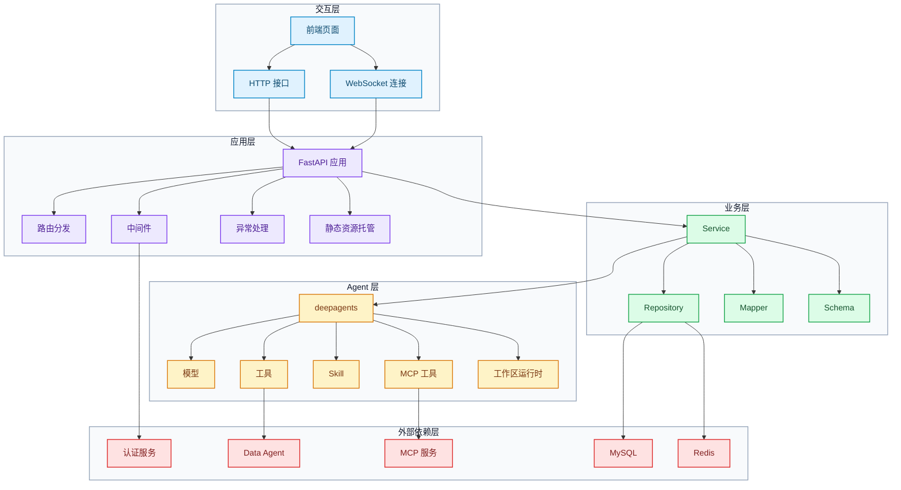
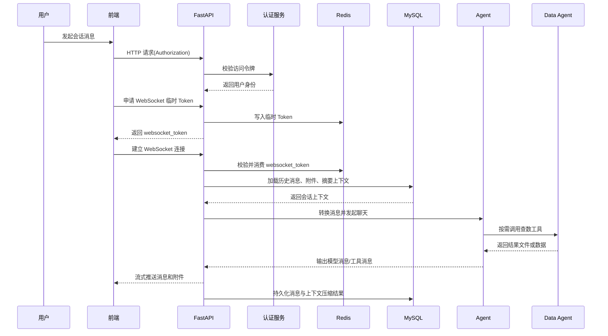

# Insight Agent 文档

## 1. 项目介绍

### 1.1 功能介绍
`insight-agent` 是一个面向归因分析场景的智能体应用。它主要服务于业务分析、经营诊断和问题定位这类需要“先提出问题，再逐步收集证据，最后形成分析结论”的工作。和普通问答式聊天应用不同，这个项目强调的不只是模型给出一句回答，而是让系统能够围绕一个真实分析任务持续推进，直到生成阶段性结论、分析材料和可交付结果。

在很多真实业务场景里，用户面对的问题往往不是一句话就能回答清楚的。比如某个指标为什么下滑、某个业务区域为什么异常、某次活动为什么效果不达预期，这些问题通常都需要先拆解，再查数，再结合上下文做判断，最后把结果整理成可复用的输出。`insight-agent` 做的事情，就是把这条原本依赖人工来回切换工具、查找信息、整理文档的链路，尽量收拢进一次连续的智能分析流程里。

对使用者来说，它的价值不只是“更快拿到一个答案”，而是把分析过程本身也沉淀下来。用户可以保留历史会话、继续追问前面的结论、复用已经上传的附件和已经生成的中间产物，从而把一次分析逐渐发展成一个可持续推进的工作过程。


### 1.2 核心能力
- 会话管理：提供完整的会话管理能力，包括创建会话、获取历史消息、删除会话
- 流式聊天：提供基于 WebSocket 的流式聊天能力，把模型回复、工具调用和工具结果实时返回给前端
- Agent 运行时：基于 `deepagents` 组织 Agent 运行时，统一挂载模型、自定义工具、MCP 工具和 Skill
- 工作区机制：为每个用户会话分配独立工作区，用来承接上传附件、分析中间产物和最终报告文件
- 数据查询：通过 `db_query` 查询业务数据，并把结果沉淀为工作区内可继续分析的文件
- 文件返回：通过 `return_file` 把工作区中的分析结果文件作为附件返回给用户
- 消息转换：通过消息 Schema 与 Mapper 打通前端消息、数据库记录和 Agent 运行时消息三种格式
- 上下文管理：支持上下文压缩与恢复，控制长对话成本，同时保持历史会话可继续追问
- 用户鉴权：通过认证中间件、临时 WebSocket Token 和用户上下文实现用户鉴权与会话隔离

### 1.3 技术栈与依赖
- 后端：Python、FastAPI、SQLAlchemy、Redis、DeepAgents、LangChain 相关组件
- 前端：React、Vite、TypeScript、Zustand、shadcn/ui
- 数据与存储：MySQL、Redis
- 外部依赖：认证服务、Data Agent、MCP 服务

### 1.4 系统架构


- 交互层：前端页面通过 HTTP 与 WebSocket 调用后端接口
- 应用层：FastAPI 应用负责路由分发、中间件处理、异常处理和静态资源托管
- 业务层：Service、Repository、Mapper、Schema 共同完成会话管理、消息持久化与协议转换
- Agent 层：`deepagents` 负责组织模型、工具、Skill、MCP 工具和工作区运行时
- 外部依赖层：认证服务、Data Agent、MCP 服务、MySQL、Redis 为系统提供鉴权、数据、扩展能力和存储支持

### 1.5 一次完整请求的生命周期


- 用户在前端发起一次会话消息，请求先经过认证、路由和上下文准备
- 普通 HTTP 请求通过请求头携带访问令牌，WebSocket 链路先通过 HTTP 申请临时 Token 再建立连接
- 后端加载历史消息、附件信息和必要的摘要上下文，并转换成 Agent 可消费的消息格式
- Agent 在 Skill 约束下结合模型推理，决定直接回复、调用内建工具，或进一步使用 MCP 工具
- 工具执行产生的数据文件、分析结果或附件被写入对应会话工作区，并通过消息流实时回传
- 本轮产生的用户消息、模型消息、工具消息和上下文压缩结果被持续写入数据库，供后续追问和恢复使用

## 2. 项目基础模块

### 2.1 项目目录结构
```text
insight-agent/                项目根目录，统一组织后端、前端、配置与 Agent 资源
├── app/                      后端主目录，承载应用、Agent 和业务逻辑
│   ├── main.py               后端入口，负责创建应用、注册中间件与路由
│   ├── config.py             配置加载入口，统一解析运行配置
│   ├── core/                 Agent 核心目录，包含 Agent、MCP 和工具
│   ├── routers/              路由目录，对外提供 HTTP 与 WebSocket 接口
│   ├── services/             服务目录，组织聊天等核心业务流程
│   ├── schemas/              协议目录，定义前后端交互数据结构
│   ├── mappers/              转换目录，负责不同消息格式之间的映射
│   ├── entities/             实体目录，定义数据库实体模型
│   ├── repositories/         仓储目录，封装数据库读写逻辑
│   ├── middlewares/          中间件目录，处理认证与日志追踪
│   ├── exceptions/           异常目录，定义业务异常和统一异常处理
│   └── utils/                工具目录，封装数据库、Redis、HTTP、日志等能力
├── fd/                       前端目录，提供现成页面代码与构建资源
├── configs/                  配置目录，存放 `config.yml` 与 `.env`
├── sql/                      SQL 目录，存放数据库建表脚本
└── .deepagents/              DeepAgents 资源目录，存放 Skills 和会话工作区
```

### 2.2 项目依赖
依赖如下：
- Web 框架与接口能力：`fastapi[standard]`
- 数据库与 ORM：`sqlalchemy`、`asyncmy`、`pymysql`
- 数据库辅助工具：`sqlacodegen`
- 缓存与临时状态：`redis`
- Agent 与模型相关：`deepagents`、`openai`、`langchain-openai`、`langchain-mcp-adapters`
- 配置与日志：`omegaconf`、`loguru`
- 数据分析与文件处理：`pandas`、`pdfplumber`、`pypdf`

附代码：
- [pyproject.toml](./insight-agent/pyproject.toml)

### 2.3 配置文件与配置加载
这个项目的配置主要分成两类：一类是描述系统行为的普通配置；另一类是更敏感的环境配置，例如账号、密钥、地址和令牌。这两类配置分别落在 `configs/config.yml` 和 `configs/.env` 中，既方便管理，也能避免把敏感信息硬编码到代码里。

配置加载入口统一放在 `app/config.py`。应用启动时先从环境变量中读取 `.env`，再结合 `config.yml` 组织成项目内部统一使用的配置对象。

配置项主要包括：
- 数据库连接配置
- Redis 连接配置
- 模型相关配置
- MCP 服务配置
- 认证服务地址与接口配置
- 跨域配置
- 服务启动端口

附代码：
- [config.yml](./insight-agent/configs/config.yml)
- [.env](./insight-agent/configs/.env)
- [config.py](./insight-agent/app/config.py)

### 2.4 通用工具模块
`app/utils/` 用来集中放置通用基础能力，供路由、服务、工具和中间件统一复用，避免重复实现数据库、Redis、日志和上下文等底层逻辑。

#### 2.4.1 数据库工具
`db.py` 统一管理数据库引擎、会话工厂和 FastAPI 依赖注入入口。项目后续无论是 Repository、Service 还是 Router，都不直接创建数据库连接，而是从这里拿到统一的 `AsyncSession`。

模块职责：
- 根据配置生成数据库连接
- 统一创建并复用数据库引擎与会话工厂
- 对外提供 FastAPI 可直接注入的数据库会话依赖

设计重点：
- 数据库连接细节统一收口，业务层不直接处理连接创建
- 会话获取方式统一，后续 Router 和 Service 都走同一套入口
- 数据库层保持异步模式，和整个 FastAPI 调用链保持一致
- 应用关闭时可以统一释放数据库相关资源

项目主库的依赖函数通过 `get_app_db` 提前完成注册，后续业务代码可直接注入使用。

附代码：
- [db.py](./insight-agent/app/utils/db.py)

#### 2.4.2 Redis 工具
Redis 工具负责统一初始化和获取 Redis 客户端，主要服务于临时状态、短期缓存和一次性 Token 这类场景，避免业务代码重复维护连接。

附代码：
- [redis.py](./insight-agent/app/utils/redis.py)

#### 2.4.3 HTTP 客户端工具
HTTP 客户端工具负责统一封装对外部 HTTP 服务的调用入口，方便后续访问认证服务、Data Agent 或其他外部接口时复用同一套客户端配置。

附代码：
- [http_client.py](./insight-agent/app/utils/http_client.py)

#### 2.4.4 日志与上下文工具
日志工具负责统一日志初始化和输出格式；上下文工具负责管理请求级上下文信息，例如用户 ID。两者配合后，链路日志和业务调用就能共用同一份上下文数据。

日志落文件时会先从上下文中读取请求相关信息，例如 `request_id`、`trace_id`、`user_id`、请求路径和响应耗时，再和本次日志消息一起组装成 JSON，最终按 `jsonl` 格式写入文件。方便后续排查问题、链路检索和日志分析。

附代码：
- [context.py](./insight-agent/app/utils/context.py)
- [log.py](./insight-agent/app/utils/log.py)

### 2.5 异常体系与统一错误处理
异常模块统一放在 `app/exceptions/` 下，用来集中管理错误定义和错误返回格式，避免业务代码里到处写 `HTTPException`。

#### 2.5.1 基础异常
基础异常定义在 `base.py` 中，项目里的自定义异常都从 `AppError` 继承。基础字段包括：
- `code`：业务错误码
- `message`：默认错误消息
- `status_code`：HTTP 状态码
- `detail`：可选的补充信息

在这个基础上，又定义了一组通用异常基类，包括：
- `ValidationError`：参数校验失败
- `AuthError`：认证失败
- `PermissionDeniedError`：权限不足
- `NotFoundError`：资源不存在
- `ConflictError`：资源冲突
- `BadRequestError`：请求参数错误

后面的业务异常直接基于这些基类继续细分。

附代码：
- [base.py](./insight-agent/app/exceptions/base.py)

#### 2.5.2 业务异常
业务异常按领域拆分到不同文件里，主要包括：
- `auth_error.py`：认证相关异常
- `chat_error.py`：聊天相关异常

定义的业务异常包括：
- `MissingAccessTokenError`：缺少访问令牌
- `InvalidAccessTokenError`：访问令牌无效
- `AuthServiceUnavailableError`：认证服务不可用
- `AuthServiceResponseError`：认证服务响应异常
- `ConversationNotFound`：对话不存在

这种拆分方式有以下优点：
- 错误定义和业务模块对应，查找更方便
- 每个异常都有稳定的错误码和错误消息
- 路由和服务里可以直接抛业务异常，不需要自己拼响应

附代码：
- [auth_error.py](./insight-agent/app/exceptions/auth_error.py)
- [chat_error.py](./insight-agent/app/exceptions/chat_error.py)

#### 2.5.3 统一异常处理器
异常处理器定义在 `handlers.py` 中，负责把不同来源的异常统一收敛成稳定的 JSON 返回格式。处理的异常类型包括：
- `AppError`
- FastAPI 的 `RequestValidationError`
- FastAPI 的 `HTTPException`
- 其他未捕获异常

最终返回结构会统一包含：
- `code`
- `exc_type`
- `message`
- `detail`
- `trace_id`（如果请求上下文中存在）

前端获得的错误结构因此保持稳定，后端日志中也能保留对应的异常信息和链路标识。

附代码：
- [handlers.py](./insight-agent/app/exceptions/handlers.py)

### 2.6 中间件

#### 2.6.1 `trace` 与日志体系
`trace` 中间件负责给每个请求补齐统一的链路信息，并把这些信息写入 `ContextVar`，供后续日志输出和业务处理复用。

这一中间件主要处理以下内容：
- 生成或继承 `request_id`
- 生成或继承 `trace_id`
- 提取客户端 IP、请求方法和请求路径
- 记录请求开始、处理中、完成或失败状态
- 统计请求耗时
- 把 `X-Request-ID` 和 `X-Trace-ID` 写回响应头

附代码：
- [trace.py](./insight-agent/app/middlewares/trace.py)

#### 2.6.2 `auth` 中间件设计
`auth` 中间件负责统一处理访问令牌校验。将认证放在中间件层，请求在进入具体业务路由之前先完成身份确认，这样后面的 Router、Service 和 Agent 调用都可以直接使用已经解析好的用户信息。

该实现会先根据请求路径判断接口是否需要鉴权。`/health`、`/docs`、`/openapi.json`、`/redoc` 等精确路径会直接放行，`/assets`、`/auth-api` 等前缀路径也会放行；真正进入业务处理的 HTTP 接口主要通过 `/api` 前缀统一纳入鉴权范围。由此可以将需要保护的业务接口与不需要保护的静态资源、文档接口区分开来。

执行鉴权时，中间件会：
- 从请求头里读取 `Authorization`
- 调用认证服务的 introspection 接口
- 校验访问令牌是否有效
- 先通过 `auth_schema.py` 把认证服务返回结果转换成项目内部统一数据结构
- 再把解析出的用户信息写入 `request.state.payload`
- 同时把用户 ID 写入上下文变量，供后续日志和业务链路使用

如果认证失败，不会继续进入业务逻辑，而是直接通过统一异常处理返回约定格式的错误响应。

附代码：
- [auth.py](./insight-agent/app/middlewares/auth.py)
- [auth_schema.py](./insight-agent/app/schemas/auth_schema.py)

## 3. Agent 组装

### 3.1 Agent 由哪些组件组成
Agent 运行时由模型、工作区、工具、MCP、Skill 和 `deepagents` 提供的运行时能力共同组成。

其中各部分职责如下：
- 模型：负责推理与决策，决定回复内容、是否调用工具、调用哪个工具
- 工作区：负责承接会话级文件、中间分析产物和最终交付文件
- 工具：负责执行数据库查询、文件返回等具体动作
- MCP：负责接入外部扩展能力
- Skill：负责注入任务方法论、执行规范和交付要求
- `TodoListMiddleware`：负责辅助 Agent 维护任务拆解和执行步骤
- `SubAgentMiddleware`：负责在复杂任务下支持子代理拆分与协作
- `SummarizationMiddleware`：负责在长对话场景下压缩上下文，降低上下文长度和推理成本


### 3.2 工作区机制
每个会话都会分配一个独立的工作区，用来保存用户上传的附件、中间的分析过程文件，以及最终生成的报告或交付物。

工作区机制主要解决三个问题：
- 会话级隔离：不同用户、不同会话的文件不会混在一起
- 文件承接：工具执行结果可以稳定落盘，而不是只停留在内存里
- 结果回传：生成的文件可以继续被 Agent 使用，也可以返回给前端作为附件展示

工作区设计和后面的工具系统、附件系统是直接关联的：
- `db_query` 查询出来的数据会写入工作区文件
- 文档和图片附件会先进入工作区，再决定如何进入模型上下文
- `return_file` 返回给前端的文件，本质上也是从工作区中取出

因此，工作区是 Agent 在这个项目里能够处理文件、沉淀中间结果和交付最终产物的基础前提。

### 3.3 工具
#### 3.3.1 `db_query`
`db_query` 是项目里最核心的业务工具之一，负责把自然语言查询需求发送给 Data Agent，并将最终结果写入对应会话工作区。

工具职责：
- 接收自然语言查询需求
- 调用外部 Data Agent 查询业务数据
- 解析 SSE 流式返回结果
- 将最终结果写入工作区文件
- 返回文件路径、字段信息和预览数据

设计重点：
- 数据库访问没有直接暴露给 Agent，而是通过 Data Agent 做隔离
- 查询结果不会只停留在内存里，而是会沉淀成工作区文件，方便后续继续分析
- 表格结果写成 CSV，非表格结果写成 JSON
- 返回结构里包含 `pandas_read_hint`、`preview_rows`、`row_count` 等信息，便于后续工具链继续使用

附代码：
- [db_query.py](./insight-agent/app/core/tools/db_query.py)

#### 3.3.2 `return_file`
`return_file` 负责把工作区中的文件返回给用户。这个工具本身不直接传输二进制内容，而是返回一个结构化结果，后续再由消息映射和前端展示逻辑把它转换成附件。

工具职责：
- 接收工作区相对路径
- 校验文件是否存在
- 校验路径是否越出工作区范围
- 返回标准化的文件信息结构

设计重点：
- 路径只允许是工作区下的相对路径
- 需要显式处理路径逃逸问题
- 返回值中同时包含工作区路径和面向用户展示的原始文件名
- 工具结果可以继续被 Mapper 转换成附件结构，供前端直接展示

附代码：
- [return_file.py](./insight-agent/app/core/tools/return_file.py)

### 3.4 MCP 接入
#### 3.4.1 `mcp.py` 的实现与 Agent 接入
`mcp.py` 的作用是把配置文件中的多个 MCP 服务统一初始化成一个客户端。实现中会先根据配置里的 `transport` 字段，把不同服务映射到对应的连接类型，例如：
- `sse`
- `stdio`
- `websocket`
- `streamable_http`

随后，这些连接会被统一交给 `MultiServerMCPClient` 管理。这样项目内部不需要分别维护多个 MCP 服务实例，而是通过一个统一客户端获取全部 MCP 工具。

在 Agent 初始化时，`agent.py` 会先调用：

```python
mcp_tools = await mcp_client.get_tools()
```

然后把 MCP 工具和内建工具一起放进最终的工具列表：

```python
tools = [db_query, return_file, *mcp_tools]
```

这样 Agent 看见的是一份统一工具集，不需要区分某个工具来自项目内部实现还是来自 MCP 服务。

附代码：
- [mcp.py](./insight-agent/app/core/mcp.py)

### 3.5 Skill 系统
#### 3.5.1 Skill 的作用与目录组织
Skill 负责为 Agent 补充任务方法论、执行规范和交付要求。工具解决的是单步动作，例如查数、返回文件；Skill 解决的是“遇到某类任务时，应该按什么流程推进，产出什么结果”。

项目里的 Skill 放在 `.deepagents/skills/` 下，目录中既有文档处理类 Skill，也有面向归因分析场景的 `insight` Skill。Agent 初始化时会通过：

```python
create_deep_agent(
    ...,
    skills=["/skills/"],
)
```

把这一目录整体挂载进去，使 Agent 在运行时可以发现并使用这些 Skill。

#### 3.5.2 `insight` Skill 如何约束分析流程
`insight` Skill 负责把归因分析任务约束成固定工作流，避免 Agent 只停留在单点查数或自由发挥。

它约束的内容主要包括：
- 任务进入条件：当问题属于归因分析、经营诊断、活动复盘、营销分析等场景时，按分析模式推进，而不是只返回一条查询结果
- 数据获取方式：数据库数据统一通过 `db_query` 获取，后续分析优先基于查询结果文件继续处理
- 执行环境约束：工作区内的 Python 命令统一使用 `uv run`，依赖安装统一使用 `uv add`
- 分析动作约束：默认补齐基线对比、规模拆解、结构拆解、效率拆解、贡献拆解和异常识别
- 分析维度约束：围绕用户、渠道、商品、优惠、地域、时间、行为等维度展开，并按场景补充交叉分析
- 文件产物约束：原始查询结果、中间分析文件和最终交付文件分别落到约定目录中，便于继续分析和回传
- 报告交付约束：详细分析场景默认输出 HTML 报告，并包含摘要、指标卡片、多维拆解、结论与建议等结构
- 最终回复约束：回复中需要交代分析问题、数据来源、归因结论和生成文件

这些约束共同定义了归因分析任务的执行方式、文件组织方式和最终交付方式。

附代码：
- [insight/SKILL.md](./insight-agent/.deepagents/skills/insight/SKILL.md)
- [render_report.py](./insight-agent/.deepagents/skills/insight/scripts/render_report.py)

### 3.6 Agent 的组装与加载
`agent.py`负责统一定义 Agent 的目录结构、工作区后端、组件装配方式和实例获取方式。

目录与路径常量包括：
- `.deepagents/skills/`：Skill 目录
- `.deepagents/workspaces/`：会话工作区根目录

工作区目录按用户和会话组织：
- 路径格式为 `.deepagents/workspaces/user_{user_id}/{conversation_id}`
- `get_workspace_dir()` 负责确保目录存在，并在请求进入后为对应会话准备工作区

Agent 的后端通过 `_backend_factory()` 动态创建，包含两部分：
- 工作区后端：使用 `LocalShellBackend`，让 Agent 可以在会话工作区中读写文件和执行命令
- Skill 后端：使用 `FilesystemBackend`，把 `/skills/` 路由到 Skill 目录

Agent 的组装由 `_build_agent()` 完成，装配内容包括：
- 模型：从配置中读取模型名称、`base_url`、`api_key` 和其他参数
- 内建工具：`db_query`、`return_file`
- MCP 工具：通过 `mcp_client.get_tools()` 获取
- Backend：使用 `_backend_factory`
- Skill：通过 `skills=["/skills/"]` 挂载

实例获取通过 `get_agent()` 统一完成：
- Agent 实例保存在全局变量 `_agent` 中
- 第一次请求进入时按需创建
- 后续请求直接复用已有实例
- 通过 `_agent_lock` 保证并发场景下只创建一次

这种加载方式把模型、工具、MCP、Skill 和工作区后端集中在一个入口装配，后续聊天链路只需要调用 `get_agent()` 获取实例，不需要重复初始化。

附代码：
- [agent.py](./insight-agent/app/core/agent.py)

## 4. 聊天相关数据模型与消息转换

### 4.1 接口设计与表设计
项目实现了几类核心接口：会话管理、历史消息获取、WebSocket 聊天、附件上传与下载，以及 WebSocket 临时令牌获取。这些接口能力背后都需要稳定的存储结构来承接。

在具体实现上，`sql/mysql/chat.sql` 定义了聊天系统依赖的核心表结构，`app/init_db.py` 负责初始化数据库表；而 WebSocket 临时令牌和会话文件则分别落在 Redis 与会话工作区中。也就是说，这里的“数据承接”不只包含 MySQL 表，还包含 Redis 和工作区文件系统。

可以把接口能力与底层存储的对应关系理解为：

| 接口/能力              | 对应存储                           | 说明                                                                    |
| ---------------------- | ---------------------------------- | ----------------------------------------------------------------------- |
| 会话管理               | `conversation`                     | 保存对话标题、用户归属、草稿状态和逻辑删除状态。                        |
| 历史消息获取与聊天链路 | `message`                          | 保存用户消息、模型消息、工具消息，以及消息关联的附件元数据。            |
| 上下文压缩与历史恢复   | `context_compaction`               | 保存对话摘要结果，便于后续恢复历史上下文并减少长对话成本。              |
| WebSocket 临时建连     | Redis `ws_token:{token}`           | 保存短期有效的临时令牌，把 HTTP 鉴权结果安全传递到 WebSocket 建连过程。 |
| 附件上传与文件返回     | 会话工作区 + `message.attachments` | 文件本体保存在会话工作区，附件元数据随消息一起持久化。                  |

附代码：
- [chat.sql](./insight-agent/sql/mysql/chat.sql)
- [init_db.py](./insight-agent/app/init_db.py)

### 4.2 项目中的三种消息格式
- Agent 运行时使用的 LangChain/DeepAgents 消息
- 前后端交互的 Schema 消息
- 数据库存储的 Entity 消息

LangChain/DeepAgents 消息是 Agent 真正消费和产出的运行时格式，Schema 和 Entity 都是在运行时消息基础上做适配

#### 4.2.1 运行时消息
运行时消息主要有三种：
- `HumanMessage`：用户输入消息
- `AIMessage`：模型输出消息，可能包含 `tool_calls`
- `ToolMessage`：工具调用结果消息

在这个项目里，运行时消息在进入 Agent 前会被整理成兼容 LangChain 的字典结构。

`HumanMessage` 对应的核心字段是 `role` 和 `content`：

```python
{
    "role": "user",
    "content": [
        {"type": "text", "text": "..."},
        {"type": "image_url", "image_url": "data:image/png;base64,..."},
    ],
}
```

`content` 是 `list[dict]`，项目里主要有两种片段格式：
- 文本片段：`{"type": "text", "text": "..."}`
- 图片片段：`{"type": "image_url", "image_url": "..."}`

如果用户消息带有文档附件，不会直接把附件本身放进运行时消息，而是先把附件信息转成一段文本提示，再追加到 `content` 里；如果带的是图片附件，则会读取工作区文件并转成 `data URL` 放进 `content`。

`AIMessage` 对应的核心字段是 `content` 和 `tool_calls`：

```python
{
    "role": "assistant",
    "content": [
        {"type": "text", "text": "..."},
    ],
    "tool_calls": [
        {
            "type": "tool_call",
            "id": "...",
            "name": "...",
            "args": {...},
        }
    ],
}
```

其中：
- `content` 仍然是 `list[dict]`，主要承载文本内容
- `tool_calls` 是 `list[dict]`
- 每个 `tool_call` 包含 `id`、`name`、`args`

`ToolMessage` 对应的是工具执行结果，核心字段如下：

```python
{
    "role": "tool",
    "tool_call_id": "...",
    "name": "...",
    "content": "...",
}
```

其中：
- `tool_call_id` 用来和前面的工具调用对应
- `name` 是工具名称
- `content` 是工具执行结果，项目里统一按字符串处理

#### 4.2.2 Schema 消息
Schema 消息负责前后端交互，是运行时消息在应用层的结构化表达。核心结构是 `MessageSchema`：

```python
class MessageSchema(BaseModel):
    message_id: int | None
    context_seq: int | None
    role: Literal["user", "assistant", "tool", "system"]
    parts: list[MessagePart]
    attachments: list[Attachment] | None
    finish_reason: Literal["stop", "tool_calls"] | None
    timestamp: datetime | None
```

其中几个关键字段的设计含义是：
- `message_id`：消息主键，主要用于数据库回放后的消息标识
- `context_seq`：消息在该对话话中的顺序号
- `role`：消息角色，对应用户、模型、工具等来源
- `parts`：消息主体内容
- `attachments`：附件列表
- `finish_reason`：模型输出结束原因
- `timestamp`：消息时间戳

Schema 消息里最核心的设计是 `parts`。项目把一条消息拆成统一的片段结构，支持四种：

```python
TextContent:
{"type": "text", "text": "..."}

ImageContent:
{"type": "image_url", "image_url": "..."}

ToolCallPart:
{"type": "tool_call", "tool_call_id": "...", "name": "...", "args": {...}}

ToolResultPart:
{"type": "tool_result", "tool_call_id": "...", "name": "...", "content": "..."}
```

附件单独放在 `attachments` 里，而不是混在 `parts` 中。附件结构如下：

```python
{"raw_name": "...", "path": "..."}
```

这种设计带来的直接效果包括：
- 前端展示时可以统一按 `parts` 渲染文本、图片、工具调用和工具结果
- 附件和消息主体分离，上传文件、返回文件、历史恢复都更清楚
- 一条消息可以同时包含文本和工具调用，不需要靠额外字段拼接

附代码片段：
来源：[chat_schema.py](./insight-agent/app/schemas/chat_schema.py)

```python
class TextContent(BaseModel):
    type: Literal["text"] = "text"
    text: str = Field(..., description="文本内容")


class ImageContent(BaseModel):
    type: Literal["image_url"] = "image_url"
    image_url: str = Field(..., description="图片链接")


class ToolCallPart(BaseModel):
    type: Literal["tool_call"] = "tool_call"
    tool_call_id: str = Field(..., description="工具调用ID")
    name: str = Field(..., description="工具名称")
    args: dict = Field(default_factory=dict, description="工具参数")


class ToolResultPart(BaseModel):
    type: Literal["tool_result"] = "tool_result"
    tool_call_id: str = Field(..., description="工具调用ID")
    name: str = Field(..., description="工具名称")
    content: str = Field(..., description="工具执行结果")


class Attachment(BaseModel):
    raw_name: str = Field(..., description="原始附件名称")
    path: str = Field(..., description="工作区相对路径")


MessageRole = Literal["user", "assistant", "tool", "system"]
FinishReason = Literal["stop", "tool_calls"]
MessagePart = Annotated[
    TextContent | ImageContent | ToolCallPart | ToolResultPart,
    Field(discriminator="type"),
]


class MessageSchema(BaseModel):
    message_id: int | None = Field(default=None, description="消息ID")
    context_seq: int | None = Field(default=None, description="对话内上下文顺序号")
    role: MessageRole = Field(..., description="发送者")
    parts: list[MessagePart] = Field(..., description="消息片段")
    attachments: list[Attachment] | None = Field(default=None, description="附件列表")
    finish_reason: FinishReason | None = Field(default=None, description="完成原因")
    timestamp: datetime | None = Field(default=None, description="发送时间")
```

这里有三个类型别名需要特别注意：
- `MessageRole` 用字面量约束消息发送方，只允许 `user`、`assistant`、`tool`、`system`
- `FinishReason` 用字面量约束消息结束原因，目前只允许 `stop` 和 `tool_calls`
- `MessagePart` 用带判别字段的联合类型约束消息片段，要求每个片段都通过 `type` 字段区分具体结构

#### 4.2.3 Entity 消息
Entity 消息负责数据库持久化，是运行时消息和 Schema 消息在存储层的落地形式。项目中对应的是 `app/entities/chat.py` 里的 `Message` 实体：

```python
class Message(Base):
    id: int
    conversation_id: int
    context_seq: int
    role: str
    parts: str
    create_at: datetime
    yn: int
    finish_reason: str | None
    attachments: str | None
```

和 Schema 相比，Entity 更强调存储层落地，因此这里有两个关键差异：
- `parts` 在 Schema 里是 `list[MessagePart]`，在 Entity 里是 JSON 字符串
- `attachments` 在 Schema 里是 `list[Attachment] | None`，在 Entity 里也是 JSON 字符串或 `None`

Entity 层保存的消息大致可以表示为：

```python
{
    "id": 1,
    "conversation_id": 1001,
    "context_seq": 3,
    "role": "assistant",
    "parts": "[{\"type\":\"text\",\"text\":\"...\"}]",
    "attachments": "[{\"raw_name\":\"report.xlsx\",\"path\":\"outputs/report.xlsx\"}]",
    "finish_reason": "stop",
}
```

这一设计的核心考虑包括：
- 表结构保持稳定，不需要为每一种消息片段单独拆表
- `parts` 和 `attachments` 仍然保留结构化信息，后续可以完整恢复成 Schema

### 4.3 消息转换 Mapper
在运行过程中，这三种消息格式会随着请求链路不断相互转换。  
用户消息进入系统时，通常先以 Schema 形式承接前端请求；需要持久化时，会再转换成 Entity 写入数据库；真正送进 Agent 推理时，又要转换成 LangChain/DeepAgents 能消费的运行时消息。  
反过来，Agent 在运行过程中产出的模型消息和工具消息，也需要先转回 Schema，才能继续完成前端展示和数据库持久化。

Mapper 层的职责，就是在这些阶段之间做稳定、可逆的格式转换，确保同一条消息在不同层里始终保持一致语义。

#### 4.3.1 `langchain_message_to_schema`
这一段负责把 Agent 运行时输出的消息转换成 `MessageSchema`，供前端展示和后续持久化。

处理的消息类型主要包括：
- `AIMessage`
- `ToolMessage`

`AIMessage` 的转换规则是：
- 角色固定写成 `assistant`
- `content` 转成 `TextContent`
- `tool_calls` 转成一个或多个 `ToolCallPart`
- `response_metadata.finish_reason` 写入 `finish_reason`
- 当前实现要求 `content` 必须是字符串
- 转换时会补上当前时间戳

`ToolMessage` 的转换规则是：
- 角色固定写成 `tool`
- 工具结果统一转成 `ToolResultPart`
- `tool_call_id` 和 `name` 原样保留，方便前端把工具调用和工具结果对应起来
- `content` 会统一转成字符串写入 `ToolResultPart.content`
- 转换时同样会补上当前时间戳
- `finish_reason` 在工具消息中固定为 `None`

其中需要单独说明的是文件返回类工具：
- 项目里对应的是 `return_file`
- 如果工具返回内容是成功的 JSON 结构
- 会额外从结果中提取 `path` 和 `raw_name`
- 再组装成 `attachments`
- 如果不是 `return_file`，或者返回结果不是合法成功结构，则不会生成附件信息

前端获得的因此不只是文本结果，还包括可以直接展示的附件信息。

附代码片段：
来源：[message_mapper.py](./insight-agent/app/mappers/message_mapper.py)

```python
def langchain_message_to_schema(
    message: AIMessage | ToolMessage,
) -> chat_schema.MessageSchema | None:
    """将 LangChain 消息转换为 MessageSchema，同时添加时间戳"""
    timestamp = datetime.now()

    # 处理 AIMessage
    if isinstance(message, AIMessage):
        # 转换 content 与 tool_calls 为消息片段对象
        content = message.content
        assert isinstance(content, str), "AI message content is not string"
        parts = [
            chat_schema.TextContent(text=content),
            *[
                chat_schema.ToolCallPart(
                    tool_call_id=tool_call.get("id") or "",
                    name=tool_call.get("name") or "",
                    args=tool_call.get("args", {}),
                )
                for tool_call in message.tool_calls
            ],
        ]
        return chat_schema.MessageSchema(
            role="assistant",
            parts=parts,
            finish_reason=message.response_metadata.get("finish_reason"),
            timestamp=timestamp,
        )

    # 处理 ToolMessage
    elif isinstance(message, ToolMessage):
        attachments: list[chat_schema.Attachment] | None = None

        # 处理 return_file 的工具结果
        if message.name == "return_file":
            if isinstance(message.content, str):
                try:
                    payload = json.loads(message.content)
                except json.JSONDecodeError:
                    payload = None

                if isinstance(payload, dict) and payload.get("status") == "success":
                    path = payload.get("path")
                    raw_name = payload.get("raw_name")
                    if isinstance(path, str) and isinstance(raw_name, str):
                        attachments = [
                            chat_schema.Attachment(raw_name=raw_name, path=path)
                        ]

        return chat_schema.MessageSchema(
            role="tool",
            parts=[
                chat_schema.ToolResultPart(
                    tool_call_id=message.tool_call_id,
                    name=message.name or "",
                    content=str(message.content),
                )
            ],
            attachments=attachments,
            finish_reason=None,
            timestamp=timestamp,
        )

    else:
        return None
```

#### 4.3.2 `agent_chunk_to_schemas`
在实际运行过程中，从 Agent 流式拿到的并不是一条条已经拆好的消息，而是一个个 `chunk`。`chunk` 大致会是下面几种形态：

```python
{"model": {"messages": [AIMessage(...)]}}
{"tools": {"messages": [ToolMessage(...)]}}
{"SkillsMiddleware.before_agent": {...}}
{"TodoListMiddleware.after_model": None}
```

`chunk` 本身是一个节点名到节点输出的映射，不同节点返回的内容结构并不完全一样。真正和前端展示、消息持久化直接相关的，主要是 `model.messages` 和 `tools.messages` 里的消息；而像 `SkillsMiddleware.before_agent`、`TodoListMiddleware.after_model` 这类中间件节点，更多是运行过程信息，不会直接转成前端消息。

因此我们先调用 `agent_chunk_to_schemas`：它先检查 `chunk` 里是否存在 `model` 或 `tools` 节点，并进一步读取其中的 `messages` 列表；只有拿到运行时消息后，才会逐条调用 `langchain_message_to_schema` 把它们解析成 `MessageSchema`。

它当前主要做了两件事：
- 同时处理 `model` 和 `tools` 两类节点返回的消息
- 把能够成功转换的消息统一收集成 `list[MessageSchema]`

至于摘要压缩相关的 `_summarization_event`，则不属于普通消息转换范畴，因此不会在这里被解析成 `MessageSchema`。这一类特殊事件会在后面的聊天执行链路章节里单独展开说明。

附代码片段：
来源：[message_mapper.py](./insight-agent/app/mappers/message_mapper.py)

```python
def agent_chunk_to_schemas(chunk: dict) -> list[chat_schema.MessageSchema]:
    """将 Agent 流式输出块转换为 MessageSchema 列表"""
    schemas: list[chat_schema.MessageSchema] = []

    # 处理 model 和 tools 两类节点的返回消息
    for key in ("model", "tools"):
        if (
            (key in chunk)
            and (messages := chunk[key].get("messages"))
            and (isinstance(messages, list))
        ):
            for message in messages:
                if schema := langchain_message_to_schema(message):
                    schemas.append(schema)

    return schemas
```

#### 4.3.3 `schema_to_entity`
这一段负责把 `MessageSchema` 写入数据库实体。

`schema_to_entity` 的处理重点是：
- 先检查 `context_seq` 是否存在，没有顺序号就不能落库
- 把 `parts` 从结构化对象序列化成 JSON 字符串
- 把 `attachments` 从结构化对象序列化成 JSON 字符串
- 补上 `conversation_id`、`context_seq` 等数据库落库所需字段
- 如果 `message_id` 和 `timestamp` 已经存在，也会一并回填到实体对象中

上述处理可以将前端和运行时使用的结构化消息稳定写入数据库。

附代码片段：
来源：[message_mapper.py](./insight-agent/app/mappers/message_mapper.py)

```python
def schema_to_entity(
    message: chat_schema.MessageSchema, conversation_id: int
) -> Message:
    """将 MessageSchema 转换为消息实体"""
    # 检查是否有上下文顺序号
    if message.context_seq is None:
        raise ValueError("Message context_seq is required")

    # 将消息片段对象转换为 json 字符串
    parts = json.dumps(
        [part.model_dump() for part in message.parts], ensure_ascii=False
    )
    # 将附件对象转换为 json 字符串
    attachments = (
        json.dumps(
            [attachment.model_dump() for attachment in message.attachments],
            ensure_ascii=False,
        )
        if message.attachments is not None
        else None
    )

    entity = Message(
        conversation_id=conversation_id,
        context_seq=message.context_seq,
        role=message.role,
        parts=parts,
        attachments=attachments,
        finish_reason=message.finish_reason,
    )

    if message.message_id is not None:
        entity.id = message.message_id
    if message.timestamp is not None:
        entity.create_at = message.timestamp

    return entity
```

#### 4.3.4 `entity_to_schema`
这一段负责把数据库实体恢复成 `MessageSchema`。

`entity_to_schema` 的处理重点是：
- 把数据库里的 `parts` JSON 字符串解析回 `TextContent`、`ImageContent`、`ToolCallPart`、`ToolResultPart`
- 把 `attachments` JSON 字符串解析回 `Attachment`
- 把数据库字段恢复成前端可以直接使用的 `MessageSchema`
- 如果 `parts` 里出现了不支持的消息片段类型，会直接抛出异常，避免非法数据继续向上游传播

附代码片段：
来源：[message_mapper.py](./insight-agent/app/mappers/message_mapper.py)

```python
def entity_to_schema(message: Message) -> chat_schema.MessageSchema:
    """将消息实体转换为 MessageSchema"""
    # 将 json 字符串转换为消息片段对象
    parts: list[chat_schema.MessagePart] = []
    for item in json.loads(message.parts):
        schema = {
            "text": chat_schema.TextContent,
            "image_url": chat_schema.ImageContent,
            "tool_call": chat_schema.ToolCallPart,
            "tool_result": chat_schema.ToolResultPart,
        }.get(item["type"])
        if schema is None:
            raise ValueError(f"Unsupported message part type: {item['type']}")
        parts.append(schema(**item))

    # 将 json 字符串转换为附件对象
    attachments = (
        [chat_schema.Attachment(**item) for item in json.loads(message.attachments)]
        if message.attachments
        else None
    )

    return chat_schema.MessageSchema(
        message_id=message.id,
        context_seq=message.context_seq,
        role=cast(chat_schema.MessageRole, message.role),
        parts=parts,
        attachments=attachments,
        finish_reason=cast(chat_schema.FinishReason | None, message.finish_reason),
        timestamp=message.create_at,
    )
```

#### 4.3.5 `schema_to_langchain_message`
这一段负责把 `MessageSchema` 转成 Agent 可直接消费的运行时消息。

对 `user` 和 `assistant` 角色，核心处理是两步：
- 把 `TextContent`、`ImageContent` 转成运行时 `content`
- 把 `ToolCallPart` 转成运行时 `tool_calls`

对 `tool` 角色，会单独提取 `ToolResultPart`，转换成：

```python
{
    "role": "tool",
    "tool_call_id": "...",
    "name": "...",
    "content": "...",
}
```

此外还包含以下特殊处理：
- 文档附件不会直接放进运行时消息，而是转成一段文本提示，告诉 Agent 文件已经保存到工作区、可以直接读取
- 图片附件会读取工作区文件，并转换成 `data URL` 放进 `content`
- 如果消息里有图片附件，就必须同时提供 `user_id` 和 `conversation_id`，用于定位工作区文件
- 如果图片文件已经丢失，不会中断流程，而是追加一段文本提示说明图片不可用

附代码片段：
来源：[message_mapper.py](./insight-agent/app/mappers/message_mapper.py)

```python
def schema_to_langchain_message(
    message: chat_schema.MessageSchema,
    user_id: int | None = None,
    conversation_id: int | None = None,
) -> dict[str, Any]:
    """将 MessageSchema 转换为 LangChain 消息"""
    # 工具消息
    if message.role == "tool":
        tool_result = next(
            part
            for part in message.parts
            if isinstance(part, chat_schema.ToolResultPart)
        )
        return {
            "role": "tool",
            "tool_call_id": tool_result.tool_call_id,
            "name": tool_result.name,
            "content": tool_result.content,
        }

    # 用户或模型消息
    content_parts: list[dict[str, Any]] = []
    tool_calls: list[dict[str, Any]] = []
    for part in message.parts:
        if isinstance(part, (chat_schema.TextContent, chat_schema.ImageContent)):
            content_parts.append(part.model_dump())
        elif isinstance(part, chat_schema.ToolCallPart):
            tool_calls.append(
                {"type": "tool_call", "id": part.tool_call_id, "name": part.name, "args": part.args}
            )

    # 处理带附件的消息
    if message.attachments and message.role == "user":
        # 图片附件
        image_attachments = []
        # 文件附件
        document_attachments = []

        for attachment in message.attachments:
            # 获取文件后缀
            suffix = (
                attachment.path.rsplit(".", 1)[-1].lower()
                if "." in attachment.path
                else ""
            )
            # 判断文件后缀是否为图片
            if suffix in {"png", "jpg", "jpeg", "gif", "webp", "bmp"}:
                image_attachments.append(attachment)
            else:
                document_attachments.append(attachment)

        if document_attachments:
            # 用户消息，提示用户上传过文件
            file_prompt = "用户上传的以下文件已保存到当前工作区，可直接读取："
            if content_parts:
                file_prompt = f"\n\n{file_prompt}"
            # 拼接附件信息
            attachment_lines = [
                file_prompt,
                *[
                    f"- 原始文件名：`{attachment.raw_name}`，工作区相对路径：`{attachment.path}`"
                    for attachment in document_attachments
                ],
            ]
            content_parts.append(
                chat_schema.TextContent(text="\n".join(attachment_lines)).model_dump()
            )

        if image_attachments:
            # 如果缺少 user_id 或 conversation_id，则报错
            if user_id is None or conversation_id is None:
                raise ValueError(
                    "user_id and conversation_id are required for image attachments"
                )

            image_loss_list = []
            for attachment in image_attachments:
                try:
                    # 将图片转换为 base64 内容
                    content_parts.append(
                        chat_schema.ImageContent(
                            image_url=_build_image_data_url(
                                user_id, conversation_id, attachment
                            )
                        ).model_dump()
                    )
                except OSError:
                    # 如果图片文件不存在，在 prompt 中添加提示
                    image_loss_list.append(
                        f"- 原始文件名：`{attachment.raw_name}`，工作区路径：`{attachment.path}`"
                    )
            if image_loss_list:
                image_loss_prompt = "用户之前上传了一张图片，但该文件当前已不存在："
                if content_parts:
                    image_loss_prompt = f"\n\n{image_loss_prompt}"
                image_loss_prompt += "\n".join(image_loss_list)
                content_parts.append(
                    chat_schema.TextContent(text=image_loss_prompt).model_dump()
                )

    payload: dict[str, Any] = {"role": message.role, "content": content_parts}
    if tool_calls:
        payload["tool_calls"] = tool_calls
    return payload
```

## 5. 接口功能实现

### 5.1 后端功能接口
- `GET /health`：健康检查
- `GET /api/chat/ls`：获取会话列表
- `POST /api/chat/create`：创建会话
- `POST /api/chat/update`：修改会话标题
- `POST /api/chat/delete`：删除会话
- `GET /api/chat/ls/{conversation_id}`：获取历史消息
- `POST /api/chat/attachment/upload`：上传附件
- `POST /api/chat/attachment/delete`：删除附件
- `GET /api/chat/attachment/get`：获取附件文件
- `POST /api/chat/ws-token`：创建 WebSocket 临时令牌
- `WS /api/chat/ws/chat`：流式聊天

### 5.2 会话与消息列表接口
#### 5.2.1 接口介绍
这一组接口负责承接聊天系统最基础的资源管理能力，包括会话本身的创建、更新、删除，以及历史消息列表的查询。

相关接口包括：
- `GET /api/chat/ls`：按当前用户查询会话列表
- `POST /api/chat/create`：创建会话，初始标题为“新对话”，可指定是否创建草稿会话
- `POST /api/chat/update`：校验会话归属后更新标题
- `POST /api/chat/delete`：逻辑删除会话，并一并清理消息、上下文压缩记录和工作区目录
- `GET /api/chat/ls/{conversation_id}`：查询某个会话下的历史消息列表

#### 5.2.2 相关 Repository
这一组接口背后主要依赖三个 Repository：
- `conversation_repo`
  负责会话的查询、创建、更新和逻辑删除，是会话接口最核心的数据访问层。
  附代码：
  - [conversation_repo.py](./insight-agent/app/repositories/conversation_repo.py)

- `message_repo`
  负责历史消息查询，以及删除会话时批量禁用该会话下的消息记录。
  附代码：
  - [message_repo.py](./insight-agent/app/repositories/message_repo.py)

- `context_compaction_repo`
  负责上下文压缩记录的写入、查询，以及删除会话时批量禁用压缩记录。
  附代码：
  - [context_compaction_repo.py](./insight-agent/app/repositories/context_compaction_repo.py)


#### 5.2.3 `GET /api/chat/ls`
`GET /api/chat/ls` 实现：
- 从认证信息中拿到当前用户 ID
- 调用 `conversation_repo.ls` 只查询当前用户自己的会话
- 把查询结果转换成 `ConversationListResponse`

附代码片段：
- [chat.py](./insight-agent/app/routers/api/chat.py)

```python
@router.get("/ls")
async def api_get_conversations(
    request: Request, db_session: Annotated[AsyncSession, Depends(get_app_db)]
) -> chat_schema.ConversationListResponse:
    """获取所有对话"""
    user_id = request.state.payload.sub
    conversations = await conversation_repo.ls(db_session, user_id)
    logger.info(f"Get conversations: conversation_ids={[i.id for i in conversations]}")
    return chat_schema.ConversationListResponse(
        conversations=[
            chat_schema.ConversationResponse(
                conversation_id=i.id,
                title=i.title,
                update_at=i.update_at,
            )
            for i in conversations
        ]
    )
```

- [chat_schema.py](./insight-agent/app/schemas/chat_schema.py)

```python


class ConversationResponse(BaseModel):
    conversation_id: int
    title: str
    update_at: datetime


class ConversationListResponse(BaseModel):
    conversations: list[ConversationResponse]
```

#### 5.2.4 `POST /api/chat/create`
`POST /api/chat/create` 实现：
- 调用 `conversation_repo.create` 创建会话
- 初始标题固定为“新对话”
- 允许通过 `is_draft` 控制是否创建草稿会话

草稿会话的处理流程如下：
- 前端可以先调用 `POST /api/chat/create` 创建 `is_draft=1` 的草稿会话
- 这类会话先出现在列表和工作区体系中，但还没有真正进入正式对话
- WebSocket 首次收到用户消息后，会检查会话是否仍处于草稿状态
- 如果仍是草稿，会先把 `is_draft` 更新为 `0`
- 后续这条会话再按正式会话继续写入消息、更新标题和维护上下文

这种设计用于解决“附件先上传、消息稍后发送”的场景。前端可以先创建一个草稿会话，把附件上传到对应工作区，等用户真正发出第一条消息时，再把它转换成正式会话。

附代码片段：
- [chat.py](./insight-agent/app/routers/api/chat.py)

```python
@router.post("/create", status_code=status.HTTP_201_CREATED)
async def api_create_conversation(
    request: Request,
    body: chat_schema.CreateConversationRequest,
    db_session: Annotated[AsyncSession, Depends(get_app_db)],
) -> chat_schema.ConversationResponse:
    """创建新对话"""
    user_id = request.state.payload.sub
    conversation = await conversation_repo.create(
        db_session, user_id, "新对话", is_draft=body.is_draft
    )
    logger.info(
        f"Create conversation: conversation_id={conversation.id}, is_draft={conversation.is_draft}"
    )
    return chat_schema.ConversationResponse(
        conversation_id=conversation.id,
        title=conversation.title,
        update_at=conversation.update_at,
    )
```

- [chat_schema.py](./insight-agent/app/schemas/chat_schema.py)

```python


class CreateConversationRequest(BaseModel):
    is_draft: Literal[0, 1] = Field(default=0, description="是否创建草稿对话")
```

#### 5.2.5 `POST /api/chat/update`
`POST /api/chat/update` 实现：
- 先校验会话是否存在且属于当前用户
- 再调用 `conversation_repo.update` 更新标题

附代码片段：
- [chat.py](./insight-agent/app/routers/api/chat.py)

```python
@router.post("/update")
async def api_update_conversation(
    request: Request,
    body: chat_schema.UpdateConversationRequest,
    db_session: Annotated[AsyncSession, Depends(get_app_db)],
) -> None:
    """修改对话信息"""
    user_id = request.state.payload.sub
    # 检查对话是否存在且属于当前用户
    conversation = await conversation_repo.get_by_id(db_session, body.conversation_id)
    if (conversation is None) or (conversation.user_id != user_id):
        raise chat_error.ConversationNotFound
    await conversation_repo.update(db_session, conversation, title=body.title)
    logger.info(f"Update conversation: conversation_id={body.conversation_id}")
```

- [chat_schema.py](./insight-agent/app/schemas/chat_schema.py)

```python


class UpdateConversationRequest(BaseModel):
    conversation_id: int = Field(..., description="对话ID")
    title: str = Field(..., description="对话标题")
```

#### 5.2.6 `POST /api/chat/delete`
`POST /api/chat/delete` 实现：
- 先校验会话归属
- 调用 `conversation_repo.update` 把会话逻辑删除
- 调用 `message_repo.update_yn_by_conversation_id` 禁用该会话下的消息
- 调用 `context_compaction_repo.update_yn_by_conversation_id` 禁用该会话下的摘要记录
- 删除该会话对应的工作区目录

附代码片段：
- [chat.py](./insight-agent/app/routers/api/chat.py)

```python
@router.post("/delete")
async def api_delete_conversations(
    request: Request,
    body: chat_schema.DeleteConversationRequest,
    db_session: Annotated[AsyncSession, Depends(get_app_db)],
) -> None:
    """删除对话(逻辑删除)"""
    user_id = request.state.payload.sub
    for conversation_id in body.conversation_ids:
        # 检查对话是否存在且属于当前用户
        conversation = await conversation_repo.get_by_id(db_session, conversation_id)
        if (conversation is None) or (conversation.user_id != user_id):
            continue
        # 禁用对话
        await conversation_repo.update(db_session, conversation, yn=0)
        # 禁用对话下所有消息
        await message_repo.update_yn_by_conversation_id(
            db_session, conversation_id, yn=0
        )
        # 禁用对话下所有上下文压缩记录
        await context_compaction_repo.update_yn_by_conversation_id(
            db_session, conversation_id, yn=0
        )
        # 删除对话对应工作区
        shutil.rmtree(get_workspace_dir(user_id, conversation_id), ignore_errors=True)
    logger.info(f"Delete conversations: conversation_ids={body.conversation_ids}")
```

- [chat_schema.py](./insight-agent/app/schemas/chat_schema.py)

```python


class DeleteConversationRequest(BaseModel):
    conversation_ids: list[int] = Field(..., description="对话ID列表")
```

#### 5.2.7 `GET /api/chat/ls/{conversation_id}`
`GET /api/chat/ls/{conversation_id}` 实现：
- 读取指定会话下的历史消息
- 调用 `message_repo.ls` 返回消息实体列表
- 再通过 `entity_to_schema` 把数据库消息恢复成前端可直接使用的 `MessageSchema`

附代码片段：
- [chat.py](./insight-agent/app/routers/api/chat.py)

```python
@router.get("/ls/{conversation_id}")
async def api_get_messages(
    conversation_id: int, db_session: Annotated[AsyncSession, Depends(get_app_db)]
) -> chat_schema.MessageListResponse:
    """获取某个对话所有消息"""
    messages = await message_repo.ls(db_session, conversation_id)
    logger.info(f"Get messages: {conversation_id=}, message_count={len(messages)}")
    return chat_schema.MessageListResponse(
        messages=[message_mapper.entity_to_schema(message) for message in messages]
    )
```

- [chat_schema.py](./insight-agent/app/schemas/chat_schema.py)

```python


class MessageListResponse(BaseModel):
    messages: list[MessageSchema]
```

### 5.3 附件接口
#### 5.3.1 接口介绍
附件接口负责把文件写入会话工作区，并把工作区中的文件重新返回给前端。

附件相关接口包括：
- `POST /api/chat/attachment/upload`：上传附件到会话工作区
- `POST /api/chat/attachment/delete`：删除工作区中的附件
- `GET /api/chat/attachment/get`：获取工作区中的附件文件

#### 5.3.2 相关依赖
这一组接口背后主要依赖两类基础能力：
- `conversation_repo`：负责校验当前操作的会话是否存在且属于当前用户
- 工作区相关函数：`get_workspace_dir()` 用来定位会话工作区，`_build_attachment_unique_name()` 和 `_build_attachment_path()` 用来保证文件名安全和路径安全

#### 5.3.3 `POST /api/chat/attachment/upload`
`POST /api/chat/attachment/upload` 实现：
- 接收 `conversation_id` 和 `file`
- 校验会话是否存在且属于当前用户
- 用 `_build_attachment_unique_name()` 生成唯一文件名，避免重名覆盖
- 用 `get_workspace_dir()` 获取会话工作区
- 用 `_build_attachment_path()` 校验路径，防止路径逃逸
- 按块写入文件
- 返回上传后的附件元数据

附代码片段：
- [chat.py](./insight-agent/app/routers/api/chat.py)

```python
@router.post("/attachment/upload")
async def api_upload_attachment(
    request: Request,
    db_session: Annotated[AsyncSession, Depends(get_app_db)],
    conversation_id: int = Form(...),
    file: UploadFile = File(...),
) -> chat_schema.UploadAttachmentResponse:
    """上传附件到当前会话工作区"""
    user_id = request.state.payload.sub
    # 检查对话是否存在且属于当前用户
    conversation = await conversation_repo.get_by_id(db_session, conversation_id)
    if (conversation is None) or (conversation.user_id != user_id):
        raise chat_error.ConversationNotFound

    # 获取原始文件名
    raw_name = file.filename or "upload"
    # 构造唯一文件名
    path = _build_attachment_unique_name(raw_name)
    # 构造文件路径
    workspace_dir = get_workspace_dir(user_id, conversation_id)
    target_path = _build_attachment_path(workspace_dir, path)
    # 按块读取并落盘，避免一次性把整个文件读入内存
    with target_path.open("wb") as target_file:
        while chunk := await file.read(1024 * 1024):
            target_file.write(chunk)

    logger.info(f"Upload attachment: {conversation_id=}, file={path}")
    return chat_schema.UploadAttachmentResponse(
        attachment=chat_schema.Attachment(raw_name=raw_name, path=path)
    )
```

- [chat_schema.py](./insight-agent/app/schemas/chat_schema.py)

```python
class UploadAttachmentResponse(BaseModel):
    attachment: Attachment = Field(..., description="上传后的附件信息")
```

#### 5.3.4 `POST /api/chat/attachment/delete`
`POST /api/chat/attachment/delete` 实现：
- 接收 `conversation_id` 和相对路径 `path`
- 校验会话是否存在且属于当前用户
- 重新定位工作区路径并检查路径是否安全
- 如果目标文件存在，则执行删除

附代码片段：
- [chat.py](./insight-agent/app/routers/api/chat.py)

```python
@router.post("/attachment/delete")
async def api_delete_attachment(
    request: Request,
    body: chat_schema.DeleteAttachmentRequest,
    db_session: Annotated[AsyncSession, Depends(get_app_db)],
) -> None:
    """删除当前会话工作区中的附件"""
    user_id = request.state.payload.sub
    # 检查对话是否存在且属于当前用户
    conversation = await conversation_repo.get_by_id(db_session, body.conversation_id)
    if (conversation is None) or (conversation.user_id != user_id):
        raise chat_error.ConversationNotFound

    # 获取工作区目录并删除附件
    workspace_dir = get_workspace_dir(user_id, body.conversation_id)
    target_path = _build_attachment_path(workspace_dir, body.path)
    if target_path.exists() and target_path.is_file():
        target_path.unlink()

    logger.info(
        f"Delete attachment: conversation_id={body.conversation_id}, file={body.path}"
    )
```

- [chat_schema.py](./insight-agent/app/schemas/chat_schema.py)

```python


class DeleteAttachmentRequest(BaseModel):
    conversation_id: int = Field(..., description="对话ID")
    path: str = Field(..., description="相对工作区路径")
```

#### 5.3.5 `GET /api/chat/attachment/get`
`GET /api/chat/attachment/get` 实现：
- 接收 `conversation_id` 和附件相对路径
- 校验会话是否存在且属于当前用户
- 重新定位文件路径并防止路径逃逸
- 根据文件名推断 `media_type`
- 用 `FileResponse` 把工作区中的附件返回给前端

附代码片段：
- [chat.py](./insight-agent/app/routers/api/chat.py)

```python
@router.get("/attachment/get")
async def api_get_attachment(
    request: Request,
    conversation_id: int,
    path: str,
    db_session: Annotated[AsyncSession, Depends(get_app_db)],
) -> FileResponse:
    """获取当前会话工作区中的附件文件"""
    user_id = request.state.payload.sub
    # 检查对话是否存在且属于当前用户
    conversation = await conversation_repo.get_by_id(db_session, conversation_id)
    if (conversation is None) or (conversation.user_id != user_id):
        raise chat_error.ConversationNotFound

    workspace_dir = get_workspace_dir(user_id, conversation_id)
    target_path = _build_attachment_path(workspace_dir, path)
    if not target_path.is_file():
        raise HTTPException(status_code=404, detail="Attachment not found")

    media_type, _ = mimetypes.guess_type(target_path.name)

    logger.info(f"Get attachment: {conversation_id=}, file={path}")
    return FileResponse(
        path=target_path,
        media_type=media_type or "application/octet-stream",
        filename=target_path.name,
    )
```

### 5.4 WebSocket Token 接口
#### 5.4.1 接口介绍
WebSocket Token 接口负责把已经完成 HTTP 认证的用户身份，转换成一个短时可消费的建连令牌。

接口如下：
- `POST /api/chat/ws-token`

这一接口的核心目标，是把已经在 HTTP 请求里完成校验的用户身份，安全地传递给后续 WebSocket 建连过程。因为浏览器发起 WebSocket 连接时，不适合继续沿用原本那套 HTTP 认证处理链，所以后端先发放一个短时有效、且只能消费一次的临时令牌，再由前端在建立 WebSocket 连接时携带这个令牌完成身份确认。

WebSocket Token 生成流程如下：
- 从 `request.state.payload.sub` 读取用户 ID
- 设置临时令牌过期时间 `WS_TOKEN_EXPIRE_SECONDS = 30`
- 用 `secrets.token_urlsafe(32)` 生成随机 `websocket_token`
- 调用 `websocket_token_repo.create()` 把令牌、用户 ID 和过期时间写入 Redis
- 返回 `WebSocketTokenResponse`

响应对象字段包括：
- `websocket_token`
- `expires_in`

这里的设计重点有两个：
- 令牌有效期很短，只用于紧接着发起一次 WebSocket 建连
- 令牌信息保存在 Redis 中，后续 WebSocket 接口可通过消费令牌取回对应用户身份

#### 5.4.2 相关依赖
这一接口背后主要依赖：
- `websocket_token_repo`：负责创建和消费 WebSocket 临时令牌
- Redis：负责保存短期有效且只能消费一次的令牌数据

附代码：
- [websocket_token_repo.py](./insight-agent/app/repositories/websocket_token_repo.py)

#### 5.4.3 `POST /api/chat/ws-token`
`POST /api/chat/ws-token` 实现：
- 从 `request.state.payload.sub` 读取用户 ID
- 设置临时令牌过期时间 `WS_TOKEN_EXPIRE_SECONDS = 30`
- 用 `secrets.token_urlsafe(32)` 生成随机 `websocket_token`
- 调用 `websocket_token_repo.create()` 把令牌、用户 ID 和过期时间写入 Redis
- 返回 `WebSocketTokenResponse`

附代码片段：
- [chat.py](./insight-agent/app/routers/api/chat.py)

```python
@router.post("/ws-token")
async def api_create_websocket_token(
    request: Request,
) -> chat_schema.WebSocketTokenResponse:
    """创建 WebSocket 临时令牌"""
    # 临时令牌过期时间
    WS_TOKEN_EXPIRE_SECONDS = 30
    # 获取用户ID
    user_id = request.state.payload.sub
    # 创建 WebSocket 临时令牌
    websocket_token = secrets.token_urlsafe(32)
    await websocket_token_repo.create(
        token=websocket_token,
        user_id=user_id,
        expire_seconds=WS_TOKEN_EXPIRE_SECONDS,
    )
    logger.info("Create websocket token")
    return chat_schema.WebSocketTokenResponse(
        websocket_token=websocket_token,
        expires_in=WS_TOKEN_EXPIRE_SECONDS,
    )
```

- [chat_schema.py](./insight-agent/app/schemas/chat_schema.py)

```python
class WebSocketTokenResponse(BaseModel):
    websocket_token: str = Field(..., description="WebSocket 临时令牌")
    expires_in: int = Field(..., description="过期时间（秒）")
```

### 5.5 WebSocket 聊天接口
#### 5.5.1 接口介绍
这个 WebSocket 聊天接口承载实时对话过程。

接口为：
- `WS /api/chat/ws/chat?conversation_id=...&websocket_token=...`

这个接口的职责包括：
- 建立 WebSocket 长连接
- 校验临时令牌并恢复用户身份
- 检查当前会话是否存在且属于当前用户
- 加载历史消息和最近一次上下文压缩结果
- 接收前端发送的用户消息
- 调用 `chat_service.stream_chat()` 执行一轮聊天
- 把模型消息、工具消息和错误消息持续推送给前端

和前面的普通 HTTP 接口相比，这里最大的区别在于它承接的是一条持续存在的会话链路。前端不再是“一次请求拿一次响应”，而是在连接建立后持续发送消息、持续接收返回结果。因此，WebSocket 路由除了要完成建连本身，还要负责把身份、历史上下文和当前会话状态都准备好，再把后续真正的聊天执行交给 Service 层。

从代码分工上看，这一层主要负责三件事：
- 处理 WebSocket 连接本身，包括令牌校验、连接建立和异常关闭
- 处理进入聊天前的准备工作，包括会话校验、历史恢复和请求格式校验
- 作为 Router 层调用 `chat_service.stream_chat()`，再把 Service 返回的消息包装成 WebSocket 事件发回前端

#### 5.5.2 相关依赖
这一层的主要依赖包括：
- `websocket_token_repo`：负责消费前一步通过 HTTP 接口签发的临时 WebSocket Token，并恢复出当前用户身份。
- `conversation_repo`：负责校验当前会话是否存在，以及是否属于当前用户。
- `message_repo`：负责读取当前会话的历史消息记录。
- `context_compaction_repo`：负责读取最近一次上下文压缩结果，用于恢复长对话时的运行时上下文。
- `message_mapper`：负责把数据库里的历史消息恢复成 `MessageSchema`，再转换成 Agent 可直接消费的运行时消息。
- `chat_service`：负责真正执行一轮聊天，Router 只负责把准备好的上下文和本轮用户消息交给它。
- `chat_schema`：负责约束 WebSocket 请求体、消息事件和错误事件的数据格式。
- `context`：负责把当前用户 ID 写入上下文变量，供日志和后续链路复用。

可以看到，这个 WebSocket 路由本身并不承担复杂业务计算，它更多像一层编排入口：把身份恢复、会话检查、历史准备、请求校验和 Service 调用按顺序串起来。

#### 5.5.3 `WS /api/chat/ws/chat` 建连与身份恢复
WebSocket 路由的第一步是校验建连参数里的临时令牌。

具体流程如下：
- 从查询参数中读取 `websocket_token`
- 如果参数缺失，直接 `close(code=4401)`
- 调用 `websocket_token_repo.consume(websocket_token)` 校验并消费令牌
- 如果令牌不存在、已过期或已被消费，同样直接 `close(code=4401)`
- 令牌校验成功后，取出其中的 `user_id`
- 把 `user_id` 写入上下文变量
- 调用 `websocket.accept()` 正式建立连接

这里有两个要点：

第一，WebSocket 建连不是直接复用 HTTP 那套中间件鉴权链路，而是依赖前面 `POST /api/chat/ws-token` 签发的临时令牌。这样可以把“HTTP 已经完成的认证结果”安全传递给后续 WebSocket 连接。

第二，令牌在这里不是“读取”，而是“消费”。也就是说，一个令牌只能成功使用一次。这样可以降低令牌泄漏后被重复利用的风险，也能让 WebSocket 建连的身份恢复过程更清晰。

身份恢复完成之后，路由还会继续做一次会话校验：
- 调用 `conversation_repo.get_by_id(db_session, conversation_id)`
- 检查会话是否存在
- 检查会话是否属于当前 `user_id`

如果会话不存在，或不属于当前用户，路由不会继续进入聊天流程，而是先发送一个 `WebSocketErrorResponse`，再主动关闭连接。

#### 5.5.4 历史消息与上下文恢复
在确认连接和用户身份都有效之后，WebSocket 路由会先恢复这条会话已经存在的上下文，而不是直接拿本轮用户消息去调用 Agent。

恢复过程分成两步。

第一步是恢复历史消息：
- 调用 `message_repo.ls(db_session, conversation_id)` 读取数据库里的历史消息
- 取最后一条消息的 `context_seq`，作为当前会话上下文顺序号的起点
- 逐条通过 `entity_to_schema` 把 Entity 消息恢复成 `MessageSchema`
- 再通过 `schema_to_langchain_message` 把 `MessageSchema` 转成 Agent 运行时消息

做完这一步之后，Router 手里拿到的 `messages` 已经不是数据库实体，而是后续可以直接传给 Agent 的运行时消息数组。

第二步是恢复最近一次上下文压缩结果：
- 调用 `context_compaction_repo.get_latest_by_conversation_id(...)`
- 如果存在最近一次摘要压缩记录
- 就把历史消息前段替换成一条新的运行时消息：

```python
{"role": "user", "content": context_compaction_entity.summary_message}
```

这一步的作用，是把长对话已经被压缩过的前半段历史收敛成一条摘要消息，避免每次重连都重新把完整长历史塞回模型上下文里。这样既能降低上下文长度和推理成本，也能保持后续继续追问时的语义连续性。

#### 5.5.5 接收前端消息
历史上下文准备好之后，路由才进入持续收发消息的主循环。这里的实现是一个 `while True` 循环，不断从 WebSocket 里接收前端发来的 JSON 请求。

接收与校验的流程如下：
- 调用 `await websocket.receive_json()` 读取前端消息
- 用 `chat_schema.WebSocketChatRequest` 进行结构校验
- 检查 `body.message.role` 是否为 `user`
- 如果不是 `user`，就发送 `WebSocketErrorResponse`，继续等待下一条消息
- 如果请求合法，就为这条用户消息补上新的 `context_seq`

这里补 `context_seq` 的逻辑很关键。因为用户通过 WebSocket 发来的消息还只是一个前端协议对象，真正落库和进入上下文之前，需要先由 Router 按当前会话状态补齐顺序号。这样后续 Service 层和数据库层才能知道这条消息在整条会话里的位置。

此外，这一层还处理了草稿会话转正式会话的逻辑：
- 如果当前会话 `conversation.is_draft == 1`
- 就先调用 `conversation_repo.update(..., is_draft=0)`

这样就把“先上传附件、后发送第一条消息”的草稿会话，正式切换成普通会话。

#### 5.5.6 调用 `chat_service.stream_chat`
当本轮用户消息准备好之后，Router 不再自己处理聊天细节，而是把本轮会话状态交给 `chat_service.stream_chat()`。

调用时传入的关键参数包括：
- `db_session`
- `user_id`
- `conversation_id`
- 已经恢复好的运行时 `messages`
- 当前这一轮的 `body.message`
- `has_applied_summary=context_compaction_entity is not None`

这里最后一个参数表示当前运行时上下文里，是否已经提前应用过摘要压缩结果。Service 层后面在处理新的 `_summarization_event` 时，需要知道这个状态，才能正确计算本轮上下文替换边界，避免重复替换或边界错位。

从职责划分上看，Router 到这里就完成了自己的主要工作：
- 连接准备好了
- 身份恢复好了
- 会话校验好了
- 历史消息准备好了
- 当前用户消息也准备好了

接下来真正和 Agent 交互、消费流式 `chunk`、落库和返回消息，都会进入 Service 层完成。

#### 5.5.7 流式返回消息给前端
虽然聊天执行已经交给了 Service，但消息最终还是需要由 WebSocket 路由发回前端。

这里的实现方式是：
- `async for message in chat_service.stream_chat(...)`
- 每拿到一条 `MessageSchema`
- 就包成一个 `WebSocketMessageResponse`
- 再通过 `await websocket.send_json(...)` 发给前端

也就是说，Router 并不关心这条消息到底是：
- 模型回复
- 工具调用
- 工具结果
- 还是兜底返回的错误提示消息

对它来说，Service 只要持续产出标准的 `MessageSchema`，它就统一包装成：

```python
{
    "type": "message",
    "message": ...
}
```

再推送给前端。

这种设计的好处是前后端协议会比较稳定。前端只需要持续消费 `message` 类型事件并渲染消息，不需要知道 Service 内部到底经历了多少次工具调用、摘要压缩或者异常兜底。

#### 5.5.8 接口代码与 WebSocket Schema
这条 WebSocket 聊天链路里，前后端真正直接交互的数据结构主要有三类：

- `WebSocketChatRequest`
  前端发送给后端的请求对象，核心字段是 `message`
- `WebSocketMessageResponse`
  后端把正常消息事件返回给前端时使用
- `WebSocketErrorResponse`
  后端把错误事件返回给前端时使用

其中 `WebSocketChatRequest` 内部包的是一个完整的 `MessageSchema`。也就是说，前端并不是单独传一段裸文本，而是沿用整个消息协议，把用户消息以统一结构发给后端。这样做的好处是，后续如果用户消息里包含附件、图片或其他消息片段，协议层不用重新设计。

返回给前端时，后端会显式区分两种事件：
- `type = "message"`：表示一条正常消息
- `type = "error"`：表示一条错误事件

这样前端在处理 WebSocket 事件时，就可以先按 `type` 分流，再分别决定是渲染消息气泡，还是展示错误提示。

附代码片段：
- [chat.py](./insight-agent/app/routers/api/chat.py)

```python
@router.websocket("/ws/chat")
async def api_websocket_chat(
    websocket: WebSocket,
    conversation_id: int,
    db_session: Annotated[AsyncSession, Depends(get_app_db)],
):
    """WebSocket 聊天接口"""
    # 检查 WebSocket 临时令牌(从请求参数中获取)
    websocket_token = websocket.query_params.get("websocket_token")
    if not websocket_token:
        await websocket.close(code=4401)
        return
    token_data = await websocket_token_repo.consume(websocket_token)
    if token_data is None:
        await websocket.close(code=4401)
        return
    user_id = token_data.user_id

    # 将用户ID添加到上下文变量
    context.user_id_ctx.set(str(user_id))

    # 建立 WebSocket 连接
    await websocket.accept()
    logger.info(f"WebSocket connected: {conversation_id=}")

    # 检查对话是否存在且属于当前用户，如不是则关闭连接
    conversation = await conversation_repo.get_by_id(db_session, conversation_id)
    if conversation is None or conversation.user_id != user_id:
        await websocket.send_json(
            chat_schema.WebSocketErrorResponse(
                content=chat_error.ConversationNotFound.message
            ).model_dump(mode="json")
        )
        await websocket.close(code=4404)
        logger.info(f"WebSocket disconnected: {conversation_id=}")
        return

    # 从数据库加载历史消息
    message_entities = await message_repo.ls(db_session, conversation_id)
    # 获取最后一个消息的 context_seq；若没有历史消息，则首条消息从 0 开始
    cur_context_seq = message_entities[-1].context_seq if message_entities else -1
    # 将历史消息转换为 LangChain Message
    messages = [
        message_mapper.schema_to_langchain_message(
            message_mapper.entity_to_schema(i),
            user_id=user_id,
            conversation_id=conversation_id,
        )
        for i in message_entities
    ]
    logger.info(
        f"Load history messages: {conversation_id=}, message_count={len(messages)}"
    )

    # 从数据库加载最新压缩上下文
    context_compaction_entity = (
        await context_compaction_repo.get_latest_by_conversation_id(
            db_session, conversation_id
        )
    )
    if context_compaction_entity:
        # 将历史消息替换为压缩上下文
        messages[: context_compaction_entity.end_seq] = [
            {"role": "user", "content": context_compaction_entity.summary_message}
        ]
        logger.info(f"Load context_compaction: {conversation_id=}")

    try:
        while True:
            # 接收并解析 WebSocket 请求
            try:
                body = chat_schema.WebSocketChatRequest(
                    **await websocket.receive_json()
                )
                # 检查是否为用户消息
                if body.message.role != "user":
                    await websocket.send_json(
                        chat_schema.WebSocketErrorResponse(
                            content="Invalid request format: message.role must be 'user'"
                        ).model_dump(mode="json")
                    )
                    continue
                # 为用户消息添加 context_seq
                cur_context_seq += 1
                body.message.context_seq = cur_context_seq
            except (json.JSONDecodeError, ValidationError) as e:
                await websocket.send_json(
                    chat_schema.WebSocketErrorResponse(
                        content=f"Invalid request: {str(e)}"
                    ).model_dump(mode="json")
                )
                continue

            # 将草稿对话修改为正式对话
            if conversation.is_draft == 1:
                await conversation_repo.update(db_session, conversation, is_draft=0)

            # 调用 Agent
            async for message in chat_service.stream_chat(
                db_session,
                user_id,
                conversation_id,
                messages,
                body.message,
                has_applied_summary=context_compaction_entity is not None,
            ):
                cur_context_seq += 1
                event = chat_schema.WebSocketMessageResponse(message=message)
                # 发送 WebSocket 响应
                await websocket.send_json(event.model_dump(mode="json"))

    # 客户端断开连接
    except WebSocketDisconnect:
        logger.info(f"WebSocket disconnected: {conversation_id=}")
```

- [chat_schema.py](./insight-agent/app/schemas/chat_schema.py)

```python
class WebSocketChatRequest(BaseModel):
    message: MessageSchema = Field(..., description="用户消息")


class WebSocketMessageResponse(BaseModel):
    type: Literal["message"] = "message"
    message: MessageSchema = Field(..., description="消息内容")


class WebSocketErrorResponse(BaseModel):
    type: Literal["error"] = "error"
    content: str = Field(..., description="错误信息")
```

### 5.6 `chat_service` 聊天服务
#### 5.6.1 职责介绍
 `chat_service.stream_chat()` 负责真正的一轮聊天执行。

这一层的职责可以概括为：
- 接收 Router 传入的本轮用户消息和当前运行时上下文
- 先把用户消息同步写入运行时消息数组和数据库
- 调用 Agent，并持续消费流式返回的 `chunk`
- 把普通消息转换成 `MessageSchema`，再落库并返回给 Router
- 识别 `_summarization_event`，同步更新运行时上下文和摘要记录
- 在模型异常或特殊能力不支持时，统一生成兜底回复

#### 5.6.2 用户消息入库与上下文准备
`stream_chat()` 一开始做的第一件事是先把本轮用户消息写入当前会话状态。

这里实际走的是内部辅助函数 `_add_message()`，它会做三件事：
- 调用 `schema_to_langchain_message()`，把 `MessageSchema` 追加进运行时 `messages`
- 调用 `schema_to_entity()` 并通过 `message_repo.create()` 把消息写入数据库
- 调用 `conversation_repo.touch_update_at()` 刷新会话更新时间

也就是说，用户消息一进入 Service 层，就会同时进入两份上下文：
- 一份是 Agent 接下来要直接消费的运行时消息数组
- 一份是数据库里的持久化消息记录

做完这一步之后，`stream_chat()` 会初始化几个和本轮聊天执行有关的状态变量：
- `cur_context_seq`
  当前已落库的最后一条消息顺序号，后续每产生一条新消息都会继续递增
- `summary_message`
  保存本轮压缩后得到的摘要文本
- `last_saved_cutoff_index`
  防止同一轮里相同压缩边界被重复写入 `context_compaction`
- `seq_offset`
  用于把运行时 `cutoff_index` 换算成数据库里的 `end_seq`
- `applied_cutoff_index`
  记录当前运行时上下文已经应用到哪一个压缩边界

这些变量共同解决的是一个核心问题：运行时消息数组和数据库消息顺序不是简单的一一等长关系，尤其在引入摘要压缩之后，必须显式维护“运行时下标”和“数据库上下文顺序号”之间的对应关系。

#### 5.6.3 调用 Agent 并消费流式 `chunk`
准备好用户消息和运行时上下文之后，Service 才真正开始调用 Agent。

调用流程如下：
- 用 `get_workspace_dir(user_id, conversation_id)` 获取当前会话工作区
- 构造 `RunnableConfig(configurable={"workspace_dir": ...})`
- 调用 `get_agent()` 获取全局复用的 Agent 实例
- 执行 `agent.astream(input={"messages": messages}, config=config)`
- 用 `async for chunk in ...` 持续消费 Agent 的流式输出

这里可以看到，Service 从 Agent 拿到的并不是最终已经整理好的消息列表，而是一个个 `chunk`。这些 `chunk` 里既可能包含：
- `model.messages`
- `tools.messages`
- `_summarization_event`
- 也可能包含中间件节点返回的其他运行过程信息

因此，Service 在这一层做的不是“直接把 chunk 发回前端”，而是先判断：
- 如果是摘要压缩事件，就走 `_summarization_event` 的处理逻辑
- 如果是普通消息，就交给 `agent_chunk_to_schemas()` 转成标准 `MessageSchema`

#### 5.6.4 普通消息的转换、落库与返回
对于 Agent 返回的普通消息，Service 的处理流程相对统一：
- 调用 `message_mapper.agent_chunk_to_schemas(chunk)` 提取并转换消息
- 如果这一批 `responses` 为空，就继续消费下一个 `chunk`
- 如果有消息，就逐条处理

逐条处理时会做三件事：
- `cur_context_seq += 1`
- 把新的 `context_seq` 写回 `response.context_seq`
- 再次调用 `_add_message()`，把消息同步写入运行时上下文和数据库

最后，这条已经完成顺序号补齐并落库的 `response` 会被 `yield` 回 Router 层。这样 Router 就可以继续把它包装成 `WebSocketMessageResponse` 发给前端。

通过 `_add_message()` 和 `yield response` 这一组固定流程，Service 保证了同一条 Agent 消息在运行时、数据库和前端三边都保持一致。

#### 5.6.5 `_summarization_event` 的处理
`_summarization_event` 是这条聊天链路里最特殊的一类流式事件。它不是普通消息，因此不会被转成 `MessageSchema` 返回前端，而是由 Service 单独识别和处理。

当发现：

```python
"model" in chunk and "_summarization_event" in chunk["model"]
```

时，Service 会执行以下逻辑：
- 读取 `cutoff_index`
- 读取 `summary_message`
- 计算当前这次应该替换运行时消息数组的边界
- 用一条新的摘要消息替换历史消息前段
- 把这次压缩结果写入 `context_compaction`

这里最关键的是两次“换算”。

第一层换算，是运行时消息数组里的替换边界：
- 如果当前会话在进入本轮聊天之前已经应用过摘要
- 那么新的 `cutoff_index` 不能直接拿来切片
- 需要结合 `applied_cutoff_index` 和 `has_applied_summary` 计算增量替换范围

第二层换算，是数据库里的 `end_seq`：
- `cutoff_index` 是运行时数组里的下标概念
- 数据库里保存的是整条会话的绝对上下文顺序号
- 因此需要通过 `seq_offset + cutoff_index` 计算出实际的 `end_seq`

做完这两步之后，Service 会构造一个 `ContextCompaction` 实体并调用 `context_compaction_repo.create()` 持久化。这样下次 WebSocket 重连时，Router 就能直接读取最近一次摘要结果，恢复成更短的运行时上下文。

#### 5.6.6 异常兜底与特殊场景处理
`chat_service` 的最后一层职责，是兜底。

当前实现里主要处理两类异常场景。

第一类是模型不支持图片输入：
- 捕获 `openai.NotFoundError`
- 检查错误信息里是否包含 `No endpoints found that support image input`
- 如果是，就生成一条固定的助手消息：

```python
当前模型不支持图片输入。
```

然后像普通消息一样：
- 添加 `context_seq`
- 调用 `_add_message()` 落库
- `yield` 给 Router 返回前端

第二类是其他未预期异常：
- 统一记录异常日志
- 生成一条固定的助手兜底消息：

```python
模型调用失败，请稍后重试。
```

同样按正常消息流程落库并返回。

这样做的好处是，无论 Agent、模型还是工具链路中间发生了什么问题，前端都不会直接“断流”或者拿到一个无法渲染的异常对象，而是始终能够收到一条结构合法的 `MessageSchema`。

#### 5.6.7 代码实现
附代码：
- [chat_service.py](./insight-agent/app/services/chat_service.py)

## 6. 前端接入与应用入口

这一部分的目标是把已经构建好的前端资源稳定挂到后端服务上，并让前端页面、后端 API 和认证服务之间能够顺畅协同。

在这个项目里，前端相关能力主要由 `app/routers/frontend.py` 承接，职责包括：
- 定位前端构建产物目录
- 挂载 `/assets` 静态资源目录
- 提供 SPA 路由回退，把前端页面入口接到后端服务上
- 提供 `/auth-api/{path:path}` 代理，把前端认证请求转发到独立认证服务

### 6.1 前端构建产物的目录约定
前端构建完成后的文件放在 `app/static/dist` 下，其中：
- `app/static/dist/index.html` 是前端页面入口
- `app/static/dist/assets` 存放构建后的 JS、CSS 等静态资源

这意味着后端不需要再额外实现一套页面渲染逻辑，而是直接把已经构建好的前端文件作为静态资源对外提供。

附代码片段：
- [frontend.py](./insight-agent/app/routers/frontend.py)

```python
router = APIRouter()

# 前端构建产物目录
APP_DIR = Path(__file__).resolve().parent.parent
STATIC_DIST_DIR = APP_DIR / "static" / "dist"
STATIC_ASSETS_DIR = STATIC_DIST_DIR / "assets"
SPA_ENTRY_FILE = STATIC_DIST_DIR / "index.html"
```

### 6.2 静态资源挂载
后端启动时会调用 `register_frontend(app)`，把前端构建后的 `/assets` 目录挂载到服务上。这样浏览器访问页面时，前端引用到的脚本、样式和其他静态资源都可以直接通过后端统一访问。

附代码片段：
- [frontend.py](./insight-agent/app/routers/frontend.py)

```python
def register_frontend(app: FastAPI) -> None:
    # 挂载构建后的静态资源，并注册前端相关路由
    app.mount(
        "/assets",
        StaticFiles(directory=STATIC_ASSETS_DIR, check_dir=False),
        name="assets",
    )
    app.include_router(router)
```

### 6.3 SPA 路由回退
由于前端是单页应用，很多页面路径实际上都由前端路由接管，而不是后端真实存在对应接口。因此后端需要提供一个兜底路由：当请求没有命中 `/api`、`/assets`、`/health` 等后端专用路径时，统一返回 `index.html`，交给前端继续处理页面路由。

这里还做了两个保护：
- 如果路径命中了后端专用前缀，就不能错误回退到前端首页，而是直接返回 404
- 如果前端构建产物不存在，也明确返回 404，避免返回无意义的空响应

附代码片段：
- [frontend.py](./insight-agent/app/routers/frontend.py)

```python
# 这些前缀由后端接口、静态资源或文档页占用，不能回退到 SPA
SPA_EXCLUDED_PREFIXES = (
    "/api",
    "/auth-api",
    "/assets",
    "/health",
    "/docs",
    "/openapi.json",
    "/redoc",
)


@router.get("/{full_path:path}")
async def serve_spa(full_path: str):
    # SPA 前端路由回退：未命中后端接口时统一返回 index.html
    request_path = f"/{full_path}" if full_path else "/"
    # 后端专用路径不能错误回退到前端首页，命中这些前缀时直接返回 404
    if any(_matches_prefix(request_path, prefix) for prefix in SPA_EXCLUDED_PREFIXES):
        raise HTTPException(status_code=404)
    # 前端尚未构建或产物缺失时，明确返回 404，避免返回无意义的空响应
    if not SPA_ENTRY_FILE.exists():
        raise HTTPException(status_code=404, detail="Frontend build not found")
    return FileResponse(SPA_ENTRY_FILE)
```

### 6.4 认证代理转发
前端认证并不是直接在本服务里完成的，而是由独立认证服务负责。为了让前端可以继续通过统一入口访问认证能力，后端额外提供了 `/auth-api/{path:path}` 代理接口，把请求原样转发到认证服务。

这样设计有两个直接好处：
- 前端页面、后端 API 和认证服务可以统一挂在一个访问入口下
- 前端不需要额外感知独立认证服务的真实地址

附代码片段：
- [frontend.py](./insight-agent/app/routers/frontend.py)

```python
@router.api_route(
    "/auth-api/{path:path}",
    methods=["GET", "POST", "PUT", "PATCH", "DELETE", "OPTIONS"],
)
async def proxy_auth_api(path: str, request: Request) -> Response:
    # 将前端访问的 /auth-api 请求转发到独立认证服务
    upstream_url = f"{CFG.auth_service.base_url.rstrip('/')}/{path.lstrip('/')}"
    client = get_http_client()
    body = await request.body()
    try:
        upstream_response = await client.request(
            request.method,
            upstream_url,
            content=body or None,
            params=request.query_params,
            headers={
                key: value
                for key, value in request.headers.items()
                if key.lower() not in {"host", "content-length"}
            },
            follow_redirects=False,
        )
    except httpx.HTTPError as exc:
        raise HTTPException(
            status_code=502,
            detail=f"Auth service unavailable: {exc}",
        ) from exc
```

### 6.5 项目入口 `main.py`
`app/main.py` 是整个项目的应用入口。中间件、后端 API、异常处理、前端路由与静态资源挂载，最终都会在这里统一注册到 FastAPI 主应用中。

从职责上看，`main.py` 主要做了几件事：
- 定义应用生命周期，统一处理日志初始化和资源释放
- 注册认证中间件、日志中间件和 CORS 中间件
- 提供 `/health` 健康检查接口
- 挂载后端 API 路由
- 注册全局异常处理
- 挂载前端静态资源、SPA 回退路由和认证代理

附代码：
- [main.py](./insight-agent/app/main.py)
- [routers/__init__.py](./insight-agent/app/routers/__init__.py)
- [routers/api/__init__.py](./insight-agent/app/routers/api/__init__.py)
