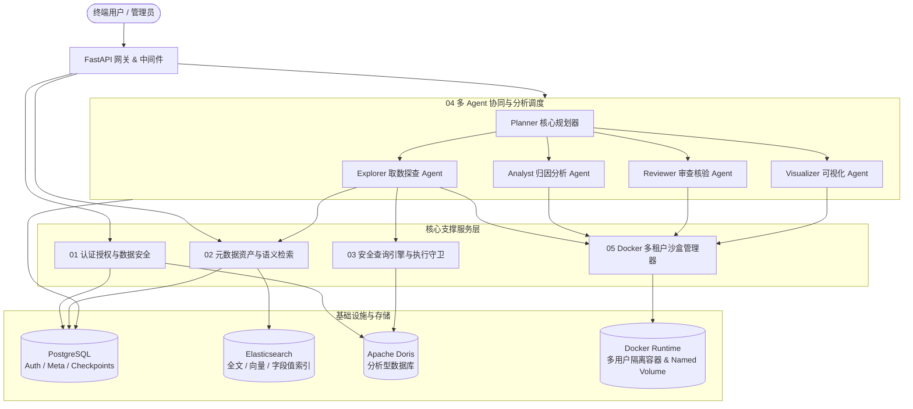
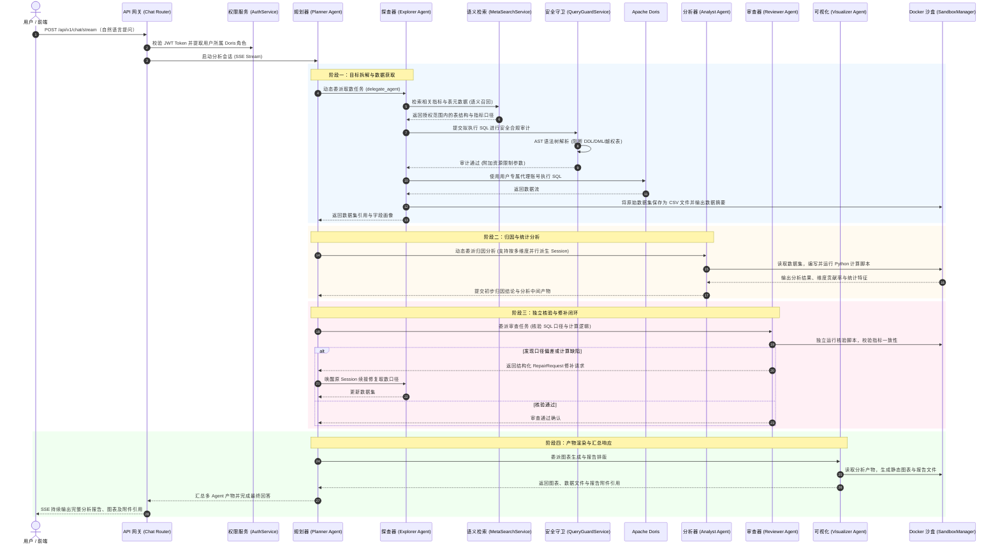

# 系统全景架构与模块交互总览

## 1. 架构定位与业务目标

DataAgent 是面向企业数据分析场景的多 Agent 协同系统。系统通过持久化规划器（Planner）、专业子 Agent（探查、分析、审查、可视化）、多租户安全沙盒以及端到端数据权限管控体系，实现从自然语言提问到受控取数、深度归因、代码复核及分析产物交付的闭环数据分析。



---

## 2. 模块划分与文档清单

系统当前已落地的核心能力划分为 5 大业务与技术模块：

| 模块文档 | 模块名称 | 核心职责 | 核心组件 / 服务 |
| :--- | :--- | :--- | :--- |
| [`01_AUTH_AND_SECURITY.md`](../docs/01_AUTH_AND_SECURITY.md) | 认证授权与数据安全 | 用户认证、Refresh Token 轮换与撤销、限流防爆破、平台管理员管控、Doris 动态查询身份加密存储、Doris 库表列 SELECT 权限授权与回收、Doris 行级过滤策略管理（`SHOW/CREATE/DROP ROW POLICY`）、数据资产白名单投影 | [`AuthService`](../app/identity/services/auth.py)<br>[`AuthorizationService`](../app/identity/services/authorization.py)<br>[`DorisPermissionService`](../app/identity/services/doris_permission.py)<br>[`DorisCredentialCipher`](../app/identity/services/credential.py) |
| [`02_METADATA_AND_SEARCH.md`](../docs/02_METADATA_AND_SEARCH.md) | 元数据资产与语义检索 | 表/字段/指标元数据全生命周期管理、YAML 格式导入导出与冲突校验、ES 全文/向量/字段值多索引版本同步、多阶段语义召回、拓扑关系补全与召回历史沉淀 | [`MetaCatalogService`](../app/metadata/services/catalog.py)<br>[`MetaImportService`](../app/metadata/services/import_service.py)<br>[`MetaIndexService`](../app/metadata/services/index.py)<br>[`MetaSearchService`](../app/metadata/services/search.py) |
| [`03_QUERY_ENGINE_AND_GUARD.md`](../docs/03_QUERY_ENGINE_AND_GUARD.md) | 安全查询引擎与执行守卫 | 基于用户绑定的 Doris 隔离查询身份受控执行、连接级资源限制（`workload_group`、内存、超时、包大小）、服务端游标流式拉取、基于 AST 语法树的严格只读与越权拦截校验 | [`DorisQueryRepository`](../app/query/repositories/doris.py)<br>[`QueryGuardService`](../app/query/services/guard.py)<br>[`AnalysisQueryService`](../app/query/services/executor.py) |
| [`04_MULTI_AGENT_ANALYTICS.md`](../docs/04_MULTI_AGENT_ANALYTICS.md) | 多 Agent 协同与数据分析 | 基于 DeepAgents 与 LangGraph Checkpoint 的动态子 Agent 架构；Planner 动态调度；Explorer、Analyst、Reviewer、Visualizer 专业分工；基于 `thread_id + checkpoint_ns` 的多维并行与状态持久化；跨 Agent 审查与 `RepairRequest` 回退修补；SSE 实时流式响应 | [`AgentManager`](../app/analytics/agents/manager.py)<br>[`AgentRegistry`](../app/analytics/agents/registry.py)<br>[`AgentSessionService`](../app/analytics/agents/session_service.py)<br>[`ChatService`](../app/analytics/services/chat.py) |
| [`05_DOCKER_SANDBOX_RUNTIME.md`](../docs/05_DOCKER_SANDBOX_RUNTIME.md) | Docker 多租户沙盒运行环境 | 一用户一容器 + 一用户一持久化 Named Volume；会话级 UID/GID 权限隔离（`0700`）；按需启动与空闲超时自动回收；全局并发限制与 FIFO 容量队列；沙盒内代码执行与容量配额管理；附件与分析产物安全传输 | [`DockerSandboxManager`](../app/sandbox/docker_manager.py)<br>[`AttachmentRouter`](../app/analytics/api/attachment/router.py) |

### 2.1 模块化单体目录

后端按照业务能力聚合代码，每个业务模块在内部保留接口、应用服务、仓储和领域模型分层：

```text
app/
├── identity/       # 认证、用户、角色与数据权限
├── metadata/       # 元数据目录、语义检索与索引同步
├── query/          # SQL 守卫、受控执行与查询经验
├── analytics/      # 对话、附件接口与多 Agent 分析编排
├── sandbox/        # Docker 隔离运行时
├── workflows/      # 用户注销等跨模块业务流程
└── shared/
    ├── config/         # 应用与元数据配置
    ├── errors/         # HTTP Problem Details 与全局异常处理
    ├── observability/  # 结构化日志、请求上下文与链路追踪
    ├── database/       # SQLAlchemy 声明基类
    ├── clients/        # PostgreSQL、Doris、ES 等外部资源客户端
    └── contracts/      # 跨模块共享的稳定协议
```

模块内依赖方向统一为 `api → services → repositories / models`。`metadata` 服务通过端口接收查询经验失效能力，避免依赖 `query` 的具体实现；跨多个业务模块的持久化操作由 `workflows` 统一编排。`shared` 不依赖业务模块。

---

## 3. 端到端典型业务链路



---

## 4. 技术栈与架构原则

- **后端运行时**：Python 3.14 + FastAPI + Uvicorn + Loguru
- **Agent 编排与状态存储**：LangChain + LangGraph + PostgreSQL AsyncSession (`checkpointer=PostgresSaver`)
- **数据源与执行引擎**：Apache Doris（分析型数仓，只读代理身份隔离 + Workload Group 配额）
- **搜索引擎**：Elasticsearch 8.x（文本 BM25 检索 + 稠密向量 KNN 检索 + 字段值模糊检索）
- **环境隔离沙盒**：Docker Engine + Docker SDK + Named Volumes（会话 UID/GID 权限隔离 + FIFO 并发队列）
