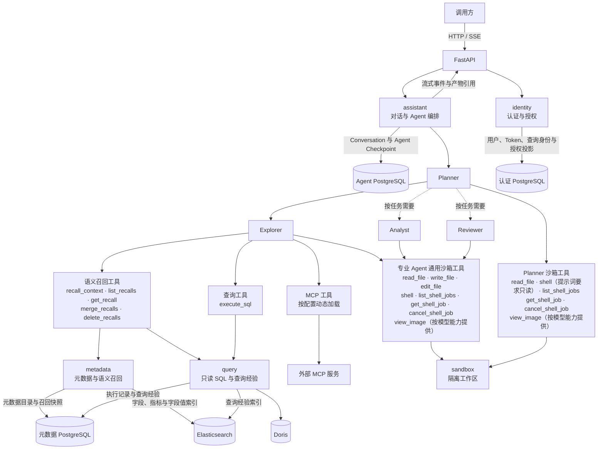
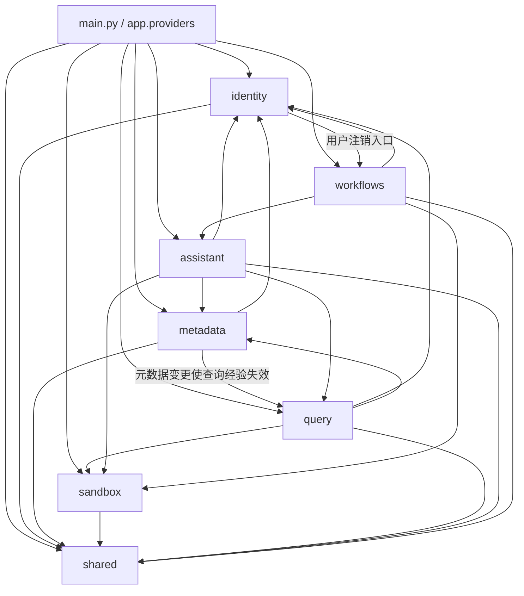

# 00. DataAgent 项目架构与模块协作总览

DataAgent 后端接收已认证用户的数据问题，由 Planner 动态调度数据探索、数据分析和结果审查 Agent，最终返回文字结论与可下载产物。系统围绕四项核心能力展开：受控访问数据、理解业务元数据、执行多 Agent 分析、持久化和清理运行资源。

## 1. 系统总体架构



## 2. 项目目录结构

```text
dataagent/
├── main.py                    FastAPI 组合根、路由注册和资源生命周期
├── app/
│   ├── shared/                配置、客户端、契约、错误、可观测性和任务设施
│   ├── identity/              账号认证、Doris 身份与授权
│   ├── metadata/              元数据目录、索引与语义召回
│   ├── sandbox/               Docker 工作区、文件和命令运行时
│   ├── query/                 SQL 校验、执行、记录与经验
│   ├── assistant/             对话、Planner、专业 Agent 和工具
│   ├── workflows/             跨模块持久化工作流
│   └── providers.py           跨模块长生命周期对象的组装入口
├── conf/
│   ├── app_config.yaml        应用配置
│   ├── meta_config.yaml       可导入的业务元数据
│   └── .env.example           密钥和环境变量模板
├── docker/
│   ├── compose.yml            PostgreSQL、Elasticsearch、Redis 和 Doris
│   ├── postgres/              数据库初始化脚本
│   ├── elasticsearch/         Elasticsearch 镜像配置
│   └── sandbox/               Agent 沙箱镜像
└── scripts/                   初始化与开发辅助脚本
```

## 3. 核心模块及职责

### 3.1 `shared`：共享基础设施

`shared` 提供没有单一业务归属的配置、客户端、数据库基础、跨模块契约、错误协议、可观测性和后台任务运行设施。

- **配置加载与校验**

  - 读取 `conf/.env` 和 `conf/app_config.yaml`。
  - 解析环境变量插值并构造强类型配置。
  - 拒绝未知配置字段。
  - 校验数值范围、超时关系和沙箱容量。
  - 校验模型引用、协议能力和其他跨配置约束。
- **敏感配置管理**

  - 使用 `SecretStr` 保存数据库密码和 JWT 密钥。
  - 使用 `SecretStr` 保存 Embedding 与模型密钥。
  - 使用 `SecretStr` 保存 Redis/Celery URL 和 MCP 连接信息。
  - 只在创建外部客户端时解包敏感值。
- **PostgreSQL 客户端**

  - 分别管理认证、元数据和 Agent 数据库的异步 SQLAlchemy Engine。
  - 管理各数据库的 Session 和建表生命周期。
  - 为请求和后台任务提供独立事务边界。
- **Doris 客户端**

  - 维护 Doris 管理员连接。
  - 维护按角色创建的查询连接 Registry。
  - 管理员连接用于目录和权限管理。
  - 查询连接使用专用身份和短生命周期连接执行只读 SQL。
- **Elasticsearch 与 Embedding 客户端**

  - 初始化检索和向量服务连接。
  - 集中提供客户端获取和关闭能力。
  - 支撑元数据索引、查询经验索引和召回。
- **LangGraph PostgreSQL**

  - 管理 LangGraph Checkpointer。
  - 清理线程和 namespace。
  - 提供 Conversation 级 PostgreSQL advisory lock。
  - 协调 Agent 运行与生命周期操作。
- **数据库声明基类**

  - 使用 `AuthBase` 划分认证数据域。
  - 使用 `MetaBase` 划分元数据域。
  - 使用 `AssistantBase` 划分 Agent 数据域。
  - 跨数据库对象通过稳定 ID 关联，不建立跨数据库外键。
- **跨模块契约**

  - 定义 Agent 身份与 Session 共享值对象。
  - 定义资产键和 Doris 限制。
  - 定义查询经验召回和搜索结果契约。
  - 模块之间使用共享契约交换数据，避免传递 ORM 实体。
- **统一错误响应**

  - 将业务异常统一投影为 `application/problem+json`。
  - 请求校验错误返回结构化字段位置。
  - 未处理异常只向客户端返回安全信息。
  - 在服务端记录未处理异常的完整堆栈。
- **日志与 Trace**

  - HTTP 中间件创建或继承 Trace 标识。
  - 在用户和 Conversation 边界绑定日志上下文。
  - 在 Analysis、Session 和 Tool Call 边界继续绑定上下文。
  - 后续日志自动携带定位字段。
- **Celery 任务设施**

  - 使用 Redis 作为 Broker 和 Result Backend。
  - 统一使用 JSON 序列化。
  - 统一配置任务确认策略和可见性超时。
  - 统一配置软硬时限、结果过期和 Worker 预取。
- **队列路由**

  - `metadata` 与 `query` 任务进入 `metadata-index`。
  - Assistant 标题任务进入 `lightweight`。
  - 其他 Assistant 与 Workflows 任务进入 `lifecycle`。
  - 未匹配任务进入 `default`。
- **周期调度**

  - 定时提交字段取值索引任务。
  - 定时清理过期草稿和待删除 Conversation。
  - 定时恢复用户注销任务。
  - 定时提交查询经验索引修复任务。
- **任务状态查询**

  - 通过任务 ID 查询 Celery 任务状态。
  - 返回 `PENDING`、`STARTED`、`SUCCESS` 和 `FAILURE`。
  - 返回任务结果或安全错误信息。
  - 需要可靠恢复的业务状态保存在所属 PostgreSQL。

### 3.2 `identity`：身份认证与数据授权

`identity` 负责确认当前用户身份、平台管理权限，以及用户访问 Doris 数据时使用的查询身份和资产范围。

- **登录与访问认证**

  - 接受用户名或邮箱和密码登录。
  - 使用 Redis 对客户端 IP 和登录标识限流。
  - 校验 Argon2 密码哈希后签发短期 Access Token 和 Refresh Token。
  - 每次使用 Access Token 时重新读取当前用户，校验账号状态、过期时间和 `auth_version`。
- **Refresh Token 轮换**

  - 数据库只保存 Refresh Token 哈希、有效期、撤销状态和 token family。
  - 每次刷新都会撤销旧 Token，并签发后继 Token。
  - 已撤销 Token 再次出现时撤销整个 family，阻止令牌重放。
- **密码与登录会话管理**

  - 修改密码时校验旧密码并更新密码哈希。
  - 递增 `auth_version` 并撤销已有 Refresh Token，使旧 Access Token 和刷新链失效。
  - 退出登录时撤销当前 Refresh Token。
- **平台用户管理**

  - 管理员可以创建、查询和修改用户。
  - 维护用户名、邮箱、密码和管理员标记。
  - 为用户绑定或解除 Doris 角色。
  - 用户注销流程负责禁用账号。
  - 保护当前操作管理员和最后一个启用的管理员，避免管理权限被意外清空。
- **Doris 角色与查询身份管理**

  - 查看 Doris 现有角色和可用 Workload Group。
  - 为每个受管角色维护专用 `query_user`、加密密码和 Workload Group。
  - 维护角色描述、默认角色状态和 `authorization_epoch`。
  - 创建与删除角色时同步处理 Doris 和 PostgreSQL。
  - 跨存储操作失败时对已完成步骤执行补偿。
- **用户与 Doris 角色绑定**

  - 一个用户最多绑定一个 Doris 角色。
  - 多个用户可以共享同一角色。
  - 元数据召回和 SQL 查询使用绑定角色的权限。
  - 解除绑定后用户仍可登录，但不能使用分析能力。
- **SELECT 资产权限管理**

  - 支持数据库、表和字段粒度的授权与回收。
  - 将真实权限写入 Doris。
  - 将稳定授权投影写入 PostgreSQL，并据此构造 `AssetAccessPolicy`。
  - 权限收紧时轮换 `authorization_epoch`，隔离旧授权环境生成的查询经验。
- **Row Policy 管理**

  - 直接读取 Doris 中的实时行策略。
  - 支持创建和删除 Row Policy。
  - 创建时去除首尾空白，并确认输入按 Doris 方言只能解析出一条 SQL 语句。
  - 目标表、字段和表达式的最终有效性由 Doris 执行 `CREATE ROW POLICY` 时检查。
  - 策略变化后轮换授权代次。
  - 跨存储操作失败时尝试补偿。
- **查询身份安全检查**

  - 查询执行前解析用户绑定角色、专用查询用户、密码和 Workload Group。
  - 应用启动时检查受管查询用户的角色关系。
  - 检查受管查询用户的目标数据库访问范围和只读权限。
  - 记录查询身份的权限漂移。
- **用户注销受理**

  - 管理员发起注销后立即禁用目标用户。
  - 撤销目标用户的 Refresh Token。
  - 创建或复用持久化注销任务。
  - 将 Conversation、Checkpoint 和沙箱资源清理交给 `workflows` 编排。

### 3.3 `metadata`：元数据目录与语义召回

`metadata` 负责维护表、字段和指标的业务目录，将目录同步为检索索引，并为 Explorer 构建持续可用的查询上下文。

- **目录查询与导出**

  - 查询表目录、单表字段和指标目录。
  - 查询 Doris 物理表。
  - 将完整目录导出为 UTF-8 YAML。
  - PostgreSQL 保存当前事实，Elasticsearch 保存可重建的检索投影。
- **表元数据管理**

  - 新增或修改表时校验 Doris 物理表。
  - 校验主键字段和取值游标字段。
  - 维护事实表或维表角色、描述和 `meta_version`。
  - 调度关联索引更新和查询经验失效。
- **字段元数据管理**

  - 以表名和字段名作为稳定主键。
  - 校验物理字段、数据类型和外键引用。
  - 维护字段描述、别名、示例和 `index_values`。
  - 字段内容变化后更新版本。
  - 按配置同步语义索引和字段取值索引。
- **指标元数据管理**

  - 以指标名称作为稳定主键。
  - 维护指标描述、别名和 `relevant_columns`。
  - 校验指标依赖的字段是否存在。
  - 指标内容变化后更新版本并同步语义索引。
- **资源删除与依赖保护**

  - 批量删除表、字段或指标前检查外键引用和指标依赖。
  - 删除 PostgreSQL 中的目录记录。
  - 清理 Elasticsearch 文档和索引状态。
  - 使受影响的查询经验失效。
- **YAML 批量导入**

  - 支持 `merge` 和 `replace` 两种模式。
  - 校验 YAML 结构、物理目录、主外键和指标依赖。
  - 计算新增、更新和删除集合。
  - `dry_run` 只返回变更预览。
  - 正式导入由 Celery Worker 应用，并调度后续索引任务。
- **字段与指标语义索引**

  - 将名称、描述和别名拆分为稳定检索文档。
  - 计算 Elasticsearch 索引差量。
  - 只为新增文本或 Embedding 版本变化的文本生成向量。
  - 同步完成后再次核对 `meta_version`，防止并发变更把旧索引标记为最新。
- **字段取值索引**

  - 全量同步时使用新 generation 分批写入 Doris distinct value。
  - 新值写入后先删除 Elasticsearch 中的旧 generation，再用 PostgreSQL 条件更新提交当前 generation。
  - Elasticsearch 与 PostgreSQL 之间没有跨库原子事务，失败状态保留已提交的旧 generation。
  - 增量同步使用固定上界、游标和回看窗口补充变化值。
  - 运行失败时保留旧 generation，并记录可恢复的失败状态。
- **语义资源召回**

  - 按多个业务词并行发起检索。
  - 同时使用字段全文、字段向量、指标全文、指标向量和字段值全文通道。
  - 使用 RRF 融合各通道排名。
  - 回到 PostgreSQL 解析候选资源的当前版本。
  - 补全指标依赖、主键、外键和所属表。
  - 按当前 `AssetAccessPolicy` 过滤结果。
- **局部失败处理**

  - 单个资源类型、检索通道或业务词失败时保留其他结果。
  - 精确记录失败的资源类型、检索通道和业务词。
  - 将全文和向量索引视为可恢复投影。
  - 目录事实始终以 PostgreSQL 为准。
- **Conversation 查询上下文**

  - Explorer 使用稳定 `query` 创建和追加召回上下文。
  - 同一 query 的字段、字段值、指标和表关系按业务主键累计合并。
  - 查询经验缓存 1 天；角色或授权代次变化时立即重新查询。
  - 将查询经验与语义召回结果共同保存为快照。
- **上下文查询、合并与删除**

  - 列出和读取当前 Conversation 的 query。
  - 合并多个查询上下文。
  - 删除整个 query 或其中指定的表、字段、字段值、指标和查询经验。
  - 每次读取时按用户最新权限重新过滤。
  - 清理失去依赖的指标、主键和外键信息。
- **模型可见投影**

  - 模型只接收完成授权和关系整理后的表、字段、值、指标与查询经验。
  - 内部排名和匹配原因保留在服务内部。
  - 索引状态、版本号和失败范围保留在服务内部。
  - 缓存时间和授权 scope 保留在服务内部。

### 3.4 `sandbox`：隔离执行与产物工作区

`sandbox` 为 Planner 和专业 Agent 提供受限 Docker 执行环境、持久化文件空间和跨进程安全生命周期。

- **用户级运行资源**

  - 每个用户拥有独立 Docker Named Volume。
  - 每个用户拥有独立 Container。
  - Container 可以停止和重新启动。
  - 用户文件在 Volume 中持续保留。
- **Conversation 与 Session 目录**

  - 用户卷按 Conversation、Analysis、Agent 类型和 Session 分层。
  - 每个专业 Session 使用独立 Linux UID。
  - 同一 Conversation 的 Session 通过受控 GID 读取上游产物。
- **文件访问边界**

  - 相对路径以当前工作区解析。
  - 绝对路径使用容器路径。
  - 专业 Agent 只能修改自己的 Session。
  - 其他 Session 和用户上传文件按权限只读。
  - Planner 的文件能力限制为读取。
- **文件与附件操作**

  - 提供文件读取、写入和编辑。
  - 提供文件上传、下载和删除。
  - 提供产物保存和下载资格检查。
  - 写入过程使用 staging、目录文件描述符和 `O_NOFOLLOW`。
  - 使用原子替换防止半成品文件。
  - 防止路径穿越和符号链接绕过。
- **容量限制**

  - `max_file_bytes` 限制上传文件的大小。
  - `max_file_bytes` 同时限制文件工具和 Shell 日志的单文件大小。
  - `max_user_storage_bytes` 交给支持硬配额的 Volume Driver 执行。
  - 只读检查不会创建缺失的 Volume、Container、Conversation 或 Session。
- **命令执行**

  - 普通 Backend 命令和 Agent `shell` 使用当前 Session 的 UID 与 GID。
  - 使用当前 Session 的工作目录、HOME 和临时目录。
  - 命令在 Docker 资源和路径边界内运行。
- **Shell Job 生命周期**

  - 命令在前台等待窗口内结束时直接返回结果。
  - 超时后保留进程并返回 `job_id`。
  - 将完整 stdout/stderr 写入受限日志文件。
  - 支持状态查询、有限等待和取消。
  - 取消时先发送 TERM，超时后使用 KILL 终止进程组。
- **跨进程所有权协调**

  - Redis 保存 operation lease。
  - Redis 保存 Conversation maintenance、user maintenance 和 user mutation 状态。
  - Redis 保存容量锁、活动时间和删除标记。
  - 协调 FastAPI、Celery Worker 与清理任务对同一资源的并发访问。
- **运行容量控制**

  - 启动 Container 前在容量锁内读取 Docker 实时状态。
  - 有空位时启动目标 Container。
  - 满载时停止最久未活动且没有操作租约的 Container。
  - 回收后仍无容量时返回明确错误。
- **空闲回收与删除**

  - 空闲达到阈值后依次停止和删除 Container。
  - Container 回收后保留用户 Volume。
  - Conversation 删除只移除对应目录和 UID 注册。
  - 用户注销时删除 Container、Volume 和 Redis 活动时间，永久保留用户删除标记以拒绝迟到请求。
- **Docker 安全边界**

  - 使用只读根文件系统和受限 tmpfs。
  - 当前配置让 Container 断网运行；配置模型也允许显式使用 bridge 网络。
  - 移除 Linux capabilities 并启用 `no-new-privileges`。
  - 限制 CPU、内存和 PID。
  - Agent Skill 通过只读挂载提供。

### 3.5 `query`：受控查询与查询经验

`query` 负责安全执行 Explorer 提交的 SQL，保存完整结果和执行事实，并将成功查询沉淀为角色级可复用经验。

- **查询运行上下文解析**

  - 从 Agent Tool Runtime 获取用户、Conversation 和 Analysis 标识。
  - 获取 Session 和 Tool Call 标识。
  - 记录本次查询目的。
  - 关联查询、结果文件和执行历史。
- **查询身份解析**

  - 读取用户绑定的 Doris 角色和专用 `query_user`。
  - 读取加密密码、Workload Group 和当前授权代次。
  - 构造 `AssetAccessPolicy`。
  - 在进入后续阶段前关闭身份数据库会话。
- **SQL 静态 Guard**

  - 使用 Doris 方言解析单条 SQL。
  - 业务查询只允许 `SELECT` 或最终返回 `SELECT` 的 `WITH`。
  - 数据发现阶段允许受限的 `SHOW TABLES`。
  - 数据发现阶段允许带当前数据库过滤条件的 `information_schema.tables` 和 `information_schema.columns` 查询。
  - 拒绝 DDL、DML、其他命令和不安全函数。
  - 解析 CTE、子查询、表别名和字段限定。
- **目录、权限与关联校验**

  - 从 `metadata` 加载当前表和字段。
  - 校验实际读取的资产和字段类型。
  - 校验星号使用、JOIN 条件和重复输出列名。
  - 生成规范化 SQL 和结构化校验结果。
- **Doris 受限执行**

  - 使用角色专用连接执行查询。
  - 设置 Workload Group、查询超时和内存上限。
  - 通过服务端游标分批读取结果。
  - 持续校验每批列名与结果形状一致。
- **查询结果落盘**

  - 将完整结果流式写入临时 CSV。
  - 处理表格公式注入。
  - 统计列、空值、时间范围、样例和总行数。
  - 使用规范化查询目的和唯一后缀生成文件名。
  - 将文件原子保存到当前 Explorer Session。
  - 工具响应只返回文件路径和有限摘要。
- **错误分类**

  - 区分静态校验拒绝和身份或权限错误。
  - 区分查询超时和 Doris 故障。
  - 区分结果结构异常和文件提交错误。
  - 向 Explorer 返回可以修正或重试的具体信息。
- **执行历史记录**

  - 保存原始 SQL、规范化 SQL 和查询目的。
  - 保存查询身份、授权代次和 Agent Session。
  - 保存校验结果、执行状态、结果摘要和错误。
  - 历史记录写入失败时记录日志，不改变原始查询结果。
- **查询经验生成**

  - 将成功 SQL 中的字面量替换为参数。
  - 生成 `sql_template` 和稳定 fingerprint。
  - 按角色和 fingerprint 创建或更新经验。
  - 保存最近的去重查询目的。
  - 保存表字段资产快照、元数据版本和 revision。
- **查询经验索引与召回**

  - 将查询经验同步到 Elasticsearch。
  - 在 `recall_context` 内并行执行全文和向量检索。
  - 使用 RRF 融合检索结果。
  - 返回前校验经验状态、角色和授权代次。
  - 校验资产版本和当前可见权限。
  - 最多提供三条有效经验。
- **经验失效与修复**

  - 元数据变化时按稳定资产键禁用相关经验。
  - 删除失效经验的索引文档。
  - 权限变化时通过授权代次隔离旧经验。
  - 周期任务扫描 revision 与 indexed revision 的差异。
  - 重新提交丢失或失败的索引任务。
- **查询经验管理**

  - 管理员可以按角色、状态和关键词查询经验。
  - 查询经验的来源执行记录。
  - 手动禁用或删除经验。
  - 删除时先进入 `deleting` 状态并停止召回。
  - 索引删除完成后移除 PostgreSQL 经验。
  - 保留原始执行历史。

### 3.6 `assistant`：对话与多 Agent 分析

`assistant` 负责管理 Conversation 和消息，把 Planner、专业 Agent、工具、Checkpoint 与分析产物组织成可流式返回、可停止、可恢复的分析任务。

- **Conversation 管理**

  - 创建绑定用户的普通对话或草稿。
  - 查询当前用户的对话列表和历史消息。
  - 修改对话标题。
  - 隐藏已经进入删除流程的 Conversation。
- **消息持久化与投影**

  - 使用 LangGraph Checkpoint 保存 Planner 和专业 Agent 状态。
  - 将历史消息统一投影为文本、推理、工具活动、附件、产物和时间戳。
  - 隐藏内部运行字段，避免直接暴露给调用方。
- **流式分析回合**

  - 校验 Conversation 归属和用户分析资格。
  - 获取或创建 Conversation 级 Agent Runtime。
  - 将用户消息写入 Planner。
  - 通过 SSE 返回思考增量和消息增量。
  - 通过 SSE 返回完整消息、专业 Agent 活动、错误和完成事件。
- **运行控制**

  - 在当前 API 进程内跟踪每个 Conversation 的活跃回合、事件缓冲和订阅者。
  - 处理客户端断开和主动停止。
  - 处理服务关闭和运行时淘汰。
  - Planner Checkpoint 存在待执行节点时恢复同一回合。
  - 限制自动续写次数。
  - 多 API Worker 部署需要把同一 Run 的启动、订阅、状态和停止请求路由到持有它的进程。
- **模型与 Agent Runtime 装配**

  - 根据配置为 Planner 和各 Specialist 创建模型。
  - 显式选择 Chat Completions 或 Responses 协议。
  - 装配 LangGraph Checkpointer 和沙箱 Backend。
  - 装配工具、中间件和并发限制。
- **Planner 动态编排**

  - 拆解用户分析任务。
  - 创建或复用分析标识与 Session。
  - 通过 `delegation` 调用 Explorer、Analyst 和 Reviewer。
  - 并行执行相互独立的分析分支。
  - 按依赖顺序衔接有数据依赖的分支。
- **专业 Agent Session 管理**

  - 每个 `analysis_id + agent_type + session_id` 对应独立 Checkpoint namespace。
  - 为每个专业 Session 分配独立沙箱目录和执行锁。
  - 重复委派时恢复原 Checkpoint 和文件。
  - 新 Session 可以与其他 Session 并行运行。
- **专业结果协议**

  - Specialist 统一返回 `completed`、`needs_repair` 或 `failed`。
  - 校验结构化结果和目标 Session。
  - 校验失败原因和产物真实路径。
  - 委派结束时清理遗留 Shell Job。
- **Explorer 能力**

  - 使用语义召回定位业务表、字段、指标和字段值。
  - 创建、追加、合并和清理 query 上下文。
  - 召回当前角色可用的查询经验。
  - 使用 `execute_sql` 生成可审计数据文件。
  - 使用配置的 MCP 数据工具访问扩展数据源。
- **Analyst 能力**

  - 读取 Explorer 或其他上游 Session 产出的数据文件。
  - 执行数据质量检查和描述统计。
  - 完成对比、分解、下钻和归因分析。
  - 生成图表和自包含 HTML 报告。
  - 使用 Analysis 与 Visualization Skill 规范分析和可视化过程。
- **Reviewer 能力**

  - 独立检查数据来源和指标口径。
  - 检查 SQL、计算脚本和图表。
  - 核对证据与结论是否一致。
  - 必要时生成复算产物。
  - 发现缺陷时提出结构化修补请求。
- **上游修补**

  - 下游 Agent 发现输入缺陷时指定目标 Agent 和 Session。
  - Planner 将修补任务送回原 Session。
  - 上游 Agent 在原 Checkpoint 和文件基础上生成新版本。
  - 下游 Agent 重新验证受影响结果。
- **通用沙箱工具**

  - 专业 Agent 可以使用文件读取、写入和编辑工具。
  - 专业 Agent 可以创建和管理 Shell Job。
  - 模型支持图片输入时启用 `view_image`。
  - Planner 只挂载文件读取工具；Shell 的只读要求由 Planner 提示词约束，后端不解析命令内容来强制只读。
  - Shell 命令可以在前台返回，也可以在超时后转为带 `job_id` 的后台任务。
  - 后台任务支持列出、查询和取消。
- **Skill 与 MCP 扩展**

  - 将 Specialist Skill 目录只读挂载到沙箱。
  - 允许 Agent 读取 Skill 说明、参考资料和脚本。
  - 按配置动态加载 Explorer 的 MCP 工具。
  - 加载 MCP 工具时检查名称冲突。
- **附件与产物管理**

  - 将用户附件统一保存到 Conversation 的 `uploads` 目录。
  - 将 Agent 产物保存在各自 Session。
  - 校验文件归属、路径和大小。
  - 校验文件是否真实存在以及是否允许下载。
  - 根据模型能力决定是否加载图片内容。
- **对话标题生成**

  - 根据首条用户文本生成即时标题。
  - 异步调用轻量任务生成更合适的标题。
  - 使用条件更新保护用户手动修改的标题。
- **Conversation 清理**

  - 删除请求先取消当前进程中的运行，再取得非阻塞数据库锁并标记 Conversation。
  - 另一个 API 进程持有运行锁时，当前请求无法远程取消，接口返回 `conversation-busy` 的 409，调用方需要在该 Run 结束后重试。
  - 后台任务持久化删除墓碑。
  - 删除 Planner 与 Specialist Checkpoint。
  - 删除语义召回快照、沙箱目录和 Conversation 记录。
  - 周期扫描恢复丢失的删除任务。
  - 周期任务清理过期草稿。

### 3.7 `workflows`：跨模块生命周期工作流

`workflows` 负责编排跨越多个模块和存储、需要持久化状态与失败恢复的业务流程，当前实现聚焦用户注销。

- **注销请求受理**

  - 由注销服务校验操作人不能注销自己，再由身份状态存储校验目标用户和最后管理员约束。
  - 立即禁用目标账号。
  - 撤销目标用户的 Refresh Token。
  - 创建或复用 `pending` 的 `UserDeletionTask`。
- **到期任务领取**

  - Celery Beat 周期扫描到期记录。
  - 使用 PostgreSQL 行锁和 `SKIP LOCKED` 原子领取任务。
  - 将 `next_attempt_at` 推进到任务租约到期时间。
  - 提交用户注销 Worker 任务。
- **Conversation 资源清理**

  - Worker 调用 `assistant` 删除用户的全部 Conversation。
  - 删除 Planner 与 Specialist Checkpoint。
  - 删除语义召回快照和 Conversation 沙箱目录。
  - 删除 Conversation 删除墓碑。
  - 清理可能遗留的孤立线程与召回记录。
- **用户沙箱清理**

  - 调用 `sandbox` 阻止用户发起新操作。
  - 等待现有操作结束。
  - 删除用户 Container 和 Named Volume。
  - 随 Volume 删除 UID 注册，清除 Redis 活动时间，并保留用户删除标记。
- **身份数据完成**

  - 全部外部资源清理成功后删除认证 PostgreSQL 中的 User。
  - 将注销任务标记为 `completed`。
  - 最后写入完成状态，确保账号记录不会在资源清理前消失。
- **失败记录与重试**

  - 任一步失败时保存异常类型和原因。
  - 保存尝试次数和下一次执行时间。
  - 将当前 Celery 任务标记为失败。
  - 自动重试和周期调度都会续期任务租约。
- **消息丢失恢复**

  - 任务租约覆盖 Celery Visibility Timeout。
  - Worker 中断后，任务记录会重新到期。
  - Broker 发布失败或任务消息丢失后，任务记录也会重新到期。
  - 后续扫描重新领取到期任务。
- **幂等执行**

  - 已完成任务直接返回。
  - 各资源清理允许目标已经不存在。
  - 失败后的重试可以安全跳过已完成步骤。
  - 资源内部的一致性规则由所属模块负责。

## 4. 模块依赖关系

图中 `A → B` 表示 A 在运行时使用 B 提供的能力。`main.py` 和 `app/providers.py` 是组合根，负责创建对象和注入具体实现。



依赖关系中的关键连接点如下：

| 调用方      | 被调用模块                         | 协作原因                                                         |
| ----------- | ---------------------------------- | ---------------------------------------------------------------- |
| `identity`  | `workflows`                        | 用户删除管理接口进入跨模块注销用例，具体对象由组合根注入         |
| `metadata`  | `identity`                         | 管理接口要求管理员身份；召回结果按资产策略过滤                   |
| `metadata`  | `query`                            | 表、字段、指标发生语义变化后，使关联查询经验失效                 |
| `query`     | `identity`                         | 解析 Doris 查询凭据、工作组和当前资产策略                        |
| `query`     | `metadata`                         | Guard 使用当前目录校验表、字段、类型和关联关系；经验保存资产快照 |
| `query`     | `sandbox`                          | 将完整查询结果写入当前 Agent Session 工作区                      |
| `assistant` | `identity`                         | 聊天入口校验分析权限；Explorer 召回时读取当前资产策略            |
| `assistant` | `metadata`                         | Explorer 检索语义资源并维护 Conversation 召回上下文              |
| `assistant` | `sandbox`                          | 保存附件、查询数据、脚本、图表和报告，并运行文件与 Shell 工具    |
| `assistant` | `query`                            | Explorer 通过 `execute_sql` 调用完整查询用例并召回历史经验       |
| `workflows` | `identity`、`sandbox`、`assistant` | 按资源所有权调用公开清理能力，完成用户注销                       |

`metadata` 与 `query` 存在有明确用途的双向协作：查询依赖当前元数据做 Guard，元数据变更需要失效旧查询经验。两者共享元数据 PostgreSQL，但各自维护自己的模型、Repository 和 Service。

## 5. HTTP 入口

| 路径前缀                  | 所属模块                | 功能                                     |
| ------------------------- | ----------------------- | ---------------------------------------- |
| `/api/v1/tasks`           | `shared`                | Celery 任务状态查询                      |
| `/api/v1/auth`            | `identity`              | 登录、刷新、退出、改密和当前用户         |
| `/api/v1/admin`           | `identity` + `query`    | 用户、Doris 角色、数据权限与查询经验管理 |
| `/api/v1/meta`            | `metadata`              | 元数据目录、导入导出和索引任务提交       |
| `/api/v1/chat/attachment` | `sandbox` + `assistant` | 附件上传、获取与删除                     |
| `/api/v1/chat`            | `assistant`             | Conversation、消息、运行控制和 SSE 事件  |

## 6. 数据与外部系统归属

| 存储或外部能力                  | 数据归属与用途                                                                                                         |
| ------------------------------- | ---------------------------------------------------------------------------------------------------------------------- |
| 认证 PostgreSQL（`auth`）       | `identity` 的用户、Refresh Token、Doris 查询身份、资产授权投影和用户注销任务                                           |
| 元数据 PostgreSQL（`meta`）     | `metadata` 的表、字段、指标、索引状态和召回快照；`query` 的执行记录、查询经验和经验资产                                |
| Agent PostgreSQL（`langgraph`） | `assistant` 的 Conversation 与删除墓碑；LangGraph 的 Planner 和专业 Agent Checkpoint、消息与状态                       |
| Elasticsearch                   | `metadata` 的字段、指标和字段值检索投影；`query` 的查询经验检索投影                                                    |
| Doris                           | `identity` 管理角色、查询用户、SELECT 权限和 Row Policy；`metadata` 校验物理目录并读取字段值；`query` 执行受限只读 SQL |
| Redis                           | Celery broker 与 result backend；认证限流；Sandbox 分布式锁、租约、活动状态和删除标记                                  |
| Docker Named Volume             | 用户上传文件、查询 CSV、分析脚本、图表、报告和其他持久化产物                                                           |
| Chat Model                      | Planner 与 Explorer、Analyst、Reviewer 的推理和工具调用                                                                |
| Embedding 服务                  | 元数据与查询经验的向量索引和向量召回                                                                                   |
| MCP 服务                        | 为 Explorer 扩展外部工具；当前配置包含 Tavily                                                                          |
