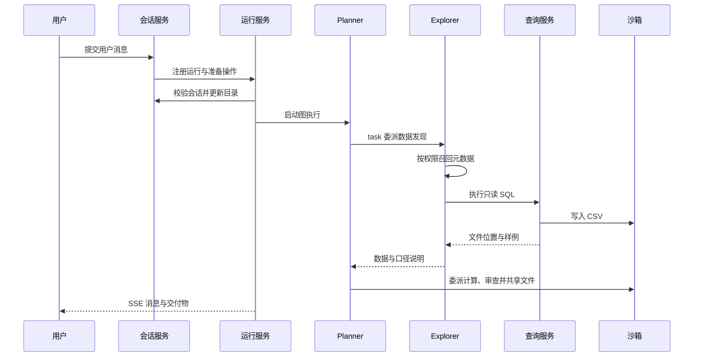

# 架构

## 1. 系统目标与边界

DataAgent 将用户的自然语言问题转化为数据发现、查询、计算、审查与交付过程。语言模型负责理解问题和选择工具，应用负责身份、执行、持久化和资源隔离，数据库负责业务数据访问权限。

系统同时维护两条链路：一条是离线的元数据导入链路，将源表结构和业务说明转换为检索目录；另一条是在线的会话执行链路，使用目录发现数据，再查询 Doris 并在沙箱内处理结果。

## 2. 模块职责

| 模块     | 接收什么                   | 负责什么                          | 交付什么                     |
| -------- | -------------------------- | --------------------------------- | ---------------------------- |
| 公共模块 | 配置与生命周期要求         | 连接、配置、日志、异常、ORM 基础  | 可复用基础设施               |
| 身份     | 应用用户 ID                | 解析查询身份、读取 Doris 实际授权 | 查询凭据和资产访问策略       |
| 元数据   | 导入配置或检索词           | 目录、索引、水位和授权召回        | 业务表字段与指标上下文       |
| 查询     | 用户、会话、SQL、查询目的  | 只读检查、流式执行、结果写入      | CSV 位置与结果摘要           |
| 多智能体 | 用户消息与会话             | Agent 装配、运行控制、消息投影    | 流式消息与交付物引用         |
| 沙箱     | 用户、会话及文件或命令操作 | 工作区、进程、容器和资源协调      | 文件内容、产物位置和执行结果 |

服务层表达业务步骤，仓储表达外部数据访问，模型表达输入、输出和持久化结构。路由负责请求解析和传输，不承担 Agent 图的运行循环；工具负责将 Agent 上下文转换为服务调用，不自行管理数据库连接或 Docker 资源。

## 3. 在线分析链路

Planner 可以多次调用专业 Agent。调用顺序由模型结合任务决定，代码装配定义的是可用能力，不是固定的四阶段流水线。

Doris 查询和模型请求由应用进程发起。沙箱负责运行分析代码，其网络默认关闭；业务查询通过受控查询工具完成，CSV 写入当前会话工作区后供其他 Agent 使用。

## 4. 元数据准备链路

导入脚本先读取配置并校验源表，再替换元数据目录和检索索引。字段和指标的名称、描述、别名参与语义检索；字段取值单独建立全文索引。

全量导入影响整个目录和三个索引。增量只同步配置了水位的字段取值，不刷新字段说明、指标定义或表结构。二者共用同一个导入锁，避免同时修改目录及索引。

在线召回从 PostgreSQL 读取目录和从 Doris 读取实际权限，形成此次调用可见的目录，再查询 Elasticsearch。索引命中必须能映射到可见目录中的资源，才能进入返回结果。

## 5. 状态所有权

| 状态                     | 保存位置              | 生命周期             | 所有者       |
| ------------------------ | --------------------- | -------------------- | ------------ |
| 应用用户及角色关联       | 身份数据库            | 跨进程重启           | 身份模块     |
| 加密查询凭据             | 身份数据库            | 跨进程重启           | 身份模块     |
| 元数据目录和取值水位     | 元数据数据库          | 全量替换、增量更新   | 元数据模块   |
| 检索文档                 | Elasticsearch         | 随导入更新           | 元数据模块   |
| 会话标题、草稿和删除标记 | 会话数据库            | 会话生命周期         | 会话服务     |
| Planner 消息及待执行节点 | PostgreSQL Checkpoint | 跨运行、跨重启       | LangGraph    |
| 活跃 Run 和事件缓冲      | Web 进程内存          | 单次启动或恢复       | 运行服务     |
| 查询与分析文件           | Docker 数据卷         | 直到会话资源删除     | 沙箱模块     |
| 导入锁与沙箱协调状态     | Redis                 | 锁、操作或运行时租约 | 各模块协调器 |

Conversation 是业务会话，Turn 是一次用户交互，Run 是一次启动或恢复产生的执行实例。一个 Conversation 可以有多个 Turn；某个 Turn 中断后可以通过另一个 Run 恢复。Checkpoint 描述图状态，不能直接替代进程内的任务对象。

## 6. 资源创建与释放

应用启动构造一份 WebResources，创建数据库、检索、向量服务、Checkpoint、沙箱、Agent 和业务服务，并挂到应用状态。请求依赖从中取得所需对象。

连接资源创建后立即登记关闭动作。启动继续完成 Checkpoint 初始化、沙箱初始化、模型资源初始化和 ORM 建表，最后启动会话后台清理。初始化中途失败也会进入已登记资源的清理流程。

退出时先使正在使用资源的任务停止，再关闭其底层客户端。AsyncExitStack 按登记的相反顺序执行清理，避免业务任务还在运行时先销毁连接池。异常清理本身仍可能失败，失败需要通过日志定位。

独立脚本管理自己的资源作用域。元数据导入不依赖 Web 已经启动，也不会复用 Web 进程中的数据库对象。

## 7. 一致性与事务边界

| 操作           | 原子范围               | 跨系统部分                 | 失败后的处理                    |
| -------------- | ---------------------- | -------------------------- | ------------------------------- |
| 替换元数据目录 | 单次 PostgreSQL 事务   | ES 重建与向量请求          | 修复原因后重跑全量              |
| 增量取值同步   | 单字段水位提交         | ES 文档写入与刷新          | 保留旧水位，重跑覆盖            |
| 提交对话       | 会话记录更新           | 后台任务与模型调用         | 通过 Run 状态和 Checkpoint 判断 |
| 生成查询产物   | 无跨系统事务           | Doris 读取与沙箱写入       | 失败不返回成功结果              |
| 删除会话       | 删除标记或目录记录变更 | 任务取消、Checkpoint、沙箱 | 持久删除标记驱动补偿            |

不要把持有一个数据库 Session 理解成整个操作具备事务性。事务只能约束该数据库内的修改；外部系统的执行顺序、幂等能力和补偿机制决定整体失败语义。

## 8. 并发模型

Web 使用单进程异步事件循环。模型、数据库和网络调用在等待时让出执行权；Docker SDK 等同步操作通过沙箱内部线程执行。异步任务解决并发等待，但不自动保证同一资源只能被一个任务修改。

同一会话的重复启动由进程内 Run 注册表控制；会话资源删除由本地锁串行协调；元数据导入由 Redis 租约锁串行化；沙箱使用 Redis 维护跨运行时的操作租约和维护窗口。

这些机制各自保护不同资源。沙箱具备跨进程协调，不代表整个应用可以直接增加多个 Web worker：运行任务、取消入口和 SSE 事件缓冲仍属于单进程。

## 9. 身份和权限边界

前端用 X-User-ID 选择应用用户。该机制用于选择会话归属和查询身份，本身不能证明操作者身份，因此当前运行环境需要信任使用者。

元数据召回按 Doris 实际授权过滤；SQL 使用对应角色的独立查询账号执行，由 Doris 最终判定权限。沙箱再按用户和会话隔离计算文件。三层分别保护元数据可见范围、业务数据访问和文件资源，不能相互替代。

## 10. 修改功能时的影响面

修改查询结果模型时，需要同步查询服务、工具输出和模型消费约定。修改附件协议时，需要同步消息投影、历史读取和下载校验。修改权限规则时，需要同时考虑召回过滤和实际查询账号，避免只修某一个展示入口。

新增后台能力时，先明确状态属于数据库、Checkpoint 还是内存，再定义停止、退出和失败补偿语义。新增跨模块调用优先使用模块已有服务入口，资源创建继续由生命周期层负责。

排查问题时沿业务阶段定位：请求是否受理、Run 是否注册、图是否开始、工具是否成功、产物是否写入、前端是否收到投影结果。日志中的同一会话标识比相邻时间更适合关联这些阶段。
