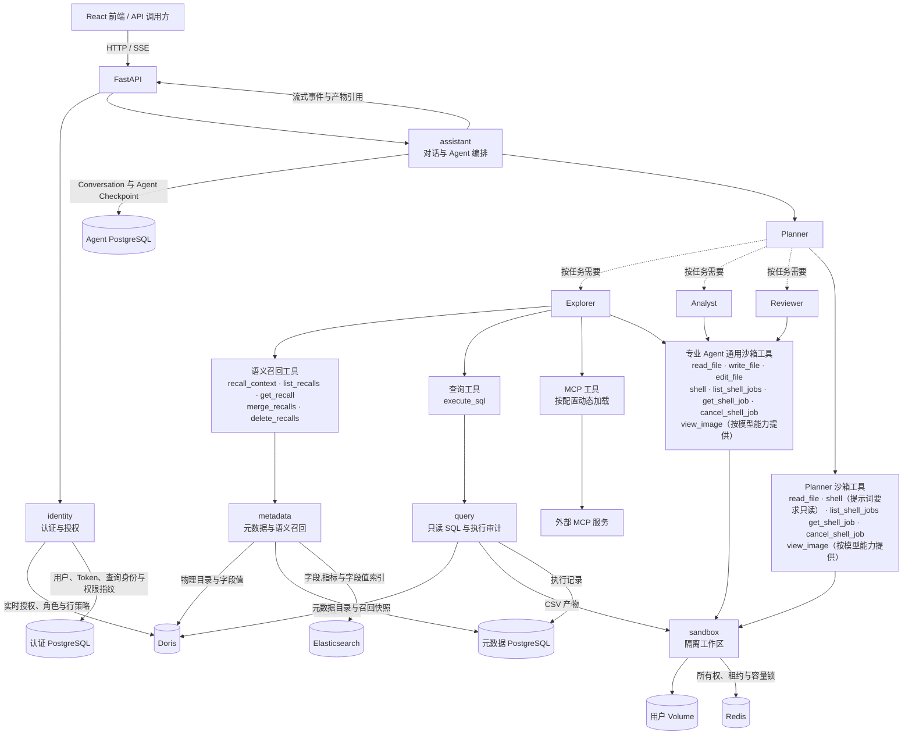
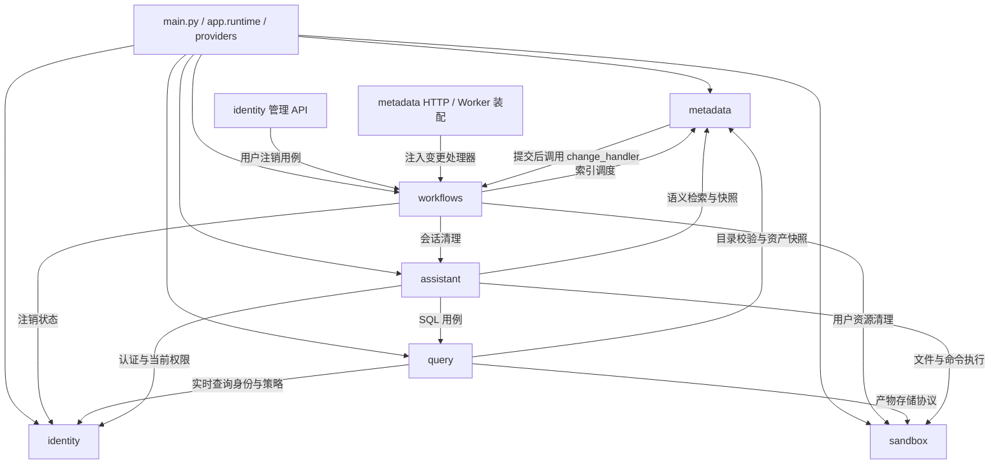
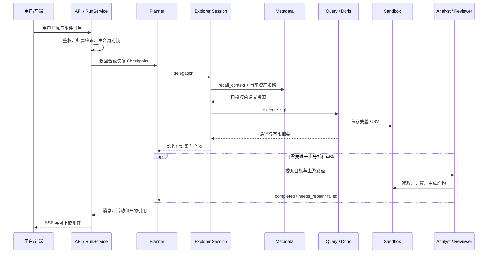
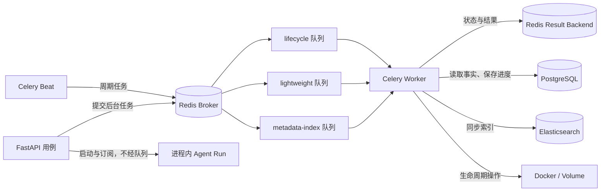

# 00. DataAgent 项目架构与模块协作总览

DataAgent 后端接收已认证用户的数据问题，由 Planner 动态调度数据探索、数据分析和结果审查 Agent，最终返回文字结论与可下载产物。系统围绕四项核心能力展开：受控访问数据、理解业务元数据、执行多 Agent 分析、持久化和清理运行资源。

## 1. 系统总体架构



图中的 Agent 调用由 Planner 按任务动态决定，不要求每轮都执行 Explorer → Analyst → Reviewer。专业 Agent 之间通过结构化委派结果和沙箱文件交换信息；后台索引与清理另由 Celery 执行。

平台管理员负责用户、角色和元数据管理；普通用户负责对话和分析。管理员身份只赋予平台管理能力，查询业务数据仍需要绑定 Doris 角色并遵守该角色的权限。

## 2. 项目目录结构

```text
dataagent/
├── main.py                    FastAPI 应用创建、路由、中间件与异常处理注册
├── app/
│   ├── shared/                配置、客户端、契约、错误、可观测性和任务设施
│   ├── identity/              账号认证、Doris 身份与授权
│   ├── metadata/              元数据目录、索引与语义召回
│   ├── sandbox/               Docker 工作区、文件和命令运行时
│   ├── query/                 SQL 校验、执行与记录
│   ├── assistant/             对话、Planner、专业 Agent 和工具
│   ├── workflows/             元数据变更协调与持久化注销工作流
│   ├── runtime.py             WebResources 与 lifespan，创建和关闭进程资源
│   └── dependencies.py        从当前 FastAPI 应用取得资源，供 HTTP 依赖使用
├── conf/
│   ├── app_config.yaml        应用配置
│   ├── meta_config.yaml       可导入的业务元数据
│   └── .env.example           密钥和环境变量模板
├── docker/
│   ├── compose.yml            PostgreSQL、Elasticsearch、Redis 和 Doris
│   ├── postgres/              数据库初始化脚本
│   ├── elasticsearch/         Elasticsearch 镜像配置
│   └── sandbox/               Agent 沙箱镜像
├── scripts/                   初始化数据库、创建管理员、生成元数据和 API 类型
├── web/                       React 前端：登录、聊天、管理页面与 API 客户端
├── dbmock/                    独立 Git 子模块：Doris 电商示例数据生成器
└── docs/                      架构、模块说明与接口索引
```

### 2.1 模块内部如何分层

| 位置                            | 职责与边界                                                  |
| ------------------------------- | ----------------------------------------------------------- |
| `api/`                          | HTTP 参数、鉴权依赖和响应协议，调用应用用例                 |
| `services/`                     | 业务规则、状态变化与用例执行                                |
| `repositories/`                 | SQLAlchemy、Doris 和 Elasticsearch 的存储访问及事务所需操作 |
| `models/`                       | 领域数据、持久化模型和模块内结构                            |
| `providers.py`                  | 创建具体服务并注入依赖，不承担业务流程                      |
| `runtime.py`、资源上下文        | 管理连接、短数据库会话和运行资源的创建与释放                |
| `tasks.py`、`task_scheduler.py` | Celery 执行入口与消息提交，业务逻辑仍由服务完成             |
| `shared/contracts/`             | 跨模块共享的标识、资产键和结果值对象                        |

## 3. 核心模块及职责

### 3.1 `shared`：共享基础设施

`shared` 提供没有单一业务归属的配置、客户端、数据库基础、跨模块契约、错误协议、可观测性和后台任务运行设施。

- **配置加载与校验**

  - 读取 `conf/.env` 和 `conf/app_config.yaml`。
  - 解析环境变量插值并构造强类型配置。
  - 拒绝未知配置字段。
  - 校验数值范围、超时关系和沙箱容量。
  - 校验模型引用、协议能力和其他跨配置约束。

- **敏感配置管理**

  - 使用 `SecretStr` 保存数据库密码和 JWT 密钥。
  - 使用 `SecretStr` 保存 Embedding 与模型密钥。
  - 使用 `SecretStr` 保存 Redis/Celery URL 和 MCP 连接信息。
  - 在认证、加密和客户端初始化等确有需要的位置显式解包；配置展示默认隐藏敏感值。

- **PostgreSQL 客户端**

  - 分别管理认证、元数据和 Agent 数据库的异步 SQLAlchemy Engine。
  - 管理各数据库的 Session 和建表生命周期。
  - 为请求和后台任务提供独立事务边界。

- **Doris 客户端**

  - 维护 Doris 管理员连接。
  - 维护按角色创建的查询连接 Registry。
  - 管理员连接用于目录和权限管理。
  - 查询连接使用专用身份和短生命周期连接执行只读 SQL。

- **Elasticsearch 与 Embedding 客户端**
  - 初始化检索和向量服务连接。
  - 集中提供客户端获取和关闭能力。
  - 支撑元数据索引和召回。

- **LangGraph PostgreSQL**
  - 管理 LangGraph Checkpointer。
  - 清理线程和 namespace。
  - 提供 Conversation 级 PostgreSQL advisory lock。
  - 协调 Agent 运行与生命周期操作。

- **数据库声明基类**
  - 使用 `AuthBase` 划分认证数据域。
  - 使用 `MetaBase` 划分元数据域。
  - 使用 `AssistantBase` 划分 Agent 数据域。
  - 跨数据库对象通过稳定 ID 关联，不建立跨数据库外键。

- **跨模块契约**

  - 定义 Agent 身份与 Session 共享值对象。
  - 定义资产键和 Doris 限制。
  - 定义搜索结果契约。
  - 模块之间使用共享契约交换数据，避免传递 ORM 实体。

- **统一错误响应**
  - 将业务异常统一投影为 `application/problem+json`。
  - 请求校验错误返回结构化字段位置。
  - 未处理异常只向客户端返回安全信息。
  - 在服务端记录未处理异常的完整堆栈。

- **日志与 Trace**

  - HTTP 中间件创建或继承 Trace 标识。
  - 在用户和 Conversation 边界绑定日志上下文。
  - 在 Analysis、Session 和 Tool Call 边界继续绑定上下文。
  - 后续日志自动携带定位字段。

- **Celery 任务设施**

  - 使用 Redis 作为 Broker 和 Result Backend。
  - 统一使用 JSON 序列化。
  - 统一配置任务确认策略和可见性超时。
  - 统一配置软硬时限、结果过期和 Worker 预取。

- **队列路由**

  - `metadata` 与 `query` 任务进入 `metadata-index`。
  - Assistant 标题任务进入 `lightweight`。
  - 其他 Assistant 与 Workflows 任务进入 `lifecycle`。
  - 未匹配任务进入 `default`。

- **周期调度**

  - 定时提交字段取值索引任务。
  - 定时清理过期草稿和待删除 Conversation。
  - 定时恢复用户注销任务。

- **任务状态查询**

  - 通过管理员接口按任务 ID 查询 Celery 任务状态；HTTP 入口位于 `identity/api/admin/task_router.py`。
  - 返回 `PENDING`、`STARTED`、`SUCCESS` 和 `FAILURE`。
  - 返回成功任务的结果或失败任务的错误字符串；未知任务 ID 也可能显示为 `PENDING`，不能据此认定任务已成功入队。
  - 需要可靠恢复的业务状态保存在所属 PostgreSQL。

### 3.2 `identity`：身份认证与数据授权

`identity` 负责确认当前用户身份、平台管理权限，以及用户访问 Doris 数据时使用的查询身份和资产范围。

- **登录与访问认证**

  - 接受用户名或邮箱和密码登录。
  - 使用 Redis 对客户端 IP 和登录标识限流。
  - 校验 Argon2 密码哈希后签发短期 Access Token 和 Refresh Token。
  - 每次使用 Access Token 时重新读取当前用户，校验账号状态、过期时间和 `auth_version`。

- **Refresh Token 轮换**

  - 数据库只保存 Refresh Token 哈希、有效期、撤销状态和 token family。
  - 每次刷新都会撤销旧 Token，并签发后继 Token。
  - 已撤销 Token 再次出现时撤销整个 family，阻止令牌重放。

- **密码与登录会话管理**

  - 修改密码时校验旧密码并更新密码哈希。
  - 递增 `auth_version` 并撤销已有 Refresh Token，使旧 Access Token 和刷新链失效。
  - 退出登录时撤销当前 Refresh Token。

- **平台用户管理**

  - 管理员可以创建、查询和修改用户。
  - 维护用户名、邮箱、密码和管理员标记。
  - 为用户绑定或解除 Doris 角色。
  - 用户注销流程负责禁用账号。
  - 禁止注销当前操作管理员，保护最后一个启用的管理员；账号修改与令牌撤销在事务中完成。

- **Doris 角色与查询身份管理**

  - 查看 Doris 现有角色和可用 Workload Group。
  - 为每个受管角色维护专用 `query_user`、加密密码和 Workload Group。
  - 维护角色描述、默认角色状态和最近观察到的 `authorization_fingerprint`。
  - 创建与删除角色时同步处理 Doris 和 PostgreSQL。
  - 创建失败时尝试补偿删除已创建的 Doris 角色和用户；删除时先移除 Doris 身份再删除平台配置，中途失败保留配置供重试。

- **用户与 Doris 角色绑定**

  - 一个用户最多绑定一个 Doris 角色。
  - 多个用户可以共享同一角色。
  - 元数据召回和 SQL 查询使用绑定角色的权限。
  - 解除绑定后用户仍可登录，但不能使用分析能力。
  - 默认角色影响之后未显式指定角色的新用户，不批量改绑已有用户。
  - 角色被用户引用时不能删除；角色删除成功后失效本进程对应的查询连接。

- **SELECT 资产权限管理**

  - 支持数据库、表和字段粒度的授权与回收。
  - 将真实权限写入 Doris。
  - 从专用查询账号的实时 `SHOW GRANTS` 和行策略构造授权快照及 `AssetAccessPolicy`，PostgreSQL 保存身份和权限指纹，不维护另一份授权清单。
  - 在身份行锁内读取 Doris 并更新指纹，避免较早读到的权限覆盖较新观察结果。
  - 撤权后重新检查有效权限；账号直接授权或更高层授权仍覆盖目标时明确报错。
  - 全局或 Catalog 级 SELECT 不能通过当前业务数据库的撤权接口清空。

- **Row Policy 管理**

  - 直接读取 Doris 中的实时行策略。
  - 支持创建和删除 Row Policy。
  - 创建时去除首尾空白，并确认输入按 Doris 方言只能解析出一条 SQL 语句。
  - 目标表、字段和表达式的最终有效性由 Doris 执行 `CREATE ROW POLICY` 时检查。
  - 行策略内容参与权限指纹，操作前后重新观察实际权限。
  - Doris 是授权事实来源；Doris 操作与 PostgreSQL 指纹更新没有跨库事务，异常后需根据实时状态重新观察，不能假定全部回滚。

- **查询身份安全检查**

  - 查询执行前解析用户绑定角色、专用查询用户、密码和 Workload Group。
  - 每次解析授权快照时核对查询用户身份，并要求其只绑定平台配置的业务角色。
  - 拒绝带有 Doris `ADMIN_PRIV` 或 `NODE_PRIV` 的业务查询账号。
  - 严格解析授权格式；无法识别时拒绝使用，不回退到旧权限策略。
  - 用户通过平台外部修改的 Doris 授权，也会在下次观察时反映到权限指纹。
  - SQL 只读约束由 Query Guard 执行，实际 SELECT 和行过滤由 Doris 执行。

- **用户注销受理**

  - 管理员发起注销后立即禁用目标用户。
  - 撤销目标用户的 Refresh Token。
  - 创建或复用持久化注销任务。
  - 将 Conversation、Checkpoint 和沙箱资源清理交给 `workflows` 编排。

### 3.3 `metadata`：元数据目录与语义召回

`metadata` 负责维护表、字段和指标的业务目录，将目录同步为检索索引，并为 Explorer 构建持续可用的查询上下文。

- **目录查询与导出**

  - 查询表目录、单表字段和指标目录。
  - 查询 Doris 物理表。
  - 将完整目录导出为 UTF-8 YAML。
  - PostgreSQL 保存当前事实，Elasticsearch 保存可重建的检索投影。

- **表元数据管理**

  - 新增或修改表时校验 Doris 物理表。
  - 校验主键字段和取值游标字段。
  - 维护事实表或维表角色、描述和 `meta_version`。

- **字段元数据管理**

  - 以表名和字段名作为稳定主键。
  - 校验物理字段、数据类型和外键引用。
  - 维护字段描述、别名、示例和 `index_values`。
  - 字段内容变化后更新版本。
  - 按配置同步语义索引和字段取值索引。

- **指标元数据管理**

  - 以指标名称作为稳定主键。
  - 维护指标描述、别名和 `relevant_columns`。
  - 校验指标依赖的字段是否存在。
  - 指标内容变化后更新版本并同步语义索引。

- **资源删除与依赖保护**

  - 批量删除表、字段或指标前检查外键引用和指标依赖。
  - 先清理对应 Elasticsearch 文档，再删除 PostgreSQL 目录及相关状态；`replace` 导入也会显式清理被删除资源的索引。
  - 表或字段删除时清理相关索引；指标变更更新其语义索引。
  - 索引删除与目录事务并不原子；目录提交失败时也可能已经清除了 ES 文档，需要重试或重新同步。

- **YAML 批量导入**

  - 支持 `merge` 和 `replace` 两种模式。
  - 校验 YAML 结构、物理目录、主外键和指标依赖。
  - 计算新增、更新和删除集合。
  - `dry_run` 只返回变更预览。
  - 正式导入由 Celery Worker 应用，并调度后续索引任务。

- **字段与指标语义索引**

  - 将名称、描述和别名拆分为稳定检索文档。
  - 计算 Elasticsearch 索引差量。
  - 只为新增文本或 Embedding 版本变化的文本生成向量。
  - 同步完成后再次核对 `meta_version`，防止并发变更把旧索引标记为最新。
  - 向量来自独立 `embedding` 配置，ES `dense_vector.dims` 来自 `elasticsearch.embedding_size`，两者必须一致。

- **字段取值索引**

  - 全量同步时使用新 generation 分批写入 Doris distinct value。
  - 新值写入后先删除 Elasticsearch 中的旧 generation，再用 PostgreSQL 条件更新提交当前 generation。
  - Elasticsearch 与 PostgreSQL 之间没有跨库原子事务，失败状态保留已提交的旧 generation。
  - 增量同步使用固定上界、游标和回看窗口补充变化值。
  - 运行失败时按 `run_id` 记录失败，PostgreSQL 保留先前提交的 generation；这不保证 ES 中旧 generation 的文档尚未删除，需要后续同步恢复一致性。

- **语义资源召回**

  - 按多个业务词并行发起检索。
  - 同时使用字段全文、字段向量、指标全文、指标向量和字段值全文通道。
  - 使用 RRF 融合各通道排名。
  - 先从 PostgreSQL 加载本次目录并关闭数据库会话，再执行外部检索；候选资源按已加载目录解析，不直接信任 ES 中的业务内容。
  - 补全指标依赖、主键、外键和所属表。
  - 按当前 `AssetAccessPolicy` 过滤结果。

- **局部失败处理**

  - 单个资源类型、检索通道或业务词失败时保留其他结果。
  - 精确记录失败的资源类型、检索通道和业务词。
  - 将全文和向量索引视为可恢复投影。
  - 目录事实始终以 PostgreSQL 为准。

- **Conversation 查询上下文**

  - Explorer 使用稳定 `query` 创建和追加召回上下文。
  - 同一 query 的字段、字段值、指标和表关系按业务主键累计合并。
  - 将语义召回结果保存为快照。

- **上下文查询、合并与删除**

  - 列出和读取当前 Conversation 的 query。
  - 合并多个查询上下文。
  - 删除整个 query 或其中指定的表、字段、字段值、指标。
  - 每次读取时按用户最新权限重新过滤。
  - 清理失去依赖的指标、主键和外键信息。

- **模型可见投影**

  - 模型只接收完成授权和关系整理后的表、字段、值、指标。
  - 工具消息持久化轻量召回引用；`SemanticRecallExpansionMiddleware` 在当前模型请求中临时展开本回合引用。
  - 展开和历史读取通过召回 Runtime 重新授权，不将旧消息中的完整快照当成永久访问凭据。
  - 内部排名和匹配原因保留在服务内部。
  - 索引状态、版本号和失败范围保留在服务内部。

### 3.4 `sandbox`：隔离执行与产物工作区

`sandbox` 为 Planner 和专业 Agent 提供受限 Docker 执行环境、持久化文件空间和跨进程安全生命周期。

- **用户级运行资源**

  - 每个用户拥有独立 Docker Named Volume。
  - 每个用户拥有独立 Container。
  - Container 可以停止和重新启动。
  - 用户文件在 Volume 中持续保留。

- **Conversation 与 Session 目录**

  - 用户卷按 Conversation、Analysis、Agent 类型和 Session 分层。
  - 每个专业 Session 使用独立 Linux UID。
  - 同一 Conversation 的 Session 通过受控 GID 读取上游产物。

- **文件访问边界**

  - 相对路径以当前工作区解析。
  - 绝对路径使用容器路径。
  - 专业 Agent 只能修改自己的 Session。
  - 其他 Session 和用户上传文件按权限只读。
  - Planner 只注册 `read_file` 文件工具；其 Shell 只读使用约定来自提示词，不能等同于命令级强制只读。

- **文件与附件操作**

  - 提供文件读取、写入和编辑。
  - 提供文件上传、下载和删除。
  - 提供产物保存和下载资格检查。
  - 写入过程使用 staging、目录文件描述符和 `O_NOFOLLOW`。
  - 使用原子替换防止半成品文件。
  - 防止路径穿越和符号链接绕过。

- **容量限制**

  - `max_file_bytes` 限制上传文件的大小。
  - `max_file_bytes` 同时限制文件工具和 Shell 日志的单文件大小。
  - `max_user_storage_bytes` 交给支持硬配额的 Volume Driver 执行；默认 `local` 驱动不提供用户卷总容量硬配额。
  - 只读检查不会创建缺失的 Volume、Container、Conversation 或 Session。

- **命令执行**

  - 普通 Backend 命令和 Agent `shell` 使用当前 Session 的 UID 与 GID。
  - 使用当前 Session 的工作目录、HOME 和临时目录。
  - 命令在 Docker 资源和路径边界内运行。

- **Shell Job 生命周期**

  - 命令在前台等待窗口内结束时直接返回结果。
  - 超时后保留进程并返回 `job_id`。
  - 将完整 stdout/stderr 写入受限日志文件。
  - 支持状态查询、有限等待和取消。
  - 取消时先发送 TERM，超时后使用 KILL 终止进程组。

- **跨进程所有权协调**

  - Redis 保存 operation lease。
  - Redis 保存 Conversation maintenance、user maintenance 和 user mutation 状态。
  - Redis 保存容量锁、活动时间和删除标记。
  - 协调 FastAPI、Celery Worker 与清理任务对同一资源的并发访问。

- **运行容量控制**

  - 启动 Container 前在容量锁内读取 Docker 实时状态。
  - 有空位时启动目标 Container。
  - 满载时停止最久未活动且没有操作租约的 Container。
  - 回收后仍无容量时返回明确错误。

- **空闲回收与删除**

  - 空闲达到阈值后依次停止和删除 Container。
  - Container 回收后保留用户 Volume。
  - Conversation 删除只移除对应目录和 UID 注册。
  - 用户注销时删除 Container、Volume 和 Redis 活动时间，永久保留用户删除标记以拒绝迟到请求。

- **Docker 安全边界**

  - 使用只读根文件系统和受限 tmpfs。
  - 当前配置让 Container 断网运行；配置模型也允许显式使用 bridge 网络。
  - 移除 Linux capabilities 并启用 `no-new-privileges`。
  - 限制 CPU、内存和 PID。
  - Agent Skill 通过只读挂载提供。

### 3.5 `query`：受控查询与执行审计

`query` 负责安全执行 Explorer 提交的 SQL，保存完整结果和执行事实。

- **查询运行上下文解析**

  - 从 Agent Tool Runtime 获取用户、Conversation 和 Analysis 标识。
  - 获取 Session 和 Tool Call 标识。
  - 记录本次查询目的。
  - 关联查询、结果文件和执行历史。

- **查询身份解析**

  - 读取用户绑定的 Doris 角色和专用 `query_user`。
  - 解密查询密码，读取 Workload Group 和当前权限指纹。
  - 构造 `AssetAccessPolicy`。
  - 在进入后续阶段前关闭身份数据库会话。
  - `DatabaseQueryExecutionRuntime` 为身份解析、Guard 和历史记录分别创建短会话，Doris 长查询不占用前两阶段的 PostgreSQL 会话。

- **SQL 静态 Guard**

  - 使用 Doris 方言解析单条 SQL。
  - 业务查询只允许 `SELECT` 或最终返回 `SELECT` 的 `WITH`。
  - 数据发现阶段允许受限的 `SHOW TABLES`。
  - 数据发现阶段允许带当前数据库过滤条件的 `information_schema.tables` 和 `information_schema.columns` 查询。
  - 拒绝 DDL、DML、其他命令和不安全函数。
  - 解析 CTE、子查询、表别名和字段限定。

- **目录、权限与关联校验**

  - 从 `metadata` 加载当前表和字段。
  - 校验实际读取的资产和字段类型。
  - 校验星号使用、JOIN 条件和重复输出列名。
  - 生成规范化 SQL 和结构化校验结果。

- **Doris 受限执行**

  - 使用角色专用连接执行查询。
  - 设置 Workload Group、查询超时和内存上限。
  - 通过服务端游标分批读取结果。
  - 持续校验每批列名与结果形状一致。

- **查询结果落盘**

  - 将完整结果流式写入临时 CSV。
  - 处理表格公式注入。
  - 统计列、空值、时间范围、样例和总行数。
  - 使用规范化查询目的和唯一后缀生成文件名。
  - 将文件原子保存到当前 Explorer Session。
  - 工具响应只返回文件路径和有限摘要。

- **错误分类**

  - 区分静态校验拒绝和身份或权限错误。
  - 区分查询超时和 Doris 故障。
  - 区分结果结构异常和文件提交错误。
  - 向 Explorer 返回可以修正或重试的具体信息。

- **执行历史记录**

  - 保存原始 SQL、规范化 SQL 和查询目的。
  - 保存查询身份、权限指纹和 Agent Session。
  - 保存校验结果、执行状态、结果摘要和错误。
  - 历史记录写入失败时记录日志，不改变原始查询结果。

### 3.6 `assistant`：对话与多 Agent 分析

`assistant` 负责管理 Conversation 和消息，把 Planner、专业 Agent、工具、Checkpoint 与分析产物组织成可流式返回、可停止、可恢复的分析任务。

- **Conversation 管理**

  - 创建绑定用户的普通对话或草稿。
  - 查询当前用户的对话列表和历史消息。
  - 修改对话标题。
  - 隐藏已经进入删除流程的 Conversation。

- **消息持久化与投影**

  - 使用 LangGraph Checkpoint 保存 Planner 和专业 Agent 状态。
  - 将历史消息统一投影为文本、推理、工具活动、附件、产物和时间戳。
  - 隐藏内部运行字段，避免直接暴露给调用方。

- **流式分析回合**

  - 校验 Conversation 归属和用户分析资格。
  - 获取或创建 Conversation 级 Agent Runtime。
  - 将用户消息写入 Planner。
  - 通过 SSE 返回思考增量和消息增量。
  - 通过 SSE 返回完整消息、专业 Agent 活动、错误和完成事件。

- **运行控制**

  - 在当前 API 进程内跟踪每个 Conversation 的活跃回合、事件缓冲和订阅者。
  - 客户端断开只移除订阅；主动停止才取消当前 Run，Run 的后台任务独立于 SSE 连接存活。
  - 处理服务关闭和运行时淘汰。
  - Planner Checkpoint 存在待执行节点时恢复同一回合。
  - 限制自动续写次数。
  - 多 API Worker 部署需要把同一 Run 的启动、订阅、状态和停止请求路由到持有它的进程。

- **模型与 Agent Runtime 装配**

  - 根据配置为 Planner 和各 Specialist 创建模型。
  - 显式选择 Chat Completions 或 Responses 协议。
  - 装配 LangGraph Checkpointer 和沙箱 Backend。
  - 装配工具、中间件和并发限制。
  - `lm_config.active` 选择 Planner 模型，Specialist 的 `default` 跟随该模型，也可指定独立配置名。
  - 同名模型实例在当前进程的 RuntimeFactory 中复用；模型和 MCP 工具由工厂初始化和关闭。
  - `profile.image_inputs` 控制图片工具，`structured_output` 控制原生结构化输出或工具输出策略，`max_input_tokens` 用于上下文预算。
  - Responses 客户端使用无状态历史重放；DeepSeek 适配器保留下一轮需要的 reasoning item，并转换流式思考增量，不在失败后静默切换协议。

- **Planner 动态编排**

  - 拆解用户分析任务。
  - 创建或复用分析标识与 Session。
  - 通过 `delegation` 调用 Explorer、Analyst 和 Reviewer。
  - Planner 的 QuickJS `eval` 可程序化调用 `delegation`；中间件把内部委派关联到父工具调用，以便流式展示和历史还原。
  - QuickJS 用于调度逻辑，专业 Agent 的 Python、Shell 分析在 Docker 沙箱执行。
  - `list_sessions` 查看专业 Session，`delete_session` 删除对应 Checkpoint 和工作区。
  - 并行执行相互独立的分析分支。
  - 按依赖顺序衔接有数据依赖的分支。

- **专业 Agent Session 管理**

  - 每个 `analysis_id + agent_type + session_id` 对应独立 Checkpoint namespace。
  - 为每个专业 Session 分配独立沙箱目录和执行锁。
  - 向同一 Session 发起新委派时继续原 Checkpoint 和文件。
  - 同一个 `delegation_id` 重放时读取持久化委派结果，避免把已完成委派当成新任务再执行。
  - 使用进程内并发信号量、跨进程 Session 锁和新 Session 容量预留控制并发与数量。
  - 新 Session 可以与其他 Session 并行运行。

- **专业结果协议**

  - Specialist 统一返回 `completed`、`needs_repair` 或 `failed`。
  - 校验结构化结果和目标 Session。
  - 校验失败原因和产物真实路径。
  - 委派状态保存在 `delegation_records` 中；当前 `structured_response` 是临时状态，避免下一次委派误用旧结果。
  - 结构化结果不合规时尝试协议修复；仍失败时记录失败结果，不把不完整结果当作成功。
  - 委派结束时清理遗留 Shell Job。

- **Explorer 能力**

  - 使用语义召回定位业务表、字段、指标和字段值。
  - 创建、追加、合并和清理 query 上下文。
  - 使用 `execute_sql` 生成可审计数据文件。
  - 使用配置的 MCP 数据工具访问扩展数据源。

- **Analyst 能力**

  - 读取 Explorer 或其他上游 Session 产出的数据文件。
  - 执行数据质量检查和描述统计。
  - 完成对比、分解、下钻和归因分析。
  - 生成图表和自包含 HTML 报告。
  - 使用 Analysis 与 Visualization Skill 规范分析和可视化过程；当前综合分析交付约定为自包含 HTML，简单查数不要求生成完整报告。

- **Reviewer 能力**

  - 独立检查数据来源和指标口径。
  - 检查 SQL、计算脚本和图表。
  - 核对证据与结论是否一致。
  - 必要时生成复算产物。
  - 发现缺陷时提出结构化修补请求。

- **上游修补**

  - 下游 Agent 发现输入缺陷时指定目标 Agent 和 Session。
  - Planner 将修补任务送回原 Session。
  - 上游 Agent 在原 Checkpoint 和文件基础上生成新版本。
  - 下游 Agent 重新验证受影响结果。

- **通用沙箱工具**

  - 专业 Agent 可以使用文件读取、写入和编辑工具。
  - 专业 Agent 可以创建和管理 Shell Job。
  - 模型支持图片输入时启用 `view_image`。
  - Planner 只挂载文件读取工具；Shell 的只读要求由 Planner 提示词约束，后端不解析命令内容来强制只读。
  - Shell 命令可以在前台返回，也可以在超时后转为带 `job_id` 的后台任务。
  - 后台任务支持列出、查询和取消。

- **Skill 与 MCP 扩展**

  - 将 Specialist Skill 目录只读挂载到沙箱。
  - 允许 Agent 读取 Skill 说明、参考资料和脚本。
  - 按配置动态加载 Explorer 的 MCP 工具。
  - 加载 MCP 工具时检查名称冲突。

- **附件与产物管理**

  - 将用户附件统一保存到 Conversation 的 `uploads` 目录。
  - 将 Agent 产物保存在各自 Session。
  - 校验文件归属、路径和大小。
  - 校验文件是否真实存在以及是否允许下载。
  - 根据模型能力决定是否加载图片内容。

- **对话标题生成**

  - 根据首条用户文本生成即时标题。
  - 异步调用轻量任务生成更合适的标题。
  - 使用条件更新保护用户手动修改的标题。

- **Conversation 清理**

  - 删除请求先取消当前进程中的运行，再取得非阻塞数据库锁并标记 Conversation。
  - 另一个 API 进程持有运行锁时，当前请求无法远程取消，接口返回 `conversation-busy` 的 409，调用方需要在该 Run 结束后重试。
  - 后台任务持久化删除墓碑。
  - 删除 Planner 与 Specialist Checkpoint。
  - 删除语义召回快照、沙箱目录和 Conversation 记录。
  - 周期扫描恢复丢失的删除任务。
  - 周期任务清理过期草稿。

### 3.7 `workflows`：跨模块变更与生命周期工作流

`workflows` 负责把多个模块的公开能力按业务顺序组合起来。目前包含元数据变更和用户注销两类流程；前者在目录事务提交后同步协调后续动作，后者通过持久化任务记录和 Celery 执行可重试清理。

- **元数据变更编排**

  - `MetaCatalogService` 和 `MetaImportService` 先提交自己的目录事务，再传递 `MetadataChanges`。
  - 变更描述包含需要重新索引的字段和指标；删除资产时直接清理索引。
  - `MetadataChangeWorkflow` 依次提交字段和指标索引任务。
  - `workflows/providers.py` 为 HTTP 和 Worker 组装同一套跨模块能力。
  - 工作流不拥有目录事务、不吞掉后续失败，也没有把目录和消息队列合并为原子事务。
  - 若投递失败，目录可能已经提交；排查时需分别核对目录版本和已提交的索引任务。

- **注销请求受理**

  - 由注销服务校验操作人不能注销自己，再由身份状态存储校验目标用户和最后管理员约束。
  - 立即禁用目标账号。
  - 撤销目标用户的 Refresh Token。
  - 创建或复用 `pending` 的 `UserDeletionTask`；提交后立即尝试投递任务，投递失败保留数据库记录供补偿扫描。

- **到期任务领取**

  - Celery Beat 周期扫描到期记录。
  - 使用 PostgreSQL 行锁和 `SKIP LOCKED` 原子领取任务。
  - 将 `next_attempt_at` 推进到任务租约到期时间。
  - 提交用户注销 Worker 任务。

- **Conversation 资源清理**

  - Worker 调用 `assistant` 删除用户的全部 Conversation。
  - 删除 Planner 与 Specialist Checkpoint。
  - 删除语义召回快照和 Conversation 沙箱目录。
  - 删除 Conversation 删除墓碑。
  - 清理可能遗留的孤立线程与召回记录。

- **用户沙箱清理**

  - 调用 `sandbox` 阻止用户发起新操作。
  - 等待现有操作结束。
  - 删除用户 Container 和 Named Volume。
  - 随 Volume 删除 UID 注册，清除 Redis 活动时间，并保留用户删除标记。

- **身份数据完成**

  - 全部外部资源清理成功后删除认证 PostgreSQL 中的 User。
  - 将注销任务标记为 `completed`。
  - 最后写入完成状态，确保账号记录不会在资源清理前消失。

- **失败记录与重试**

  - 任一步失败时保存异常类型和原因。
  - 保存尝试次数和下一次执行时间。
  - 将当前 Celery 任务标记为失败。
  - 业务重试统一由数据库 `next_attempt_at` 和 Beat 扫描调度，不叠加另一条 Celery autoretry 链。
  - Worker 先取得用户执行锁并续期领取租约，再创建会话清理资源；重复消息可直接跳过。
  - `completed` 是终态，迟到的失败记录不能把已完成任务改回失败。

- **消息丢失恢复**

  - 数据库领取租约和 Broker 可见性分别维护；当前两者均按任务硬时限加 300 秒设置。
  - Worker 中断后，任务记录会重新到期。
  - Broker 发布失败或任务消息丢失后，任务记录也会重新到期。
  - 后续扫描重新领取到期任务。

- **幂等执行**

  - 已完成任务直接返回。
  - 各资源清理允许目标已经不存在。
  - 失败后的重试可以安全跳过已完成步骤。
  - 资源内部的一致性规则由所属模块负责。

## 4. 模块依赖与运行时装配

### 4.1 组合入口与资源所有权

| 入口                                         | 创建或提供的对象                                                                         | 生命周期                                               |
| -------------------------------------------- | ---------------------------------------------------------------------------------------- | ------------------------------------------------------ |
| `main.py`                                    | FastAPI、路由、中间件、错误处理                                                          | 应用创建                                               |
| `app/runtime.py`                             | `WebResources`：数据库、ES、Embedding、Sandbox、AgentManager、RunService、召回与注销服务 | 每次 Web lifespan 独立创建，退出或初始化失败时逆序释放 |
| `app/dependencies.py`、模块 API dependencies | 从当前应用提取资源，创建请求所需服务和数据库会话                                         | 当前请求或依赖上下文                                   |
| 模块 `providers.py`                          | 仓储与具体业务服务                                                                       | 由调用方决定，工厂本身不保存全局业务状态               |
| `app/workflows/providers.py`                 | 元数据目录服务与跨模块变更处理器                                                         | HTTP 和 Worker 共用装配方式                            |
| `ConversationAgentRuntimeFactory`            | 共享模型/工具定义与每个 Conversation 的 Planner、SessionService、Shell Runtime           | 工厂持有共享资源，AgentManager 管理会话 Runtime        |
| Worker 任务资源上下文                        | 任务实际需要的客户端、数据库连接和清理服务                                               | 独立于 Web，在任务内初始化并关闭                       |

Web 启动会初始化连接、ORM 表、Checkpoint、沙箱和 Agent 能力；`AsyncExitStack` 统一登记清理动作。数据库 Session 由具体用例按阶段管理，不随一次完整模型分析始终占用。Celery 不复用 Web 进程的连接对象。

### 4.2 业务协作关系

图中箭头表示能力调用，包含 API 入口和组合层注入的关系，不等于每个服务都直接导入对方实现。所有模块共同使用 `shared`，图中省略这些重复连线。



| 调用位置                 | 被调用能力                                        | 具体协作内容                                       |
| ------------------------ | ------------------------------------------------- | -------------------------------------------------- |
| Identity 管理 API        | `UserDeletionService`                             | 受理注销并提交持久化清理任务                       |
| Metadata 管理 API        | Identity 鉴权                                     | 限制目录管理和导入操作为管理员                     |
| Metadata 目录/导入服务   | 注入的 `MetadataChangeWorkflow`                   | 提交后调度新索引 |
| Query Runtime            | Identity                                          | 同一次授权观察获得查询凭据和不可变资产策略         |
| Query Guard   | Metadata                                          | 校验表字段、类型与关联         |
| Query 执行器             | `QueryArtifactStore`，当前由 Sandbox Manager 提供 | 流式生成 CSV 后提交到 Explorer Session             |
| Assistant 召回 Runtime   | Identity、Metadata                         | 重新授权，合并语义资源               |
| Assistant 对话与执行服务 | Sandbox                                           | 上传资料、执行分析、核验产物及清理工作区           |
| MetadataChangeWorkflow   | Metadata 调度器                            | 提交字段/指标索引                |
| UserDeletionService      | Identity、Assistant、Sandbox                      | 按会话资源 → 用户沙箱 → 用户身份顺序完成注销       |

Metadata 与 Query 共用 `meta` 数据库，但各自维护自己的模型和仓储。Query 需要读取目录；目录变更后的索引投递由 Workflows 协调。共享数据库不意味着共享业务事务，也不意味着任意模块可以直接修改对方的表。

## 5. HTTP 入口

| 路径前缀                          | 入口所属位置                        | 功能与权限                                            |
| --------------------------------- | ----------------------------------- | ----------------------------------------------------- |
| `/api/v1/tasks`                   | `identity/api/admin/task_router.py` | 管理员查询 Celery 任务状态，底层使用 Shared 任务设施  |
| `/api/v1/auth`                    | `identity/api/auth`                 | 登录、刷新、退出、改密和当前用户                      |
| `/api/v1/admin`                   | `identity/api/admin`                | 管理员维护用户、Doris 角色、SELECT 权限与行策略       |
| `/api/v1/meta`                    | `metadata/api/meta`                 | 管理员维护目录、导入导出和提交索引任务                |
| `/api/v1/chat/attachment`         | `assistant/api/attachment`          | 受鉴权的附件上传、读取与删除，文件操作由 Sandbox 执行 |
| `/api/v1/chat`                    | `assistant/api/chat`                | Conversation、历史消息、专家活动、运行控制与 SSE      |

聊天启动、恢复、状态查询、订阅和停止是不同入口。相对于 `/api/v1/chat`，`/stream` 接收新一轮输入，`/{conversation_id}/resume` 恢复已有回合，`/{conversation_id}/run` 查询运行状态，`/{conversation_id}/events` 订阅事件，`/{conversation_id}/stop` 主动停止。SSE 订阅连接和执行任务分别管理。

## 6. 数据与外部系统归属

| 存储或外部能力                  | 数据归属与用途                                                                                                              |
| ------------------------------- | --------------------------------------------------------------------------------------------------------------------------- |
| 认证 PostgreSQL（`auth`）       | `identity` 的用户、Refresh Token、Doris 查询身份、最近观察到的权限指纹和用户注销任务                                        |
| 元数据 PostgreSQL（`meta`）     | `metadata` 的表、字段、指标、索引状态和召回快照；`query` 的执行记录                                     |
| Agent PostgreSQL（`langgraph`） | `assistant` 的 Conversation 与删除墓碑；LangGraph 的 Planner 和专业 Agent Checkpoint、消息与状态                            |
| Elasticsearch                   | `metadata` 的字段、指标和字段值检索投影                                                         |
| Doris                           | `identity` 管理角色、查询用户、实时 SELECT 权限和 Row Policy；`metadata` 校验物理目录并读取字段值；`query` 执行受限只读 SQL |
| Redis                           | Celery broker 与 result backend；认证限流；Sandbox 分布式锁、租约、活动状态和删除标记                                       |
| Docker Named Volume             | 用户上传文件、查询 CSV、分析脚本、图表、报告和其他持久化产物                                                                |
| Chat Model                      | Planner 与 Explorer、Analyst、Reviewer 的推理和工具调用                                                                     |
| Embedding 服务                  | 元数据的向量索引和向量召回                                                                                        |
| MCP 服务                        | 为 Explorer 扩展外部工具；当前配置包含 Tavily                                                                               |

三个 PostgreSQL 配置默认指向同一 PostgreSQL 服务的不同数据库。`AuthBase`、`MetaBase`、`AssistantBase` 划分 ORM 表归属；LangGraph 自己维护 Checkpoint 表。不同数据库之间使用稳定 ID 关联，跨存储清理由所属服务按顺序完成。

### 6.1 工作区与 Checkpoint 如何对应

```text
用户 Docker Named Volume，挂载到 /data
└── <conversation_id>/
    ├── uploads/                                  用户上传资料
    └── sessions/
        └── <analysis_id>/
            ├── explorer/<session_id>/            SQL 结果、探索文件
            ├── analyst/<session_id>/             计算脚本、图表、报告
            └── reviewer/<session_id>/            审查与复算文件
```

同一用户的不同 Conversation 共用容器和卷，靠目录权限及会话 GID 隔离；专业 Session 使用独立 UID。文件属于用户卷，容器停止或重建不等于删除文件。Session Checkpoint 使用 `subagents/<analysis_id>/<agent_type>/<session_id>` namespace，结合用户与 Conversation 的线程标识定位。

### 6.2 持久化状态与进程内状态

| 状态                                              | 保存位置              | 重启后的含义                                             |
| ------------------------------------------------- | --------------------- | -------------------------------------------------------- |
| 用户、查询身份、目录与业务任务                    | PostgreSQL            | 重新加载后继续处理，依赖业务状态判断下一步               |
| Planner / Specialist 消息与委派记录               | LangGraph PostgreSQL  | 可以读取历史及恢复未完成图执行，已记录结果的委派可以重放 |
| CSV、脚本和报告                                   | Docker Volume         | 容器回收后仍可保留，删除卷才移除用户文件                 |
| ES 搜索文档                                       | Elasticsearch         | 可由目录重建，可能暂时落后于数据库版本             |
| Run、SSE 重放缓冲、Runtime 缓存、Shell Job 注册表 | API 进程内存          | 进程重启即丢失，不是持久化任务队列                       |
| 锁、租约、活动时间、删除标记                      | Redis / PostgreSQL 锁 | 协调活跃操作与清理，不能代替模型执行状态                 |

## 7. 核心标识与执行边界

| 名字         | 含义                                                         |
| ------------ | ------------------------------------------------------------ |
| User         | 平台账号，对应一套用户沙箱资源                               |
| Conversation | 用户界面中的一段对话，也是消息归属、附件访问和执行互斥的边界 |
| Turn         | 处理一次用户输入的逻辑回合，可以包含多次模型调用和自动续写   |
| Run          | 当前 API 进程中承载一次执行的任务与事件订阅对象              |
| Analysis     | 同一 Conversation 内的一项分析目标，由 `analysis_id` 区分    |
| Session      | 一个专业 Agent 可反复续接的工作上下文，保存消息和文件        |
| Delegation   | Planner 对某个 Session 发起的一次具体委派                    |
| Checkpoint   | 图执行状态的持久化记录，包括消息、任务进度和委派结果等       |

Session 和 Delegation 尤其不能混用：继续使用同一个 Session 是继续已有工作；重放同一个 Delegation 则可能直接复用已完成的结果，避免重复执行。

`analysis_id` 和 `session_id` 只允许受控的小写字母、数字、连字符和下划线，最长 64 字符，用于构造 namespace 与路径。身份及 Conversation 来自服务端运行配置，工具参数不允许模型任意切换用户身份。

## 8. 主要端到端链路

### 8.1 从用户问题到分析产物

1. **认证与受理。** API 校验用户状态、分析资格和 Conversation 归属。Run 后台任务持有 Conversation 生命周期锁，在同一任务内完成受理和执行，避免锁交接窗口。
2. **创建或恢复 Runtime。** AgentManager 取得对应 Conversation 的 Runtime，工厂绑定模型、Checkpoint、SessionService、召回与查询工具、沙箱和中间件。
3. **规划与委派。** Planner 创建分析标识，将明确目标、约束与上游文件路径交给专业 Session；独立任务可并行，依赖任务等待上游完成。
4. **业务召回。** Explorer 按稳定 query 检索字段、指标和字段值。实时权限约束本次结果，快照引用在模型调用前临时展开。
5. **受控查数。** Query 解析角色查询身份，Guard 校验 SQL 和当前目录，Doris 按查询账号、行策略、工作组及资源限制执行。
6. **结果交接。** 全量结果流式写入 Explorer 的 CSV；模型接收路径、行数、字段与少量样例。执行记录按独立事务保存。
7. **分析、审查与修补。** Analyst 读取文件执行计算、制图和报告生成；Reviewer 校验口径、脚本、图表与结论。`needs_repair` 指向上游 Session，由 Planner 续接原工作上下文。
8. **交付。** Planner 汇总结构化结果，后端核验附件和产物路径，将公开消息与活动投影为 SSE。用户通过受鉴权接口获取文件。



### 8.2 元数据变更与检索更新

管理员修改或导入目录 → Metadata 校验 Doris 物理结构与目录依赖 → 提交 PostgreSQL 目录事务 → Workflows 提交语义索引任务 → Worker 计算文本差量与向量 → 写入 ES → 核对版本并更新索引状态。

字段取值另走全量 generation 或增量游标链路。目录变更、消息投递、ES 写入和索引状态提交分属不同步骤；接口或任务失败不代表所有步骤都没有生效。读取时仍需核对当前目录、版本和权限。

### 8.3 会话删除与用户注销

| 操作              | 清理顺序与保留范围                                                                                              |
| ----------------- | --------------------------------------------------------------------------------------------------------------- |
| 删除专业 Session  | 在 Session 互斥边界内删除对应 namespace 与工作区，保留同 Conversation 的其他 Session                            |
| 删除 Conversation | 取消本进程 Run，取得生命周期锁并标记删除，后台清理 Checkpoint、召回快照、会话目录及记录，墓碑与周期扫描支撑重试 |
| 用户注销          | 先禁用账号并撤销令牌、保存任务，再清理全部会话和遗留状态，删除用户容器与卷，最后删除身份并完成任务              |
| 空闲沙箱回收      | 停止或移除容器，保留用户卷，后续按需重新创建运行环境                                                            |

用户注销不是一个覆盖所有数据库与 Docker 的事务。每个步骤需要可重复执行；数据库领取租约和用户执行锁限制重复消息的并发，失败后由到期扫描再次调度。

## 9. 进程、后台队列与配置关系

### 9.1 哪些工作在哪个进程执行

| 进程或服务                      | 工作内容                                                        |
| ------------------------------- | --------------------------------------------------------------- |
| React 前端                      | 登录、管理操作、用户消息、SSE 展示与附件访问                    |
| FastAPI                         | 鉴权、HTTP 用例、Planner 和 Specialist 执行、Run 注册与事件分发 |
| Celery Worker                   | 元数据导入/索引、标题生成、会话与用户资源清理     |
| Celery Beat                     | 按配置提交周期任务，本身不执行实际清理或索引业务                |
| Docker 沙箱                     | 以受限用户执行 Agent 命令，保存和生成文件                       |
| Doris / PostgreSQL / ES / Redis | 业务查询、持久化、检索投影和运行协调                            |
| 模型、Embedding 与 MCP 服务     | 推理与工具调用、文本向量化、外部工具访问                        |

对话 Run 在 API 进程执行，不经过 Celery。`metadata-index` 队列承载 Metadata 和 Query 任务；`lightweight` 承载标题生成；`lifecycle` 承载其余 Assistant 与 Workflows 任务；未匹配任务进入 `default`。Worker 需消费相应队列，单独启动 API 不会替代 Worker 和 Beat。



字段取值调度、过期草稿及待删除会话清理、到期注销任务领取由 Beat 周期触发。标题任务使用当前配置的主模型，`lightweight` 是队列名称，不表示另有一套小模型配置。

### 9.2 配置之间的约束

- **语言模型：** `lm_config.models` 保存模型定义，`active` 选默认模型，`agent.specialists` 按配置名引用。模型客户端协议、能力画像和附加参数共同决定工具调用及结构化结果行为。

- **Embedding 与 ES：** `embedding.model` 的实际输出维度必须匹配 `elasticsearch.embedding_size`。切换语言模型不影响该维度；切换向量模型需要重新生成向量，维度变化还要重建相关索引。

- **认证与 Doris 凭据：** `JWT_SECRET` 用于平台令牌签名，`DORIS_CREDENTIAL_ENCRYPTION_KEY` 用于存储的 Doris 密码加解密，两者用途不同。

- **数据库：** `auth_postgresql`、`meta_postgresql`、`langgraph_postgresql` 对应三类持久化域；`doris` 是目录及权限管理连接，业务 SQL 使用角色查询账号。

- **Redis：** 默认任务 Broker、任务结果、沙箱协调、认证限流使用 `/0`、`/1`、`/2`、`/3`，更换地址需分别检查。

- **沙箱：** API 和 Worker 使用一致的 `deployment_namespace` 与存储配置；同一 Docker 主机的不同部署需使用不同命名空间。

- **限制与时限：** Agent 并行数、Session 容量、自动续写次数、SQL 资源限制、Celery 软硬时限和沙箱配额分别作用于各自层级，不能互相替代。

具体数值以 `conf/app_config.yaml` 为准。配置在加载时解析环境变量并校验，修改后需重启使用它的进程。

## 10. 一致性、权限与恢复边界

| 边界           | 当前保证                                                                  | 需要区分的限制                                                                |
| -------------- | ------------------------------------------------------------------------- | ----------------------------------------------------------------------------- |
| 平台认证       | 校验用户状态、令牌版本、会话归属与管理员身份                              | 平台管理员不自动获得所有 Doris 数据权限                                       |
| 语义检索       | 实时权限过滤，当前目录回查，快照读取重新授权                              | ES 命中不等于当前可见，也不等于数据仍是最新                                   |
| SQL 执行       | 静态 Guard、专用账号、Doris SELECT/行策略与资源限制                       | 提示词不能替代实际授权；不同阶段之间没有跨系统权限快照事务                    |
| 文件与命令     | 用户卷、会话 GID、Session UID、路径校验和容器限制                         | Planner Shell 的只读要求是提示词约定；默认 local 卷没有总容量硬配额           |
| 会话互斥       | PostgreSQL 生命周期锁协调运行和删除，Session 锁防止同一工作上下文并发执行 | 这些锁不转发 SSE 事件，也不提供跨进程取消                                     |
| 断线与恢复     | SSE 断线不停止 Run；Checkpoint 可恢复图状态                               | SSE 缓冲有界，进程内 Run、Shell Job 和事件窗口不能原样跨进程恢复              |
| 多 API Worker  | 可共用持久化存储和锁                                                      | 同一 Run 的开始、订阅、状态、停止需路由到持有它的进程；其他进程不能直接取消它 |
| 目录和搜索索引 | 版本检查、差量同步、generation 和失败状态                                 | PostgreSQL 与 ES 没有跨库事务，失败时需检查具体完成阶段                       |
| 后台任务       | 数据库注销记录、租约、周期扫描和幂等清理支持重试                          | Celery 的状态和消息投递成功不等于业务已经完成                                 |

模型输出还需要独立区分：结构化格式正确、产物路径存在、分析结论正确是不同层次。Reviewer 和结果协议提供检查流程，不能把它们解释为结论必然正确的保证。

## 11. 相关文档

- [01 公共基础能力](01_公共基础能力.md)
- [02 认证与授权](02_认证与授权.md)
- [03 元数据与语义召回](03_元数据与语义召回.md)
- [04 沙箱与隔离工作区](04_沙箱与隔离工作区.md)
- [05 安全查询与执行审计](05_安全查询与执行审计.md)
- [06 对话与多智能体协作](06_对话与多智能体协作.md)
- [07 跨模块工作流](07_跨模块工作流.md)
- [08 接口索引](08_接口索引.md)
