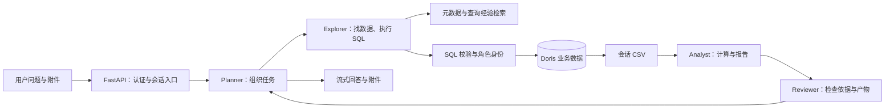

# 00. 认识 DataAgent：从一个问题到一份有依据的分析

DataAgent 帮助用户用自然语言查询和分析 Doris 中的数据。用户提出问题后，系统会查找业务口径，确定可用的表和字段，执行受控的只读 SQL，把结果交给分析 Agent 处理，最后返回文字、数据文件或分析报告。

例如，用户问：“比较 2024 年和 2025 年的销售情况，解释变化主要来自哪些地区。”真正要完成的工作不止是把这句话翻译成 SQL。系统还需要弄清“销售”是否扣除退款、按下单时间还是支付时间统计、用户能看哪些地区，以及两年的数据是否可比。DataAgent 把这些问题分给不同模块处理，让模型负责理解和组织任务，让确定性的代码负责身份、权限、执行、存储和资源管理。

本文是整套文档的入口。初次使用请先按 [README](../README.md) 配置和启动；理解项目时，可以先读本文，再沿感兴趣的链路进入模块文档。文中的数值是仓库当前默认配置，不代表所有部署都使用这些值。

## 1. 用户实际会看到什么

普通用户登录后创建会话、发送问题，也可以上传资料作为分析输入。回答以流式方式出现，界面可以展示专业 Agent 的工作进度、工具结果和最终附件。生成的 CSV、图片与 HTML 报告保存在该会话的沙箱目录中，可通过受鉴权的附件接口访问。

管理员多出四类管理能力：维护元数据，管理用户，配置 Doris 角色及其权限，管理查询经验。管理员先把业务数据接入并说明清楚，普通用户才能得到有上下文的分析。平台管理员身份本身不等于拥有全部业务数据的查询权限。

系统支持简单查数，也支持多步骤分析。简单查数不需要强行经过每一种 Agent；综合分析才需要计算、绘图和审查。当前 Planner 提示词要求综合分析报告以 Analyst 生成的自包含 HTML 交付，但这是一项工作约定，不意味着任意一次模型响应都能无条件产生正确报告。

## 2. 用一次查询理解整个系统

以“两年的销售变化”为例，正常链路如下：

1. **确认是谁在问。** 后端检查登录令牌，并读取用户当前状态和 Doris 角色。令牌仍未过期，但账号已被禁用时，请求同样会被拒绝。
2. **接收本轮工作。** 会话服务验证归属，取得会话生命周期锁，再启动后台 Run。浏览器只是订阅者，断开页面连接不会自动终止分析。
3. **拆分任务。** Planner 决定先查哪些数据，哪些任务可以并行，哪些必须等待上游产物。
4. **找到数据含义。** Explorer 搜索字段、指标、字段值和已成功执行过的查询经验。检索受当前权限约束，旧快照也不能绕过新的授权状态。
5. **安全执行 SQL。** Guard 检查单条只读 SQL、表字段来源和权限，随后使用角色对应的 Doris 查询账号执行。
6. **把大结果留在文件中。** Doris 结果分批写入 CSV。模型收到路径、行数、字段信息和少量样例，而不是整个数据集。
7. **计算与审查。** Analyst 读取 CSV，计算差异并生成图表或报告；Reviewer 检查数据、计算和产物是否一致。发现问题时可以要求上游 Session 修补。
8. **交付并保留依据。** Planner 汇总结果，后端核验附件路径和可下载性。会话消息、委派状态、召回快照与查询记录分别进入对应存储，供后续查看或恢复。

这张图表达职责，不是强制状态机。实际调用次数、是否并行、是否修补，由任务内容和 Planner 的决策决定。

## 3. 七个模块各自负责什么

| 模块 | 它要回答的问题 | 进一步阅读 |
| --- | --- | --- |
| Shared | 应用怎样读取配置、连接服务、记录日志、传递错误和执行后台任务？ | [运行基础](01_公共基础能力.md) |
| Identity | 当前用户是谁，能管理什么，能查询哪些数据？ | [认证与授权](02_认证与授权.md) |
| Metadata | 数据在哪里，每个字段是什么意思，怎样根据业务描述找到它？ | [目录与召回](03_元数据与语义召回.md) |
| Sandbox | 代码在哪里运行，文件属于谁，怎样隔离与回收？ | [工作区与执行环境](04_沙箱与隔离工作区.md) |
| Query | SQL 能不能执行，怎样限制资源，结果和经验怎样保存？ | [查询链路](05_安全查询与经验沉淀.md) |
| Assistant | 多个 Agent 怎样协作，一轮任务怎样开始、停止、恢复和展示？ | [对话与分析协作](06_对话与多智能体协作.md) |
| Workflows | 跨多个模块的删除或变更，怎样按顺序完成并在失败后恢复？ | [跨模块工作流](07_跨模块工作流.md) |

`main.py` 注册 HTTP 入口；`app/runtime.py` 创建并管理 Web 进程资源；各模块的 `providers.py` 和 API dependencies 负责组装具体服务。业务代码通常按 `api → service → repository/client` 阅读，但有些用例还需要 Runtime 管理短会话，或 Workflow 协调跨模块操作。

这些层并非为了让每次调用多绕几步：API 处理协议，服务表达业务规则，仓储处理存储语义，Runtime 说明资源何时创建和关闭。理解职责后，再去读类名会容易得多。

## 4. 数据分别放在哪里

| 存储 | 保存的内容 |
| --- | --- |
| Doris | 原始业务数据、角色、实际 SELECT 权限与行策略 |
| PostgreSQL `auth` | 平台用户、刷新令牌、Doris 查询身份、权限指纹、注销任务 |
| PostgreSQL `meta` | 元数据目录、同步状态、召回快照、查询执行记录和查询经验 |
| PostgreSQL `langgraph` | Conversation 目录、删除墓碑、LangGraph Checkpoint |
| Elasticsearch | 字段与指标语义索引、字段值索引、查询经验索引 |
| Redis | Celery 消息与任务结果、认证限流、沙箱所有权和操作租约 |
| Docker Named Volume | 上传资料、CSV、分析脚本、图表和报告 |
| API 进程内存 | 活跃 Run、SSE 重放窗口、运行时缓存、Shell 作业状态 |

项目默认用同一套 PostgreSQL 服务中的三个数据库，不要求部署三个 PostgreSQL 实例。ORM 表属于 `AuthBase`、`MetaBase`、`AssistantBase` 三套声明；LangGraph 自己的 Checkpoint 表由其持久化组件管理。

Elasticsearch 可以落后于 PostgreSQL，因此搜索结果需要结合当前目录、版本和权限再检查。Docker 容器可以停止甚至重建，但只要卷还在，文件可以继续保留。反过来，Checkpoint 保存了模型状态，并不意味着内存中的 Run 和 Shell 作业也可以原样跨进程恢复。

## 5. 几个容易混淆的名字

| 名字 | 含义 |
| --- | --- |
| User | 平台账号，对应一套用户沙箱资源 |
| Conversation | 用户界面中的一段对话，也是消息归属、附件访问和执行互斥的边界 |
| Turn | 处理一次用户输入的逻辑回合，可以包含多次模型调用和自动续写 |
| Run | 当前 API 进程中承载一次执行的任务与事件订阅对象 |
| Analysis | 同一 Conversation 内的一项分析目标，由 `analysis_id` 区分 |
| Session | 一个专业 Agent 可反复续接的工作上下文，保存消息和文件 |
| Delegation | Planner 对某个 Session 发起的一次具体委派 |
| Checkpoint | 图执行状态的持久化记录，包括消息、任务进度和委派结果等 |

Session 和 Delegation 尤其不能混用：继续使用同一个 Session 是继续已有工作；重放同一个 Delegation 则可能直接复用已完成的结果，避免重复执行。

## 6. 权限不是只在一个地方检查

权限分成相互补充的几层。HTTP 层限制谁能访问某个会话、谁能进入管理接口；检索层尽量不向用户或模型暴露无权访问的字段；SQL Guard 检查实际使用的表和字段；Doris 最终按查询账号的授权和行策略执行；沙箱和附件接口再限制文件读写与下载范围。

模型提示词规定 Planner、Explorer、Analyst、Reviewer 的分工，但提示词不是数据库权限或文件隔离的替代品。数据库账号、容器 UID、工作区路径、跨进程锁和服务端校验承担实际执行边界。

## 7. 运行项目需要哪些进程

完整的本地环境包括前端、FastAPI、Celery Worker、Celery Beat，以及 Doris、PostgreSQL、Elasticsearch、Redis 和 Docker 沙箱。外部语言模型与 Embedding 服务也必须按配置可访问；MCP 是给 Explorer 扩展工具的入口。

用户对话的 Agent Run 在 API 进程中执行，不是交给 Celery。Celery 主要执行索引同步、标题生成和资源清理；Beat 按配置发出定时任务。只启动 API 能打开部分页面，但不代表索引和清理流程已经运行。

多个 API Worker 可以共用持久化存储和数据库锁，但活跃 Run 及 SSE 缓冲仍属于某个具体进程。开始、订阅、停止同一个会话时，需要落到持有它的进程；现有架构没有跨进程事件转发或远程取消总线。

## 8. 阅读代码与排查问题的顺序

| 想了解的行为 | 建议从哪里开始 |
| --- | --- |
| 用户发送一条消息 | [Turn 入口](../app/assistant/execution/turn.py) → [Run 执行](../app/assistant/execution/run.py) → [运行时工厂](../app/assistant/execution/runtime_factory.py) |
| 一条 SQL 怎样产生 CSV | [SQL 工具](../app/assistant/agents/explorer/tools/execute_sql.py) → [查询用例](../app/query/services/execution_handler.py) → [执行器](../app/query/services/executor.py) |
| 业务词怎样找到字段 | [召回 Runtime](../app/assistant/agents/explorer/recall_runtime.py) → [搜索服务](../app/metadata/services/search.py) → [快照服务](../app/metadata/services/recall.py) |
| 修改权限后哪些结果失效 | [权限服务](../app/identity/services/authorization.py) → [查询经验召回](../app/query/services/experience_recall.py) |
| 用户注销为何还没结束 | [注销受理](../app/workflows/user_deletion.py) → [Worker 与补偿扫描](../app/workflows/tasks.py) → [状态存储](../app/identity/services/user_deletion_store.py) |

维护时应区分三种情况：模型没有理解需求、业务规则明确拒绝操作、基础服务执行失败。它们可能都表现为“没有拿到结果”，但需要查看的证据不同。不要只看页面最后一句报错；结合请求跟踪 ID、任务记录、同步版本和实际资源状态定位。
