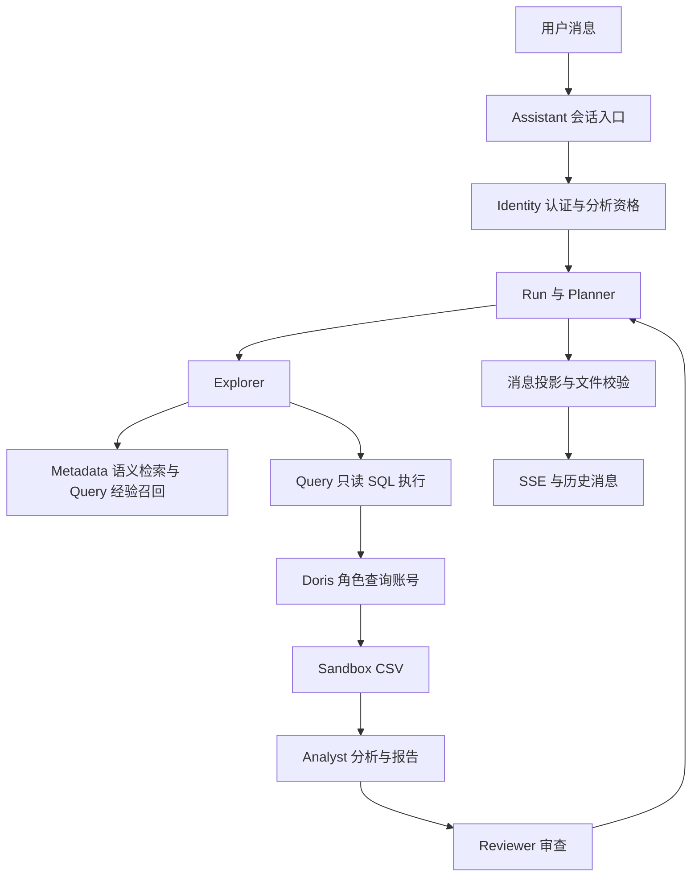

# 00. DataAgent：项目能力与模块协作

DataAgent 是一个模块化单体应用。用户通过聊天提出数据问题，Planner 安排专业 Agent 完成探索、查询、分析和审查，最终返回文字与文件。业务模块在同一 Python 应用内直接调用；耗时索引和资源清理由独立 Celery 进程执行。

## 1. 提供哪些功能

| 功能 | 用户可以做什么 | 负责模块 |
| --- | --- | --- |
| 账号与授权 | 登录、改密、管理用户、配置 Doris 角色与数据权限 | Identity |
| 业务元数据 | 维护表字段说明、指标口径、关联关系，导入导出 YAML | Metadata |
| 语义检索 | 检索字段、指标、字段值及可参考的 SQL 经验 | Metadata、Query，Assistant 组合结果 |
| 数据查询 | 使用角色查询账号执行只读 SQL，取得 CSV 和摘要 | Query |
| 多 Agent 分析 | 分解任务、委派专家、续接上下文、审查与补充分析 | Assistant |
| 文件与执行环境 | 上传资料、运行分析代码、生成图表和报告、下载产物 | Sandbox，Assistant 提供用户入口 |
| 会话操作 | 读取历史、查看运行状态、重连订阅、停止、改名和删除 | Assistant |
| 后台维护 | 同步索引、生成标题、回收草稿和沙箱、完成账号注销 | 业务任务及 Workflows |

Planner 负责协调，Explorer 负责数据探索与 SQL，Analyst 负责分析和报告，Reviewer 负责审查。Planner 根据任务需要选择专家和执行顺序。

## 2. 如何使用

### 2.1 运行组成

| 进程或服务 | 用途 |
| --- | --- |
| FastAPI | 认证、管理、聊天、文件和 SSE 接口 |
| React 前端 | 登录、聊天与管理中心 |
| Celery Worker | 执行索引、标题、清理和注销任务 |
| Celery Beat | 定时投递同步、修复及清理任务 |
| PostgreSQL | 身份、业务目录、执行记录、经验、会话与 Checkpoint |
| Doris | 业务数据、查询账号、SELECT 权限和行级策略 |
| Elasticsearch、Embedding | 全文与向量检索 |
| Redis | Celery 消息和结果、认证限流、沙箱租约与锁 |
| Docker | 用户独立的分析容器和持久数据卷 |

配置位于 `conf/app_config.yaml`，秘密值通过 `conf/.env` 或进程环境变量提供。默认本地后端端口为 7000，前端为 7001。部署时一同提供 `app/`、`conf/` 和 `resources/`，并准备业务数据、模型服务及向量服务。

在基础服务、依赖和配置准备完成后，于项目根目录运行：

```bash
# 初始化管理员
uv run -m scripts.bootstrap_admin

# 以下命令分别在独立终端中运行
uv run main.py
npm --prefix web run dev
uv run celery --app app.shared.tasks.celery_app:celery_app worker -l INFO
uv run celery --app app.shared.tasks.celery_app:celery_app beat -l INFO
```

### 2.2 首次配置与分析

1. 管理员登录管理中心，创建 Doris 角色与查询账号，配置工作组、SELECT 权限和行级策略。
2. 创建平台用户并绑定角色；默认角色用于后续未指定角色的新账号。
3. 导入业务元数据，等待字段和指标语义索引完成，对启用取值索引的字段执行首次全量同步。
4. 用户新建会话，可上传资料后发送数据问题。
5. 页面展示 Planner、工具和专家活动，用户可停止运行、查看历史或下载最终附件。

主要 HTTP 入口：

| 前缀 | 用途 |
| --- | --- |
| `/api/v1/auth` | 登录、令牌、改密与当前用户 |
| `/api/v1/admin/users`、`/api/v1/admin/doris-roles` | 账号与数据权限管理 |
| `/api/v1/meta` | 目录、导入导出与索引同步 |
| `/api/v1/admin/query-experiences` | 经验查询、禁用、删除与来源记录 |
| `/api/v1/chat` | 会话、执行、SSE、专家历史与附件 |
| `/api/v1/tasks/{task_id}` | 管理员查询后台任务状态 |

### 2.3 开发时调用模块

各业务模块在根包导出公开服务；调用方取得实例后直接调用方法。请求、返回值和异常分别放在所属模块的 `contracts`、`errors`。连接和服务实例由 Web、Worker 或 CLI 的组合入口创建，并注入使用方。

```python
from app.metadata import MetadataReader

# meta_postgres 是应用已创建的元数据库管理器。
reader = MetadataReader(meta_postgres)
catalog = await reader.query_catalog()
```

此示例位于异步业务方法中。调用方取得普通目录快照，数据库读取会话在方法返回前关闭。

## 3. 模块如何协作

### 3.1 一次分析


```mermaid
flowchart TD
    USER[用户消息] --> API[Assistant 会话入口]
    API --> AUTH[Identity 认证与分析资格]
    AUTH --> RUN[Run 与 Planner]
    RUN --> EXP[Explorer]
    EXP --> RECALL[Metadata 语义检索与 Query 经验召回]
    EXP --> SQL[Query 只读 SQL 执行]
    SQL --> DORIS[Doris 角色查询账号]
    DORIS --> CSV[Sandbox CSV]
    CSV --> ANALYST[Analyst 分析与报告]
    ANALYST --> REVIEW[Reviewer 审查]
    REVIEW --> RUN
    RUN --> RESULT[消息投影与文件校验]
    RESULT --> SSE[SSE 与历史消息]
```

这是包含探索、分析和审查的典型流程，Planner 可按任务安排不同分支。独立委派可并行，同一专家 Session 受互斥锁保护。

Query 先取得用户对应的查询身份，再校验只读 SQL、流式执行并写入 CSV。表列权限和行过滤由 Doris 执行。Metadata 的目录与资产策略用于检索及 SQL 依赖解析，Query 的成功业务 SQL 可聚合成后续可召回的经验。

专业 Agent 通过文本和沙箱文件交换结果。最终回答使用独占行的 `[[DATAAGENT_ARTIFACT:<absolute_path>]]` 声明文件，消息投影校验后生成下载附件。

### 3.2 元数据变更

目录事务先提交，Metadata 再将变更清单交给 Workflows。工作流依次失效关联查询经验、投递字段索引、投递指标索引。索引由 Worker 按资源版本异步建立。

目录、经验状态、消息投递和 Elasticsearch 写入分阶段完成。中途失败时保留已完成步骤，按版本和任务状态补做剩余工作。

### 3.3 会话删除与账号注销

会话删除先停止本进程运行，再取得生命周期锁并标记删除。后台清理 Checkpoint、召回快照、文件与会话记录；删除标记阻止迟到请求重建资源。

账号注销由 Workflows 协调：Identity 禁用账号并创建 pending 任务，Worker 清理用户全部会话和沙箱后完成账号删除。失败通过租约和到期扫描恢复。角色共享查询身份、查询经验和执行记录保留在各自模块。

### 3.4 共同规则

- 平台管理员资格、分析入口资格和数据权限分别检查；分析 SQL 使用角色查询账号。
- 用户和会话身份来自服务端认证与运行配置，模型工具只接收完成任务所需的业务参数。
- HTTP 和工具入口校验输入，内部调用使用已确认的数据；状态恢复、外部响应、权限和文件隔离在各自边界检查。
- 业务模块管理自己的事务与模型；共享物理数据库时仍使用独立 ORM 注册表。
- 普通数据库读写使用短事务，执行互斥锁覆盖其保护的操作。
- SSE 断开释放订阅，显式停止才取消运行。多 API 进程部署需将 Run 后续请求路由至拥有它的进程。

## 4. 目录、数据和运行资源

### 4.1 目录组织

```text
dataagent/
├── main.py                HTTP 路由、中间件和应用入口
├── app/
│   ├── identity/          auth、accounts、roles
│   ├── metadata/          catalog、search、indexing
│   ├── query/             execution、experiences
│   ├── assistant/         conversations、execution、sessions、messages、recall、agents
│   ├── sandbox/           manager、runtime、backend、execution、storage、ownership
│   ├── workflows/         用户注销和元数据变更协调
│   ├── shared/            配置、客户端、通用契约、错误、日志与任务设施
│   ├── runtime.py         WebResources 及资源生命周期
│   └── dependencies.py    HTTP 身份和资源依赖
├── conf/                  应用配置、环境变量模板和业务元数据
├── resources/             提示词与 Analyst 技能
├── scripts/               管理员引导和开发工具
├── docker/                基础服务、初始化和沙箱镜像
├── web/                   React 前端
├── tests/                 行为、协议与模块边界测试
├── dbmock/                示例业务数据生成子模块
└── docs/                  功能、调用方式与实现说明
```

模块内按职责组织文件。`api` 处理 HTTP，`repositories` 访问存储，`models` 保存领域和持久化结构，`tasks.py` 提供任务入口。Shared 只依赖通用库和自身，业务模块通过公开服务及契约协作。

### 4.2 数据归属

| 状态 | 所属模块 | 存储 |
| --- | --- | --- |
| 用户、令牌、角色查询凭据、注销任务 | Identity | auth PostgreSQL |
| 表字段指标目录、索引版本与取值同步状态 | Metadata | meta PostgreSQL |
| SQL 执行记录、经验及资产版本 | Query | meta PostgreSQL，独立 QueryBase |
| 会话、删除墓碑、召回快照 | Assistant | langgraph PostgreSQL，AssistantBase |
| Planner 与专家图状态、委派记录 | Assistant | LangGraph Checkpoint 表 |
| 字段、指标、取值和经验搜索文档 | Metadata、Query | Elasticsearch |
| 上传资料、CSV、脚本与报告 | Sandbox | 用户 Named Volume |
| Run、SSE 缓冲、Shell 作业注册表 | Assistant | 当前 API 进程内存 |

Conversation 定位用户对话，Turn 表示一次逻辑处理回合，Run 是本进程执行实例。Analysis 组织相关分析，专家 Session 持有可续接上下文；Delegation 标识一次具体工具委派。同一委派重放复用已保存结果，新委派续接 Session 的消息与文件。

### 4.3 生命周期与任务

`app/runtime.py` 创建 Web 资源并登记释放动作。运行时工厂复用模型和 MCP 工具；创建 Analyst 时取得技能挂载配置。API 退出先停止执行和运行资源，再关闭客户端。Worker 为任务创建自己的资源作用域。

| 队列 | 工作 |
| --- | --- |
| metadata-index | 元数据、取值与查询经验索引 |
| lightweight | 对话标题 |
| lifecycle | 会话清理、账号注销及补偿 |
| default | 未指定专属路由的任务 |

Celery 结果默认保存一天；索引版本与注销任务保存在业务数据库。消息可能重复投递，任务按锁、版本和终态处理幂等。向量维度必须与索引映射一致，沙箱硬存储配额依赖支持配额的卷驱动。

## 5. 异常与排障

| 现象 | 先检查哪个阶段 |
| --- | --- |
| 无法登录或进入分析 | Identity 的账号、Token、角色绑定 |
| 搜索不到业务内容 | Metadata 目录、资产权限、索引版本、ES 和 Embedding |
| 查询被拒绝或执行失败 | SQL Guard 问题、Doris 查询身份、权限与资源限制 |
| 分析卡住或专家失败 | Run、委派状态、会话锁、模型和 Shell 作业 |
| 文件不可下载 | Sandbox 路径归属、大小、属主和文件是否存在 |
| 后台工作未完成 | Worker 队列、任务 ID、业务状态和 Beat 补偿扫描 |
| 接口失败但数据已变化 | 已提交事务和跨存储步骤，按当前状态继续恢复 |

普通 HTTP 错误使用 `application/problem+json`，SSE 开始后的错误通过事件返回。使用请求、用户、Conversation、任务 ID 和资源键关联日志。Checkpoint、进程内执行和沙箱文件分别恢复，数据库持久化不能直接恢复另一个进程的 SSE 订阅或 Shell 作业注册表。
