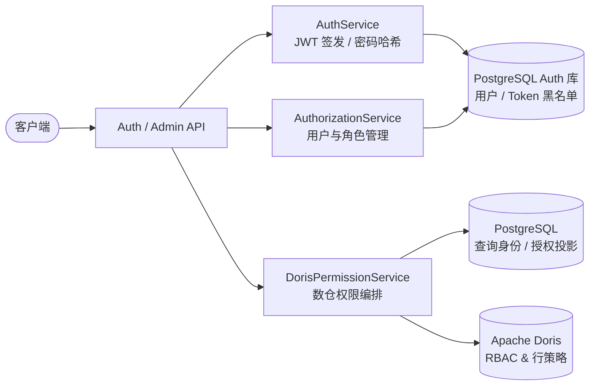

# 模块一：认证授权与数据安全

## 1. 模块定位与职责

认证授权与数据安全模块负责系统的全链路身份认证、平台 RBAC 授权、Doris 数据库权限治理与数据资产白名单过滤。系统通过将平台用户与 Doris 专属只读查询身份（Query Identity）绑定，实现前端用户操作权限与底层数仓行列级数据权限的深度联动。

---

## 2. 核心架构与功能特性

### 2.1 用户认证与令牌安全体系
- **密码哈希算法**：采用 Argon2id 算法（[`Argon2PasswordManager`](file:///home/kodey/dataagent/app/services/auth_service.py#L76-L105)）进行密码加密与校验。
- **JWT 双 Token 机制**：
  - `access_token`：短期令牌（默认 30 分钟），用于接口请求认证。
  - `refresh_token`：长期令牌（默认 7 天），用于无感刷新 Access Token。
  - **登出黑名单机制**：主动退出登录时将 Refresh Token 写入 [`revoked_tokens`](file:///home/kodey/dataagent/app/models/auth.py#L72-L86) 记录，防止令牌重放。
- **登录频控与防爆破**：[`AuthRateLimitService`](file:///home/kodey/dataagent/app/services/auth_rate_limit_service.py#L12-L96) 基于滑动时间窗口分别对 `Client IP` 与 `Username` 实施独立限流，超过阈值直接阻断。
- **请求链路跟踪**：[`TraceMiddleware`](file:///home/kodey/dataagent/app/core/middlewares/trace.py#L15-L45) 自动为每个 HTTP 请求分配 `request_id` 与 `trace_id`，并将当前认证用户 `user_id` 注入上下文变量（[`context`](file:///home/kodey/dataagent/app/core/context.py#L1-L15)），供日志与下游逻辑调用。

### 2.2 平台角色与管理员控制
- **管理员权限治理**：[`AuthorizationService`](file:///home/kodey/dataagent/app/services/authorization_service.py#L39) 提供管理员提升/撤销、用户删除及用户所属 Doris 角色分配。
- **最后管理员保护机制**：系统严格禁止降权或删除系统中最后一个管理员账号，避免平台管理权死锁。

### 2.3 Doris 查询身份与凭据加密体系
- **查询身份隔离（Query Identity）**：系统不直接使用 Doris 超级管理员执行用户分析查询，而是为每个 Doris 业务角色创建专用的查询代理用户（如 `sales_query`），保存在 [`doris_query_identities`](file:///home/kodey/dataagent/app/models/auth.py#L88-L115) 中。
- **对称加密保护**：查询账号的高强度随机密码由 [`DorisCredentialCipher`](file:///home/kodey/dataagent/app/services/doris_credential_service.py#L11-L43) 基于 Fernet 密钥对称加密后持久化存储，对外接口绝不返回明文密码。
- **动态角色发现与接入**：
  - `discover_roles`：扫描 Doris 中已存在的角色列表并识别是否已在平台登记。
  - `create_role`：在 Doris 中新建角色、关联 Workload Group、创建代理查询用户并保存凭据。
  - `attach_role`：为 Doris 中已存在的角色创建代理查询用户并接入平台纳管。

### 2.4 Doris 数据权限与行级过滤策略
- **SELECT 权限控制**：[`DorisPermissionService`](file:///home/kodey/dataagent/app/services/doris_permission_service.py#L32) 与 [`DorisRoleRepository`](file:///home/kodey/dataagent/app/repositories/doris_role_repo.py#L20) 协同，在 Doris 中执行标准的 `GRANT SELECT_PRIV` / `REVOKE SELECT_PRIV`，支持库级（`catalog.db.*`）、表级（`catalog.db.table`）与列级（`SELECT_PRIV(col1, col2)`）。
- **行级策略治理（Row Policy）**：
  - 支持直接读取角色的 Doris 行策略（`SHOW ROW POLICY FOR ROLE `role``）。
  - 支持创建 `RESTRICTIVE` / `PERMISSIVE` 类型的行过滤策略（`CREATE ROW POLICY ... USING (predicate)`）。
  - 支持行策略删除（`DROP ROW POLICY ... FOR ROLE `role``）。
- **资产授权投影与过滤**：
  - 授权变更时同步在 PostgreSQL 写入 [`doris_role_asset_grants`](file:///home/kodey/dataagent/app/models/auth.py#L117-L135) 投影。
  - [`MetadataAuthorizationFilter`](file:///home/kodey/dataagent/app/services/metadata_authorization_filter.py#L18) 在元数据目录和检索时，根据用户的 [`AssetAccessPolicy`](file:///home/kodey/dataagent/app/services/authorization_service.py#L22-L36) 动态过滤不可见的表、字段和指标。

---

## 3. 核心接口与协议

### 认证接口 (`/api/v1/auth`)
| 接口 | 方法 | 描述 |
| :--- | :--- | :--- |
| `/login` | `POST` | 用户名密码登录，签发 Access / Refresh Token |
| `/logout` | `POST` | 退出登录，注销 Refresh Token 并加入黑名单 |
| `/refresh` | `POST` | 使用有效 Refresh Token 兑换新 Access Token |
| `/change-password` | `POST` | 登录态下修改当前用户密码 |

### 平台与角色管理接口 (`/api/v1/admin`)
| 接口 | 方法 | 描述 |
| :--- | :--- | :--- |
| `/users` | `GET` / `POST` | 用户列表查询 / 新建平台用户 |
| `/users/{id}` | `DELETE` | 删除指定用户（含最后管理员校验） |
| `/users/{id}/admin` | `PUT` | 提升或取消用户管理员权限 |
| `/users/{id}/doris-role` | `PUT` | 变更用户绑定的 Doris 分析角色 |
| `/doris-roles` | `GET` / `POST` | 获取已纳管 Doris 角色 / 创建新角色 |
| `/doris-roles/discover` | `GET` | 发现数仓未纳管角色 |
| `/doris-roles/attach` | `POST` | 接入已存在的数仓角色 |
| `/doris-roles/{role}/select` | `POST` / `DELETE` | 授予 / 回收库、表、列 SELECT 权限 |
| `/doris-roles/{role}/row-policies` | `GET` / `POST` / `DELETE` | 查看 / 创建 / 删除 Doris 行级过滤策略 |

---

## 4. 关键代码映射

- 认证服务与密码管理：[`app/services/auth_service.py`](file:///home/kodey/dataagent/app/services/auth_service.py)
- 平台授权与角色服务：[`app/services/authorization_service.py`](file:///home/kodey/dataagent/app/services/authorization_service.py)
- Doris 权限管理服务：[`app/services/doris_permission_service.py`](file:///home/kodey/dataagent/app/services/doris_permission_service.py)
- Doris RBAC 存储访问：[`app/repositories/doris_role_repo.py`](file:///home/kodey/dataagent/app/repositories/doris_role_repo.py)
- 登录限流拦截器：[`app/services/auth_rate_limit_service.py`](file:///home/kodey/dataagent/app/services/auth_rate_limit_service.py)
- 资产白名单过滤器：[`app/services/metadata_authorization_filter.py`](file:///home/kodey/dataagent/app/services/metadata_authorization_filter.py)
