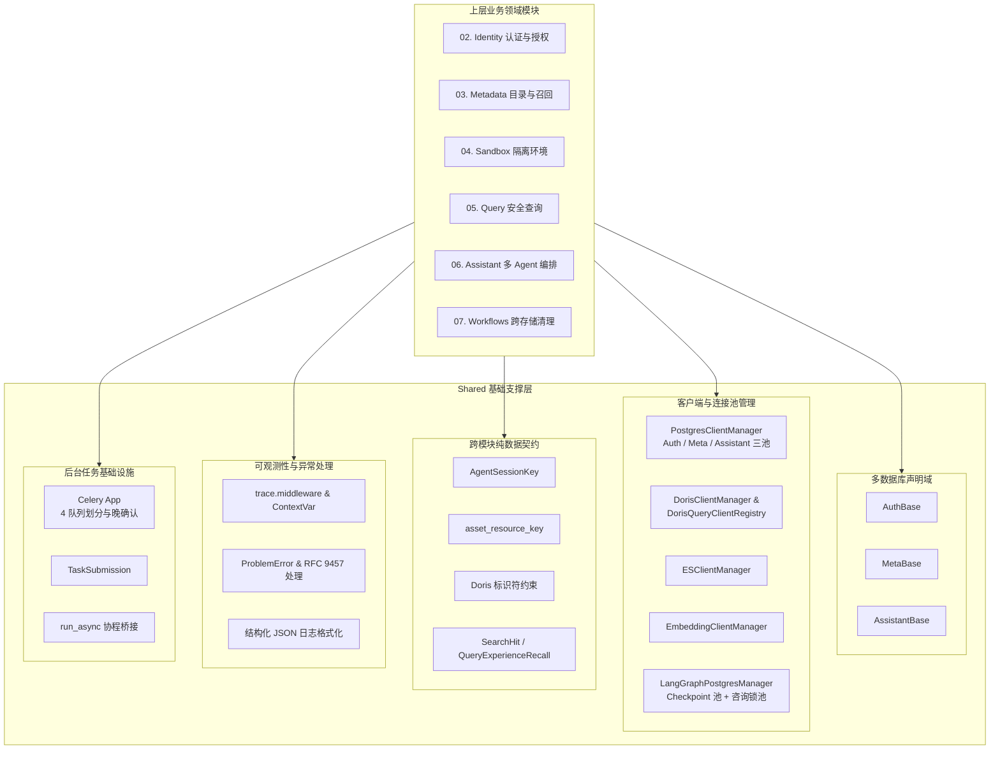

# 01. Shared：搭建运行基础

## 功能说明

Shared 放置所有业务模块都会用到的基础能力，包括数据库和外部服务连接、公共数据格式、统一错误响应、请求跟踪和后台任务。具体业务规则留在各自模块，共用的运行工具和数据结构放在 Shared。

---

## 1. 模块总体架构与分层设计

### 1.1 架构定位与核心职责

`shared` 位于系统最底层。Identity、Metadata、Sandbox、Query、Assistant 和 Workflows 都可以使用它，但 `shared` 不能反过来引用这些业务模块。它主要负责：

1. **统一管理连接和客户端**：集中创建、复用并关闭 PostgreSQL、Doris、Elasticsearch、Embedding 服务和 LangGraph Checkpoint 的连接。
2. **定义模块间数据格式（DTO）**：规定模块之间传什么数据、接口长什么样，避免循环引用，也避免把 ORM 对象和数据库连接传到其他模块。
3. **统一错误格式**：按 RFC 9457 返回 Problem Details，让客户端收到一致的错误结构，同时隐藏数据库细节和服务器堆栈。
4. **跟踪请求和记录日志**：用 `ContextVar` 保存每个请求的 Request ID、Trace ID、请求方法、路径、客户端 IP 和用户 ID，并输出控制台日志和 JSONL 文件日志。
5. **运行后台任务**：通过 Celery 提供四个固定队列，并配置任务确认、发布重试和定时执行规则。具体任务是否自动重跑，由各任务自己的装饰器决定。

### 1.2 系统数据流与架构关系



### 1.3 主要组件职责

| 组件 | 职责描述 |
| :--- | :--- |
| `AuthBase`、`MetaBase`、`AssistantBase` | 分别保存认证、元数据和助手模块的 SQLAlchemy 表定义 |
| `PostgresClientManager` | 管理 PostgreSQL 异步连接池、会话工厂和建表生命周期 |
| `DorisClientManager`、`DorisQueryClientRegistry` | 管理 Doris 管理员连接及按角色缓存的查询连接池 |
| `ESClientManager`、`EmbeddingClientManager` | 管理 Elasticsearch 与向量服务客户端生命周期 |
| `LangGraphPostgresManager` | 管理 Checkpoint 连接池和会话级咨询锁连接池 |
| `AgentSessionKey`、`asset_resource_key`、Doris 标识符约束 | 定义模块间共用的 Session 标识、资产键和名称规则 |
| `SearchHit`、`QueryAssetSnapshot`、`QueryExperienceRecallResult`、`QueryExperienceRecall` | 定义检索结果和查询经验在模块间传递时的数据格式 |
| `ProblemError`、`ProblemDetails` | 定义 RFC 9457 业务异常及响应结构 |
| `register_exception_handlers` | 统一处理业务异常、参数校验异常、HTTP 异常和未捕获异常 |
| `trace.middleware` 与请求上下文变量 | 维护 Request ID、Trace ID、用户和请求信息 |
| `celery_app`、`TaskSubmission`、`run_async` | 提供任务路由、提交结果和同步 Worker 的协程桥接 |
| `TaskAcceptedResponse`、`TaskStatusResponse` | 定义后台任务受理与状态响应 |
| `Cfg`、`cfg` | 提供强类型全局配置和环境变量绑定 |

### 1.4 配置会在模块导入时完成加载和校验

配置模块先读取 `conf/.env`，再读取 `conf/app_config.yaml`，解析其中的环境变量插值，最后交给 Pydantic 构造 `Cfg`。所有配置模型都设置了 `extra="forbid"`，拼错或多写的字段会直接报错。密码、Token 密钥、Redis URL 和外部服务密钥使用 `SecretStr` 保存，只有创建客户端时才取出明文。

除单个字段的类型和范围外，配置还会检查这些组合关系：Celery 软时限必须小于硬时限；字段值任务的执行时间必须写成不带秒和时区的本地 `HH:MM`；沙箱单文件上限不能超过用户总容量，停止空闲容器的时间必须早于删除时间；非 `local` 卷驱动需要在参数模板中使用容量占位符；模型附加参数不能覆盖系统明确设置的客户端参数；Responses 协议当前只接受 DeepSeek 和 OpenAI；默认模型和三个 Specialist 引用的模型必须已经声明。

`cfg = _load_config()` 在导入配置模块时立即执行。配置错误会让 API、Celery Worker 或脚本在业务服务启动前失败。这里检查的是配置结构和内部关系，不会连接 Doris、PostgreSQL、Elasticsearch 或模型服务，也不会验证 Embedding 服务实际返回的向量维度。

---

## 2. 多套数据库表定义与连接管理

系统会连接多套数据库。不同类型的数据放在不同的逻辑库或物理库中，各自使用独立的表定义和连接池。

### 2.1 三套独立的 SQLAlchemy 表定义

系统声明了三个独立的 ORM 基类：
- **`AuthBase`**：承载用户账号、密码摘要、Refresh Token、Doris 查询凭据映射、资产授权策略以及用户注销任务。
- **`MetaBase`**：承载 Doris 物理元数据资产、业务目录（表、字段、指标、关系）、字段值同步状态以及查询经验。
- **`AssistantBase`**：承载 Conversation 会话目录和删除标记。用户附件直接存储在沙箱上传目录中，没有独立的附件 ORM 表。

三套基类各自维护一份 `MetaData`，互相不建立跨库外键。模块需要关联数据时，明确使用不会变化的 ID，例如 `user_id` 和 `conversation_id`。

### 2.2 PostgreSQL 连接池与事务生命周期

管理器使用 `create_async_engine` 和 `postgresql+psycopg` 创建异步连接池：
- 配置参数：`pool_size=10`、`max_overflow=20`、`pool_pre_ping=True`（自动探测失效连接）、`pool_recycle=1800`（30 分钟回收长连接）。
- 每个进程长期复用同一个连接池。`PostgresClientManager` 只负责提供 `session()` 和 `get_session()`，不会自动提交事务。业务代码使用 `async with session.begin():` 明确控制事务的开始、提交和回滚。

### 2.3 Doris 双层连接架构

Doris 区分管理员操作与普通用户查询：
- **管理员连接池（`DorisClientManager`）**：基于 `mysql+asyncmy` 驱动构建长生命周期连接池，专门用于执行 Doris 角色管理、授权变更、Row Policy 维护及物理元数据探测等系统级操作。
- **角色查询连接注册表（`DorisQueryClientRegistry`）**：业务 SQL 使用角色自己的查询账号，不能使用管理员连接。注册表按 `role_name` 缓存连接池，并用查询用户名和密码摘要计算凭据指纹。账号或密码变化后，指纹也会变化；注册表随即关闭旧连接池并创建新连接池，让之后的连接使用新凭据。

### 2.4 Elasticsearch 与 Embedding 异步客户端

- **`ESClientManager`**：用配置的 HTTP 地址构造 `AsyncElasticsearch`，提供初始化、取用和关闭三个生命周期操作。重试与健康检查没有在管理器中额外配置。
- **`EmbeddingClientManager`**：管理一个 `httpx.AsyncClient` 封装，调用 OpenAI 兼容的 `/embeddings` 接口，并按响应中的 `index` 还原输入顺序。两者均在应用启动时显式初始化并在退出时异步关闭。

### 2.5 LangGraph 状态保存与会话锁连接池

`LangGraphPostgresManager` 使用 `psycopg_pool.AsyncConnectionPool` 维护两个互相独立的连接池：
1. **Checkpointer 连接池**：默认最大 20 连接，用于写入和读取 Agent 状态图的 Checkpoint 数据。
2. **Advisory Lock 连接池**：固定最大 12 连接，专门用于 Conversation 会话生命周期锁。

PostgreSQL 咨询锁（Advisory Lock）必须一直占用同一条数据库连接。`advisory_lock(name)` 先用进程内的 `asyncio.Lock` 阻止本进程重复执行，再调用 `pg_try_advisory_lock` 阻止其他服务实例同时执行。锁名称经过 SHA-256 计算后转换成 PostgreSQL 可接受的 64 位整数。

### 2.6 应用启动和关闭顺序

FastAPI 的 Lifespan 按依赖关系启动资源：
```text
启动阶段（正序）：EmbeddingClient -> ESClient -> LangGraphPostgres -> Sandbox -> Agent -> AuthPG -> MetaPG -> AssistantPG -> AdminDoris -> Doris 角色凭据与只读范围预检
退出阶段：ConversationRun -> Agent -> Sandbox -> LangGraphPostgres -> EmbeddingClient -> ESClient -> AssistantPG -> MetaPG -> AuthPG -> AdminDoris -> QueryDorisRegistry
```

Doris 预检会核对受管角色、查询账号、目标数据库、Workload Group 和只读授权。某个角色校验失败时只记录 WARNING，应用继续启动，方便管理员修复 Doris 配置；该角色之后执行真实查询时仍会在身份解析或 Doris 权限边界失败。启动或运行期间出现未捕获异常时，`finally` 会按上表列出的退出顺序关闭资源。各个关闭调用目前没有单独的异常隔离，其中一步抛出异常时，排在后面的资源不会继续关闭。

---

## 3. 模块间数据格式与隔离

Shared 统一定义模块之间传递的数据格式（DTO）和接口（Protocol）。这样可以避免循环引用，也不会把 ORM、数据库会话等实现细节带到其他模块。

### 3.1 模块间数据格式（DTO）的基本规则

这些公共数据格式使用冻结的 dataclass、Pydantic 模型、Literal 类型和纯函数。`AgentSessionKey`、`SearchHit` 与查询经验召回结果创建后不能修改。模块之间只传递数据副本和业务 ID，不传 ORM 对象、正在使用的数据库会话或外部客户端。

### 3.2 AgentSessionKey：一次 Agent 会话的统一标识

Assistant、Query 和 Sandbox 都用 `AgentSessionKey` 标识同一次 Agent 会话。它包含 `user_id`、`conversation_id`、`analysis_id`、`agent_type` 和 `session_id`。

这些字段用于确定三个隔离范围：
1. **Checkpoint 命名空间**：`checkpoint_ns = f"subagents/{analysis_id}/{agent_type}/{session_id}"`，为 LangGraph 子图状态持久化提供完全隔离的命名空间；
2. **沙箱文件隔离路径**：沙箱根据此 Key 在容器内部自动映射 `/data/{conversation_id}/sessions/{analysis_id}/{agent_type}/{session_id}/` 隔离目录；
3. **日志关联字段**：HTTP 请求期间写入 Request ID、Trace ID、客户端 IP、方法、路径与用户 ID。子智能体 Session 身份不会由 `AgentSessionKey` 自动注入这些 ContextVar。

### 3.3 资产键、名称规则和检索数据格式

- **`asset_resource_key`**：把数据源、数据库、表和字段组成的层级数组序列化后计算 SHA-256，生成跨模块稳定资产键；
- **Doris 标识符约束**：共享查询用户、角色和 Workload Group 使用的正则规则；
- **`SearchHit`**：携带检索项及原始分数；
- **`QueryAssetSnapshot`、`QueryExperienceRecallResult` 与 `QueryExperienceRecall`**：携带查询经验的资产版本、用途、SQL 模板和召回通道状态。

资产权限由 Identity 中的 `AssetIdentity` 和 `AssetAccessPolicy` 计算，查询账号信息由 `ResolvedQueryPrincipal` 提供。这些结构属于 Identity，不放在 Shared 中。

---

## 4. RFC 9457 统一错误协议与全局异常处理

所有 HTTP 错误都按 RFC 9457 Problem Details 格式返回。客户端只能看到安全的错误信息，数据库异常和服务器堆栈只写入服务端日志。

### 4.1 RFC 9457 Problem Details 规范定义

规范字段包括：
- `type`（错误标识 URI 或短名称）；
- `title`（人类可读错误摘要）；
- `status`（HTTP 状态码）；
- `detail`（针对当前错误的具体描述）；
- `instance`（触发错误的请求 URI 路径）；
- 扩展字段通过元数据字典动态挂载（如限流等待秒数 `retry_after_seconds`、表单校验错误列表 `errors`）。

### 4.2 四类全局异常处理

系统注册四级异常处理器：
1. **`ProblemError`（自定义业务异常基类）**：直接转换为对应的 Problem Details JSON 响应。状态码为 4xx 时在服务端记录 WARNING 日志；状态码为 5xx 时记录完整异常堆栈。若包含 `retry_after_seconds` 则自动在响应中注入标准 `Retry-After` HTTP 头部；
2. **`RequestValidationError`（Pydantic 请求体/查询参数校验失败）**：捕获后转换为统一的 422 Unprocessable Entity 响应，把 Pydantic 的错误转换为 `type`、`location` 和 `message` 三个字段，写入 `extensions["errors"]`；
3. **`Starlette / FastAPI HTTPException`**：统一转换为带有标准 HTTP 状态码的 Problem Details 响应；
4. **未捕获系统异常（`Exception`）**：向客户端统一返回静态安全的 500 Internal Server Error 响应，不向客户端暴露真实异常类名、SQL 语句或报错细节；真实异常堆栈完整输出至服务端 ERROR 级别日志以供排查。

---

## 5. 请求跟踪与日志

### 5.1 HTTP 中间件写入两个跟踪 ID

追踪中间件负责拦截每个入站 HTTP 请求：
- 从 HTTP 头部读取 `X-Request-ID`，若客户端未提供则自动生成新的 UUID4；同时读取 `X-Trace-ID`（默认等于 `request_id`）；
- 将 `request_id`、`trace_id`、`client_ip`、`method`、`path` 写入基于 Python `contextvars.ContextVar` 维护的请求上下文变量中，并在 HTTP 响应头中回传 `X-Request-ID` 与 `X-Trace-ID`；
- **客户端 IP 判定安全性**：中间件读取 `X-Forwarded-For` 的首个 IP 仅用于日志可观测性记录；在涉及高安全等级的认证密码暴力破解限流时，强制使用底层原始 ASGI 连接的 peer host，防止攻击者通过伪造 HTTP 请求头绕过 IP 限流。

### 5.2 请求结束后恢复 ContextVar

中间件会在 `finally` 中按设置的相反顺序调用 `token.reset()`。ContextVar 可能被下游协程继承，请求结束时及时恢复原值，可以防止用户信息和跟踪信息串到下一个请求。

### 5.3 控制台与 JSONL 日志格式化

Loguru 同时输出彩色控制台日志和按天滚动的 JSONL 文件。JSON 载荷包含时间、级别、代码位置、请求上下文、消息、额外字段和异常堆栈。当前格式化器没有通用的密码或 Token 正则脱敏逻辑，调用方必须避免把敏感值写入日志。

### 5.4 跨域请求按配置的来源白名单放行

FastAPI 使用 `cfg.cors_origins` 作为允许的 Origin 列表，并允许携带凭据以及使用所有 HTTP 方法和请求头。默认配置的列表为空，不会允许浏览器从其他 Origin 发起跨域请求；部署前需要明确填写前端实际使用的 Origin。

---

## 6. Celery 后台任务通道与定时调度

系统使用 Celery 配合 Redis 作为异步后台任务执行通道。

### 6.1 如何保证任务可靠执行

- **只接受 JSON**（`accept_content=["json"]`，`task_serializer="json"`，`result_serializer="json"`），避免 Pickle 反序列化带来的安全风险；
- **成功后再确认任务**：`task_acks_late=True`。如果 Worker 因 OOM、断电等原因退出，Broker 会重新投递尚未完成的任务；
- **两级超时**：达到 `task_soft_time_limit` 时抛出 `SoftTimeLimitExceeded`，让任务有机会收尾；达到 `task_time_limit` 时直接终止子进程。Redis visibility timeout 比硬超时多 300 秒，避免任务仍在执行时被其他 Worker 重复领取；
- **记录执行状态并处理 Worker 异常退出**：`task_track_started=True` 会记录 `STARTED` 状态；`task_reject_on_worker_lost=True` 会让异常退出的 Worker 拒绝确认任务，交给 Broker 重新投递；
- **发布失败最多重试 3 次**：`task_publish_retry=True` 只负责生产者向 Broker 发送任务时的短暂故障，重试间隔从 0 秒开始，每次增加 0.2 秒，最大 1 秒。任务运行失败后的自动重试没有全局开启，需要任务通过 `autoretry_for` 或 `self.retry()` 单独声明；
- **关闭自动动态建队列**：`task_create_missing_queues=False`，防止因任务队列名称拼写错误导致在 Broker 中创建无用队列。

### 6.2 四类固定队列划分与任务路由

- **`metadata-index`**：处理高吞吐的元数据结构索引同步、字段采样值索引同步与查询经验向量化任务；
- **`lightweight`**：处理耗时短的轻量级任务（如会话首轮提问后异步调用语言模型生成会话标题）；
- **`lifecycle`**：处理长生命周期的跨存储资源清理任务（如会话物理删除、过期草稿定期扫描、用户全量资产注销工作流）；
- **`default`**：处理默认未归类的通用任务。

### 6.3 Celery Beat 定时调度机制

- **`value-index-daily-dispatch`**：每天在指定时间（`cfg.task_queue.value_index_sync_time`）扫描到期字段并分发字段值增量同步；
- **`lifecycle-periodic-dispatch`**：先重试清理已经带删除标记的 Conversation，再扫描并清理超过保留时间（`draft_ttl_minutes`）的未激活草稿会话；
- **`user-deletion-recovery`**：定期扫描因 Worker 故障或网络波动而中断的已超期注销任务；
- **`query-experience-index-repair`**：定期比对数据库与 Elasticsearch 中的查询经验版本，自动补齐未同步项。

### 6.4 最终状态保存在哪里，以及怎样避免重复处理

业务 PostgreSQL 保存任务的最终状态，例如用户注销状态、元数据索引版本、字段值 generation 和查询经验 revision。Redis Result Backend 只记录某一次 Celery 执行的结果。任务被重复投递时，业务代码通过版本号、数据库行锁、generation 或状态字段判断是否已经处理。

---

## 7. 关键实现代码摘录

以下代码选取当前实现中的关键类、函数和完整方法，保留源码里的名称、签名、处理流程和异常处理。没有展示的辅助定义和启动接线由正文说明。

### 1. 数据库声明基类实现

代码定义了认证、元数据与智能体三大数据域独立的 DeclarativeBase：

```python
"""应用关系型模型的声明基类。"""

from sqlalchemy.orm import DeclarativeBase


class AuthBase(DeclarativeBase):
    """认证与权限 ORM 声明基类。"""


class MetaBase(DeclarativeBase):
    """元数据 ORM 声明基类。"""


class AssistantBase(DeclarativeBase):
    """助手运行数据 ORM 声明基类。"""
```

### 2. PostgreSQL 客户端管理器实现

管理异步 Engine、连接池和会话工厂，生命周期与事务边界完全分离：

```python
"""PostgreSQL 客户端管理。"""

from collections.abc import AsyncIterator

from sqlalchemy import URL
from sqlalchemy.ext.asyncio import (
    AsyncEngine,
    AsyncSession,
    async_sessionmaker,
    create_async_engine,
)
from sqlalchemy.orm import DeclarativeBase

from app.shared.config.app_config import DBConfig, cfg
from app.shared.database.base import AssistantBase, AuthBase, MetaBase


class PostgresClientManager:
    """PostgreSQL 客户端管理器。"""

    def __init__(
        self,
        db_config: DBConfig,
        base: type[DeclarativeBase],
    ) -> None:
        """初始化 PostgreSQL 客户端管理器。"""
        self._db_config = db_config
        self._base = base
        self._engine: AsyncEngine | None = None
        self._session_maker: async_sessionmaker[AsyncSession] | None = None

    @property
    def _url(self) -> URL:
        """获取异步数据库连接 URL。"""
        return URL.create(
            drivername="postgresql+psycopg",
            username=self._db_config.user,
            password=self._db_config.password.get_secret_value(),
            host=self._db_config.host,
            port=self._db_config.port,
            database=self._db_config.database,
        )

    def init(self) -> None:
        """初始化数据库引擎和会话工厂。"""
        self._engine = create_async_engine(
            self._url,
            echo=False,
            pool_size=10,
            max_overflow=20,
            pool_pre_ping=True,
            pool_recycle=1800,
            pool_timeout=30,
        )
        self._session_maker = async_sessionmaker(
            self._engine,
            class_=AsyncSession,
            expire_on_commit=False,
        )

    def _get_session_maker(self) -> async_sessionmaker[AsyncSession]:
        """获取数据库会话工厂。"""
        if self._session_maker is None:
            raise RuntimeError("PostgreSQL 客户端管理器尚未初始化")
        return self._session_maker

    def session(self) -> AsyncSession:
        """创建数据库会话。"""
        return self._get_session_maker()()

    async def get_session(self) -> AsyncIterator[AsyncSession]:
        """获取 FastAPI 请求级数据库会话。"""
        async with self.session() as db_session:
            yield db_session

    async def close(self) -> None:
        """关闭数据库引擎并释放资源。"""
        if self._engine is not None:
            await self._engine.dispose()
        self._engine = None
        self._session_maker = None

    async def init_tables(self) -> None:
        """根据当前 ORM 模型创建尚未存在的数据表。"""
        if self._engine is None:
            raise RuntimeError("PostgreSQL 客户端管理器尚未初始化")
        async with self._engine.begin() as connection:
            await connection.run_sync(self._base.metadata.create_all)


# 进程级单例实例定义
auth_postgres_client_manager = PostgresClientManager(
    cfg.auth_postgresql,
    AuthBase,
)
meta_postgres_client_manager = PostgresClientManager(
    cfg.meta_postgresql,
    MetaBase,
)
assistant_postgres_client_manager = PostgresClientManager(
    cfg.langgraph_postgresql,
    AssistantBase,
)
```

### 3. Doris 管理连接与角色查询连接池

管理系统管理员连接池与按角色和凭据指纹动态维护的用户查询连接池：

```python
"""Doris 客户端管理。"""

import asyncio
import hashlib
from dataclasses import dataclass

from pydantic import SecretStr
from sqlalchemy import URL
from sqlalchemy.ext.asyncio import AsyncConnection, AsyncEngine, create_async_engine

from app.shared.config.app_config import DBConfig, cfg


class DorisClientManager:
    """Doris 客户端管理器。"""

    def __init__(self, db_config: DBConfig) -> None:
        """初始化 Doris 客户端管理器。"""
        self._db_config = db_config
        self._engine: AsyncEngine | None = None

    @property
    def _url(self) -> URL:
        """获取 Doris 异步连接 URL。"""
        return URL.create(
            drivername="mysql+asyncmy",
            username=self._db_config.user,
            password=self._db_config.password.get_secret_value(),
            host=self._db_config.host,
            port=self._db_config.port,
            database=self._db_config.database,
        )

    def init(self) -> None:
        """初始化 Doris 连接池。"""
        self._engine = create_async_engine(
            self._url,
            echo=False,
            pool_size=10,
            max_overflow=20,
            pool_pre_ping=True,
            pool_recycle=1800,
            pool_timeout=30,
        )

    def _get_engine(self) -> AsyncEngine:
        """获取 Doris 数据库引擎。"""
        if self._engine is None:
            raise RuntimeError("Doris 客户端管理器尚未初始化")
        return self._engine

    def connection(self) -> AsyncConnection:
        """创建 Doris 数据库连接。"""
        return self._get_engine().connect()

    async def close(self) -> None:
        """关闭 Doris 连接池并释放资源。"""
        if self._engine is not None:
            await self._engine.dispose()
        self._engine = None


@dataclass(frozen=True, slots=True)
class _QueryClientEntry:
    """记录查询连接池的凭据指纹和客户端实例。"""

    fingerprint: str
    manager: DorisClientManager


class DorisQueryClientRegistry:
    """按数据库中的稳定查询身份动态管理 Doris 连接池。"""

    def __init__(self, endpoint: DBConfig) -> None:
        """初始化查询端点和按角色隔离的连接池注册表。"""
        self._endpoint = endpoint
        self._entries: dict[str, _QueryClientEntry] = {}
        self._lock = asyncio.Lock()

    async def get_or_create(
        self,
        role_name: str,
        query_user: str,
        password: str,
    ) -> DorisClientManager:
        """读取或创建与当前查询凭据一致的连接池。"""
        fingerprint = hashlib.sha256(f"{query_user}\0{password}".encode()).hexdigest()
        stale: DorisClientManager | None = None
        async with self._lock:
            current = self._entries.get(role_name)
            if current is not None and current.fingerprint == fingerprint:
                return current.manager
            if current is not None:
                stale = current.manager
            manager = DorisClientManager(
                DBConfig(
                    host=self._endpoint.host,
                    port=self._endpoint.port,
                    user=query_user,
                    password=SecretStr(password),
                    database=self._endpoint.database,
                )
            )
            manager.init()
            self._entries[role_name] = _QueryClientEntry(fingerprint, manager)
        if stale is not None:
            await stale.close()
        return manager

    async def close(self) -> None:
        """关闭全部查询身份连接池。"""
        async with self._lock:
            entries = tuple(self._entries.values())
            self._entries.clear()
        for entry in entries:
            await entry.manager.close()


admin_doris_client_manager = DorisClientManager(cfg.doris)
query_doris_client_registry = DorisQueryClientRegistry(cfg.doris)
```

### 4. LangGraph 状态保存与会话锁管理器

管理基于 `psycopg_pool` 的 Checkpointer 连接池与独占会话的 advisory lock 连接池：

```python
"""LangGraph PostgreSQL 持久化客户端管理。"""

import asyncio
import hashlib
from collections.abc import AsyncGenerator
from contextlib import asynccontextmanager

from langgraph.checkpoint.postgres.aio import AsyncPostgresSaver
from psycopg import AsyncConnection
from psycopg.conninfo import make_conninfo
from psycopg.rows import DictRow, dict_row
from psycopg_pool import AsyncConnectionPool

from app.shared.config.app_config import DBConfig, cfg

_ADVISORY_POOL_MAX_SIZE = 12


class AdvisoryLockBusyError(RuntimeError):
    """指定 advisory lock 已被其他执行单元占用。"""


def _advisory_lock_key(name: str) -> int:
    """把业务锁名称稳定映射为 PostgreSQL bigint。"""
    digest = hashlib.sha256(name.encode("utf-8")).digest()
    return int.from_bytes(digest[:8], byteorder="big", signed=True)


class LangGraphPostgresManager:
    """LangGraph PostgreSQL Checkpointer 和咨询锁生命周期管理器。"""

    def __init__(self, db_config: DBConfig) -> None:
        """初始化 PostgreSQL 持久化配置。"""
        self._db_config = db_config
        self._pool: AsyncConnectionPool[AsyncConnection[DictRow]] | None = None
        self._advisory_pool: AsyncConnectionPool[AsyncConnection[DictRow]] | None = None
        self._checkpointer: AsyncPostgresSaver | None = None
        self._advisory_locks: dict[str, asyncio.Lock] = {}

    @property
    def _conninfo(self) -> str:
        """构造 PostgreSQL 连接信息。"""
        return make_conninfo(
            host=self._db_config.host,
            port=self._db_config.port,
            user=self._db_config.user,
            password=self._db_config.password.get_secret_value(),
            dbname=self._db_config.database,
        )

    async def init(self) -> None:
        """初始化连接池和 LangGraph Checkpointer。"""
        pool = AsyncConnectionPool[AsyncConnection[DictRow]](
            conninfo=self._conninfo,
            min_size=1,
            max_size=20,
            open=False,
            kwargs={
                "autocommit": True,
                "prepare_threshold": 0,
                "row_factory": dict_row,
            },
        )
        advisory_pool = AsyncConnectionPool[AsyncConnection[DictRow]](
            conninfo=self._conninfo,
            min_size=1,
            max_size=_ADVISORY_POOL_MAX_SIZE,
            open=False,
            kwargs={
                "autocommit": True,
                "prepare_threshold": 0,
                "row_factory": dict_row,
            },
        )
        try:
            await pool.open(wait=True)
            await advisory_pool.open(wait=True)
        except Exception:
            await advisory_pool.close()
            await pool.close()
            raise

        checkpointer = AsyncPostgresSaver(pool)
        try:
            await checkpointer.setup()
        except Exception:
            await advisory_pool.close()
            await pool.close()
            raise

        self._pool = pool
        self._advisory_pool = advisory_pool
        self._checkpointer = checkpointer

    def get_checkpointer(self) -> AsyncPostgresSaver:
        """获取已初始化的 Checkpointer。"""
        if self._checkpointer is None:
            raise RuntimeError("LangGraph PostgreSQL 管理器尚未初始化")
        return self._checkpointer

    @asynccontextmanager
    async def advisory_lock(
        self,
        name: str,
    ) -> AsyncGenerator[None, None]:
        """非阻塞获取连接级 PostgreSQL advisory lock。"""
        if not name:
            raise ValueError("咨询锁名称不能为空")
        if self._advisory_pool is None:
            raise RuntimeError("LangGraph PostgreSQL 管理器尚未初始化")

        lock_key = _advisory_lock_key(name)
        advisory_pool = self._advisory_pool
        local_lock = self._advisory_locks.setdefault(name, asyncio.Lock())
        if local_lock.locked():
            raise AdvisoryLockBusyError(f"咨询锁正在使用: {name}")
        await local_lock.acquire()
        try:
            async with advisory_pool.connection() as connection:
                # PostgreSQL advisory lock 绑定数据库连接；必须在同一专用连接上持锁
                # 到调用方退出，并在归还连接池前显式解锁。
                cursor = await connection.execute(
                    "SELECT pg_try_advisory_lock(%s) AS acquired",
                    (lock_key,),
                )
                row = await cursor.fetchone()
                if row is None or not bool(row["acquired"]):
                    raise AdvisoryLockBusyError(f"咨询锁正在使用: {name}")
                try:
                    yield
                finally:
                    await connection.execute(
                        "SELECT pg_advisory_unlock(%s)",
                        (lock_key,),
                    )
        finally:
            local_lock.release()

    async def close(self) -> None:
        """关闭连接池并释放持久化组件。"""
        if self._advisory_pool is not None:
            await self._advisory_pool.close()
        if self._pool is not None:
            await self._pool.close()
        self._advisory_pool = None
        self._pool = None
        self._checkpointer = None
        self._advisory_locks.clear()


langgraph_postgres_manager = LangGraphPostgresManager(cfg.langgraph_postgresql)
```

### 5. 模块间共用的 AgentSessionKey

统一约束跨模块会话身份并生成 Checkpoint 命名空间；沙箱路径由 Sandbox 的 `SandboxSessionScope` 使用这些字段另行派生：

```python
"""跨模块共享的分析任务与 Agent Session 标识。"""

import re
from dataclasses import dataclass
from typing import Literal
from uuid import UUID

type AgentType = Literal[
    "explorer",
    "analyst",
    "reviewer",
]

AGENT_TYPES: tuple[AgentType, ...] = (
    "explorer",
    "analyst",
    "reviewer",
)

IDENTIFIER_PATTERN = re.compile(r"^[a-z0-9][a-z0-9_-]{0,63}$")


def validate_agent_type(value: str) -> AgentType:
    """校验并收窄专业 Agent 类型。"""
    if value not in AGENT_TYPES:
        raise ValueError(f"未知的智能体类型: {value}")
    return value


def _validate_identifier(value: str, field_name: str) -> str:
    """校验 Analysis 和 Session 标识。"""
    if not isinstance(value, str) or IDENTIFIER_PATTERN.fullmatch(value) is None:
        raise ValueError(
            f"{field_name} 必须以字母或数字开头，且仅包含 1-64 位小写字母、数字、下划线或连字符"
        )
    return value


@dataclass(frozen=True, slots=True)
class AgentSessionKey:
    """定位一个可续接的专业 Agent Session。"""

    user_id: int
    conversation_id: UUID
    analysis_id: str
    agent_type: AgentType
    session_id: str

    def __post_init__(self) -> None:
        """校验用户及专业 Agent Session 标识。"""
        if isinstance(self.user_id, bool) or self.user_id <= 0:
            raise ValueError("user_id 必须为正整数")
        _validate_identifier(self.analysis_id, "analysis_id")
        validate_agent_type(self.agent_type)
        _validate_identifier(self.session_id, "session_id")

    @property
    def checkpoint_ns(self) -> str:
        """生成受控的 Checkpoint namespace。"""
        return f"subagents/{self.analysis_id}/{self.agent_type}/{self.session_id}"
```

资产键和检索结果使用以下固定数据格式：

```python
import hashlib
import json
from dataclasses import dataclass
from typing import Literal
from uuid import UUID

from pydantic import BaseModel, ConfigDict


def asset_resource_key(
    data_source: str,
    database_name: str | None = None,
    table_name: str | None = None,
    column_name: str | None = None,
) -> str:
    """生成层级数据资产的稳定资源键。"""
    canonical = json.dumps(
        [data_source, database_name, table_name, column_name],
        ensure_ascii=False,
        separators=(",", ":"),
    )
    return hashlib.sha256(canonical.encode()).hexdigest()


@dataclass(frozen=True, slots=True)
class SearchHit[SearchItemT]:
    """索引命中项及原始分数。"""

    item: SearchItemT
    score: float


type QueryAssetKind = Literal["table", "column"]
QUERY_EXPERIENCE_RECALL_LIMIT = 3
QueryExperienceRecallStatus = Literal["success", "partial", "failed"]


class QueryAssetSnapshot(BaseModel):
    """查询经验返回的资产引用。"""

    model_config = ConfigDict(frozen=True, extra="forbid")

    kind: QueryAssetKind
    database: str
    table: str
    column: str | None = None
    meta_version: int


class QueryExperienceRecallResult(BaseModel):
    """提供给 Explorer 的紧凑查询经验。"""

    model_config = ConfigDict(frozen=True, extra="forbid")

    id: UUID
    purpose: str
    sql_template: str
    assets: list[QueryAssetSnapshot]


class QueryExperienceRecall(BaseModel):
    """一次查询经验召回的结果及检索通道状态。"""

    model_config = ConfigDict(frozen=True, extra="forbid")

    status: QueryExperienceRecallStatus
    results: list[QueryExperienceRecallResult]
```

### 6. 错误协议与全局异常处理器实现

```python
"""应用异常与 RFC 9457 Problem Details 响应模型。"""

from collections.abc import Mapping
from http import HTTPStatus
from typing import Any

from pydantic import BaseModel, ConfigDict


class ProblemDetails(BaseModel):
    """RFC 9457 错误响应协议。"""

    model_config = ConfigDict(extra="allow")

    type: str
    title: str
    status: int
    detail: str | None = None
    instance: str | None = None


class ProblemError(Exception):
    """可由全局处理器转换为 Problem Details 响应的应用异常。"""

    type: str = "internal-server-error"
    title: str = "服务器内部错误"
    status: int = HTTPStatus.INTERNAL_SERVER_ERROR

    def __init__(
        self,
        title: str | None = None,
        *,
        detail: str | None = None,
        type: str | None = None,
        status: int | None = None,
        extensions: Mapping[str, Any] | None = None,
    ) -> None:
        """构造可序列化为 Problem Details 的应用异常。"""
        self.title = title or self.title
        self.detail = detail
        self.extensions = dict(extensions or {})
        if type is not None:
            self.type = type
        if status is not None:
            self.status = status

        super().__init__(detail or self.title)

    def to_problem(
        self,
        *,
        instance: str | None = None,
    ) -> dict[str, Any]:
        """转换为响应体。"""
        payload: dict[str, Any] = dict(self.extensions)
        payload.update(
            {
                "type": self.type,
                "title": self.title,
                "status": self.status,
            }
        )

        if self.detail is not None:
            payload["detail"] = self.detail
        if instance:
            payload["instance"] = instance
        return payload
```

```python
"""FastAPI 全局异常处理器。"""

from collections.abc import Mapping
from http import HTTPStatus
from typing import Any, cast

from fastapi import FastAPI, Request
from fastapi.exceptions import RequestValidationError
from fastapi.responses import JSONResponse
from loguru import logger
from starlette.exceptions import HTTPException
from starlette.types import ExceptionHandler

from app.shared.errors.base import ProblemError


def _build_response(
    request: Request,
    exc: ProblemError,
    *,
    headers: Mapping[str, str] | None = None,
) -> JSONResponse:
    """构造 Problem Details 错误响应。"""
    return JSONResponse(
        status_code=exc.status,
        content=exc.to_problem(instance=request.url.path),
        headers=headers,
        media_type="application/problem+json",
    )


def _log_problem(exc: ProblemError, source: Exception) -> None:
    """按响应状态记录异常。"""
    context = {
        "problem_type": exc.type,
        "status": exc.status,
        "exc_type": type(source).__name__,
        "detail": exc.detail,
    }
    if exc.status >= HTTPStatus.INTERNAL_SERVER_ERROR:
        logger.opt(exception=source).error(exc.title, **context)
    else:
        logger.warning(exc.title, **context)


def _problem_error_handler(request: Request, exc: ProblemError) -> JSONResponse:
    """处理应用预期异常。"""
    _log_problem(exc, exc)
    retry_after = exc.extensions.get("retry_after_seconds")
    headers = (
        {"Retry-After": str(retry_after)}
        if exc.status == HTTPStatus.TOO_MANY_REQUESTS
        and isinstance(retry_after, int)
        and retry_after > 0
        else None
    )
    return _build_response(request, exc, headers=headers)


def _validation_error_handler(
    request: Request, exc: RequestValidationError
) -> JSONResponse:
    """处理请求参数校验异常。"""
    errors: list[dict[str, Any]] = [
        {
            "type": error["type"],
            "location": list(error["loc"]),
            "message": error["msg"],
        }
        for error in exc.errors()
    ]
    problem = ProblemError(
        title="参数校验失败",
        detail="请求参数不符合接口要求",
        type="validation-error",
        status=HTTPStatus.UNPROCESSABLE_ENTITY,
        extensions={"errors": errors},
    )
    _log_problem(problem, exc)
    return _build_response(request, problem)


def _http_exception_handler(request: Request, exc: HTTPException) -> JSONResponse:
    """统一处理 FastAPI 与 Starlette HTTP 异常。"""
    detail = exc.detail if isinstance(exc.detail, str) else "请求处理失败"
    try:
        title = HTTPStatus(exc.status_code).phrase
    except ValueError:
        title = "HTTP 请求错误"
    problem = ProblemError(
        title=title,
        detail=detail,
        status=exc.status_code,
        type=f"http-{exc.status_code}",
        extensions=(
            {"errors": exc.detail} if isinstance(exc.detail, (list, dict)) else None
        ),
    )
    _log_problem(problem, exc)
    return _build_response(request, problem, headers=exc.headers)


def _unhandled_exception_handler(request: Request, exc: Exception) -> JSONResponse:
    """处理所有未捕获异常且不向客户端泄露内部信息。"""
    problem = ProblemError()
    _log_problem(problem, exc)
    return _build_response(request, problem)


def register_exception_handlers(app: FastAPI) -> None:
    """注册全局异常处理器。"""
    app.add_exception_handler(
        ProblemError,
        cast(ExceptionHandler, _problem_error_handler),
    )
    app.add_exception_handler(
        RequestValidationError,
        cast(ExceptionHandler, _validation_error_handler),
    )
    app.add_exception_handler(
        HTTPException,
        cast(ExceptionHandler, _http_exception_handler),
    )
    app.add_exception_handler(
        Exception,
        cast(ExceptionHandler, _unhandled_exception_handler),
    )
```

### 7. 追踪中间件与上下文恢复实现

```python
from contextvars import ContextVar

request_id_ctx: ContextVar[str | None] = ContextVar("request_id", default=None)
trace_id_ctx: ContextVar[str | None] = ContextVar("trace_id", default=None)
client_ip_ctx: ContextVar[str | None] = ContextVar("client_ip", default=None)
method_ctx: ContextVar[str | None] = ContextVar("method", default=None)
path_ctx: ContextVar[str | None] = ContextVar("path", default=None)
user_id_ctx: ContextVar[str | None] = ContextVar("user_id", default=None)
```

```python
import uuid
from collections.abc import Callable

from fastapi import Request, Response

from app.shared.observability import context


def _get_client_ip(request: Request) -> str:
    """获取 IP 地址。"""
    # 转发头只进入日志上下文；认证限流使用 ASGI peer 地址，不能信任客户端自报值。
    if forwarded := request.headers.get("X-Forwarded-For"):
        return forwarded.split(",")[0].strip()
    if request.client:
        return request.client.host
    return "unknown"


async def middleware(request: Request, call_next: Callable) -> Response:
    """追踪中间件。"""
    request_id = request.headers.get("X-Request-ID", str(uuid.uuid4()))
    trace_id = request.headers.get("X-Trace-ID", request_id)
    request_id_token = context.request_id_ctx.set(request_id)
    trace_id_token = context.trace_id_ctx.set(trace_id)
    client_ip_token = context.client_ip_ctx.set(_get_client_ip(request))
    method_token = context.method_ctx.set(request.method)
    path_token = context.path_ctx.set(request.url.path)
    user_id_token = context.user_id_ctx.set(None)
    try:
        response = await call_next(request)
        response.headers["X-Request-ID"] = request_id
        response.headers["X-Trace-ID"] = trace_id
        return response
    finally:
        # ContextVar 值会被下游任务继承；请求结束时必须恢复调用方上下文，避免
        # 测试或替代 ASGI 调度器复用同一任务时把身份和追踪信息带入下一请求。
        context.user_id_ctx.reset(user_id_token)
        context.path_ctx.reset(path_token)
        context.method_ctx.reset(method_token)
        context.client_ip_ctx.reset(client_ip_token)
        context.trace_id_ctx.reset(trace_id_token)
        context.request_id_ctx.reset(request_id_token)
```

### 8. Celery 任务系统与调度表实现

```python
"""Celery 应用与队列配置。"""

from celery import Celery
from celery.schedules import crontab
from kombu import Queue

from app.shared.config.app_config import cfg

TASK_VISIBILITY_TIMEOUT_SECONDS = cfg.task_queue.task_time_limit_seconds + 300

celery_app = Celery(
    "dataagent",
    broker=cfg.task_queue.broker_url.get_secret_value(),
    backend=cfg.task_queue.result_backend.get_secret_value(),
    include=[
        "app.assistant.tasks",
        "app.metadata.tasks",
        "app.query.tasks",
        "app.workflows.tasks",
    ],
)

celery_app.conf.update(
    accept_content=["json"],
    broker_connection_retry_on_startup=True,
    broker_transport_options={
        "visibility_timeout": TASK_VISIBILITY_TIMEOUT_SECONDS,
    },
    enable_utc=True,
    result_accept_content=["json"],
    result_expires=cfg.task_queue.result_expires_seconds,
    result_serializer="json",
    task_acks_late=True,
    task_create_missing_queues=False,
    task_default_exchange="dataagent",
    task_default_exchange_type="direct",
    task_default_queue="default",
    task_default_routing_key="default",
    task_queues=(
        Queue("default", routing_key="default"),
        Queue("metadata-index", routing_key="metadata-index"),
        Queue("lifecycle", routing_key="lifecycle"),
        Queue("lightweight", routing_key="lightweight"),
    ),
    task_publish_retry=True,
    task_publish_retry_policy={
        "max_retries": 3,
        "interval_start": 0,
        "interval_step": 0.2,
        "interval_max": 1,
    },
    task_reject_on_worker_lost=True,
    task_routes={
        "dataagent.assistant.generate_conversation_title": {
            "queue": "lightweight",
            "routing_key": "lightweight",
        },
        "dataagent.assistant.*": {
            "queue": "lifecycle",
            "routing_key": "lifecycle",
        },
        "dataagent.metadata.*": {
            "queue": "metadata-index",
            "routing_key": "metadata-index",
        },
        "dataagent.query.*": {
            "queue": "metadata-index",
            "routing_key": "metadata-index",
        },
        "dataagent.workflows.*": {
            "queue": "lifecycle",
            "routing_key": "lifecycle",
        },
    },
    task_serializer="json",
    task_soft_time_limit=cfg.task_queue.task_soft_time_limit_seconds,
    task_time_limit=cfg.task_queue.task_time_limit_seconds,
    task_track_started=True,
    timezone="Asia/Shanghai",
    worker_prefetch_multiplier=cfg.task_queue.worker_prefetch_multiplier,
)

celery_app.conf.beat_schedule = {
    "value-index-daily-dispatch": {
        "task": "dataagent.metadata.dispatch_value_indexes",
        "schedule": crontab(
            hour=cfg.task_queue.value_index_sync_time.hour,
            minute=cfg.task_queue.value_index_sync_time.minute,
        ),
    },
    "lifecycle-periodic-dispatch": {
        "task": "dataagent.assistant.cleanup_expired_drafts",
        "schedule": cfg.task_queue.lifecycle_schedule_seconds,
    },
    "user-deletion-recovery": {
        "task": "dataagent.workflows.dispatch_due_user_deletions",
        "schedule": cfg.lifecycle.user_deletion_retry_seconds,
    },
    "query-experience-index-repair": {
        "task": "dataagent.query.repair_indexes",
        "schedule": cfg.task_queue.query_experience_repair_seconds,
    },
}
```

后台任务提交与状态接口数据结构：

```python
from dataclasses import dataclass


@dataclass(frozen=True, slots=True)
class TaskSubmission:
    """已提交的 Celery 任务。"""

    task_id: str


from typing import Any
from pydantic import BaseModel


class TaskAcceptedResponse(BaseModel):
    """后台任务已受理。"""

    task_id: str


class TaskStatusResponse(BaseModel):
    """后台任务执行状态。"""

    task_id: str
    state: str
    ready: bool
    successful: bool | None
    result: Any | None = None
    error: str | None = None
```

### 9. FastAPI 启动与关闭流程

```python
from contextlib import asynccontextmanager
from fastapi import FastAPI
from loguru import logger

from app.providers import agent_manager, conversation_run_service, sandbox_manager
from app.shared.clients.doris_client_manager import (
    admin_doris_client_manager,
    query_doris_client_registry,
)
from app.shared.clients.embedding_client_manager import embedding_client_manager
from app.shared.clients.es_client_manager import es_client_manager
from app.shared.clients.langgraph_postgres_manager import langgraph_postgres_manager
from app.shared.clients.postgres_client_manager import (
    assistant_postgres_client_manager,
    auth_postgres_client_manager,
    meta_postgres_client_manager,
)
from app.shared.errors.exc_handlers import register_exception_handlers
from app.shared.observability import trace


@asynccontextmanager
async def _lifespan(_app: FastAPI):
    """初始化并释放应用进程持有的共享资源。"""
    try:
        # FastAPI 应用启动前执行。
        logger.info("开始初始化应用资源")
        embedding_client_manager.init()
        es_client_manager.init()
        await langgraph_postgres_manager.init()
        await sandbox_manager.init()
        await agent_manager.init()
        auth_postgres_client_manager.init()
        await auth_postgres_client_manager.init_tables()
        meta_postgres_client_manager.init()
        await meta_postgres_client_manager.init_tables()
        assistant_postgres_client_manager.init()
        await assistant_postgres_client_manager.init_tables()
        admin_doris_client_manager.init()
        await _verify_doris_query_identities()
        logger.info("应用资源初始化完成")

        yield
    finally:
        # FastAPI 应用结束前执行。
        logger.info("开始释放应用资源")
        await conversation_run_service.close()
        await agent_manager.close()
        await sandbox_manager.close()
        await langgraph_postgres_manager.close()
        await embedding_client_manager.close()
        await es_client_manager.close()
        await assistant_postgres_client_manager.close()
        await meta_postgres_client_manager.close()
        await auth_postgres_client_manager.close()
        await admin_doris_client_manager.close()
        await query_doris_client_registry.close()
        logger.info("应用资源释放完成")


def _create_app() -> FastAPI:
    """创建并组装 FastAPI 应用。"""
    setup_logger()
    app = FastAPI(lifespan=_lifespan, responses=_ERROR_RESPONSES)
    _register_middlewares(app)
    register_exception_handlers(app)
    _register_routes(app)
    return app


app = _create_app()
```

### 10. 配置加载入口与严格字段规则

所有配置模型都继承同一个严格基类：

```python
class AppConfigModel(BaseModel):
    """拒绝未知字段的应用配置基类。"""

    model_config = ConfigDict(extra="forbid")
```

全局配置在导入阶段完成读取、环境变量展开和强类型校验：

```python
def _load_config() -> Cfg:
    """从 .env 和 app_config.yaml 加载配置。"""
    dotenv.load_dotenv(CONFIG_DIR / ".env")
    loaded_cfg = OmegaConf.load(CONFIG_FILE)
    primitive_cfg = OmegaConf.to_container(loaded_cfg, resolve=True)
    return Cfg.model_validate(cast(dict[str, Any], primitive_cfg))


cfg = _load_config()
```

### 11. FastAPI 跨域中间件配置

跨域中间件直接使用强类型配置中的 Origin 白名单：

```python
def _register_middlewares(app: FastAPI) -> None:
    """注册中间件。"""
    app.middleware("http")(trace.middleware)
    app.add_middleware(
        CORSMiddleware,
        allow_origins=cfg.cors_origins,
        allow_credentials=True,
        allow_methods=["*"],
        allow_headers=["*"],
    )
```

### 12. 远程 Embedding 请求与响应校验

Embedding 客户端会统一处理鉴权、超时和响应顺序。服务端即使没有按输入顺序返回向量，也会先按 `index` 排序；返回数量不一致时立即报错，避免把向量绑定到错误的文本。

```python
class RemoteEmbeddingClient:
    """OpenAI 兼容的远程 Embedding 客户端。"""

    def __init__(self, config: EmbeddingConfig) -> None:
        """初始化远程 Embedding 客户端。"""
        self._config = config
        self._client = httpx.AsyncClient(
            base_url=config.base_url.rstrip("/"),
            timeout=config.timeout,
            headers=self._build_headers(
                config.api_key.get_secret_value()
                if config.api_key is not None
                else None
            ),
        )

    @staticmethod
    def _build_headers(api_key: str | None) -> dict[str, str]:
        """构建 HTTP 请求头。"""
        headers = {"Content-Type": "application/json"}
        if api_key:
            headers["Authorization"] = f"Bearer {api_key}"
        return headers

    async def aembed_documents(self, texts: list[str]) -> list[list[float]]:
        """生成多个文本的向量。"""
        if not texts:
            return []
        payload = {
            "model": self._config.model,
            "input": texts,
        }
        response = await self._client.post("/embeddings", json=payload)
        response.raise_for_status()
        return self._parse_embeddings(response.json(), expected_count=len(texts))

    async def aclose(self) -> None:
        """关闭远程 Embedding 客户端。"""
        await self._client.aclose()

    @staticmethod
    def _parse_embeddings(
        payload: dict[str, Any], expected_count: int
    ) -> list[list[float]]:
        """解析 Embedding 响应数据。"""
        data = payload.get("data")
        if not isinstance(data, list):
            raise TypeError("Embedding 响应缺失 data 列表")

        embeddings: list[list[float]] = [
            item["embedding"] for item in sorted(data, key=lambda item: item["index"])
        ]

        if len(embeddings) != expected_count:
            raise ValueError(
                f"Embedding 响应数量不匹配: 期望 {expected_count} 条，实际返回 {len(embeddings)} 条"
            )
        return embeddings


class EmbeddingClientManager:
    """Embedding 客户端管理器。"""

    def __init__(self, config: EmbeddingConfig) -> None:
        """初始化 Embedding 客户端管理器。"""
        self._config = config
        self._client: EmbeddingClient | None = None

    def init(self) -> None:
        """初始化 Embedding 客户端。"""
        self._client = RemoteEmbeddingClient(self._config)

    def get_client(self) -> EmbeddingClient:
        """获取 Embedding 客户端。"""
        if self._client is None:
            raise RuntimeError("Embedding 客户端管理器尚未初始化")
        return self._client

    async def close(self) -> None:
        """关闭 Embedding 客户端并释放资源。"""
        if self._client is not None:
            await self._client.aclose()
        self._client = None
```
