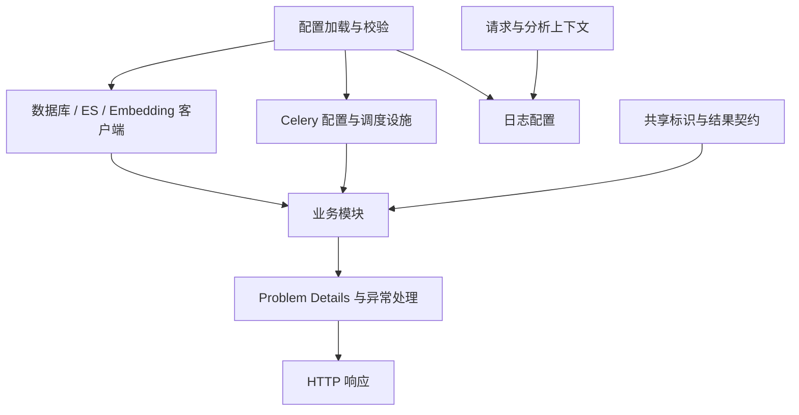

# 01. Shared：公共基础设施与运行机制

Shared 提供配置校验、外部客户端、数据库基础、跨模块契约、错误协议、日志追踪和 Celery 任务设施。业务模块使用这些能力完成自己的用例，连接与任务基础设施不保存具体业务规则。

## 1. 模块结构与职责

| 能力组 | 主要职责 | 使用边界 |
| --- | --- | --- |
| 配置 | 环境变量解析、类型检查、跨字段约束、敏感值包装 | 加载时确定，不按请求重新读取 |
| 客户端 | 初始化、获取连接、会话和关闭 | 具体使用时长由资源所有者管理 |
| 数据库基础 | 区分 Auth、Meta、Assistant ORM 数据域 | 不建立跨数据库外键 |
| Contracts | 共享身份、资产和查询/搜索结果结构 | 不传递业务 ORM 实体 |
| Errors | 标准业务异常、HTTP 错误投影 | 工具和 SSE 保持自己的错误协议 |
| Observability | 日志、请求与分析标识上下文 | 跟踪标识不作为授权凭据 |
| Tasks | Broker、队列、时限、提交结果与周期配置 | 业务任务实现及幂等规则属于各业务模块 |

## 2. 配置加载与校验

应用加载 `conf/.env` 中的环境变量，再通过 OmegaConf 解析 `conf/app_config.yaml` 中的引用，最后交给 Pydantic 校验。未知字段会被拒绝，端口、超时、并发上限等也有取值约束。

这一步发生在模块导入阶段。因此，缺失环境变量或配置拼写错误可能在 HTTP 服务启动前、甚至执行脚本或加载 Celery 时就报错。修改配置后，需要重启相关 API、Worker 或 Beat 进程；配置不是每次请求都从磁盘重新读取。

环境变量用于密码、令牌签名密钥和模型 API Key。YAML 描述服务地址、模型选择、资源限制及调度策略。`SecretStr` 减少对象打印时暴露秘密的机会，但不能代替日志审查；代码显式取出秘密后仍应谨慎处理。

| 配置组                                                       | 管什么                                        |
| ------------------------------------------------------------ | --------------------------------------------- |
| `auth_postgresql`、`meta_postgresql`、`langgraph_postgresql` | 三个业务数据库的连接                          |
| `doris`、`doris_credentials`                                 | 管理账号连接及查询凭据加密                    |
| `elasticsearch`、`embedding`                                 | 索引名、向量维度和向量服务                    |
| `auth`                                                       | JWT、令牌有效期、密码策略和限流 Redis         |
| `task_queue`、`lifecycle`                                    | Worker 时限、定时任务、草稿和注销策略         |
| `sandbox`                                                    | Docker 镜像、隔离、容量、租约和回收           |
| `query`                                    | SQL 资源限制和样例数  |
| `lm_config`、`agent`、`mcp`                                  | 模型协议、专业 Agent 配置、编排上限和外部工具 |

完整字段与注释以 `conf/app_config.yaml` 为准。向量维度必须和模型输出一致；同一 Docker 主机上不同部署应使用不同 `sandbox.deployment_namespace`。

## 3. 资源所有权与生命周期

Web 进程在 `app/runtime.py` 内创建一份 `WebResources`，挂到 `app.state.resources`。API dependencies 从中选择需要的服务，不把整个资源容器传进业务服务。

启动时先注册关闭动作，再逐项初始化。关闭动作放在 `AsyncExitStack` 中，正常退出或初始化失败时都会尝试逆序执行；一个组件关闭失败，不会让后面的关闭动作完全没有机会运行。这里的“尝试”不代表所有外部清理都必然成功。

当前初始化包括 Embedding/ES 客户端、LangGraph 持久化、沙箱、三套 ORM 表和管理 Doris 连接。运行时工厂中的模型和工具资源按其生命周期创建、复用和关闭。

Celery 任务使用任务自己的资源作用域。不要把上一次 `asyncio.run()` 中创建的异步客户端留到下一个事件循环继续使用；即使“又创建了一个模型对象”，它也可能共享底层 HTTP 客户端。项目的模型工厂明确管理同步和异步 HTTP 客户端，标题任务等入口在对应作用域退出前关闭它们。

## 4. 数据库与外部客户端

### 4.1 PostgreSQL 会话与事务

`PostgresClientManager` 创建 SQLAlchemy 异步引擎和会话工厂，驱动是 `postgresql+psycopg`。默认连接池基础容量 10，允许额外 20 条连接，启用连接健康检查和定期回收。

`session()` 返回一个数据库会话。进入 `async with session` 主要负责关闭资源；需要提交的业务操作必须明确建立事务。仓储表达 SQL 和行锁，服务或状态存储决定事务范围。

查询身份、元数据校验和查询记录分别使用短会话，Doris 执行期间不会继续占着前两阶段的 PostgreSQL 事务。有明确跨进程互斥职责的锁连接或锁事务则会覆盖相应操作，这属于有意持有，不应与漏关事务混为一谈。

### 4.2 Doris 管理连接与查询连接

`DorisClientManager` 使用 `mysql+asyncmy`。管理连接读取源结构、维护角色权限；`DorisQueryClientRegistry` 按角色管理查询账号的连接池，并根据用户名和密码指纹判断能否复用。凭据变化会替换旧池。

用户查业务数据使用角色对应的查询身份。配置里的后台管理账号不应成为所有用户查询的通用身份。

### 4.3 LangGraph 持久化与执行锁

`LangGraphPostgresManager` 直接使用 Psycopg 异步连接池维护 Checkpoint，并提供会话和 Session 所需的数据库锁能力。它与 SQLAlchemy 管理器使用的连接不是同一个池。

会话执行锁使用专用数据库连接，防止两个进程同时修改同一份图状态。锁可以阻止第二次执行，却不会把 SSE 消息转发到另一个 API 进程，也不会替其他进程取消任务。

### 4.4 HTTP 与搜索客户端

Embedding 客户端调用 OpenAI 兼容向量接口，检查响应条目数量并按索引恢复顺序；超时由配置控制。Elasticsearch 使用异步客户端。向量维度与 ES 映射的一致性由配置和索引使用方保证，客户端不会替调用方变更输出维度。业务级部分失败处理和重试由服务层负责。

## 5. 同步入口与事件循环

CLI 和 Celery 的同步函数通过 `app/shared/async_runtime.py` 启动一次独立事件循环。Windows 下显式使用 SelectorEventLoop，以兼容 Psycopg 的异步连接；`main.py` 的 Uvicorn 启动也使用对应循环工厂。

这项适配解决的是 Python 客户端循环类型，和 PostgreSQL 是否运行在 Docker 中无关。这项循环适配不代表整个服务具备原生 Windows 全栈兼容性。

## 6. 跨模块契约

Shared 中的 contracts 保存跨模块共同使用的标识和数据结构，避免各处自行拼接用户、会话、表和字段名称。

`AgentSessionKey` 包含 `user_id`、`conversation_id`、`analysis_id`、`agent_type`、`session_id`。它校验标识格式，并参与生成 Specialist Checkpoint namespace 和沙箱路径。专业 Session 的目录身份来自服务端上下文，而不是让模型另外指定一个用户或 Conversation。

资产键区分数据源、数据库、表和列。名称及组合键使用统一规范，避免简单字符串拼接造成歧义。搜索 DTO 保存命中资源、排名依据、索引状态、截断及部分失败等信息；不同模块不需要直接共享 ORM 对象。

## 7. 错误协议与响应边界

普通 HTTP 错误使用 `application/problem+json`，统一描述错误类型、标题、状态、详情和请求定位信息。参数校验、已知业务错误、HTTP 异常和未处理异常分别进入全局处理器，避免每个路由自行发明一种响应。

工具调用和 SSE 已经处于自己的协议中，使用工具错误载荷或 `error` 事件，不应期待流开始后还能把响应改成一个新的 HTTP Problem Details。

前端基于这些字段展示可理解的提示。完整数据库堆栈应留在日志中；接口的结构化错误用于说明用户能采取的下一步。

## 8. 日志与请求追踪

HTTP 中间件设置请求与链路跟踪上下文，返回相关跟踪头；请求结束后恢复 `ContextVar`，防止并发请求混用上一次的标识。日志同时支持控制台输出和按配置轮转的 JSONL 文件。

排查时先定位一次请求，再沿 Conversation、任务 ID、资源键或用户 ID 找到后台操作。一个 HTTP 请求结束后发出的 Celery 任务有自己的执行生命周期，不应仅凭时间相邻就认定两条日志属于同一项工作。

跨域由 `cors_origins` 白名单控制。前端开发代理和后端 CORS 是两个概念：同源代理可以避免浏览器直接跨域，但不会修改后端认证和权限规则。

## 9. 后台任务与周期调度

Celery Worker 消费任务，Beat 定时发出任务。任务队列的结果存储保留默认一天，业务是否已同步、已删除，则应查看 PostgreSQL 中的状态和版本。Broker 使用迟确认及 Worker 丢失后的重投策略，仍然可能重复投递，任务必须按各自业务规则处理幂等。

| 队列             | 当前主要用途                             |
| ---------------- | ---------------------------------------- |
| `default`        | 未专门指定路由的任务                     |
| `lifecycle`      | 会话资源清理、用户注销及相关补偿调度     |
| `lightweight`    | 会话标题生成                             |

默认单任务软时限 3300 秒、硬时限 3600 秒，预取倍数为 1。Redis 消息可见性时限按硬时限再加 300 秒设置；它不是业务重试等待时间。

| 定时工作             | 当前默认频率              | 说明                                           |
| -------------------- | ------------------------- | ---------------------------------------------- |
| 草稿与待删除会话清理 | 每 300 秒                 | 草稿默认保留 1440 分钟                         |
| 用户注销补偿         | 每 300 秒                 | 首次受理立即投递，这里处理漏投、失败和过期租约 |

不同任务的重试策略不同。用户注销的业务重试由数据库调度，未启用 Celery 自动重试。

## 10. 事务、锁与任务状态的职责边界

| 机制 | 维护的状态 | 不承担的职责 |
| --- | --- | --- |
| SQLAlchemy Session | 当前数据库访问上下文 | 进入上下文不自动提交业务修改 |
| 数据库事务 | 同一数据库内的一组变更 | 不覆盖 ES、Doris、Docker 或 Broker |
| Advisory Lock | 特定会话或业务键的互斥 | 不持久化任务进度、不转发事件 |
| Celery AsyncResult | 有期限的任务执行结果 | 不替代索引版本或注销任务状态 |
| ContextVar | 当前请求/任务的日志关联 | 不替代用户和会话归属检查 |

连接池属于创建它的进程和事件循环。短会话用于普通读写；有明确互斥用途的锁连接可以覆盖长操作。初始化、业务提交、消息投递和资源关闭分别处理错误，调用方根据已完成阶段决定补偿或重试。
