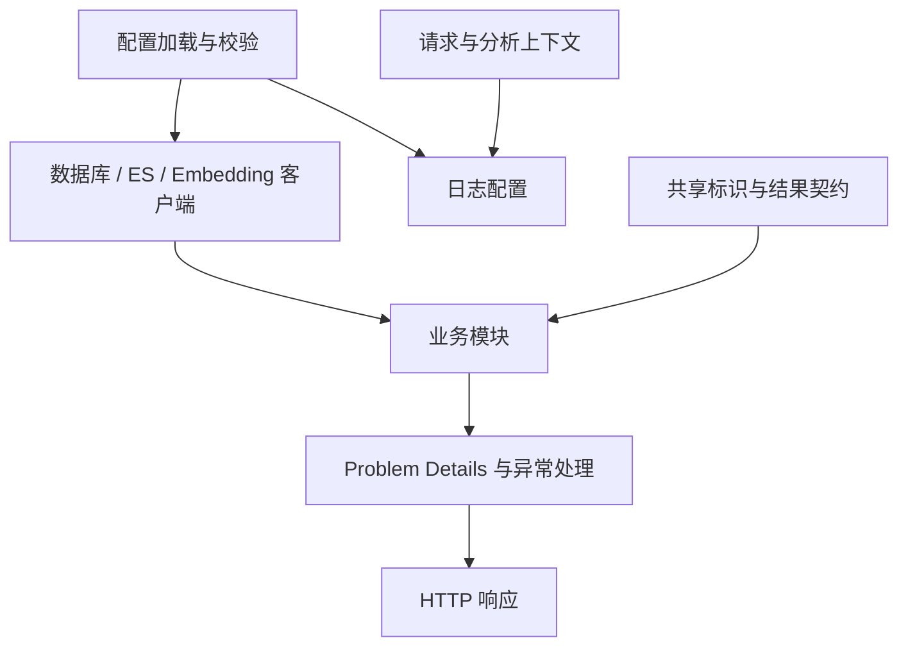

# 01. Shared：公共基础设施与运行机制

Shared 提供配置校验、外部客户端、数据库基础、跨模块契约、错误协议、日志追踪。业务模块使用这些能力完成自己的用例，连接与任务基础设施不保存具体业务规则。

## 1. 模块结构与职责

```mermaid
flowchart TD
    CONFIG[配置加载与校验] --> CLIENTS[数据库 / ES / Embedding 客户端]
    CONFIG --> LOG[日志配置]
    CONTRACTS[共享标识与结果契约] --> MODULES[业务模块]
    CLIENTS --> MODULES
    ERRORS[Problem Details 与异常处理] --> HTTP[HTTP 响应]
    MODULES --> ERRORS
    TRACE[请求与分析上下文] --> LOG
```

| 能力组 | 主要职责 | 使用边界 |
| --- | --- | --- |
| 配置 | 环境变量解析、类型检查、跨字段约束、敏感值包装 | 加载时确定，不按请求重新读取 |
| 客户端 | 初始化、获取连接、会话和关闭 | 具体使用时长由资源所有者管理 |
| 数据库基础 | 区分 Auth、Meta、Assistant ORM 数据域 | 不建立跨数据库外键 |
| Contracts | 共享身份、资产和查询/搜索结果结构 | 不传递业务 ORM 实体 |
| Errors | 标准业务异常、HTTP 错误投影 | 工具和 SSE 保持自己的错误协议 |
| Observability | 日志、请求与分析标识上下文 | 跟踪标识不作为授权凭据 |

## 2. 配置加载与校验

应用加载 `conf/.env` 中的环境变量，再通过 OmegaConf 解析 `conf/app_config.yaml` 中的引用，最后交给 Pydantic 校验。未知字段会被拒绝，端口、超时、并发上限等也有取值约束。

这一步发生在模块导入阶段。因此，缺失环境变量或配置拼写错误可能在 HTTP 服务启动前、甚至执行脚本 时就报错。修改配置后，需要重启API 进程；配置不是每次请求都从磁盘重新读取。

环境变量用于密码、查询凭据加密密钥和模型 API Key。YAML 描述服务地址、模型选择、资源限制及调度策略。`SecretStr` 减少对象打印时暴露秘密的机会，但不能代替日志审查；代码显式取出秘密后仍应谨慎处理。

| 配置组                                                       | 管什么                                        |
| ------------------------------------------------------------ | --------------------------------------------- |
| `auth_postgresql`、`meta_postgresql`、`langgraph_postgresql` | 三个业务数据库的连接                          |
| `doris`、`doris_credentials`                                 | 管理账号连接及查询凭据加密                    |
| `elasticsearch`、`embedding`                                 | 索引名、向量维度和向量服务                    |
| `lm_config`、`agent`                                  | 模型协议、专业 Agent 配置和编排上限 |

外部配置字段以 `conf/app_config.yaml` 为准，向量维度必须和模型输出一致。沙箱参数集中在 `app/sandbox/constants.py`；同一 Docker 主机上的不同部署应使用不同的 `DEPLOYMENT_NAMESPACE`。

## 3. 资源所有权与生命周期

Web 进程在 `app/runtime.py` 内创建一份 `WebResources`，挂到 `app.state.resources`。API dependencies 从中选择需要的服务，不把整个资源容器传进业务服务。

启动时先注册关闭动作，再逐项初始化。关闭动作放在 `AsyncExitStack` 中，正常退出或初始化失败时都会尝试逆序执行；一个组件关闭失败，不会让后面的关闭动作完全没有机会运行。这里的“尝试”不代表所有外部清理都必然成功。

当前初始化包括 Embedding/ES 客户端、LangGraph 持久化、沙箱、三套 ORM 表和管理 Doris 连接。运行时工厂中的模型和工具资源按其生命周期创建、复用和关闭。

后台任务使用 Web 事件循环和应用连接管理器。标题生成按次创建模型客户端，在退出任务作用域时关闭客户端。

## 4. 数据库与外部客户端

### 4.1 PostgreSQL 会话与事务

`PostgresClientManager` 创建 SQLAlchemy 异步引擎和会话工厂，驱动是 `postgresql+psycopg`。默认连接池基础容量 10，允许额外 20 条连接，启用连接健康检查和定期回收。

`session()` 返回一个数据库会话。进入 `async with session` 主要负责关闭资源；需要提交的业务操作必须明确建立事务。仓储表达 SQL 和行锁，服务或状态存储决定事务范围。

查询身份、元数据校验和查询记录分别使用短会话，Doris 执行期间不会继续占着前两阶段的 PostgreSQL 事务。有明确跨进程互斥职责的锁连接或锁事务则会覆盖相应操作，这属于有意持有，不应与漏关事务混为一谈。

### 4.2 Doris 管理连接与查询连接

`DorisClientManager` 使用 `mysql+asyncmy`。管理连接读取源结构、维护角色权限；`DorisQueryClientRegistry` 按角色管理查询账号的连接池，并根据用户名和密码指纹判断能否复用。凭据变化会替换旧池。

用户查业务数据使用角色对应的查询身份。配置里的后台管理账号不应成为所有用户查询的通用身份。

### 4.3 LangGraph 持久化与执行锁

应用启动时直接创建 `AsyncPostgresSaver`，使用独立于 SQLAlchemy 的 Psycopg 异步连接池维护 Checkpoint，由 lifespan 统一初始化和关闭。Web 使用单进程，运行注册表防止重复执行，本地删除锁串行化即时清理与周期补偿，不使用 PostgreSQL 业务锁。

会话执行锁使用专用数据库连接，防止两个进程同时修改同一份图状态。锁可以阻止第二次执行，却不会把 SSE 消息转发到另一个 API 进程，也不会替其他进程取消任务。

### 4.4 HTTP 与搜索客户端

Embedding 客户端调用 OpenAI 兼容向量接口，检查响应条目数量并按索引恢复顺序；超时由配置控制。Elasticsearch 使用异步客户端。向量维度与 ES 映射的一致性由配置和索引使用方保证，客户端不会替调用方变更输出维度。业务级部分失败处理和重试由服务层负责。

## 5. 同步入口与事件循环

CLI 的同步函数通过 `app/shared/async_runtime.py` 启动一次独立事件循环。Windows 下显式使用 SelectorEventLoop，以兼容 Psycopg 的异步连接；`main.py` 的 Uvicorn 启动也使用对应循环工厂。

这项适配解决的是 Python 客户端循环类型，和 PostgreSQL 是否运行在 Docker 中无关。这项循环适配不代表整个服务具备原生 Windows 全栈兼容性。

## 6. 跨模块契约

Shared 中的 contracts 保存跨模块共同使用的标识和数据结构，避免各处自行拼接用户、会话、表和字段名称。

专业 Agent 类型由共享契约定义；用户与 Conversation 从服务端运行配置传入，查询和文件工具都使用同一会话身份及目录。

资产键区分数据源、数据库、表和列。名称及组合键使用统一规范，避免简单字符串拼接造成歧义。搜索 DTO 保存命中资源、排名依据、索引状态、截断及部分失败等信息；不同模块不需要直接共享 ORM 对象。

## 7. 错误协议与响应边界

普通 HTTP 错误使用 `application/problem+json`，统一描述错误类型、标题、状态、详情和请求定位信息。参数校验、已知业务错误、HTTP 异常和未处理异常分别进入全局处理器，避免每个路由自行发明一种响应。

工具调用和 SSE 已经处于自己的协议中，使用工具错误载荷或 `error` 事件，不应期待流开始后还能把响应改成一个新的 HTTP Problem Details。

前端基于这些字段展示可理解的提示。完整数据库堆栈应留在日志中；接口的结构化错误用于说明用户能采取的下一步。

## 8. 日志与请求追踪

HTTP 中间件设置请求与链路跟踪上下文，返回相关跟踪头；请求结束后恢复 `ContextVar`，防止并发请求混用上一次的标识。日志同时支持控制台输出和按配置轮转的 JSONL 文件。

排查时先定位一次请求，再沿 Conversation、任务 ID、资源键或用户 ID 找到后台操作。一个 HTTP 请求结束后发出的后台任务有自己的执行生命周期，不应仅凭时间相邻就认定两条日志属于同一项工作。

跨域由 `cors_origins` 白名单控制。前端开发代理和后端 CORS 是两个概念：同源代理可以避免浏览器直接跨域，但不会修改后端身份选择和权限规则。

## 9. 后台任务与周期调度

Assistant 的任务服务负责标题生成、会话删除及周期清理，随应用启动和关闭。周期清理启动时立即执行，此后每轮结束等待 300 秒；草稿保留 1440 分钟，每轮每类最多清理 100 条。这些值在 Assistant 代码中定义为常量。单个 Web 进程运行一条周期扫描任务。

任务每次尝试最多执行 3600 秒，超时值在代码中定义为常量。资源清理失败后按 1、2、4 秒间隔重试；标题生成失败不重试。退出应用会取消并等待后台任务。待删除会话由数据库标记驱动后续补偿；中断的标题生成保留即时标题。

## 10. 事务、锁与任务状态的职责边界

| 机制 | 维护的状态 | 不承担的职责 |
| --- | --- | --- |
| SQLAlchemy Session | 当前数据库访问上下文 | 进入上下文不自动提交业务修改 |
| 数据库事务 | 同一数据库内的一组变更 | 不覆盖 ES、Doris或 Docker |
| 进程内 Run 注册表与删除锁 | 重复运行检查、串行资源清理 | 不提供跨进程互斥 |
| ContextVar | 当前请求/任务的日志关联 | 不替代用户和会话归属检查 |

连接池属于创建它的进程和事件循环。普通读写使用短会话，Agent 执行期间不占用数据库锁连接。初始化、业务提交、任务提交和资源关闭分别处理错误，调用方根据已完成阶段决定补偿或重试。
