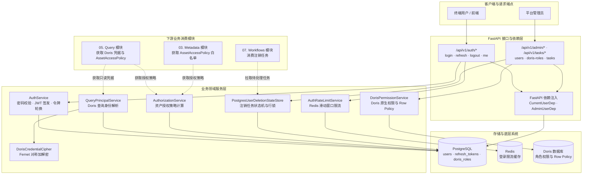

# 02. Identity：实现认证与数据授权

## 功能说明

Identity 回答两个问题：当前请求是谁发出的，以及这个用户能查询哪些数据。它负责账号和密码、Access Token、Refresh Token、Doris 查询账号、SELECT 权限和 Row Policy。

---

## 1. 模块总体架构与分层设计

### 1.1 架构定位与核心职责

所有需要登录用户的接口都从 `identity` 获取用户信息。Query 和 Metadata 也通过它判断用户能否看到或查询某项数据。主要职责包括：

1. **保护账号和密码**：使用 Argon2id 保存密码哈希，并限制同时计算密码哈希的请求数。账号不存在时也会执行一次假的密码校验，减少攻击者根据响应时间猜出账号的机会。
2. **管理 Access Token 和 Refresh Token**：Access Token 用于短期访问，Refresh Token 用于续期。`auth_version` 可以让旧 Access Token 立即失效；数据库行锁和令牌家族记录用于发现 Refresh Token 被重复使用。
3. **分开平台账号和 Doris 账号**：平台用户先绑定角色，再使用该角色的只读 Doris 查询账号。查询密码加密保存，业务查询不能使用 Doris 管理员账号。
4. **判断数据访问权限**：权限可以配置到数据源、数据库、表或字段。应用先检查 `AssetAccessPolicy`，Doris Row Policy 再限制用户能读取哪些行。
5. **记录用户注销进度**：PostgreSQL 保存注销任务的当前状态、重试时间和失败原因。行锁保护状态更新，任务租约减少多个调度器重复领取同一个用户。

### 1.2 系统数据流与架构关系



### 1.3 主要组件职责

主要组件按职责划分如下：

| 领域 | 核心类 / 函数 | 职责描述 |
| :--- | :--- | :--- |
| 账号模型 | `User`, `RefreshToken` | 平台用户实体模型与包含令牌族特性的 Refresh Token ORM 模型 |
| Doris 授权模型 | `DorisQueryIdentity`, `DorisRoleAssetGrant`, `DorisRowPolicy` | 保存 Doris 查询账号、应用侧权限记录和实时行策略 |
| 注销模型 | `UserDeletionTask` | 用户注销任务持久化模型，记录注销进度状态与重试到期时间 |
| 认证数据访问 | `IdentityPGRepo` | 读写平台用户和 Refresh Token，并处理行锁与整组令牌撤销 |
| Doris 管理数据访问 | `DorisRoleRepository` | 执行 Doris 角色、查询用户、权限和 Row Policy 操作 |
| 认证服务 | `AuthService`, `AccessTokenAuthenticator`, `JWTCodec`, `Argon2PasswordManager` | 负责 Argon2id 密码哈希、JWT 编解码、双令牌轮换与防重放检测 |
| 账号校验 | `validate_username`, `validate_email`, `validate_password_length` | 规范化用户名和邮箱并校验密码长度 |
| 凭据加密 | `DorisCredentialCipher` | 基于 Fernet 安全加解密 Doris 查询用户密码 |
| 查询身份 | `QueryPrincipalService` | 找到平台用户实际使用的只读 Doris 查询账号 |
| 授权与角色管理 | `AuthorizationService`, `DorisRoleManagementService` | 计算资产授权策略，管理平台用户与 Doris 角色映射 |
| Doris 权限服务 | `DorisPermissionService` | 分配、回收 Doris SELECT 权限并维护 Row Policy |
| 认证限流 | `AuthRateLimitService` | 基于 Redis 对登录 IP、登录标识和刷新 IP 限流 |
| 注销状态存储 | `PostgresUserDeletionStateStore` | 创建和领取注销任务，并记录失败或完成状态 |
| 认证接口 | `router` | 登录、刷新令牌、登出、修改密码与读取当前用户 |
| 认证依赖 | `CurrentUserDep`, `AdminUserDep` | 将 Bearer Token 转换为不可变用户快照并校验管理员身份 |
| 认证请求与响应 | `TokenResponse`, `LoginRequest`, `UserResponse` 等 | 定义认证接口使用的 Pydantic 数据格式 |
| 管理接口 | `router` | 管理平台用户、Doris 角色、权限与 Row Policy |
| 任务状态接口 | `router` | 查询 Celery 后台任务状态与结果 |
| 管理请求与响应 | `CreateUserRequest`, `UpdateUserRequest`, `UserListResponse` 等 | 定义管理接口的请求与响应格式 |
| 业务异常 | `InvalidCredentialsError`, `RefreshTokenReuseError` 等 | 认证与授权领域的 RFC 9457 结构化异常 |

---

## 2. 账号和密码安全

平台用户实体 `User` 承载用户身份标识与认证状态。

### 2.1 规范化与数据库唯一性约束

创建或更新账号时，系统用 `strip().casefold()` 去掉首尾空白并统一大小写，登录时也做相同处理。数据库对 `username` 和 `email` 设置唯一约束，因此两个并发请求也不能创建重复账号。

### 2.2 Argon2id 密码哈希与并发防护

密码哈希由 `Argon2PasswordManager` 实现，遵循 `PasswordManager` Protocol：
- 采用推荐的 Argon2id 算法参数，计算过程通过 `anyio.to_thread.run_sync` 调度至单独的线程池执行，避免 CPU 密集计算阻塞 asyncio 事件循环；
- 配置 `asyncio.Semaphore(max_concurrency=2)` 限制单个进程内并发哈希计算的最大数量，防止瞬时并发登录请求压垮 API 进程的 CPU 与内存。

### 2.3 账号不存在时也执行密码计算

用户名或邮箱不存在时，系统仍会对预先生成的 `dummy_hash` 执行一次密码校验。这样，“账号不存在”和“密码错误”所需时间更接近，攻击者更难根据响应时间判断账号是否存在。

### 2.4 管理员安全约束

- 系统始终保留至少一个处于启用状态的管理员账号。更新或禁用管理员时，必须锁定安全变更锁并核验系统中有效管理员总数，当有效管理员数量小于等于 1 时禁止禁用或降权；
- 管理员账号禁止注销或删除自身；
- 密码长度强制校验（通过配置定义，通常为 6 至 128 字符）。

### 2.5 初始管理员需要通过单独命令创建

应用启动不会自动创建管理员，HTTP 接口也没有公开的管理员注册入口。部署时需要运行管理员引导脚本：用户名和邮箱可以来自命令行参数或环境变量，密码只从环境变量读取。

引导过程会取得安全变更锁，因此多个初始化进程不能同时创建同一账号。已有账号必须同时匹配用户名、邮箱和密码；匹配成功时可以把该启用账号提升为管理员，再次运行会得到相同结果。任一字段与现有账号冲突都会失败。新建的初始管理员不绑定 Doris 角色，需要随后在管理接口中创建角色并分配，或设置默认角色后再更新该账号。

---

## 3. Access Token、Refresh Token 与重复使用检测

系统使用共享密钥签名 JWT。Access Token 有效期较短，Refresh Token 会写入数据库并且每次使用后都会更换。允许的签名算法为 `HS256`、`HS384` 或 `HS512`。

### 3.1 JWT 规范与 Claims 约束

访问令牌由 `JWTCodec` 签发，标准 payload 包含六个固定字段：
- `sub`：用户主键 ID 字符串；
- `auth_version`：用户的当前安全认证版本整数；
- `token_type`：固定为 `"access"`；
- `iat`：签发时间戳；
- `exp`：过期时间戳；
- `iss`：配置的签发者标识。

解码时要求所有上述 claims 齐全，算法与 issuer 必须匹配；JWT 时间校验允许 5 秒 `leeway`。

### 3.2 用 auth_version 让旧 Token 立即失效

验证 Access Token 时，系统除了检查 JWT 签名和过期时间，还会重新读取用户记录。用户必须处于启用状态，而且 Token 中的 `auth_version` 必须等于数据库中的当前值。用户自己修改密码时会增加 `auth_version`；管理员用户更新接口每次成功也会增加该值并撤销该用户的全部 Refresh Token，包括只修改用户名或邮箱的情况。开始注销时会把 `is_active` 设为 `False`。因此旧 Token 即使还没过期，下次请求也会被拒绝。

### 3.3 CurrentUserDep 返回普通用户数据

`_get_current_user` 返回不可修改的 `AuthenticatedUser`，不会把 SQLAlchemy ORM 对象直接交给接口代码。这样，请求处理过程中不会意外触发数据库懒加载，也不会无意修改用户记录。

### 3.4 Refresh Token 如何轮换和发现重复使用

长期会话按下面的方式管理 Refresh Token：
1. **数据库不保存 Token 明文**：`refresh_tokens` 只保存 Token 的 SHA-256 摘要、Token ID、所属会话组的 `family_id`、用户 ID、过期时间、撤销时间和替代它的新 Token ID。
2. **一次事务完成更换**：客户端调用 `/refresh` 时，`AuthService.refresh()` 在同一个数据库事务中执行：
   - 解码 Refresh Token 并计算 SHA-256 摘要；
   - 使用 `FOR UPDATE` 依次对目标 `User` 行和 `RefreshToken` 行加排他锁；
   - 核对 `user_id`、`family_id`，并使用恒定时间比对函数 `hmac.compare_digest(current.token_hash, token_digest)` 防范时序攻击；
   - **发现重复使用**：如果 Token 已经撤销，说明旧 Token 又被使用。系统会撤销同一 `family_id` 下的全部 Refresh Token，要求用户重新登录；
   - **正常更换**：如果 Token 有效，系统签发新的 Access Token 和 Refresh Token，并记录旧 Token 已撤销以及新 Token 的 ID。
3. **登出和改密时一起撤销**：登出会撤销同一 `family_id` 下的全部 Refresh Token；修改密码会增加 `auth_version`，同时撤销该用户的全部 Refresh Token。
4. **限制请求频率**：登录和刷新操作开始前，`AuthRateLimitService` 会按客户端连接 IP 和登录标识摘要在 Redis 中计数。超过限制时返回 429，并通过 `Retry-After` 告诉客户端多久后可以重试。

### 3.5 登录和刷新分别按什么规则限流

- 登录来源 IP 在 60 秒内最多请求 30 次；同一个规范化用户名或邮箱在 60 秒内最多请求 10 次。两项检查都通过后才会校验密码；
- Refresh 接口按来源 IP 限制为 60 秒内最多 60 次；
- Redis 里只使用限流键的 SHA-256 摘要。登录 IP、刷新 IP 最多分别占用 10,000 个活跃键，登录标识最多占用 50,000 个活跃键。容量用完时也返回 429，并给出可以重试的时间；
- 正常依赖组装始终传入配置中的 Redis URL。Redis 命令异常会让请求失败，不会自动退回单进程内存限流器。内存实现只在没有传 Redis URL 的显式构造场景中使用，例如单元测试；
- IP 取自底层 ASGI 连接的 peer host，不信任客户端自行填写的 `X-Forwarded-For`。部署在反向代理后时，需要保证应用实际看到的 peer 地址符合部署预期。

---

## 4. Doris 查询凭据安全与角色隔离

平台账号不会直接拿来连接 Doris。每个用户通过角色找到专用的只读查询账号。

### 4.1 三层身份模型

- **平台用户（User）**：HTTP 会话主体，归属于系统业务层；
- **Doris 角色（Doris Role）**：数据权限的集合，多个平台用户可共享同一个 Doris 角色；
- **Doris 查询用户（Query User）**：真正连接 Doris 数据库执行 SQL 的物理数据库账号。

### 4.2 查询凭据对称加密存储

表 `doris_query_identities` 维护角色与查询用户的对应关系，字段包括 `role_name`、`query_user`、`encrypted_password`、`workload_group`、`is_default` 以及 `authorization_epoch`：
- 查询用户密码通过 `DorisCredentialCipher` 使用 Fernet 算法进行对称加密，加密密钥保存在服务端配置中；
- 密文持久化至 PostgreSQL。解密后的密码只进入运行期 `ResolvedQueryPrincipal.password` 字段，该字段设置 `repr=False`，供专用连接池建连使用；日志和 API 响应不返回密码明文。

### 4.3 找到用户对应的 Doris 查询账号

执行查询前，`QueryPrincipalService.resolve(user_id)` 根据用户绑定的 `doris_role_name` 找到查询账号并解密密码。Query 模块再用这个账号取得对应连接池。整个过程不会使用 Doris 管理员连接。

### 4.4 默认角色只影响以后创建的用户

管理员创建用户时可以明确指定 Doris 角色，系统会先确认该角色受平台管理。没有指定角色时，系统读取当前默认查询身份并自动绑定；当前没有默认角色时，新用户仍可登录和使用普通账号接口，但访问分析接口会因为缺少 Doris 角色而被拒绝。

设置或清除默认角色不会批量修改已有用户。管理员要调整已有用户的角色，需要逐个调用用户更新接口。数据库的唯一部分索引保证同一时间最多只有一个默认角色。

### 4.5 创建和删除角色会同时改 Doris 与 PostgreSQL

创建角色时，系统先检查 Workload Group，生成随机查询密码，然后在 Doris 中创建角色、查询用户并授予 Workload Group 使用权，最后把加密后的查询身份写入 PostgreSQL。PostgreSQL 写入失败时会尝试删除刚创建的 Doris 角色和查询用户。

删除角色前会拒绝仍被用户引用的角色，并暂存查询密码、SELECT 授权和 Row Policy。系统随后删除 Doris 查询用户与角色，再删除 PostgreSQL 中的授权投影和查询身份；中途失败或任务取消时，会根据已经完成的步骤尝试恢复 Doris 查询用户、角色、SELECT 授权和 Row Policy。全部成功后还会关闭该角色已有的查询连接池。

---

## 5. 数据资产授权策略与多级权限判定

应用会在 PostgreSQL 中保存一份 Doris 权限记录。Metadata 用它过滤给大模型看的元数据，Query 用它提前检查 SQL 是否访问了无权读取的数据。

### 5.1 四级数据资产层级与 AssetIdentity

资产层级表示为：`data_source -> database -> table -> column`：
- `AssetIdentity.encompasses(other)` 定义了自顶向下的覆盖逻辑：数据源级授权覆盖其下所有数据库、表和字段；数据库级授权覆盖该库内所有表和字段；表级授权覆盖该表下所有字段；字段级授权仅覆盖自身。

### 5.2 区分“可以读取”和“可以在目录中看到”

- **`allows(asset)`**：当前用户授权集合中是否存在某项授权完全覆盖目标资产。用于实际数据读取权限校验（例如 SQL 查询校验）；
- **`is_visible(asset)`**：当前用户是否拥有目标资产本身的权限，或者是否拥有该资产下属某一子资产的权限。用于元数据目录树呈现（例如用户仅有 `orders.amount` 字段权限时，其父表 `orders` 与数据库对用户在目录中可见，但用户不能执行 `SELECT * FROM orders`）。

### 5.3 同步 Doris 权限和应用侧权限记录

PostgreSQL 的 `doris_role_asset_grants` 保存应用侧权限记录，它应当和 Doris 中的真实权限保持一致：
- 表上设置 CheckConstraint 约束：指定 `column_name` 时必须指定 `table_name`；指定 `table_name` 时必须指定 `database_name`；
- 管理员修改权限时，系统依次加锁、检查表和字段、修改 Doris 权限、更新 PostgreSQL 记录并提交事务。如果后面的数据库操作失败或任务被取消，系统会尝试撤销前面已经完成的 Doris 变更。撤销也失败时会记录异常，提醒运维处理两边权限不一致的问题。

### 5.4 Row Policy 行级数据隔离与授权版本（authorization_epoch）

Row Policy 的最终状态保存在 Doris 中。创建策略时，应用先去掉表达式首尾空白，并用 `sqlglot.parse(..., read="doris")` 确认输入只有一条语句。当前没有额外限制允许使用哪些函数或 AST 节点。最后由 Doris 的 `CREATE ROW POLICY` 检查字段和表达式是否有效。

同时，用户的查询经验基于 `role_name + SQL 指纹` 聚合：
- 当管理员回收某角色的部分或全部 SELECT 权限，以及创建或删除 Row Policy 时，`DorisQueryIdentity` 中的 `authorization_epoch` 自动生成新的 UUID；
- 召回查询经验时强制比对当前 `authorization_epoch`，防止权限收窄后模型复用在更宽松权限下生成的旧 SQL 经验。

---

## 6. 用户注销进度和失败恢复

注销用户需要清理认证数据、助手会话、沙箱容器和存储卷。Identity 先停用账号并保存一条注销任务，后续 Worker 可以根据这条记录继续清理或重试。

### 6.1 原子受理注销请求

`PostgresUserDeletionStateStore.request()` 在单个认证事务中完成：
1. 锁定安全变更排他锁；
2. 校验目标用户有效性，若为最后一个启用管理员则拒绝注销；
3. 将用户 `is_active` 置为 `False`；
4. 撤销用户全部 Refresh Token；
5. 在 `user_deletion_tasks` 表中插入或更新一条 `status=pending` 的注销任务记录。

### 6.2 已完成的任务不会被失败结果覆盖

会话、Checkpoint、检索快照、Docker 容器和存储卷全部清理后，注销流程才会调用 `complete()` 删除用户记录。`complete()` 和 `record_failure()` 更新状态前都会锁住任务行。一旦状态变成 `completed`，后到达的失败结果不能把它改回去。

---

## 7. REST API 接口规范与路由定义

### 7.1 认证接口端点（`/api/v1/auth`）

| 方法 | 路径 | 认证要求 | 说明 |
| :--- | :--- | :--- | :--- |
| `POST` | `/api/v1/auth/login` | 公开 | 用户名密码登录，返回 Access Token 与 Refresh Token |
| `POST` | `/api/v1/auth/refresh` | 公开（需有效 Refresh Token） | 刷新令牌轮换，防重放检测，签发新双 Token |
| `POST` | `/api/v1/auth/logout` | 有效 Refresh Token | 撤销 Refresh Token 所属的完整令牌家族 |
| `POST` | `/api/v1/auth/change-password` | 登录用户 | 修改当前用户密码，推进 `auth_version` 并撤销全部 Token |
| `GET` | `/api/v1/auth/me` | 登录用户 | 读取当前登录用户的基本信息与角色 |

### 7.2 管理员管理端点（`/api/v1/admin`）

| 方法 | 路径 | 认证要求 | 说明 |
| :--- | :--- | :--- | :--- |
| `GET` | `/api/v1/admin/users` | 管理员 | 分页查询平台用户列表与状态 |
| `POST` | `/api/v1/admin/users` | 管理员 | 创建平台用户并可绑定 Doris 角色 |
| `PUT` | `/api/v1/admin/users/{user_id}` | 管理员 | 更新用户资料、密码、管理员标志或 Doris 角色 |
| `DELETE` | `/api/v1/admin/users/{user_id}` | 管理员 | 受理指定用户的跨存储注销任务 |
| `GET` | `/api/v1/admin/doris-roles` | 管理员 | 列出受管角色及 Doris 实时授权状态 |
| `GET` | `/api/v1/admin/doris-roles/existing` | 管理员 | 只读列出 Doris 中已有角色及管理状态 |
| `GET` | `/api/v1/admin/doris-roles/workload-groups` | 管理员 | 列出可用于新角色的 Workload Group |
| `POST` | `/api/v1/admin/doris-roles` | 管理员 | 创建角色、专用查询用户和加密凭据 |
| `PUT` | `/api/v1/admin/doris-roles/{role}/default` | 管理员 | 设置新用户默认角色 |
| `DELETE` | `/api/v1/admin/doris-roles/default` | 管理员 | 清除默认角色 |
| `DELETE` | `/api/v1/admin/doris-roles/{role}` | 管理员 | 删除未被用户使用的受管角色 |
| `GET` | `/api/v1/admin/doris-roles/{role}/select-grants` | 管理员 | 读取应用侧保存的 SELECT 权限记录 |
| `POST` | `/api/v1/admin/doris-roles/{role}/select-grants` | 管理员 | 授予数据库、表或字段 SELECT 权限 |
| `DELETE` | `/api/v1/admin/doris-roles/{role}/select-grants` | 管理员 | 回收指定 SELECT 权限 |
| `DELETE` | `/api/v1/admin/doris-roles/{role}/select-grants/all` | 管理员 | 回收当前数据库中的全部 SELECT 权限 |
| `GET` | `/api/v1/admin/doris-roles/{role}/row-policies` | 管理员 | 读取角色的实时 Row Policy |
| `POST` | `/api/v1/admin/doris-roles/{role}/row-policies` | 管理员 | 创建 Row Policy |
| `DELETE` | `/api/v1/admin/doris-roles/{role}/row-policies` | 管理员 | 删除 Row Policy |
| `GET` | `/api/v1/tasks/{task_id}` | 管理员 | 查询 Celery 后台任务状态和结果 |

---

## 8. 关键实现代码摘录

以下代码选取当前实现中的关键类、函数和完整方法，保留源码里的名称、签名、处理流程和异常处理。没有展示的辅助定义和启动接线由正文说明。

### 1. 持久化数据模型与约束实现

包含平台用户、刷新令牌、Doris 查询身份、应用侧权限记录和注销任务：

```python
"""平台用户与认证令牌模型。"""

from datetime import datetime
from uuid import UUID, uuid4

from sqlalchemy import Boolean, DateTime, ForeignKey, Index, Integer, String, func, text
from sqlalchemy.orm import Mapped, mapped_column

from app.shared.database.base import AuthBase


class User(AuthBase):
    """平台用户。"""

    __tablename__ = "users"

    id: Mapped[int] = mapped_column(Integer, primary_key=True, autoincrement=True)
    username: Mapped[str] = mapped_column(String(64), nullable=False, unique=True)
    email: Mapped[str] = mapped_column(String(320), nullable=False, unique=True)
    password_hash: Mapped[str] = mapped_column(String(512), nullable=False)
    is_active: Mapped[bool] = mapped_column(
        Boolean,
        nullable=False,
        default=True,
        server_default=text("true"),
    )
    is_admin: Mapped[bool] = mapped_column(
        Boolean,
        nullable=False,
        default=False,
        server_default=text("false"),
    )
    auth_version: Mapped[int] = mapped_column(
        Integer,
        nullable=False,
        default=0,
        server_default=text("0"),
    )
    doris_role_name: Mapped[str | None] = mapped_column(
        ForeignKey("doris_query_identities.role_name", ondelete="RESTRICT"),
        nullable=True,
    )
    created_at: Mapped[datetime] = mapped_column(
        DateTime(timezone=True),
        nullable=False,
        server_default=func.now(),
    )
    updated_at: Mapped[datetime] = mapped_column(
        DateTime(timezone=True),
        nullable=False,
        server_default=func.now(),
        onupdate=func.now(),
    )


class RefreshToken(AuthBase):
    """可轮换的刷新令牌记录。"""

    __tablename__ = "refresh_tokens"

    id: Mapped[UUID] = mapped_column(primary_key=True, default=uuid4)
    family_id: Mapped[UUID] = mapped_column(nullable=False, index=True)
    user_id: Mapped[int] = mapped_column(
        ForeignKey("users.id", ondelete="CASCADE"),
        nullable=False,
        index=True,
    )
    token_hash: Mapped[str] = mapped_column(String(64), nullable=False, unique=True)
    expires_at: Mapped[datetime] = mapped_column(
        DateTime(timezone=True),
        nullable=False,
    )
    created_at: Mapped[datetime] = mapped_column(
        DateTime(timezone=True),
        nullable=False,
        server_default=func.now(),
    )
    revoked_at: Mapped[datetime | None] = mapped_column(DateTime(timezone=True))
    replaced_by_id: Mapped[UUID | None] = mapped_column(
        ForeignKey("refresh_tokens.id", ondelete="SET NULL")
    )

    __table_args__ = (
        Index("ix_refresh_tokens_family_active", "family_id", "revoked_at"),
    )
```

```python
"""Doris 查询身份与权限投影模型。"""

import re
from dataclasses import dataclass
from datetime import datetime
from enum import StrEnum
from typing import Literal
from uuid import UUID, uuid4

from sqlalchemy import (
    Boolean,
    CheckConstraint,
    DateTime,
    ForeignKey,
    Index,
    String,
    Text,
    UniqueConstraint,
    func,
    text,
)
from sqlalchemy.orm import Mapped, mapped_column

from app.shared.database.base import AuthBase

DORIS_ROLE_NAME_PATTERN = re.compile(r"^[A-Za-z][A-Za-z0-9_.-]{0,63}$")


def normalize_doris_role_name(value: str) -> str:
    """校验并规范化 Doris 角色名。"""
    normalized = value.strip()
    if DORIS_ROLE_NAME_PATTERN.fullmatch(normalized) is None:
        raise ValueError("Doris 角色名称格式无效")
    return normalized


class AssetScope(StrEnum):
    """数据资产授权粒度。"""

    DATA_SOURCE = "data_source"
    DATABASE = "database"
    TABLE = "table"
    COLUMN = "column"


@dataclass(frozen=True, slots=True)
class DorisRowPolicy:
    """Doris 角色当前生效的行级过滤策略。"""

    policy_name: str
    catalog_name: str
    database_name: str
    table_name: str
    policy_type: Literal["RESTRICTIVE", "PERMISSIVE"]
    predicate: str


class DorisQueryIdentity(AuthBase):
    """Doris 数据角色对应的稳定共享查询身份。"""

    __tablename__ = "doris_query_identities"

    role_name: Mapped[str] = mapped_column(String(64), primary_key=True)
    description: Mapped[str] = mapped_column(String(256), nullable=False)
    query_user: Mapped[str] = mapped_column(String(128), nullable=False, unique=True)
    encrypted_password: Mapped[str] = mapped_column(Text, nullable=False)
    workload_group: Mapped[str] = mapped_column(String(128), nullable=False)
    authorization_epoch: Mapped[UUID] = mapped_column(
        nullable=False,
        default=uuid4,
    )
    is_default: Mapped[bool] = mapped_column(
        Boolean,
        nullable=False,
        default=False,
        server_default=text("false"),
    )
    created_at: Mapped[datetime] = mapped_column(
        DateTime(timezone=True),
        nullable=False,
        server_default=func.now(),
    )
    updated_at: Mapped[datetime] = mapped_column(
        DateTime(timezone=True),
        nullable=False,
        server_default=func.now(),
        onupdate=func.now(),
    )

    __table_args__ = (
        Index(
            "uq_doris_query_identity_default",
            "is_default",
            unique=True,
            postgresql_where=text("is_default"),
        ),
    )

    def rotate_authorization_epoch(self) -> None:
        """推进角色授权代次，使旧查询经验立即失效。"""
        self.authorization_epoch = uuid4()


class DorisRoleAssetGrant(AuthBase):
    """Doris 角色 SELECT 权限的应用侧可见性投影。"""

    __tablename__ = "doris_role_asset_grants"

    id: Mapped[UUID] = mapped_column(primary_key=True, default=uuid4)
    role_name: Mapped[str] = mapped_column(
        ForeignKey("doris_query_identities.role_name", ondelete="CASCADE"),
        nullable=False,
        index=True,
    )
    scope: Mapped[str] = mapped_column(String(16), nullable=False)
    data_source: Mapped[str] = mapped_column(String(256), nullable=False)
    database_name: Mapped[str | None] = mapped_column(String(256))
    table_name: Mapped[str | None] = mapped_column(String(256))
    column_name: Mapped[str | None] = mapped_column(String(256))
    resource_key: Mapped[str] = mapped_column(String(64), nullable=False)
    created_at: Mapped[datetime] = mapped_column(
        DateTime(timezone=True),
        nullable=False,
        server_default=func.now(),
    )

    __table_args__ = (
        UniqueConstraint(
            "role_name",
            "scope",
            "resource_key",
            name="uq_doris_role_asset_grant_resource",
        ),
        CheckConstraint(
            "(scope = 'data_source' AND database_name IS NULL "
            "AND table_name IS NULL AND column_name IS NULL) OR "
            "(scope = 'database' AND database_name IS NOT NULL "
            "AND table_name IS NULL AND column_name IS NULL) OR "
            "(scope = 'table' AND database_name IS NOT NULL "
            "AND table_name IS NOT NULL AND column_name IS NULL) OR "
            "(scope = 'column' AND database_name IS NOT NULL "
            "AND table_name IS NOT NULL AND column_name IS NOT NULL)",
            name="ck_doris_role_asset_grant_hierarchy",
        ),
    )
```

```python
"""用户生命周期模型。"""

from datetime import datetime

from sqlalchemy import (
    CheckConstraint,
    DateTime,
    Index,
    Integer,
    String,
    Text,
    func,
    text,
)
from sqlalchemy.orm import Mapped, mapped_column

from app.shared.database.base import AuthBase


class UserDeletionTask(AuthBase):
    """跨存储用户注销任务。"""

    __tablename__ = "user_deletion_tasks"

    user_id: Mapped[int] = mapped_column(Integer, primary_key=True)
    status: Mapped[str] = mapped_column(
        String(16),
        nullable=False,
        default="pending",
        server_default=text("'pending'"),
    )
    attempt_count: Mapped[int] = mapped_column(
        Integer,
        nullable=False,
        default=0,
        server_default=text("0"),
    )
    next_attempt_at: Mapped[datetime] = mapped_column(
        DateTime(timezone=True),
        nullable=False,
        server_default=func.now(),
    )
    last_error: Mapped[str | None] = mapped_column(Text)
    created_at: Mapped[datetime] = mapped_column(
        DateTime(timezone=True),
        nullable=False,
        server_default=func.now(),
    )
    updated_at: Mapped[datetime] = mapped_column(
        DateTime(timezone=True),
        nullable=False,
        server_default=func.now(),
        onupdate=func.now(),
    )

    __table_args__ = (
        CheckConstraint(
            "status IN ('pending', 'completed')",
            name="ck_user_deletion_task_status",
        ),
        Index("ix_user_deletion_tasks_due", "status", "next_attempt_at"),
    )
```

### 2. 密码管理与 JWT 编解码实现

```python
"""用户认证与令牌生命周期服务。"""

import asyncio
import hashlib
import hmac
from collections.abc import Callable
from dataclasses import dataclass
from datetime import UTC, datetime, timedelta
from typing import Any, Protocol, cast
from uuid import UUID, uuid4

import jwt
from anyio import to_thread
from loguru import logger
from pwdlib import PasswordHash
from sqlalchemy.exc import IntegrityError

from app.identity import errors as auth_error
from app.identity.models.account import RefreshToken, User
from app.identity.repositories.identity import IdentityPGRepo
from app.shared.config.app_config import AuthConfig

ARGON2_MAX_CONCURRENCY = 2


class PasswordManager(Protocol):
    """异步密码哈希接口。"""

    async def hash(self, password: str) -> str:
        """异步计算密码哈希。"""
        ...

    async def verify(self, password: str, password_hash: str) -> bool:
        """异步校验密码与哈希是否匹配。"""
        ...

    async def verify_dummy_password(self, password: str) -> None:
        """为未知账号执行等价密码校验。"""
        ...


class Argon2PasswordManager:
    """基于 Argon2id 的异步密码哈希实现。"""

    def __init__(self, *, max_concurrency: int = ARGON2_MAX_CONCURRENCY) -> None:
        """初始化 Argon2id 哈希器和并发限制。"""
        if max_concurrency <= 0:
            raise ValueError("max_concurrency 必须为正整数")
        self._password_hash = PasswordHash.recommended()
        self._dummy_hash = self._password_hash.hash("dataagent-dummy-password")
        self._semaphore = asyncio.Semaphore(max_concurrency)

    async def hash(self, password: str) -> str:
        """在线程池计算密码哈希。"""
        async with self._semaphore:
            return await to_thread.run_sync(self._password_hash.hash, password)

    async def verify(self, password: str, password_hash: str) -> bool:
        """在线程池校验密码。"""
        async with self._semaphore:
            return await to_thread.run_sync(
                self._password_hash.verify,
                password,
                password_hash,
            )

    async def verify_dummy_password(self, password: str) -> None:
        """为未知账号执行等价密码校验，避免暴露账号是否存在。"""
        await self.verify(password, self._dummy_hash)


@dataclass(frozen=True)
class AccessTokenClaims:
    """已验证的访问令牌载荷。"""

    user_id: int
    auth_version: int


@dataclass(frozen=True)
class RefreshTokenClaims:
    """已验证的刷新令牌载荷。"""

    user_id: int
    token_id: UUID
    family_id: UUID


@dataclass(frozen=True)
class TokenPair:
    """访问令牌与刷新令牌。"""

    access_token: str
    refresh_token: str
    access_expires_in: int
    refresh_expires_in: int


@dataclass(frozen=True, slots=True)
class AuthenticatedUser:
    """脱离数据库会话的认证用户快照。"""

    id: int
    username: str
    email: str
    auth_version: int
    is_active: bool
    is_admin: bool
    doris_role_name: str | None
    created_at: datetime

    @classmethod
    def from_user(cls, user: User) -> "AuthenticatedUser":
        """从持久化用户创建不可变快照。"""
        return cls(
            id=user.id,
            username=user.username,
            email=user.email,
            auth_version=user.auth_version,
            is_active=user.is_active,
            is_admin=user.is_admin,
            doris_role_name=user.doris_role_name,
            created_at=user.created_at,
        )


class JWTCodec:
    """应用 JWT 编解码器。"""

    def __init__(self, config: AuthConfig) -> None:
        """绑定 JWT 签名与生命周期配置。"""
        self._config = config
        self._secret = config.jwt_secret.get_secret_value()

    def issue_access_token(self, user: User, now: datetime) -> str:
        """签发短期访问令牌。"""
        expires_at = now + timedelta(minutes=self._config.access_token_minutes)
        payload: dict[str, Any] = {
            "sub": str(user.id),
            "auth_version": user.auth_version,
            "token_type": "access",
            "iat": now,
            "exp": expires_at,
            "iss": self._config.issuer,
        }
        return jwt.encode(
            payload,
            self._secret,
            algorithm=self._config.jwt_algorithm,
        )

    def issue_refresh_token(
        self,
        user_id: int,
        token_id: UUID,
        family_id: UUID,
        now: datetime,
    ) -> str:
        """签发长期刷新令牌。"""
        return jwt.encode(
            {
                "sub": str(user_id),
                "jti": str(token_id),
                "family_id": str(family_id),
                "token_type": "refresh",
                "iat": now,
                "exp": now + timedelta(days=self._config.refresh_token_days),
                "iss": self._config.issuer,
            },
            self._secret,
            algorithm=self._config.jwt_algorithm,
        )

    def decode_access_token(self, token: str) -> AccessTokenClaims:
        """校验并解析访问令牌。"""
        payload = self._decode(
            token,
            "access",
            required_claims={"sub", "auth_version", "token_type", "iat", "exp", "iss"},
        )
        return AccessTokenClaims(
            user_id=self._parse_user_id(payload),
            auth_version=self._parse_auth_version(payload),
        )

    def decode_refresh_token(self, token: str) -> RefreshTokenClaims:
        """校验并解析刷新令牌。"""
        payload = self._decode(
            token,
            "refresh",
            required_claims={
                "sub",
                "jti",
                "family_id",
                "token_type",
                "iat",
                "exp",
                "iss",
            },
        )
        return RefreshTokenClaims(
            user_id=self._parse_user_id(payload),
            token_id=self._parse_uuid(payload, "jti"),
            family_id=self._parse_uuid(payload, "family_id"),
        )

    def _decode(
        self,
        token: str,
        expected_type: str,
        *,
        required_claims: set[str],
    ) -> dict[str, Any]:
        """验证 JWT 签名、标准声明与令牌类型。"""
        try:
            payload = jwt.decode(
                token,
                self._secret,
                algorithms=[self._config.jwt_algorithm],
                issuer=self._config.issuer,
                leeway=5,
                options={"require": sorted(required_claims)},
            )
        except jwt.PyJWTError as exc:
            raise auth_error.InvalidTokenError from exc
        if payload.get("token_type") != expected_type:
            raise auth_error.InvalidTokenError(detail="非预期的令牌类型")
        return cast(dict[str, Any], payload)

    @staticmethod
    def _parse_user_id(payload: dict[str, Any]) -> int:
        """解析用户主键声明。"""
        try:
            user_id = int(payload["sub"])
        except (KeyError, TypeError, ValueError) as exc:
            raise auth_error.InvalidTokenError(detail="令牌主体标识无效") from exc
        if user_id <= 0:
            raise auth_error.InvalidTokenError(detail="令牌主体标识无效")
        return user_id

    @staticmethod
    def _parse_auth_version(payload: dict[str, Any]) -> int:
        """解析认证版本声明。"""
        value = payload.get("auth_version")
        if isinstance(value, bool) or not isinstance(value, (int, str)):
            raise auth_error.InvalidTokenError(detail="令牌鉴权版本无效")
        try:
            auth_version = int(value)
        except (TypeError, ValueError) as exc:
            raise auth_error.InvalidTokenError(detail="令牌鉴权版本无效") from exc
        if auth_version < 0:
            raise auth_error.InvalidTokenError(detail="令牌鉴权版本无效")
        return auth_version

    @staticmethod
    def _parse_uuid(payload: dict[str, Any], key: str) -> UUID:
        """解析 UUID 声明。"""
        try:
            return UUID(str(payload[key]))
        except (KeyError, TypeError, ValueError) as exc:
            raise auth_error.InvalidTokenError(detail=f"令牌 {key} 声明无效") from exc


class AccessTokenAuthenticator:
    """使用独立只读会话认证访问令牌。"""

    def __init__(self, repo: IdentityPGRepo, config: AuthConfig) -> None:
        """初始化访问令牌编解码器和用户仓储。"""
        self._repo = repo
        self._codec = JWTCodec(config)

    async def authenticate(self, access_token: str) -> AuthenticatedUser:
        """校验访问令牌并返回脱离会话的用户快照。"""
        claims = self._codec.decode_access_token(access_token)
        user = await self._repo.get_user_by_id(claims.user_id)
        if user is None:
            raise auth_error.InvalidTokenError
        _ensure_active_user(user)
        if user.auth_version != claims.auth_version:
            raise auth_error.InvalidTokenError
        return AuthenticatedUser.from_user(user)
```

### 3. 登录与刷新令牌轮换逻辑实现

```python
class AuthService:
    """管理员引导、登录与令牌生命周期服务。"""

    def __init__(
        self,
        repo: IdentityPGRepo,
        config: AuthConfig,
        password_manager: PasswordManager,
        *,
        now: Callable[[], datetime] | None = None,
    ) -> None:
        """初始化认证仓储、密码哈希器和令牌编解码器。"""
        self._repo = repo
        self._config = config
        self._password_manager = password_manager
        self._codec = JWTCodec(config)
        self._now = now or (lambda: datetime.now(UTC))

    async def login(self, identifier: str, password: str) -> tuple[User, TokenPair]:
        """校验账号密码并签发令牌对。"""
        normalized = identifier.strip().casefold()
        async with self._repo.session.begin():
            user = (
                await self._repo.get_user_by_email_for_update(normalized)
                if "@" in normalized
                else await self._repo.get_user_by_username_for_update(normalized)
            )
            if user is None:
                await self._password_manager.verify_dummy_password(password)
                raise auth_error.InvalidCredentialsError
            if not await self._password_manager.verify(password, user.password_hash):
                raise auth_error.InvalidCredentialsError
            _ensure_active_user(user)
            token_pair = await self._issue_token_pair(user, uuid4())
        logger.info(f"用户登录成功: user_id={user.id}, username={user.username}")
        return user, token_pair

    async def refresh(self, refresh_token: str) -> tuple[User, TokenPair]:
        """轮换刷新令牌并签发新令牌对。"""
        claims = self._codec.decode_refresh_token(refresh_token)
        token_digest = self.digest_token(refresh_token)
        now = self._now()
        reuse_detected = False
        loaded_user: User | None = None
        token_pair: TokenPair | None = None

        async with self._repo.session.begin():
            loaded_user = await self._repo.get_user_by_id_for_update(claims.user_id)
            current = await self._repo.get_refresh_token_for_update(claims.token_id)
            if (
                loaded_user is None
                or current is None
                or current.user_id != claims.user_id
                or current.family_id != claims.family_id
                or not hmac.compare_digest(current.token_hash, token_digest)
            ):
                raise auth_error.InvalidTokenError
            if current.revoked_at is not None:
                await self._repo.revoke_refresh_family(current.family_id, now)
                reuse_detected = True
            else:
                _ensure_active_user(loaded_user)
                replacement_id = uuid4()
                token_pair = await self._issue_token_pair(
                    loaded_user,
                    current.family_id,
                    refresh_token_id=replacement_id,
                )
                self._repo.rotate_refresh_token(current, replacement_id, now)

        if reuse_detected:
            raise auth_error.RefreshTokenReuseError(detail="该刷新令牌已被注销")
        if loaded_user is None or token_pair is None:
            raise RuntimeError("刷新令牌轮换未生成有效令牌对")
        logger.info(f"刷新令牌轮换成功: user_id={loaded_user.id}")
        return loaded_user, token_pair

    async def _issue_token_pair(
        self,
        user: User,
        family_id: UUID,
        *,
        refresh_token_id: UUID | None = None,
    ) -> TokenPair:
        """签发并持久化一个令牌对。"""
        now = self._now()
        access_token = self._codec.issue_access_token(user, now)
        token_id = refresh_token_id or uuid4()
        refresh_token = self._codec.issue_refresh_token(
            user.id,
            token_id,
            family_id,
            now,
        )
        refresh_expires_at = now + timedelta(days=self._config.refresh_token_days)
        await self._repo.add_refresh_token(
            RefreshToken(
                id=token_id,
                family_id=family_id,
                user_id=user.id,
                token_hash=self.digest_token(refresh_token),
                expires_at=refresh_expires_at,
            )
        )
        return TokenPair(
            access_token=access_token,
            refresh_token=refresh_token,
            access_expires_in=self._config.access_token_minutes * 60,
            refresh_expires_in=self._config.refresh_token_days * 24 * 60 * 60,
        )

    @staticmethod
    def digest_token(token: str) -> str:
        """计算令牌的不可逆存储摘要。"""
        return hashlib.sha256(token.encode("utf-8")).hexdigest()
```

### 4. FastAPI 获取当前用户并检查管理员权限

```python
"""认证与授权接口依赖。"""

from typing import Annotated
from fastapi import Depends, Request
from fastapi.security import HTTPAuthorizationCredentials, HTTPBearer

from app.identity import errors as auth_error
from app.identity.repositories.identity import IdentityPGRepo
from app.identity.services.auth import (
    AccessTokenAuthenticator,
    AuthenticatedUser,
)
from app.identity.services.authorization import AuthorizationService
from app.shared.clients.postgres_client_manager import auth_postgres_client_manager
from app.shared.config.app_config import cfg

_bearer = HTTPBearer(auto_error=False)


async def _get_current_user(
    credentials: Annotated[
        HTTPAuthorizationCredentials | None,
        Depends(_bearer),
    ],
) -> AuthenticatedUser:
    """解析 Bearer Token 并加载当前用户。"""
    if credentials is None or credentials.scheme.casefold() != "bearer":
        raise auth_error.AuthenticationRequiredError
    async with auth_postgres_client_manager.session() as session:
        return await AccessTokenAuthenticator(
            IdentityPGRepo(session),
            cfg.auth,
        ).authenticate(credentials.credentials)


CurrentUserDep = Annotated[AuthenticatedUser, Depends(_get_current_user)]


async def _require_admin(current_user: CurrentUserDep) -> AuthenticatedUser:
    """要求当前用户是平台管理员。"""
    AuthorizationService.require_admin(current_user)
    return current_user


AdminUserDep = Annotated[AuthenticatedUser, Depends(_require_admin)]
```

### 5. Doris 查询身份解析与凭据加解密实现

```python
"""Doris 查询身份凭据加密。"""

import secrets

from cryptography.fernet import Fernet, InvalidToken


class DorisCredentialError(RuntimeError):
    """Doris 查询凭据无法解密。"""


class DorisCredentialCipher:
    """使用密钥加密 Doris 查询密码。"""

    def __init__(self, encryption_key: str) -> None:
        """使用 Fernet 密钥初始化凭据加密器。"""
        try:
            self._fernet = Fernet(encryption_key.encode("ascii"))
        except (ValueError, UnicodeEncodeError) as exc:
            raise ValueError("Doris 凭据加密主密钥格式无效") from exc

    def encrypt(self, password: str) -> str:
        """加密 Doris 查询密码。"""
        if not password:
            raise ValueError("Doris 查询密码不能为空")
        return self._fernet.encrypt(password.encode("utf-8")).decode("ascii")

    def decrypt(self, encrypted_password: str) -> str:
        """解密 Doris 查询密码。"""
        try:
            return self._fernet.decrypt(encrypted_password.encode("ascii")).decode(
                "utf-8"
            )
        except (InvalidToken, UnicodeDecodeError, UnicodeEncodeError) as exc:
            raise DorisCredentialError("Doris 查询凭据解密失败") from exc

    @staticmethod
    def generate_password() -> str:
        """生成仅供服务端保存的随机 Doris 查询密码。"""
        return secrets.token_urlsafe(36)
```

```python
"""按用户唯一 Doris 角色解析稳定共享查询身份。"""

from dataclasses import dataclass, field
from uuid import UUID

from app.identity import errors as auth_error
from app.identity.repositories.identity import IdentityPGRepo
from app.identity.services.credential import DorisCredentialCipher


class QueryPrincipalNotConfiguredError(RuntimeError):
    """用户没有可用的稳定查询身份。"""


@dataclass(frozen=True, slots=True)
class ResolvedQueryPrincipal:
    """服务端为一次查询解析出的 Doris 身份。"""

    role_name: str
    authorization_epoch: UUID
    query_user: str
    workload_group: str
    password: str = field(repr=False)


class QueryPrincipalService:
    """根据用户当前角色解析 Doris 查询身份。"""

    def __init__(
        self,
        repo: IdentityPGRepo,
        cipher: DorisCredentialCipher,
    ) -> None:
        """绑定身份存储和查询凭据解密器。"""
        self._repo = repo
        self._cipher = cipher

    async def resolve(self, user_id: int) -> ResolvedQueryPrincipal:
        """选择用户唯一 Doris 角色对应的查询身份。"""
        user = await self._repo.get_user_by_id(user_id)
        if user is None:
            raise auth_error.UserNotFoundError
        if not user.is_active:
            raise auth_error.InactiveUserError
        if user.doris_role_name is None:
            raise QueryPrincipalNotConfiguredError("用户尚未配置 Doris 角色")
        identity = await self._repo.get_query_identity(user.doris_role_name)
        if identity is None:
            raise QueryPrincipalNotConfiguredError(
                "用户的 Doris 角色尚未配置可用的查询身份"
            )
        return ResolvedQueryPrincipal(
            role_name=user.doris_role_name,
            authorization_epoch=identity.authorization_epoch,
            query_user=identity.query_user,
            password=self._cipher.decrypt(identity.encrypted_password),
            workload_group=identity.workload_group,
        )
```

### 6. 判断数据访问权限

```python
"""RBAC 与数据资产白名单授权服务。"""

from dataclasses import dataclass
from uuid import UUID

from app.identity.models.doris import AssetScope
from app.shared.contracts.assets import asset_resource_key


@dataclass(frozen=True)
class AssetIdentity:
    """层级化数据资产标识。"""

    data_source: str
    database_name: str | None = None
    table_name: str | None = None
    column_name: str | None = None

    def __post_init__(self) -> None:
        """校验资产层级字段之间的依赖关系。"""
        values = (
            self.data_source,
            self.database_name,
            self.table_name,
            self.column_name,
        )
        if any(
            value is not None and (not value or value != value.strip())
            for value in values
        ):
            raise ValueError("资产标识符不能为空且不能包含前后空白字符")
        if not self.data_source:
            raise ValueError("data_source 不能为空")
        if self.column_name is not None and self.table_name is None:
            raise ValueError("指定 column_name 时必须同时指定 table_name")
        if self.table_name is not None and self.database_name is None:
            raise ValueError("指定 table_name 时必须同时指定 database_name")

    @property
    def scope(self) -> AssetScope:
        """返回资产层级。"""
        if self.column_name is not None:
            return AssetScope.COLUMN
        if self.table_name is not None:
            return AssetScope.TABLE
        if self.database_name is not None:
            return AssetScope.DATABASE
        return AssetScope.DATA_SOURCE

    @property
    def resource_key(self) -> str:
        """返回无歧义的持久化资源键。"""
        return asset_resource_key(
            self.data_source,
            self.database_name,
            self.table_name,
            self.column_name,
        )

    def encompasses(self, other: "AssetIdentity") -> bool:
        """判断当前授权是否覆盖目标资产。"""
        own_parts = (
            self.data_source,
            self.database_name,
            self.table_name,
            self.column_name,
        )
        other_parts = (
            other.data_source,
            other.database_name,
            other.table_name,
            other.column_name,
        )
        return all(
            own is None or own == target
            for own, target in zip(own_parts, other_parts, strict=True)
        )


@dataclass(frozen=True)
class AssetAccessPolicy:
    """用户资产访问策略快照。"""

    user_id: int
    role_name: str | None = None
    authorization_epoch: UUID | None = None
    grants: frozenset[AssetIdentity] = frozenset()

    def allows(self, asset: AssetIdentity) -> bool:
        """判断是否拥有目标资产的完整访问权。"""
        return any(grant.encompasses(asset) for grant in self.grants)

    def is_visible(self, asset: AssetIdentity) -> bool:
        """判断资产或其任一下级资产是否可见。"""
        return self.allows(asset) or any(
            asset.encompasses(grant) for grant in self.grants
        )
```

### 7. 用户注销状态存储实现

```python
"""用户注销认证状态存储。"""

from datetime import datetime
from app.identity import errors as auth_error
from app.identity.repositories.identity import IdentityPGRepo
from app.shared.clients.postgres_client_manager import PostgresClientManager


class PostgresUserDeletionStateStore:
    """使用认证 PostgreSQL 原子维护用户注销状态。"""

    def __init__(self, postgres: PostgresClientManager) -> None:
        """绑定认证 PostgreSQL 管理器。"""
        self._postgres = postgres

    async def request(self, user_id: int, requested_at: datetime) -> bool:
        """禁用用户、吊销令牌并创建注销任务。"""
        async with self._postgres.session() as session:
            repo = IdentityPGRepo(session)
            async with session.begin():
                await repo.lock_security_mutation()
                user = await repo.get_user_by_id_for_update(user_id)
                task = await repo.get_user_deletion_task_for_update(user_id)
                if user is None:
                    if task is not None and task.status == "completed":
                        return False
                    raise auth_error.UserNotFoundError
                if user.is_active and user.is_admin and await repo.count_admins() <= 1:
                    raise auth_error.LastAdministratorError
                await repo.set_user_active(user, False)
                await repo.revoke_user_refresh_tokens(user.id, requested_at)
                await repo.enqueue_user_deletion(user.id, requested_at)
        return True

    async def complete(self, user_id: int, completed_at: datetime) -> None:
        """删除认证用户并完成注销任务。"""
        async with self._postgres.session() as session:
            repo = IdentityPGRepo(session)
            async with session.begin():
                await repo.lock_security_mutation()
                # complete 与失败回写可能来自不同 Worker；行锁保证终态不会被迟到的失败覆盖。
                task = await repo.get_user_deletion_task_for_update(user_id)
                if task is None:
                    raise RuntimeError("用户注销任务记录不存在")
                user = await repo.get_user_by_id_for_update(user_id)
                if user is not None:
                    await repo.delete_user(user)
                await repo.complete_user_deletion(task, completed_at)
```

### 8. 认证入口的独立限流器

当前三个限流桶的固定阈值如下：

```python
LOGIN_IP_RATE_LIMIT = 30
LOGIN_IDENTIFIER_RATE_LIMIT = 10
LOGIN_RATE_WINDOW_SECONDS = 60
REFRESH_RATE_LIMIT = 60
REFRESH_RATE_WINDOW_SECONDS = 60
IP_RATE_LIMIT_MAX_KEYS = 10_000
IDENTIFIER_RATE_LIMIT_MAX_KEYS = 50_000
```

服务分别创建登录 IP、登录标识和刷新 IP 三个限流器。传入 Redis URL 时使用共享 Redis 实现，没有传入时才使用进程内实现：

```python
class AuthRateLimitService:
    """按认证入口和攻击维度隔离的限流服务。"""

    def __init__(
        self,
        *,
        login_ip: BoundedRateLimiter | RedisBoundedRateLimiter | None = None,
        login_identifier: BoundedRateLimiter | RedisBoundedRateLimiter | None = None,
        refresh_ip: BoundedRateLimiter | RedisBoundedRateLimiter | None = None,
        redis_url: str | None = None,
    ) -> None:
        """初始化登录与刷新入口的独立限流器。"""
        self._login_ip = login_ip or self._build_limiter(
            RateLimitRule(LOGIN_IP_RATE_LIMIT, LOGIN_RATE_WINDOW_SECONDS),
            max_keys=IP_RATE_LIMIT_MAX_KEYS,
            bucket_name="login-ip",
            redis_url=redis_url,
        )
        self._login_identifier = login_identifier or self._build_limiter(
            RateLimitRule(LOGIN_IDENTIFIER_RATE_LIMIT, LOGIN_RATE_WINDOW_SECONDS),
            max_keys=IDENTIFIER_RATE_LIMIT_MAX_KEYS,
            bucket_name="login-identifier",
            redis_url=redis_url,
        )
        self._refresh_ip = refresh_ip or self._build_limiter(
            RateLimitRule(REFRESH_RATE_LIMIT, REFRESH_RATE_WINDOW_SECONDS),
            max_keys=IP_RATE_LIMIT_MAX_KEYS,
            bucket_name="refresh-ip",
            redis_url=redis_url,
        )

    @staticmethod
    def _build_limiter(
        rule: RateLimitRule,
        *,
        max_keys: int,
        bucket_name: str,
        redis_url: str | None,
    ) -> BoundedRateLimiter | RedisBoundedRateLimiter:
        """按部署配置选择共享或进程内存储。"""
        if redis_url is None:
            return BoundedRateLimiter(rule, max_keys=max_keys)
        return RedisBoundedRateLimiter(
            rule,
            max_keys=max_keys,
            redis_url=redis_url,
            bucket_name=bucket_name,
        )

    async def check_login(self, client_ip: str, identifier: str) -> None:
        """同时限制登录来源 IP 与账号标识。"""
        await self._login_ip.consume(self._normalize_ip(client_ip))
        await self._login_identifier.consume(self._normalize_identifier(identifier))

    async def check_refresh(self, client_ip: str) -> None:
        """限制单个来源 IP 的令牌刷新频率。"""
        await self._refresh_ip.consume(self._normalize_ip(client_ip))

    @staticmethod
    def _normalize_ip(client_ip: str) -> str:
        """规范化客户端地址限流键。"""
        return client_ip.strip().casefold() or "unknown"

    @staticmethod
    def _normalize_identifier(identifier: str) -> str:
        """规范化登录账号限流键。"""
        return identifier.strip().casefold()
```
