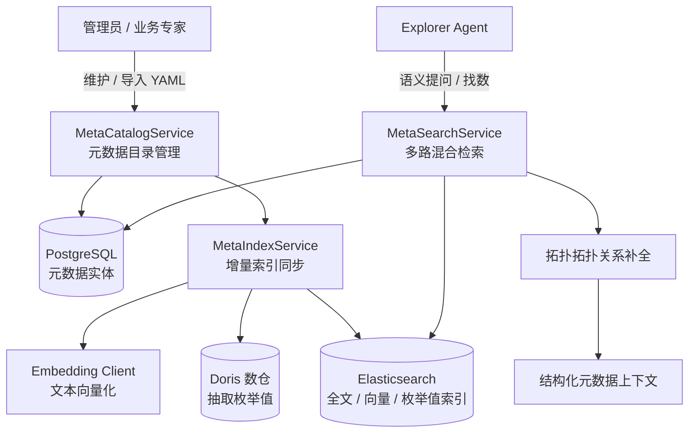

# 模块二：元数据资产与语义检索

## 1. 模块定位与职责

元数据资产与语义检索模块是 DataAgent 理解数仓结构与用户自然语言意图的核心知识中枢。该模块负责表、字段、指标元数据的纳管、YAML 格式导入导出、Elasticsearch 倒排与稠密向量索引同步，以及面向 Agent 取数的多阶段语义检索与拓扑补全。

---

## 2. 核心架构与功能特性

### 2.1 元数据目录管理模型
- **表元数据（[`TableInfo`](file:///home/kodey/dataagent/app/models/meta.py#L22-L35)）**：
  - 支持区分表角色（`fact` 事实表 / `dimension` 维度表）。
  - 维护主键列（`primary_key_columns`）与业务描述。
  - 包含 `meta_version` 变更版本号。
- **字段元数据（[`ColumnInfo`](file:///home/kodey/dataagent/app/models/meta.py#L38-L67)）**：
  - 记录数据类型、业务别名列表（`alias`）、示例值（`examples`）。
  - 支持外键与关联引用（`reference_t_name`、`reference_c_name`）。
  - `index_values` 标记：控制是否对该字段枚举值进行向量/文本建索引。
  - `meta_version` 与 `index_version`：比对元数据与索引版本，支持增量精准同步。
- **指标元数据（[`MetricInfo`](file:///home/kodey/dataagent/app/models/meta.py#L70-L86)）**：
  - 记录业务指标口径、别名及计算所需的关联字段集合（[`ColumnReference`](file:///home/kodey/dataagent/app/models/meta.py#L12-L19)）。

### 2.2 YAML 元数据导入导出与冲突校验
- [`MetaImportService`](file:///home/kodey/dataagent/app/services/meta_import_service.py#L20) 支持通过标准 YAML 配置文件批量定义数仓元数据。
- **校验与冲突阻断**：
  - 校验目标表与字段在实际 Doris 物理库中是否存在。
  - 校验主键列有效性及外键引用的字段是否存在。
  - 防止删除仍被指标或外键引用的字段元数据。
- **全量/增量导入**：支持增量覆盖与全量同步模式。
- **配置导出**：[`MetaCatalogService.export_metadata`](file:///home/kodey/dataagent/app/services/meta_catalog_service.py#L282-L325) 可随时将当前全部元数据导出为可复用的标准 YAML 格式。

### 2.3 多索引版本同步与向量化体系
- [`MetaIndexService`](file:///home/kodey/dataagent/app/services/meta_index_service.py#L21) 负责将元数据增量推送到 Elasticsearch：
  - **字段索引（[`ColumnESRepo`](file:///home/kodey/dataagent/app/repositories/column_es_repo.py#L22)）**：同步字段名、别名、描述文本，并结合 Embedding 模型生成 1024 维稠密向量。
  - **指标索引（[`MetricESRepo`](file:///home/kodey/dataagent/app/repositories/metric_es_repo.py#L19)）**：同步指标名、口径、别名与指标语义向量。
  - **枚举值索引（[`ValueESRepo`](file:///home/kodey/dataagent/app/repositories/value_es_repo.py#L18)）**：对于启用 `index_values` 的维度字段，自动从 Doris 读取去重样本值并建立文本索引，使 Agent 能识别“华东”、“退款成功”等具体维度字面量。
- **增量比对机制**：只有当 `meta_version > index_version` 或强制触发时才执行远程 ES 更新与 Embedding 计算，节约模型 Token 与网络开销。

### 2.4 多阶段混合语义检索与拓扑补全
- [`MetaSearchService`](file:///home/kodey/dataagent/app/services/meta_search_service.py#L361) 执行三阶段语义召回：
  1. **构建检索上下文**：加载元数据并依据用户权限策略（[`MetadataAuthorizationFilter`](file:///home/kodey/dataagent/app/services/metadata_authorization_filter.py#L18)）剔除无权访问的资产。
  2. **多路召回与融合打分**：
     - 全文检索：基于 BM25 的多字段匹配（权重：名称 > 别名 > 描述）。
     - 向量检索：基于 Cosine / DotProduct 的 KNN 稠密向量语义相似度召回。
     - 字段值检索：对用户输入中的实体词执行倒排枚举值命中。
  3. **拓扑闭包与依赖补全**：
     - 当召回某些字段时，自动补全所属表的主键与必要外键。
     - 当召回指标时，自动补全该指标依赖的全部维度字段与关联表，保证 Explorer Agent 编写 SQL 时拥有完整的 Join 关系链。
- **语义召回沉淀**：[`SemanticRecallService`](file:///home/kodey/dataagent/app/services/semantic_recall_service.py#L18) 记录每次 Agent 检索的命中记录与有效反馈，沉淀召回样本。

---

## 3. 核心接口与协议

### 元数据管理接口 (`/api/v1/meta`)
| 接口 | 方法 | 描述 |
| :--- | :--- | :--- |
| `/tables` | `GET` / `PUT` | 查询全部可见表元数据 / 创建或更新表元数据 |
| `/tables/{name}` | `GET` / `DELETE` | 查询指定表详情 / 删除表元数据 |
| `/tables/{name}/columns` | `GET` / `PUT` | 查询表下字段列表 / 批量更新字段元数据 |
| `/tables/{name}/columns/{column}` | `PUT` / `DELETE` | 更新单个字段元数据 / 删除字段元数据 |
| `/metrics` | `GET` / `PUT` | 查询全部指标列表 / 创建或更新指标元数据 |
| `/metrics/{name}` | `GET` / `DELETE` | 查询指定指标详情 / 删除指标元数据 |
| `/import` | `POST` | 上传 YAML 文件执行元数据导入（支持 dry_run 与增量模式） |
| `/export` | `GET` | 导出系统当前全部元数据为标准 YAML 配置文件 |
| `/sync-indices` | `POST` | 触发 Elasticsearch 增量索引同步与向量化 |

---

## 4. 关键代码映射

- 元数据目录服务：[`app/services/meta_catalog_service.py`](file:///home/kodey/dataagent/app/services/meta_catalog_service.py)
- 元数据导入导出服务：[`app/services/meta_import_service.py`](file:///home/kodey/dataagent/app/services/meta_import_service.py)
- 元数据索引同步服务：[`app/services/meta_index_service.py`](file:///home/kodey/dataagent/app/services/meta_index_service.py)
- 语义检索与多路召回：[`app/services/meta_search_service.py`](file:///home/kodey/dataagent/app/services/meta_search_service.py)
- 语义召回记录服务：[`app/services/semantic_recall_service.py`](file:///home/kodey/dataagent/app/services/semantic_recall_service.py)
- PostgreSQL 元数据仓储：[`app/repositories/meta_pg_repo.py`](file:///home/kodey/dataagent/app/repositories/meta_pg_repo.py)
- ES 字段 / 指标 / 枚举值仓储：[`app/repositories/column_es_repo.py`](file:///home/kodey/dataagent/app/repositories/column_es_repo.py)、[`app/repositories/metric_es_repo.py`](file:///home/kodey/dataagent/app/repositories/metric_es_repo.py)、[`app/repositories/value_es_repo.py`](file:///home/kodey/dataagent/app/repositories/value_es_repo.py)
