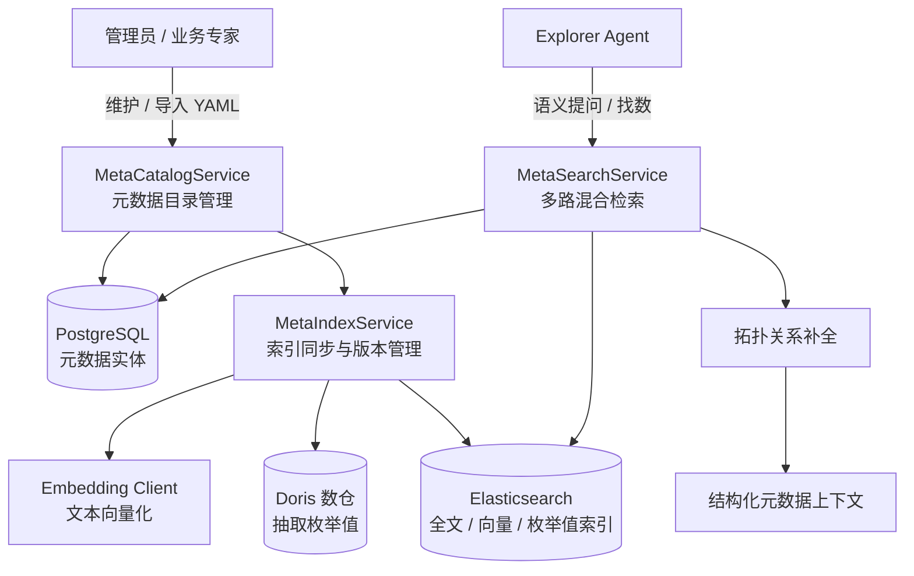

# 模块二：元数据资产与语义检索

## 1. 模块定位与职责

元数据资产与语义检索模块是 DataAgent 理解数仓结构与用户自然语言意图的核心知识中枢。该模块负责表、字段、指标元数据的纳管、YAML 格式导入导出、Elasticsearch 倒排与稠密向量索引同步，以及面向 Agent 取数的多阶段语义检索与拓扑补全。

---

## 2. 核心架构与功能特性

### 2.1 元数据目录管理模型
- **表元数据（[`TableInfo`](../app/metadata/models.py)）**：
  - 支持区分表角色（`fact` 事实表 / `dimension` 维度表）。
  - 维护主键列（`primary_key_columns`）与业务描述。
  - 维护字段取值索引的表级游标配置，回看窗口由应用级配置统一管理。
  - 包含 `meta_version` 变更版本号。
- **字段元数据（[`ColumnInfo`](../app/metadata/models.py)）**：
  - 记录数据类型、业务别名列表（`alias`）、示例值（`examples`）。
  - 支持外键与关联引用（`reference_t_name`、`reference_c_name`）。
  - `index_values` 标记：控制是否对该字段枚举值建立全文索引。
  - `meta_version` 与 `index_version`：记录元数据版本与语义索引版本，用于判断同步状态。
- **指标元数据（[`MetricInfo`](../app/metadata/models.py)）**：
  - 记录业务指标口径、别名及计算所需的关联字段集合（[`ColumnReference`](../app/metadata/models.py)）。

### 2.2 YAML 元数据导入导出与冲突校验
- [`MetaImportService`](../app/metadata/services/import_service.py) 支持通过标准 YAML 配置文件批量定义数仓元数据。
- **校验与冲突阻断**：
  - 校验目标表与字段在实际 Doris 物理库中是否存在。
  - 校验主键列有效性及外键引用的字段是否存在。
  - 防止删除仍被指标或外键引用的字段元数据。
- **全量/增量导入**：支持增量覆盖与全量同步模式。
- **配置导出**：[`MetaCatalogService.export_metadata`](../app/metadata/services/catalog.py) 可随时将当前全部元数据导出为可复用的标准 YAML 格式。

### 2.3 多索引版本同步与向量化体系
- [`MetaIndexService`](../app/metadata/services/index.py) 负责将元数据同步到 Elasticsearch：
  - **字段索引（[`ColumnESRepo`](../app/metadata/repositories/column_index.py)）**：同步字段名、别名、描述文本，并结合 Embedding 模型生成 1024 维稠密向量。
  - **指标索引（[`MetricESRepo`](../app/metadata/repositories/metric_index.py)）**：同步指标名、口径、别名与指标语义向量。
  - **枚举值索引（[`ValueESRepo`](../app/metadata/repositories/value_index.py)）**：对于启用 `index_values` 的维度字段，自动从 Doris 读取去重样本值并建立文本索引，使 Agent 能识别“华东”、“退款成功”等具体维度字面量。
- **语义差量同步**：管理员修改字段、指标或通过 YAML 导入元数据后自动提交同步任务，不进行 Beat 定期扫描。`meta_version` 与 `index_version` 用于展示同步状态，字段和指标按稳定文档编号计算差异，只为新增文本或 Embedding 版本变化生成向量，载荷变化复用已有向量。
- **取值水位同步**：开启 `index_values` 的字段通过 `value_index_sync_state` 持久化水位和代次。具备可靠游标和成功水位的字段每天在配置时间执行一次重叠窗口增量读取；首次构建和全量校准只接受管理员手动触发。
- **实现细节**：参见[语义索引增量同步设计](06_SEMANTIC_INDEX_INCREMENTAL_SYNC_DESIGN.md)和[取值索引增量同步设计](07_VALUE_INDEX_INCREMENTAL_SYNC_DESIGN.md)。

### 2.4 多阶段混合语义检索与拓扑补全
- [`MetaSearchService`](../app/metadata/services/search.py) 执行三阶段语义召回：
  1. **构建检索上下文**：加载元数据并依据用户权限策略（[`MetadataAuthorizationFilter`](../app/metadata/services/authorization_filter.py)）剔除无权访问的资产。
  2. **多路召回与融合打分**：
     - 全文检索：基于 BM25 的多字段匹配（权重：名称 > 别名 > 描述）。
     - 向量检索：基于 Cosine / DotProduct 的 KNN 稠密向量语义相似度召回。
     - 字段值检索：对用户输入中的实体词执行倒排枚举值命中。
  3. **拓扑闭包与依赖补全**：
     - 当召回某些字段时，自动补全所属表的主键与必要外键。
     - 当召回指标时，自动补全该指标依赖的全部维度字段与关联表，保证 Explorer Agent 编写 SQL 时拥有完整的 Join 关系链。
### 2.5 历史查询经验沉淀与检索 (Query Experience)
- **SQL 指纹与结构模板提取**：
  - 基于 `sqlglot` 对执行成功的 SQL 进行字面量脱敏与结构归一化，提取稳定的 SQL 模板与 64 位 SHA-256 结构指纹。
  - 按 `(owner_user_id, role_name, fingerprint)` 聚合为私有查询经验（[`QueryExperience`](../app/query/models.py)）。
- **元数据版本联动与自动失效**：
  - 经验关联引用的表与字段记录了创建时的 `meta_version`（[`QueryExperienceAsset`](../app/query/models.py)）。
  - 当管理员修改或删除底层表/字段元数据时，[`QueryExperienceService.invalidate_assets`](../app/query/services/experience.py) 自动将受影响的历史经验置为 `disabled` 并下线其 ES 检索索引。
- **双路索引与 Explorer 召回**：
  - 同步至 Elasticsearch 索引（`data-agent-query-experience`，[`QueryExperienceESRepo`](../app/query/repositories/experience_index.py)）。
  - Explorer Agent 通过 [`search_query_experiences`](../app/analytics/agents/explorer/tools/query_experience.py) 工具按自然语言意图和当前权限召回高分历史模板，加速 SQL 编写并提升准确率。
- **执行流水审计与采纳提升**：
  - 记录每次执行流水（[`QueryExecution`](../app/query/models.py)）。
  - 当最终产物被分析采纳时，自动将经验晋升为 `promoted` 优质候选。

---

## 3. 核心接口与协议

### 元数据管理接口 (`/api/v1/meta`)
| 接口 | 方法 | 描述 |
| :--- | :--- | :--- |
| `/tables` | `GET` / `PUT` | 查询全部可见表元数据 / 创建或更新表元数据 |
| `/tables/{name}` | `GET` / `DELETE` | 查询指定表详情 / 删除表元数据 |
| `/tables/{name}/columns` | `GET` / `PUT` | 查询表下字段列表 / 批量更新字段元数据 |
| `/tables/{name}/columns/{column}` | `PUT` / `DELETE` | 更新单个字段元数据 / 删除字段元数据 |
| `/metrics` | `GET` / `PUT` | 查询全部指标列表 / 创建或更新指标元数据 |
| `/metrics/{name}` | `GET` / `DELETE` | 查询指定指标详情 / 删除指标元数据 |
| `/import` | `POST` | 上传 YAML 文件执行元数据导入（支持 dry_run 与增量模式） |
| `/export` | `GET` | 导出系统当前全部元数据为标准 YAML 配置文件 |
| `/sync-indices` | `POST` | 触发 Elasticsearch 增量索引同步与向量化 |

---

## 4. 关键代码映射

- 元数据目录服务：[`app/metadata/services/catalog.py`](../app/metadata/services/catalog.py)
- 元数据导入导出服务：[`app/metadata/services/import_service.py`](../app/metadata/services/import_service.py)
- 元数据索引同步服务：[`app/metadata/services/index.py`](../app/metadata/services/index.py)
- 语义检索与多路召回：[`app/metadata/services/search.py`](../app/metadata/services/search.py)
- 历史查询经验服务：[`app/query/services/experience.py`](../app/query/services/experience.py)
- 语义召回记录服务：[`app/metadata/services/recall.py`](../app/metadata/services/recall.py)
- PostgreSQL 元数据仓储：[`app/metadata/repositories/postgres.py`](../app/metadata/repositories/postgres.py)、[`app/query/repositories/experience_postgres.py`](../app/query/repositories/experience_postgres.py)
- ES 字段 / 指标 / 枚举值 / 经验仓储：[`app/metadata/repositories/column_index.py`](../app/metadata/repositories/column_index.py)、[`app/metadata/repositories/metric_index.py`](../app/metadata/repositories/metric_index.py)、[`app/metadata/repositories/value_index.py`](../app/metadata/repositories/value_index.py)、[`app/query/repositories/experience_index.py`](../app/query/repositories/experience_index.py)
- 语义索引增量同步设计：[`docs/06_SEMANTIC_INDEX_INCREMENTAL_SYNC_DESIGN.md`](06_SEMANTIC_INDEX_INCREMENTAL_SYNC_DESIGN.md)
- 取值索引增量同步设计：[`docs/07_VALUE_INDEX_INCREMENTAL_SYNC_DESIGN.md`](07_VALUE_INDEX_INCREMENTAL_SYNC_DESIGN.md)
