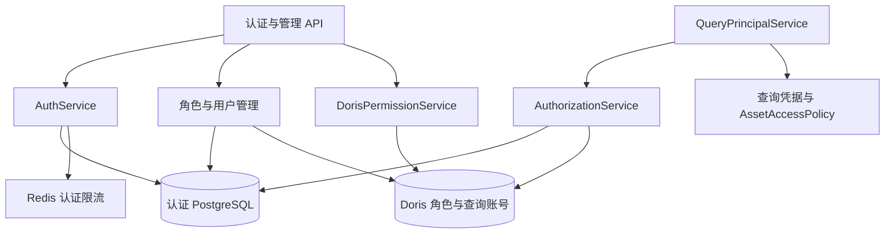

# 02. Identity：身份认证与数据授权

Identity 管理平台用户、登录令牌、管理员权限、Doris 角色查询身份和实时资产策略。模块以 PostgreSQL 保存平台身份与凭据，以 Doris 的实际授权和行策略作为数据访问事实。

## 1. 模块结构与职责

| 组件 | 职责 |
| --- | --- |
| 认证服务与密码管理 | 登录、JWT、Refresh Token、改密及密码哈希 |
| 认证依赖 | 加载当前用户快照，校验管理员或分析资格 |
| 角色与用户管理 | 账号修改、角色创建删除、默认角色和用户绑定 |
| 权限服务 | 修改 SELECT、Row Policy，并复查实际生效范围 |
| 授权服务 | 锁定角色身份、观察 Doris 授权、更新权限指纹 |
| 查询身份服务 | 从同一次授权观察生成查询凭据与资产策略 |
| 注销状态存储 | 禁用账号、任务租约、失败状态与完成事务 |

## 2. 身份模型与数据归属

| 身份 | 作用 | 保存在哪里 |
| --- | --- | --- |
| 平台用户 `User` | 登录、管理员资格、会话归属 | PostgreSQL `auth` |
| Doris 角色 | 一组数据权限，可被多个平台用户共享 | Doris，应用保存对应配置 |
| Doris 查询用户 | 真正建立数据库连接、执行 SQL | Doris，密码密文保存在 `auth` |
| Doris 管理账号 | 管理角色、授权、读取源结构等平台操作 | 服务端配置 |

每个平台用户最多绑定一个 Doris 角色，角色映射到稳定的查询账号及 Workload Group。不存在“登录用户直接把自己的数据库密码交给模型”这一流程。模型也不能通过 SQL 工具参数切换平台用户或指定管理员连接。

| 持久化对象 | 关键状态 |
| --- | --- |
| User | 规范化用户名和邮箱、密码哈希、启用/管理员标记、auth_version、角色绑定 |
| RefreshToken | Token 摘要、family_id、有效期、撤销时间和后继 Token |
| DorisQueryIdentity | 角色、唯一查询用户、加密密码、工作组、默认标记和权限指纹 |
| UserDeletionTask | 用户 ID、pending/completed、尝试次数、下次领取时间和最后错误 |

Doris 授权快照和 `AssetAccessPolicy` 是单次操作使用的值对象；PostgreSQL 不保存一份用于替代 Doris 实时权限的授权清单。

## 3. 账号规范化、密码与管理员保护

用户名和邮箱在写入及登录时去除首尾空白并统一大小写，数据库唯一约束处理并发冲突。密码使用 Argon2id 哈希保存，不保存明文。哈希计算在线程中执行，并限制进程内并发，避免阻塞异步请求循环或被并发请求耗尽资源。

账号不存在时也会执行一次虚拟哈希校验，缩小“用户不存在”和“密码错误”的耗时差异。密码长度受配置及上限约束，当前最低 6 字符、最高 128 字符。

安全变更使用数据库锁保护最后一个活跃管理员。管理员不能注销自己，也不能通过并发降权或禁用操作绕过“至少保留一个活跃管理员”的约束。

初始管理员由 `scripts/bootstrap_admin.py` 创建，应用启动不会自动创建管理员。脚本可重复执行，但不是任意覆盖账号的工具：已有用户名、邮箱和密码必须匹配相应规则；冲突会失败。密码从环境变量读取，用户名和邮箱可由命令行覆盖。初始管理员没有自动获得业务查询角色，部署后仍需分配。

## 4. Access Token 与请求认证

Access Token 是短期 JWT，当前默认有效 15 分钟。它包含用户 ID、`auth_version`、令牌类型、签发和过期时间、签发者。解码检查字段、算法、issuer 和时效，允许有限时钟偏差。

每次认证不仅验证签名，还读取用户当前状态：账号必须存在且启用，Token 中的 `auth_version` 必须匹配数据库。这样，修改密码、管理员更新用户或禁用账号后，旧令牌不能继续只凭“尚未过期”获得访问权。

请求依赖返回普通的用户快照，而不是把认证 ORM 会话一直留给后面的长任务。后续需要当前数据权限时再加载策略。注意：请求开始时通过认证，不意味着系统已经实现对运行中所有模型任务的跨进程即时撤销。

## 5. Refresh Token 轮换与撤销

Refresh Token 默认有效 30 天。客户端持有原始令牌，数据库保存可验证的摘要和令牌家族关系。每次成功刷新都会消费旧令牌并签发新的一对令牌。

如果已经使用过的旧 Refresh Token 再次出现，系统把它视为重放，撤销对应令牌家族，避免泄露令牌被反复使用。登出也会撤销相应家族；改密或管理员修改用户会执行更广范围的令牌失效处理。

轮换涉及行锁和事务，不能仅靠内存布尔值判断“是否用过”。调用方也应避免并发刷新同一个令牌；前端认证客户端负责协调刷新及请求重试。

## 6. 认证限流

认证限流使用共享 Redis，正常部署不会在 Redis 故障时静默降级为各进程自己的计数。

| 检查 | 当前窗口与上限 |
| --- | --- |
| 登录来源 IP | 60 秒内 30 次 |
| 规范化的登录标识 | 60 秒内 10 次 |
| 刷新来源 IP | 60 秒内 60 次 |

超过限制返回 429，并提供 `Retry-After`。限流键使用摘要，活跃键数量也有上限：IP 类各 10,000 个，登录标识 50,000 个，防止无限制造键消耗内存。

客户端 IP 来自连接信息，不直接信任任意请求填写的转发头。经过代理部署时，应核对服务器实际收到的连接地址和可信代理设置，而不是假设所有用户都已被正确区分。

## 7. Doris 角色与查询凭据

管理员配置角色标识、查询用户、业务说明和 Workload Group。系统检查工作组，生成查询密码，创建 Doris 角色与用户，再把加密后的身份保存到 PostgreSQL。

查询密码使用 Fernet 加密，密钥来自 `DORIS_CREDENTIAL_ENCRYPTION_KEY`。密码密文与密钥不是一回事；换掉密钥会使现有密文无法解密，不能把它当成可随意重置的普通配置。解密后的密码只用于服务端建连，不作为模型输入或管理接口响应返回。

默认角色只影响以后没有显式指定角色的新账号，不会自动改写已有用户。数据库保证最多一个默认角色。没有角色的用户可以登录，但不能因此进入需要数据分析授权的入口。

角色创建仍涉及 Doris 身份与 PostgreSQL 凭据的协调；创建失败时尝试清理已经创建的资源。删除先移除 Doris 查询账号和角色，再删除平台配置。中途失败保留平台配置供重试，不重新授予已撤销的权限。

SELECT 授权和行策略直接在 Doris 修改。权限修改成功但后续状态读取失败时，接口会报错，Doris 已完成的变更仍然有效；重新读取权限即可确认实际结果。

删除角色前会检查是否还有平台用户引用它；成功删除后会失效该角色的查询连接池。

## 8. 资产层级与有效 SELECT 权限

应用把资产分成数据源、数据库、表、列四级。上一级授权覆盖下一级，但“父节点可见”并不等于“整个父节点都可读取”。

例如，只授予 `orders.amount`：

- 用户可以知道 `orders` 这张表存在，因为它包含一个可见字段。
- 查询允许的字段可以通过 Guard。
- 不能因为表可见就允许 `SELECT * FROM orders`，也不能偷偷在 WHERE、JOIN 或排序中使用未授权字段。

`allows()` 用于判断读取许可，`is_visible()` 用于目录呈现。Metadata 用策略生成搜索过滤条件，Query 用策略检查实际 SQL 引用。

Doris 保存实际授权，PostgreSQL 保存平台账号、查询凭据、权限指纹。每次独立的查询或召回操作，从 Doris 读取当前有效权限，再构造 `AssetAccessPolicy`；同一次操作复用该快照，不使用跨请求权限缓存。权限读取失败时操作失败，不沿用旧授权。

当前实现通过专属查询账号的 `SHOW GRANTS` 取得库、表、列等有效权限，并校验账号只绑定平台配置的业务角色。直接授给该账号的权限也属于有效权限，外部增加其他业务角色则会被拒绝使用。后台管理连接负责读取这些信息，业务 SQL 仍由查询账号执行。

管理页面展示查询账号在配置业务数据库中的有效 SELECT 权限，授权和撤权按钮修改的是角色。若账号仍因直接授权或更高层级授权拥有目标权限，撤权接口会明确提示。全局或 Catalog SELECT 不能通过“清空当前数据库授权”消除，需要先在 Doris 处理上级授权。系统不把其他数据库的权限映射到当前业务数据库；无法明确解析的权限格式会被拒绝。

## 9. 行级策略与权限指纹

列权限决定可以访问哪些列，Row Policy 决定查询能看到哪些行。行策略由 Doris 实际执行。应用解析输入，确认是一条表达式所在语句，再交给 Doris 校验字段和表达式是否合法；它没有宣称自己实现了与 Doris 完全相同的表达式验证器。

`authorization_fingerprint` 是实际权限内容的 SHA-256 摘要。系统将授权、身份绑定和行策略的作用范围、组合方式、过滤条件规范化后计算指纹，不包含行策略名称或内部 ID。相同内容与不同返回顺序会得到相同指纹。

召回快照在读取时按当前资产权限过滤。这不替代 Doris 行过滤，也不意味着已在运行的查询会被强制终止。元数据取值索引和示例由平台管理连接构建，不能把字段可见性过滤描述成对每个示例值重新执行了用户的行级策略。

## 10. 查询身份解析与短事务

`QueryPrincipalService.resolve()` 读取用户当前状态和角色，在身份行锁内读取 Doris 实际权限并更新指纹，然后解密查询密码，返回同一份身份派生的执行凭据和资产策略。

授权读取与指纹写入使用一个短事务。同角色的观察串行执行，避免较早读取的快照覆盖较新的指纹；事务在 SQL 执行、ES 检索或模型调用前结束。权限读取与实际执行之间仍可能发生外部变更，Doris 最终按执行时的权限处理 SQL。

## 11. 注销状态管理

注销受理在一个认证事务中禁用账号、撤销 Refresh Token 并创建 pending 任务。重复请求不会把已有任务的租约或错误清空。

Workflow 在事务成功后立即投递后台任务。真正的会话、Checkpoint、召回记录和沙箱删除由各模块负责；全部成功后，Identity 才在一个事务中删除用户并把任务改为 completed。晚到的失败不能把 completed 改回 pending。

这与普通“登出”完全不同：登出处理令牌，注销要清理资源。

## 12. 管理接口与异常定位

登录、刷新、登出、改密、当前用户接口位于 `/api/v1/auth`；用户和 Doris 角色管理位于 `/api/v1/admin`。

“页面能登录但 SQL 失败”时，按顺序检查：平台账号是否启用、是否绑定受管理角色、查询身份能否解密、Workload Group 是否存在、Doris 实际权限是否可读取、查询账号是否只绑定配置的业务角色。后台管理账号还需要相应的 Doris 管理权限，否则管理角色列表本身也可能失败。

## 13. 安全约束与一致性边界

- 平台管理员资格、分析资格和资产访问范围分别检查；登录成功不授予业务数据权限。
- 同一查询用户必须只绑定配置的业务角色，解析到 ADMIN_PRIV 或 NODE_PRIV 时拒绝作为业务查询身份使用。
- 授权观察失败时拒绝当前操作，不使用旧策略继续查询。
- 角色创建支持失败补偿，角色删除保留可重试配置；SELECT 和行策略修改后读取失败不意味着 Doris 变更已回滚。
- 平台记录的权限指纹反映最近一次观察，真正执行 SQL 时 Doris 仍按当时权限检查。
- 元数据示例和取值索引由管理连接建立；字段可见性过滤不等于按用户行策略重新读取这些值。
- 禁用账号影响后续认证；已经在其他 API 进程运行的任务没有因此获得跨进程即时取消能力。
