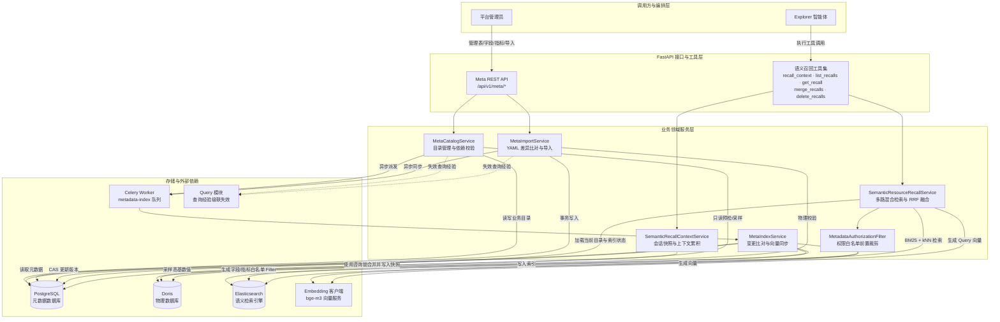
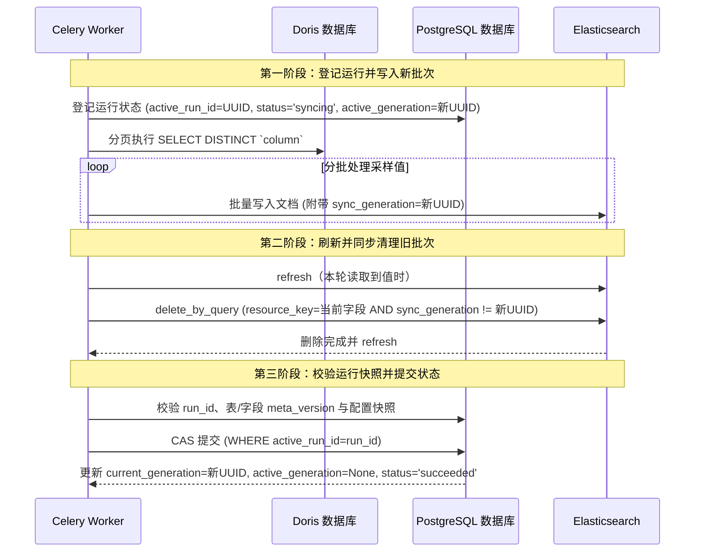

# 03. Metadata：实现目录与语义召回

## 功能说明

Metadata 把 Doris 中的表和字段整理成带有业务说明的目录，让大模型知道数据的含义和用法。它维护表、字段、指标、字段关系和示例值，把可搜索内容写入 Elasticsearch，并在用户权限范围内返回检索结果。

---

## 1. 模块总体架构与分层设计

### 1.1 架构定位与核心职责

数据库中的物理表名和字段名通常不足以说明业务含义，大模型也不能绕过权限直接扫描系统表。`metadata` 主要负责：

1. **补充业务信息**：为 Doris 表、视图和字段添加类型（`fact`/`dim`）、说明、别名、示例值和关联关系。
2. **分别使用三种存储**：
   - **PostgreSQL**：保存表、字段、指标、字段关系、同步状态和会话检索快照，是元数据的主数据库。
   - **Doris**：通过只读连接核验源表、视图与物理列是否存在，采集字段枚举值样例。
   - **Elasticsearch**：保存字段、指标和字段值的全文索引与向量索引，用于搜索。
3. **先按权限过滤再搜索**：根据当前用户的 `AssetAccessPolicy` 生成允许搜索的字段和指标列表，Elasticsearch 不会返回无权访问的内容。
4. **保存会话中的搜索结果**：Explorer 可以分多次搜索并合并结果，结果会保存成快照，供后续查询和分析继续使用。

### 1.2 系统数据流与架构关系



### 1.3 主要组件职责

| 组件 | 职责描述 |
| :--- | :--- |
| `TableInfo`、`ColumnInfo`、`MetricInfo`、`ColumnMetric`、`ValueIndexSyncState` | 声明元数据目录、外键关系、指标依赖与字段值同步状态 |
| `MetaPGRepo` | 读写元数据，处理数据库锁、版本条件更新和字段值任务领取 |
| `SourceDorisRepo` | 检查 Doris 表和字段，并安全读取少量示例值 |
| `ColumnESRepo`、`MetricESRepo`、`ValueESRepo` | 分别维护字段、指标和字段值 Elasticsearch 索引 |
| `MetaCatalogService` | 处理表、字段、指标的校验、依赖关系检查与版本维护 |
| `MetaImportService` | 预先检查 YAML，计算变更内容，再按 Replace 或 Merge 模式导入 |
| `MetaIndexService` | 同步语义索引和字段值，复用未变化的向量并更新版本号 |
| `MetadataAuthorizationFilter` | 根据用户权限生成搜索白名单，并过滤返回结果 |
| `SemanticResourceRecallService` | 合并全文搜索和向量搜索结果，检查当前目录，并处理部分搜索失败 |
| `SemanticRecallContextService` | 累积、合并和删除每次搜索结果，并保存会话快照 |
| `CeleryMetadataSemanticIndexScheduler` | 将字段和指标语义索引任务提交至 Celery |
| 管理 API | 暴露目录管理、YAML 导入、导出和手动同步端点 |

---

## 2. 检查 Doris 表结构并安全读取示例值

### 2.1 检查 Doris 中的表和字段

列出数据表、修改字段信息或导入 YAML 时，`SourceDorisRepo` 会直接检查 Doris 中的表和字段：

1. **检查源关系是否存在**：查询 `information_schema.tables`。列表接口返回当前数据库中的 `BASE TABLE` 和 `VIEW`；存在性检查按当前数据库和名称判断。
2. **获取物理列类型与逻辑主键**：从 `information_schema.columns` 读取 `column_type`，并将 `column_key = 'UNI'` 的字段按定义顺序作为 Doris UNIQUE KEY 表的逻辑主键。导入配置不声明字段类型，最终保存的 `ColumnInfo.type` 直接取 Doris 返回值。
3. **增量游标字段校验**：若表配置了 `value_index_cursor_column`，当前写入阶段只核验字段是否存在。游标值在同步运行时支持 `datetime`、`date`、`Decimal`、布尔、整数、浮点数和字符串的序列化；配置阶段没有游标类型白名单。

### 2.2 安全处理动态表名和字段名

检查元数据时，需要把表名和字段名放进 SQL。`SourceDorisRepo` 通过以下规则防止这些名称被用来注入 SQL：

- **标识符按数据库方言引用**：动态表名和字段名统一交给 SQLAlchemy 当前方言的 `identifier_preparer.quote_identifier()` 处理，同时拒绝空字符串和包含空字节的标识符：
  ```python
  def _quote_identifier(self, identifier: str) -> str:
      """使用当前数据库方言安全引用标识符。"""
      if not identifier or "\x00" in identifier:
          raise ValueError(f"数据库标识符无效: {identifier}")
      return self._connection.dialect.identifier_preparer.quote_identifier(identifier)
  ```
- **参数化查询**：值过滤和游标比较都使用查询参数，不把值直接拼进 SQL。

### 2.3 读取少量字段示例并统一格式

系统会读取少量字段值作为 `examples`，帮助大模型理解状态、渠道、地区等枚举值。读取和保存时遵循以下规则：

- **受限数量**：目录写入使用 `COLUMN_EXAMPLE_LIMIT = 10`。单字段写入执行 `SELECT DISTINCT ... LIMIT 10`；批量导入按表读取最多 10 行，再对每个字段去除该批结果内的重复值。
- **值序列化规范化（`serialize_column_examples`）**：
  - `datetime` / `date` 类型统一转为规范的 ISO 8601 字符串；
  - `Decimal` 高精度数值转换为标准浮点数（`float`）；
  - 其他值保持原样；当前不会裁剪字符串，也不会过滤不可打印字符或超长文本；
  - 最终结果按 `str(value)` 排序，保证输出顺序稳定。

---

## 3. 元数据目录和删除前检查

### 3.1 核心持久化模型结构

业务元数据目录中的持久化实体全部继承自 `MetaBase`：

1. **`TableInfo`（物理表业务模型）**：
   - `name: str`（主键）：Doris 表名或视图名；
   - `role: str`：表业务角色，取值为 `"fact"`（事实表）或 `"dim"`（维度表）；
   - `primary_key_columns: list[str]`：主键字段列表（JSON 存储）；
   - `description: str`：表的业务含义与分析用途描述；
   - `value_index_cursor_column: str | None`：字段值增量同步的游标列；
   - `meta_version: int`：业务元数据版本号，默认 1。
2. **`ColumnInfo`（物理字段业务模型）**：
   - 联合主键：`(t_name: str, name: str)`；
   - `type: str`：底层物理数据类型；
   - `description: str`：字段业务口径与计算逻辑描述；
   - `examples: list[Any]`：字段样例取值列表；
   - `alias: list[str]`：业务同义词与别名列表；
   - `index_values: bool`：是否为该字段启用字段值（Value Index）全文检索；
   - `reference_t_name / reference_c_name: str | None`：跨表外键引用目标；
   - `meta_version: int` 与 `index_version: int`。
3. **`MetricInfo`（业务指标模型）**：
   - `name: str`（主键）：指标全局唯一名称；
   - `description: str`：指标业务定义与统计口径；
   - `alias: list[str]`：指标别名与常用问法；
   - `relevant_columns: list[ColumnReference]`：计算该指标所依赖的物理字段列表；
   - `meta_version: int` 与 `index_version: int`。
4. **`ColumnMetric`（字段与指标关联多对多模型）**：
   - 联合主键 `(t_name, c_name, metric_name)`，配置 `ForeignKeyConstraint(ondelete="CASCADE")`，保障级联一致性。

### 3.2 用两个版本号判断索引是否需要更新

系统用两个版本号分别记录 PostgreSQL 中的最新内容和 Elasticsearch 已同步到哪个版本：

- **元数据版本 `meta_version`**：
  - 记录元数据的修改版本。
  - 模型通过 `metadata_snapshot()` 提取业务字段的值（如表角色、字段类型、描述、别名、示例值、指标依赖等）。
  - 只有当这些业务字段的值发生变化时，`meta_version` 才会递增。更新时间等管理字段变动不影响此版本。
- **索引同步版本 `index_version`**：
  - 记录已成功同步到 Elasticsearch 的元数据版本，初始为 0。
  - 语义索引差异处理成功后，才更新 `index_version` 为当前的 `meta_version`；存在 Elasticsearch 写操作时，会先完成 bulk 与 refresh。
  - 若 `index_version < meta_version`，表示 Elasticsearch 索引尚未同步最新修改。当前没有元数据语义索引定时修复任务，需要依赖变更时的自动投递、Celery 任务重试或管理 API 手动同步。

### 3.3 删除字段前检查谁还在使用它

字段可能被其他表引用，也可能被指标使用。`MetaCatalogService` 删除表或字段前会做以下检查，避免留下指向不存在字段的记录：

- **检查外键引用**：删除字段 `A.col` 时，扫描全库所有其他表的 `reference_t_name` 与 `reference_c_name`。若存在表 `B` 引用了 `A.col`，拒绝删除并抛出 `MetadataConflictError`，提示必须先清理或迁移引用关系。
- **检查指标依赖**：扫描所有指标的 `relevant_columns`。仍有指标使用该字段时拒绝删除，避免指标引用不存在的字段。

---

## 4. 批量导入 YAML 并预览变更

系统支持通过 YAML 配置批量管理元数据。REST API 负责读取上传内容并解析为 `MetaConfig`；Celery 任务把该模型的 JSON 数据交给 `MetaImportService`。导入服务只接收已解析的配置对象，不会自行读取本地配置。

### 4.1 强类型配置校验

导入校验分为结构校验和服务级语义校验：
- Pydantic `MetaConfig` 校验未知字段、名称与描述长度、表角色、列表长度，以及外键表名和字段名必须成对提供；
- `MetaImportService` 在构造元数据实体后检查同名表、同名指标和同表同名字段；
- 表描述与字段描述必须非空；
- `merge` 模式的字段引用可指向本次配置或既有目录中的字段；`replace` 模式只能指向本次配置最终保留的字段；
- 指标所声明的依赖字段必须真实有效。

上传入口会一次性执行 `file.read()`，再按 UTF-8 解码和 `yaml.safe_load()` 解析。当前没有为 YAML 文件单独设置字节数上限，大文件会在请求进程中完整占用内存；部署层需要通过反向代理或请求体限制控制上传大小。

### 4.2 先计算变更，再决定是否真正写入

批量导入会先检查配置并计算将要新增、修改和删除的内容。`dry_run=true` 时只返回这份结果；正式导入才会清理索引并写入 PostgreSQL：

```text
阶段一：预检与内存差异计算
  1. 获取当前 PostgreSQL 元数据快照（existing_tables / existing_columns / existing_metrics）
  2. 调用 Doris 只读预检配置中所有表与列，读取主键、物理类型和示例值
  3. 校验重复资源、字段引用和指标依赖
  4. 在内存中比对上传配置与数据库现有数据，计算变更清单 ResourceChanges：
     - tables: created / updated / deleted
     - columns: created / updated / deleted
     - metrics: created / updated / deleted
  5. 若 dry_run=True，直接返回 ResourceChanges 清单，不写 PostgreSQL、Elasticsearch，也不投递任务。

阶段二：清理、提交与后置派发
  1. replace 模式先删除 Elasticsearch 中本次将移除的指标、字段语义索引和字段值索引
  2. 开启 PostgreSQL 独立事务
  3. 执行删除和写入：指标 -> 字段 -> 表 -> 表写入 -> 字段写入及引用 -> 指标写入及关联
  4. 事务成功 Commit
  5. 在事务外失效相关 QueryExperience，并向 Celery 投递新增或更新字段、指标的语义索引任务
```

PostgreSQL 写入本身放在一个事务中。Replace 模式会先删除 Elasticsearch 文档，再开始数据库事务。如果数据库写入失败，两边可能暂时不一致，后续任务重试会继续完成同步。

### 4.3 Merge 保留未提及内容，Replace 以 YAML 为准

- **`merge`（增量合并模式）**：
  - 仅应用 YAML 中显式声明的表、字段与指标；
  - 数据库中已存在但 YAML 中未提及的资源完整保留；
  - 适合分业务域增量录入或日常配置更新。
- **`replace`（全量覆盖模式）**：
  - 完全以当前 YAML 内容为准；
  - 数据库中存在但 YAML 中未提及的所有表、字段与指标将被自动删除；
  - 写入前校验最终配置图；保留字段引用了将删除字段，或保留指标依赖了将删除字段时，导入会被阻断。

---

## 5. Elasticsearch 搜索索引和变更指纹

为了根据自然语言找到相关的表、字段和指标，系统同时建立全文索引和向量索引。

### 5.1 三类 Elasticsearch 索引

Elasticsearch 中维护三个核心业务索引：

1. **`data-agent-column`（字段语义索引）**：
   - `resource_key: keyword`：由 `json.dumps([t_name, c_name], separators=(",", ":"))` 生成无歧义联合键，例如 `["orders","amount"]`；
   - `name: keyword`、`t_name: keyword`：Mapping 中保留的字段；当前语义文档的顶层 source 不写入这两个字段，完整资源数据位于禁用解析的 `payload` 中；
   - `text: text`：标准中文分词字段，配置 `ik_max_word` 细粒度分词器，附带 `raw` keyword 子字段用于精确匹配；
   - `text_type: keyword`：文本类型，分为 `"name"`、`"alias"`、`"description"`；
   - `embedding: dense_vector`：维度由 `cfg.elasticsearch.embedding_size` 决定，当前配置为 1024；相似度算法为 `cosine`，使用 HNSW 索引；
   - `payload_hash: keyword` 与 `embedding_revision: keyword`：版本指纹；
   - `meta_version: long`；
   - `payload: object`：`enabled=false`，保存构建命中结果所需的当前字段快照。
2. **`data-agent-metric`（指标语义索引）**：
   - 结构与字段索引类似，`resource_key` 为指标名称；分词文本覆盖指标名、业务定义与业务别名，完整指标快照保存在 `payload`。
3. **`data-agent-value`（字段取值语义索引）**：
   - `resource_key: keyword`；
   - `t_name / c_name: keyword`；
   - `value: text`：取值分词字段（`ik_max_word`）；
   - `sync_generation: keyword`：全量同步的批次编号（UUID）。

### 5.2 把名称、描述和别名拆成可搜索文本

在向 Embedding 模型输入和向 Elasticsearch 写入文档前，`MetaIndexService` 将每个字段或指标拆分为多条独立的检索文本条目（`SemanticTextType`）：
- **名称条目（`name`）**：字段物理名或指标名；
- **描述条目（`description`）**：业务含义描述与口径；
- **别名条目（`alias`）**：业务别名与同义词。

每段文本统一经过 Unicode NFC 规范化（`unicodedata.normalize("NFC", text).strip()`）并去重。每个文本单元在 Elasticsearch 中对应独立文档并带有 `text_type`。全文检索的精确匹配分支按名称 8.0、别名 6.0、描述 4.0 加权，同时还执行 `match_phrase` 和普通 `match`。

### 5.3 判断哪些内容需要重新生成向量

调用远程 Embedding API 比较耗时。系统用内容哈希和 embedding revision 判断原来的向量还能不能继续使用：

1. **`payload_hash`**：对完整资源 payload 的稳定 JSON 表示计算 SHA-256，用于识别正文以外的资源快照变化；同一资源的各条文本文档共享该哈希；
2. **`embedding_revision`**：由客户端协议标识、模型名、向量维度与预处理版本组合而成：
   ```text
   embedding_revision = f"openai-compatible:{cfg.embedding.model}:{cfg.elasticsearch.embedding_size}:{_SEMANTIC_PREPROCESS_VERSION}"
   ```
3. **是否需要重新生成向量的比对规则**：
   - 新文档必须生成向量；
   - 已有文档仅在 `text` 或 `embedding_revision` 改变时重新生成向量；
   - 仅 payload、`meta_version`、`payload_hash` 或其他非正文属性变化时，通过 Elasticsearch partial update 更新文档并保留原向量；
   - 文本、revision 和资源快照都未变化时跳过写入。

### 5.4 防止多个同步任务互相覆盖

多个任务可能同时同步同一个字段，较早开始的任务也可能更晚完成。系统通过数据库锁和版本条件更新避免旧任务覆盖新结果：

1. **资源级事务排他锁（`acquire_index_lock`）**：
   在同步单项资源前，在 PostgreSQL 事务中执行：
   ```sql
   SELECT pg_advisory_xact_lock(hashtextextended(:lock_key, 0));
   -- lock_key = f"metadata-index:{resource_type}:{resource_key}"
   ```
   同一个字段或指标一次只允许一个任务同步，即使任务运行在不同服务实例中也是如此。
2. **CAS 乐观回写（`mark_*_indexed_if_current`）**：
   ES 索引完成后，更新 PostgreSQL 的 `index_version`：
   ```sql
   UPDATE column_info
   SET index_version = :target_version
   WHERE t_name = :t_name AND name = :c_name AND meta_version = :target_version
   RETURNING name;
   ```
   如果同步期间字段又被修改，`meta_version` 会再次增加。此时条件更新（CAS）返回 False，不会把旧版本误写成已同步，后续新任务会重新处理。

---

## 6. 全量或增量同步字段值

业务枚举和常用维度字段（如“订单状态”、“支付渠道”、“省份城市”）的取值理解直接决定了生成的 SQL 是否准确。

### 6.1 全量同步与批次清理

每次全量同步会生成一个新的 `sync_generation` 批次号。新一批数据写完后，系统先删除 Elasticsearch 中其他批次的旧值，最后用 PostgreSQL 条件更新提交 `current_generation`。两个存储之间没有跨库原子事务。文档 ID 只由表名、字段名和值决定，所以相同的值会更新原文档，不会重复新增。



- **搜索时可能短暂混合新旧值**：当前搜索只按权限和文本匹配，不检查 `current_generation`。全量同步尚未完成时，结果中可能同时出现上一批和本批字段值。
- **失败状态**：运行失败时 PostgreSQL 记录 `status='failed'` 并保留已提交的 `current_generation`；已写入 ES 的文档不会回滚。后续全量同步会用新 generation 再次覆盖并清理。
- **配置并发保护**：提交成功状态前重新读取表、字段和运行状态；`run_id`、元数据版本、游标配置或 `index_values` 发生变化时拒绝提交旧运行结果。

### 6.2 增量同步（Incremental Sync）

字段配置了 `value_index_cursor_column`，并且已经成功完成一次全量同步后，可以只同步游标范围内的新数据：
- **固定上界**：运行开始后读取游标列当前最大值作为上界，只处理 `lower_bound <= cursor <= upper_bound` 的行；
- **回看窗口（Lookback Window）**：`datetime` 游标按配置回退秒数，`date` 游标至少回退一天；其他类型重放原边界。当前默认 `value_lookback_seconds=300`；
- **稳定的文档 ID**：基于表名、列名与规范化后的字段取值，使用 UUIDv5 生成固定的 Elasticsearch 文档 ID：
  ```python
  doc_id = uuid.uuid5(uuid.NAMESPACE_URL, json.dumps(["value", t_name, c_name, val]))
  ```
  重复值使用同一个文档 ID 执行 Upsert，因此不会产生重复文档。

---

## 7. 先过滤权限，再合并全文和向量搜索结果

Explorer 智能体通过 `SemanticResourceRecallService` 检索元数据，按相关度打分并结合数据权限返回结果。

### 7.1 搜索条件中直接加入权限白名单

系统在发起 Elasticsearch 检索前直接添加权限过滤：

1. `MetadataAuthorizationFilter` 解析调用用户的 `AssetAccessPolicy`；
2. 提取用户具备 `SELECT` 权限的全部字段列表，计算其对应的 `resource_key` 集合；
3. 将该白名单作为强制过滤条件直接编译进 Elasticsearch 的底层查询体中：
   ```json
   {
     "bool": {
       "filter": [
         { "terms": { "resource_key": ["[\"orders\",\"amount\"]", "[\"orders\",\"status\"]", ...] } }
       ],
       "must": [ ... ]
     }
   }
   ```
4. 未授权的字段、指标和字段值在 Elasticsearch 查询条件中被过滤；后续构建表上下文时再次按可见性裁剪表和主键字段。

### 7.2 合并全文搜索和向量搜索排名

系统分别执行全文搜索和向量搜索，再把两份排名合并。多个搜索词和资源类型可以并发查询，但信号量会限制同时访问 Elasticsearch 的请求数：

1. **全文检索通道（BM25）**：
   - 匹配字段名、别名、业务描述；
   - 针对精确匹配设置不同的加权系数（`_EXACT_TEXT_BOOSTS`：名称 8.0、别名 6.0、描述 4.0）；
2. **向量检索通道（Dense Vector kNN）**：
   - 将用户检索词通过 `bge-m3` 转化为 1024 维密集向量；
   - 在 ES 中使用基于 HNSW 图索引的余弦相似度 kNN 检索，捕获跨语义近义表达；
3. **扩展候选倍率**：
   - 两路通道均以 3 倍目标上限（`_INDEX_SEARCH_LIMIT_MULTIPLIER = 3`）提取候选集，并封顶为 60。
4. **倒数排名融合（RRF）**：
   - RRF 主要看候选项在每份结果中的名次。名次越靠前，得到的分数越高，常数 $k=60$：
     $$\text{RRF Score} = \sum_m \frac{1}{60 + \text{rank}_m}$$
   - 同一资源还会累积不同检索词产生的排名贡献，最后将类型内最高分归一化为 1.0。
   - 每个候选项都会带上 `SemanticMatchReason`，说明它来自哪种搜索、命中了哪个词以及得到多少分。

### 7.3 向量服务失败时仍返回全文搜索结果

外部 Embedding 模型服务可能发生网络超时或限流。系统支持自动降级：
- 向量计算使用共享 Embedding HTTP 客户端的请求超时，当前配置为 30 秒；
- 若向量服务异常或超时，系统按受影响的资源类型记录 `SemanticRecallFailure`，保留已经完成的全文检索结果；
- 响应顶层 `status` 设置为 `partial`。单个字段或指标没有独立的 partial 状态，其 `index_status` 只表示 `current`、`stale` 或 `missing`；
- 全文或字段值索引的单次查询异常也会记录对应失败范围，其余成功通道仍可返回结果。

### 7.4 丢弃已删除内容，并补上关联字段

搜索前，服务从 PostgreSQL 读取当前的表、字段、指标和同步状态，并按用户权限生成一份内存目录。Elasticsearch 返回结果后，服务会再次确认资源仍然存在且用户仍有权限，最终返回 PostgreSQL 中的最新元数据：

1. **数据一致性与权限**：已删除或未授权的资源键会被丢弃。当前不会比较 ES 文档 `meta_version` 与数据库版本；同键旧文档仍可能参与本次排名，响应通过 `index_status` 和 warnings 暴露数据库记录的索引同步状态；
2. **实体关联自动补全**：
   - 直接字段、指标依赖字段和字段值所属字段进入上下文；
   - 对所有参与表补充一层已授权的外键字段及引用目标字段；
   - 对最终参与表补充已授权的主键字段；
   - 为大模型写出高质量的 `JOIN` 和 `WHERE` 条件提供完整的依赖上下文。

单次请求可以传 1 至 20 个检索词、1 至 3 种资源类型，每类最终排名结果上限为 1 至 20 条。全文和向量通道会按目标上限的 3 倍取候选，最多取 60 条。直接命中的字段和指标依赖字段合计最多进入 30 个有排名的字段上下文；字段值所属字段、主键和一层外键关系是补充上下文，不占这 30 个名额，因此最终字段总数可能超过 30。发生截断时响应会设置 `truncated=true` 并添加 warning。每个返回字段最多携带 3 个示例值。

---

## 8. Explorer 搜索工具和会话快照

`SemanticRecallContextService` 把当前会话搜到的元数据保存为快照，后续步骤可以读取同一份结果。

### 8.1 Explorer 的 5 个语义召回工具接口

Explorer 挂载了 5 个专用语义召回工具：

1. **`recall_context(query, resource_types, terms, limit_per_type)`**：
   - 核心召回入口。`query` 是当前用户提问的稳定业务键；
   - `resource_types` 支持 `"column"`、`"metric"`、`"value"` 组合多选；
   - 支持传入多个同义检索词 `terms` 协同召回。
2. **`list_recalls(limit)`**：
   - 列出当前会话历史中各个 query 的最新累计召回摘要。
3. **`get_recall(query)`**：
   - 精确读取指定 `query` 下累计召回的所有元数据与历史 SQL 经验。
4. **`merge_recalls(target_query, source_query)`**：
   - 将一个来源 query 的语义资源吸收到已有目标 query；合并成功后删除来源 query 的全部快照；
   - 查询经验只保留目标 query 的结果，来源 query 的查询经验不会并入目标。
5. **`delete_recalls(deletions)`**：
   - `deletions` 是 query 级资源树；未提供资源选择器时删除整个 query；
   - 可选择删除整张表、指定字段、指定字段值、指标或查询经验；同一 query 在一次调用中只能出现一次。

### 8.2 多次搜索结果如何累积和合并

一次分析中，智能体可能多次调用 `recall_context`，例如先找指标，再补找维度字段。系统按以下规则把新结果加入已有快照：
- 相同的 `query` 多次调用时，新检索结果与旧快照进行并集融合；
- 指标按主键聚合，优先保留 `meta_version` 更高、其次 `rank_score` 更高的结果；
- 字段按联合主键聚合，优先保留 `meta_version` 更高、其次已有 `rank_score` 更高的结果，不重新计算跨轮 RRF；
- 字段值保留最高排名并合并命中原因，表上下文保留最高元数据版本；
- terms、warnings 和失败范围稳定去重；本次成功刷新到相同失败范围时清除对应旧失败。

### 8.3 并发写入加锁，并把快照保存到 PostgreSQL

- **写入时一次只处理一个请求**：搜索本身在加锁前执行。进入 `record()` 后，服务用 `user_id`、`conversation_id` 和 `query` 组成锁键。同一个 query 的并发请求会依次合并和保存结果，但每个请求仍会执行自己的搜索。
- **快照持久化（`SemanticRecallRecord`）**：
  - 快照以 `(user_id, conversation_id, recall_id)` 为唯一键保存在 `semantic_recall_snapshots` 表中；
  - ORM 实体是 `SemanticRecallSnapshot`，`SemanticRecallRecord` 是 Pydantic 领域记录；
  - 快照记录请求参数、完整语义资源响应、各资源打分、查询经验、经验授权范围、来源 query 及时间戳；
  - 每次追加召回都会保存新快照。合并操作会删除来源 query 的全部快照，整 query 删除也会物理清理快照，因此持久化历史受显式清理操作影响。

### 8.4 查询经验最多缓存一天，并且每次读取都重新检查权限

同一 `query` 最近一次快照中的查询经验可以复用 1 天。读取时必须同时满足三个条件：快照角色等于当前角色、快照 `authorization_epoch` 等于当前授权代次、查询经验获取时间距离现在不足 1 天。任一条件不满足时，Explorer 会重新搜索查询经验。

即使缓存仍在有效期内，系统也会用当前 `AssetAccessPolicy` 再过滤一次快照。表、字段或查询经验已经超出当前权限时会从返回结果中移除；快照记录的角色或授权代次与当前值不一致时，查询经验列表会被清空。这层读取过滤也适用于 `get_recall`、`list_recalls` 和合并操作。

---

## 9. Celery 后台任务和定时同步

非 dry-run YAML 导入、手动索引同步和周期字段值维护通过 Celery 执行。管理 API 的 Doris 探查、表字段写入预检以及 dry-run 导入仍在请求内同步执行。

### 9.1 每类后台任务负责什么

所有任务统一投递至专用队列 `metadata-index`：

- **`dataagent.metadata.sync_column_indexes`**：接收字段键列表，执行增量文本提取、向量化与 ES 写入；
- **`dataagent.metadata.sync_metric_indexes`**：接收指标名称列表，执行指标增量同步；
- **`dataagent.metadata.sync_table_indexes`**：整表级联任务，扫描表下所有字段并发起增量索引同步；
- **`dataagent.metadata.sync_column_values` / `dataagent.metadata.sync_table_values`**：执行字段值 Generation 全量同步或游标增量同步；
- **`dataagent.metadata.import`**：后台执行已经解析为 JSON payload 的元数据导入；
- **`dataagent.metadata.dispatch_value_indexes`**：每日扫描到期字段并分批投递增量同步。

### 9.2 定时字段值增量同步（Celery Beat）

元数据模块当前在 Celery Beat 中只注册一项周期任务：

1. **每日字段值增量分发（`value-index-daily-dispatch`）**：
   - 按 `cfg.task_queue.value_index_sync_time` 运行，当前示例配置为 Asia/Shanghai 时区每天 `08:00`；
   - 领取已启用 `index_values`、配置游标，并且已经有 `current_generation` 和 `cursor_value` 的到期字段；
   - 每批最多 50 个字段，投递 `mode="incremental"` 的字段值同步任务；
   - 已关闭 `index_values` 且仍有同步状态的字段也会被领取一次，由同步状态机执行历史索引和状态清理；
   - 使用调度器级事务咨询锁和 `syncing` 状态防止多个 Beat 实例重复领取。

当前没有 `metadata-index-repair` 定时任务，也没有扫描 `index_version < meta_version` 后补投字段、指标语义索引的实现。字段和指标同步任务自身配置了最多 3 次 Celery 自动重试；超过重试次数后需要重新触发同步。

### 9.3 元数据变化后停用相关查询经验

表或字段变化后，旧的查询经验可能已经不适用。`MetaCatalogService` 或 `MetaImportService` 会调用 `MetadataAssetInvalidator`：
- Query 服务先在 PostgreSQL 中将引用变化资产的活跃 `QueryExperience` 更新为 `status='disabled'`、`disabled_reason='metadata_changed'` 并递增 revision；
- 随后逐条投递查询经验索引同步任务，Worker 根据 disabled 状态删除对应 Elasticsearch 文档并回写 `indexed_revision`；
- 查询经验 ES 删除任务成功后，后续召回不会再返回这些已失效 SQL 模板。

---

## 10. REST API 接口规范与路由定义

以下接口都要求当前用户通过 `AdminUserDep` 的管理员检查。

### 10.1 表元数据管理端点

- `GET /api/v1/meta/tables`：获取系统当前注册的全部表元数据列表；
- `GET /api/v1/meta/source-tables`：只读列出 Doris 当前数据库中的基础表和视图；
- `PUT /api/v1/meta/tables/{t_name}`：新增或更新表角色、业务描述和增量游标列，成功返回 204；
- `POST /api/v1/meta/tables/batch-delete`：按请求体中的 `tables` 批量删除表及其字段元数据和索引，成功返回 204。删除前执行字段引用与指标依赖检查。

当前没有单表详情 GET、集合 POST 或单表 DELETE 端点。

### 10.2 字段元数据管理端点

- `GET /api/v1/meta/tables/{t_name}/columns`：获取指定表下的全部字段定义；
- `PUT /api/v1/meta/tables/{t_name}/columns/{c_name}`：新增或更新字段别名、业务描述、取值索引开关及外键引用；返回 `semantic_index_task_id`，元数据未变化时为 `null`；
- `POST /api/v1/meta/columns/batch-delete`：按字段联合键批量删除字段元数据和索引，成功返回 204，并受反向引用保护。

当前没有单字段详情 GET、集合 POST 或单字段 DELETE 端点。字段值同步状态包含在字段列表的 `ColumnInfoResponse.value_index_state` 中。

### 10.3 业务指标管理端点

- `GET /api/v1/meta/metrics`：获取所有已注册的业务指标列表；
- `PUT /api/v1/meta/metrics/{metric_name}`：新增或更新指标口径描述、别名和关联字段；返回 `semantic_index_task_id`；
- `POST /api/v1/meta/metrics/batch-delete`：批量删除指标及其语义索引，成功返回 204，数据库中的 `column_metric` 关联随之清理。

当前没有单指标详情 GET、集合 POST 或单指标 DELETE 端点。

### 10.4 YAML 批量导入与同步运维端点

- `POST /api/v1/meta/import`：
  - 接收上传的 YAML 配置内容；
  - 查询参数：`mode`（`merge` 或 `replace`）、`dry_run`（布尔值）；
  - `dry_run=true` 同步执行预检并返回表、字段、指标的数量和资源键明细；
  - `dry_run=false` 将导入交给 Celery，立即返回 `task_id`；
- `GET /api/v1/meta/export`：以 YAML 附件导出全部元数据；
- `POST /api/v1/meta/tables/sync`：按表批量投递字段语义索引同步；
- `POST /api/v1/meta/columns/sync`：按字段联合键批量投递字段语义索引同步；
- `POST /api/v1/meta/metrics/sync`：按指标名批量投递指标语义索引同步；
- `POST /api/v1/meta/tables/sync-values`：同步指定表中已开启取值索引的字段，请求模式为 `full` 或 `incremental`；
- `POST /api/v1/meta/columns/sync-values`：同步指定字段的取值索引，请求模式为 `full` 或 `incremental`。

所有同步端点只负责提交 Celery 任务并返回 `task_id`。

---

## 11. 关键实现代码摘录

以下代码选取当前实现中的关键类、函数和完整方法，保留源码里的名称、签名、处理流程和异常处理。没有展示的辅助定义和启动接线由正文说明。摘录主要覆盖资源键、Doris 检查、索引同步、导入、搜索、后台任务和接口。

### 11.1 资源键、样例序列化与版本快照

```python
def column_resource_key(t_name: str, c_name: str) -> str:
    """生成无歧义的表字段联合资源键。"""
    return json.dumps(
        [t_name, c_name],
        ensure_ascii=False,
        separators=(",", ":"),
    )


def serialize_column_examples(examples: list[Any]) -> list[Any]:
    """将字段示例转换为可序列化值。"""
    serialized: list[Any] = []
    for value in examples:
        if isinstance(value, (datetime, date)):
            serialized.append(value.isoformat())
        elif isinstance(value, Decimal):
            serialized.append(float(value))
        else:
            serialized.append(value)
    return sorted(serialized, key=str)


class TableInfo(MetaBase):
    """表信息。"""

    __tablename__ = "table_info"

    name: Mapped[str] = mapped_column(String(256), primary_key=True, comment="表名称")
    role: Mapped[str] = mapped_column(
        String(256), nullable=False, comment="表类型(fact/dim)"
    )
    primary_key_columns: Mapped[list[str]] = mapped_column(
        JSON, nullable=False, comment="主键字段"
    )
    description: Mapped[str] = mapped_column(Text, nullable=False, comment="表描述")
    value_index_cursor_column: Mapped[str | None] = mapped_column(
        String(256),
        nullable=True,
        comment="字段取值索引增量游标字段",
    )
    meta_version: Mapped[int] = _version_column(1, "元数据版本")

    def metadata_snapshot(self) -> tuple[Any, ...]:
        """生成元数据内容快照。"""
        return (
            self.role,
            self.primary_key_columns,
            self.description,
            self.value_index_cursor_column,
        )


class ColumnInfo(MetaBase):
    """字段信息。"""

    __tablename__ = "column_info"
    # Repository 在查询后批量填充索引状态；保持非 ORM relationship，避免序列化
    # 阶段触发 AsyncSession 无法安全执行的隐式懒加载。
    __allow_unmapped__ = True

    __table_args__ = (
        ForeignKeyConstraint(
            ["reference_t_name", "reference_c_name"],
            ["column_info.t_name", "column_info.name"],
            ondelete="SET NULL",
        ),
    )

    t_name: Mapped[str] = mapped_column(
        String(256),
        ForeignKey("table_info.name", ondelete="CASCADE"),
        primary_key=True,
        comment="所属表名称",
    )
    name: Mapped[str] = mapped_column(String(256), primary_key=True, comment="字段名称")
    type: Mapped[str] = mapped_column(String(256), nullable=False, comment="数据类型")
    description: Mapped[str] = mapped_column(Text, nullable=False, comment="列描述")
    examples: Mapped[list[Any]] = mapped_column(
        JSON, nullable=False, comment="数据示例"
    )
    alias: Mapped[list[str]] = mapped_column(JSON, nullable=False, comment="列别名")
    index_values: Mapped[bool] = mapped_column(
        Boolean,
        nullable=False,
        default=False,
        server_default=text("false"),
        comment="是否索引字段值",
    )
    reference_t_name: Mapped[str | None] = mapped_column(
        String(256), comment="引用表名称"
    )
    reference_c_name: Mapped[str | None] = mapped_column(
        String(256), comment="引用字段名称"
    )
    meta_version: Mapped[int] = _version_column(1, "元数据版本")
    index_version: Mapped[int] = _version_column(0, "语义索引版本")
    value_index_state: "ValueIndexSyncState | None" = None

    def metadata_snapshot(self) -> tuple[Any, ...]:
        """生成元数据内容快照。"""
        return (
            self.type,
            self.description,
            self.examples,
            self.alias,
            self.index_values,
            self.reference_t_name,
            self.reference_c_name,
        )


class MetricInfo(MetaBase):
    """指标信息。"""

    __tablename__ = "metric_info"
    # 相关字段由 Repository 批量投影，原因同 ColumnInfo.value_index_state。
    __allow_unmapped__ = True

    name: Mapped[str] = mapped_column(String(256), primary_key=True, comment="指标名称")
    description: Mapped[str] = mapped_column(Text, nullable=False, comment="指标描述")
    alias: Mapped[list[str]] = mapped_column(JSON, nullable=False, comment="指标别名")
    meta_version: Mapped[int] = _version_column(1, "元数据版本")
    index_version: Mapped[int] = _version_column(0, "语义索引版本")
    relevant_columns: list[ColumnReference]

    def __init__(
        self,
        *,
        name: str,
        description: str,
        alias: list[str],
        relevant_columns: list[ColumnReference] | None = None,
        meta_version: int = 1,
        index_version: int = 0,
    ) -> None:
        """初始化指标元数据及其关联字段引用。"""
        self.name = name
        self.description = description
        self.alias = alias
        self.relevant_columns = relevant_columns or []
        self.meta_version = meta_version
        self.index_version = index_version

    def metadata_snapshot(self) -> tuple[Any, ...]:
        """生成元数据内容快照。"""
        return (
            self.description,
            tuple(
                sorted(
                    column_reference_key(reference)
                    for reference in self.relevant_columns
                )
            ),
            self.alias,
        )
```

### 11.2 检查 Doris 表结构并读取示例值

```python
class SourceDorisRepo:
    """Doris 业务数据存储。"""

    def __init__(self, connection: AsyncConnection) -> None:
        """初始化 Doris 业务数据存储。"""
        self._connection = connection

    def _quote_identifier(self, identifier: str) -> str:
        """使用当前数据库方言安全引用标识符。"""
        if not identifier or "\x00" in identifier:
            raise ValueError(f"数据库标识符无效: {identifier}")
        return self._connection.dialect.identifier_preparer.quote_identifier(identifier)

    @staticmethod
    def _validate_positive_limit(value: int, name: str) -> None:
        """校验只能作为 SQL 整数字面量写入的分页参数。"""
        if isinstance(value, bool) or not isinstance(value, int) or value <= 0:
            raise ValueError(f"{name} 必须为正整数")

    async def list_tables(self) -> list[str]:
        """查询当前 Doris 数据库中全部物理表名。"""
        result = await self._connection.execute(
            text(
                """
                select table_name
                from information_schema.tables
                where table_schema = database()
                  and table_type in ('BASE TABLE', 'VIEW')
                order by table_name
                """
            )
        )
        return list(result.scalars().fetchall())

    async def table_exists(self, table_name: str) -> bool:
        """判断当前 Doris 数据库中是否存在指定表。"""
        result = await self._connection.execute(
            text(
                """
                select exists(
                    select 1
                    from information_schema.tables
                    where table_schema = database()
                      and table_name = :table_name
                )
                """
            ),
            {"table_name": table_name},
        )
        return bool(result.scalar())

    async def get_primary_key_columns(self, table_name: str) -> list[str]:
        """按定义顺序获取 Doris UNIQUE KEY 字段作为逻辑主键。"""
        result = await self._connection.execute(
            text(
                """
                select column_name
                from information_schema.columns
                where table_schema = database()
                  and table_name = :table_name
                  and column_key = 'UNI'
                order by ordinal_position
                """
            ),
            {"table_name": table_name},
        )
        return list(result.scalars().fetchall())

    async def get_column_types(self, table_name: str) -> dict[str, str]:
        """获取表的字段类型。"""
        result = await self._connection.execute(
            text(
                """
                select column_name, column_type
                from information_schema.columns
                where table_schema = database()
                  and table_name = :table_name
                order by ordinal_position
                """
            ),
            {"table_name": table_name},
        )
        return {row[0]: row[1] for row in result.fetchall()}

    async def get_column_values(
        self,
        table_name: str,
        column_name: str,
        limit: int | None = None,
    ) -> list[Any]:
        """获取字段的去重取值。"""
        table_identifier = self._quote_identifier(table_name)
        column_identifier = self._quote_identifier(column_name)
        sql = f"select distinct {column_identifier} from {table_identifier}"
        if limit is not None:
            self._validate_positive_limit(limit, "limit")
            sql = f"{sql} limit {limit}"
        result = await self._connection.execute(text(sql))
        return list(result.scalars().fetchall())

    async def get_table_columns_sample_values(
        self,
        table_name: str,
        column_names: list[str],
        limit: int = 5,
    ) -> dict[str, list[Any]]:
        """批量获取指定表中多个字段的样例取值。"""
        if not column_names:
            return {}
        self._validate_positive_limit(limit, "limit")
        table_identifier = self._quote_identifier(table_name)
        quoted_cols = [self._quote_identifier(c) for c in column_names]
        sql = f"select {', '.join(quoted_cols)} from {table_identifier} limit {limit}"
        result = await self._connection.execute(text(sql))
        rows = result.fetchall()
        column_values: dict[str, list[Any]] = {c: [] for c in column_names}
        for row in rows:
            for index, c in enumerate(column_names):
                val = row[index]
                if val is not None and val not in column_values[c]:
                    column_values[c].append(val)
        return column_values

    async def iter_changed_column_value_batches(
        self,
        table_name: str,
        column_name: str,
        cursor_column: str,
        lower_bound: Any,
        upper_bound: Any,
        batch_size: int = 1000,
    ) -> AsyncIterator[list[Any]]:
        """按闭区间水位窗口分批读取字段去重取值。"""
        self._validate_positive_limit(batch_size, "batch_size")
        table_identifier = self._quote_identifier(table_name)
        column_identifier = self._quote_identifier(column_name)
        cursor_identifier = self._quote_identifier(cursor_column)
        sql = (
            f"select distinct {column_identifier} from {table_identifier} "
            f"where {cursor_identifier} >= :lower_bound "
            f"and {cursor_identifier} <= :upper_bound"
        )
        result = await self._connection.stream_scalars(
            text(sql),
            {"lower_bound": lower_bound, "upper_bound": upper_bound},
            execution_options={"yield_per": batch_size},
        )
        async for values in result.partitions(batch_size):
            yield list(values)
```

### 11.3 定义索引结构并只写入发生变化的文档

```python
def semantic_index_mappings(
    extra_properties: Mapping[str, Any] | None = None,
) -> dict[str, Any]:
    """构造字段和指标共用的语义索引 mapping。"""
    properties: dict[str, Any] = {
        "resource_key": {"type": "keyword"},
        "name": {"type": "keyword"},
        "text": {
            "type": "text",
            "analyzer": "ik_max_word",
            "search_analyzer": "ik_max_word",
            "fields": {
                "raw": {
                    "type": "keyword",
                    "ignore_above": 1024,
                }
            },
        },
        "text_type": {"type": "keyword"},
        "meta_version": {"type": "long"},
        "embedding_revision": {"type": "keyword"},
        "payload_hash": {"type": "keyword"},
        "embedding": {
            "type": "dense_vector",
            "dims": cfg.elasticsearch.embedding_size,
            "index": True,
            "similarity": "cosine",
            "index_options": {"type": "hnsw"},
        },
        "payload": {"type": "object", "enabled": False},
    }
    if extra_properties is not None:
        properties.update(extra_properties)
    return {"dynamic": False, "properties": properties}


def _target_semantic_documents(
    self,
    resource_type: str,
    resource_key: str,
    meta_version: int,
    payload: dict[str, Any],
    name: str,
    description: str,
    aliases: list[str],
) -> list[SemanticIndexDocument]:
    """生成规范化、去重且编号稳定的目标文档。"""
    entries: dict[str, SemanticTextType] = {}
    source_texts: list[tuple[str, SemanticTextType]] = [
        (name, "name"),
        (description, "description"),
    ]
    source_texts.extend((alias, "alias") for alias in aliases)
    for text_value, text_type in source_texts:
        canonical = unicodedata.normalize("NFC", text_value).strip()
        if canonical:
            entries.setdefault(canonical, text_type)
    payload_hash = hashlib.sha256(
        json.dumps(
            payload,
            ensure_ascii=False,
            sort_keys=True,
            separators=(",", ":"),
        ).encode()
    ).hexdigest()
    embedding_revision = self._embedding_revision()
    return [
        SemanticIndexDocument(
            id=str(
                uuid.uuid5(
                    uuid.NAMESPACE_URL,
                    json.dumps(
                        [resource_type, resource_key, text_value],
                        ensure_ascii=False,
                        separators=(",", ":"),
                    ),
                )
            ),
            resource_key=resource_key,
            text=text_value,
            text_type=text_type,
            embedding=None,
            embedding_revision=embedding_revision,
            meta_version=meta_version,
            payload_hash=payload_hash,
            payload=payload,
        )
        for text_value, text_type in sorted(entries.items())
    ]


async def _semantic_delta(
    self,
    targets: list[SemanticIndexDocument],
    current: list[SemanticIndexDocument],
) -> tuple[SemanticIndexDelta, int]:
    """计算文档差异并只补充必要的向量。"""
    current_by_id = {document.id: document for document in current}
    target_ids = {document.id for document in targets}
    create: list[SemanticIndexDocument] = []
    update: list[SemanticIndexDocument] = []
    unchanged_count = 0
    embedding_targets: list[tuple[str, int, SemanticIndexDocument]] = []
    for target in targets:
        existing = current_by_id.get(target.id)
        if existing is None:
            embedding_targets.append(("create", len(create), target))
            create.append(target)
            continue
        needs_embedding = (
            existing.text != target.text
            or existing.embedding_revision != target.embedding_revision
        )
        changed = needs_embedding or any(
            (
                existing.resource_key != target.resource_key,
                existing.text_type != target.text_type,
                existing.meta_version != target.meta_version,
                existing.payload_hash != target.payload_hash,
            )
        )
        if not changed:
            unchanged_count += 1
            continue
        if needs_embedding:
            embedding_targets.append(("update", len(update), target))
        update.append(target)

    if embedding_targets:
        # 批量嵌入只覆盖新增或正文/模型版本变化的文档，payload-only 更新复用旧向量。
        embeddings = await self._embed_texts(
            [target.text for _, _, target in embedding_targets]
        )
        for (operation, index, target), embedding in zip(
            embedding_targets,
            embeddings,
            strict=True,
        ):
            embedded = replace(target, embedding=embedding)
            if operation == "create":
                create[index] = embedded
            else:
                update[index] = embedded

    return (
        SemanticIndexDelta(
            create=create,
            update=update,
            delete_ids=sorted(
                document.id for document in current if document.id not in target_ids
            ),
            unchanged_count=unchanged_count,
        ),
        len(embedding_targets),
    )


async def apply_delta(
    self,
    delta: SemanticIndexDelta,
    *,
    batch_size: int = 100,
) -> None:
    """混合执行语义文档新增、更新和删除。"""
    actions: list[tuple[dict[str, Any], dict[str, Any] | None]] = []
    for document in delta.create:
        if document.embedding is None:
            raise ValueError("新增语义索引文档缺少向量")
        actions.append(
            (
                {"index": {"_index": self._index_name, "_id": document.id}},
                self._document_source(document, include_embedding=True),
            )
        )
    for document in delta.update:
        if document.embedding is None:
            # 文本未变化时使用 partial update，保留 Elasticsearch 中已有向量。
            actions.append(
                (
                    {"update": {"_index": self._index_name, "_id": document.id}},
                    {
                        "doc": self._document_source(
                            document,
                            include_embedding=False,
                        )
                    },
                )
            )
        else:
            # 文本或 embedding revision 变化时整条覆盖，确保向量与正文同版本。
            actions.append(
                (
                    {"index": {"_index": self._index_name, "_id": document.id}},
                    self._document_source(document, include_embedding=True),
                )
            )
    actions.extend(
        (
            {"delete": {"_index": self._index_name, "_id": document_id}},
            None,
        )
        for document_id in delta.delete_ids
    )
    for offset in range(0, len(actions), batch_size):
        # Bulk API 的 metadata 与 source 分别占一行，batch_size 按业务文档计数。
        operations: list[dict[str, Any]] = []
        for metadata, source in actions[offset : offset + batch_size]:
            operations.append(metadata)
            if source is not None:
                operations.append(source)
        result = await self._client.bulk(operations=operations, refresh=False)
        payload = cast(dict[str, Any], result.body)
        if payload.get("errors"):
            failures = [
                item
                for item in payload.get("items", [])
                if any(
                    isinstance(value, dict) and value.get("error")
                    for value in item.values()
                )
            ]
            raise RuntimeError(
                f"Elasticsearch {self._resource_label}差量写入失败: {failures[:3]}"
            )
    if actions:
        await self._client.indices.refresh(index=self._index_name)
```

### 11.4 字段值文档 ID 和全量同步批次切换

```python
def _value_document_id(value_info: ValueInfo) -> str:
    """生成无歧义且稳定的字段取值文档编号。"""
    identity = json.dumps(
        ["value", value_info.t_name, value_info.c_name, value_info.value],
        ensure_ascii=False,
        separators=(",", ":"),
    )
    return str(uuid.uuid5(uuid.NAMESPACE_URL, identity))


async def upsert(
    self,
    value_infos: list[ValueInfo],
    generation: str,
    batch_size: int = 500,
) -> None:
    """按稳定编号批量覆盖字段取值索引。"""
    for i in range(0, len(value_infos), batch_size):
        batch = value_infos[i : i + batch_size]
        operations = []
        for value_info in batch:
            operations.append(
                {
                    "index": {
                        "_index": self._index_name,
                        "_id": _value_document_id(value_info),
                    }
                }
            )
            operations.append(
                {
                    "value": value_info.value,
                    "t_name": value_info.t_name,
                    "c_name": value_info.c_name,
                    "resource_key": column_resource_key(
                        value_info.t_name,
                        value_info.c_name,
                    ),
                    "sync_generation": generation,
                }
            )
        result = await self._client.bulk(operations=operations, refresh=False)
        if result.body.get("errors"):
            raise RuntimeError("Elasticsearch 批量写入存在失败项")


async def delete_other_generations(
    self,
    t_name: str,
    c_name: str,
    generation: str,
) -> int:
    """删除字段下未进入当前全量同步代次的取值。"""
    if not await self._client.indices.exists(index=self._index_name):
        return 0
    result = await self._client.delete_by_query(
        index=self._index_name,
        query={
            "bool": {
                "filter": [self._resource_query(t_name, c_name)],
                "must_not": [
                    {"term": {"sync_generation": generation}},
                ],
            }
        },
        conflicts="proceed",
        refresh=True,
    )
    return self._deleted_count(result)


async def search_hits(
    self,
    keyword: str,
    *,
    allowed_columns: frozenset[ColumnKey] | None,
    score_threshold: float = 0.6,
    limit: int = 5,
) -> list[SearchHit[ValueInfo]]:
    """根据关键词检索字段取值并保留命中分数。"""
    query: dict[str, Any] = {"match": {"value": keyword}}
    if allowed_columns is not None:
        query = {
            "bool": {
                "must": [query],
                "filter": [column_resource_terms_filter(allowed_columns)],
            }
        }
    result = await self._client.search(
        index=self._index_name,
        query=query,
        min_score=score_threshold,
        size=limit,
    )
    payload = result.body
    return [
        SearchHit(
            item=ValueInfo(
                value=hit["_source"]["value"],
                t_name=hit["_source"]["t_name"],
                c_name=hit["_source"]["c_name"],
            ),
            score=float(hit.get("_score") or 0.0),
        )
        for hit in payload["hits"]["hits"]
    ]


async def _run_full_value_sync(
    self,
    run: _ValueIndexRun,
) -> ValueIndexSyncResult:
    """执行字段取值索引全量替换。"""
    if run.generation is None:
        raise RuntimeError("字段取值索引全量同步缺少代次")
    upper_bound = (
        await self._source_repo.get_value_sync_upper_bound(
            run.t_name,
            run.cursor_column,
        )
        if run.cursor_column is not None
        else None
    )
    read_count = await self._upsert_value_batches(
        self._source_repo.iter_column_value_batches(
            run.t_name,
            run.c_name,
        ),
        run.t_name,
        run.c_name,
        run.generation,
    )
    if read_count:
        await self._value_repo.refresh()
    removed_count = await self._value_repo.delete_other_generations(
        run.t_name,
        run.c_name,
        str(run.generation),
    )
    cursor_value = (
        self._serialize_cursor(upper_bound)
        if upper_bound is not None
        else run.cursor_value
    )
    return ValueIndexSyncResult(
        mode="full",
        read_value_count=read_count,
        upserted_count=read_count,
        removed_count=removed_count,
        cursor_value=cursor_value,
        sync_generation=str(run.generation),
    )


async def _run_incremental_value_sync(
    self,
    run: _ValueIndexRun,
) -> ValueIndexSyncResult:
    """执行固定上界和重叠窗口的日常水位同步。"""
    if (
        run.cursor_column is None
        or run.cursor_value is None
        or run.generation is None
    ):
        raise RuntimeError("字段取值增量同步缺少已提交水位")
    upper_bound = await self._source_repo.get_value_sync_upper_bound(
        run.t_name,
        run.cursor_column,
    )
    if upper_bound is None:
        return ValueIndexSyncResult(
            mode="incremental",
            read_value_count=0,
            upserted_count=0,
            removed_count=0,
            cursor_value=run.cursor_value,
            sync_generation=str(run.generation),
        )
    previous_cursor = self._deserialize_cursor(run.cursor_value)
    lower_bound = self._lookback_lower_bound(
        previous_cursor,
        cfg.metadata_index.value_lookback_seconds,
    )
    read_count = await self._upsert_value_batches(
        self._source_repo.iter_changed_column_value_batches(
            run.t_name,
            run.c_name,
            run.cursor_column,
            lower_bound,
            upper_bound,
        ),
        run.t_name,
        run.c_name,
        run.generation,
    )
    if read_count:
        await self._value_repo.refresh()
    return ValueIndexSyncResult(
        mode="incremental",
        read_value_count=read_count,
        upserted_count=read_count,
        removed_count=0,
        cursor_value=self._serialize_cursor(upper_bound),
        sync_generation=str(run.generation),
    )
```

完整同步和增量同步都由同一套运行状态机包住。开始阶段在短事务中取得资源锁并记录 `run_id`；Doris 和 Elasticsearch 的慢 I/O 放在事务外；完成阶段重新加载配置和运行所有权，确认期间没有被其他修改覆盖；异常阶段只允许当前 `run_id` 写回失败状态。

```python
class MetadataIndexService:
    """同步元数据语义索引与字段取值索引。"""

    async def sync_column_values(
        self,
        column_keys: list[ColumnKey],
        *,
        mode: RequestedValueIndexSyncMode,
    ) -> dict[ColumnKey, ValueIndexSyncResult]:
        """按水位或全量校准模式同步多个字段取值。"""
        results: dict[ColumnKey, ValueIndexSyncResult] = {}
        for column_key in dict.fromkeys(column_keys):
            results[column_key] = await self._sync_column_value_index(
                *column_key,
                requested_mode=mode,
            )
        return results

    async def _sync_column_value_index(
        self,
        t_name: str,
        c_name: str,
        *,
        requested_mode: RequestedValueIndexSyncMode,
    ) -> ValueIndexSyncResult:
        """执行单字段取值索引状态机。"""
        run = await self._begin_value_index_run(
            t_name,
            c_name,
            requested_mode=requested_mode,
        )
        try:
            result = await self._execute_value_index_run(run)
            await self._complete_value_index_run(run, result)
            return result
        except Exception as exc:
            await self._fail_value_index_run(run, exc)
            raise

    async def _begin_value_index_run(
        self,
        t_name: str,
        c_name: str,
        *,
        requested_mode: RequestedValueIndexSyncMode,
    ) -> _ValueIndexRun:
        """在短事务中校验配置并登记运行所有权。"""
        run_id = uuid.uuid4()
        started_at = datetime.now(UTC)
        async with self._meta_repo.session.begin():
            await self._meta_repo.acquire_index_lock(
                "value",
                column_resource_key(t_name, c_name),
            )
            column_info = await self._meta_repo.get_column_info(t_name, c_name)
            table_info = await self._meta_repo.get_table_info(t_name)
            cursor_column = table_info.value_index_cursor_column
            state = column_info.value_index_state
            if (
                state is not None
                and state.status == "syncing"
                and state.active_run_id is not None
            ):
                raise RuntimeError("字段取值索引已有运行中的同步任务")
            if column_info.index_values:
                mode: ValueIndexSyncMode = self._select_value_sync_mode(
                    cursor_column,
                    state,
                    requested_mode=requested_mode,
                )
                generation = (
                    uuid.uuid4()
                    if mode == "full"
                    else state.current_generation
                    if state is not None
                    else None
                )
                if generation is None:
                    mode = "full"
                    generation = uuid.uuid4()
            else:
                mode = "clear"
                generation = None
            await self._meta_repo.begin_value_index_sync(
                t_name,
                c_name,
                run_id=run_id,
                generation=generation,
                started_at=started_at,
            )
            return _ValueIndexRun(
                run_id=run_id,
                t_name=t_name,
                c_name=c_name,
                mode=mode,
                cursor_column=cursor_column,
                cursor_value=(
                    dict(state.cursor_value)
                    if state is not None and state.cursor_value is not None
                    else None
                ),
                generation=generation,
                column_meta_version=column_info.meta_version,
                table_meta_version=table_info.meta_version,
            )

    async def _complete_value_index_run(
        self,
        run: _ValueIndexRun,
        result: ValueIndexSyncResult,
    ) -> None:
        """在短事务中校验运行快照并提交成功状态。"""
        async with self._meta_repo.session.begin():
            await self._meta_repo.acquire_index_lock(
                "value",
                column_resource_key(run.t_name, run.c_name),
            )
            column_info, table_info = await self._meta_repo.reload_value_index_context(
                run.t_name,
                run.c_name,
            )
            state = column_info.value_index_state
            if state is None or state.active_run_id != run.run_id:
                raise RuntimeError("字段取值索引同步运行所有权已失效")
            if (
                column_info.meta_version != run.column_meta_version
                or table_info.meta_version != run.table_meta_version
                or table_info.value_index_cursor_column != run.cursor_column
                or column_info.index_values != (run.mode != "clear")
            ):
                raise RuntimeError("字段取值索引同步配置已变化")
            if run.mode == "clear":
                await self._meta_repo.delete_value_index_state(
                    run.t_name,
                    run.c_name,
                )
                return
            if run.generation is None:
                raise RuntimeError("字段取值索引同步缺少代次")
            committed = await self._meta_repo.complete_value_index_sync(
                run.t_name,
                run.c_name,
                run_id=run.run_id,
                cursor_value=(
                    result.cursor_value
                    if isinstance(result.cursor_value, dict)
                    else run.cursor_value
                ),
                generation=run.generation,
                completed_at=datetime.now(UTC),
                full_sync=run.mode == "full",
                incremental_sync=run.mode == "incremental",
            )
            if not committed:
                raise RuntimeError("字段取值索引同步状态提交冲突")

    async def _fail_value_index_run(
        self,
        run: _ValueIndexRun,
        error: Exception,
    ) -> None:
        """在独立短事务中按 run_id 记录失败状态。"""
        async with self._meta_repo.session.begin():
            await self._meta_repo.acquire_index_lock(
                "value",
                column_resource_key(run.t_name, run.c_name),
            )
            await self._meta_repo.fail_value_index_sync(
                run.t_name,
                run.c_name,
                run_id=run.run_id,
                error=f"{type(error).__name__}: {error}",
                failed_at=datetime.now(UTC),
            )
```

### 11.5 检查并导入 YAML，随后提交同步任务

```python
async def import_metadata(
    self,
    meta_config: MetaConfig,
    mode: ImportMode,
    dry_run: bool,
) -> MetaImportResult:
    """校验并批量导入元数据。"""
    if not meta_config.tables and not meta_config.metrics:
        raise meta_error.InvalidMetadataError(detail="元数据导入文档不能为空")

    # 先用短事务取得一致的现状快照；随后访问 Doris 时不占用 PostgreSQL 事务。
    async with self._meta_repo.session.begin():
        existing_tables = {
            table_info.name: table_info
            for table_info in await self._meta_repo.list_table_infos()
        }
        existing_columns = {
            (column_info.t_name, column_info.name): column_info
            for column_info in await self._meta_repo.list_column_infos()
        }
        existing_metrics = {
            metric_info.name: metric_info
            for metric_info in await self._meta_repo.list_metric_infos()
        }

    try:
        table_infos, column_infos, metric_infos = await self._build_metadata(
            meta_config
        )
    except ValueError as exc:
        raise meta_error.InvalidMetadataError(detail=str(exc)) from exc
    imported_tables = self._index_tables(table_infos)
    imported_columns = self._index_columns(column_infos)
    imported_metrics = self._index_metrics(metric_infos)

    available_columns = set(imported_columns)
    if mode is ImportMode.MERGE:
        available_columns.update(existing_columns)
    self._validate_column_references(column_infos, available_columns)
    self._validate_metric_columns(metric_infos, available_columns)

    table_changes = self._get_changes(
        self._table_snapshots(existing_tables),
        self._table_snapshots(imported_tables),
        mode,
    )
    column_changes = self._get_changes(
        self._column_snapshots(existing_columns),
        self._column_snapshots(imported_columns),
        mode,
    )
    metric_changes = self._get_changes(
        self._metric_snapshots(existing_metrics),
        self._metric_snapshots(imported_metrics),
        mode,
    )

    result = MetaImportResult(
        mode=mode,
        dry_run=dry_run,
        tables=table_changes,
        columns=column_changes,
        metrics=metric_changes,
    )
    if dry_run:
        logger.info(
            "元数据导入预检完成: "
            f"mode={mode.value}, "
            f"table_changes={len(table_changes.created) + len(table_changes.updated) + len(table_changes.deleted)}, "
            f"column_changes={len(column_changes.created) + len(column_changes.updated) + len(column_changes.deleted)}, "
            f"metric_changes={len(metric_changes.created) + len(metric_changes.updated) + len(metric_changes.deleted)}"
        )
        return result

    # REPLACE 删除的资源已经没有后续同步入口，必须显式清理对应语义索引。
    if mode is ImportMode.REPLACE:
        await self._meta_index_service.delete_metric_indexes(metric_changes.deleted)
        await self._meta_index_service.delete_column_indexes(column_changes.deleted)

    async with self._meta_repo.session.begin():
        if mode is ImportMode.REPLACE:
            await self._meta_repo.delete_metric_infos(metric_changes.deleted)
            await self._meta_repo.delete_column_infos(column_changes.deleted)
            await self._meta_repo.delete_table_infos(table_changes.deleted)

        for t_name in table_changes.created + table_changes.updated:
            await self._meta_repo.upsert_table_info(
                imported_tables[t_name],
                force_version_increment=t_name in table_changes.updated,
            )
        changed_columns = [
            imported_columns[column_key]
            for column_key in column_changes.created + column_changes.updated
        ]
        await self._meta_repo.upsert_column_infos(
            changed_columns,
            force_version_increment_keys=set(column_changes.updated),
        )
        for metric_name in metric_changes.created + metric_changes.updated:
            await self._meta_repo.upsert_metric_info(
                imported_metrics[metric_name],
                force_version_increment=metric_name in metric_changes.updated,
            )

    # 元数据提交后再失效查询经验并投递索引任务，消费者才能读取到新版本。
    await self._asset_invalidator.invalidate_assets(
        table_names=set(table_changes.updated + table_changes.deleted),
        column_keys=set(column_changes.updated + column_changes.deleted),
    )
    changed_column_keys = column_changes.created + column_changes.updated
    changed_metric_names = metric_changes.created + metric_changes.updated
    if changed_column_keys:
        self._semantic_index_scheduler.enqueue_columns(changed_column_keys)
    if changed_metric_names:
        self._semantic_index_scheduler.enqueue_metrics(changed_metric_names)

    logger.info(
        "元数据导入完成: "
        f"mode={mode.value}, "
        f"tables_created={len(table_changes.created)}, "
        f"tables_updated={len(table_changes.updated)}, "
        f"tables_deleted={len(table_changes.deleted)}, "
        f"columns_created={len(column_changes.created)}, "
        f"columns_updated={len(column_changes.updated)}, "
        f"columns_deleted={len(column_changes.deleted)}, "
        f"metrics_created={len(metric_changes.created)}, "
        f"metrics_updated={len(metric_changes.updated)}, "
        f"metrics_deleted={len(metric_changes.deleted)}, "
        f"auto_sync_columns={len(changed_column_keys)}, "
        f"auto_sync_metrics={len(changed_metric_names)}"
    )

    return result
```

### 11.6 检查当前目录并合并搜索排名

```python
_RRF_K = 60
_INDEX_SEARCH_LIMIT_MULTIPLIER = 3
_MAX_RANKED_CONTEXT_COLUMNS = 30
_COLUMN_EXAMPLE_LIMIT = 3


async def recall(
    self,
    request: SemanticResourceRecallRequest,
) -> SemanticResourceRecallResponse:
    """按加载目录、执行召回和构建响应三个阶段完成语义资源召回。"""
    context = await self._create_context(request)
    await self._retrieve(context)
    return self._build_response(context)


async def _create_context(
    self,
    request: SemanticResourceRecallRequest,
) -> _RecallContext:
    """加载完整元数据并创建单次检索上下文。"""
    table_infos = await self._meta_repo.list_table_infos()
    column_infos = await self._meta_repo.list_column_infos()
    metric_infos = await self._meta_repo.list_metric_infos()
    allowed_column_keys = self._authorization_filter.allowed_column_keys(
        column_infos
    )
    allowed_columns = {
        (item.t_name, item.name): item
        for item in self._authorization_filter.filter_columns(
            column_infos,
            allowed_column_keys,
        )
    }
    visible_tables = {
        item.name: item
        for item in self._authorization_filter.filter_tables(
            table_infos,
            allowed_column_keys,
        )
    }
    allowed_metrics = {
        item.name: item
        for item in self._authorization_filter.filter_metrics(
            metric_infos,
            allowed_column_keys,
        )
    }
    return _RecallContext(
        request=request,
        catalog=_SemanticCatalog(
            tables=visible_tables,
            columns=allowed_columns,
            metrics=allowed_metrics,
        ),
    )


async def _retrieve(self, context: _RecallContext) -> None:
    """按请求类型执行确定顺序的多路召回。"""
    if (context.selects_any("column") and context.catalog.columns) or (
        context.selects_any("metric") and context.catalog.metrics
    ):
        await self._collect_fulltext_matches(context)
        await self._collect_vector_matches(context)
    if context.selects_any("value") and context.catalog.columns:
        await self._collect_value_matches(context)


def _merge_column_hits(
    self,
    context: _RecallContext,
    results: list[list[SearchHit[ColumnInfo]] | BaseException],
    *,
    backend_name: str,
    match_type: Literal["fulltext", "vector"],
) -> None:
    """校验并融合每个检索词的字段索引命中。"""
    for term, result in zip(context.request.terms, results, strict=True):
        if isinstance(result, BaseException):
            context.record_backend_failure(
                backend_name,
                result,
                resource_type="column",
                channel=match_type,
                term=term,
            )
            continue
        seen_keys: set[ColumnKey] = set()
        for rank, hit in enumerate(result, start=1):
            key = (hit.item.t_name, hit.item.name)
            if key not in context.catalog.columns or key in seen_keys:
                continue
            seen_keys.add(key)
            self._add_candidate_score(
                context.column_scores,
                key,
                self._rrf_score(rank),
                SemanticMatchReason(
                    match_type=match_type,
                    term=term,
                    score=hit.score,
                ),
            )


@staticmethod
def _rank_candidates(
    scores: dict[CandidateKeyT, _CandidateScore],
    limit: int,
) -> tuple[
    list[tuple[CandidateKeyT, float, list[SemanticMatchReason]]],
    bool,
]:
    """按融合分数排序并归一化为类型内排名分数。"""
    ordered = sorted(
        scores.items(),
        key=lambda item: (-item[1].score, str(item[0])),
    )
    if not ordered:
        return [], False
    max_score = ordered[0][1].score
    ranked = [
        (
            key,
            round(candidate.score / max_score, 6),
            candidate.reasons,
        )
        for key, candidate in ordered[:limit]
    ]
    return ranked, len(ordered) > limit


@staticmethod
def _rrf_score(rank: int) -> float:
    """计算倒数排名融合分数。"""
    return 1 / (_RRF_K + rank)
```

### 11.7 Explorer 搜索工具和会话快照操作

```python
def create_semantic_recall_tools() -> list[BaseTool]:
    """创建只负责协议转换的 Explorer 语义召回工具。"""

    @tool
    async def recall_context(
        runtime: ToolRuntime,
        query: Annotated[
            str,
            (
                "当前会话内召回上下文的稳定业务键。后续补充检索必须原样复用，"
                "只调整 terms 和 resource_types"
            ),
        ],
        resource_types: Annotated[
            list[Literal["column", "metric", "value"]],
            "需要检索的字段、指标或字段值资源类型，可多选",
        ],
        terms: Annotated[
            list[str],
            "用于检索的业务词或同义词，至少 1 个且最多 20 个",
        ],
        limit_per_type: Annotated[int, "每类候选的最大数量，范围 1 到 20"] = 5,
    ) -> dict[str, Any]:
        """按稳定 query 累计召回语义资源和历史 SQL 经验。"""
        return await semantic_recall_handler.recall_context(
            runtime.config,
            query,
            resource_types,
            terms,
            limit_per_type,
        )

    @tool
    async def list_recalls(
        runtime: ToolRuntime,
        limit: Annotated[int, "返回最近记录的数量，范围 1 到 100"] = 20,
    ) -> dict[str, Any]:
        """列出当前会话中每个 query 的最新累计召回记录。"""
        return await semantic_recall_handler.list_recalls(runtime.config, limit)

    @tool
    async def get_recall(
        runtime: ToolRuntime,
        query: Annotated[
            str,
            "需要读取的稳定 query，必须与 recall_context 使用的 query 完全一致",
        ],
    ) -> dict[str, Any]:
        """按 query 读取当前会话的最新累计召回记录。"""
        return await semantic_recall_handler.get_recall(runtime.config, query)

    @tool
    async def merge_recalls(
        runtime: ToolRuntime,
        target_query: Annotated[str, "接收累计结果并保留的目标 query"],
        source_query: Annotated[str, "提供结果并在合并后删除的来源 query"],
    ) -> dict[str, Any]:
        """合并来源 query 的语义资源并删除来源。"""
        return await semantic_recall_handler.merge_recalls(
            runtime.config,
            target_query,
            source_query,
        )

    @tool
    async def delete_recalls(
        runtime: ToolRuntime,
        deletions: Annotated[
            list[SemanticRecallResourceDeletion],
            (
                "待删除的 query 上下文树。未提供资源选择器时删除整个 query；"
                "同一 query 在一次调用中只能出现一次"
            ),
        ],
    ) -> dict[str, Any]:
        """删除当前会话 query 的全部上下文或其中指定资源。"""
        return await semantic_recall_handler.delete_recalls(runtime.config, deletions)

    return [
        recall_context,
        list_recalls,
        get_recall,
        merge_recalls,
        delete_recalls,
    ]


async def record(
    self,
    user_id: int,
    conversation_id: UUID,
    query: str,
    request: SemanticResourceRecallRequest,
    response: SemanticResourceRecallResponse,
    query_experiences: list[QueryExperienceRecallResult],
    query_experiences_retrieved_at: datetime,
) -> SemanticRecallRecord:
    """将一次检索结果增量合入 query 的持续上下文。"""
    await self._repo.acquire_query_lock(user_id, conversation_id, query)
    previous = await self._repo.get_latest_by_query(
        user_id,
        conversation_id,
        query,
    )
    if previous is not None:
        previous = self._authorize_record(previous)
        response = _merge_semantic_recall_responses(
            response.recall_id,
            [previous.response, response],
            refresh_request=request,
        )
    # 每次追加都会写入新快照；query 的创建时间跨快照保持不变，更新时间决定最新版本。
    now = datetime.now(UTC)
    record = SemanticRecallRecord(
        user_id=user_id,
        conversation_id=conversation_id,
        query=query,
        request=request,
        response=self._authorization_filter.filter_recall_response(response),
        query_experiences=self._filter_query_experiences(query_experiences),
        query_experiences_retrieved_at=query_experiences_retrieved_at,
        query_experience_role_name=self._query_experience_role_name,
        query_experience_authorization_epoch=(
            self._query_experience_authorization_epoch
        ),
        source_queries=(previous.source_queries if previous is not None else []),
        created_at=(previous.created_at if previous is not None else now),
        updated_at=now,
    )
    await self._repo.save(record)
    return record


async def merge(
    self,
    user_id: int,
    conversation_id: UUID,
    target_query: str,
    source_query: str,
) -> SemanticRecallRecord:
    """将来源 query 的语义资源吸收到目标并删除来源。"""
    if target_query == source_query:
        raise ValueError("目标 query 和来源 query 不能相同")

    for query in sorted((target_query, source_query)):
        await self._repo.acquire_query_lock(user_id, conversation_id, query)

    target_record = await self._repo.get_latest_by_query(
        user_id,
        conversation_id,
        target_query,
    )
    source_record = await self._repo.get_latest_by_query(
        user_id,
        conversation_id,
        source_query,
    )
    if target_record is None or source_record is None:
        missing = [
            query
            for query, record in (
                (target_query, target_record),
                (source_query, source_record),
            )
            if record is None
        ]
        raise SemanticQueriesNotFoundError(missing)
    target_record = self._authorize_record(target_record)
    source_record = self._authorize_record(source_record)

    now = datetime.now(UTC)
    merged_id = f"recall_{uuid.uuid4().hex}"
    absorbed_queries = _stable_union(
        [
            target_record.source_queries,
            [source_query],
            source_record.source_queries,
        ]
    )
    absorbed_queries = [
        query for query in absorbed_queries if query != target_query
    ]
    merged = SemanticRecallRecord(
        user_id=user_id,
        conversation_id=conversation_id,
        query=target_query,
        request=None,
        response=_merge_semantic_recall_responses(
            merged_id,
            [target_record.response, source_record.response],
        ),
        query_experiences=target_record.query_experiences,
        query_experiences_retrieved_at=(
            target_record.query_experiences_retrieved_at
        ),
        query_experience_role_name=target_record.query_experience_role_name,
        query_experience_authorization_epoch=(
            target_record.query_experience_authorization_epoch
        ),
        source_queries=absorbed_queries,
        created_at=target_record.created_at,
        updated_at=now,
    )
    await self._repo.save(merged)
    await self._repo.delete_by_query(user_id, conversation_id, source_query)
    return merged


async def delete(
    self,
    user_id: int,
    conversation_id: UUID,
    deletions: list[SemanticRecallResourceDeletion],
) -> list[SemanticRecallRecord]:
    """按 query 删除资源并返回各 query 的最终上下文。"""
    loaded: list[tuple[SemanticRecallResourceDeletion, SemanticRecallRecord]] = []
    missing: list[str] = []
    # 固定顺序取得全部 query 锁，避免两个批量删除以相反顺序等待而死锁。
    for query in sorted(deletion.query for deletion in deletions):
        await self._repo.acquire_query_lock(user_id, conversation_id, query)
    for deletion in deletions:
        record = await self._repo.get_latest_by_query(
            user_id,
            conversation_id,
            deletion.query,
        )
        if record is None:
            missing.append(deletion.query)
            continue
        loaded.append((deletion, self._authorize_record(record)))
    if missing:
        raise SemanticQueriesNotFoundError(missing)

    results: list[SemanticRecallRecord] = []
    for deletion, record in loaded:
        if deletion.deletes_entire_query:
            await self._repo.delete_by_query(
                user_id,
                conversation_id,
                deletion.query,
            )
            results.append(
                record.model_copy(
                    update={
                        "request": None,
                        "response": record.response.model_copy(
                            update={
                                "recall_id": f"recall_{uuid.uuid4().hex}",
                                "metrics": [],
                                "columns": [],
                                "values": [],
                                "tables": [],
                            }
                        ),
                        "query_experiences": [],
                        "updated_at": datetime.now(UTC),
                    }
                )
            )
            continue

        response = _remove_semantic_resources(record.response, deletion)
        removed_experience_ids = {item.id for item in deletion.query_experiences}
        query_experiences = [
            experience
            for experience in record.query_experiences
            if experience.id not in removed_experience_ids
        ]
        if (
            response == record.response
            and query_experiences == record.query_experiences
        ):
            results.append(record)
            continue
        updated_record = record.model_copy(
            update={
                "request": None,
                "response": response.model_copy(
                    update={"recall_id": f"recall_{uuid.uuid4().hex}"}
                ),
                "query_experiences": query_experiences,
                "updated_at": datetime.now(UTC),
            }
        )
        await self._repo.save(updated_record)
        results.append(updated_record)
    return results
```

### 11.8 数据库锁和索引版本条件更新

```python
async def acquire_index_lock(self, resource_type: str, resource_key: str) -> None:
    """在当前事务中获取索引资源级互斥锁。"""
    await self._session.execute(
        text("SELECT pg_advisory_xact_lock(hashtextextended(:lock_key, 0))"),
        {"lock_key": f"metadata-index:{resource_type}:{resource_key}"},
    )


async def mark_column_indexed_if_current(
    self,
    t_name: str,
    c_name: str,
    target_version: int,
) -> bool:
    """元数据版本未变化时确认字段语义索引版本。"""
    result = await self._session.execute(
        update(ColumnInfo)
        .where(
            ColumnInfo.t_name == t_name,
            ColumnInfo.name == c_name,
            ColumnInfo.meta_version == target_version,
        )
        .values(index_version=target_version)
        .returning(ColumnInfo.name)
    )
    return result.scalar_one_or_none() is not None


async def mark_metric_indexed_if_current(
    self,
    metric_name: str,
    target_version: int,
) -> bool:
    """元数据版本未变化时确认指标语义索引版本。"""
    result = await self._session.execute(
        update(MetricInfo)
        .where(
            MetricInfo.name == metric_name,
            MetricInfo.meta_version == target_version,
        )
        .values(index_version=target_version)
        .returning(MetricInfo.name)
    )
    return result.scalar_one_or_none() is not None


async def sync_column_indexes(
    self,
    column_keys: list[ColumnKey],
) -> dict[ColumnKey, SemanticIndexSyncResult]:
    """差量同步多个字段的语义索引。"""
    results: dict[ColumnKey, SemanticIndexSyncResult] = {}
    for t_name, c_name in dict.fromkeys(column_keys):
        resource_key = column_resource_key(t_name, c_name)
        async with self._meta_repo.session.begin():
            await self._meta_repo.acquire_index_lock("column", resource_key)
            column_info = await self._meta_repo.get_column_info(t_name, c_name)
            result = await self._sync_column_index(column_info)
            committed = await self._meta_repo.mark_column_indexed_if_current(
                t_name,
                c_name,
                result.target_version,
            )
        results[(t_name, c_name)] = replace(
            result,
            version_committed=committed,
        )
    return results
```

### 11.9 Celery 任务与周期调度

```python
METADATA_TASK_QUEUE = "metadata-index"
SYNC_TABLE_INDEXES_TASK = "dataagent.metadata.sync_table_indexes"
SYNC_TABLE_VALUES_TASK = "dataagent.metadata.sync_table_values"
SYNC_COLUMN_INDEXES_TASK = "dataagent.metadata.sync_column_indexes"
SYNC_COLUMN_VALUES_TASK = "dataagent.metadata.sync_column_values"
SYNC_METRIC_INDEXES_TASK = "dataagent.metadata.sync_metric_indexes"
IMPORT_METADATA_TASK = "dataagent.metadata.import"
DISPATCH_VALUE_INDEXES_TASK = "dataagent.metadata.dispatch_value_indexes"


def submit_metadata_task(name: str, args: list[Any]) -> TaskSubmission:
    """向元数据索引队列提交任务。"""
    task = celery_app.send_task(
        name,
        args=args,
        queue=METADATA_TASK_QUEUE,
        routing_key=METADATA_TASK_QUEUE,
    )
    return TaskSubmission(task_id=task.id)


@celery_app.task(
    name=SYNC_COLUMN_INDEXES_TASK,
    autoretry_for=(Exception,),
    retry_backoff=True,
    retry_jitter=True,
    max_retries=3,
)
def sync_column_indexes_task(column_keys: list[list[str]]) -> dict[str, Any]:
    """执行指定字段的语义索引同步。"""
    keys = [(t_name, c_name) for t_name, c_name in column_keys]
    logger.info(
        "开始执行字段语义索引同步任务: "
        f"column_count={len(keys)}, columns={keys[:20]}, "
        f"truncated={len(keys) > 20}"
    )

    async def operation(meta_repo: MetaPGRepo, source_repo: SourceDorisRepo) -> Any:
        """使用任务级仓储执行字段语义索引同步。"""
        return await build_meta_index_service(
            meta_repo, source_repo
        ).sync_column_indexes(keys)

    results = _column_semantic_results(
        run_async(_run_with_metadata_resources(operation))
    )
    logger.info(
        "字段语义索引同步任务完成: "
        f"column_count={len(keys)}, result_count={len(results)}"
    )
    return {"results": results}


celery_app.conf.beat_schedule = {
    "value-index-daily-dispatch": {
        "task": DISPATCH_VALUE_INDEXES_TASK,
        "schedule": crontab(
            hour=cfg.task_queue.value_index_sync_time.hour,
            minute=cfg.task_queue.value_index_sync_time.minute,
        ),
    },
    "lifecycle-periodic-dispatch": {
        "task": "dataagent.assistant.cleanup_expired_drafts",
        "schedule": cfg.task_queue.lifecycle_schedule_seconds,
    },
    "user-deletion-recovery": {
        "task": "dataagent.workflows.dispatch_due_user_deletions",
        "schedule": cfg.lifecycle.user_deletion_retry_seconds,
    },
    "query-experience-index-repair": {
        "task": "dataagent.query.repair_indexes",
        "schedule": cfg.task_queue.query_experience_repair_seconds,
    },
}
```

### 11.10 REST API 路由与导入执行方式

```python
@router.post(
    "/import",
    response_model=schemas.MetaImportResponse | TaskAcceptedResponse,
)
async def import_metadata(
    file: Annotated[UploadFile, File(description="元数据 YAML 文件")],
    service: MetaImportServiceDep,
    current_admin: AdminUserDep,
    mode: Annotated[ImportMode, Query(description="导入模式")] = ImportMode.MERGE,
    dry_run: Annotated[bool, Query(description="仅预览变更")] = False,
) -> schemas.MetaImportResponse | TaskAcceptedResponse:
    """从 YAML 文件批量导入元数据。"""
    meta_config = await _load_yaml(file=file)
    if not dry_run:
        submission = enqueue_import(meta_config, mode)
        logger.info(
            f"管理员提交元数据导入任务: operator_id={current_admin.id}, "
            f"task_id={submission.task_id}, mode={mode.value}, "
            f"table_count={len(meta_config.tables)}, "
            f"metric_count={len(meta_config.metrics)}"
        )
        return TaskAcceptedResponse(task_id=submission.task_id)

    result = await service.import_metadata(meta_config, mode, True)
    logger.info(
        f"管理员完成元数据导入预览: operator_id={current_admin.id}, "
        f"mode={mode.value}, table_changes={len(result.tables.created) + len(result.tables.updated) + len(result.tables.deleted)}, "
        f"column_changes={len(result.columns.created) + len(result.columns.updated) + len(result.columns.deleted)}, "
        f"metric_changes={len(result.metrics.created) + len(result.metrics.updated) + len(result.metrics.deleted)}"
    )

    return schemas.MetaImportResponse(
        mode=result.mode,
        dry_run=result.dry_run,
        tables=_to_import_changes(changes=result.tables),
        columns=_to_import_changes(changes=result.columns),
        metrics=_to_import_changes(changes=result.metrics),
    )


@router.get("/export", response_class=Response)
async def export_metadata(
    service: MetaCatalogServiceDep,
    current_admin: AdminUserDep,
) -> Response:
    """以 YAML 格式导出全部元数据。"""
    meta_config = await service.export_metadata()
    logger.info(
        f"管理员导出元数据: operator_id={current_admin.id}, "
        f"table_count={len(meta_config.tables)}, metric_count={len(meta_config.metrics)}"
    )
    content = yaml.safe_dump(
        meta_config.model_dump(mode="json", exclude_none=True),
        allow_unicode=True,
        sort_keys=False,
    )
    return Response(
        content=content,
        media_type="application/yaml",
        headers={"Content-Disposition": 'attachment; filename="metadata.yaml"'},
    )


@router.get("/tables", response_model=list[schemas.TableInfoResponse])
async def list_table_infos(
    service: MetaCatalogServiceDep,
    _: AdminUserDep,
) -> list[schemas.TableInfoResponse]:
    """查询全部表元数据。"""
    return [
        schemas.TableInfoResponse.model_validate(table_info)
        for table_info in await service.list_table_infos()
    ]


@router.get("/source-tables", response_model=list[str])
async def list_source_tables(
    service: MetaCatalogServiceDep,
    _: AdminUserDep,
) -> list[str]:
    """查询底层 Doris 数据源中的所有物理表名。"""
    return await service.list_source_tables()


@router.get(
    "/tables/{t_name}/columns",
    response_model=list[schemas.ColumnInfoResponse],
)
async def list_column_infos(
    t_name: MetadataPath,
    service: MetaCatalogServiceDep,
    _: AdminUserDep,
) -> list[schemas.ColumnInfoResponse]:
    """查询表下全部字段元数据。"""
    return [
        schemas.ColumnInfoResponse.model_validate(column_info)
        for column_info in await service.list_column_infos(t_name=t_name)
    ]


@router.get("/metrics", response_model=list[schemas.MetricInfoResponse])
async def list_metric_infos(
    service: MetaCatalogServiceDep,
    _: AdminUserDep,
) -> list[schemas.MetricInfoResponse]:
    """查询全部指标元数据。"""
    return [
        schemas.MetricInfoResponse.model_validate(metric_info)
        for metric_info in await service.list_metric_infos()
    ]


@router.put("/tables/{t_name}", status_code=status.HTTP_204_NO_CONTENT)
async def upsert_table_info(
    t_name: MetadataPath,
    body: schemas.TableInfoRequest,
    service: MetaCatalogServiceDep,
    current_admin: AdminUserDep,
) -> None:
    """新增或更新表元数据。"""
    await service.upsert_table_info(
        t_name=t_name,
        role=body.role,
        description=body.description,
        value_index_cursor_column=body.value_index_cursor_column,
    )
    logger.info(
        f"管理员新增或更新表元数据: operator_id={current_admin.id}, "
        f"table={t_name}, role={body.role}, "
        "value_index_cursor_column="
        f"{body.value_index_cursor_column}"
    )


@router.put(
    "/tables/{t_name}/columns/{c_name}",
    response_model=schemas.SemanticIndexUpsertResponse,
)
async def upsert_column_info(
    t_name: MetadataPath,
    c_name: MetadataPath,
    body: schemas.ColumnInfoRequest,
    service: MetaCatalogServiceDep,
    current_admin: AdminUserDep,
) -> schemas.SemanticIndexUpsertResponse:
    """新增或更新字段元数据。"""
    submission = await service.upsert_column_info(
        t_name=t_name,
        c_name=c_name,
        description=body.description,
        alias=body.alias,
        index_values=body.index_values,
        reference_t_name=body.reference_t_name,
        reference_c_name=body.reference_c_name,
    )
    logger.info(
        f"管理员新增或更新字段元数据: operator_id={current_admin.id}, "
        f"column={t_name}.{c_name}, index_values={body.index_values}, "
        f"reference={body.reference_t_name}.{body.reference_c_name}, "
        "semantic_index_task_id="
        f"{submission.task_id if submission is not None else None}"
    )
    return schemas.SemanticIndexUpsertResponse(
        semantic_index_task_id=(submission.task_id if submission is not None else None)
    )


@router.put(
    "/metrics/{metric_name}",
    response_model=schemas.SemanticIndexUpsertResponse,
)
async def upsert_metric_info(
    metric_name: MetadataPath,
    body: schemas.MetricInfoRequest,
    service: MetaCatalogServiceDep,
    current_admin: AdminUserDep,
) -> schemas.SemanticIndexUpsertResponse:
    """新增或更新指标元数据。"""
    submission = await service.upsert_metric_info(
        metric_info=MetricInfo(
            name=metric_name,
            description=body.description,
            relevant_columns=[
                column_key_reference((reference.t_name, reference.c_name))
                for reference in body.relevant_columns
            ],
            alias=body.alias,
        )
    )
    logger.info(
        f"管理员新增或更新指标元数据: operator_id={current_admin.id}, "
        f"metric={metric_name}, column_count={len(body.relevant_columns)}, "
        f"alias_count={len(body.alias)}, "
        "semantic_index_task_id="
        f"{submission.task_id if submission is not None else None}"
    )
    return schemas.SemanticIndexUpsertResponse(
        semantic_index_task_id=(submission.task_id if submission is not None else None)
    )


@router.post("/tables/batch-delete", status_code=status.HTTP_204_NO_CONTENT)
async def delete_tables(
    body: schemas.TableBatchDeleteRequest,
    service: MetaCatalogServiceDep,
    current_admin: AdminUserDep,
) -> None:
    """批量删除表及其字段元数据和索引。"""
    await service.delete_tables(table_names=body.tables)
    logger.info(
        f"管理员批量删除表元数据: operator_id={current_admin.id}, tables={body.tables}"
    )


@router.post("/columns/batch-delete", status_code=status.HTTP_204_NO_CONTENT)
async def delete_columns(
    body: schemas.ColumnBatchDeleteRequest,
    service: MetaCatalogServiceDep,
    current_admin: AdminUserDep,
) -> None:
    """批量删除字段元数据和索引。"""
    await service.delete_columns(
        column_keys=[(column.t_name, column.c_name) for column in body.columns]
    )
    logger.info(
        f"管理员批量删除字段元数据: operator_id={current_admin.id}, "
        f"columns={[f'{column.t_name}.{column.c_name}' for column in body.columns]}"
    )


@router.post("/metrics/batch-delete", status_code=status.HTTP_204_NO_CONTENT)
async def delete_metrics(
    body: schemas.MetricBatchDeleteRequest,
    service: MetaCatalogServiceDep,
    current_admin: AdminUserDep,
) -> None:
    """批量删除指标元数据和索引。"""
    await service.delete_metrics(metric_names=body.metrics)
    logger.info(
        f"管理员批量删除指标元数据: operator_id={current_admin.id}, "
        f"metrics={body.metrics}"
    )


@router.post("/tables/sync", response_model=TaskAcceptedResponse)
async def sync_table_indexes(
    body: schemas.TableIndexSyncRequest,
    current_admin: AdminUserDep,
) -> TaskAcceptedResponse:
    """同步多个表的全部字段语义索引。"""
    submission = enqueue_table_indexes(body.tables)
    logger.info(
        f"管理员提交表字段语义索引同步任务: operator_id={current_admin.id}, "
        f"task_id={submission.task_id}, tables={body.tables}"
    )
    return TaskAcceptedResponse(task_id=submission.task_id)


@router.post("/tables/sync-values", response_model=TaskAcceptedResponse)
async def sync_table_values(
    body: schemas.TableValueIndexSyncRequest,
    current_admin: AdminUserDep,
) -> TaskAcceptedResponse:
    """同步多个表中已开启字段的取值索引。"""
    submission = enqueue_table_values(body.tables, mode=body.mode)
    logger.info(
        f"管理员提交表字段取值索引同步任务: operator_id={current_admin.id}, "
        f"task_id={submission.task_id}, mode={body.mode}, tables={body.tables}"
    )
    return TaskAcceptedResponse(task_id=submission.task_id)


@router.post("/columns/sync", response_model=TaskAcceptedResponse)
async def sync_column_indexes(
    body: schemas.ColumnIndexSyncRequest,
    current_admin: AdminUserDep,
) -> TaskAcceptedResponse:
    """同步多个字段的语义索引。"""
    submission = enqueue_column_indexes(
        [(column.t_name, column.c_name) for column in body.columns]
    )
    logger.info(
        f"管理员提交字段语义索引同步任务: operator_id={current_admin.id}, "
        f"task_id={submission.task_id}, "
        f"columns={[f'{column.t_name}.{column.c_name}' for column in body.columns]}"
    )
    return TaskAcceptedResponse(task_id=submission.task_id)


@router.post("/columns/sync-values", response_model=TaskAcceptedResponse)
async def sync_column_values(
    body: schemas.ColumnValueIndexSyncRequest,
    current_admin: AdminUserDep,
) -> TaskAcceptedResponse:
    """同步多个已开启字段的取值索引。"""
    submission = enqueue_column_values(
        [(column.t_name, column.c_name) for column in body.columns],
        mode=body.mode,
    )
    logger.info(
        f"管理员提交字段取值索引同步任务: operator_id={current_admin.id}, "
        f"task_id={submission.task_id}, mode={body.mode}, "
        f"columns={[f'{column.t_name}.{column.c_name}' for column in body.columns]}"
    )
    return TaskAcceptedResponse(task_id=submission.task_id)


@router.post("/metrics/sync", response_model=TaskAcceptedResponse)
async def sync_metric_indexes(
    body: schemas.MetricIndexSyncRequest,
    current_admin: AdminUserDep,
) -> TaskAcceptedResponse:
    """同步多个指标的语义索引。"""
    submission = enqueue_metric_indexes(body.metrics)
    logger.info(
        f"管理员提交指标语义索引同步任务: operator_id={current_admin.id}, "
        f"task_id={submission.task_id}, metrics={body.metrics}"
    )
    return TaskAcceptedResponse(task_id=submission.task_id)
```

### 11.11 查询经验缓存有效期检查

下面的方法只返回角色、授权代次和时间都仍然有效的查询经验；返回前还会调用当前权限过滤：

```python
    async def get_fresh_query_experiences(
        self,
        user_id: int,
        conversation_id: UUID,
        query: str,
        *,
        now: datetime | None = None,
    ) -> tuple[list[QueryExperienceRecallResult], datetime] | None:
        """读取当前查询在一天有效期内的查询经验结果。"""
        record = await self._repo.get_latest_by_query(
            user_id,
            conversation_id,
            query,
        )
        if record is None:
            return None
        if (
            record.query_experience_role_name != self._query_experience_role_name
            or record.query_experience_authorization_epoch
            != self._query_experience_authorization_epoch
        ):
            return None
        retrieved_at = record.query_experiences_retrieved_at
        if retrieved_at.tzinfo is None:
            retrieved_at = retrieved_at.replace(tzinfo=UTC)
        current_time = now or datetime.now(UTC)
        if current_time - retrieved_at >= _QUERY_EXPERIENCE_CACHE_TTL:
            return None
        authorized = self._authorize_record(record)
        return authorized.query_experiences, retrieved_at
```
