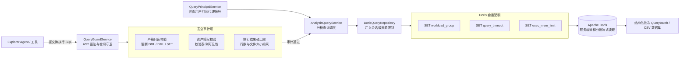

# 模块三：安全查询引擎与执行守卫

## 1. 模块定位与职责

安全查询引擎与执行守卫模块是 DataAgent 面向底层数仓的安全防火墙与执行枢纽。该模块负责确保 Agent 生成的所有 SQL 在语法、权限、安全和资源消耗上完全受控，并利用用户绑定的隔离只读账号，在受限的资源配额下流式拉取分析数据集。



---

## 2. 核心架构与功能特性

### 2.1 动态只读代理身份调度
- [`QueryPrincipalService`](../app/query/services/principal.py) 根据当前登录用户的 `user_id` 与绑定的 Doris 角色，从凭据库中检索并解密对应的代理查询账号（如 `sales_query`），确保查询在数仓端具备天然的库表和行级权限隔离。
- **启动前只读权限校验**：系统启动或身份加载时，[`DorisQueryRepository.verify_readonly_access`](../app/query/repositories/doris.py) 自动执行 `SHOW GRANTS`，若发现账号具备写权限（如 `LOAD_PRIV`、`ALTER_PRIV`、`ADMIN_PRIV`），立即阻断并抛出 [`DorisReadonlyPrivilegeError`](../app/query/repositories/doris.py)。

### 2.2 AST 语法解析与多维安全守卫
[`QueryGuardService`](../app/query/services/guard.py) 在 SQL 进入执行引擎前进行确定性审计：
- **严格只读校验**：
  - 基于 SQL 语法树（AST）解析，仅允许纯 `SELECT` 及合法的 `WITH ... SELECT` 语句。
  - 严厉拦截所有数据定义语句（`CREATE`、`DROP`、`ALTER`、`TRUNCATE`）。
  - 严厉拦截所有数据变更语句（`INSERT`、`UPDATE`、`DELETE`）。
  - 严厉拦截所有管理与会话控制语句（`GRANT`、`REVOKE`、`SET`、`KILL`）。
- **资产范围与越权审计**：
  - 提取 SQL 涉及的所有物理表与字段，与用户当前的授权策略（[`AssetAccessPolicy`](../app/identity/services/authorization.py)）进行交集比对。
  - 若查询包含未授权表或未授权列，直接抛出拒绝访问异常。
- **执行结果硬上限**：
  - `DorisQueryRepository` 使用外层查询强制限制实际返回行数，`AnalysisQueryService` 在流式写入过程中限制 CSV 文件大小。

### 2.3 连接级资源配额控制
在建立 Doris 异步连接后，[`DorisQueryRepository._apply_session_limits`](../app/query/repositories/doris.py) 自动在当前会话执行参数注入：
```sql
SET workload_group = '{workload_group}';
SET query_timeout = {timeout_seconds};
SET exec_mem_limit = {memory_limit_bytes};
```
- 确保单个重型分析查询不会耗尽数仓全局计算资源或阻塞其他业务。

### 2.4 服务端游标分批流式传输
- [`DorisQueryRepository.stream`](../app/query/repositories/doris.py) 结合服务端游标（Server-side Cursor）按批次（[`QueryBatch`](../app/query/models/execution.py)）拉取数据，避免一次性将百万级结果集加载至 Web 服务内存。
- [`AnalysisQueryService`](../app/query/services/executor.py) 提供面向上层 Agent 的高级封装，将结果集直接格式化并流式写入用户沙箱中的 CSV 文件。

### 2.5 查询经验记忆

每次 `execute_sql` 尝试都会在 Meta PostgreSQL 写入一条执行记录，保留用户、角色、权限纪元、`purpose`、原始 SQL 和结果摘要。成功执行会按 `Doris 角色 + SQL 结构指纹` 聚合为角色共享经验，Guard 提取的表和字段及其 `meta_version` 会作为经验资产快照保存。

- SQL 结构指纹来自 Guard 规范化 SQL 的 AST，所有字面量会替换为 `:p1`、`:p2` 等占位符。Elasticsearch 只保存任务文本、表字段名称、角色、权限纪元和向量，不保存原始 SQL、查询字面量或结果样本。
- 成功查询进入 `candidate` 状态；相同角色和指纹会聚合最近的去重 `purpose`。
- 查询经验以全文与向量融合排序。ES 候选、PostgreSQL 回查均按角色和权限纪元限制，服务层随后进行元数据版本和资产权限复核，最终保留最多 3 条。
- 表或字段元数据更新、删除及批量导入完成后，所有关联经验会立即转为 `disabled` 并删除 Elasticsearch 文档。检索时还会再次比较当前元数据版本，补偿并发变更或索引删除失败，失效经验不会返回 Explorer。
- 已失效 SQL 后续重新通过完整 Guard 并成功执行时，会使用最新表字段版本恢复为新的 `candidate` 经验。
- PostgreSQL 保存完整事实和聚合状态，Elasticsearch 作为可重建的语义检索索引。索引更新失败不会改变 SQL 的成功结果，后续执行或采用会再次触发同步。
- 撤销 SELECT 权限、创建或删除 Row Policy 会轮换角色权限纪元，使旧经验与旧会话缓存立即失效。用户注销不会删除查询执行审计或角色共享经验；沙箱文件仍会清理，结果摘要中的产物路径可能失效。

---

## 3. 核心接口与组件规范

### 核心服务方法
| 组件 | 核心方法 | 职责 |
| :--- | :--- | :--- |
| [`QueryGuardService`](../app/query/services/guard.py) | `check(user_id, sql, dialect)` / `require_safe(user_id, sql, dialect)` | 校验 SQL 语法只读性、提取依赖表列、比对用户资产白名单 |
| [`QueryPrincipalService`](../app/query/services/principal.py) | `resolve(user_id)` | 获取并解密当前用户绑定的只读代理身份 |
| [`AnalysisQueryService`](../app/query/services/executor.py) | `execute(session_key, sql, dialect)` | 结合安全守卫执行受控查询，并将结果安全落盘为 CSV 数据集 |
| [`DorisQueryRepository`](../app/query/repositories/doris.py) | `stream(sql, limits, options)` | 会话级参数注入与服务端游标流式拉取 |
| `QueryExperienceService` | `record_success` / `record_failure` / `promote_by_artifacts` / `invalidate_assets` / `search` | 记录查询事实、聚合候选经验并执行权限感知的混合检索 |

---

## 4. 关键代码映射

- 查询安全守卫：[`app/query/services/guard.py`](../app/query/services/guard.py)
- 分析查询调度服务：[`app/query/services/executor.py`](../app/query/services/executor.py)
- 查询代理身份调度：[`app/query/services/principal.py`](../app/query/services/principal.py)
- Doris 底层查询仓储：[`app/query/repositories/doris.py`](../app/query/repositories/doris.py)
- 查询校验模型：[`app/query/models/validation.py`](../app/query/models/validation.py)
- 查询执行模型、资源限制与流式处理选项：[`app/query/models/execution.py`](../app/query/models/execution.py)
- 查询经验模型：[`app/query/models/experience.py`](../app/query/models/experience.py)
- 查询经验服务：[`app/query/services/experience.py`](../app/query/services/experience.py)
- 查询经验检索工具：[`app/analytics/agents/explorer/tools/semantic_recall.py`](../app/analytics/agents/explorer/tools/semantic_recall.py)
