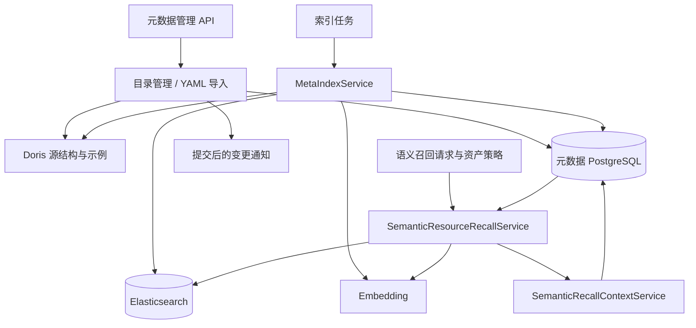

# 03. Metadata：业务目录、索引同步与语义召回

Metadata 维护表、字段和指标的业务定义，将目录及字段取值构建为检索索引，并保存 Conversation 内可累积的召回上下文。PostgreSQL 保存目录和同步事实，Elasticsearch 保存可重建的检索文档。

## 1. 模块结构与职责

| 组件 | 负责的内容 |
| --- | --- |
| MetaCatalogService | 单项目录读写、依赖检查、导出和提交后的变更通知 |
| MetaImportService | merge/replace、预检、最终依赖图、批量目录事务 |
| SourceDorisRepo | 物理表字段、主键、示例值及取值同步数据读取 |
| MetaIndexService | 字段/指标文本差量、Embedding、取值全量/增量同步 |
| SemanticResourceRecallService | 权限过滤、并行检索、RRF 与上下文补全 |
| SemanticRecallContextService | 快照追加、合并、删除和读取时授权 |
| MetadataAuthorizationFilter | 目录可见性、字段访问和关系依赖过滤 |
| 索引调度与任务 | 提交同步请求，在 Worker 内执行并报告结果 |

Agent 工具及引用展开属于 Assistant，本模块提供目录、搜索和上下文操作。

## 2. 目录模型与依赖约束

| 对象 | 描述什么 | 关键细节 |
| --- | --- | --- |
| `TableInfo` | 一张表或视图的业务用途 | 名称、fact/dim 角色、主键、描述、取值索引游标列、版本 |
| `ColumnInfo` | 一个字段的业务含义 | 物理类型、描述、别名、示例值、是否索引取值、外键引用、版本 |
| `MetricInfo` | 一个业务指标 | 名称、定义、别名、依赖字段、版本 |
| `ColumnMetric` | 字段与指标的关系 | 让依赖检查和变更失效能够定位到具体字段 |
| `ValueIndexSyncState` | 某个字段值索引的同步进度 | 当前批次、运行标识、游标、水位、状态和错误 |

表角色 `fact`、`dim` 是业务建模信息，并不改变 Doris 表结构。字段类型和逻辑主键来自 Doris 的源结构检查，不是让管理员在 YAML 中任意声明一种并不存在的物理类型。

删除字段前会检查外键引用和指标依赖。如果另一张表或一个指标还引用它，服务会要求先处理依赖，避免目录里留下断开的关系。

## 3. 物理目录与示例值读取

`SourceDorisRepo` 查询当前数据库的表、视图和列信息，按列定义读取 UNIQUE KEY 相关主键信息。动态表名和字段名经数据库方言引用，过滤值及游标比较使用参数，不把用户输入直接拼接成任意 SQL。

目录写入通常读取最多 10 个示例：单字段操作读取少量 DISTINCT 值；批量导入按表取少量行，再提取各列的示例。示例帮助模型理解状态码和枚举，不是统计样本，也不保证覆盖所有取值。

日期时间转为 ISO 文本，Decimal 示例转为浮点数，结果稳定排序。完整业务查询结果另有自己的序列化规则，不能把目录示例的处理方式套到 CSV 上。

配置增量游标时会确认列存在；当前并非在配置阶段按一张游标类型白名单穷尽校验。运行时仍可能因实际值或源数据问题失败。

## 4. YAML 批量导入与导出

`conf/meta_config.yaml` 是可参考的业务目录配置。上传接口按 UTF-8 和安全 YAML 解析方式读取内容，再由 Pydantic 与服务层分别检查结构和语义：未知字段、重复名称、描述要求、外键成对声明、引用目标和指标依赖等。

| 模式 | 未出现在上传文件中的原有资源 |
| --- | --- |
| `merge` | 保留，适合补充一个业务域或修改部分定义 |
| `replace` | 删除，以文件给出的最终目录为准 |

`dry_run` 执行预检并返回新增、修改、删除清单，不写 PostgreSQL 或 Elasticsearch，也不投递后置任务。但它仍需读取当前目录和源结构，不是单纯校验 YAML 语法。

正式导入由 Celery 异步执行，HTTP 返回任务 ID；预检查则在请求内返回变更清单。因此，提交成功不等于导入已经完成，应继续查看任务结果。

Worker 中的正式导入先确认最终依赖图，再进行必要的旧索引删除和 PostgreSQL 写入，提交后触发语义索引同步。Replace 的 Elasticsearch 清理和 PostgreSQL 事务不是跨库原子操作；中途失败时可能暂时不一致，需要重试或手动同步。

上传入口当前会完整读取 YAML，没有单独的文件字节上限。代理层请求体限制和业务配置列表约束解决的是不同问题。

目录导出将当前表、字段、指标及关系组织成 UTF-8 YAML。导入导出操作修改的是应用业务目录，不创建、修改或删除 Doris 物理表。

## 5. 元数据版本与索引版本

业务内容变更时，`meta_version` 增加；字段或指标成功同步后，`index_version` 追上对应版本。只有描述、别名、引用等实际业务快照变化才需要推进元数据版本，普通管理字段变化不等于内容变化。

同步任务按资源加数据库锁，写 Elasticsearch 后使用版本条件更新：只有数据库仍是任务读取的那一版，才承认这次索引已同步。旧任务不能仅凭“ES 请求成功”把新版本标记为完成。

这不是两套存储的全局事务。页面显示索引滞后时，应检查 Worker、任务错误、Embedding 和 ES，而不是重新保存同一份元数据来猜测是否生效。

当前字段和指标语义索引依靠变更投递、任务重试和手动同步，没有独立的周期修复扫描。

## 6. 语义文档与向量差量同步

字段和指标将名称、描述、别名拆成独立检索文本。每条文本保存所属资源键、文本类型、向量、内容指纹、Embedding 修订标识和资源快照。

资源快照变了，不一定要重新请求向量。文本和 Embedding 修订标识未变时，可以更新 payload 和版本并复用向量；文本或向量模型处理规则变化才需要重新生成。当前语义索引使用全文搜索和余弦相似度向量搜索，ES 的中文文本映射使用 IK 分词。

字段值索引保存某个字段实际出现过的值，例如地区名、渠道名。它使用文本搜索，不为每个值走与字段/指标完全相同的向量处理流程。只有 `index_values` 启用的字段参与取值同步。

| 默认索引 | 用途 |
| --- | --- |
| `data-agent-column` | 字段名称、别名和说明 |
| `data-agent-metric` | 指标名称、别名和业务口径 |
| `data-agent-value` | 启用字段的实际取值 |

索引名和向量维度可配置；维度必须与 Embedding 模型一致。

## 7. 字段取值同步与游标推进

全量同步会分批读取 DISTINCT 值，为这轮同步生成 generation。文档 ID 由表、列和值稳定派生，相同值会更新已有文档；全部写完后清理旧 generation，再条件提交 PostgreSQL 中的同步状态。

同步开始时还保存 run ID、元数据版本和游标配置。提交前再次核对这些条件，防止过期任务把已修改配置标记为成功。

必须明确两项限制：ES 已写入的文档不会因为 PostgreSQL 最后提交失败而自动回滚；搜索目前不按 `current_generation` 隐藏未提交批次，因此全量同步期间可能短暂混合新旧值。之后的成功全量同步负责覆盖和清理。

增量同步需要已经完成全量，并具备有效游标与提交水位。任务开始时固定本轮上界，再读取下界到上界的范围。datetime 游标按默认 300 秒回看，date 至少回看一天，其他类型重放边界；稳定文档 ID 使重复读取可以安全覆盖同一个值。

增量同步适合补充新值，不是完整的变更数据捕获系统，不能保证发现任意历史删除或游标范围外的修正。需要清除旧取值时应使用全量同步。

默认每天 08:00 按 Asia/Shanghai 调度字段值任务，管理员也可以手动触发。首次接入通常需要先做全量同步。

## 8. 混合检索与上下文补全

一次 `recall_context` 可以携带稳定 query、1—20 个检索词、字段/指标/取值资源类型，以及每类 1—20 个结果上限。

搜索前，系统读取当前权限和目录，生成资源白名单，加入 ES 查询条件。字段和指标并行执行全文与向量搜索，再用倒数排名融合：看候选在各条搜索结果中的名次，而不是直接相加不同量纲的原始分数。当前 RRF 常数为 60，候选数量通常为目标上限的三倍、最多 60。

服务先加载 PostgreSQL 目录并关闭会话，再进行外部检索；命中后根据这份目录组装资源，丢弃不存在或不在当前可见集合中的键，补充指标依赖字段、已授权主键和一层外键关系。ES 旧文档仍可能影响排名；返回最新目录内容和 `index_status` 不等于已经彻底消除了旧排名影响。

有排名的直接字段及指标依赖字段最多进入 30 个上下文位置；取值所属字段、主键和外键属于补充信息，因此最终字段总数可能超过 30。发生截断会给出标志和 warning；每个返回字段最多展示 3 个示例。

Embedding 失败时，已经成功的全文结果仍可返回，并标记部分失败。字段值或某个搜索通道失败也不必吞掉其他通道的结果。`partial` 描述本次搜索的完整性，`current/stale/missing` 描述索引状态，二者不要混用。

## 9. 召回快照与 query 生命周期

Explorer 往往先找销售指标，再补地区字段，最后确认退款状态。如果每次工具调用都丢掉上一步，模型要不断重复检索。因此系统以用户、Conversation 和稳定 query 累积上下文。

query 是业务键，不是每次换一个说法的日志文本。后续补搜应复用相同 query，仅改变检索词和资源类型。合并时保留更新的元数据版本、较优排名和去重后的来源说明，不把每轮排名重新计算成一个全局分数。

搜索在写锁之外执行；保存时按 query 加锁，读取当前快照再合并，避免并发结果互相覆盖。快照存入 `meta` 数据库，新召回可以追加快照；显式合并或删除会移除相关历史，因此它不是不可删除的审计账本。

| 工具 | 对快照做什么 |
| --- | --- |
| `recall_context` | 检索并累积指定 query 的语义资源 |
| `list_recalls` | 列出当前 Conversation 的最近 query 摘要 |
| `get_recall` | 读取某个 query 的最新累计结果 |
| `merge_recalls` | 把来源 query 的语义资源并入目标，再删除来源 |
| `delete_recalls` | 删除整个 query，或指定表、字段、值、指标；一次调用中 query 不重复 |

## 10. 快照授权边界

Checkpoint 中工具消息主要保存引用，调用模型或展示历史时再按当前权限展开。独立读取会重新取得策略，批量展开会复用同一次操作的读取结果，避免逐条打开数据库会话。

读取或展开已保存的快照时，系统按当前资产访问权限过滤表、字段和指标，已撤销的权限不能通过旧快照继续访问。

删除工具保存的是已存储或已删除 query 的确认信息，后续展开也重新检查权限，不应把旧完整 payload 固定嵌在工具消息中继续暴露。召回运行资源由 `SemanticRecallRuntime` 明确注入，服务组装由模块 providers 完成。

## 11. 目录变更通知

`MetadataChangeWorkflow` 根据变更清单投递字段、指标同步任务。具体目录读写仍留在 Metadata，Workflow 不重复实现仓储。

PostgreSQL 写入成功后投递任务失败，不代表目录没有保存。此时应查看索引状态并补同步。类似地，删除元数据只是管理业务目录，不会自动执行 Doris 的 DROP TABLE。

## 12. 管理接口与异常定位

管理 API 位于 `/api/v1/meta`，覆盖表、字段、指标、YAML 导入导出、示例值和索引同步。

遇到“搜不到”时，先查目录是否存在，再查当前用户的字段权限，然后看 `index_values`、语义版本或取值同步状态，最后检查 ES/Embedding 与任务日志。搜索到了旧口径时，还应检查目录是否真的改过、版本是否推进、索引是否同步。

## 13. 同步状态与失败恢复

| 状态或标识 | 含义 | 失败后的判断依据 |
| --- | --- | --- |
| meta_version | 目录业务内容版本 | 当前数据库内容是否已提交 |
| index_version | 语义索引已确认版本 | 旧任务不能把新目录标为已同步 |
| active_run_id | 当前字段取值同步所有者 | 过期任务不能提交其他任务的状态 |
| current_generation | 最近提交的取值代次 | 不保证 ES 在失败前尚未删除旧值 |
| active_generation | 当前运行写入的代次 | 部分写入不会随数据库失败自动回滚 |
| cursor_value | 已提交增量水位 | 失败运行不能直接推进水位 |
| last_error | 最近同步失败原因 | 区分源读取、Embedding、ES 和最终提交错误 |

语义搜索的 success/partial/failed 描述本次检索通道完成情况，current/stale/missing 描述索引与目录的同步关系。目录写入、变更通知、任务投递、ES 修改和版本确认都有独立失败边界；恢复时根据已有状态补做缺失步骤。
