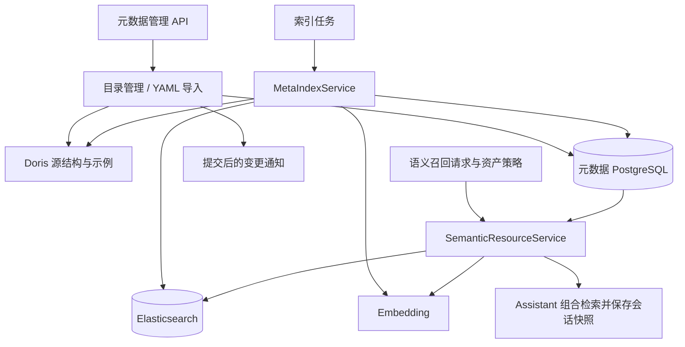

# 03. Metadata：业务目录、索引同步与语义召回

Metadata 维护表、字段和指标的业务定义，将目录及字段取值构建为检索索引。PostgreSQL 保存目录和同步事实，Elasticsearch 保存可重建的检索文档。

## 1. 提供哪些功能

| 功能 | 提供的能力 | 使用方 |
| --- | --- | --- |
| 业务目录管理 | 维护表说明、字段含义、别名、外键和指标依赖 | 管理员 |
| YAML 导入导出 | merge／replace、预检变更清单、后台正式导入、导出当前目录 | 管理员 |
| 源结构读取 | 读取 Doris 表、字段、主键与示例值 | 目录管理和索引任务 |
| 语义索引同步 | 为字段、指标的名称和说明建立全文及向量索引 | 后台任务 |
| 取值索引同步 | 对启用字段执行全量或增量取值同步 | 管理员、定时任务 |
| 语义召回 | 按资产权限检索字段、指标和取值，补充关联上下文 | Assistant |
| 目录和版本快照 | 提供 SQL 解析目录、经验引用资产的当前版本 | Query |

## 2. 如何使用

### 2.1 页面与 HTTP 入口

管理中心的“元数据管理”提供目录维护、YAML 导入导出和索引同步。全部管理操作要求平台管理员身份，路径前缀为 `/api/v1/meta`。

| 操作 | 入口 |
| --- | --- |
| 查询表和 Doris 来源表 | `GET /tables`、`GET /source-tables` |
| 查询字段和指标 | `GET /tables/{t_name}/columns`、`GET /metrics` |
| 创建或更新目录 | `PUT /tables/{t_name}`、`PUT /tables/{t_name}/columns/{c_name}`、`PUT /metrics/{metric_name}` |
| 批量删除 | `POST /tables/batch-delete`、`POST /columns/batch-delete`、`POST /metrics/batch-delete` |
| YAML 导入、导出 | `POST /import`、`GET /export` |
| 同步语义索引 | `POST /tables/sync`、`POST /columns/sync`、`POST /metrics/sync` |
| 同步字段取值 | `POST /tables/sync-values`、`POST /columns/sync-values` |

首次接入可先预检 `conf/meta_config.yaml`，再正式导入，等待语义索引完成后对启用取值索引的字段进行全量同步。后台操作返回任务 ID，通过 `GET /api/v1/tasks/{task_id}` 查询结果。

### 2.2 跨模块调用

服务从 `app.metadata` 导入，请求和结果从 `app.metadata.contracts` 导入。应用创建实例并注入调用方，服务内部管理读取会话。

| 公开入口 | 调用方式与结果 |
| --- | --- |
| `MetadataReader` | `query_catalog()` 返回目录快照；`asset_versions(table_names, column_keys)` 返回现存资产版本 |
| `SemanticResourceService` | `recall(request, policy)` 返回语义资源及检索状态 |
| `SemanticRecallAuthorization` | 按给定资产策略过滤语义结果与关联上下文 |
| `CeleryMetadataSemanticIndexScheduler` | `enqueue_columns()`、`enqueue_metrics()` 返回任务提交结果 |

以下代码在异步业务方法中使用已注入的 `identity` 和 `metadata_search`，用户 ID 来自服务端身份：

```python
from app.metadata.contracts import SemanticResourceRecallRequest

policy = await identity.asset_policy(user_id)
result = await metadata_search.recall(
    SemanticResourceRecallRequest(
        terms=["销售收入", "地区"],
        resource_types=["column", "metric"],
        limit_per_type=5,
    ),
    policy,
)
```

`MetadataReader.query_catalog()` 提供 SQL 解析辅助信息；实际 SQL 的表列存在性和访问权限由 Doris 执行时检查。

## 3. 关键业务规则

### 3.1 目录对象与依赖

| 对象 | 描述什么 | 关键细节 |
| --- | --- | --- |
| `TableInfo` | 一张表或视图的业务用途 | 名称、fact/dim 角色、主键、描述、取值索引游标列、版本 |
| `ColumnInfo` | 一个字段的业务含义 | 物理类型、描述、别名、示例值、是否索引取值、外键引用、版本 |
| `MetricInfo` | 一个业务指标 | 名称、定义、别名、依赖字段、版本 |
| `ColumnMetric` | 字段与指标的关系 | 让依赖检查和变更失效能够定位到具体字段 |
| `ValueIndexSyncState` | 某个字段值索引的同步进度 | 当前批次、运行标识、游标、水位、状态和错误 |

表角色 `fact`、`dim` 是业务建模信息，并不改变 Doris 表结构。字段类型和逻辑主键来自 Doris 的源结构检查，不是让管理员在 YAML 中任意声明一种并不存在的物理类型。

删除字段前会检查外键引用和指标依赖。如果另一张表或一个指标还引用它，服务会要求先处理依赖，避免目录里留下断开的关系。

### 3.2 导入、预检和覆盖范围

`conf/meta_config.yaml` 是可参考的业务目录配置。上传接口按 UTF-8 和安全 YAML 解析方式读取内容，再由 Pydantic 与服务层分别检查结构和语义：未知字段、重复名称、描述要求、外键成对声明、引用目标和指标依赖等。

| 模式 | 未出现在上传文件中的原有资源 |
| --- | --- |
| `merge` | 保留，适合补充一个业务域或修改部分定义 |
| `replace` | 删除，以文件给出的最终目录为准 |

`dry_run` 执行预检并返回新增、修改、删除清单，不写 PostgreSQL 或 Elasticsearch，也不投递后置任务。但它仍需读取当前目录和源结构，不是单纯校验 YAML 语法。

正式导入由 Celery 异步执行，HTTP 返回任务 ID；预检查则在请求内返回变更清单。因此，提交成功不等于导入已经完成，应继续查看任务结果。

Worker 中的正式导入先确认最终依赖图，再进行必要的旧索引删除和 PostgreSQL 写入，提交后触发经验失效及语义索引同步。Replace 的 Elasticsearch 清理和 PostgreSQL 事务不是跨库原子操作；中途失败时可能暂时不一致，需要重试或手动同步。

上传入口当前会完整读取 YAML，没有单独的文件字节上限。代理层请求体限制和业务配置列表约束解决的是不同问题。

目录导出将当前表、字段、指标及关系组织成 UTF-8 YAML。导入导出操作修改的是应用业务目录，不创建、修改或删除 Doris 物理表。

### 3.3 目录版本与索引状态

业务内容变更时，`meta_version` 增加；字段或指标成功同步后，`index_version` 追上对应版本。只有描述、别名、引用等实际业务快照变化才需要推进元数据版本，普通管理字段变化不等于内容变化。

同步任务按资源加数据库锁，写 Elasticsearch 后使用版本条件更新：只有数据库仍是任务读取的那一版，才承认这次索引已同步。旧任务不能仅凭“ES 请求成功”把新版本标记为完成。

字段和指标各自在有界批次内同步，`metadata_index.semantic_resource_batch_size` 控制每批资源数（当前为 32）。同一批按资源键排序加锁，持锁到差量写入、刷新和版本检查完成，再统一提交；异常或取消会回滚该批版本，之前成功提交的批次保留。ES 部分写入不能随 PostgreSQL 回滚，重试会重新读取差量并补齐。

这不是两套存储的全局事务。页面显示索引滞后时，应检查 Worker、任务错误、Embedding 和 ES，而不是重新保存同一份元数据来猜测是否生效。

当前字段和指标语义索引依靠变更投递、任务重试和手动同步，没有独立的周期修复扫描；查询经验索引则有自己的修复任务。

### 3.4 字段取值的全量与增量

全量同步会分批读取 DISTINCT 值，为这轮同步生成 generation。文档 ID 由表、列和值稳定派生，相同值会更新已有文档；全部写完后清理旧 generation，再条件提交 PostgreSQL 中的同步状态。

同步开始时还保存 run ID、元数据版本和游标配置。提交前再次核对这些条件，防止过期任务把已修改配置标记为成功。

必须明确两项限制：ES 已写入的文档不会因为 PostgreSQL 最后提交失败而自动回滚；搜索目前不按 `current_generation` 隐藏未提交批次，因此全量同步期间可能短暂混合新旧值。之后的成功全量同步负责覆盖和清理。

增量同步需要已经完成全量，并具备有效游标与提交水位。任务开始时固定本轮上界，再读取下界到上界的范围。datetime 游标按默认 300 秒回看，date 至少回看一天，其他类型重放边界；稳定文档 ID 使重复读取可以安全覆盖同一个值。

增量同步适合补充新值，不是完整的变更数据捕获系统，不能保证发现任意历史删除或游标范围外的修正。需要清除旧取值时应使用全量同步。

默认每天 08:00 按 Asia/Shanghai 调度字段值任务，管理员也可以手动触发。首次接入通常需要先做全量同步。

## 4. 内部实现

### 4.1 目录与服务职责

```text
metadata/
├── __init__.py          跨模块公开入口
├── catalog/
│   ├── service.py       表、字段、指标管理与导出
│   ├── importer.py      YAML 解析、预检与批量导入
│   └── reader.py        目录及资产版本快照读取
├── search/
│   ├── service.py       混合检索、候选融合和响应构建
│   ├── authorization.py 授权规则、目录过滤和快照过滤
│   └── context.py       字段、主键和外键上下文补全
├── indexing.py          语义索引差量同步、取值同步与索引清理
├── api/                 HTTP 参数、请求依赖与响应协议
├── repositories/        PostgreSQL、Doris 和 Elasticsearch 访问
├── models/              目录模型与取值同步状态
├── contracts.py         公开请求、响应和变更契约
├── config.py            元数据导入配置
├── errors.py            业务异常
├── task_scheduler.py    导入与索引任务提交
└── tasks.py             后台任务执行与资源释放
```


```mermaid
flowchart TD
    API[元数据管理 API] --> CATALOG[目录管理 / YAML 导入]
    CATALOG --> SOURCE[Doris 源结构与示例]
    CATALOG --> PG[(元数据 PostgreSQL)]
    CATALOG --> CHANGES[提交后的变更通知]
    TASK[索引任务] --> INDEX[MetaIndexService]
    INDEX --> PG
    INDEX --> SOURCE
    INDEX --> EMB[Embedding]
    INDEX --> ES[(Elasticsearch)]
    REQUEST[语义召回请求与资产策略] --> SEARCH[SemanticResourceService]
    PG --> SEARCH
    SEARCH --> ES
    SEARCH --> EMB
    SEARCH --> ASSIST[Assistant 组合检索并保存会话快照]
```

| 组件 | 负责的内容 |
| --- | --- |
| MetaCatalogService | 单项目录读写、依赖检查、导出和提交后的变更通知 |
| MetaImportService | merge/replace、预检、最终依赖图、批量目录事务 |
| SourceDorisRepo | 物理表字段、主键、示例值及取值同步数据读取 |
| MetaIndexService | 字段/指标文本差量、Embedding、取值全量/增量同步 |
| SemanticResourceService | 目录读取、权限过滤、并行检索、RRF 与上下文补全 |
| SemanticRecallAuthorization | 目录可见性、字段访问和关系依赖过滤 |
| 索引调度与任务 | 提交同步请求，在 Worker 内执行并报告结果 |

查询经验的生成和候选检索属于 Query；会话召回上下文、经验缓存、组合检索和工具投影属于 Assistant。本模块提供目录、版本读取和语义资源检索。其他模块从 `app.metadata` 导入 `MetadataReader`、`SemanticResourceService` 和授权、索引调度能力，请求和结果类型从 `app.metadata.contracts` 导入。

`MetaCatalogService`、`MetaImportService` 的完整实现分别位于 `catalog/service.py` 和 `catalog/importer.py`。`MetadataReader` 位于 `catalog/reader.py`。

`SemanticResourceService` 在 `search/service.py` 中直接完成召回流程，字段、外键和主键上下文补全由 `search/context.py` 的 `ColumnContextBuilder` 负责。目录读取会话在 Embedding 和索引请求前关闭；权限过滤结果、排名与索引查询并发限制属于单次召回上下文，共享服务实例不保存用户权限或目录快照。

HTTP 的 `api/dependencies.py` 管理请求会话，并直接创建目录、导入及索引服务。同一请求共享元数据库会话和 Doris 连接。后台任务通过资源上下文取得仓储和索引服务，直接调用相应方法；上下文负责在完成、失败或取消后释放资源。元数据变更工作流由 HTTP 和任务入口注入。

### 4.2 源结构与示例值

`SourceDorisRepo` 查询当前数据库的表、视图和列信息，按列定义读取 UNIQUE KEY 相关主键信息。动态表名和字段名经数据库方言引用，过滤值及游标比较使用参数，不把用户输入直接拼接成任意 SQL。

目录写入通常读取最多 10 个示例：单字段操作读取少量 DISTINCT 值；批量导入按表取少量行，再提取各列的示例。示例帮助模型理解状态码和枚举，不是统计样本，也不保证覆盖所有取值。

日期时间转为 ISO 文本，Decimal 示例转为浮点数，结果稳定排序。完整业务查询结果另有自己的序列化规则，不能把目录示例的处理方式套到 CSV 上。

配置增量游标时会确认列存在；当前并非在配置阶段按一张游标类型白名单穷尽校验。运行时仍可能因实际值或源数据问题失败。

### 4.3 语义文档与向量同步

字段和指标将名称、描述、别名拆成独立检索文本。每条文本保存所属资源键、文本类型、向量、内容指纹、Embedding 修订标识和资源快照。

资源快照变了，不一定要重新请求向量。文本和 Embedding 修订标识未变时，可以更新 payload 和版本并复用向量；文本或向量模型处理规则变化才需要重新生成。当前语义索引使用全文搜索和余弦相似度向量搜索，ES 的中文文本映射使用 IK 分词。

同一批内汇总需要重建向量的文档，再按 `embedding.batch_size` 请求向量，保持每条文本与文档一一对应；合并同类资源的 ES 差量写入，每批资源只刷新一次。名称、描述、别名在资源内规范化去重，按稳定文档 ID 写入。当前 `embedding.batch_size` 为 32，部署时需与所用向量接口的批量限制匹配。

字段和指标仓库共用资源白名单过滤、全文/向量查询及命中解析，仅保留资源键和领域载荷差异。`allowed_keys=None` 表示不限制，空集合直接返回且不访问 ES；字段值仓库保留独立的字段过滤接口。召回服务共用并发限制、通道失败收集及排名融合，一次生成共享向量，每词按资源去重并使用原始命中排名计分，取消继续向上传播。

字段值索引保存某个字段实际出现过的值，例如地区名、渠道名。它使用文本搜索，不为每个值走与字段/指标完全相同的向量处理流程。只有 `index_values` 启用的字段参与取值同步。

| 默认索引 | 用途 |
| --- | --- |
| `data-agent-column` | 字段名称、别名和说明 |
| `data-agent-metric` | 指标名称、别名和业务口径 |
| `data-agent-value` | 启用字段的实际取值 |
| `data-agent-query-experience` | Query 模块维护的成功 SQL 经验 |

索引名和向量维度可配置；维度必须与 Embedding 模型一致。

### 4.4 混合检索与上下文补全

`SemanticResourceRecallRequest` 接收 1—20 个检索词、字段/指标/取值资源类型，以及每类 1—20 个结果上限。

搜索前，系统读取当前权限和目录，生成资源白名单，加入 ES 查询条件。需要召回字段或指标时，先为检索词生成一次共享向量，再依次执行字段全文、字段向量、指标全文、指标向量，最后执行取值全文检索；仅执行请求选择且目录非空的资源。每个通道内的检索词并发执行，并受索引查询限流约束。结果使用倒数排名融合：看候选在各条搜索结果中的名次，而不是直接相加不同量纲的原始分数。当前 RRF 常数为 60，候选数量通常为目标上限的三倍、最多 60。

服务先加载 PostgreSQL 目录并关闭会话，再进行外部检索；命中后根据这份目录组装资源，丢弃不存在或不在当前可见集合中的键，补充指标依赖字段、已授权主键和一层外键关系。ES 旧文档仍可能影响排名；返回最新目录内容和 `index_status` 不等于已经彻底消除了旧排名影响。

有排名的直接字段及指标依赖字段最多进入 30 个上下文位置；取值所属字段、主键和外键属于补充信息，因此最终字段总数可能超过 30。发生截断会给出标志和 warning；每个返回字段最多展示 3 个示例。

只检索取值或没有可检索的字段、指标时，不调用 Embedding。Embedding 失败时，仅记录实际参与召回资源的向量失败，继续全文和取值检索，并标记部分失败。字段值或某个搜索通道失败也不必吞掉其他通道的结果。`partial` 描述本次搜索的完整性，`current/stale/missing` 描述索引状态，二者不要混用。

Metadata 返回单次检索结果。Assistant 将结果按用户、Conversation 和稳定 query 保存、合并与删除，并管理查询经验缓存。`SemanticRecallAuthorization` 对这些结果和已保存快照按当前资产策略进行过滤。

### 4.5 目录提交后的处理

删除或修改表字段，可能导致已有 SQL 经验与当前目录不一致。`MetadataChangeWorkflow` 把变更清单交给 Query 失效相关经验，并投递字段、指标同步任务。具体目录读写仍留在 Metadata，Workflow 不重复实现仓储。

PostgreSQL 写入成功后投递任务失败，不代表目录没有保存。此时应查看索引状态并补同步。类似地，删除元数据只是管理业务目录，不会自动执行 Doris 的 DROP TABLE。

## 5. 异常与排障

| 现象 | 检查顺序 |
| --- | --- |
| 导入被拒绝 | YAML 结构、重复名称、源表字段、外键和指标依赖 |
| 提交成功但目录未更新 | 导入任务状态和 Worker 日志 |
| 检索不到资源 | 目录是否存在、当前资产权限、语义索引版本、ES／Embedding 状态 |
| 检索不到字段值 | `index_values`、首次全量同步、游标配置和同步错误 |
| 返回口径过时 | 目录内容、meta_version、index_version、关联经验状态 |
| partial 结果 | 本次失败通道；可用通道仍可能返回数据 |

| 状态或标识 | 含义 | 失败后的判断依据 |
| --- | --- | --- |
| meta_version | 目录业务内容版本 | 当前数据库内容是否已提交 |
| index_version | 语义索引已确认版本 | 旧任务不能把新目录标为已同步 |
| active_run_id | 当前字段取值同步所有者 | 过期任务不能提交其他任务的状态 |
| current_generation | 最近提交的取值代次 | 不保证 ES 在失败前尚未删除旧值 |
| active_generation | 当前运行写入的代次 | 部分写入不会随数据库失败自动回滚 |
| cursor_value | 已提交增量水位 | 失败运行不能直接推进水位 |
| last_error | 最近同步失败原因 | 区分源读取、Embedding、ES 和最终提交错误 |

语义搜索的 success/partial/failed 描述本次检索通道完成情况，current/stale/missing 描述索引与目录的同步关系。目录写入、变更通知、任务投递、ES 修改和版本确认都有独立失败边界；恢复时根据已有状态补做缺失步骤。
