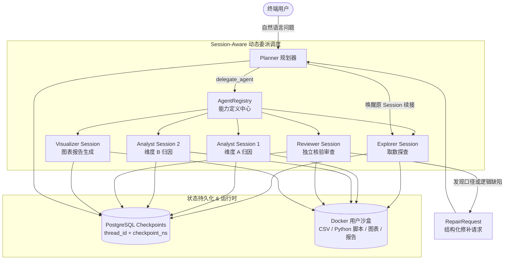

# 模块四：多 Agent 协同与数据分析架构

## 1. 模块定位与职责

多 Agent 协同与数据分析架构是 DataAgent 的核心业务大脑。系统基于 **DeepAgents Dynamic Subagents** 模式与 **LangGraph PostgreSQL Checkpointer**，构建了以持久化规划器（Planner）为中枢、专业子 Agent（探查、归因、审查、可视化）分工协作、支持同类型 Agent 多维并行、状态独立恢复以及跨 Agent 审查修补闭环的分析系统。

---

## 2. 核心架构与设计决策

### 2.1 Agent Definition 与 Agent Session 分离
- **Agent Definition（能力定义）**：
  - 静态声明 Agent 的能力类型、模型参数、System Prompt、工具白名单、技能与沙盒读写权限。
  - 会话生命周期内全局单例，构建一次即可复用。
- **Agent Session（执行实例）**：
  - 动态创建的执行实例，拥有独立的消息历史、工具调用栈、沙盒工作目录与状态。
  - **支持同类型并行**：例如 Planner 可以针对一个分析任务同时创建多个 `analyst` Session（如分别分析 `region`、`product`、`channel` 维度），在独立线程中并行计算而不互相污染。

### 2.2 状态隔离与恢复机制（`thread_id + checkpoint_ns`）
系统利用 LangGraph PostgreSQL Saver 保存完整状态，使用组合键实现分级隔离：
- `thread_id`：全局绑定当前用户的主对话会话（Conversation ID）。
- `checkpoint_ns`：以 `AnalysisID + AgentType + SessionID` 作为命名空间。
- **价值**：既保证了各专业 Agent 消息历史独立、并行执行互不阻塞，又支持在主对话后续多轮交互中精准唤醒指定 Session 继续上下文。

### 2.3 产物隔离与轻量化消息传递
- 大规模数据集、复杂 Python 计算脚本、ECharts 配置文件和分析报告全部存放在用户的 **Docker 本地沙盒** 中。
- Agent 间消息交互仅传递数据摘要、统计指标、字段列表与沙盒文件路径（如 `analyses/sales/report.csv`），杜绝大文本爆 Token 与上下文超限。

### 2.4 审查与回退修补闭环（Repair Loop）
- 下游 Agent（如 `Reviewer`）在审查数据口径、计算公式或图表配置时，若发现异常，不直接抛弃结果，而是输出结构化的 [`RepairRequest`](file:///home/kodey/dataagent/app/agents/contracts.py#L45-L68)（包含目标 Agent 类型、原 Session ID、问题描述与证据）。
- Planner 捕获修补请求后，精准唤醒对应的原 Session（如 `Explorer` 取数 Session）进行针对性修正，修正后由 Planner 触发下游受影响的分析步骤重新执行。

---

## 3. 专业 Agent 体系

| Agent 类型 | 核心职责 | 挂载工具与能力 | 交付产物 |
| :--- | :--- | :--- | :--- |
| [`Planner`](file:///home/kodey/dataagent/app/agents/planner/agent.py#L14) | 用户目标理解、任务动态拆分、委派调度、修补决策、结果汇总 | `delegate_agent`、`read_file`、`list_dir` | 最终自然语言回答与报告汇总 |
| [`Explorer`](file:///home/kodey/dataagent/app/agents/explorer/agent.py#L14) | 语义目录检索、历史查询经验复用、只读 SQL 生成、执行与数据探查 | [`semantic_recall`](file:///home/kodey/dataagent/app/agents/explorer/tools/semantic_recall.py#L25)、`search_query_experiences`、[`execute_sql`](file:///home/kodey/dataagent/app/agents/explorer/tools/execute_sql.py#L25)、沙盒文件工具 | CSV 数据集、字段画像与数据特征摘要 |
| [`Analyst`](file:///home/kodey/dataagent/app/agents/analyst/agent.py#L14) | 指标变化贡献率拆解、维度下钻、因果/相关性统计分析 | 沙盒 Shell 命令执行（运行 Python/Pandas/Scipy 分析脚本）、沙盒文件读写 | 归因分析结论、维度贡献率计算结果、统计衍生表 |
| [`Reviewer`](file:///home/kodey/dataagent/app/agents/reviewer/agent.py#L14) | 独立核验 SQL 取数口径、复核计算脚本逻辑、审查最终结论 | 沙盒 Shell 命令执行（运行校验脚本）、文件读取 | 审查通过确认 或 `RepairRequest` 结构化修补请求 |
| [`Visualizer`](file:///home/kodey/dataagent/app/agents/visualizer/agent.py#L14) | 图表配置生成（ECharts）、数据表格格式化与报告排版 | ECharts 渲染器、沙盒文件工具（生成 Markdown / HTML 报告） | ECharts Option JSON、可下载分析图表与报告 |

---

## 4. 对话服务与流式交互（Chat Runtime）

- **SSE 实时事件流**：[`AgentManager.run_agent_turn`](file:///home/kodey/dataagent/app/agents/manager.py#L180-L240) 将 Planner 及各子 Agent 的执行节点状态、消息增量、工具调用参数与返回结果，实时转换为标准化 SSE 事件推送到前端。
- **对话标题智能生成**：[`ConversationTitleService`](file:///home/kodey/dataagent/app/services/conversation_title_service.py#L20) 在首轮对话完成时，异步调用轻量模型提取会话核心议题并自动命名。
- **会话历史管理**：基于 [`ConversationPGRepo`](file:///home/kodey/dataagent/app/repositories/conversation_pg_repo.py#L18) 维护用户全部对话生命周期。

---

## 5. 关键代码映射

- Agent 统一管理器：[`app/agents/manager.py`](file:///home/kodey/dataagent/app/agents/manager.py)
- Agent 注册中心：[`app/agents/registry.py`](file:///home/kodey/dataagent/app/agents/registry.py)
- Agent 会话与状态持久化：[`app/agents/session_service.py`](file:///home/kodey/dataagent/app/agents/session_service.py)
- Agent 交互协议与修补契约：[`app/agents/contracts.py`](file:///home/kodey/dataagent/app/agents/contracts.py)
- 对话服务层：[`app/services/chat_service.py`](file:///home/kodey/dataagent/app/services/chat_service.py)
- 规划器实现：[`app/agents/planner/agent.py`](file:///home/kodey/dataagent/app/agents/planner/agent.py)
- 探查器实现：[`app/agents/explorer/agent.py`](file:///home/kodey/dataagent/app/agents/explorer/agent.py)
- 归因器实现：[`app/agents/analyst/agent.py`](file:///home/kodey/dataagent/app/agents/analyst/agent.py)
- 审查器实现：[`app/agents/reviewer/agent.py`](file:///home/kodey/dataagent/app/agents/reviewer/agent.py)
- 可视化器实现：[`app/agents/visualizer/agent.py`](file:///home/kodey/dataagent/app/agents/visualizer/agent.py)
