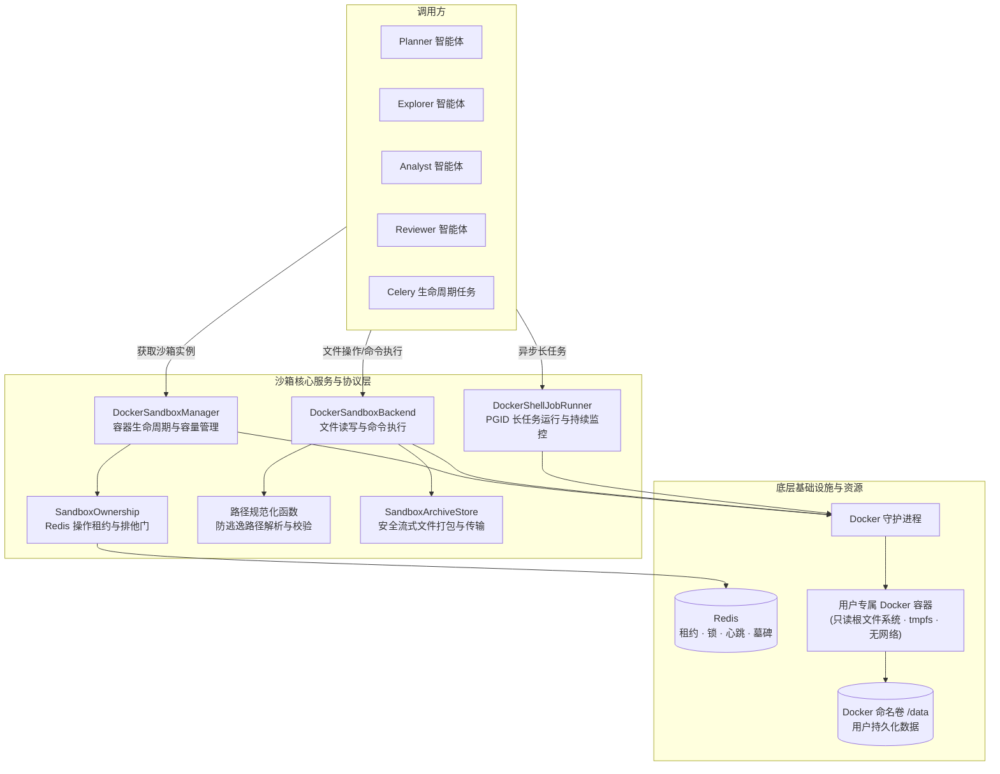

# 04. Sandbox：实现隔离工作区

## 功能说明

Sandbox 为 Planner、Explorer、Analyst 和 Reviewer 提供隔离的文件目录和命令执行环境。模型生成的脚本、用户附件、查询导出的 CSV 和报告都放在 Docker 容器中处理。该模块负责限制可访问路径、文件权限、CPU、内存和进程数，并协调多个 API 进程和 Worker 对同一沙箱的操作。

---

## 1. 模块总体架构与分层设计

### 1.1 架构定位与核心职责

`sandbox` 用来运行模型生成的代码并保存临时文件。上层只需要调用统一的文件和命令接口，不需要直接操作 Docker。主要职责包括：

1. **隔离不同用户和 Agent**：每个用户使用一个容器，每个会话使用一个目录，每个专业 Agent 使用一个 Linux UID。只读根文件系统和 cgroups 继续限制容器权限和资源。
2. **防止路径逃出工作区**：附件路径不能包含 `..`，写入和编辑只能发生在当前工作区。提交文件时使用 `O_NOFOLLOW`，防止攻击者把目录临时换成符号链接。
3. **安全读写文件和执行命令**：支持文本、二进制文件和局部编辑，并限制命令运行时间和输出大小。
4. **运行和取消长命令**：每个 Shell Job 使用独立进程组。取消时先发 `SIGTERM`，进程仍未退出时再发 `SIGKILL`，确保子进程也被停止。
5. **协调多个服务进程**：Redis 记录哪些操作正在运行。删除会话、注销用户或回收容器前，系统会阻止新操作并等待已有操作结束。
6. **控制运行中的容器数量**：需要时才启动容器。达到数量上限后，按最近最少使用（LRU）规则停止最久未使用的空闲容器。

### 1.2 系统数据流与架构关系



### 1.3 主要组件职责

| 领域 | 核心类 / 函数 | 职责描述 |
| :--- | :--- | :--- |
| 路径模型 | `SandboxReadonlyMount`, `SandboxSessionScope` 及路径规范化函数 | 校验只读挂载、会话工作区、附件相对路径和公开路径边界 |
| 归档存储 | `SandboxArchiveStore` | 通过 Docker Archive API 读取或写入文件，并维护 UID 记录和文件大小限制 |
| 沙箱后端 | `DockerSandboxBackend` | 执行受限命令，安全读写或局部编辑文件，并截断过长输出 |
| 长任务运行 | `DockerShellJobRunner` | 启动独立进程组，持续监控终态并支持 SIGTERM/SIGKILL 取消 |
| 跨进程协调 | `SandboxOwnership`, `RedisSandboxOwnership` | 记录正在运行的操作，协调维护、容量检查和删除状态 |
| 容器管理 | `DockerSandboxManager` | 管理容器、命名卷、规格指纹和 LRU 容量回收 |
| 运行时复用 | `DockerRuntimePool` | 复用进程内沙箱后端和容器句柄 |
| 特权脚本 | Lua 与 Python 脚本常量 | 实现 Redis 原子操作、文件提交和 Shell Job 包装控制 |
| 组件创建 | `create_sandbox_manager` | 创建 Docker 客户端，并配置只读挂载和 Redis 协调器 |
| 领域异常 | `SandboxPathError`, `SandboxDeletedError`, `SandboxCapacityError` 等 | 表达路径、删除状态、容量与所有权错误 |

---

## 2. 用户、会话和 Agent 如何隔离

沙箱按“一用户一容器、一会话一目录、一智能体一 UID”隔离资源。

### 2.1 用户、会话与智能体三层隔离

- **用户层**：每个平台用户绑定专属的 Docker 容器和命名卷（Named Volume），卷挂载至容器内部 `/data`。不同用户的容器与存储卷完全独立；
- **会话层**：每个 Conversation 在 `/data/{conversation_id}` 下拥有独立顶级目录。会话内分为用户附件目录 `/data/{conversation_id}/uploads/` 与智能体工作区目录 `/data/{conversation_id}/sessions/`；
- **智能体 Session 层**：每个专业智能体单次运行的工作区映射为 `/data/{conversation_id}/sessions/{analysis_id}/{agent_type}/{session_id}/`，完全由 `AgentSessionKey` 派生。

### 2.2 用 Linux UID 限制文件访问（DAC）

- 容器内部维护 `_UidRegistry`，持久化于 `/data/.dataagent-uids.json`；
- 会话目录分配稳定的 Conversation GID，每个专业智能体 Session 分配独立的 Linux UID（范围在 `100,000` 到 `2,147,483,646` 之间）；
- Specialist Session 的文件权限设为 `0o640`、目录权限设为 `0o750`、umask 设为 `0o027`；Conversation 根工作区分别使用 `0o600`、`0o700` 和 `0o077`；
- 智能体仅能修改属于自身 UID 的工作区文件，无权修改同会话下其他智能体或父目录的文件。

### 2.3 容器安全加固与资源配额限制

- **根文件系统只读**：容器配置 `read_only=True`，除持久化挂载的 `/data` 外，根文件系统禁止写入；
- **临时目录 tmpfs**：`/tmp` 挂载大小为 256MB 的独立 tmpfs，并启用 `nosuid` 与 `nodev`；
- **网络与权限封锁**：当前配置使用 `network_mode="none"` 断开网络，删除所有 Linux capabilities（`cap_drop=["ALL"]`），并启用 `security_opt=["no-new-privileges:true"]`；
- **限制 CPU、内存和进程数**：通过 cgroups 设置 `nano_cpus`、`memory_limit` 和 `pids_limit`，防止 Fork 炸弹或单个任务耗尽内存；
- **只读挂载技能目录**：外部预置分析技能包通过只读挂载（`:ro`）注入容器，智能体可执行但禁止篡改技能脚本。

---

## 3. 限制路径范围并防止符号链接攻击

系统分别处理附件相对路径、模型可使用的 Shell 路径、可写工作区和公开附件路径，写入阶段再防御符号链接竞争。

### 3.1 先检查路径格式和长度

- `normalize_attachment_path` 拒绝空路径、绝对路径、以 `~` 开头的路径、反斜杠、控制字符以及 `.`、`..` 路径组件；
- `normalize_sandbox_path` 同时接受相对路径和绝对路径，拒绝空路径、`~` 前缀、反斜杠与控制字符，并按 POSIX 规则规范化路径；
- 限制路径长度：单个路径组件不得超过 255 字节，总路径不得超过 4096 字节；
- `resolve_sandbox_path(path, working_directory)` 负责按 Shell 语义解析路径，绝对路径直接保留，相对路径中的 `..` 会被规范化；写入和编辑随后由 Backend 检查结果仍位于当前工作区；
- 读取入口允许使用绝对容器路径，也允许相对路径解析到当前工作区之外，最终可读范围由容器文件权限、Session UID/GID 和只读挂载决定。当前没有把读取统一限制在 `/data` 白名单；
- 对外公开会话内容时，由 `conversation_relative_path` 验证绝对路径位于当前会话目录下且首级目录为 `sessions` 或 `uploads`。

### 3.2 提交文件时再次检查路径（防 TOCTOU）

检查完路径字符串后，攻击者仍可能在真正写入前把某级目录换成符号链接，这类问题称为 TOCTOU。文件写入通过临时目录和原子重命名避免这个时间差：
1. 文件上传时先写入系统隔离的临时暂存目录 `/data/.dataagent-staging/`；
2. 容器内部执行特权提交脚本（`_COMMIT_UPLOAD_SCRIPT`），使用底层系统调用从容器根目录开始逐层以 `O_NOFOLLOW` 标志打开父目录的文件描述符；
3. 确认路径中的每一级都是普通目录，并且属于预期用户，然后用原子的 `rename` 移到最终位置；
4. 防止利用符号链接把上传或写入目标切换到工作区之外。

---

## 4. 文件读写与容器内命令执行（DockerSandboxBackend）

`DockerSandboxBackend` 实现了统一的沙箱操作协议：

### 4.1 限制命令权限、时间和输出大小

- 命令以当前 Session 分配的独立 Linux UID 与 GID 在其工作区目录下执行；
- 输出会实时捕获，内存中最多保留 80KB。超过限制时只保留开头和结尾，并在中间插入 `
...[middle output truncated]...
` 标记，防止日志撑爆内存；
- 有固定时限的同步命令由 GNU `timeout --signal=KILL` 包装，调用方传入的正超时会与内部命令上限取较小值；Docker 输出流在 `finally` 中关闭并释放连接。

### 4.2 安全读写和局部编辑文件

- **读操作（`read`）**：读取解析后的容器路径，若为二进制则自动进行 base64 编码，并校验单文件大小上限 `max_file_bytes`；读取边界遵循上一节说明的容器 DAC，而非当前工作区路径前缀；
- **写操作（`write`）**：原子写入文件，自动创建不存在的父目录，并设置正确的 UID/GID 与访问权限；
- **局部编辑（`edit`）**：通过容器内的 Python 脚本（`_LARGE_EDIT_SCRIPT`）替换指定字符串，避免来回传输整个大文件；
- **限制文件大小**：文件 API 会拒绝超过 `max_file_bytes` 的单个文件，普通 `execute` 命令还通过 `ulimit -f` 限制生成文件。Shell Job 目前只限制标准输出日志，无法逐个预检命令创建的其他文件。默认的 `local` 卷驱动也没有用户总容量硬限制；生产环境需要配置支持配额的卷驱动。

### 4.3 同步命令和 Agent Shell Job 使用不同入口

`DockerSandboxBackend.execute` 用于有明确超时时间的同步命令，例如系统内部检查和较短的文件验证。Agent 调用 `shell` 时走 `DockerShellJobRunner`，命令本身没有固定总时限，由 `ShellJobRuntime` 决定先在前台等待，还是把仍在运行的命令交给后台工具继续管理。两条入口使用相同的容器身份、工作目录、输出截断和操作租约规则。

用户附件上传、下载、下载资格检查，以及服务端写入分析产物，使用 Docker Archive API。这些管理器级操作可以访问停止状态容器；上传还可以创建一个保持停止状态的新容器。Agent 调用 `read_file`、`write_file` 或 `edit_file` 时走 `DockerSandboxBackend`，会先取得运行中的容器。

删除文件、删除 Session 和删除 Conversation 需要在容器中执行清理命令，因此也会先取得运行中的容器：已有容器停止时将它启动；容器不存在但 Named Volume 还在时基于原卷重建；两者都不存在时按幂等删除直接结束。

---

## 5. 后台运行和取消长命令

耗时较长的计算可以作为 Shell Job 在后台运行。模型先调用一次 `shell`，随后根据返回值决定是否需要继续查询或取消。

### 5.1 前台最多等待 60 秒

系统接到 `shell` 调用后立即生成 `job_` 加 8 位十六进制字符的 `job_id`，并在独立进程组中启动命令。输出一边写入日志文件，一边由监控任务等待终态，因此不会阻塞 asyncio 事件循环。

- 命令在 60 秒内结束时，`shell` 直接返回输出字符串并清理内部作业记录。内联输出被截断时，字符串末尾会附上完整日志路径；
- 命令超过 60 秒仍在运行时，`shell` 返回 `status="running"`、`job_id`、已运行时间和 `output_path`，作业转入后台；
- 前台调用被取消时，仍在执行的命令也会转入后台，后续清理由所属 Agent 运行时负责。

### 5.2 后台状态只在所属 Shell 运行时中有效

`ShellJobRuntime` 在内存中保存转入后台的作业。`list_shell_jobs` 只列出当前运行时尚未消费的作业；`get_shell_job` 可以立即查看，也可以等待 0 到 60 秒。作业处于 `running` 或 `cancelling` 时可以重复查询，第一次读取到 `completed`、`failed`、`cancelled` 或 `interrupted` 后会消费该记录，后续查询返回 `job_not_found`。

后台工具返回的 `output_path` 指向完整日志文件。状态响应只携带任务状态、时间、退出码、日志路径和截断标记，不重复传输完整输出。

### 5.3 取消和运行时清理都会处理整个进程树

- **主动取消**：先向命令的 PGID 发送 `SIGTERM`，等待 1 秒后仍未退出再发送 `SIGKILL`，从而同时停止命令及其子进程；
- **运行时清理**：Specialist 委派结束、Conversation 运行时被淘汰、会话删除或应用关闭时，系统会取消仍在运行的作业并等待监控任务收尾；
- **异常终态**：读取不到有效终态、Docker 输出流中断或包装进程状态不可用时，作业返回 `interrupted`；
- **控制文件与日志**：控制数据放在模型不可见的暂存区，并在前台作业结束或所属运行时清理时删除。无需继续读取的前台日志会删除；内联输出被截断或作业已转入后台时保留 `output_path` 指向的日志，供模型或用户继续核对。

---

## 6. 用 Redis 协调并发操作和删除流程

在多个 API 进程与 Celery Worker 并发访问沙箱时，通过 Redis 实现跨进程协调与互斥。

### 6.1 四种协调记录

- **操作租约（Operation Lease）**：读写文件或执行命令前，先在 Redis 记录 `(user_id, conversation_id)`。运行期间通过心跳续期；进程崩溃后，记录会在 TTL 到期时自动删除；
- **维护门（Maintenance Gate）**：删除会话、注销用户或回收容量前先打开维护门。此后新操作会被拒绝，系统等已有操作全部结束后再清理资源；
- **容量检查互斥锁（Capacity Lock）**：串行化容器创建与配额检查流程；
- **删除标记（Tombstone）**：用户或会话正在删除时，Redis 会保存一条不带 TTL 的标记。迟到的请求看到标记后直接失败，避免重新创建刚删除的资源。用户注销完成后只删除活动时间记录，用户删除标记继续保留。

### 6.2 按固定顺序加锁，避免互相等待

不同操作按固定顺序获取协调记录：

- 普通操作先登记 `operation`；需要启动容器时，再获取 `capacity` 和 `user_mutation`；
- 准备工作区和上传附件先获取 `conversation_maintenance`，再获取 `user_mutation`；
- 删除会话先获取 `conversation_maintenance` 并写入删除标记；需要执行删除命令时，容器启动流程自行获取 `capacity` 和 `user_mutation`，真正修改目录和注册表时再获取 `user_mutation`；
- 删除整个用户沙箱依次获取 `user_maintenance`、`capacity` 和 `user_mutation`；
- 回收容量时先选出候选容器并释放容量锁，等候选用户进入维护状态后再重新检查。这样可以避免两个流程各拿着一把锁等待对方。

---

## 7. 启动、停止和回收容器

### 7.1 需要时启动，配置变化时重建

- 首次准备会话工作区或上传附件时会按需创建专属 Docker 容器和 Named Volume，刚创建的容器保持停止状态；第一次执行命令或使用 Agent 文件后端时才启动容器；
- 容器被打上部署标记、用户 ID 标签与规格指纹 `_CONTAINER_SPEC_LABEL`。镜像、只读挂载、容器资源限制等运行规格变化后，管理器会在安全维护窗口内删除旧容器，再挂载原 Named Volume 创建新容器；
- Volume 驱动、驱动参数或容量配置发生变化时，现有容器或 Volume 的标签和存储策略不再匹配，管理器会拒绝复用并报错。当前实现不会自动迁移 Volume 数据，需要先处理存储迁移或恢复原配置。

### 7.2 容器达到上限时停止最久未使用的容器

运行中的容器数量不能超过 `max_running_containers`。达到上限后，管理器会找到没有活跃操作、并且最久未使用的容器，将它停止以释放内存和 CPU。该用户下次请求时再重新启动。后台任务还会在 `idle_stop_seconds` 后停止空闲容器，在 `idle_remove_seconds` 后删除容器，但会保留存储卷。

进程启动时会根据 Docker 的真实状态重新登记活动时间，并停止超过当前容量上限的多余容器。多个 API 或 Worker 进程共用同一批容器；进程退出时先释放自己的 Redis 运行时租约，只有最后一个运行时退出且启用了 `stop_containers_on_shutdown`，才会停止当前部署管理的运行中容器。

### 7.3 删除会话或用户时清理哪些内容

- 会话删除时先取得可执行命令的运行中容器，再清理会话专属的子目录和注册表项。已有容器处于停止状态时会先启动；容器已被回收但数据卷仍在时会基于原卷重建容器；容器和卷都不存在时直接完成幂等删除；
- 用户注销时先阻止新的沙箱操作，再删除 Docker 容器和 Named Volume，并删除 Redis 中的用户活动时间。用户删除标记会继续保留，用来拒绝迟到的旧请求；操作租约和互斥锁由作用域退出或 TTL 到期清理。

---

## 8. 关键实现代码摘录

以下代码选取当前实现中的关键类、函数和完整方法，保留源码里的名称、签名、处理流程和异常处理。没有展示的辅助定义和启动接线由正文说明。

### 1. 路径模型与防逃逸校验实现


```python
"""沙箱工作区路径模型与校验。"""

import posixpath
from dataclasses import dataclass
from pathlib import Path, PurePosixPath
from uuid import UUID

from app.sandbox.exceptions import SandboxPathError

SANDBOX_DATA_ROOT = "/data"
SANDBOX_STAGING_ROOT = "/data/.dataagent-staging"
USER_ATTACHMENT_ROOT = "uploads"
_CONVERSATION_FILE_ROOTS = frozenset({"sessions", USER_ATTACHMENT_ROOT})
_PATH_MAX_BYTES = 4096
_PATH_COMPONENT_MAX_BYTES = 255


def conversation_workspace_path(conversation_id: UUID) -> str:
    """生成 Conversation 在容器中的完整工作目录。"""
    return posixpath.join(SANDBOX_DATA_ROOT, str(conversation_id))


@dataclass(frozen=True, slots=True)
class SandboxSessionScope:
    """定位一个专业 Agent Session 工作区。"""

    analysis_id: str
    agent_type: str
    session_id: str

    def __post_init__(self) -> None:
        """校验 Agent Session 路径字段可安全用于工作区。"""
        for field_name, value in (
            ("analysis_id", self.analysis_id),
            ("agent_type", self.agent_type),
            ("session_id", self.session_id),
        ):
            if (
                not value
                or len(value.encode("utf-8")) > 64
                or not value[0].isalnum()
                or any(
                    not character.islower()
                    and not character.isdigit()
                    and character not in {"-", "_"}
                    for character in value
                )
            ):
                raise ValueError(f"沙箱 Session 字段无效: {field_name}")

    @property
    def relative_workspace(self) -> str:
        """生成 conversation 根目录下的 Session 路径。"""
        return f"sessions/{self.analysis_id}/{self.agent_type}/{self.session_id}"

    def workspace_path(self, conversation_id: UUID) -> str:
        """生成 Session 在容器中的完整工作目录。"""
        return posixpath.join(
            conversation_workspace_path(conversation_id),
            self.relative_workspace,
        )


def normalize_attachment_path(path: str) -> str:
    """校验并规范化会话内的附件相对路径。"""
    encoded_path = path.encode("utf-8", errors="surrogatepass")
    if (
        not path
        or path.startswith(("/", "~"))
        or "\\" in path
        or any(character == "\x7f" or ord(character) < 32 for character in path)
        or len(encoded_path) > _PATH_MAX_BYTES
    ):
        raise SandboxPathError(path)
    parts = PurePosixPath(path).parts
    if not parts or any(
        part in {"", ".", ".."}
        or len(part.encode("utf-8", errors="surrogatepass")) > _PATH_COMPONENT_MAX_BYTES
        for part in parts
    ):
        raise SandboxPathError(path)
    return PurePosixPath(*parts).as_posix()


def normalize_sandbox_path(path: str) -> str:
    """按容器 Shell 语义规范化相对路径或绝对路径。"""
    encoded_path = path.encode("utf-8", errors="surrogatepass")
    if (
        not path
        or path.startswith("~")
        or "\\" in path
        or any(character == "\x7f" or ord(character) < 32 for character in path)
        or len(encoded_path) > _PATH_MAX_BYTES
    ):
        raise SandboxPathError(path)
    normalized = posixpath.normpath(path)
    parts = PurePosixPath(normalized).parts
    if any(
        len(part.encode("utf-8", errors="surrogatepass")) > _PATH_COMPONENT_MAX_BYTES
        for part in parts
    ):
        raise SandboxPathError(path)
    return normalized


def resolve_sandbox_path(path: str, working_directory: str) -> str:
    """像 Shell 一样以当前工作目录解析相对路径，并保留绝对路径。"""
    normalized = normalize_sandbox_path(path)
    if normalized.startswith("/"):
        return normalized
    return posixpath.normpath(posixpath.join(working_directory, normalized))


def normalize_sandbox_absolute_path(path: str) -> str:
    """校验并规范化沙箱内的绝对路径。"""
    normalized = normalize_sandbox_path(path)
    if not normalized.startswith("/"):
        raise SandboxPathError(path)
    return normalized


def conversation_relative_path(path: str, conversation_id: UUID) -> str:
    """将 Conversation 内的沙箱绝对路径转换为公开相对路径。"""
    normalized = normalize_sandbox_absolute_path(path)
    root = PurePosixPath(conversation_workspace_path(conversation_id))
    candidate = PurePosixPath(normalized)
    if not candidate.is_relative_to(root):
        raise SandboxPathError(path)
    relative = candidate.relative_to(root).as_posix()
    if not relative or PurePosixPath(relative).parts[0] not in _CONVERSATION_FILE_ROOTS:
        raise SandboxPathError(path)
    return relative
```

### 2. 通过 Docker Archive 读写文件并管理 UID


```python
"""Docker 沙箱持久工作区归档操作。"""

import io
import posixpath
import tarfile
from collections.abc import Generator
from contextlib import contextmanager
from typing import Any
from docker.models.containers import Container

from app.sandbox.paths import SANDBOX_DATA_ROOT

_SANDBOX_UID_REGISTRY = f"{SANDBOX_DATA_ROOT}/.dataagent-uids.json"


class _IteratorReader(io.RawIOBase):
    """将 Docker archive 字节迭代器适配为 tarfile 可读取的流。"""

    def __init__(self, chunks: Any) -> None:
        """绑定 Docker archive 返回的字节块迭代器。"""
        super().__init__()
        self._chunks = chunks
        self._buffer = bytearray()
        self._finished = False

    def readable(self) -> bool:
        """声明该适配器支持读取。"""
        return True

    def readinto(self, target: Any) -> int:
        """将迭代器数据填充到目标缓冲区。"""
        if self.closed:
            return 0
        view = memoryview(target).cast("B")
        while len(self._buffer) < len(view) and not self._finished:
            try:
                self._buffer.extend(next(self._chunks))
            except StopIteration:
                self._finished = True
        size = min(len(view), len(self._buffer))
        view[:size] = self._buffer[:size]
        del self._buffer[:size]
        return size

    def close(self) -> None:
        """关闭底层字节迭代器和读取流。"""
        close_chunks = getattr(self._chunks, "close", None)
        if callable(close_chunks):
            close_chunks()
        super().close()


class SandboxArchiveStore:
    """管理停止或运行容器中的持久工作区和文件归档。"""

    def __init__(self, max_file_bytes: int) -> None:
        """初始化单文件大小限制。"""
        self._max_file_bytes = max_file_bytes

    @contextmanager
    def open_archive(
        self,
        container: Container,
        path: str,
    ) -> Generator[tarfile.TarFile, None, None]:
        """流式打开容器中的 archive。"""
        chunks, _ = container.get_archive(path)
        raw_reader = _IteratorReader(iter(chunks))
        buffered_reader = io.BufferedReader(raw_reader)
        try:
            with tarfile.open(fileobj=buffered_reader, mode="r|*") as archive:
                yield archive
        finally:
            buffered_reader.close()
```

### 3. 执行命令和读写文件的核心实现


以下代码展示实际使用的操作租约、命令包装、输出截断、读取与原子写入入口：

```python
import asyncio
import io
import shlex
import threading
from collections.abc import Callable, Generator
from contextlib import contextmanager
from typing import TypeVar
from uuid import UUID

from deepagents.backends.protocol import (
    INVALID_PATH,
    ExecuteResponse,
    ReadResult,
    WriteResult,
)
from deepagents.backends.sandbox import BaseSandbox
from docker.models.containers import Container

from app.sandbox.exceptions import SandboxPathError
from app.sandbox.ownership import SandboxOwnership
from app.sandbox.paths import (
    SandboxSessionScope,
    conversation_workspace_path,
    resolve_sandbox_path,
)
from app.shared.config.app_config import SandboxConfig

_ResultT = TypeVar("_ResultT")
_INLINE_OUTPUT_BYTES = 80_000
_OUTPUT_TRUNCATION_MARKER = b"\n...[middle output truncated]...\n"


class DockerSandboxBackend(BaseSandbox):
    """在一个用户容器中执行受 Conversation 和 Session 隔离的操作。"""

    def __init__(
        self,
        user_id: int,
        conversation_id: UUID,
        conversation_uid: int,
        sandbox_config: SandboxConfig,
        ownership: SandboxOwnership,
        touch: Callable[[], None],
        get_running_container: Callable[[threading.Event | None], Container],
        *,
        session_scope: SandboxSessionScope | None = None,
        execution_uid: int | None = None,
    ) -> None:
        """初始化会话级 Docker 沙箱后端。"""
        self._user_id = user_id
        self._conversation_id = conversation_id
        self._conversation_dir = conversation_workspace_path(conversation_id)
        self._session_scope = session_scope
        self._workspace_dir = (
            session_scope.workspace_path(conversation_id)
            if session_scope is not None
            else self._conversation_dir
        )
        self._conversation_uid = conversation_uid
        self._execution_uid = execution_uid or conversation_uid
        self._execution_gid = conversation_uid
        self._file_mode = 0o640 if session_scope is not None else 0o600
        self._directory_mode = 0o750 if session_scope is not None else 0o700
        self._umask = 0o027 if session_scope is not None else 0o077
        self._internal_command_timeout_seconds = (
            sandbox_config.internal_command_timeout_seconds
        )
        self._staging_dir = posixpath.join(
            _SANDBOX_STAGING_ROOT,
            str(conversation_id),
            str(self._execution_uid),
        )
        self._max_file_bytes = sandbox_config.max_file_bytes
        self._ownership = ownership
        self._touch = touch
        self._get_running_container = get_running_container
        self._operation_local = threading.local()
        self.shell_jobs = DockerShellJobRunner(self)

    @property
    def _container(self) -> Container:
        """获取当前操作持有的容器实例。"""
        container = getattr(self._operation_local, "container", None)
        if container is None:
            raise RuntimeError("Docker 容器仅在操作期间可用")
        return container

    def _resolve_path(self, path: str) -> str:
        """按 execute 的工作目录语义解析文件工具路径。"""
        return resolve_sandbox_path(path, self._workspace_dir)

    def _resolve_mutation_path(self, path: str) -> str:
        """只允许文件工具修改自身工作目录。"""
        resolved_path = self._resolve_path(path)
        if not (
            resolved_path == self._workspace_dir
            or resolved_path.startswith(f"{self._workspace_dir}/")
        ):
            raise SandboxPathError(path)
        return resolved_path

    @contextmanager
    def _resolved_operation(
        self,
        path: str,
        *,
        mutation: bool = False,
    ) -> Generator[str | None, None, None]:
        """解析路径并进入沙箱操作窗口。"""
        try:
            resolved_path = (
                self._resolve_mutation_path(path)
                if mutation
                else self._resolve_path(path)
            )
        except SandboxPathError:
            yield None
            return
        with self._operation():
            yield resolved_path

    @contextmanager
    def _operation(self) -> Generator[None, None, None]:
        """登记 Redis operation lease，并在公开操作结束后记录活动时间。"""
        existing_container = getattr(self._operation_local, "container", None)
        cancel_event = getattr(self._operation_local, "cancel_event", None)
        try:
            with self._ownership.operation(self._user_id, self._conversation_id):
                if existing_container is None:
                    self._operation_local.container = self._get_running_container(
                        cancel_event
                    )
                yield
        finally:
            if existing_container is None and hasattr(
                self._operation_local, "container"
            ):
                del self._operation_local.container
            self._touch()

    async def _run_async(
        self,
        operation: Callable[[], _ResultT],
    ) -> _ResultT:
        """在线程中运行同步操作并向容量等待传播任务取消。"""
        cancel_event = threading.Event()

        def run() -> _ResultT:
            """在线程本地上下文中执行可取消操作。"""
            self._operation_local.cancel_event = cancel_event
            try:
                return operation()
            finally:
                del self._operation_local.cancel_event

        task = asyncio.create_task(asyncio.to_thread(run))
        try:
            return await task
        except asyncio.CancelledError:
            cancel_event.set()
            raise

    def _execute_unlocked(
        self,
        command: str,
        *,
        timeout: int | None = None,
    ) -> ExecuteResponse:
        """流式执行命令并限制宿主机保留的输出。"""
        effective_timeout = self._internal_command_timeout_seconds
        if timeout is not None and timeout > 0:
            effective_timeout = min(timeout, self._internal_command_timeout_seconds)
        file_limit_blocks = max(1, self._max_file_bytes // 512)
        command_shell = (
            f"umask {self._umask:03o}; ulimit -f {file_limit_blocks}; "
            f"exec /bin/sh -lc {shlex.quote(command)}"
        )
        shell_command = ["/bin/sh", "-lc", command_shell]
        if effective_timeout > 0:
            shell_command = [
                "timeout",
                "--signal=KILL",
                str(effective_timeout),
                *shell_command,
            ]

        docker_client = self._container.client
        if docker_client is None:
            raise RuntimeError("Docker 容器客户端不可用")
        api_client = docker_client.api
        created = api_client.exec_create(
            self._container.id,
            shell_command,
            stdout=True,
            stderr=True,
            user=f"{self._execution_uid}:{self._execution_gid}",
            environment={
                "HOME": f"{self._workspace_dir}/.home",
                "UV_CACHE_DIR": f"{self._workspace_dir}/.cache/uv",
                "XDG_CACHE_HOME": f"{self._workspace_dir}/.cache",
                "TMPDIR": f"{self._workspace_dir}/.tmp",
                "TMP": f"{self._workspace_dir}/.tmp",
                "TEMP": f"{self._workspace_dir}/.tmp",
            },
            workdir=self._workspace_dir,
        )
        exec_id = created["Id"]
        head_limit = (_INLINE_OUTPUT_BYTES + 1) // 2
        tail_limit = _INLINE_OUTPUT_BYTES - head_limit
        output_head = bytearray()
        output_tail = bytearray()
        output_size = 0
        output_stream = api_client.exec_start(exec_id, stream=True, demux=False)
        try:
            for chunk in output_stream:
                output_size += len(chunk)
                head_remaining = head_limit - len(output_head)
                if head_remaining > 0:
                    head_chunk = chunk[:head_remaining]
                    output_head.extend(head_chunk)
                    chunk = chunk[len(head_chunk) :]
                if not chunk or tail_limit == 0:
                    continue
                if len(chunk) >= tail_limit:
                    output_tail[:] = chunk[-tail_limit:]
                    continue
                overflow = len(output_tail) + len(chunk) - tail_limit
                if overflow > 0:
                    del output_tail[:overflow]
                output_tail.extend(chunk)
        finally:
            _close_exec_stream(output_stream)

        inspected = api_client.exec_inspect(exec_id)
        output_truncated = output_size > _INLINE_OUTPUT_BYTES
        output_bytes = bytes(output_head)
        if output_truncated:
            output_bytes += _OUTPUT_TRUNCATION_MARKER
        output_bytes += output_tail
        output = output_bytes.decode("utf-8", errors="replace")
        return ExecuteResponse(
            output=self._sanitize_output(output) or "",
            exit_code=inspected.get("ExitCode"),
            truncated=output_truncated,
        )

    def execute(
        self,
        command: str,
        *,
        timeout: int | None = None,
    ) -> ExecuteResponse:
        """在用户容器的当前会话目录中执行命令。"""
        with self._operation():
            return self._execute_unlocked(command, timeout=timeout)

    def read(self, file_path: str, offset: int = 0, limit: int = 2000) -> ReadResult:
        """读取当前会话文件。"""
        with self._resolved_operation(file_path) as resolved_path:
            if resolved_path is None:
                return ReadResult(error=INVALID_PATH)
            result = super().read(resolved_path, offset, limit)
            result.error = self._sanitize_output(result.error)
            return result

    def write(self, file_path: str, content: str) -> WriteResult:
        """写入当前会话文件。"""
        with self._resolved_operation(file_path, mutation=True) as resolved_path:
            if resolved_path is None:
                return WriteResult(error=INVALID_PATH)
            preflight_error = self._write_preflight(resolved_path)
            if preflight_error is not None:
                preflight_error.error = self._sanitize_output(preflight_error.error)
                return preflight_error
            response = self.upload_fileobj(
                resolved_path,
                io.BytesIO(content.encode()),
            )
            if response.error:
                return WriteResult(
                    error=f"写入文件 '{file_path}' 失败: {response.error}"
                )
            return WriteResult(path=resolved_path)
```

### 4. Shell Job 运行与取消入口

```python
import json
from collections.abc import Callable
from dataclasses import dataclass
from typing import Literal

from app.sandbox.paths import SANDBOX_DATA_ROOT

_SHELL_JOB_CANCEL_GRACE_SECONDS = 1.0


@dataclass(frozen=True, slots=True)
class SandboxShellJobExecution:
    """Sandbox Shell Job 的最终执行信息。"""

    status: Literal["completed", "failed", "interrupted"]
    exit_code: int | None = None
    output: str | None = None
    output_inline_truncated: bool = False
    output_truncated: bool = False
    error: str | None = None


@dataclass(frozen=True, slots=True)
class SandboxShellJobCancellation:
    """Sandbox 进程组取消结果。"""

    ready: bool
    signal_sent: bool
    exited: bool


class DockerShellJobRunner:
    """在一个会话 Backend 的 operation lease 中运行长时 Shell Job。"""

    @staticmethod
    def _validate_job_id(job_id: str) -> None:
        """只接受 Runtime 生成的短随机 Shell Job 标识。"""
        if (
            len(job_id) != 12
            or not job_id.startswith("job_")
            or any(character not in "0123456789abcdef" for character in job_id[4:])
        ):
            raise ValueError("Shell Job 标识无效")

    def run(
        self,
        job_id: str,
        command: str,
        started_callback: Callable[[], None] | None = None,
    ) -> SandboxShellJobExecution:
        """执行无固定总时限的 Specialist Shell Job。"""
        self._validate_job_id(job_id)
        if not command.strip():
            raise ValueError("Shell 命令不能为空")
        try:
            with self._backend._operation():
                return self._run_unlocked(job_id, command, started_callback)
        except Exception as exc:  # noqa: BLE001
            detail = self._backend._sanitize_output(str(exc).strip())
            return SandboxShellJobExecution(
                status="failed",
                error=detail or type(exc).__name__,
            )

    async def arun(
        self,
        job_id: str,
        command: str,
        started_callback: Callable[[], None] | None = None,
    ) -> SandboxShellJobExecution:
        """在线程中运行 Shell Job，并让监控独立于工具等待。"""
        return await self._backend._run_async(
            lambda: self.run(job_id, command, started_callback)
        )

    def cancel(self, job_id: str) -> SandboxShellJobCancellation:
        """先 TERM 后 KILL 终止 Shell Job 的整个进程组。"""
        _, control_path = self._paths(job_id)
        with self._backend._operation():
            result = self._backend._container.exec_run(
                [
                    "timeout",
                    "--signal=KILL",
                    str(self._backend._internal_command_timeout_seconds),
                    "python3",
                    "-c",
                    _CANCEL_SHELL_JOB_SCRIPT,
                    control_path,
                    str(_SHELL_JOB_CANCEL_GRACE_SECONDS),
                ],
                user="0",
                privileged=True,
                workdir=SANDBOX_DATA_ROOT,
            )
        raw_output = result.output or b""
        output = (
            raw_output.decode("utf-8", errors="replace")
            if isinstance(raw_output, bytes)
            else str(raw_output)
        )
        if result.exit_code != 0:
            raise OSError(
                self._backend._sanitize_output(output.strip()) or "取消 Shell Job 失败"
            )
        try:
            response = json.loads(output)
        except json.JSONDecodeError as exc:
            raise OSError("取消 Shell Job 的响应格式无效") from exc
        return SandboxShellJobCancellation(
            ready=response.get("ready") is True,
            signal_sent=response.get("signal_sent") is True,
            exited=response.get("exited") is True,
        )
```

### 5. 使用 Redis 协调多个进程


```python
"""沙箱跨进程所有权协调。"""

import threading
import time
from collections.abc import Generator
from contextlib import contextmanager
from typing import cast
from uuid import UUID
from uuid import uuid4

from redis import Redis
from redis.exceptions import RedisError

from app.sandbox.exceptions import SandboxDeletedError, SandboxOwnershipError

_REGISTER_OPERATION_SCRIPT = """
if redis.call("exists", KEYS[1]) == 1 then
    return 1
end
if redis.call("exists", KEYS[2]) == 1 then
    return 2
end
if redis.call("exists", KEYS[3]) == 1 or redis.call("exists", KEYS[4]) == 1 then
    return 3
end
redis.call("zadd", KEYS[5], ARGV[1], ARGV[2])
redis.call("zadd", KEYS[6], ARGV[1], ARGV[2])
return 0
"""


class RedisSandboxOwnership:
    """使用 Redis 协调同一部署中的 API 和 Celery 进程。"""

    def __init__(
        self,
        redis_url: str,
        deployment_namespace: str,
        *,
        lock_timeout_seconds: float,
        wait_timeout_seconds: float,
        lease_seconds: float = 30.0,
    ) -> None:
        """初始化 Redis 键空间、锁参数和运行时租约。"""
        self._redis = Redis.from_url(redis_url, decode_responses=True)
        self._prefix = f"dataagent:sandbox:{deployment_namespace}"
        self._lock_timeout_seconds = lock_timeout_seconds
        self._wait_timeout_seconds = wait_timeout_seconds
        self._lease_seconds = lease_seconds
        self._local = threading.local()
        self._runtime_token = uuid4().hex
        self._runtime_stop: threading.Event | None = None
        self._runtime_renewal: threading.Thread | None = None
        self._operation_leases: dict[str, tuple[str, str]] = {}
        self._operation_renewal_failures: set[str] = set()
        self._operation_leases_lock = threading.Lock()

    def _register_operation(
        self,
        user_id: int,
        conversation_id: UUID,
        token: str,
        user_active_key: str,
        conversation_active_key: str,
    ) -> None:
        """原子检查维护和删除状态并登记操作租约。"""
        deadline = time.monotonic() + self._wait_timeout_seconds
        keys = (
            self._deleted_user_key(user_id),
            self._deleted_conversation_key(user_id, conversation_id),
            self._key(f"lock:user:{user_id}:gate"),
            self._key(f"lock:conversation:{user_id}:{conversation_id}:gate"),
            user_active_key,
            conversation_active_key,
        )
        while True:
            try:
                status = int(
                    cast(
                        str | int,
                        self._redis.eval(
                            _REGISTER_OPERATION_SCRIPT,
                            len(keys),
                            *keys,
                            str(time.time() + self._lease_seconds),
                            token,
                        ),
                    )
                )
            except RedisError as exc:
                raise SandboxOwnershipError("登记沙箱操作租约失败") from exc
            if status == 0:
                return
            if status == 1:
                raise SandboxDeletedError("用户沙箱已被删除")
            if status == 2:
                raise SandboxDeletedError("会话沙箱已被删除")
            if status != 3:
                raise SandboxOwnershipError(f"登记沙箱操作返回未知状态: {status}")
            if time.monotonic() >= deadline:
                raise SandboxOwnershipError("等待沙箱维护结束超时")
            time.sleep(0.1)

    @contextmanager
    def operation(
        self,
        user_id: int,
        conversation_id: UUID,
    ) -> Generator[None, None, None]:
        """登记并续期一个跨进程会话沙箱操作。"""
        key = (user_id, conversation_id)
        depths = getattr(self._local, "operation_depths", None)
        if depths is None:
            depths = {}
            self._local.operation_depths = depths
        if key in depths:
            depths[key] += 1
            try:
                yield
            finally:
                depths[key] -= 1
            return

        if self._runtime_stop is None:
            raise SandboxOwnershipError("沙箱运行时尚未启动")

        token = uuid4().hex
        user_active_key = self._active_user_key(user_id)
        conversation_active_key = self._active_conversation_key(
            user_id,
            conversation_id,
        )
        self._register_operation(
            user_id,
            conversation_id,
            token,
            user_active_key,
            conversation_active_key,
        )
        with self._operation_leases_lock:
            # 后台续租线程只读取该表；先登记 Redis 再公开本地租约，避免续租不存在的操作。
            self._operation_leases[token] = (
                user_active_key,
                conversation_active_key,
            )
        depths[key] = 1
        try:
            yield
            with self._operation_leases_lock:
                renewal_failed = token in self._operation_renewal_failures
            if renewal_failed:
                raise SandboxOwnershipError("沙箱操作租约续期失败")
        finally:
            depths.pop(key, None)
            with self._operation_leases_lock:
                self._operation_leases.pop(token, None)
                self._operation_renewal_failures.discard(token)
            pipe = self._redis.pipeline(transaction=True)
            pipe.zrem(user_active_key, token)
            pipe.zrem(conversation_active_key, token)
            pipe.execute()
```

### 6. 创建、启动和复用用户容器


```python
"""Docker 沙箱资源与工作区管理。"""

from uuid import UUID
import docker
from docker.models.containers import Container
from app.sandbox.paths import SandboxSessionScope
from app.sandbox.backend import DockerSandboxBackend
from app.sandbox.ownership import SandboxOwnership
from app.shared.config.app_config import SandboxConfig


class DockerSandboxManager:
    """管理每个用户唯一的本地 Docker 沙箱。"""

    def __init__(
        self,
        sandbox_config: SandboxConfig,
        ownership: SandboxOwnership,
        readonly_mounts: Sequence[SandboxReadonlyMount],
    ) -> None:
        """初始化 Docker 沙箱管理器。"""
        self._config = sandbox_config
        self._ownership = ownership
        self._readonly_mounts = tuple(
            sorted(readonly_mounts, key=lambda mount: mount.target.as_posix())
        )
        sources = [mount.source for mount in self._readonly_mounts]
        targets = [mount.target for mount in self._readonly_mounts]
        if len(sources) != len(set(sources)):
            raise ValueError("沙箱只读挂载包含重复源目录")
        if len(targets) != len(set(targets)):
            raise ValueError("沙箱只读挂载包含重复目标路径")
        if any(
            left != right and (left.is_relative_to(right) or right.is_relative_to(left))
            for index, left in enumerate(targets)
            for right in targets[index + 1 :]
        ):
            raise ValueError("沙箱只读挂载目标路径不能互相嵌套")
        self._client: docker.DockerClient | None = None
        self._container_spec: str | None = None
        self._init_lock = asyncio.Lock()
        self._archive = SandboxArchiveStore(sandbox_config.max_file_bytes)
        self._runtime_pool = DockerRuntimePool(
            sandbox_config,
            ownership,
            get_or_create_container=self._get_or_create_storage_container_sync,
            get_existing_container=self._get_existing_container_sync,
            running_containers=self._running_containers_sync,
        )
        self._cleanup_consecutive_failures = 0
        self._cleanup_task: asyncio.Task[None] | None = None
        self._ownership_started = False

    def _container_name(self, user_id: int) -> str:
        """构造用户容器名称。"""
        return f"dataagent-{self._config.deployment_namespace}-sandbox-user-{user_id}"

    def _volume_name(self, user_id: int) -> str:
        """构造用户数据卷名称。"""
        return f"{self._container_name(user_id)}-data"

    def _runtime_container_spec(self) -> dict[str, Any]:
        """返回创建容器使用的完整运行规格。"""
        return {
            "command": ["sleep", "infinity"],
            "init": True,
            "read_only": True,
            "user": "1000:1000",
            "working_dir": SANDBOX_DATA_ROOT,
            "tmpfs": {"/tmp": "rw,nosuid,nodev,size=256m"},
            "cap_drop": ["ALL"],
            "security_opt": ["no-new-privileges:true"],
            "mem_limit": self._config.memory_limit,
            "nano_cpus": self._config.nano_cpus,
            "pids_limit": self._config.pids_limit,
            "network_mode": self._config.network_mode,
            "environment": {"HOME": "/tmp"},
        }

    def _create_container(self, user_id: int) -> Container:
        """创建保持停止状态的用户容器。"""
        client = self._get_client()
        volume = self._get_or_create_volume(user_id)
        if self._container_spec is None:
            raise RuntimeError("Docker 沙箱容器配置不可用")

        container = client.containers.create(
            self._config.image,
            name=self._container_name(user_id),
            volumes={
                volume.name: {"bind": SANDBOX_DATA_ROOT, "mode": "rw"},
                **self._readonly_mount_volumes(),
            },
            labels={
                **self._resource_labels(user_id),
                _CONTAINER_SPEC_LABEL: self._container_spec,
            },
            **self._runtime_container_spec(),
        )
        logger.info(f"创建已停止的用户 Docker 沙箱: user_id={user_id}")
        return container

    def _get_running_storage_container_sync(self, user_id: int) -> Container | None:
        """为已有沙箱数据取得可执行命令的运行中容器。"""
        container = self._get_existing_container_sync(user_id)
        if container is None and self._get_existing_volume_sync(user_id) is None:
            return None
        self._touch_user(user_id)
        return self._runtime_pool.get_running(user_id)

    async def _prepare_backend(
        self,
        user_id: int,
        conversation_id: UUID,
        scope: SandboxSessionScope | None = None,
    ) -> DockerSandboxBackend:
        """准备工作区并创建普通或 Session 后端。"""
        await self.init()

        def prepare() -> tuple[int, int | None]:
            """在独占维护窗口中准备工作区。"""
            with (
                self._ownership.conversation_maintenance(user_id, conversation_id),
                self._ownership.user_mutation(user_id),
            ):
                self._ownership.assert_available(user_id, conversation_id)
                container = self._get_or_create_storage_container_sync(user_id)
                if scope is None:
                    return self._archive.ensure_workspace(
                        container, conversation_id
                    ), None
                return self._archive.ensure_session_workspace(
                    container,
                    conversation_id,
                    scope,
                )

        conversation_uid, execution_uid = await asyncio.to_thread(prepare)
        await asyncio.to_thread(self._touch_user, user_id)
        return self._build_backend(
            user_id,
            conversation_id,
            conversation_uid,
            scope,
            execution_uid,
        )

    async def get_session_backend(
        self,
        user_id: int,
        conversation_id: UUID,
        analysis_id: str,
        agent_type: str,
        session_id: str,
    ) -> DockerSandboxBackend:
        """获取独立 Linux 身份的专业 Agent Session 后端。"""
        scope = SandboxSessionScope(analysis_id, agent_type, session_id)
        return await self._prepare_backend(user_id, conversation_id, scope)

    async def delete_conversation(
        self,
        user_id: int,
        conversation_id: UUID,
    ) -> None:
        """删除用户沙箱中的会话目录。"""
        await self.init()

        def delete() -> None:
            """删除会话工作区并更新 UID 注册表。"""
            with self._ownership.conversation_maintenance(
                user_id,
                conversation_id,
            ):
                self._ownership.mark_conversation_deleted(
                    user_id,
                    conversation_id,
                )
                container = self._get_running_storage_container_sync(user_id)
                if container is not None:
                    with self._ownership.user_mutation(user_id):
                        self._archive.delete_conversation(container, conversation_id)

        await asyncio.to_thread(delete)
        await asyncio.to_thread(self._touch_user, user_id)
```
