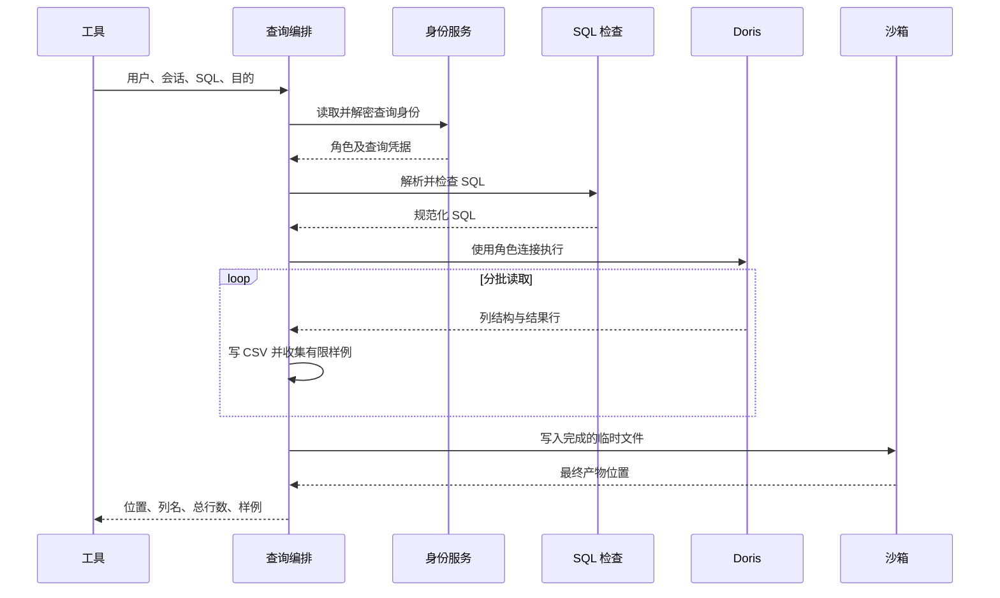

# 查询

## 1. 用例与调用边界

查询模块执行当前用户可访问的只读 SQL，生成完整 CSV，并把位置、列名、行数和少量样例返回给 Agent。业务口径由模型结合元数据判断，代码保证操作类型、身份使用和结果交付过程可控。

execute_sql 工具从运行上下文取得用户和会话标识，再调用 QueryExecutionHandler。工具参数中的 SQL 和查询目的属于模型输入；查询身份不能由模型任意指定。

## 2. 组件分工

| 组件                  | 责任                                     | 不负责的内容   |
| --------------------- | ---------------------------------------- | -------------- |
| QueryExecutionHandler | 组织身份、校验、连接和执行服务           | SQL 业务正确性 |
| QueryGuardService     | 单语句和只读语法检查                     | 数据库实际权限 |
| DorisQueryRepository  | 服务端游标及分批读取                     | CSV 和文件管理 |
| AnalysisQueryService  | 结果结构检查、序列化、临时文件、产物摘要 | 角色授权       |
| QueryExecutionOptions | 批大小与样例数量                         | 总行数限制     |
| AnalysisQueryResult   | 产物位置与摘要                           | 完整结果数据   |

服务接收已经明确的用户、会话和 SQL，不依赖 HTTP 请求对象。相同流程可以被 Agent 工具或其他受信任的业务入口复用，但新增入口仍需落实用户和会话归属。

## 3. 端到端执行顺序

身份读取使用短事务。Doris 查询期间只占用它自己的查询连接，CSV 写完后游标和连接已经退出，再执行沙箱交付。失败在对应阶段传播，不会把不完整临时 CSV 作为成功结果返回。

## 4. 解析与单语句约束

QueryGuardService 用 SQLGlot 的 Doris 方言解析 SQL。空输入被拒绝，解析异常转换为校验问题。分号和尾部注释可能产生空节点，过滤这些节点后必须恰好保留一条语句。

普通查询要求是包含 SELECT 的查询表达式，允许 WITH 等查询结构。SHOW 只允许 TABLES 类型。通过检查后使用 Doris 方言重新生成规范化 SQL，执行层使用规范化结果。

## 5. 只读限制

校验遍历语法树，拦截写入和 DDL，也检查嵌套查询中的危险节点，避免只检查最外层 SELECT。

禁止范围包括文件导出、锁、Hint、会话或普通变量、赋值、占位符、命令节点，以及不符合查询要求的子查询结构。对匿名函数另外拒绝 sleep、benchmark、load_file、sys_exec 和锁函数等副作用调用。

这些规则限制查询操作，不推导表字段类型，不验证 JOIN 是否造成重复，也不自动证明聚合口径正确。SQL 即使通过 Guard，也可能因字段不存在、函数不兼容或权限不足在 Doris 失败。

Guard 是应用检查，Doris 查询账号是权限执行边界。新增允许语法时应同时检查 AST 结构和实际账号权限，而不是通过文本前缀判断只读。

## 6. Doris 流式读取

DorisQueryRepository 使用连接的 stream 能力和结果分区读取。QueryBatch 同时包含 column_names 和 rows，使执行服务能够逐批处理。

默认 batch_size 为 100，它只控制每批读取量。查询不会自动附加总行数 LIMIT；需要限制数据量时由 SQL 明确表达。

没有数据行时仍返回一个带列名的空批次，使上层可以生成只有表头的 CSV。只有完全没有有效结果元数据才属于结果结构错误。

SQL 交给 SQLAlchemy text 前处理冒号，避免文本字面值中的冒号被误识别为绑定参数。此处执行的是已检查完成的 SQL，不向模型开放数据库绑定上下文。

## 7. 结果结构校验

首次批次确定最终列顺序，并检查大小写不敏感的列名唯一性。重复列名会让样例字典覆盖数据，也会让 CSV 消费方无法可靠按名称引用，因此直接拒绝。

后续批次必须具有相同列定义。读取每行时按列名和列值严格配对，结构不一致不能通过补空值掩盖。

模型编写多表查询时，应为重复名称设置不同别名。这个约束是交付格式要求，不代表数据库本身不能返回重名列。

## 8. CSV 和样例的序列化

| 值类型             | 完整 CSV 表示            | 样例表示                  |
| ------------------ | ------------------------ | ------------------------- |
| None               | 空单元格                 | null                      |
| 布尔值             | true 或 false            | 布尔值                    |
| 整数、浮点数       | 文本数值                 | 原数值                    |
| 日期、时间         | ISO 文本                 | 文本                      |
| Decimal            | 字符串，保留十进制精度   | 文本                      |
| 二进制             | Base64                   | 文本                      |
| 列表、字典等嵌套值 | JSON 文本                | 限长文本                  |
| 字符串             | 完整文本，必要时公式转义 | 最多 512 字符后附截断标记 |

CSV 使用 UTF-8 和统一换行，由 csv.writer 处理分隔符和引号。完整文件中的字符串不会因为样例长度限制而截断。

字符串忽略前导空白和控制字符后，若首个有效字符是公式触发字符，会加前导单引号，避免电子表格打开时把源数据执行为公式。下游按原始字符串分析时需理解这一输出规则。

## 9. 文件交付和内存

查询目的经过 Unicode 规范化，生成适合文件名的文本，再附加唯一标识。沙箱负责校验目标并返回最终产物位置，查询服务不自行决定底层容器位置。

完整结果持续写入本地临时文件；内存只保留一批数据和固定数量样例。默认 sample_rows 为 5，可设置为 0，模型约束最多 100。

流式读取降低内存需求，但不等于对磁盘占用或查询成本设了总上限。数据量很大时仍会占用临时存储，并在交付沙箱时受单文件和用户容量检查约束。

## 10. 返回模型

AnalysisQueryResult 包含 path、columns、row_count 和 sample。path 代表沙箱交付完成的位置，row_count 为实际读取的完整行数，sample 仅为理解结构而保留。

模型使用完整文件继续分析，不能将样例统计当成完整数据统计。返回结果不单独持久化为查询记录；长期保留内容主要是会话消息中的工具结果和沙箱文件。

## 11. 错误与取消

| 情况                    | 行为                               |
| ----------------------- | ---------------------------------- |
| SQL 校验失败            | 在连接执行之前拒绝                 |
| 权限不足或 SQL 运行失败 | Doris 错误向上报告                 |
| 超时                    | 识别并转换为查询超时错误           |
| 用户停止导致取消        | 使当前连接失效并传播取消           |
| 列结构异常              | 停止构建结果，关闭流与临时文件     |
| 沙箱写入失败            | 不返回成功摘要，临时文件退出后关闭 |

查询流在 finally 中关闭游标，执行服务通过 aclosing 管理生成器。取消时使连接失效，避免将正在执行或协议状态不确定的连接交回池中复用。

Doris 执行和沙箱写入没有共同事务。只读查询不会回滚源数据，失败恢复通常是重新执行查询。工具层将错误转换成可读说明，底层异常细节保留在日志中。
