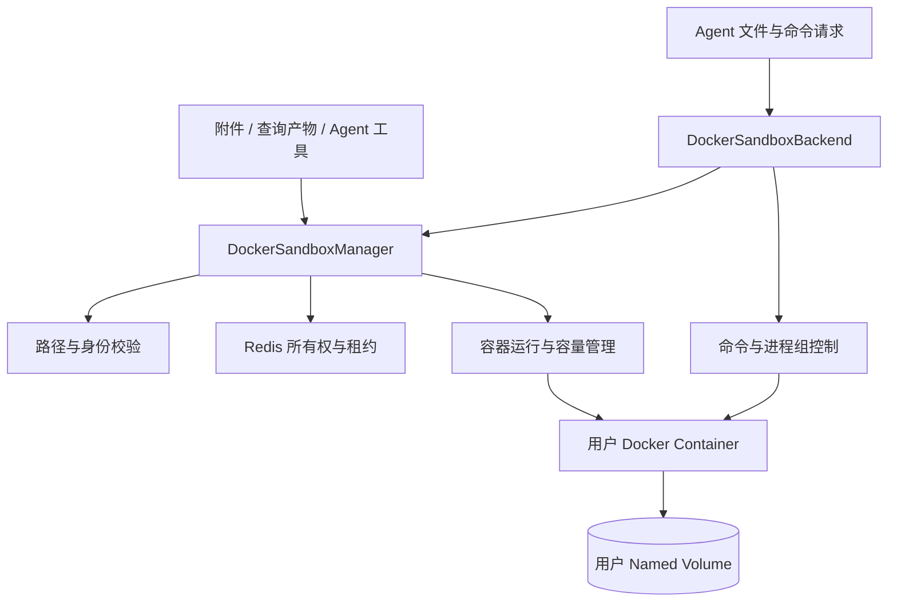

# 04. Sandbox：隔离工作区与执行资源管理

Sandbox 管理用户容器、持久数据卷、Conversation 和 Session 目录、文件访问、命令执行及资源回收。模块通过操作系统权限、容器限制和跨进程租约协调，向上层提供统一的文件与执行能力。

## 1. 模块结构与职责



| 组件 | 职责 |
| --- | --- |
| Manager | 用户资源创建、附件/产物访问、Session 和 Conversation 清理 |
| Backend | 为一个工作区提供文件读取、写入、编辑及命令协议 |
| Paths | 相对/绝对路径归一、公开附件范围和 Session 路径派生 |
| Archive 与容器内脚本 | 上传/下载、目录校验、原子提交与受控清理 |
| Ownership | 操作租约、维护门、容量锁、用户变更锁与删除标记 |
| Runtime Pool | 活跃运行时的协调与退出处理 |
| Shell Runner | 启动进程组、收集输出、等待与取消 |

上层 ShellJobRuntime 管理模型可见的 job ID、状态消费及委派结束时收尾；本模块负责底层命令和容器资源。文件保存在卷中，不随一次工具调用结束删除。

## 2. 工作区层级与资源归属

```text
用户专属容器
└── /data/                       用户专属 Named Volume
    └── {conversation_id}/       一段对话
        ├── uploads/             用户上传的资料
        └── sessions/
            └── {analysis_id}/
                ├── explorer/{session_id}/
                ├── analyst/{session_id}/
                └── reviewer/{session_id}/
```

一个平台用户拥有一套容器和卷；一个 Conversation 有自己的根目录；一个专业 Session 有稳定的工作目录。目录由服务端的 Session 标识派生，不由模型自由选择归属用户。

同一 Conversation 的 Agent 可以读取被文件权限允许的上游结果，但只能修改自己的专业工作区。例如 Analyst 可以读取 Explorer 的 CSV，再把报告写入 Analyst 自己的目录，不必复制一份大 CSV 塞进模型消息。

Planner 使用 Conversation 级后端。其提示词要求只查看文件和组织工作、不直接计算或修改数据；这项分工约定与 Specialist 的 UID 写入隔离应分别理解。

## 3. UID、GID 与文件权限

容器的 UID 注册表保存稳定的会话及 Session 身份。Conversation 分配组身份，专业 Session 使用独立 UID。同会话共享读取与各 Session 独立写入，通过 UID/GID 和权限位共同表达。

专业 Session 的普通文件通常为 `0640`、目录为 `0750`、umask 为 `0027`；Conversation 根工作区使用更严格的权限。技能目录以只读方式挂到 `/skills/...`，供 Agent 使用预置分析能力。

因此，文件工具限制路径和 Linux 文件权限是两道不同的检查。Shell 能解析绝对路径，并不意味着它就能读取其他用户数据；同样，仅仅检查路径前缀也不能替代真实文件权限。

## 4. 路径规则与访问边界

| 入口                      | 主要规则                                                                           |
| ------------------------- | ---------------------------------------------------------------------------------- |
| 用户附件路径              | 会话内相对路径，拒绝绝对路径、`~`、反斜杠、控制字符和越级组件                      |
| Shell、文件读取、图片读取 | 按容器 POSIX 路径解析，相对路径以当前工作目录为基准                                |
| Specialist 写入和编辑     | 解析后仍须位于当前 Session 的可写工作区                                            |
| 对外附件引用              | 归属当前 Conversation，位于允许公开的 `uploads` 或 `sessions` 区域，并通过下载检查 |

通用路径校验保留单组件 255 字节和总路径 4096 字节等边界。

读操作没有把所有路径都限制成 `/data` 前缀；实际能读取什么，还受容器文件权限和只读挂载控制。写入规则则更严格。

## 5. 文件暂存与原子提交

检查路径之后、真正写入之前，目录仍可能变化。例如某个路径组件被替换成符号链接，就可能把写入引向意外位置。

Agent 后端的文件写入先上传到系统暂存区，再由受控脚本逐层打开目标目录，拒绝跟随符号链接，检查所有权，最后通过重命名提交。普通模型无法直接把暂存区当成自己的工作目录。

管理器通过 Docker Archive API 上传附件和查询产物时，也会校验目标目录、所有权、大小与写入结果。两条路径的实现不同，不能把文件上传笼统理解成“拼一个路径然后直接写”。

## 6. 文件能力与短命令执行

`DockerSandboxBackend` 为 Agent 提供读取、写入、编辑及命令能力。读取二进制时按协议转换，编辑使用容器内脚本完成局部替换，避免来回搬运大文件。单文件 API 按 `max_file_bytes` 检查大小，默认 50 MiB。

同步 `execute` 主要用于内部检查或有明确时限的短命令。命令以工作区身份运行，超时受内部上限约束，默认 60 秒，输出流在退出时关闭。普通命令还会设置文件大小限制。

Agent 的 `shell` 则走 Shell Job 机制，适合可能持续运行的计算。它没有把前台等待时间当成整个命令的总时限，详见下一节。

文件上传、下载和下载资格检查使用 Archive API，可以操作停止状态的容器；首次上传还可以创建一台保持停止状态的容器。Agent 文件后端和命令执行需要运行中的容器。删除 Session 或 Conversation 需要容器内清理命令，可能先启动容器，或根据尚存的卷重建容器。

## 7. Shell 作业与进程组生命周期

一次 `shell` 调用启动独立进程组，前台最多等待 60 秒：

- 已结束：直接返回输出字符串。输出被截断时附上保留的日志路径。
- 尚未结束：返回 `running`、`job_id`、运行时间和 `output_path`，模型用后续工具继续管理。

`list_shell_jobs` 列出当前运行时未消费的作业，`get_shell_job` 可立即查询或最多等待 60 秒，`cancel_shell_job` 请求取消。作业处于运行或取消中时可重复查询，终态第一次被读取后消费记录，再查会返回不存在。

状态响应不反复携带全部输出。命令输出保留有界的内联内容，超出时截取首尾；日志路径用于查看更多内容，日志自身也有控制。Shell Job 不能逐个预检命令创建的其他文件，不能把输出限制等同于整个磁盘配额。

取消操作针对进程组，先发 SIGTERM，再在等待后用 SIGKILL 清理仍存活的子进程。前台等待被取消时，命令可能先转为后台，由所属运行时继续负责收尾。Specialist 委派结束、运行时淘汰或应用关闭时，会清理尚存作业。

这些作业索引属于进程内 Shell Runtime，不是持久任务调度表。进程重启后不能承诺继续用旧 job ID 管理所有命令；异常输出流或缺失终态会被识别为中断。

## 8. 跨进程所有权与操作租约

API 和 Celery Worker 可能同时访问一个用户的容器。DockerSandboxManager 用 Redis 记录操作租约、维护状态、容量互斥和删除标记。

| 机制               | 要解决的问题                                     |
| ------------------ | ------------------------------------------------ |
| 操作租约           | 声明当前仍在读写或执行，心跳续期，进程消失后过期 |
| 用户/会话维护门    | 删除或维护前阻止新操作，等待已有操作退出         |
| 容量锁和用户变更锁 | 串行化容量判断、容器创建、目录与注册表修改       |
| 删除标记           | 拒绝迟到请求重建已经删除的资源                   |

加锁顺序由所有权组件统一维护。例如用户删除先进入维护，再取容量和用户变更锁；容量回收不会一边长时间拿着全局容量锁，一边等待一个活跃用户结束操作。

默认锁租期 60 秒、等待上限 60 秒、普通操作租约 30 秒，持续操作会续期。这些是协调时限，不是 SQL 或模型调用的业务超时。

## 9. 容器限制与存储配额

当前默认容器断网、根文件系统只读、去掉全部 capabilities，并启用禁止新增权限。`/tmp` 使用独立 tmpfs，业务文件保存在 `/data` 卷中。

| 配置             | 当前默认值      |
| ---------------- | --------------- |
| 内存             | 2 GiB           |
| CPU              | 2 个 CPU 的配额 |
| 进程数           | 256             |
| 单文件 API 大小  | 50 MiB          |
| 用户存储目标上限 | 1 GiB           |
| 同时运行容器数   | 8               |
| 空闲停止         | 600 秒          |
| 空闲删除容器     | 3600 秒，保留卷 |
| 清理检查         | 每 60 秒        |

用户存储配置不等于所有驱动都提供硬配额。默认 `local` 卷驱动没有用户总容量硬限制；需要硬限制时，必须采用并正确配置支持配额的存储驱动。容器断网也不影响服务端去调用语言模型或 MCP，因为这些请求不是由断网容器发出。

## 10. 容量回收、重建与删除

容器带有部署、用户和规格标签。需要执行时才启动，达到运行上限时尝试停止最久未使用且没有活跃操作的容器。镜像、挂载或运行规格改变时，在安全维护窗口重建容器并继续挂载原卷。

卷驱动或存储策略不匹配不会被悄悄迁移。管理器会拒绝不安全复用，要求部署方处理存储或恢复配置。

空闲回收删除容器但保留卷；删除 Conversation 清理这段会话的目录和注册表；用户注销删除容器与卷。用户删除标记保留，以拒绝迟到请求，而不是把所有 Redis 键无差别清空。

多个进程共享沙箱时，每个进程退出先释放自己的运行时租约；只有满足最后一个运行时退出等条件，并启用相应配置，才会停止本部署管理的容器。关闭一个 Worker 的客户端连接不应直接删除用户文件。

## 11. 运行状态与异常定位

上传成功但执行失败，先区分容器“存在”和“正在运行”；图表生成后无法下载，检查是否位于正确 Conversation、路径是否已被覆盖或清理、文件是否通过大小及所有权检查。容量错误不一定表示总用户数超限，可能只是同时运行的容器达到了上限。

## 12. 资源操作的持久化边界

| 操作 | 容器 | 用户卷与文件 | 协调状态 |
| --- | --- | --- | --- |
| 普通文件读取 | Archive 读取可使用停止的容器，命令读取需运行环境 | 不应因只读检查创建缺失工作区 | 操作期间登记租约 |
| 首次上传 | 可以创建但保持停止 | 创建所属用户和会话文件空间 | 受用户变更与路径检查保护 |
| 执行命令 | 按容量控制启动 | 沿用当前工作区 | 活跃操作阻止不安全回收 |
| 空闲停止/移除容器 | 停止或删除 | 保留 | 更新运行与活动状态 |
| 规格变化重建 | 安全维护窗口内重建 | 继续挂载原卷 | 拒绝不兼容的存储策略复用 |
| 删除 Session/Conversation | 必要时启动或重建以执行清理 | 只删除目标范围 | 清理目录身份，阻止迟到操作 |
| 删除用户 | 删除 | 删除整个卷 | 保留用户删除标记 |

Redis 租约、Docker 实际状态和文件系统是不同状态来源。进程退出、租约超时和命令退出分别处理；不能仅凭本地缓存判断容器容量，也不能把丢失的 job ID 当成所有子进程已可靠结束。
