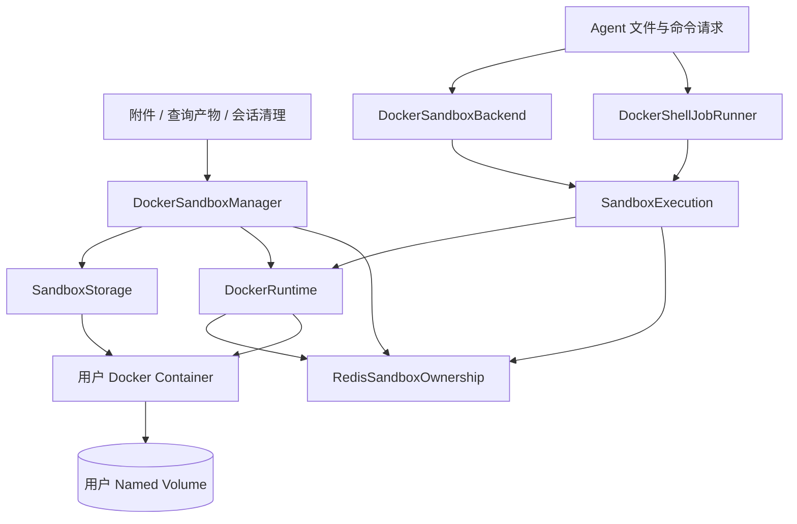

# 04. Sandbox：隔离工作区与执行资源管理

Sandbox 管理用户容器、持久数据卷、Conversation 和 Session 目录、文件访问、命令执行及资源回收。模块通过操作系统权限、容器限制和跨进程租约协调，向上层提供统一的文件与执行能力。

## 1. 提供哪些功能

| 功能 | 提供的能力 | 使用方 |
| --- | --- | --- |
| 工作区管理 | 用户容器和卷、Conversation 目录、独立 Session 工作区 | Assistant、Query |
| 附件与产物 | 上传、下载、删除用户附件，写入查询产物，解析可下载文件引用 | 聊天接口、Query、消息投影 |
| Agent 文件能力 | 读取、写入、编辑、图片及文件下载所需的后端协议 | Agent 文件工具 |
| 命令执行 | 短命令执行、Shell 进程组运行与取消、输出收集 | Agent、内部维护操作 |
| 隔离与配额 | UID/GID、可写范围、容器限制、运行容量控制 | 全部沙箱操作 |
| 资源清理 | 删除 Session、会话和用户资源，空闲容器回收 | Assistant、Workflows |

## 2. 如何使用

### 2.1 取得管理器并调用

业务模块从 `app.sandbox` 导入管理器、后端、Shell Runner 和路径操作，从 `app.sandbox.contracts` 导入只读挂载、Session 路径模型及 Shell 执行类型，从 `app.sandbox.errors` 导入异常。实现按职责直接放在 `app/sandbox/`：`manager.py`、`runtime.py`、`backend.py`、`execution.py`、`shell_runner.py`、`storage.py`、`ownership.py` 和 `paths.py`。调用方使用包的公开出口；Runtime、Execution、Storage 和 Redis 协调器属于模块内部实现。管理器按 `SandboxConfig` 默认创建 Redis 协调器，测试可显式注入替身；只读挂载通过 `readonly_mounts` 传入。

| 入口 | 参数与返回值 | 生命周期与边界 |
| --- | --- | --- |
| `init` | 可指定 `start_cleanup` | 初始化 Docker 与协调资源，按需启动清理任务 |
| `get_backend` | 用户、会话及可选的 `scope=SandboxSessionScope(...)`；返回工作区后端 | 未提供 scope 时准备 Conversation 工作区，提供时准备独立 UID 的 Session 工作区 |
| `write_artifact` | 用户、会话、Session 范围、文件名或 Session 内路径和二进制文件对象；返回绝对路径 | 目录拼接与归属校验由 Sandbox 完成，调用方不能写入其他 Session 或 uploads |
| `resolve_artifacts` | 用户、会话、引用集合及可选 Session 范围；返回输入引用到 `SandboxArtifact` 的映射 | 相对引用以会话或指定 Session 目录为基准，绝对引用也须位于同一范围内；批量检查普通文件、大小及属主，无效项省略，基础设施异常继续抛出 |
| `upload_user_attachment` / `download_file` / `delete_user_attachment` | 会话身份和附件路径 | 用户上传与删除限制在 uploads，下载继续校验归属 |
| `delete_session` / `delete_conversation` / `delete_user_sandbox` | 对应层级的身份标识，`delete_session` 接收 `SandboxSessionScope` | 保留维护锁、删除标记和 UID 注册清理 |
| `close` / `disconnect` | 无返回数据 | 均回收客户端及租约；`close` 按配置和最后运行时状态收尾容器，`disconnect` 保留运行容器供其他进程使用 |

应用生命周期负责创建、初始化和释放管理器，业务服务接收已创建的实例。获取 Backend 会准备工作区，执行时由共享的 `SandboxExecution` 获取容器并登记操作租约；Shell Runner 使用相同的执行上下文。

```python
from app.sandbox import DockerSandboxManager
from app.sandbox.contracts import SandboxSessionScope

sandbox = DockerSandboxManager(config, readonly_mounts=mounts)
await sandbox.init()
try:
    backend = await sandbox.get_backend(
        user_id,
        conversation_id,
        scope=SandboxSessionScope(analysis_id, agent_type, session_id),
    )
    result = await backend.aexecute("ls")
finally:
    await sandbox.close()
```

`SandboxArtifact` 同时提供容器绝对路径 `path` 和下载相对路径 `relative_path`，供上层直接使用。消息投影通过 `resolve_artifacts` 校验最终回答和委派结果中的文件引用，实时与历史展示共用此入口。每批相同规范路径只检查一次，校验过程仅访问已有容器和工作区；下载时重新执行归属检查。Shell Runner 的启动通知、工作目录及取消结果供上层后台任务消费。

## 3. 关键业务规则

### 3.1 工作区归属

```text
用户专属容器
└── /data/                       用户专属 Named Volume
    └── {conversation_id}/       一段对话
        ├── uploads/             用户上传的资料
        └── sessions/
            └── {analysis_id}/
                ├── explorer/{session_id}/
                ├── analyst/{session_id}/
                └── reviewer/{session_id}/
```

一个平台用户拥有一套容器和卷；一个 Conversation 有自己的根目录；一个专业 Session 有稳定的工作目录。目录由服务端的 Session 标识派生，不由模型自由选择归属用户。

同一 Conversation 的 Agent 可以读取被文件权限允许的上游结果，但只能修改自己的专业工作区。例如 Analyst 可以读取 Explorer 的 CSV，再把报告写入 Analyst 自己的目录，不必复制一份大 CSV 塞进模型消息。

Planner 使用 Conversation 级后端。其提示词要求只查看文件和组织工作、不直接计算或修改数据；这项分工约定与 Specialist 的 UID 写入隔离应分别理解。

### 3.2 路径访问范围

| 入口                      | 主要规则                                                                           |
| ------------------------- | ---------------------------------------------------------------------------------- |
| 用户附件路径              | 以会话目录解析相对或绝对路径；上传和删除限定在 `uploads`，对外返回会话相对引用 |
| Shell、文件读取、图片读取 | 按容器 POSIX 路径解析，相对路径以当前工作目录为基准                                |
| Specialist 写入和编辑     | 解析后仍须位于当前 Session 的可写工作区                                            |
| 对外附件引用              | 归属当前 Conversation，位于允许公开的 `uploads` 或 `sessions` 区域，并通过下载检查 |

所有文件入口共用“确定基准目录 → 解析成绝对路径 → 检查访问范围”的流程。`..` 在规范化后仍须满足当前操作的目录范围；通用校验拒绝 `~`、反斜杠和控制字符，并保留单组件 255 字节和总路径 4096 字节等边界。相对路径拼接工作目录后也会检查总长度。

读操作没有把所有路径都限制成 `/data` 前缀；实际能读取什么，还受容器文件权限和只读挂载控制。写入规则则更严格。

### 3.3 Shell 作业的使用语义

一次 `shell` 调用启动独立进程组，前台最多等待 60 秒：

- 已结束：直接返回输出字符串。输出被截断时附上保留的日志路径。
- 尚未结束：返回 `running`、`job_id`、运行时间和 `output_path`，模型用后续工具继续管理。

`list_shell_jobs` 列出当前运行时未消费的作业，`get_shell_job` 可立即查询或最多等待 60 秒，`cancel_shell_job` 请求取消。作业处于运行或取消中时可重复查询，终态第一次被读取后消费记录，再查会返回不存在。

状态响应不反复携带全部输出。命令输出保留有界的内联内容，超出时截取首尾；日志路径用于查看更多内容，日志自身也有控制。Shell Job 不能逐个预检命令创建的其他文件，不能把输出限制等同于整个磁盘配额。

取消操作针对进程组，先发 SIGTERM，再在等待后用 SIGKILL 清理仍存活的子进程。前台等待被取消时，命令可能先转为后台，由所属运行时继续负责收尾。Specialist 委派结束、运行时淘汰或应用关闭时，会清理尚存作业。

这些作业索引属于进程内 Shell Runtime，不是持久任务调度表。进程重启后不能承诺继续用旧 job ID 管理所有命令；异常输出流或缺失终态会被识别为中断。

### 3.4 资源限制与配额

当前默认容器断网、根文件系统只读、去掉全部 capabilities，并启用禁止新增权限。`/tmp` 使用独立 tmpfs，业务文件保存在 `/data` 卷中。

| 配置             | 当前默认值      |
| ---------------- | --------------- |
| 内存             | 2 GiB           |
| CPU              | 2 个 CPU 的配额 |
| 进程数           | 256             |
| 单文件 API 大小  | 50 MiB          |
| 用户存储目标上限 | 1 GiB           |
| 同时运行容器数   | 8               |
| 空闲停止         | 600 秒          |
| 空闲删除容器     | 3600 秒，保留卷 |
| 清理检查         | 每 60 秒        |

用户存储配置不等于所有驱动都提供硬配额。默认 `local` 卷驱动没有用户总容量硬限制；需要硬限制时，必须采用并正确配置支持配额的存储驱动。容器断网也不影响服务端去调用语言模型或 MCP，因为这些请求不是由断网容器发出。

### 3.5 删除与文件保留

| 操作 | 容器 | 用户卷与文件 | 协调状态 |
| --- | --- | --- | --- |
| 普通文件读取 | Archive 读取可使用停止的容器，命令读取需运行环境 | 不应因只读检查创建缺失工作区 | 操作期间登记租约 |
| 首次上传 | 可以创建但保持停止 | 创建所属用户和会话文件空间 | 受用户变更与路径检查保护 |
| 执行命令 | 按容量控制启动 | 沿用当前工作区 | 活跃操作阻止不安全回收 |
| 空闲停止/移除容器 | 停止或删除 | 保留 | 更新运行与活动状态 |
| 规格变化重建 | 安全维护窗口内重建 | 继续挂载原卷 | 拒绝不兼容的存储策略复用 |
| 删除 Session/Conversation | 必要时启动或重建以执行清理 | 只删除目标范围 | 清理目录身份，阻止迟到操作 |
| 删除用户 | 删除 | 删除整个卷 | 保留用户删除标记 |

Redis 租约、Docker 实际状态和文件系统是不同状态来源。进程退出、租约超时和命令退出分别处理；不能仅凭本地缓存判断容器容量，也不能把丢失的 job ID 当成所有子进程已可靠结束。

## 4. 内部实现

### 4.1 目录与组件


```mermaid
flowchart TD
    CALLER[附件 / 查询产物 / 会话清理] --> MANAGER[DockerSandboxManager]
    MANAGER --> STORAGE[SandboxStorage]
    MANAGER --> RUNTIME[DockerRuntime]
    MANAGER --> OWN[RedisSandboxOwnership]
    AGENT[Agent 文件与命令请求] --> BACKEND[DockerSandboxBackend]
    AGENT --> SHELL[DockerShellJobRunner]
    BACKEND --> EXEC[SandboxExecution]
    SHELL --> EXEC
    EXEC --> RUNTIME
    EXEC --> OWN
    RUNTIME --> OWN
    RUNTIME --> DOCKER[用户 Docker Container]
    STORAGE --> DOCKER
    DOCKER --> VOLUME[(用户 Named Volume)]
```

| 组件 | 职责 |
| --- | --- |
| Manager | 用户资源创建、附件/产物访问、Session 和 Conversation 清理 |
| Backend | 为一个工作区提供文件读取、写入、编辑及命令协议 |
| Paths | 相对/绝对路径归一、公开附件范围和 Session 路径派生 |
| Storage 与容器内脚本 | 工作区和 UID 注册、上传/下载、目录校验、原子提交与受控清理 |
| Ownership | 操作租约、维护门、容量锁、用户变更锁与删除标记 |
| Runtime | Docker 客户端、容器和数据卷、运行容量与空闲回收 |
| Execution | 工作区执行身份、操作租约、容器访问和异步取消传播 |
| Shell Runner | 启动进程组、收集输出、等待与取消 |

上层 ShellJobRuntime 管理模型可见的 job ID、状态消费及委派结束时收尾；本模块负责底层命令和容器资源。文件保存在卷中，不随一次工具调用结束删除。

### 4.2 执行身份与文件权限

容器的 UID 注册表保存稳定的会话及 Session 身份。Conversation 分配组身份，专业 Session 使用独立 UID。同会话共享读取与各 Session 独立写入，通过 UID/GID 和权限位共同表达。

专业 Session 的普通文件通常为 `0640`、目录为 `0750`、umask 为 `0027`；Conversation 根工作区使用更严格的权限。技能目录以只读方式挂到 `/skills/...`，供 Agent 使用预置分析能力。

因此，文件工具限制路径和 Linux 文件权限是两道不同的检查。Shell 能解析绝对路径，并不意味着它就能读取其他用户数据；同样，仅仅检查路径前缀也不能替代真实文件权限。

### 4.3 安全写入与提交

检查路径之后、真正写入之前，目录仍可能变化。例如某个路径组件被替换成符号链接，就可能把写入引向意外位置。

Agent 后端的文件写入先上传到系统暂存区，再由受控脚本逐层打开目标目录，拒绝跟随符号链接，检查所有权，最后通过重命名提交。普通模型无法直接把暂存区当成自己的工作目录。

管理器通过 Docker Archive API 上传附件和查询产物时，也会校验目标目录、所有权、大小与写入结果。两条路径的实现不同，不能把文件上传笼统理解成“拼一个路径然后直接写”。

### 4.4 文件和短命令执行

`DockerSandboxBackend` 为 Agent 提供读取、写入、编辑及命令能力。读取二进制时按协议转换，编辑使用容器内脚本完成局部替换，避免来回搬运大文件。单文件 API 按 `max_file_bytes` 检查大小，默认 50 MiB。

同步 `execute` 主要用于内部检查或有明确时限的短命令。命令以工作区身份运行，超时受内部上限约束，默认 60 秒，输出流在退出时关闭。普通命令还会设置文件大小限制。

Agent 的 `shell` 使用 Shell Job 机制：前台等待 60 秒后，仍在运行的命令转为后台作业，通过 `get_shell_job` 查询结果或 `cancel_shell_job` 取消。

文件上传、下载和下载资格检查使用 Archive API，可以操作停止状态的容器；首次上传还可以创建一台保持停止状态的容器。Agent 文件后端和命令执行需要运行中的容器。删除 Session 或 Conversation 需要容器内清理命令，可能先启动容器，或根据尚存的卷重建容器。

文件执行与 Shell Job 共用流清理：关闭流时仅忽略 `ENOTCONN`，在 `finally` 中释放底层 HTTP 响应，其他异常继续传播。手工构造的归档文件和目录设置当前修改时间；读取前检查成员大小，截断归档仍报告读取错误。

### 4.5 跨进程操作协调

API 和 Celery Worker 可能同时访问一个用户的容器。DockerSandboxManager 用 Redis 记录操作租约、维护状态、容量互斥和删除标记。

| 机制               | 要解决的问题                                     |
| ------------------ | ------------------------------------------------ |
| 操作租约           | 声明当前仍在读写或执行，心跳续期，进程消失后过期 |
| 用户/会话维护门    | 删除或维护前阻止新操作，等待已有操作退出         |
| 容量锁和用户变更锁 | 串行化容量判断、容器创建、目录与注册表修改       |
| 删除标记           | 拒绝迟到请求重建已经删除的资源                   |

加锁顺序由所有权组件统一维护。例如用户删除先进入维护，再取容量和用户变更锁；容量回收不会一边长时间拿着全局容量锁，一边等待一个活跃用户结束操作。

默认锁租期 60 秒、等待上限 60 秒、普通操作租约 30 秒，持续操作会续期。这些是协调时限，不是 SQL 或模型调用的业务超时。

### 4.6 容器回收和重建

容器带有部署、用户和规格标签。需要执行时才启动，达到运行上限时尝试停止最久未使用且没有活跃操作的容器。镜像、挂载或运行规格改变时，在安全维护窗口重建容器并继续挂载原卷。

卷驱动或存储策略不匹配不会被悄悄迁移。管理器会拒绝不安全复用，要求部署方处理存储或恢复配置。

空闲回收删除容器但保留卷；删除 Conversation 清理这段会话的目录和注册表；用户注销删除容器与卷。用户删除标记保留，以拒绝迟到请求，而不是把所有 Redis 键无差别清空。

多个进程共享沙箱时，每个进程退出先释放自己的运行时租约；只有满足最后一个运行时退出等条件，并启用相应配置，才会停止本部署管理的容器。关闭一个 Worker 的客户端连接不应直接删除用户文件。

## 5. 异常与排障

| 现象 | 优先检查 |
| --- | --- |
| 上传成功但执行失败 | Docker 可用性、容器是否运行、镜像与执行身份 |
| 文件生成后无法下载 | Conversation 归属、公开路径范围、文件存在性、大小和属主 |
| 专家无法修改文件 | 文件是否属于当前 Session；跨 Session 共享的是读取能力 |
| 容量不足 | 同时运行容器数、活跃租约、可回收空闲容器 |
| 回收或删除等待 | Redis 操作租约、维护锁、命令是否仍在执行 |
| 数据卷策略不匹配 | 卷驱动和驱动选项；恢复配置或处理现有存储后重试 |
| Shell job_id 不存在 | 是否已消费终态、委派是否结束、进程是否重启 |

先区分 Docker 容器、数据卷、文件和 Redis 租约各自状态，再处理故障。容器被空闲移除时文件仍保留在用户卷中；删除用户则清理整个卷。
