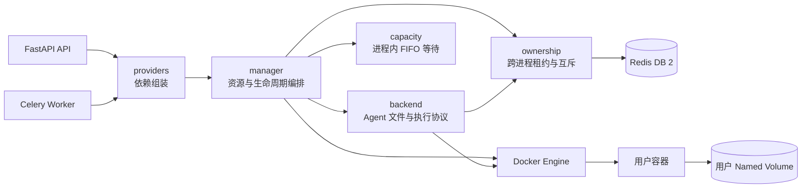

# 模块五：Docker 多租户沙箱运行环境

## 1. 模块定位

Docker 沙箱为专业 Agent 提供隔离的代码执行和持久化文件工作区。运行时采用一用户一容器、一用户一 Named Volume、会话与 Agent Session 独立 Linux UID 的资源模型。API 与 Celery Worker 可以共享同一组沙箱资源，跨进程所有权由 Redis 协调。



## 2. 职责拆分

| 文件 | 职责 |
| :--- | :--- |
| [`manager.py`](../app/sandbox/manager.py) | Docker 容器与数据卷生命周期、工作区准备、附件归档传输、空闲回收和关闭收尾 |
| [`backend.py`](../app/sandbox/backend.py) | 实现 DeepAgents 沙箱协议，负责会话内文件操作、命令执行、输出截断和工作区容量校验 |
| [`ownership.py`](../app/sandbox/ownership.py) | Redis 跨进程运行实例租约、操作租约、维护闸门、容量锁和用户变更锁 |
| [`capacity.py`](../app/sandbox/capacity.py) | 单进程有界 FIFO 等待、超时、取消和本地容量快照 |
| [`concurrency.py`](../app/sandbox/concurrency.py) | 单进程生命周期快速守卫，避免同一进程内删除与操作交叉 |
| [`paths.py`](../app/sandbox/paths.py) | 会话、Agent Session 与附件路径的规范化和边界校验 |
| [`scripts.py`](../app/sandbox/scripts.py) | 沙箱内受控文件提交和大文件编辑脚本 |
| [`sandbox/providers.py`](../app/sandbox/providers.py) | 根据显式配置创建所有权协调器和沙箱管理器 |
| [`app/providers.py`](../app/providers.py) | 组装 API 进程共享的 Agent、沙箱、会话生命周期和用户注销服务 |

业务层通过构造函数或 FastAPI Depends 接收 `DockerSandboxManager`。`AgentManager`、聊天服务、附件路由和 Celery 任务均不读取沙箱全局单例。应用入口中的 `providers.py` 是统一组装位置。

### 2.1 镜像构建与运行边界

`docker compose up -d` 会在沙箱镜像缺失时自动构建 `dataagent-sandbox:latest`，已有镜像时直接复用。`sandbox-image` 服务配置为零副本，因此 Compose 只维护构建规则，不创建固定沙箱容器。Dockerfile 或沙箱依赖变化后执行 `docker compose -f docker/compose.yml build sandbox-image` 主动更新镜像，再重启使用沙箱的进程。

FastAPI 和 Celery Worker 初始化沙箱管理器时只连接 Docker、读取 `sandbox.image` 并计算容器规格摘要，不执行镜像构建。镜像缺失时应用启动会提示先执行 `docker compose -f docker/compose.yml up -d`。镜像名称、构建上下文、构建网络和下载源定义在 `docker/compose.yml` 的 `sandbox-image` 服务中，构建参数可以通过 `SANDBOX_*` 环境变量覆盖。

## 3. 资源与权限模型

### 3.1 用户容器和持久卷

- 容器名称：`dataagent-{deployment_namespace}-sandbox-user-{user_id}`
- 数据卷名称：`dataagent-{deployment_namespace}-sandbox-user-{user_id}-data`
- 容器可以停止或重建，Named Volume 持续保存会话文件和分析产物
- 容器只挂载当前用户的数据卷，用户之间没有共享文件系统

### 3.2 会话与 Agent Session 隔离

- `/workspace/conversations` 属于 `root:root`，权限为 `0711`
- 会话目录使用稳定的独立 UID/GID，权限为 `0750`
- 会话内 `.home`、`.cache` 和 `.tmp` 权限为 `0700`
- 每个 Agent Session 再分配独立 UID，Session 目录权限为 `0750`，GID 继承会话 GID
- UID 注册表保存在 `/workspace/.dataagent-uids.json`，用户级变更锁保证多个进程不会重复分配 UID

会话目录使用 `0750`，使同一会话内不同 Agent Session 可以按组权限读取允许共享的分析产物。Session UID 和路径校验继续限制跨 Session 写入。

## 4. 跨进程所有权

同一 `deployment_namespace` 的所有 API 和 Celery 进程必须连接相同的 `sandbox.ownership.redis_url`。

### 4.1 运行实例租约

每个沙箱管理器初始化时注册一个带过期时间的运行实例租约，并由后台线程续期。关闭时先注销租约，只有最后一个运行实例会执行“停止运行中容器”的收尾配置。新进程注册与最后实例收尾使用同一把 Redis 锁，避免进程交接期间误停容器。异常退出后，租约会在 `lease_seconds` 后自动失效。

### 4.2 操作租约与维护闸门

- 每次 Backend 操作注册用户级和会话级租约，并持续续期
- 会话删除等待目标会话全部操作结束，并阻止新操作进入
- 用户删除、附件归档、工作区准备、空闲回收和容器收尾等待该用户全部操作结束
- 维护闸门的加锁顺序统一为用户、会话、用户变更，避免交叉死锁
- 进程内 `LifecycleGuard` 保留为低开销快速守卫，Redis 租约负责进程之间的正确性
- 用户或会话删除时写入持久删除墓碑，其他进程中已缓存的 Backend 在维护锁释放后仍会拒绝操作，避免重新创建已删除资源

### 4.3 全局运行容量

`capacity.py` 维护当前进程的有界 FIFO 等待队列。真正启动、停止或回收容器时，管理器持有 Redis 容量锁，并重新读取 Docker 的实际运行容器数量。因此 `max_running_containers` 对同一部署命名空间全局生效，各进程的等待顺序在进程内保持 FIFO。

## 5. 生命周期和活动水位

- 需要执行命令时按需启动容器，纯附件归档读写可以操作停止状态的容器
- 达到 `idle_stop_seconds` 后停止空闲容器并保留数据卷
- 达到 `idle_remove_seconds` 后删除空闲容器并保留数据卷
- 最近活动时间同时写入 Redis 和数据卷中的 `.dataagent-activity.json`
- 回收和收尾先取得用户维护租约，再取得容量锁，避免停止其他进程正在使用的容器
- 用户注销删除容器、数据卷和 Redis 活动水位

## 6. 容量与执行限制

- `application` 配额模式在上传、写入和执行前后检查工作区占用量
- `volume_driver` 模式把容量参数交给支持硬配额的 Docker Volume Driver
- 容器根文件系统只读，默认无网络，移除 capabilities，并启用 `no-new-privileges`
- 随应用发布的 Agent 技能按 `/skills/{agent_type}` 只读挂载，技能脚本可以直接执行，输出仍受 Session 工作区权限约束
- 内存、CPU、进程数、执行时间、文件大小、工作区大小和输出大小均由 `sandbox` 配置限制

## 7. 关键配置

```yaml
sandbox:
  deployment_namespace: local
  ownership:
    redis_url: redis://127.0.0.1:6379/2
    lock_timeout_seconds: 60
    wait_timeout_seconds: 300
    lease_seconds: 30
```

| 配置 | 含义 |
| :--- | :--- |
| `deployment_namespace` | Docker 资源名称与 Redis Key 的部署隔离命名空间 |
| `redis_url` | 所有沙箱进程共享的 Redis 数据库 |
| `lock_timeout_seconds` | Redis 互斥锁租期，持有期间自动续期 |
| `wait_timeout_seconds` | 等待互斥锁或活跃操作结束的最长时间 |
| `lease_seconds` | 运行实例和沙箱操作租约的有效期，持有期间自动续期 |

## 8. 附件接口

| 接口 | 方法 | 描述 |
| :--- | :--- | :--- |
| `/api/v1/chat/attachment/upload` | `POST` | 上传用户附件并返回规范化路径 |
| `/api/v1/chat/attachment/get` | `GET` | 校验路径和文件属主后下载文件 |
| `/api/v1/chat/attachment/delete` | `POST` | 删除用户可变附件，禁止修改系统分析产物目录 |
