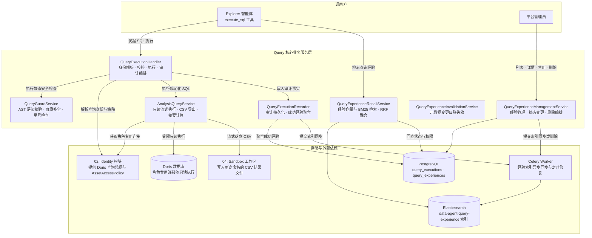

# 05. Query：实现安全查询链路

## 功能说明

Query 负责安全地执行 Explorer 生成的 SQL。它先检查 SQL 语法和用户权限，再使用该用户对应的 Doris 查询账号执行只读查询。结果会写成沙箱中的 CSV，执行过程会留下审计记录。成功的 SQL 还会保存为查询经验，供以后复用。

---

## 1. 模块总体架构与分层设计

### 1.1 架构定位与核心职责

Query 位于大模型和 Doris 之间，所有模型生成的业务 SQL 都要经过它。主要职责包括：

1. **在执行前检查 SQL（SQL Guard）**：用 `sqlglot` 解析 SQL，拒绝修改数据或结构的语句、危险函数、无权限字段和不安全的星号查询，并检查 JOIN 是否有合理的关联条件。
2. **分批读取结果并写入 CSV**：使用用户角色自己的连接池，设置查询超时和内存上限。结果按批读取并写入 CSV，同时转义可能被 Excel 或 Numbers 当成公式的内容。
3. **记录每次执行**：保存原始 SQL、整理后的 SQL、校验问题、执行状态和结果摘要。审计记录写入失败时只记日志，不会改变查询结果。
4. **保存可复用的查询经验**：成功查询按 SQL 结构去重。表或字段变化时停用相关经验，同一结构在新版本数据上再次成功后可以恢复。
5. **搜索查询经验**：把经验用途写入 Elasticsearch，通过全文和向量两种方式搜索。返回前还会检查数据库状态和当前用户权限。

### 1.2 系统数据流与架构关系



### 1.3 主要组件职责

| 领域 | 核心类 / 函数 | 职责描述 |
| :--- | :--- | :--- |
| 校验结果 | `QueryTableRef`, `QueryColumnRef`, `QueryValidationIssue`, `QueryValidationResult` | 记录 SQL 用到了哪些表和字段，以及检查是否通过 |
| 执行模型 | `QueryExecutionLimits`, `QueryExecutionOptions`, `QueryBatch`, `AnalysisQueryResult`, `QueryExecution` | 资源限制、流式批次、结果摘要与执行审计实体 |
| 经验模型 | `QueryExperience`, `QueryExperienceAsset`, `QueryExperienceOverview` | 经验聚合实体、资产版本快照与管理视图 |
| Doris 执行 | `DorisQueryRepository` | 使用角色专用连接执行受限只读查询并流式返回批次 |
| PostgreSQL 存储 | `QueryExecutionPGRepo`, `QueryExperiencePGRepo` | 保存审计事实，管理经验聚合、状态和待修复索引版本 |
| Elasticsearch 存储 | `QueryExperienceESRepo` | 写入经验索引并执行文本、向量检索 |
| SQL 安全 | `QueryGuardService` | 检查只读语法、目录访问、资产权限、实际使用的字段和 JOIN 条件 |
| 执行流程 | `QueryExecutionHandler`, `DefaultQueryExecutionRuntime`, `AnalysisQueryService` | 依次处理用户身份、SQL 检查、执行、导出和结果记录 |
| 审计与经验更新 | `QueryExecutionRecorder` | 保存执行记录，并根据成功查询更新查询经验 |
| 经验服务 | `QueryExperienceManagementService`, `QueryExperienceInvalidationService`, `QueryExperienceIndexer`, `QueryExperienceRecallService` | 管理、失效、索引与召回经验 |
| 管理接口 | `router`, `QueryExperienceBatchRequest`, `QueryExperienceListResponse` | 提供列表、详情、来源执行、禁用和删除接口 |
| 后台任务 | `sync_index_task`, `repair_indexes_task`, `CeleryQueryExperienceIndexScheduler` | 同步单条经验索引并补偿版本落后的索引 |
| 领域错误 | `QueryExperienceNotFoundError`, `QueryExperienceStateConflictError` | 表达经验不存在和状态冲突 |

---

## 2. SQL Guard 语法与权限安全校验

`QueryGuardService` 在 SQL 发给 Doris 之前运行。它用 `sqlglot` 把 SQL 解析成语法树（AST），再逐项检查语句类型、表、字段、权限和 JOIN。

### 2.1 语法约束与单语句拦截

- 业务查询只接受包含 `SELECT` 的单条 `Query`，拒绝空字符串、解析错误和多语句输入；
- 目录查询单独允许 `SHOW TABLES`，以及限定到当前数据库的单表 `information_schema.tables`、`information_schema.columns` 查询；
- `_FORBIDDEN_NODE_KEYS` 拦截 DDL、DML、事务、会话设置、管理命令和占位符等节点；
- 匿名函数采用白名单策略。系统拒绝已知副作用函数，也拒绝白名单之外的匿名函数；`sqlglot` 能识别的具名函数按 AST 类型继续参与只读校验。

### 2.2 找出 SQL 实际使用的表和字段

- 从元数据存储读取表和字段，再按当前用户的 `AssetAccessPolicy` 去掉无权访问的内容；
- 调用 `sqlglot.optimizer.qualify` 展开 CTE、子查询、表别名和字段引用，找出 SQL 最终读取的物理表和字段；
- 拒绝重复或无法确定的输出字段。Doris 返回结果后，还会检查列名不能为空、不能重复，并且每一批结果的列结构必须一致。

### 2.3 星号展开与部分列授权保护

- 若用户只能读取某张表的部分字段，Guard 会把该表标记为 `restricted_star_tables`；
- 查询对受限表使用未限定或限定星号时会被拒绝。调用方需要显式列出已授权字段；
- qualify 后仍会逐项检查表和字段资产权限，保证显式字段也处于当前授权范围内。

### 2.4 JOIN 必须写清楚怎样关联

系统拒绝 `CROSS JOIN`。普通 `JOIN` 必须带有 `ON` 或 `USING`，而且条件必须同时引用左右两边的数据源，避免遗漏关联条件后产生笛卡尔积。

### 2.5 用统一格式返回检查结果

检查通过后返回格式统一的 `normalized_sql`。检查失败时，每个问题会写入 `QueryValidationIssue`，结果中的 `valid` 为 `False`。执行入口随后抛出 `QueryRejectedError`，并尝试保存一条被拒绝的执行记录。

---

## 3. 只读执行，并把结果分批写入 CSV

`AnalysisQueryService` 只执行 Guard 已经检查通过的 `normalized_sql`。

### 3.1 角色专用连接池与会话保护

- 必须通过 Identity 模块解析的 `ResolvedQueryPrincipal`，从 `DorisQueryClientRegistry` 获取该业务角色专用的连接池；
- 用户查询只能使用角色专用连接，不能使用 Doris 管理员连接，这样 Doris 权限和 Row Policy 才会生效；
- 在执行查询前，连接设置查询资源相关的会话变量：
  - `exec_mem_limit`：当前配置为 1,073,741,824 字节，也就是 1 GiB；
  - `query_timeout`：当前配置为 300 秒；
  - `workload_group`：指定 Doris 资源隔离工作负载组。

`query_timeout` 是写入 Doris 连接的会话参数，约束 Doris 执行这条 SQL 的时间。当前没有包住身份解析、SQL Guard、等待连接、分批读取和 CSV 写入全过程的统一计时器。上层任务被取消时，流式执行会捕获 `CancelledError`，丢弃当前 Doris 连接，随后继续抛出取消异常，避免把状态不明的连接放回连接池。

应用启动时还会逐个预检受管查询账号：`SHOW GRANTS` 中只允许 `SELECT_PRIV`、`USAGE_PRIV`、`SHOW_VIEW_PRIV` 和 `READ_ONLY`，必须具备 `SELECT_PRIV` 或 `READ_ONLY`，并且只能绑定预期的一个角色；同时检查目标数据库可见且 Workload Group 可以设置。预检失败会记录 WARNING 并继续启动，方便管理员修复配置；实际查询仍会因为身份或 Doris 权限问题失败。

### 3.2 分批读取，避免一次占满内存

- 结果读取采用流式游标迭代器（`AsyncGenerator[QueryBatch]`），当前每批读取 100 行；
- 内存中不一次性装载全量查询结果集，避免超大结果集撑爆 API 进程内存。

### 3.3 写入沙箱 CSV，并防止公式注入

- 全量查询结果先流式写入临时文件，再写入 `/data/{conversation_id}/sessions/{analysis_id}/{agent_type}/{session_id}/`。文件名由查询目的规范化得到，最多保留 120 个 UTF-8 字节，并追加 4 位随机十六进制后缀；
- **公式注入防御**：系统跳过字符串开头的空白字符和 Unicode 控制字符，首个有效字符属于 `= + - @` 时，在原字符串前添加单引号；
- `datetime`、`date`、`Decimal` 与二进制字段均按照规范进行稳定格式化编码。

当前没有限制查询最多返回多少行，也没有在写临时 CSV 时限制总字节数，Guard 也不强制 SQL 包含 `LIMIT`。系统会先把完整结果写入宿主机临时文件，完成后才检查 `max_file_bytes`。因此超大结果可能先占用大量临时磁盘，最后又因为文件过大而上传失败。

### 3.4 只在内存中保留少量结果摘要

- 在写入 CSV 的同时，流式统计字段类型与可空性（`QueryResultColumn`）、时间字段的最早与最晚区间（`QueryTimeRange`）、总行数 `row_count`；
- 仅在内存中保留配置数量的样例行，`QueryExecutionOptions.sample_rows` 默认值为 5，可配置为 0 至 100；字符串、集合和嵌套深度也有固定摘要上限。

---

## 4. 保存查询执行记录

### 4.1 调用方不能修改查询所属用户和目录

Agent 发起查询时使用运行时已经绑定的 `AgentSessionKey`。工具参数中不提供 `user_id`、`conversation_id` 或输出目录，因此调用方无法把结果写到其他用户或会话下。

### 4.2 哪些情况会保存执行记录

成功找到用户的 Doris 查询身份后，SQL 被拒绝、执行失败或执行成功都会尝试保存记录。如果查询身份本身就解析失败，当前不会保存执行记录。记录包括用户、角色、授权版本、会话、查询目的、原始 SQL、整理后的 SQL、状态、错误和结果摘要。当前没有单独的执行耗时字段。

### 4.3 保存记录失败不会改写查询结果

`QueryExecutionHandler` 会等待 `QueryExecutionRecorder` 的异步数据库操作完成。`_record_success_safely` 与 `_record_failure_safely` 捕获记录异常并输出日志，因此记录故障不会改变已得到的查询结果，也不会覆盖 Guard 或 Doris 的原始错误。

---

## 5. 查询经验怎样创建、停用和恢复

### 5.1 按 SQL 结构合并重复经验

- 仅执行成功的业务查询会被聚合为 `QueryExperience`；
- 数据库用 `role_name + SQL 结构指纹` 判断两次查询是否属于同一经验。计算指纹前会把 SQL 中的具体数值和字符串替换成占位符，因此只要查询结构相同就可以合并；
- 同一角色、同一结构再次成功时复用经验记录，将本次执行的 `experience_id` 指向该经验，并更新模板、授权版本和用途列表。用途去重后最多保留最近 5 条；
- 授权版本发生变化时，经验仍使用原聚合记录，同时用本次用途替换旧用途列表并写入新的 `authorization_epoch`。

### 5.2 三种经验状态

- `active`：经验处于可用状态，可被后续分析召回；
- `disabled`：经验已失效，不可被召回。原因包括管理员手动禁用（`admin`）或元数据变更（`metadata_changed`）；
- `deleting`：经验正在删除；索引清理完成后再删除数据库记录。

### 5.3 表或字段变化后停用旧经验

- 经验关联保存其引用的全部物理表与字段，并记录生成时的 `meta_version`；
- 当底层表或字段的 `meta_version` 发生变化时，系统自动将相关经验置为 `disabled(reason='metadata_changed')`；
- 若相同结构的 SQL 在新的元数据版本下再次真实成功执行，系统自动将其状态恢复为 `active`；管理员主动禁用的经验不自动恢复。
- **版本号**：经验内容或状态变化时，`revision` 增加。`indexed_revision` 表示 Elasticsearch 已经同步到哪个版本。更新时会检查版本，避免旧任务覆盖新状态。

---

## 6. 搜索并检查查询经验

### 6.1 合并全文搜索和向量搜索结果

- 经验的自然语言用途描述（`purposes`）通过嵌入模型向量化并同步至 Elasticsearch；
- 召回阶段在 Elasticsearch 层面强制前置过滤当前角色 `role_name` 与当前授权版本 `authorization_epoch`；
- 同时发起 BM25 全文检索与 Dense Vector 向量检索；服务层使用 `1 / (60 + rank)` 对可用通道的排名做 RRF 融合。任一通道可用时仍返回结果，并以 `partial` 标记单通道降级；两个通道都失败时返回 `failed`。
- 全文和向量通道各取最多 100 个候选。向量通道当前只接受相似度不低于 0.65 的结果，全文通道没有额外最低分；融合后再按调用方请求的数量截取，Explorer 当前最多取 3 条。

### 6.2 返回前再次检查状态、版本和权限

Elasticsearch 返回候选经验后，系统会到 PostgreSQL 确认经验仍为 `active`，表和字段版本没有变化，并用当前用户的 `AssetAccessPolicy` 再检查一次权限。已经停用、过期或越权的结果会被丢弃。

---

## 7. Celery 后台同步和修复索引

- **`dataagent.query.sync_index`**：接收单个经验 ID 与 revision，生成用途向量并同步 Elasticsearch；任务失败时最多自动重试 3 次；
- **`dataagent.query.repair_indexes`**：扫描最多 500 条 `indexed_revision < revision` 的经验，并逐条提交同步任务：
  ```sql
  SELECT id FROM query_experiences WHERE indexed_revision < revision;
  ```
  检测到未同步项后自动重新派发同步任务，补齐缺失索引。

---

## 8. REST API 接口规范与路由定义

管理端接口全部受 `AdminUserDep` 保护：

| 方法 | 路径 | 参数 / 请求体 | 说明 |
| :--- | :--- | :--- | :--- |
| `GET` | `/api/v1/admin/query-experiences` | `limit`, `offset`, `role_name`, `status`, `query` | 分页筛选经验列表 |
| `POST` | `/api/v1/admin/query-experiences/batch-disable` | `experience_ids`，1 至 100 个 UUID | 批量禁用经验，成功返回 204 |
| `POST` | `/api/v1/admin/query-experiences/batch-delete` | `experience_ids`，1 至 100 个 UUID | 批量提交删除请求，成功返回 204 |
| `GET` | `/api/v1/admin/query-experiences/{experience_id}` | 路径参数 | 读取经验详情和资产快照 |
| `GET` | `/api/v1/admin/query-experiences/{experience_id}/executions` | `limit`, `offset` | 分页读取来源执行记录 |
| `POST` | `/api/v1/admin/query-experiences/{experience_id}/disable` | 路径参数 | 禁用单条经验并返回详情 |
| `DELETE` | `/api/v1/admin/query-experiences/{experience_id}` | 路径参数 | 提交单条删除请求，返回 202 |

---

## 9. 关键实现代码摘录

以下代码选取当前实现中的关键类、函数和完整方法，保留源码里的名称、签名、处理流程和异常处理。没有展示的辅助定义和启动接线由正文说明。

### 1. SQL 校验模型与结果定义

```python
"""查询引用与 SQL 校验模型。"""

from typing import Literal
from pydantic import BaseModel, ConfigDict, Field, model_validator

type QueryKind = Literal["business", "catalog"]


class QueryTableRef(BaseModel):
    """查询引用的数据表。"""

    model_config = ConfigDict(frozen=True, extra="forbid")

    database: str | None = None
    name: str

    @property
    def qualified_name(self) -> str:
        """返回包含数据库名的表标识。"""
        return f"{self.database}.{self.name}" if self.database else self.name


class QueryColumnRef(BaseModel):
    """查询引用的物理字段。"""

    model_config = ConfigDict(frozen=True, extra="forbid")

    database: str | None = None
    table: str
    name: str

    @property
    def qualified_name(self) -> str:
        """返回包含数据库名和表名的字段标识。"""
        prefix = f"{self.database}." if self.database else ""
        return f"{prefix}{self.table}.{self.name}"


class QueryValidationIssue(BaseModel):
    """一项确定性的 SQL 校验问题。"""

    model_config = ConfigDict(frozen=True, extra="forbid")

    code: str
    message: str
    table: str | None = None
    column: str | None = None


class QueryValidationResult(BaseModel):
    """SQL 安全检查结果。"""

    model_config = ConfigDict(frozen=True, extra="forbid")

    valid: bool
    normalized_sql: str | None
    query_kind: QueryKind = "business"
    tables: list[QueryTableRef] = Field(default_factory=list)
    columns: list[QueryColumnRef] = Field(default_factory=list)
    output_columns: list[str] = Field(default_factory=list)
    issues: list[QueryValidationIssue] = Field(default_factory=list)

    @model_validator(mode="after")
    def validate_status(self) -> "QueryValidationResult":
        """保证校验状态和问题列表一致。"""
        if self.valid == bool(self.issues):
            raise ValueError("valid 必须与 issues 是否为空保持相反状态")
        if self.valid and self.normalized_sql is None:
            raise ValueError("有效查询必须包含 normalized_sql")
        return self
```

### 2. 查询执行产物与审计持久化模型

```python
"""查询执行配置、结果与持久化模型。"""

from dataclasses import dataclass
from datetime import datetime
from typing import Any
from uuid import UUID, uuid4

from pydantic import BaseModel, ConfigDict, Field
from sqlalchemy import CheckConstraint, DateTime, ForeignKey, Index, Integer, JSON, String, Text, func
from sqlalchemy.orm import Mapped, mapped_column

from app.shared.database.base import MetaBase


class QueryResultColumn(BaseModel):
    """查询结果字段信息。"""

    model_config = ConfigDict(frozen=True, extra="forbid")

    name: str
    type: str
    nullable: bool


class QueryTimeRange(BaseModel):
    """时间字段在结果集中的取值范围。"""

    model_config = ConfigDict(frozen=True, extra="forbid")

    start: str
    end: str


class AnalysisQueryResult(BaseModel):
    """写入会话沙箱后的查询结果摘要。"""

    model_config = ConfigDict(frozen=True, extra="forbid")

    path: str
    columns: list[QueryResultColumn]
    row_count: int
    time_range: dict[str, QueryTimeRange]
    sample: list[dict[str, Any]]


class QueryExecution(MetaBase):
    """一次 SQL 尝试。"""

    __tablename__ = "query_executions"

    id: Mapped[UUID] = mapped_column(primary_key=True, default=uuid4)
    experience_id: Mapped[UUID | None] = mapped_column(
        ForeignKey("query_experiences.id", ondelete="SET NULL"),
        index=True,
    )
    user_id: Mapped[int] = mapped_column(Integer, nullable=False, index=True)
    role_name: Mapped[str] = mapped_column(String(256), nullable=False, index=True)
    authorization_epoch: Mapped[UUID] = mapped_column(nullable=False, default=uuid4)
    conversation_id: Mapped[UUID] = mapped_column(nullable=False, index=True)
    analysis_id: Mapped[str] = mapped_column(String(64), nullable=False)
    session_id: Mapped[str] = mapped_column(String(64), nullable=False)
    tool_call_id: Mapped[str | None] = mapped_column(String(256))
    purpose: Mapped[str] = mapped_column(Text, nullable=False)
    raw_sql: Mapped[str] = mapped_column(Text, nullable=False)
    normalized_sql: Mapped[str | None] = mapped_column(Text)
    sql_template: Mapped[str | None] = mapped_column(Text)
    fingerprint: Mapped[str | None] = mapped_column(String(64), index=True)
    status: Mapped[str] = mapped_column(String(16), nullable=False)
    error_code: Mapped[str | None] = mapped_column(String(128))
    error_detail: Mapped[str | None] = mapped_column(Text)
    validation: Mapped[dict[str, object] | None] = mapped_column(JSON)
    result_summary: Mapped[dict[str, object] | None] = mapped_column(JSON)
    created_at: Mapped[datetime] = mapped_column(
        DateTime(timezone=True),
        nullable=False,
        server_default=func.now(),
    )

    __table_args__ = (
        CheckConstraint(
            "status IN ('rejected', 'failed', 'succeeded')",
            name="ck_query_execution_status",
        ),
        Index(
            "ix_query_execution_session",
            "user_id",
            "conversation_id",
            "analysis_id",
            "session_id",
        ),
    )
```

### 3. SQL Guard 的主要检查流程

```python
class QueryGuardService:
    """解析 SQL 并校验只读、元数据、关联和资产权限。"""

    def __init__(
        self,
        catalog_repo: QueryCatalogRepository,
        *,
        data_source: str,
        current_database: str,
    ) -> None:
        """初始化查询安全服务。"""
        self._catalog_repo = catalog_repo
        self._data_source = data_source
        self._current_database = current_database

    async def check(
        self,
        sql: str,
        policy: AssetAccessPolicy | None = None,
    ) -> QueryValidationResult:
        """返回 SQL 的完整安全检查结果。"""
        expression, issues = self._parse_single_query(sql)
        if expression is None:
            return self._result(None, issues)

        if isinstance(expression, exp.Show):
            return self._check_show_tables(expression)
        if self._references_information_schema(expression):
            return self._check_information_schema_query(expression)

        # 只读语法检查必须先于目录加载，禁止的语句不能触发额外数据库访问。
        issues.extend(self._check_readonly(expression))
        if issues:
            return self._result(None, issues)

        catalog = await self._load_catalog(policy)
        raw_tables, star_tables, table_issues = self._resolve_tables(
            expression,
            catalog,
        )
        issues.extend(table_issues)
        issues.extend(self._check_restricted_stars(catalog, raw_tables, star_tables))
        if issues:
            return self._result(None, issues, tables=raw_tables)

        try:
            qualified = self._qualify(expression, catalog)
        except OptimizeError as exc:
            issue = self._optimization_issue(expression, catalog, exc)
            return self._result(None, [issue], tables=raw_tables)

        columns = self._collect_physical_columns(qualified, catalog)
        issues.extend(self._check_joins(qualified))
        output_columns = list(qualified.named_selects)
        duplicate_outputs = self._duplicates(output_columns)
        if duplicate_outputs:
            issues.append(
                QueryValidationIssue(
                    code="duplicate_output_column",
                    message=("查询输出列名不能重复: " + ", ".join(duplicate_outputs)),
                )
            )

        if policy is not None:
            issues.extend(
                self._check_asset_policy(
                    policy,
                    raw_tables,
                    columns,
                    star_tables,
                )
            )

        normalized_sql = qualified.sql(dialect="doris", pretty=False)
        return self._result(
            normalized_sql if not issues else None,
            issues,
            tables=raw_tables,
            columns=columns,
            output_columns=output_columns,
        )
```

### 4. 执行只读查询并导出沙箱 CSV

```python
class AnalysisQueryService:
    """流式执行已通过 Guard 的查询并写入当前会话沙箱。"""

    def __init__(
        self,
        query_repo: ReadonlyQueryRepository,
        artifact_store: QueryArtifactStore,
        limits: QueryExecutionLimits,
        options: QueryExecutionOptions,
    ) -> None:
        """初始化只读查询服务。"""
        self._query_repo = query_repo
        self._artifact_store = artifact_store
        self._limits = limits
        self._options = options

    async def execute(
        self,
        session_key: AgentSessionKey,
        sql: str,
        validation: QueryValidationResult,
        *,
        purpose: str,
    ) -> SuccessfulQueryExecution:
        """执行已校验查询，返回完整的成功执行信息。"""
        sql_fingerprint = hashlib.sha256(sql.encode("utf-8")).hexdigest()[:16]
        logger.info(
            "开始执行只读查询: "
            f"conversation_id={session_key.conversation_id}, "
            f"analysis_id={session_key.analysis_id}, "
            f"sql_fingerprint={sql_fingerprint}"
        )
        normalized_sql = validation.normalized_sql
        if not validation.valid or normalized_sql is None:
            raise QueryRejectedError(validation)

        scope = SandboxSessionScope(
            session_key.analysis_id,
            session_key.agent_type,
            session_key.session_id,
        )
        relative_path = (
            f"{scope.relative_workspace}/{_query_artifact_filename(purpose)}"
        )
        with tempfile.TemporaryFile(mode="w+b") as temporary_file:
            summary = await self._execute_to_csv(
                temporary_file,
                normalized_sql,
            )
            temporary_file.seek(0)
            await self._artifact_store.write_artifact(
                session_key.user_id,
                session_key.conversation_id,
                relative_path,
                temporary_file,
            )
        workspace = scope.workspace_path(session_key.conversation_id)
        result = AnalysisQueryResult(
            path=f"{workspace}/{relative_path.rsplit('/', 1)[-1]}",
            columns=summary.columns,
            row_count=summary.row_count,
            time_range=summary.time_range,
            sample=summary.sample,
        )
        details = SuccessfulQueryExecution(
            session_key=session_key,
            raw_sql=sql,
            normalized_sql=normalized_sql,
            validation=validation,
            result=result,
        )
        logger.info(
            "只读查询执行完成: "
            f"conversation_id={session_key.conversation_id}, "
            f"analysis_id={session_key.analysis_id}, "
            f"sql_fingerprint={sql_fingerprint}, "
            f"row_count={details.result.row_count}, "
            f"column_count={len(details.result.columns)}, "
            f"artifact_path={details.result.path}"
        )
        return details

    async def _execute_to_csv(
        self,
        temporary_file: BinaryIO,
        sql: str,
    ) -> "_QuerySummary":
        """流式执行查询并写入 CSV，同时保留字段统计与少量样例。"""
        writer = csv.writer(_Utf8Writer(temporary_file), lineterminator="\n")
        column_names: tuple[str, ...] | None = None
        column_stats: list[_ColumnStats] = []
        sample: list[dict[str, Any]] = []
        row_count = 0
        async with aclosing(
            self._query_repo.stream(sql, self._limits, self._options)
        ) as batches:
            async for batch in batches:
                if column_names is None:
                    column_names = batch.column_names
                    self._validate_column_names(column_names)
                    column_stats = [_ColumnStats() for _ in column_names]
                    writer.writerow(_csv_value(name) for name in column_names)
                elif batch.column_names != column_names:
                    # CSV 和返回 Schema 共用首批列定义，中途变形会使产物无法可靠解析。
                    raise QueryResultShapeError("流式查询各批次返回的列结构不一致")
                for row in batch.rows:
                    if len(row) != len(column_names):
                        raise QueryResultShapeError(
                            "查询结果行的列数与元数据声明不一致"
                        )
                    for stats, value in zip(column_stats, row, strict=True):
                        stats.observe(value)
                    writer.writerow(_csv_value(value) for value in row)
                    # 完整结果持续写入文件，内存只保留固定数量的可展示样例。
                    if len(sample) < self._options.sample_rows:
                        sample.append(
                            {
                                name: _summary_value(value)
                                for name, value in zip(column_names, row, strict=True)
                            }
                        )
                    row_count += 1
        if column_names is None:
            raise QueryResultShapeError("数据库未返回有效的结果元数据")
        temporary_file.flush()
        return _QuerySummary(
            columns=[
                QueryResultColumn(
                    name=name,
                    type=stats.inferred_type or "unknown",
                    nullable=stats.nullable or row_count == 0,
                )
                for name, stats in zip(column_names, column_stats, strict=True)
            ],
            row_count=row_count,
            time_range={
                name: QueryTimeRange(start=stats.time_start, end=stats.time_end)
                for name, stats in zip(column_names, column_stats, strict=True)
                if stats.time_start is not None and stats.time_end is not None
            },
            sample=sample,
        )


def _escape_csv_formula(value: str) -> str:
    """阻止电子表格把不可信字符串解释为公式。"""
    for character in value:
        if character.isspace() or unicodedata.category(character).startswith("C"):
            continue
        return f"'{value}" if character in "=+-@" else value
    return value
```

### 5. 查询入口和执行记录流程

```python
class QueryExecutionHandler:
    """解析查询身份、执行 SQL 并记录查询历史。"""

    def __init__(
        self,
        runtime: QueryExecutionRuntime,
    ) -> None:
        """绑定查询用例运行环境。"""
        self._runtime = runtime

    async def execute(
        self,
        session_key: AgentSessionKey,
        sql: str,
        *,
        purpose: str,
        tool_call_id: str | None,
    ) -> AnalysisQueryResult:
        """执行一次只读查询并记录成功或失败事实。"""
        context: QueryExecutionContext | None = None
        validation: QueryValidationResult | None = None
        try:
            principal, policy = await self._runtime.resolve_principal(
                session_key.user_id
            )
            context = QueryExecutionContext(
                session_key=session_key,
                role_name=principal.role_name,
                authorization_epoch=principal.authorization_epoch,
                purpose=purpose,
                tool_call_id=tool_call_id,
            )
            validation = await self._runtime.validate(sql, policy)
            if not validation.valid or validation.normalized_sql is None:
                raise QueryRejectedError(validation)
            service = await self._runtime.create_executor(principal)
            details = await service.execute(
                session_key,
                sql,
                validation,
                purpose=purpose,
            )
        except QueryRejectedError as exc:
            await self._record_failure_safely(
                context,
                raw_sql=sql,
                status="rejected",
                error_code="sql_validation_failed",
                error_detail=str(exc),
                validation=exc.result,
            )
            raise
        except QueryExecutionTimeoutError as exc:
            await self._record_failure_safely(
                context,
                raw_sql=sql,
                status="failed",
                error_code="query_timeout",
                error_detail=str(exc),
                validation=validation,
            )
            raise
        except QueryResultShapeError as exc:
            await self._record_failure_safely(
                context,
                raw_sql=sql,
                status="failed",
                error_code="query_result_invalid",
                error_detail=str(exc),
                validation=validation,
            )
            raise
        except Exception as exc:
            await self._record_failure_safely(
                context,
                raw_sql=sql,
                status="failed",
                error_code="readonly_query_failed",
                error_detail=str(exc).strip() or "异常未提供详情",
                validation=validation,
            )
            raise
        await self._record_success_safely(context, details)
        return details.result

    async def _record_success_safely(
        self,
        context: QueryExecutionContext,
        details: SuccessfulQueryExecution,
    ) -> None:
        """记录成功查询，持久化故障不改变查询结果。"""
        try:
            await self._runtime.record_success(context, details)
        except Exception:  # noqa: BLE001
            logger.exception("记录成功查询历史失败")

    async def _record_failure_safely(
        self,
        context: QueryExecutionContext | None,
        *,
        raw_sql: str,
        status: QueryExecutionStatus,
        error_code: str,
        error_detail: str,
        validation: QueryValidationResult | None = None,
    ) -> None:
        """记录失败查询，持久化故障不覆盖原始错误。"""
        if context is None:
            return
        try:
            await self._runtime.record_failure(
                context,
                raw_sql=raw_sql,
                status=status,
                error_code=error_code,
                error_detail=error_detail,
                validation=validation,
            )
        except Exception:  # noqa: BLE001
            logger.exception("记录失败查询历史失败")
```

### 6. 合并查询经验并处理版本变化

```python
QUERY_EXPERIENCE_PURPOSE_LIMIT = 5


class QueryExperience(MetaBase):
    """按角色和 SQL 结构聚合的共享查询经验。"""

    __tablename__ = "query_experiences"

    id: Mapped[UUID] = mapped_column(primary_key=True, default=uuid4)
    role_name: Mapped[str] = mapped_column(String(256), nullable=False, index=True)
    authorization_epoch: Mapped[UUID] = mapped_column(nullable=False, default=uuid4)
    fingerprint: Mapped[str] = mapped_column(String(64), nullable=False)
    purposes: Mapped[list[str]] = mapped_column(JSON, nullable=False)
    sql_template: Mapped[str] = mapped_column(Text, nullable=False)
    status: Mapped[str] = mapped_column(
        String(16),
        nullable=False,
        default="active",
        server_default="active",
    )
    disabled_reason: Mapped[str | None] = mapped_column(String(32))
    disabled_by_user_id: Mapped[int | None] = mapped_column(Integer)
    disabled_at: Mapped[datetime | None] = mapped_column(DateTime(timezone=True))
    deletion_requested_by_user_id: Mapped[int | None] = mapped_column(Integer)
    deletion_requested_at: Mapped[datetime | None] = mapped_column(
        DateTime(timezone=True)
    )
    revision: Mapped[int] = mapped_column(
        Integer,
        nullable=False,
        default=1,
        server_default="1",
    )
    indexed_revision: Mapped[int] = mapped_column(
        Integer,
        nullable=False,
        default=0,
        server_default="0",
    )
    created_at: Mapped[datetime] = mapped_column(
        DateTime(timezone=True),
        nullable=False,
        server_default=func.now(),
    )
    updated_at: Mapped[datetime] = mapped_column(
        DateTime(timezone=True),
        nullable=False,
        server_default=func.now(),
        onupdate=func.now(),
    )
    assets: Mapped[list["QueryExperienceAsset"]] = relationship(
        back_populates="experience",
        cascade="all, delete-orphan",
        lazy="selectin",
    )

    __table_args__ = (
        UniqueConstraint(
            "role_name",
            "fingerprint",
            name="uq_query_experience_role_fingerprint",
        ),
        CheckConstraint(
            "status IN ('active', 'disabled', 'deleting')",
            name="ck_query_experience_status",
        ),
        CheckConstraint(
            "(status = 'active' AND disabled_reason IS NULL "
            "AND disabled_by_user_id IS NULL AND disabled_at IS NULL "
            "AND deletion_requested_by_user_id IS NULL "
            "AND deletion_requested_at IS NULL) OR "
            "(status = 'disabled' AND disabled_reason IS NOT NULL "
            "AND disabled_at IS NOT NULL "
            "AND deletion_requested_by_user_id IS NULL "
            "AND deletion_requested_at IS NULL) OR "
            "(status = 'deleting' AND disabled_reason IS NULL "
            "AND disabled_by_user_id IS NULL AND disabled_at IS NULL "
            "AND deletion_requested_by_user_id IS NOT NULL "
            "AND deletion_requested_at IS NOT NULL)",
            name="ck_query_experience_status_fields",
        ),
        CheckConstraint(
            "disabled_reason IS NULL OR "
            "(disabled_reason = 'admin' AND disabled_by_user_id IS NOT NULL) OR "
            "(disabled_reason = 'metadata_changed' "
            "AND disabled_by_user_id IS NULL)",
            name="ck_query_experience_disabled_reason",
        ),
        CheckConstraint(
            "revision > 0 AND indexed_revision >= 0",
            name="ck_query_experience_revisions",
        ),
    )

    def refresh_from_success(
        self,
        *,
        purpose: str,
        authorization_epoch: UUID,
        sql_template: str,
    ) -> bool:
        """更新同一角色和 SQL 结构的共享经验。"""
        if self.status == "deleting":
            return False
        if self.authorization_epoch != authorization_epoch:
            self.authorization_epoch = authorization_epoch
            self.purposes = [purpose]
        else:
            self.purposes = [
                *[item for item in self.purposes if item != purpose],
                purpose,
            ][-QUERY_EXPERIENCE_PURPOSE_LIMIT:]
        self.sql_template = sql_template
        self.revision += 1
        if self.disabled_reason == "metadata_changed":
            self.status = "active"
            self.disabled_reason = None
            self.disabled_by_user_id = None
            self.disabled_at = None
        return True
```

### 7. 合并全文和向量搜索结果

```python
import asyncio
from dataclasses import dataclass
from uuid import UUID

from loguru import logger

from app.shared.config.app_config import cfg
from app.shared.contracts.query_experience import QueryExperienceRecallStatus
from app.shared.contracts.search import SearchHit

_SEARCH_POOL_SIZE = 100
_RRF_K = 60


@dataclass(frozen=True, slots=True)
class _SemanticRecall:
    """查询经验索引通道的内部融合结果。"""

    status: QueryExperienceRecallStatus
    ranks: dict[UUID, float]


class QueryExperienceRecallService:
    """检索经过当前权限和元数据版本复核的查询经验。"""

    async def _semantic_recall(
        self,
        query: str,
        *,
        role_name: str,
        authorization_epoch: UUID,
    ) -> _SemanticRecall:
        """分别召回全文和向量候选，并融合可用通道。"""
        text_task = asyncio.create_task(
            self._index_repo.search_text(
                query,
                role_name=role_name,
                authorization_epoch=authorization_epoch,
                limit=_SEARCH_POOL_SIZE,
            )
        )
        vector_task: asyncio.Task[list[SearchHit[UUID]]] | None = None
        try:
            embedding = (await self._embedding_client.aembed_documents([query]))[0]
            vector_task = asyncio.create_task(
                self._index_repo.search_vector(
                    embedding,
                    role_name=role_name,
                    authorization_epoch=authorization_epoch,
                    limit=_SEARCH_POOL_SIZE,
                    min_score=cfg.query.query_experience_vector_score_threshold,
                )
            )
        except asyncio.CancelledError:
            text_task.cancel()
            await asyncio.gather(text_task, return_exceptions=True)
            raise
        except Exception:  # noqa: BLE001
            logger.exception("查询经验向量生成失败")

        text_hits = await self._await_hits(text_task, "全文")
        vector_hits = (
            await self._await_hits(vector_task, "向量")
            if vector_task is not None
            else None
        )
        available_hits = [hits for hits in (text_hits, vector_hits) if hits is not None]
        if not available_hits:
            return _SemanticRecall(status="failed", ranks={})
        ranks: dict[UUID, float] = {}
        for hits in available_hits:
            for rank, hit in enumerate(hits, start=1):
                ranks[hit.item] = ranks.get(hit.item, 0) + 1 / (_RRF_K + rank)
        return _SemanticRecall(
            status="success" if len(available_hits) == 2 else "partial",
            ranks=ranks,
        )
```

### 8. 索引任务与管理接口

```python
@celery_app.task(
    bind=True,
    name="dataagent.query.sync_index",
    autoretry_for=(Exception,),
    retry_backoff=True,
    retry_jitter=True,
    max_retries=3,
)
def sync_index_task(
    self: object, experience_id: str, revision: int
) -> dict[str, object]:
    """同步一条查询经验索引并自动重试。"""
    del self
    logger.info(
        f"开始同步查询经验索引: experience_id={experience_id}, revision={revision}"
    )
    synced_revision = run_async(_sync_index(UUID(experience_id), revision))
    logger.info(
        "查询经验索引同步完成: "
        f"experience_id={experience_id}, revision={synced_revision}"
    )
    return {
        "experience_id": experience_id,
        "revision": synced_revision,
    }


@celery_app.task(name="dataagent.query.repair_indexes")
def repair_indexes_task() -> dict[str, int]:
    """提交一批待补偿的查询经验索引任务。"""
    return run_async(_repair_indexes())


@router.get("", response_model=schemas.QueryExperienceListResponse)
async def list_query_experiences(
    _: AdminUserDep,
    service: QueryExperienceManagementServiceDep,
    limit: Annotated[int, Query(ge=1, le=100)] = 20,
    offset: Annotated[int, Query(ge=0)] = 0,
    role_name: Annotated[str | None, Query(max_length=256)] = None,
    status: Annotated[
        Literal["active", "disabled", "deleting"] | None,
        Query(),
    ] = None,
    query: Annotated[str | None, Query(max_length=512)] = None,
) -> schemas.QueryExperienceListResponse:
    """分页列出查询经验。"""
    overviews, total = await service.list_overviews(
        limit=limit,
        offset=offset,
        role_name=role_name,
        status=status,
        query=query,
    )
    return schemas.QueryExperienceListResponse(
        items=[
            schemas.QueryExperienceOverviewResponse.from_overview(overview)
            for overview in overviews
        ],
        total=total,
        limit=limit,
        offset=offset,
        has_more=offset + len(overviews) < total,
    )


@router.post("/batch-disable", status_code=http_status.HTTP_204_NO_CONTENT)
async def disable_query_experiences(
    body: schemas.QueryExperienceBatchRequest,
    current_admin: AdminUserDep,
    service: QueryExperienceManagementServiceDep,
) -> None:
    """管理员批量禁用查询经验。"""
    await service.disable_experiences(
        body.experience_ids,
        operator_id=current_admin.id,
    )


@router.post("/batch-delete", status_code=http_status.HTTP_204_NO_CONTENT)
async def delete_query_experiences(
    body: schemas.QueryExperienceBatchRequest,
    current_admin: AdminUserDep,
    service: QueryExperienceManagementServiceDep,
) -> None:
    """管理员批量提交查询经验删除请求。"""
    await service.request_deletions(
        body.experience_ids,
        operator_id=current_admin.id,
    )


@router.get(
    "/{experience_id}",
    response_model=schemas.QueryExperienceDetailResponse,
)
async def get_query_experience(
    experience_id: UUID,
    _: AdminUserDep,
    service: QueryExperienceManagementServiceDep,
) -> schemas.QueryExperienceDetailResponse:
    """读取查询经验详情。"""
    return schemas.QueryExperienceDetailResponse.from_overview(
        await service.get_overview(experience_id)
    )


@router.get(
    "/{experience_id}/executions",
    response_model=schemas.QueryExperienceSourceExecutionListResponse,
)
async def list_query_experience_source_executions(
    experience_id: UUID,
    _: AdminUserDep,
    service: QueryExperienceManagementServiceDep,
    limit: Annotated[int, Query(ge=1, le=100)] = 20,
    offset: Annotated[int, Query(ge=0)] = 0,
) -> schemas.QueryExperienceSourceExecutionListResponse:
    """分页列出查询经验的来源执行记录。"""
    executions, total = await service.list_source_executions(
        experience_id,
        limit=limit,
        offset=offset,
    )
    return schemas.QueryExperienceSourceExecutionListResponse(
        items=[
            schemas.QueryExperienceSourceExecutionResponse.from_entity(execution)
            for execution in executions
        ],
        total=total,
        limit=limit,
        offset=offset,
        has_more=offset + len(executions) < total,
    )


@router.post(
    "/{experience_id}/disable",
    response_model=schemas.QueryExperienceDetailResponse,
)
async def disable_query_experience(
    experience_id: UUID,
    current_admin: AdminUserDep,
    service: QueryExperienceManagementServiceDep,
) -> schemas.QueryExperienceDetailResponse:
    """管理员禁用查询经验。"""
    return schemas.QueryExperienceDetailResponse.from_overview(
        await service.disable_experience(experience_id, operator_id=current_admin.id)
    )


@router.delete(
    "/{experience_id}",
    response_model=schemas.QueryExperienceDeletionResponse,
    status_code=http_status.HTTP_202_ACCEPTED,
)
async def delete_query_experience(
    experience_id: UUID,
    current_admin: AdminUserDep,
    service: QueryExperienceManagementServiceDep,
) -> schemas.QueryExperienceDeletionResponse:
    """管理员提交查询经验删除请求。"""
    deletion = await service.request_deletion(
        experience_id,
        operator_id=current_admin.id,
    )
    return schemas.QueryExperienceDeletionResponse.from_deletion_result(deletion)
```

### 9. Doris 会话级查询限制

每次取得连接后、执行 SQL 前，都会把当前角色的 Workload Group 和两项资源限制写入 Doris 会话：

```python
    @staticmethod
    async def _apply_session_limits(
        connection: AsyncConnection,
        limits: QueryExecutionLimits,
    ) -> None:
        """设置当前连接的 Doris 查询资源限制。"""
        await connection.execute(
            text(f"SET workload_group = '{limits.workload_group}'")
        )
        await connection.execute(text(f"SET query_timeout = {limits.timeout_seconds}"))
        await connection.execute(
            text(f"SET exec_mem_limit = {limits.memory_limit_bytes}")
        )
```
