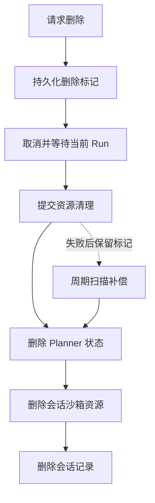

# 多智能体

## 1. 模块职责

多智能体模块把会话请求转化为可运行的 Agent 图，管理执行、停止、恢复和删除，并将 LangChain 消息转换为前端可展示的数据。

模块的核心边界是：会话服务决定是否可以开始或删除；AgentManager 决定图由哪些模型、工具和中间件组成；ConversationRunService 管理后台任务和事件订阅；消息投影负责展示协议。

## 2. 主要组件

| 组件                         | 责任                                        |
| ---------------------------- | ------------------------------------------- |
| ConversationTurnService      | 提交新回合、准备会话状态和检查恢复条件      |
| ConversationLifecycleService | 删除标记、执行停止、资源清理及补偿          |
| ConversationRunService       | Run 注册、执行、事件缓存、订阅和取消        |
| AgentManager                 | 模型资源管理、图装配、Checkpoint 读取与删除 |
| ConversationTasks            | 标题任务、删除任务和周期清理                |
| ConversationTitleService     | 调用模型生成并更新标题                      |
| AttachmentService            | 会话归属验证和附件下载                      |
| ConversationPGRepo           | 会话目录的数据库操作                        |
| MessageDeltaParser           | 流式文字与思考增量解析                      |

路由把服务结果转换为 HTTP 或 SSE，不持有独立的 Agent 执行状态。所有入口必须使用同一运行服务，才能保证重复启动、停止和订阅看到的是同一 Run。

## 3. Conversation、Turn 和 Run

Conversation 是持久业务会话，保存用户归属、标题、草稿状态和删除标记。消息历史放在 Planner Checkpoint，不复制到会话目录记录。

Turn 表示一次用户交互。Run 表示为处理新消息或恢复中断而创建的后台执行实例，包含 Task、受理结果 Future、共享事件缓存和更新通知。

运行注册表以用户 ID 和会话 ID 的组合为键，同一会话同时最多一个 Run。不同会话可以在同一异步事件循环中并发运行。Checkpoint 的线程标识也包含这两个身份信息，避免不同用户的会话图状态混用。

## 4. Agent 装配

| Agent    | 职责                           | 业务能力                                     |
| -------- | ------------------------------ | -------------------------------------------- |
| Planner  | 理解目标、委派工作、汇总与交付 | task、shell、文件读取                        |
| Explorer | 发现数据、说明口径、提取结果   | recall_context、execute_sql、shell、文件操作 |
| Analyst  | 计算、可视化、制作报告         | shell、文件操作和技能                        |
| Reviewer | 复核数据、计算与交付物         | shell、文件操作                              |

文件系统通过 build_agent_filesystem 统一装配，公共提示说明会话目录和交付规则。Planner 显式选择 read_file，专业 Agent 默认提供读、写、编辑工具，Analyst 额外配置只读技能挂载。任务失败后向 Planner 请求重新调度的说明放在专业角色提示词中。

AgentManager 在初始化时准备选中的模型资源，构图时直接装配 Planner 和三个专业图。专业图以 CompiledSubAgent 形式注册，Planner 通过 DeepAgents 原生 task 工具调用。

Planner 使用应用提供的 PostgreSQL Checkpointer。专业 Agent 设置 checkpointer=False，只在此次 task 内管理上下文。所有图共享当前会话后端，因此 Explorer 写出的 CSV 可以直接交给 Analyst 和 Reviewer 使用。

读取 Planner 状态只需要构造图后端对象；真正执行前通过沙箱管理器准备工作区。这两个入口避免把历史消息读取等操作无条件变成工作区执行准备。

## 5. 模型和提示词资源

Planner 默认使用 active 模型。每个专业 Agent 可以指定独立模型名，配置为 default 时跟随 active。AgentManager 复用已创建模型，关闭时统一释放客户端。

模型工厂统一使用 Chat Completions。DeepSeek 使用对应客户端并补充思考内容回传，其余供应商使用 OpenAI 兼容客户端；供应商额外请求字段通过 extra_body 传入。

profile 描述图片输入能力和上下文长度等模型能力，Agent 框架据此选择行为。声明模型能力不会自动增加对应业务工具。

角色提示词、标题提示词和 Analyst 技能作为静态资源加载。提示词在进程加载时读取，更新后重启生效。Analyst 的技能通过只读挂载及文件后端提供，模型可以阅读而不能修改技能内容。

## 6. 新消息的受理阶段

ConversationTurnService 将 prepare 回调交给运行服务。运行服务先同步检查注册表、插入 Run 并创建后台 Task，再等待 prepare 的结果。先注册后准备，可以阻止准备过程中第二个请求抢先进入同一会话。

prepare 在短事务内检查会话归属及删除状态，更新活动信息，将草稿转为正式会话。符合标题条件时写入即时标题，事务结束后提交后台标题任务。

受理 Future 用于区分两类失败：

| 阶段                     | 对调用方的表现                  |
| ------------------------ | ------------------------------- |
| prepare 失败             | 启动请求返回普通 HTTP 错误      |
| prepare 完成后的执行失败 | 已受理，通过 SSE error 事件报告 |

prepare 完成不代表模型已经输出或沙箱已经执行成功。Run 后续创建图、请求模型、调用工具都可能产生执行阶段错误。

## 7. 图执行与事件流

新消息被转换成 HumanMessage，包含独立消息 ID 和 UTC 接收时间。运行服务向图传入用户消息，并一次调用 astream，消费 updates、custom、messages 三类流。

| 图流     | 处理方式                                |
| -------- | --------------------------------------- |
| messages | 解析 Planner 的文字、思考和工具调用增量 |
| updates  | 将完整消息投影为前端消息对象            |
| custom   | 转发专业任务状态活动                    |

专业 Agent 内部消息增量被过滤。图本身可以经历多次模型和工具循环，外层运行服务负责消费这一次图执行，不额外套一层自动续写循环。

用户消息时间保存在附加字段中。MessageContextMiddleware 在模型请求时给带接收时间的 HumanMessage 前置“当前时间”，不改写持久化正文。历史用户消息各自对应自己的接收时间，这不是每个工具事件的时间戳系统。

## 8. 专业任务状态

TaskActivityMiddleware 包围原生 task 调用，用工具调用 ID 作为 delegation_id。它只观察已注册的专业类型，不接管任务选择和委派结果处理。

开始时发布 running；正常返回发布 completed；工具返回错误状态或抛出异常时发布 failed；协程取消时发布 cancelled，并继续传播取消。

这些状态供前端显示任务进度，任务结果仍通过普通 ToolMessage 返回。前端能看到目标、运行状态和最终内容，不能依赖这一通道获取专业 Agent 内部的每次 SQL、shell 或思考过程。

## 9. SSE 缓冲与订阅

每个 Run 只有一份共享 deque，订阅者各自保存读取游标。缓冲同时限制为最多 512 个事件和 2 MiB 序列化数据，超限从头移除并增加 offset。

新事件发布时设置 changed 通知。读取者在没有可读事件时清除通知并等待；检查游标到开始等待之间不让出执行权，避免遗漏唤醒。

初始订阅从事件起点读取，后续订阅从当前缓冲起点读取。缓冲没有持久化，也不承诺无限历史重放。订阅者游标落后于已淘汰位置时，收到消费过慢错误并退出。

Run 完成后从注册表移除，已有订阅者可以读完持有对象中的剩余事件并收到 done。此后再订阅该会话会立即得到 done，完整历史需要从 Checkpoint 加载。SSE 每 15 秒发送心跳，避免无消息期间连接被误判为失活。

## 10. 停止、断连与恢复

浏览器断开 SSE 只结束该订阅，不取消后台 Run。用户显式停止时，运行服务取消 Task 并等待其退出；应用关闭时对全部活跃 Run 执行相同回收。

如果启动请求在 prepare 尚未完成时被取消，运行服务会取消准备中的任务。受理完成后的连接生命周期与后台 Run 解耦。

恢复操作先检查会话存在，再读取 Planner Checkpoint 是否还有待执行节点。满足条件时以空输入运行图，继续中断回合；这与给模型追加一条“继续”消息不同。

专业 Agent 没有独立持久化，中断的 task 恢复时可能从头执行。共享工作区中的文件可能已存在，提示词与工具使用需要允许模型检查既有产物，不能把恢复理解为所有外部副作用恰好执行一次。

## 11. 消息与附件投影

历史读取与流式完整消息更新共用 project_messages。HumanMessage、AIMessage、SystemMessage 和 ToolMessage 分别转换为展示角色、正文、思考、工具调用及工具结果。

增量解析负责正在生成的内容，完整消息投影负责稳定结果。前端应按消息和工具调用标识归并，避免把增量与最终消息当作两份独立输出。

最终回答和 task 结果可以包含 DATAAGENT_ARTIFACT 标记。解析器识别独立行中的标记，跳过代码围栏中的示例，将引用转换为当前会话内的相对资源标识，并检查文件实际可下载。

附件标记只是交付声明，不是文件存在的证据。下载时 AttachmentService 再次检查会话归属，沙箱继续验证目标范围与大小。

## 12. 标题生成

新建会话可用初始文本生成标题；首轮提交时，草稿或标题仍为“新对话”的会话也可以触发。即时标题为用户文本前 64 个字符，先保证会话列表有可用名称。

后台标题服务最多取 4000 个输入字符，调用 active 模型，合并输出空白并截取 64 个字符。输出为空不更新，失败记录日志并保留即时标题，不重试。

标题任务有自己的模型客户端作用域和短数据库写入阶段，不包围整个对话图，也不影响主分析是否成功。

## 13. 删除和补偿

带删除标记的会话对普通查询隐藏，阻止继续提交新回合。物理资源按 Checkpoint、沙箱、会话记录顺序删除，目录记录最后删除，使中途失败仍有补偿依据。

本地删除锁协调即时删除和周期扫描。处理过期草稿时会重新检查草稿状态与更新时间，并跳过正在运行的会话，避免扫描结果过时导致误删已激活会话。

后台清理启动时立即扫描，之后每轮结束等待 300 秒；草稿过期阈值为 1440 分钟，每类每轮最多 100 条。单项后台任务超时为 3600 秒。资源清理失败留待后续扫描，标题失败则保留即时标题。
