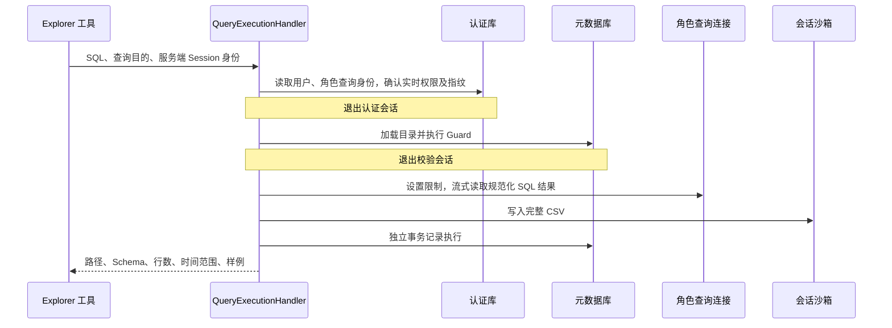

# 05. Query：受控 SQL 执行与执行审计

Query 接收业务 SQL 和可信 Session 身份，完成查询身份解析、静态校验、Doris 受限执行、CSV 交付和执行记录。模块保证查询经过确定性检查，并把完整结果与模型摘要分开保存。

## 1. 模块结构与职责

| 组件 | 输入与职责 | 输出或持久化结果 |
| --- | --- | --- |
| QueryExecutionHandler | SQL、目的、AgentSessionKey；编排完整用例 | 查询结果或原始失败 |
| DatabaseQueryExecutionRuntime | 按阶段提供身份、目录与记录会话 | 查询身份、策略、校验与执行器 |
| QueryGuardService | Doris 方言 SQL、目录、资产策略 | 规范化 SQL、引用资产和问题列表 |
| AnalysisQueryService | 已校验 SQL 与结果批次 | CSV、列摘要、行数、样例 |
| DorisQueryRepository | 查询连接与资源限制 | 服务器游标和结果批次 |
| QueryExecutionRecorder | 成功、拒绝及失败事实 | 执行审计记录 |

用户登录与授权规则由 Identity 提供，目录由 Metadata 提供，文件提交通过产物存储协议完成。Query 负责使用这些依赖完成一次查询，不接管它们的生命周期规则。

## 2. 查询执行流程

`DatabaseQueryExecutionRuntime` 管短会话和执行器组装；`QueryExecutionHandler` 管完整用例与错误记录；`AnalysisQueryService` 管结果形状和 CSV；`DorisQueryRepository` 管 Doris 连接、会话参数和游标。

## 3. 查询身份、Session 与短事务

工具接受 SQL 和 purpose，不接受用户 ID、Conversation ID 或任意输出目录。它从可信运行配置构造 Explorer 的 `AgentSessionKey`，据此确定账号和 Session 路径。

查询身份来自平台用户及角色配置，策略来自 Doris 的实时有效授权。后台管理连接读取授权信息，SQL 执行连接使用角色的专属查询账号。认证与元数据会话在进入 Doris 执行前结束，避免长查询把无关 PostgreSQL 事务一直占着。

`purpose` 同时是执行记录中的业务目的和 CSV 文件名来源，应写清年份、地区、口径等关键范围。例如用“2025年华东销售总额”，比全部写“销售总额”更能区分文件。

## 4. SQL 静态校验与目录约束

Guard 使用 SQLGlot 的 Doris 方言解析 SQL，拒绝空输入、无法解析或包含多条有效语句的输入。它检查只读语法，拦截写操作、锁、危险函数、未经允许的匿名函数、参数占位符及可能改变执行设置的 Hint。

随后根据当前目录和权限解析物理表、别名、CTE、子查询与字段来源。SELECT 输出之外，过滤、关联、分组、排序等位置的字段也需要有权访问。引用外部 Catalog 或不允许的数据库不会因为“语法是 SELECT”就自动放行。

星号需要特别处理：整表授权时可以按目录展开；只有部分列授权时，不能让 `*` 顺便带出未授权列。多表关联要表达明确的关联语义，Guard 对含糊或不允许的 JOIN 形态进行检查。

目录查询走单独白名单：有限的 SHOW TABLES 与受限 information_schema 查询可以帮助 Explorer 确认结构，其实际可见范围由 Doris 查询账号控制。

Guard 返回规范化 SQL、引用的表和列、输出列及问题列表。被拒绝时，工具返回这些问题，让模型可以修正。Guard 不是完整数据库执行器，不会声称自己提前证明了每个函数的类型兼容性；最终语法能力、真实权限和执行错误仍由 Doris 判断。

## 5. Doris 资源限制与取消

每条 SQL 执行前，仓储设置角色 Workload Group、`query_timeout` 和 `exec_mem_limit`。默认超时 300 秒，内存限制 1 GiB。

这 300 秒是 Doris 会话查询参数，不是覆盖身份解析、等连接、写 CSV、上传沙箱的全流程计时器。`batch_size=100` 表示每批读取行数，`sample_rows=5` 表示返回给模型的样例数，都不是总结果行数上限。

服务器游标按批返回结果，退出时关闭游标。任务取消时会使当前连接失效，避免把状态不明确的连接放回池中，再继续传播取消。数据库超时被转换为明确的查询超时异常，其他执行错误保留原始原因供记录和工具投影使用。

## 6. 结果序列化、CSV 与有限摘要

执行器先创建临时文件，逐批检查列名和行结构，并写出 CSV。列名必须非空且大小写归一后不重复，各批列结构必须一致，每行列数必须正确。空结果仍可生成带表头的 CSV；完全没有有效结果元数据则报错。

完整结果持续写文件，内存只保存字段统计和有限样例。统计包括观测到的类型、是否出现空值、日期时间范围；这是根据返回值推断的结果摘要，不是对 Doris 原始字段类型的完整复制。

CSV 对日期时间使用 ISO 文本，二进制使用 Base64，嵌套数据使用 JSON，空值写为空单元格。字符串若可能被电子表格解释成公式，会加保护前缀。模型样例另有限长、集合数量和嵌套深度控制，CSV 不按样例长度截断完整值。

结果读完后上传沙箱，再返回 `AnalysisQueryResult`：

| 字段 | 作用 |
| --- | --- |
| `path` | 容器中的结果绝对路径 |
| `columns` | 列名、推断类型和空值信息 |
| `row_count` | 完整返回结果的行数 |
| `time_range` | 可识别日期时间列的范围 |
| `sample` | 有界的预览行 |

上传失败属于查询用例失败：虽然 Doris 可能已经读完，但没有可交付文件，就不能向模型宣称已成功产出 CSV。

## 7. 文件命名与覆盖语义

文件名由规范化和字符清理后的查询目的加 `.csv` 组成。没有可用名称时回退为 `query_result.csv`。

相同 Session 内相同或清理后相同的目的会写入相同路径，后续结果覆盖旧文件。旧执行记录中的路径也会指向更新后的文件。不同 Session 仍有不同目录。

文件名受 Sandbox 路径和文件系统限制，过长名称会导致写入失败。

## 8. 错误分类与执行记录

| 情况 | 工具/记录错误码 | 记录状态 |
| --- | --- | --- |
| SQL 校验拒绝 | `sql_validation_failed` | `rejected` |
| Doris 查询超时 | `query_timeout` | `failed` |
| 列或行结构无效 | `query_result_invalid` | `failed` |
| 其他执行或产物错误 | `readonly_query_failed` | `failed` |

分类集中在 Query 错误模块。Handler 负责记录并继续抛出原异常；工具层负责文案、修正 hint 和可供模型读取的校验结果。取消不被普通 `Exception` 分支包装成查询失败。

查询身份成功解析后，被拒绝、失败和成功都会尝试记录。身份本身解析失败时，没有可靠的角色上下文，当前不写执行记录。

记录保存用户、角色、权限指纹、会话、Session、工具调用、目的、原始与规范化 SQL、状态、错误和结果摘要。它没有单独的完整执行耗时字段。成功结果记录不保存整个 CSV 或全部样例。

记录故障只记日志，不把已成功返回的结果改成失败，并保留查询本身的错误。这意味着一次成功查询可能没有成功写入审计，不能把“记录尽力而为”解释成强制审计成功。

## 9. 异常定位

校验失败看 `validation.issues`；执行失败看角色、Doris 限制及数据库错误；结果已算出但工具失败看产物上传；执行记录缺失看独立审计事务和错误日志。

执行 SQL 是 Explorer 工具能力，不提供任意匿名提交 SQL 的 HTTP 端点。完整 CSV 保存在会话沙箱，执行记录只保存结果摘要；相同 Session 的同名文件可能被覆盖，历史路径不代表不可变的数据快照。
