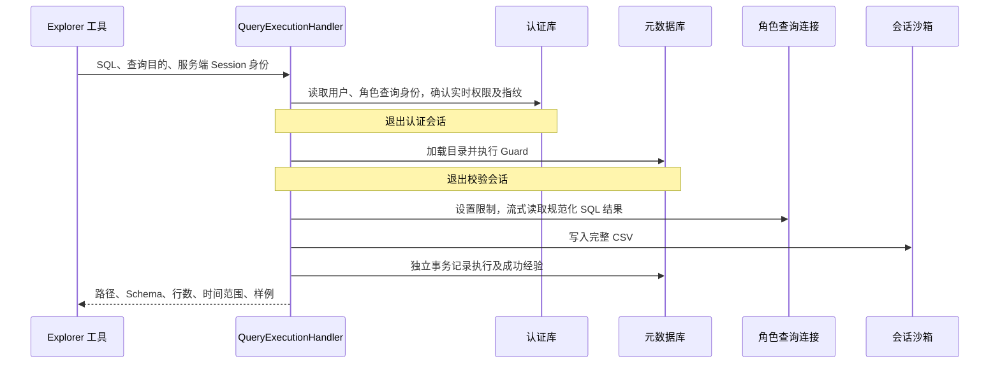
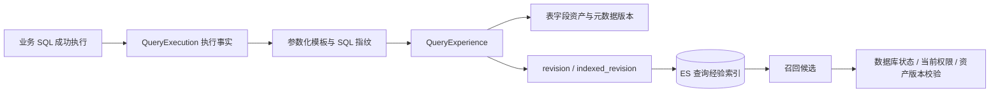

# 05. Query：受控 SQL 执行与查询经验管理

Query 接收业务 SQL 和可信 Session 身份，完成查询身份解析、静态校验、Doris 受限执行、CSV 交付、执行记录和经验聚合。模块保证查询经过确定性检查，并把完整结果与模型摘要分开保存。

## 1. 模块结构与职责

| 组件 | 输入与职责 | 输出或持久化结果 |
| --- | --- | --- |
| QueryExecutionHandler | SQL、目的、AgentSessionKey；编排完整用例 | 查询结果或原始失败 |
| DatabaseQueryExecutionRuntime | 按阶段提供身份、目录与记录会话 | 查询身份、策略、校验与执行器 |
| QueryGuardService | Doris 方言 SQL、目录、资产策略 | 规范化 SQL、引用资产和问题列表 |
| AnalysisQueryService | 已校验 SQL 与结果批次 | CSV、列摘要、行数、样例 |
| DorisQueryRepository | 查询连接与资源限制 | 服务器游标和结果批次 |
| QueryExecutionRecorder | 成功/失败事实及资产版本 | 执行记录、经验与索引任务 |
| QueryExperienceIndexer | 经验 revision 与状态 | ES 文档、indexed_revision 或删除完成 |
| QueryExperienceRecallService | 角色、权限指纹、问题文本 | 有效经验候选及检索状态 |
| QueryExperienceManagementService | 管理员禁用、删除和查询 | 状态变化与来源记录 |

用户登录与授权规则由 Identity 提供，目录由 Metadata 提供，文件提交由 Sandbox Manager 完成。Query 负责使用这些依赖完成一次查询，不接管它们的生命周期规则。

## 2. 查询执行流程

`DatabaseQueryExecutionRuntime` 管短会话和执行器组装；`QueryExecutionHandler` 管完整用例与错误记录；`AnalysisQueryService` 管结果形状和 CSV；`DorisQueryRepository` 管 Doris 连接、会话参数和游标。

## 3. 查询身份、Session 与短事务

工具接受 SQL 和 purpose，不接受用户 ID、Conversation ID 或任意输出目录。它从可信运行配置构造 Explorer 的 `AgentSessionKey`，据此确定账号和 Session 路径。

查询身份来自平台用户及角色配置，策略来自 Doris 的实时有效授权。后台管理连接读取授权信息，SQL 执行连接使用角色的专属查询账号。认证与元数据会话在进入 Doris 执行前结束，避免长查询把无关 PostgreSQL 事务一直占着。

`purpose` 同时是执行记录中的业务目的和 CSV 文件名来源，应写清年份、地区、口径等关键范围。例如用“2025年华东销售总额”，比全部写“销售总额”更能区分文件。

## 4. SQL 静态校验与目录约束

Guard 使用 SQLGlot 的 Doris 方言解析 SQL，拒绝空输入、无法解析或包含多条有效语句的输入。它检查只读语法，拦截写操作、锁、危险函数、未经允许的匿名函数、参数占位符及可能改变执行设置的 Hint。

物理表、别名、CTE、子查询与字段来源用于记录查询依赖。元数据目录只辅助解析，不作为 SQL 的访问白名单；目录中缺失的表或字段不会阻止查询，表和字段是否存在、字段是否有歧义以及访问权限均由 Doris 判断。目录不足时，只记录能够明确解析的字段依赖。

执行 SQL 保留原始字段引用和星号，不使用目录展开后的语句，避免过期目录改变查询结果或掩盖权限错误。Guard 不预检重复输出列名，执行器根据 Doris 返回的真实列名检查 CSV 结构。数据库访问范围由 Doris 查询账号的授权决定；Guard 检查外部 Catalog 限制以及 JOIN 关联规则。

目录查询包括 SHOW TABLES 和引用 information_schema 的只读查询，支持 JOIN、CTE、子查询和 UNION，不限制系统表名称或当前库，实际可见范围由 Doris 查询账号控制。引用 information_schema 的查询（包括与业务表混合查询）均归为目录查询，不执行业务分支的 JOIN 规则检查，也不会产生业务查询经验。

Guard 返回规范化 SQL、引用的表和列、输出列及问题列表。被拒绝时，工具返回这些问题，让模型可以修正。Guard 不是完整数据库执行器，不会声称自己提前证明了每个函数的类型兼容性；最终语法能力、真实权限和执行错误仍由 Doris 判断。

## 5. Doris 资源限制与取消

每条 SQL 执行前，仓储设置角色 Workload Group、`query_timeout` 和 `exec_mem_limit`。默认超时 300 秒，内存限制 1 GiB。

这 300 秒是 Doris 会话查询参数，不是覆盖身份解析、等连接、写 CSV、上传沙箱的全流程计时器。`batch_size=100` 表示每批读取行数，`sample_rows=5` 表示返回给模型的样例数，都不是总结果行数上限。

服务器游标按批返回结果，退出时关闭游标。任务取消时会使当前连接失效，避免把状态不明确的连接放回池中，再继续传播取消。数据库超时被转换为明确的查询超时异常，其他执行错误保留原始原因供记录和工具投影使用。

## 6. 结果序列化、CSV 与有限摘要

执行器先创建临时文件，逐批检查列名和行结构，并写出 CSV。列名必须非空且大小写归一后不重复，各批列结构必须一致，每行列数必须正确。空结果仍可生成带表头的 CSV；完全没有有效结果元数据则报错。

完整结果持续写文件，内存只保存字段统计和有限样例。统计包括观测到的类型、是否出现空值、日期时间范围；这是根据返回值推断的结果摘要，不是对 Doris 原始字段类型的完整复制。

CSV 对日期时间使用 ISO 文本，二进制使用 Base64，嵌套数据使用 JSON，空值写为空单元格。字符串若可能被电子表格解释成公式，会加保护前缀。模型样例另有限长、集合数量和嵌套深度控制，CSV 不按样例长度截断完整值。

结果读完后上传沙箱，再返回 `AnalysisQueryResult`：

| 字段 | 作用 |
| --- | --- |
| `path` | 容器中的结果绝对路径 |
| `columns` | 列名、推断类型和空值信息 |
| `row_count` | 完整返回结果的行数 |
| `time_range` | 可识别日期时间列的范围 |
| `sample` | 有界的预览行 |

上传失败属于查询用例失败：虽然 Doris 可能已经读完，但没有可交付文件，就不能向模型宣称已成功产出 CSV。

## 7. 文件命名与覆盖语义

文件名由规范化和字符清理后的查询目的加 `.csv` 组成。没有可用名称时回退为 `query_result.csv`。

相同 Session 内相同或清理后相同的目的会写入相同路径，后续结果覆盖旧文件。旧执行记录中的路径也会指向更新后的文件。不同 Session 仍有不同目录。

文件名受 Sandbox 路径和文件系统限制，过长名称会导致写入失败。

## 8. 错误分类与执行记录

| 情况 | 工具/记录错误码 | 记录状态 |
| --- | --- | --- |
| SQL 校验拒绝 | `sql_validation_failed` | `rejected` |
| Doris 查询超时 | `query_timeout` | `failed` |
| 列或行结构无效 | `query_result_invalid` | `failed` |
| 其他执行或产物错误 | `readonly_query_failed` | `failed` |

分类集中在 Query 错误模块。Handler 负责记录并继续抛出原异常；工具层负责文案、修正 hint 和可供模型读取的校验结果。取消不被普通 `Exception` 分支包装成查询失败。

查询身份成功解析后，被拒绝、失败和成功都会尝试记录。身份本身解析失败时，没有可靠的角色上下文，当前不写执行记录。

记录保存用户、角色、权限指纹、会话、Session、工具调用、目的、原始与规范化 SQL、状态、错误和结果摘要。它没有单独的完整执行耗时字段。成功结果记录不保存整个 CSV 或全部样例。

记录故障只记日志，不把已成功返回的结果改成失败，并保留查询本身的错误。这意味着一次成功查询可能没有成功写入审计或经验，不能把“记录尽力而为”解释成强制审计成功。

## 9. 经验模板与聚合规则

成功执行的业务 SQL 才生成经验。系统把 SQL 字面量替换为占位符，生成结构模板和指纹，再按角色、权限指纹与 SQL 结构指纹聚合。

例如只改变年份的同结构 SQL 可以共享经验。相同权限下的记录更新用途和资产版本，用途去重后最多保留最近 5 条。不同权限指纹分别保存经验，避免互相覆盖；权限恢复后可再次召回原有经验。

经验保存的是“这种问题曾经怎样成功查询”，不是一个无需重新校验就能执行的授权令牌。下次模型参考它生成 SQL，仍需重新经过 Guard 和 Doris 权限检查。

## 10. 经验状态与索引修复

| 状态 | 行为 |
| --- | --- |
| `active` | 可以参与召回 |
| `disabled` | 不参与召回，保留禁用原因 |
| `deleting` | 先清理搜索索引，再删除数据库记录 |

经验关联物理表和字段的元数据版本。元数据变更会停用相关经验；同结构 SQL 在新版本下再次成功，可以恢复因元数据变化而停用的记录。管理员主动禁用的记录不会因为一次成功执行就自动恢复。

`revision` 表示经验当前版本，`indexed_revision` 表示索引同步到哪一版。同步按版本处理，防止旧任务覆盖新状态。提交经验事务后才投递索引任务；若消息投递或同步失败，默认每 300 秒的修复扫描查找尚未同步的记录并补投。

## 11. 混合召回与有效性检查

先在 ES 中按当前角色和 `authorization_fingerprint` 过滤，再并行搜索全文及向量结果并做 RRF 融合。每路候选最多 100，向量默认阈值 0.65；Explorer 最多使用 3 条经验。

候选返回后到 PostgreSQL 检查记录仍为 active、元数据版本未过期且当前用户仍有相应资产权限。任一搜索通道可用时可以部分返回；两路均失败时明确表示失败。

Metadata 在搜索时可以复用未满一天、角色和权限指纹匹配的经验缓存。缓存命中时只按当前资产权限过滤，不重新检查经验的启用状态和元数据版本；这些检查在重新检索经验时执行。

读取或展开历史召回快照同样检查当前角色、权限指纹和资产权限，但不检查缓存期限、经验启用状态或元数据版本。因此，经验被禁用或元数据变化后，历史快照中仍可能保留相关经验。模型参考经验生成的 SQL，执行时仍须经过当前权限和 SQL Guard 校验。

## 12. 管理接口与异常定位

查询经验管理位于 `/api/v1/admin/query-experiences`，支持筛选、查看关联信息、禁用及删除等操作，执行 SQL 本身是 Explorer 工具能力，不是一个允许任意匿名提交 SQL 的 HTTP 端点。

校验失败看 `validation.issues`；执行失败看角色、Doris 限制及数据库错误；结果已算出但工具失败看产物上传；经验没出现再查记录事务、权限指纹和索引 revision。这样的顺序能避免把所有问题都归结为“模型生成的 SQL 不对”。

## 13. 执行事实、经验和索引的数据关系

- 执行记录关联用户、Conversation、Analysis、Session、工具调用及当次权限环境；记录不嵌入完整 CSV。
- 经验按角色、权限指纹和 SQL 指纹聚合，资产关联保存稳定资源键与元数据版本。
- 经验删除先进入 deleting，清理搜索文档后移除经验及关联，原始执行历史保留。
- 元数据失效与管理员禁用使用不同原因，决定成功查询能否重新激活经验。
- ES 是派生检索数据，数据库状态和版本才是最终校验依据；旧索引命中不能绕过状态检查。
- 相同 Session 的同名 CSV 可能被覆盖，历史路径不代表不可变的数据快照。
- 执行记录尽力保存，记录失败不改写查询结果；对强制审计成功有额外要求时，需要单独改变业务约束。
