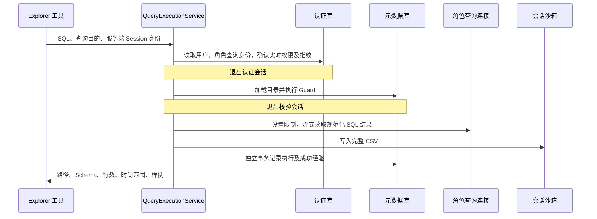
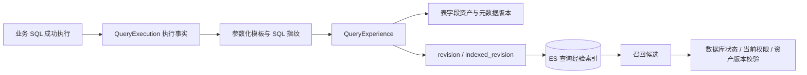

# 05. Query：受控 SQL 执行与查询经验管理

Query 接收业务 SQL 和可信 Session 身份，完成查询身份解析、静态校验、Doris 受限执行、CSV 交付、执行记录和经验聚合。模块保证查询经过确定性检查，并把完整结果与模型摘要分开保存。

## 1. 提供哪些功能

| 功能 | 提供的能力 | 使用方 |
| --- | --- | --- |
| 只读 SQL 执行 | 解析查询身份、校验 SQL、设置 Doris 限制并流式读取 | Explorer 的 execute_sql 工具 |
| 结果交付 | 完整 CSV、列摘要、行数、时间范围和有限样例 | Agent 与用户 |
| 执行记录 | 保存成功、拒绝和失败事实及当次身份上下文 | 管理员、经验聚合 |
| 经验沉淀 | 将成功业务 SQL 模板化，按角色与权限环境聚合 | 经验索引任务 |
| 经验召回 | 全文与向量检索，复核状态、资产权限和元数据版本 | Assistant |
| 经验管理 | 查询、查看来源执行、禁用、删除、元数据变更失效和索引修复 | 管理员、Workflows |

## 2. 如何使用

### 2.1 执行一次查询

跨模块服务从 `app.query` 导入，执行范围和返回类型从 `app.query.contracts` 导入。应用创建 `QueryExecutionService` 并注入调用方；`execute` 接收可信执行归属、SQL、查询目的和可选工具调用 ID。

以下示例位于异步业务方法中，`query_service` 为已注入的查询服务，用户和会话标识来自服务端上下文：

```python
from app.query.contracts import QueryExecutionScope

scope = QueryExecutionScope(
    user_id=user_id,
    conversation_id=conversation_id,
    analysis_id="sales",
    agent_type="explorer",
    session_id="regional-sales",
)
result = await query_service.execute(
    scope,
    "SELECT region, SUM(amount) AS total_amount FROM orders GROUP BY region",
    purpose="各地区销售额",
    tool_call_id=None,
)
```

结果通过 `result.path` 交付 CSV。工具入口只向模型开放 SQL 和 purpose，归属标识从运行配置取得。项目通过 Explorer 工具提供 SQL 执行能力。

### 2.2 召回与管理经验

| 入口 | 用途 |
| --- | --- |
| `QueryExperienceService.recall(policy, query, limit)` | 按本次资产策略召回经验，返回结果及检索状态 |
| `QueryExperienceInvalidationService.invalidate_assets(table_names=..., column_keys=...)` | 失效依赖变更资产的经验 |
| `query_experience_index_scheduler.enqueue(experience_id, revision)` | 提交指定经验版本的索引同步，返回是否投递成功 |

管理中心的查询经验页面要求管理员身份，接口前缀为 `/api/v1/admin/query-experiences`：

| 操作 | 方法与路径 |
| --- | --- |
| 筛选经验、读取详情 | `GET /`、`GET /{experience_id}`；列表使用前缀本身 |
| 查看来源执行 | `GET /{experience_id}/executions` |
| 禁用 | `POST /{experience_id}/disable`、`POST /batch-disable` |
| 删除 | `DELETE /{experience_id}`、`POST /batch-delete` |

禁用和删除影响经验的后续召回，原始执行记录按自身存储规则保留。

## 3. 关键业务规则

### 3.1 身份与执行归属

工具接受 SQL 和 purpose，不接受用户 ID、Conversation ID 或任意输出目录。它从可信运行配置构造 Explorer 的 `QueryExecutionScope`，据此确定账号和 Session 路径。

查询身份来自平台用户及角色配置，策略来自 Doris 的实时有效授权。后台管理连接读取授权信息，SQL 执行连接使用角色的专属查询账号。Identity 与 Metadata 各自的会话在进入 Doris 执行前结束，避免长查询把无关 PostgreSQL 事务一直占着。

`purpose` 同时是执行记录中的业务目的和 CSV 文件名来源，应写清年份、地区、口径等关键范围。例如用“2025年华东销售总额”，比全部写“销售总额”更能区分文件。

### 3.2 SQL 规则与数据库权限

Guard 使用 SQLGlot 的 Doris 方言解析 SQL，拒绝空输入、无法解析或包含多条有效语句的输入。它检查只读语法，拦截写操作、锁、危险函数、未经允许的匿名函数、参数占位符及可能改变执行设置的 Hint。

物理表、别名、CTE、子查询与字段来源用于记录查询依赖。元数据目录只辅助解析，不作为 SQL 的访问白名单；目录中缺失的表或字段不会阻止查询，表和字段是否存在、字段是否有歧义以及访问权限均由 Doris 判断。目录不足时，只记录能够明确解析的字段依赖。

执行 SQL 保留原始字段引用和星号，不使用目录展开后的语句，避免过期目录改变查询结果或掩盖权限错误。Guard 不预检重复输出列名，执行器根据 Doris 返回的真实列名检查 CSV 结构。数据库访问范围由 Doris 查询账号的授权决定；Guard 检查外部 Catalog 限制以及 JOIN 关联规则。

目录查询包括 SHOW TABLES 和引用 information_schema 的只读查询，支持 JOIN、CTE、子查询和 UNION，不限制系统表名称或当前库，实际可见范围由 Doris 查询账号控制。引用 information_schema 的查询（包括与业务表混合查询）均归为目录查询，不执行业务分支的 JOIN 规则检查，也不会产生业务查询经验。

Guard 返回规范化 SQL、引用的表和列、输出列及问题列表。被拒绝时，工具返回这些问题，让模型可以修正。Doris 在实际执行时检查函数类型、语法支持和查询权限，并返回执行错误。

### 3.3 资源限制与取消

每条 SQL 执行前，仓储设置角色 Workload Group、`query_timeout` 和 `exec_mem_limit`。默认超时 300 秒，内存限制 1 GiB。

这 300 秒是 Doris 会话查询参数，不是覆盖身份解析、等连接、写 CSV、上传沙箱的全流程计时器。`batch_size=100` 表示每批读取行数，`sample_rows=5` 表示返回给模型的样例数，都不是总结果行数上限。

服务器游标按批返回结果，退出时关闭游标。任务取消时会使当前连接失效，避免把状态不明确的连接放回池中，再继续传播取消。数据库超时被转换为明确的查询超时异常，其他执行错误保留原始原因供记录和工具投影使用。

### 3.4 CSV 交付与文件覆盖

执行器先创建临时文件，逐批检查列名和行结构，并写出 CSV。列名必须非空且大小写归一后不重复，各批列结构必须一致，每行列数必须正确。空结果仍可生成带表头的 CSV；完全没有有效结果元数据则报错。

完整结果持续写文件，内存只保存字段统计和有限样例。统计包括观测到的类型、是否出现空值、日期时间范围；这是根据返回值推断的结果摘要，不是对 Doris 原始字段类型的完整复制。

CSV 对日期时间使用 ISO 文本，二进制使用 Base64，嵌套数据使用 JSON，空值写为空单元格。字符串若可能被电子表格解释成公式，会加保护前缀。模型样例另有限长、集合数量和嵌套深度控制，CSV 不按样例长度截断完整值。

结果读完后上传沙箱，再返回 `AnalysisQueryResult`：

| 字段 | 作用 |
| --- | --- |
| `path` | 容器中的结果绝对路径 |
| `columns` | 列名、推断类型和空值信息 |
| `row_count` | 完整返回结果的行数 |
| `time_range` | 可识别日期时间列的范围 |
| `sample` | 有界的预览行 |

上传失败属于查询用例失败：虽然 Doris 可能已经读完，但没有可交付文件，就不能向模型宣称已成功产出 CSV。

文件名由规范化和字符清理后的查询目的加 `.csv` 组成。没有可用名称时回退为 `query_result.csv`。查询只把文件名、Session 身份和文件内容交给 Sandbox，由 Sandbox 决定目录并返回实际写入的绝对路径。

相同 Session 内相同或清理后相同的目的会写入相同路径，后续结果覆盖旧文件。旧执行记录中的路径也会指向更新后的文件。不同 Session 仍有不同目录。

文件名受 Sandbox 路径和文件系统限制，过长名称会导致写入失败。

### 3.5 经验生成与状态

成功执行的业务 SQL 才生成经验。系统把 SQL 字面量替换为占位符，生成结构模板和指纹，再按角色、权限指纹与 SQL 结构指纹聚合。

例如只改变年份的同结构 SQL 可以共享经验。相同权限下的记录更新用途和资产版本，用途去重后最多保留最近 5 条。不同权限指纹分别保存经验，避免互相覆盖；权限恢复后可再次召回原有经验。

经验提供成功 SQL 的结构参考。模型据此生成的 SQL 每次都经过 Guard，并由 Doris 按当前查询身份执行。

| 状态 | 行为 |
| --- | --- |
| `active` | 可以参与召回 |
| `disabled` | 不参与召回，保留禁用原因 |
| `deleting` | 先清理搜索索引，再删除数据库记录 |

经验关联物理表和字段的元数据版本。元数据变更会停用相关经验；同结构 SQL 在新版本下再次成功，可以恢复因元数据变化而停用的记录。管理员主动禁用的记录不会因为一次成功执行就自动恢复。

`revision` 表示经验当前版本，`indexed_revision` 表示索引同步到哪一版。同步按版本处理，防止旧任务覆盖新状态。提交经验事务后才投递索引任务；若消息投递或同步失败，默认每 300 秒的修复扫描查找尚未同步的记录并补投。

### 3.6 召回与缓存

先在 ES 中按当前角色和 `authorization_fingerprint` 过滤，再并行搜索全文及向量结果并做 RRF 融合。每路候选最多 100，向量默认阈值 0.65；Explorer 最多使用 3 条经验。

候选返回后到 PostgreSQL 检查记录仍为 active、元数据版本未过期且当前用户仍有相应资产权限。任一搜索通道可用时可以部分返回；两路均失败时明确表示失败。

Assistant 在组合召回时可以复用未满一天、角色和权限指纹匹配的经验缓存。缓存命中时只按当前资产权限过滤，不重新检查经验的启用状态和元数据版本；这些检查在重新检索经验时执行。

显式读取已保存的召回快照同样检查当前角色、权限指纹和资产权限，但不检查缓存期限、经验启用状态或元数据版本。因此，经验被禁用或元数据变化后，历史快照中仍可能保留相关经验。模型参考经验生成的 SQL，执行时仍须经过当前权限和 SQL Guard 校验。

## 4. 内部实现

### 4.1 目录与服务职责

```text
query/
├── __init__.py          跨模块公开入口
├── execution/
│   ├── service.py       查询身份、校验、执行和记录编排
│   ├── guard.py         只读 SQL 与关联规则校验
│   ├── executor.py      流式执行、CSV 写入和结果摘要
│   └── recorder.py      执行审计与成功经验聚合
├── experiences/
│   ├── management.py    经验查询、禁用和删除
│   ├── recall.py        混合召回与资产版本复核
│   ├── authorization.py 经验资产授权判断
│   ├── invalidation.py  元数据变更引起的经验失效
│   ├── indexer.py       Elasticsearch 投影同步
│   └── scheduler.py     经验索引任务提交
├── api/                 HTTP 参数、请求依赖与响应协议
├── repositories/        执行记录、经验、索引及 Doris 访问
├── models/              执行记录、经验与引用资产模型
├── contracts.py         公开请求、结果和执行范围
├── errors.py            业务异常与执行错误分类
└── tasks.py             索引任务执行、补偿扫描与资源释放
```

其他模块从 `app.query` 导入 `QueryExecutionService`、`QueryExperienceService` 和经验失效、索引调度能力，取得实例后直接调用业务方法。内部 SQL 校验器、执行器和仓储由 Query 自己使用；公开请求和结果类型位于 `app.query.contracts`。

| 组件 | 输入与职责 | 输出或持久化结果 |
| --- | --- | --- |
| QueryExecutionService | SQL、目的、QueryExecutionScope；编排完整用例并管理查询记录会话 | 查询结果或原始失败 |
| QueryGuardService | Doris 方言 SQL、目录 | 规范化 SQL、引用资产和问题列表 |
| AnalysisQueryService | 已校验 SQL 与结果批次 | CSV、列摘要、行数、样例 |
| DorisQueryRepository | 查询连接与资源限制 | 服务器游标和结果批次 |
| QueryExecutionRecorder | 成功/失败事实及资产版本 | 执行记录、经验与索引任务 |
| QueryExperienceIndexer | 经验 revision 与状态 | ES 文档、indexed_revision 或删除完成 |
| QueryExperienceService | 资产策略、问题文本；混合召回、版本复核与失效处理 | 有效经验候选及检索状态 |
| QueryExperienceManagementService | 管理员禁用、删除和查询 | 状态变化与来源记录 |

用户登录与授权规则由 Identity 提供，目录由 Metadata 提供，文件提交由 Sandbox Manager 完成。Query 负责使用这些依赖完成一次查询，不接管它们的生命周期规则。

管理接口在 `api/dependencies.py` 内创建请求级经验管理服务；后台任务在 `tasks.py` 内直接创建索引器。Web 启动入口创建可共享的查询执行和经验召回实例，单次操作的数据保存在局部变量及短会话中。

### 4.2 执行流程与事务


```mermaid
sequenceDiagram
    participant Tool as Explorer 工具
    participant Handler as QueryExecutionService
    participant Auth as 认证库
    participant Meta as 元数据库
    participant Doris as 角色查询连接
    participant Files as 会话沙箱
    Tool->>Handler: SQL、查询目的、服务端 Session 身份
    Handler->>Auth: 读取用户、角色查询身份，确认实时权限及指纹
    Note over Handler,Auth: 退出认证会话
    Handler->>Meta: 加载目录并执行 Guard
    Note over Handler,Meta: 退出校验会话
    Handler->>Doris: 设置限制，流式读取规范化 SQL 结果
    Handler->>Files: 写入完整 CSV
    Handler->>Meta: 独立事务记录执行及成功经验
    Handler-->>Tool: 路径、Schema、行数、时间范围、样例
```

`QueryExecutionService` 在 `execution/service.py` 中直接完成完整用例：调用 `IdentityService.resolve_query_principal()` 解析身份，通过 `MetadataReader` 加载目录，由 Guard 校验 SQL，组装执行器并使用独立查询会话记录结果。`AnalysisQueryService` 负责结果形状和 CSV；`DorisQueryRepository` 负责 Doris 连接、会话参数和游标。身份与目录会话在 Doris 执行前关闭。查询入口统一拒绝未通过 Guard 的结果，并将已确认的 `normalized_sql` 交给执行器和成功记录方法；记录器同时保留原始 SQL 与完整校验结果用于审计。

`QueryExperienceService` 在 `experiences/recall.py` 中直接完成混合召回、版本复核和失效处理。它在读取候选后关闭查询会话，再读取元数据版本，随后在新的短事务中复查并更新经验；失效索引任务在事务提交和会话关闭后调度。

### 4.3 执行记录与错误分类

| 情况 | 执行记录错误码 | 记录状态 |
| --- | --- | --- |
| SQL 校验拒绝 | `sql_validation_failed` | `rejected` |
| Doris 查询超时 | `query_timeout` | `failed` |
| 列或行结构无效 | `query_result_invalid` | `failed` |
| 其他执行或产物错误 | `readonly_query_failed` | `failed` |

分类集中在 Query 错误模块。Handler 负责记录并继续抛出原异常；工具层负责文案、修正 hint 和可供模型读取的校验结果。取消不被普通 `Exception` 分支包装成查询失败。

查询身份成功解析后，被拒绝、失败和成功都会尝试记录。身份本身解析失败时，没有可靠的角色上下文，当前不写执行记录。

记录保存用户、角色、权限指纹、会话、Session、工具调用、目的、原始与规范化 SQL、状态、错误和结果摘要。它没有单独的完整执行耗时字段。成功结果记录不保存整个 CSV 或全部样例。

记录故障只记日志，不把已成功返回的结果改成失败，并保留查询本身的错误。这意味着一次成功查询可能没有成功写入审计或经验，不能把“记录尽力而为”解释成强制审计成功。

### 4.4 执行记录、经验和索引


```mermaid
flowchart LR
    SQL[业务 SQL 成功执行] --> RECORD[QueryExecution 执行事实]
    RECORD --> TEMPLATE[参数化模板与 SQL 指纹]
    TEMPLATE --> EXPERIENCE[QueryExperience]
    EXPERIENCE --> ASSETS[表字段资产与元数据版本]
    EXPERIENCE --> REV[revision / indexed_revision]
    REV --> INDEX[(ES 查询经验索引)]
    INDEX --> RECALL[召回候选]
    RECALL --> CHECK[数据库状态 / 当前权限 / 资产版本校验]
```

- 执行记录关联用户、Conversation、Analysis、Session、工具调用及当次权限环境；记录不嵌入完整 CSV。
- 经验按角色、权限指纹和 SQL 指纹聚合，资产关联保存稳定资源键与元数据版本。
- 经验删除先进入 deleting，清理搜索文档后移除经验及关联，原始执行历史保留。
- 元数据失效与管理员禁用使用不同原因，决定成功查询能否重新激活经验。
- ES 是派生检索数据，数据库状态和版本才是最终校验依据；旧索引命中不能绕过状态检查。
- 相同 Session 的同名 CSV 可能被覆盖，历史路径不代表不可变的数据快照。
- 执行记录尽力保存，记录失败不改写查询结果；对强制审计成功有额外要求时，需要单独改变业务约束。

## 5. 异常与排障

| 现象 | 优先检查 |
| --- | --- |
| SQL 校验拒绝 | 工具返回的校验问题、语句数量、只读语法、Catalog 和 JOIN 规则 |
| Doris 执行失败 | 查询账号、实际授权、工作组、超时和数据库错误 |
| 结果格式错误 | 返回列名、重复列名、批次结构、每行列数 |
| 数据已读取但工具失败 | 临时 CSV、沙箱上传、文件大小和路径限制 |
| 同名文件内容变化 | purpose 清理后的文件名和当前 Session |
| 成功查询没有经验 | 是否为业务查询、记录事务日志、权限指纹、索引 revision |
| 经验未被召回 | active 状态、角色和指纹、资产权限、元数据版本、检索通道 |
| 已禁用经验仍出现在上下文 | Assistant 是否复用了缓存或保存快照；重新检索与显式读取的校验范围不同 |

查询错误与记录错误分别保留日志。记录写入失败时，已成功生成的查询结果仍可返回。
