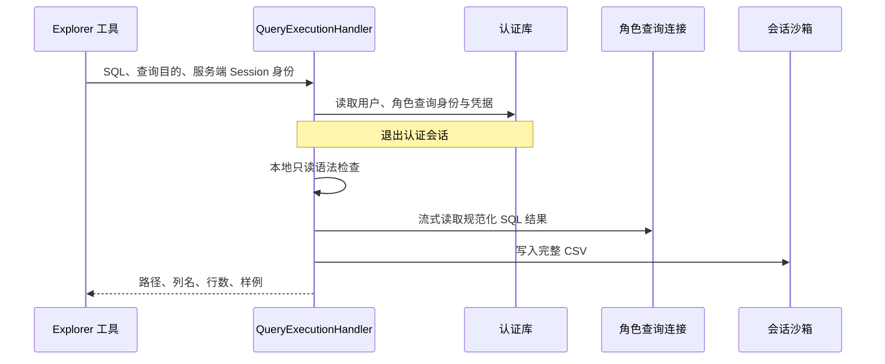

# 05. Query：受控 SQL 执行与结果交付

Query 接收业务 SQL 和可信 Session 身份，完成查询身份解析、静态校验、Doris 查询执行、CSV 交付。模块保证查询经过确定性检查，并把完整结果与模型摘要分开保存。

## 1. 模块结构与职责

| 组件 | 输入与职责 | 输出或持久化结果 |
| --- | --- | --- |
| QueryExecutionHandler | SQL、目的、AgentSessionKey；编排完整用例 | 查询结果或原始失败 |
| DatabaseQueryExecutionRuntime | 提供身份会话和查询执行器 | 查询身份、校验与执行器 |
| QueryGuardService | Doris 方言 SQL | 规范化 SQL 和问题列表 |
| AnalysisQueryService | 已校验 SQL 与结果批次 | CSV、列名、行数、样例 |
| DorisQueryRepository | 查询连接与流式读取 | 服务器游标和结果批次 |

用户登录与授权规则由 Identity 提供，文件提交通过产物存储协议完成。Query 负责使用这些依赖完成一次查询，不接管它们的生命周期规则。

## 2. 查询执行流程

`DatabaseQueryExecutionRuntime` 管短会话和执行器组装；`QueryExecutionHandler` 管完整查询用例；`AnalysisQueryService` 管结果形状和 CSV；`DorisQueryRepository` 管 Doris 连接、会话参数和游标。

## 3. 查询身份、Session 与短事务

工具接受 SQL 和 purpose，不接受用户 ID、Conversation ID 或任意输出目录。它从可信运行配置构造 Explorer 的 `AgentSessionKey`，据此确定账号和 Session 路径。

查询身份来自平台用户及角色配置，SQL 使用角色的专属查询账号执行，访问权限由 Doris 判定。认证会话在进入 Doris 执行前结束，避免长查询把无关 PostgreSQL 事务一直占着。

`purpose` 表达本次查询的业务目的，也是 CSV 文件名来源，应写清年份、地区、口径等关键范围。例如用“2025年华东销售总额”，比全部写“销售总额”更能区分文件。

## 4. SQL 静态校验

Guard 使用 SQLGlot 的 Doris 方言解析 SQL，拒绝空输入、无法解析或包含多条有效语句的输入。它检查只读语法，拦截写操作、锁、危险函数、参数占位符及可能改变执行设置的 Hint。

Guard 不加载元数据目录，不补全字段、不展开星号，也不限制 JOIN 关联形式。表和字段是否存在、字段歧义及连接语义由 Doris 处理；结果列名重复由执行器在接收结果时检查。

目录查询允许 `SHOW TABLES`，不限制指定数据库；`information_schema` 使用普通只读检查，不限制目录表、JOIN、CTE 或过滤条件。实际可见范围由 Doris 查询账号控制。

Guard 返回规范化 SQL 及问题列表。被拒绝时，工具返回这些问题，让模型可以修正。Guard 不是完整数据库执行器，不会声称自己提前证明了每个函数的类型兼容性；最终语法能力、真实权限和执行错误仍由 Doris 判断。

## 5. Doris 资源限制与取消

查询直接使用 Doris 的账号、会话及服务端资源配置，应用不再逐条设置 Workload Group、查询超时或内存上限。

`batch_size=100` 表示每批读取行数，`sample_rows=5` 表示返回给模型的样例数，都不是总结果行数上限。

服务器游标按批返回结果，退出时关闭游标。任务取消时会使当前连接失效，避免把状态不明确的连接放回池中，再继续传播取消。数据库超时被转换为明确的查询超时异常，其他执行错误保留原始原因供工具投影使用。

## 6. 结果序列化、CSV 与有限摘要

执行器先创建临时文件，逐批检查列名和行结构，并写出 CSV。列名必须非空且大小写归一后不重复，各批列结构必须一致，每行列数必须正确。空结果仍可生成带表头的 CSV；完全没有有效结果元数据则报错。

完整结果持续写文件，内存只保存列名、行数和有限样例。字段类型、空值率和时间范围由后续分析按需读取 CSV 计算。

CSV 对日期时间使用 ISO 文本，二进制使用 Base64，嵌套数据使用 JSON，空值写为空单元格。字符串若可能被电子表格解释成公式，会加保护前缀。模型样例保留数字、布尔值和空值，其他值统一转成限长文本；嵌套对象以 JSON 文本预览。CSV 不按样例长度截断完整值。

结果读完后上传沙箱，再返回 `AnalysisQueryResult`：

| 字段 | 作用 |
| --- | --- |
| `path` | 容器中的结果绝对路径 |
| `columns` | 列名列表 |
| `row_count` | 完整返回结果的行数 |
| `sample` | 有界的预览行 |

上传失败属于查询用例失败：虽然 Doris 可能已经读完，但没有可交付文件，就不能向模型宣称已成功产出 CSV。

## 7. 文件命名与覆盖语义

文件名由规范化和字符清理后的查询目的加 `.csv` 组成。没有可用名称时回退为 `query_result.csv`。

相同 Session 内相同或清理后相同的目的会写入相同路径，后续结果覆盖旧文件。不同 Session 仍有不同目录。

文件名受 Sandbox 路径和文件系统限制，过长名称会导致写入失败。

## 8. 错误分类

| 情况 | 工具错误码 |
| --- | --- |
| SQL 校验拒绝 | `sql_validation_failed` |
| Doris 查询超时 | `query_timeout` |
| 列或行结构无效 | `query_result_invalid` |
| 其他执行或产物错误 | `readonly_query_failed` |

分类集中在 Query 错误模块。Handler 直接抛出原异常；工具层负责文案、修正 hint 和可供模型读取的校验结果。取消不被普通 `Exception` 分支包装成查询失败。

## 9. 异常定位

校验失败看 `validation.issues`；执行失败看角色、Doris 限制及数据库错误；结果已算出但工具失败看产物上传。

执行 SQL 是 Explorer 工具能力，不提供任意匿名提交 SQL 的 HTTP 端点。Query 不单独持久化 SQL 或执行记录，完整 CSV 保存在会话沙箱；相同 Session 的同名文件可能被覆盖，历史路径不代表不可变的数据快照。
