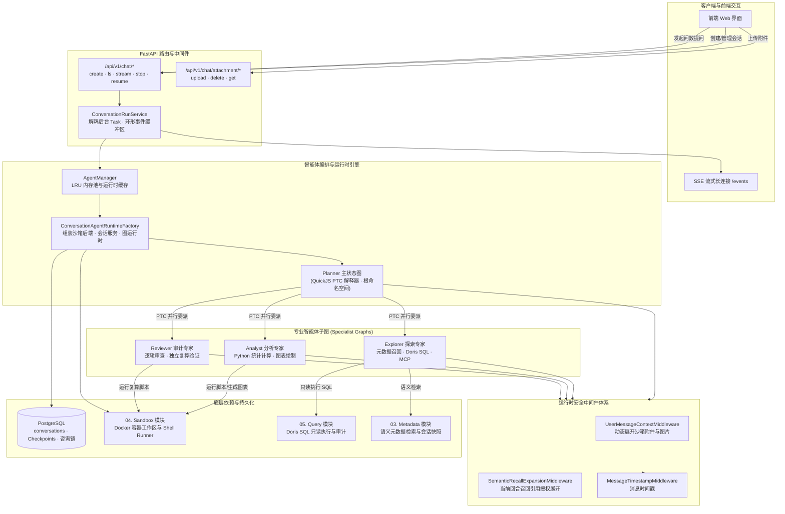

# 06. Assistant：组织多个 Agent 完成分析

## 功能说明

Assistant 负责组织整个问数过程。它管理会话和消息，运行 Planner、Explorer、Analyst、Reviewer 四类 Agent，把一个问题拆成多个分析任务，并通过 Server-Sent Events（SSE）把执行进度发给前端。它还负责保存分析文件、恢复中断任务和清理会话。

---

## 1. 模块总体架构与分层设计

### 1.1 架构定位与核心职责

用户请求先进入 Assistant，再由它调用各类专业 Agent 和底层工具。主要职责包括：

1. **保存会话和 Agent 状态**：PostgreSQL 保存会话标题、草稿和删除状态，LangGraph Checkpointer 保存每一步 Agent 执行状态。Planner 和每个 Specialist 使用不同的命名空间。
2. **统一不同模型接口**：`create_configured_model` 根据配置创建普通聊天、Responses 或 OpenRouter 客户端，并统一处理流式消息 ID 和 DeepSeek 的思考内容。
3. **让四类 Agent 各自负责不同工作**：
   - **Planner**：拆解问题并把多个子任务交给专业 Agent。它可以在 QuickJS 沙箱中并行调用委派工具，但不能直接使用 SQL 和元数据工具；
   - **Explorer**：数据探索专家，独占元数据召回与 Doris SQL 只读执行工具，产出 CSV 数据与样例摘要；
   - **Analyst**：深度分析专家，在沙箱运行 Python 脚本完成统计分析与图表绘制，只读挂载预置技能包；
   - **Reviewer**：交叉审计专家，审查上游 SQL 与分析结论，独立运行 Python 复算脚本核验关键指标。
4. **只把允许公开的上下文交给模型和客户端**：调用模型前临时加入时间、附件、图片、Shell 作业和搜索结果。读取搜索记录时会重新检查当前用户权限，返回客户端前还会过滤内部控制信息。
5. **继续已有 Specialist Session**：`AgentSessionKey` 同时确定 LangGraph 状态位置和沙箱目录。再次委派同一个 Session 时可以从上次状态继续，也可以按 `needs_repair` 要求修正结果。
6. **处理并发、断线和恢复**：`AgentManager` 缓存活跃会话的运行时，会话锁阻止同一会话同时执行多个 Planner 回合。后台任务不依赖 HTTP 连接，前端断线后可以重新订阅事件。

### 1.2 系统数据流与架构关系



### 1.3 主要组件职责

| 领域 | 核心类 / 函数 | 职责描述 |
| :--- | :--- | :--- |
| 会话目录 | `Conversation`, `ConversationTombstone`, `ConversationPGRepo` | 保存标题、草稿和删除请求，并用删除标记防止清理期间重新创建会话 |
| 会话生命周期 | `ConversationLifecycleService`, `ConversationTurnService`, `ConversationTitleService` | 创建或激活回合、生成标题、跨存储删除和回收草稿 |
| 后台运行 | `ConversationRunService`, `_ConversationRun` | 管理后台任务、有限重放窗口、订阅队列与显式停止 |
| 运行时 | `AgentManager`, `ConversationAgentRuntimeFactory`, `ConversationAgentRuntime` | 缓存并构建 Conversation 级 Planner、Session 服务和 Shell 运行时 |
| 模型 | `create_configured_model`, `DataAgentResponses`, `DataAgentDeepSeekResponses` | 创建模型客户端，统一 Responses 消息 ID 并适配 DeepSeek 思考流 |
| 消息转换 | `langchain_message_to_schema`, `langchain_message_to_schema_with_artifacts`, `schema_to_human_message` | 把内部消息转换成可以公开的响应，也把用户请求转换成内部消息 |
| Agent 请求与结果 | `DelegationRequest`, `ArtifactReference`, `RepairRequest`, `SpecialistResult`, `DelegationResult` | 定义委派请求、结果状态、文件和修正要求的数据格式 |
| Planner | `create_planner_agent`, `create_delegation_tool`, `create_list_sessions_tool`, `create_delete_session_tool` | 构建顶层图并管理专业 Session |
| Specialist | `create_specialist_agent`, `SpecialistAgentFactory`, `AgentSessionService` | 构建三类专家图，恢复状态、限制并发、复用委派结果并清理运行时 |
| 上下文中间件 | `UserMessageContextMiddleware`, `SemanticRecallExpansionMiddleware`, `MessageTimestampMiddleware` | 调用模型前临时加入附件、已授权搜索结果和消息时间 |
| 数据工具 | `create_semantic_recall_tools`, `create_execute_sql_tool`, `get_mcp_tools` | 只为 Explorer 提供元数据、只读 SQL 和配置的 MCP 工具 |
| 文件与 Shell | `build_specialist_filesystem`, `ShellJobRuntime`, `create_shell_tools`, `create_view_image_tools` | 约束 Session 工作区、只读技能、Shell 作业和图片读取 |
| 接口数据格式 | `ChatStreamEvent`, `MessageResponse`, `UploadAttachmentResponse` | 定义 REST 和 SSE 的请求与响应 |

---

## 2. 保存会话状态并过滤公开消息

PostgreSQL 保存会话标题、草稿和删除状态，LangGraph Checkpointer 保存 Agent 执行到了哪一步以及当时的消息。

### 2.1 每个用户只能访问自己的会话

- **会话模型**：`Conversation` 模型由 `AssistantBase` 声明，记录主键 `id: UUID`、所属用户 `user_id`、会话标题 `title`、草稿标记 `is_draft`、软删除标记 `deletion_requested_at` 及时间戳；
- **访问检查**：读取、修改和删除会话时都同时检查 `user_id` 和 `conversation_id`，防止用户访问其他人的会话；
- **草稿机制与清理**：创建请求通过 `is_draft` 显式决定草稿状态，默认值为 `False`。草稿第一次启动用户回合时转为非草稿；后台 Celery Beat 定时任务自动扫描并清理超时未激活的草稿会话。

### 2.2 Planner 和 Specialist 分开保存状态

- **全局线程标识**：`thread_id = f"user_{user_id}:conversation_{conversation_id}"`；
- **Planner 根命名空间**：Planner 运行在根 Checkpoint 命名空间（`checkpoint_ns = ""`）；
- **Specialist 独立子命名空间**：Explorer、Analyst 和 Reviewer 分别使用 `subagents/{analysis_id}/{agent_type}/{session_id}`。进入 Specialist 子图时，会先移除 Planner 的 Checkpoint ID、命名空间和 scratchpad，再写入当前 Specialist 自己的命名空间和工作区。

### 2.3 返回客户端前过滤内部消息

客户端读取历史消息时，系统先确认会话属于当前用户，再从 Checkpointer 读取原始消息。只有允许公开的类型和内容会被转换成 `MessageResponse`：
- **公开消息类型**：`HumanMessage`、`AIMessage`、`SystemMessage` 和角色为 `user`、`assistant`、`tool`、`system` 的 `ChatMessage`；`ToolMessage` 使用独立工具结果协议。未知消息类型被丢弃；
- **公开内容类型**：文本、`input_text`、`output_text` 和 `image_url`。AI 消息还可以返回思考文本和工具调用；用户消息的内部上下文只公开接收时间和附件引用；
- **内部信息不会返回**：Provider 的其他内容块、用户上下文内部字段、搜索底层记录和 Specialist 控制状态都会被过滤。Specialist 自己的修正提示也不会作为工作消息发给客户端。

### 2.4 后台生成标题，但不覆盖用户修改

创建会话时，系统先用初始消息的前 64 个字符作为标题，没有消息时使用“新对话”。随后后台任务可以生成更合适的标题。写回时会确认标题仍是最初的临时值，因此用户已经改过标题时不会被后台结果覆盖。

---

## 3. 根据配置创建不同模型客户端

业务代码统一调用 `create_configured_model`，不用关心底层模型使用哪种接口。

### 3.1 选择聊天、Responses 或 OpenRouter 接口

配置为 `responses` 时使用 Responses 客户端；Provider 为 `openrouter` 时使用 OpenRouter 客户端；其余配置交给 LangChain 的通用模型工厂，因此实际可用的普通聊天协议由所配置 Provider 决定。

### 3.2 统一超时、重试和流式消息 ID

所有客户端都设置 `max_retries=0`、`streaming=True` 和 30 秒请求超时。Responses 客户端会让同一次流式调用的所有数据块使用同一个消息 ID。DeepSeek 适配器还会处理 `response.reasoning_text.delta`，并按接口要求带回历史 reasoning item。

---

## 4. 四类 Agent 分别做什么

### 4.1 Planner（主规划智能体）

- **职责**：拆解用户问题，把任务交给专业 Agent，查看进度并整理最终答复；
- **项目内置工具**：`delegation`、`list_sessions`、`delete_session`、四个 Shell 工具和 `view_image`；
- **依赖提供的工具**：只读文件工具 `read_file`，以及 QuickJS 代码解释器提供的 `eval`；
- **使用限制**：Planner 不能调用元数据召回、Doris SQL 和 MCP 工具。Planner 可以在 QuickJS 中通过 `Promise.all` 并行调用 `delegation`，其他工具不能从 QuickJS 内调用。Planner 的 Shell 命令按提示词限制为只读查看，数据处理和文件修改交给 Specialist。

### 4.2 Explorer（数据探索专家）

- **职责**：查找需要的表和字段，并执行只读 SQL 取得数据；
- **项目内置工具**：五个语义召回工具、`execute_sql`、四个 Shell 工具和 `view_image`；
- **依赖或外部工具**：`read_file`、`write_file`、`edit_file`，以及按配置动态加载的 MCP 工具；
- **产物**：说明使用了哪些表和字段，在当前 Session 目录中写入整理后的 CSV 和样例摘要。

### 4.3 Analyst（深度分析专家）

- **职责**：读取数据，完成统计计算、建模和图表绘制；
- **项目内置工具**：四个 Shell 工具和 `view_image`；
- **依赖提供的工具**：`read_file`、`write_file`、`edit_file`，以及只读挂载在 `/skills/analyst/` 的预置分析技能包；
- **产物**：直接读取 Explorer 生成的 CSV 数据，使用 `shell` 运行 Python 脚本完成计算分析与图表绘制，输出可视化产物与分析结论。

### 4.4 Reviewer（交叉审计专家）

- **职责**：独立检查 SQL、计算过程和结论是否一致；
- **项目内置工具**：四个 Shell 工具和 `view_image`；
- **依赖提供的工具**：`read_file`、`write_file` 和 `edit_file`；
- **产物**：审查上游 SQL 逻辑与分析结论，使用 `shell` 独立运行复算脚本核验关键指标，将审查产物与证据写入当前 Session，输出结构化复核报告。

### 4.5 项目内置 Agent 工具总览

系统共定义 14 个 Agent 工具。工具从运行时读取当前用户、Conversation 和 Session，模型不需要传入这些身份字段。

| 工具 | 使用者 | 解决的问题 |
| :--- | :--- | :--- |
| `delegation` | Planner | 创建或继续一个 Specialist Session，并取得结构化结果 |
| `list_sessions` | Planner | 查看当前 Conversation 中已有的 Specialist Session |
| `delete_session` | Planner | 删除指定 Session 的 Checkpoint 和沙箱目录 |
| `shell` | 全部 Agent | 在当前工作目录运行命令；短命令前台返回，长命令转为后台作业 |
| `list_shell_jobs` | 全部 Agent | 列出当前 Shell 运行时中尚未消费的后台作业 |
| `get_shell_job` | 全部 Agent | 查看后台作业状态，或等待一小段时间取得终态 |
| `cancel_shell_job` | 全部 Agent | 取消后台作业及其整个进程组 |
| `view_image` | 支持图片输入的 Agent | 请求模型查看沙箱中的图片 |
| `recall_context` | Explorer | 按业务问题累计检索字段、指标、字段值和历史 SQL 经验 |
| `list_recalls` | Explorer | 列出当前 Conversation 已保存的语义召回上下文 |
| `get_recall` | Explorer | 重新读取一个语义召回上下文 |
| `merge_recalls` | Explorer | 合并两个语义召回上下文，并删除来源上下文 |
| `delete_recalls` | Explorer | 删除整个召回上下文或其中指定资源 |
| `execute_sql` | Explorer | 校验并执行一条 Doris 只读 SQL，将完整结果保存为 CSV |

### 4.6 Planner 的三个 Session 管理工具

#### `delegation`：把任务交给 Specialist

调用参数：

| 参数 | 含义 |
| :--- | :--- |
| `analysis_id` | 一组相关分析任务共用的稳定标识 |
| `agent_type` | 目标类型，只能是 `explorer`、`analyst` 或 `reviewer` |
| `session_id` | Specialist Session 标识；继续对话或要求修正时复用原值 |
| `message` | 交给 Specialist 的完整任务、输入文件路径和约束 |

工具调用 ID 会成为本次操作的 `delegation_id`。`session_id` 决定使用哪段长期状态，`delegation_id` 只标识其中一次具体调用。工具返回 `completed`、`needs_repair` 或 `failed`，并包含正文、产物、警告、修正请求或失败原因。Planner 恢复同一次工具调用时可以用 `delegation_id` 找回已保存结果，具体恢复规则见第 6 节。

参数校验失败时，三个 Session 工具返回 `status="error"` 和具体错误详情；执行异常分别使用 `delegation_failed`、`list_sessions_failed` 或 `delete_session_failed`。`delegation` 返回 `status="failed"` 时，工具调用已经正常生成结构化结果，具体失败原因放在 `failure_reasons`；`status="error"` 表示参数校验或工具调用过程没有正常完成。

#### `list_sessions`：查看已有 Session

`analysis_id` 是可选过滤条件。省略时返回当前 Conversation 的全部 Session，传入时只返回该 Analysis 下的 Session。每项结果包含 Agent 类型、`session_id`、最新状态、摘要、产物数量和更新时间。状态可能是 `active`、`completed`、`needs_repair`、`failed` 或 `interrupted`。这个工具只读取状态，不会创建或启动 Specialist。

#### `delete_session`：清理 Session

调用时必须提供 `analysis_id`、`agent_type` 和 `session_id`。系统先锁住目标 Session，再删除它的完整 Checkpoint 命名空间和独立沙箱目录。返回值中的 `existed` 表示删除前是否存在持久化状态或目录。目标不存在时仍返回成功，因此重复调用是安全的；目标正在执行或删除时返回失败。

### 4.7 四个 Shell 工具如何配合

Shell 工具都绑定当前 Agent 的沙箱和作业表。Planner 的相对路径从 Conversation 目录解析，Specialist 的相对路径从自己的 Session 目录解析；绝对路径直接使用。一个 Agent 或 Session 返回的 `job_id` 不能拿到另一个 Shell 运行时中查询。

| 工具 | 参数 | 返回与使用方式 |
| :--- | :--- | :--- |
| `shell` | `command` | 启动命令。60 秒内结束时直接返回输出字符串；超过 60 秒时返回 `status`、`job_id`、`output_path` 等后台作业信息 |
| `list_shell_jobs` | 无 | 列出尚未消费的后台作业，不改变作业状态；结果包含命令、状态、时间、退出码和日志路径 |
| `get_shell_job` | `job_id`、`wait_seconds=0` | 查看作业；`wait_seconds` 可在 0 到 60 秒之间。运行中状态可以反复查看，读到终态后该作业会被消费 |
| `cancel_shell_job` | `job_id` | 取消命令所属的整个进程组；返回终态时同时消费该作业 |

`shell` 在前台结束时返回字符串，这种情况没有可继续查询的后台作业。字符串只表示命令已经结束，不保证退出码为 0；命令失败时会返回捕获到的错误输出，没有输出时才会明确写出非零退出码。输出超过内联上限时，字符串末尾会给出完整日志路径。命令转入后台后，完整输出以 `output_path` 指向的文件为准，可以再用文件工具读取。

后台作业状态包括 `running`、`cancelling`、`completed`、`failed`、`cancelled` 和 `interrupted`。`get_shell_job` 或 `cancel_shell_job` 第一次返回终态后，后续查询会得到 `job_not_found`。Agent 给出最终结果前应把自己启动的作业处理到终态。

### 4.8 `view_image`：查看工作区图片

`view_image` 接收一个 `f_path`。相对路径从当前工作目录解析，绝对路径直接使用；支持 `png`、`jpg`、`jpeg`、`gif`、`webp` 和 `bmp`。路径格式无效时返回 `invalid_path`，扩展名不受支持时返回 `unsupported_image_type`。

工具本身只把规范化后的图片路径写入 `ToolMessage`。只要这条消息仍在当前模型上下文中，中间件就在每次模型调用前读取图片，并把图片块临时添加到消息副本，图片编码不会进入 Checkpoint。该工具只会挂载到使用 Responses 协议且配置了图片输入能力的模型。

### 4.9 Explorer 的五个语义召回工具

语义召回使用 `query` 作为当前 Conversation 内的业务主键。这里的 `query` 应填写完整且稳定的数据问题，例如“按区域分析今年销售额下降原因”。同一任务补充检索时继续使用完全相同的 `query`，只调整检索词和资源类型；修改 `query` 会新建一套独立上下文。

| 工具 | 主要参数 | 行为 |
| :--- | :--- | :--- |
| `recall_context` | `query`、`resource_types`、`terms`、`limit_per_type=5` | 检索并累计字段、指标、字段值和历史 SQL 经验；`resource_types` 可选 `column`、`metric`、`value`，`terms` 最多 20 个，每类最多返回 20 个直接候选 |
| `list_recalls` | `limit=20` | 按最近更新时间列出 `query`、创建时间和更新时间；`limit` 范围为 1 到 100 |
| `get_recall` | `query` | 读取指定 `query` 当前累计的完整上下文 |
| `merge_recalls` | `target_query`、`source_query` | 把来源上下文的语义资源合入目标上下文，保留目标中的查询经验，然后删除来源上下文 |
| `delete_recalls` | `deletions` | 按 `query` 删除整套上下文，或选择表、字段、字段值、指标和查询经验进行局部删除 |

`recall_context`、`get_recall` 和 `merge_recalls` 的持久化工具结果只包含 `status="stored"` 和 `query`。在当前用户回合的后续模型调用中，中间件按当前用户权限重新读取完整记录，并临时替换这个引用。新用户回合需要历史内容时，Explorer 可以再次调用 `get_recall`。这样可以让权限变化立即生效，也能避免把大段元数据重复写进 Checkpoint。

### 4.10 `execute_sql`：执行一条受控只读查询

`execute_sql` 只提供给 Explorer。参数 `sql` 是一条 Doris 只读 SQL；`purpose` 说明这次查询解决什么问题。接口允许省略 `purpose`，省略后会使用当前 Explorer 任务作为查询目的，Explorer 提示词要求每次调用时明确填写。

SQL 会在连接 Doris 前完成语法、只读范围、字段、类型、关联关系和资产权限检查。校验通过后，查询结果以流式批次写入当前 Session 的 CSV。工具返回 `status="success"`，以及文件路径、字段结构、总行数、时间范围和少量样例数据。成功与失败尝试都会写入查询执行记录；查询历史记录失败不会覆盖原始查询结果。

当前配置为每条 SQL 最多执行 300 秒、最多使用 1 GiB Doris 执行内存。系统在查询前设置 `query_timeout` 和 `exec_mem_limit`，SQL Guard 会拒绝通过 `SET` 或 `SET_VAR` 自行修改限制。这两个限制约束 Doris 中的 SQL 执行；身份解析、SQL 校验、等待连接和 CSV 写入目前没有统一的端到端总计时器。完整的查询安全边界和结果文件限制见第 05 章。

| 错误码 | 含义 |
| :--- | :--- |
| `sql_validation_failed` | SQL 在执行前未通过校验；根据 `validation.issues` 和 `hint` 修改后重试 |
| `query_timeout` | Doris 查询超过执行时限 |
| `query_result_invalid` | Doris 返回的字段或数据行结构不一致 |
| `readonly_query_failed` | 身份解析、连接、执行或其他未分类步骤失败 |

### 4.11 依赖工具和外部工具的边界

`read_file`、`write_file` 和 `edit_file` 由 Deep Agents 的文件中间件提供，本项目负责把它们接到 Docker 沙箱并设置读写权限。Planner 只挂载 `read_file`；Specialist 可以读写自己的 Session 目录，同一 Conversation 中其他 Session 和用户上传目录只读。

`eval` 由 QuickJS 解释器中间件提供，本项目只允许它调用 `delegation`。当前 QuickJS Heap 上限为 64 MiB，解释器本身没有独立执行时限，也没有单次 PTC 调用数量上限；其中发起的每次 `delegation` 仍受 Specialist 并发、Session 总数、会话停止和删除流程约束。

Explorer 的 MCP 工具由外部 MCP Server 动态提供，名称和能力取决于部署配置；系统会拒绝与内置工具重名的 MCP 工具。MCP 工具在 Agent 共享资源初始化时加载，连接或工具发现失败会让本次 Agent 运行时初始化失败。

### 4.12 Specialist 必须按固定格式返回结果

专业 Agent 需要返回符合 Pydantic 校验规则的 `SpecialistResult`：
- `status` 限定为 `"completed"`、`"needs_repair"` 或 `"failed"`；
- `needs_repair` 状态强制要求附带至少一个具体的 `RepairRequest`（包含目标智能体类型、会话 ID 与修补预期）；
- `failed` 状态强制要求附带明确的失败原因列表；
- 若结构化解析失败，但当前委派 Checkpoint 已保存专业智能体的完整纯文本终答，服务会将该文本降级为 `status="completed"` 的结果，未结构化声明的产物为空；
- 结构化产物路径先按当前 Session 解析为绝对路径；越界或不存在的产物会被过滤并转成 `warnings`，修补目标只能指向同一 Analysis 中已存在的其他 Session；
- 若没有可用纯文本终答，或结果因路径格式、修补目标等严格校验失败，服务追加一条不公开的内部修复消息并只重试一次。

---

## 5. 调用模型前临时补充上下文

### 5.1 用户消息与附件展开中间件（UserMessageContextMiddleware）

用户消息的接收时间与附件引用保存在 `additional_kwargs` 中。每次调用模型前，中间件生成接收时间、附件路径和 Shell 作业上下文块。普通文件由模型按需调用 `read_file`；模型启用图片输入后，附件中的受支持图片会自动读取并临时添加到 `HumanMessage` 副本。

`view_image` 的工具结果只保存图片路径。只要这条工具消息仍在当前模型上下文中，中间件就会在每次模型调用前重新读取图片，并临时添加到对应的 `ToolMessage` 副本。两类图片使用同一套临时投影机制，图片编码不会写入 LangGraph Checkpoint；区别在于用户图片附件自动展开，工作区图片需要模型主动调用 `view_image`。

用户消息的 `parts` 还可以直接包含 `image_url` 内容块。这种 URL 会作为消息正文直接写入 Checkpoint，由模型客户端按原值处理，中间件不会把它改成附件路径，也不会重新下载或编码。若调用方把 base64 Data URL 放进 `image_url`，这段内容也会随消息持久化。需要避免大段图片数据进入 Checkpoint 时，应先走附件上传接口，再在消息的 `attachments` 中传相对路径。

### 5.2 重新检查搜索记录权限后再展开内容

`recall_context`、`get_recall` 和 `merge_recalls` 只在 `ToolMessage` 中保存 `query` 引用。当前用户回合再次调用模型时，中间件按当前用户身份重新检查权限并读取完整记录。进入新的用户回合后，Explorer 可以调用 `get_recall` 把需要的历史上下文重新带入模型。Checkpoint 中始终只保存较小的引用。

---

## 6. 继续或重新运行 Specialist Session

### 6.1 标识派生与环境隔离

`AgentSessionKey` 同时决定 LangGraph 状态保存位置和 Docker 中的文件目录，因此恢复某个 Session 时也会回到它原来的工作区。

### 6.2 状态恢复与多轮续接

- Planner 调用 `delegation` 并传入已有 `session_id` 时，系统会读取该 Session 最近保存的状态和消息，然后继续执行；
- 若传入全新的 `session_id`，系统在独立命名空间和全新文件目录下初始化子图；
- 多个不同 `session_id` 的委派任务支持并行执行。

### 6.3 Planner 恢复后不会重复运行同一次委派

`session_id` 标识一个可以多轮使用的 Specialist Session，`delegation_id` 标识其中某一次具体的 `delegation` 工具调用。每次新的工具调用都会获得新的 `delegation_id`，并在 Specialist Checkpoint 中保存该次调用的运行状态和最终结果。

如果 Specialist 已经完成任务，但 Planner 在收到工具结果前中断，Planner 恢复后会再次处理原来的工具调用。此时工具调用沿用原来的 `delegation_id`，系统可以从 Specialist Checkpoint 找到已经保存的结果。系统会重新检查产物文件和修正目标，然后直接把原结果返回给 Planner，不再调用 Specialist 模型。

Planner 主动发起新的委派时会产生新的 `delegation_id`。即使继续使用同一个 `session_id`，或者任务内容与上一次相同，这次委派仍会正常执行，并接着使用该 Session 已有的消息和文件。

### 6.4 Specialist 返回格式错误时只修复一次

Specialist 的结果无法解析或没有通过业务校验时，系统会追加一条内部修复消息，明确告诉模型哪项规则没有通过，然后再调用一次 Specialist。第二次结果仍不符合要求时，本次委派直接失败，不会继续循环重试。

### 6.5 限制 Specialist 数量和 Planner 自动续写次数

- 同一个 Specialist Session 使用 PostgreSQL 咨询锁保护，同一时刻只能执行一次。锁已被其他进程占用时立即返回失败，不会让两个模型同时修改一份 Checkpoint 和工作区；
- 当前每个 Conversation 最多同时执行 8 个 Specialist Session。并行许可已用完时，新委派立即返回 `status="failed"`，失败原因包含“并行 Session 已满”；
- 当前每个 Conversation 最多持久化 128 个 Specialist Session。创建新 Session 时使用 PostgreSQL 容量槽位把尚未写出首个 Checkpoint 的并发任务也计算在内；已有 Session 的续接不占用新槽位，删除旧 Session 后可以继续创建；
- Planner 因 `length`、`content_filter` 等非正常停止原因结束时，会在同一个用户回合中使用已有 Checkpoint 自动续写。当前最多续写 3 次，连续达到上限后本次 Run 发送 `error` 并结束，防止异常响应无限循环。

---

## 7. 复用运行时，并防止同一会话并发执行

### 7.1 缓存最近使用的会话运行时

- **会话级运行时工厂**：模型实例和 Specialist 定义跨 Conversation 复用；每个活跃 Conversation 单独组装后端、SessionStore、ShellJobRuntime、SessionService 与 Planner Graph；
- **LRU 缓存与并发构建合并（AgentManager）**：单个 API 进程维护最多 128 个 Conversation 运行时，对同一会话的并发构建请求合并为一次。淘汰时跳过正在执行的 Conversation；如果缓存中的运行时都在执行，缓存可以暂时超过 128 个。内存淘汰只释放运行时对象和 Shell 作业，不删除 Checkpoint 或沙箱文件。

### 7.2 用 PostgreSQL 锁住正在执行的会话

- 整个 Planner 回合在执行前，必须取得绑定在专属 PostgreSQL 物理连接上的会话咨询锁；
- 进程内由 `asyncio.Lock` 拦截单机并发，数据库端由 `pg_try_advisory_lock` 拦截跨多实例并发；
- 执行期间将当前的 `asyncio.Task` 登记到当前进程的 Conversation 运行表，支持前端主动取消与删除流程的优雅中断。

---

## 8. SSE 推送、断线重连和任务恢复

### 8.1 前端断线后后台任务继续运行

Agent 任务运行在独立的 `asyncio.Task` 中。前端断开 SSE 时，只会取消这次订阅，后台分析仍会继续。连接空闲期间每 15 秒发送一次 SSE 注释心跳。只有客户端明确发送停止请求时，系统才取消后台任务；当前没有运行任务时，停止接口仍按幂等操作返回成功。

### 8.2 SSE 事件流协议

SSE 实时推送以下结构化事件：

- `message`：执行节点产生的公开消息，其中可以包含经过过滤的工具调用和工具结果；
- `thinking`、`message_delta`：Planner 的思考与正文增量；
- `subagent_message`、`subagent_thinking`、`subagent_message_delta`、`subagent_status`：Specialist 的公开消息、增量与状态；
- `error`、`done`：运行错误与事件流终止。

### 8.3 重新订阅事件或从 Checkpoint 恢复

- **Subscribe**：活跃 Run 的进程内重放窗口最多保存 512 个事件且总计不超过 2 MiB；连续同消息增量会合并。每个订阅队列最多 256 项，慢消费者队列满后会收到错误并断开；
- **重连范围**：订阅接口没有事件序号参数，也不处理 `Last-Event-ID`。每次重新订阅都会先发送当时仍在窗口中的全部事件，再接收实时事件，前端需要按消息 ID 和事件内容处理可能重复的增量。超出窗口的旧事件无法通过 SSE 补回；
- **Resume**：进程重启会丢失 Run 缓冲区。恢复接口检查 Planner 最新 Checkpoint 的 `next_nodes`，存在待执行节点时重新启动后台任务；
- 当前 Run 已结束或进程内不存在时，订阅接口立即返回 `done`，不会重放已结束 Run 的事件。需要完整最终消息时通过消息历史接口从 Checkpoint 重新读取。

### 8.4 多个 API 进程之间不共享正在运行的 Run

`ConversationRunService` 的 Run 表、事件重放窗口和订阅队列都只保存在当前 API 进程内存中。部署多个 API Worker 时，启动回合、订阅事件、查询运行状态和停止任务需要落到持有该 Run 的同一个进程。请求落到其他进程时，可能看到 `running=false`，订阅接口可能立即返回 `done`，停止接口也找不到实际仍在运行的任务。

PostgreSQL Conversation 咨询锁仍会阻止另一个进程同时执行第二个 Planner 回合，但它不会转发 SSE 事件或远程取消任务。当前部署需要在网关层按用户和 Conversation 做会话粘性；若要取消这个要求，需要把 Run 注册、事件缓冲和取消信号改成跨进程共享设施。

---

## 9. 返回分析文件并删除会话数据

### 9.1 只公开当前会话中可下载的文件

Specialist 的 `delegation` 结果可以直接包含结构化 `artifacts`。Session 服务会先把相对路径转成该 Session 下的绝对路径，过滤越界或不存在的文件；消息投影再把当前 Conversation 内的有效路径转成 `Attachment`。通过 QuickJS `eval` 并行发起的委派也会在各自的委派记录中带回附件。

Planner 在最终回复中直接交付分析文件时，需要单独写一行 `[[DATAAGENT_ARTIFACT:/data/{conversation_id}/sessions/...]]`。系统按以下规则处理：

- 只解析没有工具调用、并且正常结束的最终 AI 消息；
- 忽略 Markdown 代码块中的相同文字；
- 文件必须位于当前 Conversation 的 `sessions/` 目录中，并且确实可以下载；
- 检查通过后，把指令转成 `Attachment` 并从正文移除，同一路径只返回一次；
- 路径越界、文件不存在或无法下载时，保留原指令且不生成附件。

### 9.2 删除会话时依次清理各处数据

用户删除会话时，API 会先取消当前进程里的 Agent 构建和执行任务，再尝试取得 Conversation 咨询锁。取得锁后设置 `deletion_requested_at`，让会话立即从界面隐藏。Celery Worker 随后写入删除标记，清理 Checkpoint、搜索快照和沙箱目录，最后删除会话记录。

如果 Planner 正在另一个 API 进程运行，本进程无法直接取消它，非阻塞咨询锁也会因为已被占用而立即失败。会话生命周期服务将该冲突转换成会话忙异常，API 返回 `type="conversation-busy"` 的 409 Problem Details，提示调用方稍后重试。删除请求不会跨进程发送取消信号，也不会等待远端 Run 结束；删除标记一旦写入成功，后续物理清理由后台任务和周期扫描接手。Celery 物理清理路径继续保留原始锁异常，用于触发任务自动重试。

物理删除任务失败时最多自动重试 3 次，并使用退避和随机抖动。即使任务提交失败或重试仍未完成，周期清理任务也会继续扫描带有 `deletion_requested_at` 的会话；当前扫描间隔为 300 秒。删除步骤均按可重复执行设计，中途失败后可以从剩余资源继续清理。

物理删除由 `dataagent.assistant.delete_conversation_resources` 执行，周期扫描由 `dataagent.assistant.cleanup_expired_drafts` 执行。两个任务都会在 Worker 子进程中单独创建 LangGraph、Assistant PostgreSQL、Metadata PostgreSQL、Sandbox 和 Agent 管理器。当前初始化发生在业务 `try/finally` 之前，关闭调用也没有逐项隔离；初始化中途失败可能遗留已创建资源，某一步关闭失败也会阻止后续资源继续关闭。

---

## 10. REST API 接口规范与路由定义

### 10.1 会话管理与执行接口（`/api/v1/chat`）

| 方法 | 路径 | 说明 |
| :--- | :--- | :--- |
| `POST` | `/api/v1/chat/create` | 创建新会话，可通过 `is_draft` 指定草稿状态并用 `initial_message` 初始化标题 |
| `GET` | `/api/v1/chat/ls` | 获取当前用户的会话历史列表 |
| `GET` | `/api/v1/chat/ls/{conversation_id}` | 获取单个会话详情及脱敏后的消息历史 |
| `POST` | `/api/v1/chat/update` | 修改会话信息（如重命名标题） |
| `POST` | `/api/v1/chat/delete` | 请求删除指定会话（软删除并异步清理）；会话忙时返回 409 |
| `DELETE` | `/api/v1/chat/draft/{conversation_id}` | 幂等删除当前用户放弃的草稿会话；会话忙时返回 409 |
| `GET` | `/api/v1/chat/{conversation_id}/subagents/{analysis_id}/{agent_type}/{session_id}/runs/{delegation_id}/messages` | 读取一次委派的公开工作消息和状态 |
| `POST` | `/api/v1/chat/stream` | 提交 `conversation_id` 与消息，启动后台 Run 并返回首个 SSE 订阅 |
| `GET` | `/api/v1/chat/{conversation_id}/run` | 查询当前 Conversation 是否有运行中的 Run |
| `GET` | `/api/v1/chat/{conversation_id}/events` | 订阅指定会话的 SSE 实时全要素事件流 |
| `POST` | `/api/v1/chat/{conversation_id}/stop` | 主动取消正在运行中的问数分析任务 |
| `POST` | `/api/v1/chat/{conversation_id}/resume` | 从仍有待执行节点的 Planner Checkpoint 恢复任务并返回 SSE |

### 10.2 附件管理接口（`/api/v1/chat/attachment`）

| 方法 | 路径 | 说明 |
| :--- | :--- | :--- |
| `POST` | `/api/v1/chat/attachment/upload` | 以 multipart 表单提交 `conversation_id` 和文件，写入会话上传目录并返回路径 |
| `GET` | `/api/v1/chat/attachment/get` | 通过 `conversation_id` 与 `f_path` 下载附件内容 |
| `POST` | `/api/v1/chat/attachment/delete` | 通过 JSON 中的 `conversation_id` 与 `f_path` 删除上传文件 |

---

## 11. 关键实现代码摘录

以下代码选取当前实现中的关键类、函数和完整方法，保留源码里的名称、签名、处理流程和异常处理。没有展示的辅助定义和启动接线由正文说明。

### 1. 会话目录持久化模型实现

```python
"""会话目录关系模型。"""

from datetime import datetime
from uuid import UUID, uuid4

from sqlalchemy import Boolean, DateTime, Index, Integer, String, Uuid, func, text
from sqlalchemy.orm import Mapped, mapped_column

from app.shared.database.base import AssistantBase


class Conversation(AssistantBase):
    """助手会话目录。"""

    __tablename__ = "conversations"

    id: Mapped[UUID] = mapped_column(Uuid, primary_key=True, default=uuid4)
    user_id: Mapped[int] = mapped_column(Integer, nullable=False)
    title: Mapped[str] = mapped_column(String(64), nullable=False)
    is_draft: Mapped[bool] = mapped_column(
        Boolean,
        nullable=False,
        default=False,
        server_default=text("false"),
    )
    deletion_requested_at: Mapped[datetime | None] = mapped_column(
        DateTime(timezone=True)
    )
    create_at: Mapped[datetime] = mapped_column(
        DateTime(timezone=True),
        nullable=False,
        server_default=func.now(),
    )
    update_at: Mapped[datetime] = mapped_column(
        DateTime(timezone=True),
        nullable=False,
        server_default=func.now(),
        onupdate=func.now(),
    )

    __table_args__ = (
        Index("ix_conversations_user_update", "user_id", "update_at"),
        Index(
            "ix_conversations_expired_drafts",
            "update_at",
            postgresql_where=text("is_draft AND deletion_requested_at IS NULL"),
        ),
        Index(
            "ix_conversations_pending_deletions",
            "deletion_requested_at",
            postgresql_where=text("deletion_requested_at IS NOT NULL"),
        ),
    )
```

### 2. 委派请求和 Agent 返回结果的数据格式

```python
"""Dynamic Subagents 的公共协议。"""

from typing import Annotated, Literal, Self

from pydantic import (
    BaseModel,
    ConfigDict,
    Field,
    StringConstraints,
    field_validator,
    model_validator,
)

from app.sandbox.paths import normalize_sandbox_path
from app.shared.contracts.analysis import IDENTIFIER_PATTERN, AgentType

Identifier = Annotated[
    str,
    StringConstraints(
        strip_whitespace=True,
        min_length=1,
        max_length=64,
        pattern=IDENTIFIER_PATTERN.pattern,
    ),
]
NonEmptyText = Annotated[
    str,
    StringConstraints(strip_whitespace=True, min_length=1),
]


class StrictProtocolModel(BaseModel):
    """拒绝未知字段的协议模型基类。"""

    model_config = ConfigDict(extra="forbid", strict=True)


class DelegationRequest(StrictProtocolModel):
    """Planner 发起专业 Agent 委派的请求。"""

    analysis_id: Identifier
    agent_type: AgentType
    session_id: Identifier
    message: NonEmptyText


class ArtifactReference(StrictProtocolModel):
    """沙箱内可验证产物的引用。"""

    path: Annotated[
        str,
        StringConstraints(strip_whitespace=True, min_length=1, max_length=1024),
    ]
    media_type: (
        Annotated[
            str,
            StringConstraints(strip_whitespace=True, min_length=1, max_length=255),
        ]
        | None
    ) = None
    description: (
        Annotated[
            str,
            StringConstraints(strip_whitespace=True, min_length=1, max_length=2000),
        ]
        | None
    ) = None

    @field_validator("path")
    @classmethod
    def validate_sandbox_path(cls, value: str) -> str:
        """接受按当前 Session 解析的相对路径或容器绝对路径。"""
        return normalize_sandbox_path(value)


class RepairRequest(StrictProtocolModel):
    """下游 Session 向 Planner 报告的上游修补需求。"""

    target_agent_type: AgentType
    target_session_id: Identifier
    reason: NonEmptyText
    expected_result: NonEmptyText


class AgentResult(StrictProtocolModel):
    """专业 Agent 与委派工具共用的结构化结果。"""

    status: Literal["completed", "needs_repair", "failed"]
    content: NonEmptyText
    artifacts: Annotated[list[ArtifactReference], Field(max_length=50)] = Field(
        default_factory=list
    )
    warnings: Annotated[list[NonEmptyText], Field(max_length=100)] = Field(
        default_factory=list,
        description="不影响正文结论的非阻断问题，包括被过滤的无效产物引用",
    )
    repair_requests: Annotated[list[RepairRequest], Field(max_length=50)] = Field(
        default_factory=list
    )
    failure_reasons: Annotated[list[NonEmptyText], Field(max_length=50)] = Field(
        default_factory=list
    )

    @model_validator(mode="after")
    def validate_status_payload(self) -> Self:
        """校验状态与结果载荷的一致性。"""
        if self.status == "needs_repair" and not self.repair_requests:
            raise ValueError("needs_repair 状态必须包含至少一个修补请求")
        if self.status != "needs_repair" and self.repair_requests:
            raise ValueError("修补请求仅在 needs_repair 状态下有效")
        if self.status == "failed" and not self.failure_reasons:
            raise ValueError("failed 状态必须包含至少一个失败原因 (failure_reasons)")
        if self.status != "failed" and self.failure_reasons:
            raise ValueError("失败原因仅在 failed 状态下有效")
        return self


class SpecialistResult(AgentResult):
    """所有专业 Agent 的结构化输出。"""
```

### 3. 创建 Planner Agent

挂载 QuickJS 代码解释器中间件与受限委派工具：

```python
"""Planner Agent 构造器。"""

from collections.abc import Sequence
from typing import Any, cast
from deepagents import FilesystemMiddleware, create_deep_agent
from langchain.agents.middleware.types import AgentMiddleware
from langchain_core.language_models import BaseChatModel
from langchain_core.tools import BaseTool
from langchain_quickjs import CodeInterpreterMiddleware
from langgraph.checkpoint.base import BaseCheckpointSaver
from langgraph.graph.state import CompiledStateGraph

from app.assistant.agents.middleware.eval_delegations import EvalDelegationMiddleware
from app.assistant.agents.middleware.message_timestamp import MessageTimestampMiddleware
from app.assistant.agents.middleware.user_message_context import UserMessageContextMiddleware
from app.assistant.agents.session_service import AgentSessionService
from app.assistant.agents.shell_jobs import ShellJobRuntime
from app.assistant.agents.tools import create_shell_tools, create_view_image_tools
from app.sandbox.backend import DockerSandboxBackend

from .prompt import PLANNER_SYSTEM_PROMPT

_INTERPRETER_PTC = ("delegation",)


def create_planner_agent(
    *,
    model: BaseChatModel,
    tools: Sequence[BaseTool],
    backend: DockerSandboxBackend,
    checkpointer: BaseCheckpointSaver,
    session_service: AgentSessionService,
    shell_jobs: ShellJobRuntime,
    interpreter_memory_limit_bytes: int,
) -> CompiledStateGraph:
    """使用显式解释器配置编译 Planner Agent。"""
    interpreter = CodeInterpreterMiddleware(
        mode="thread",
        ptc=list(_INTERPRETER_PTC),
        timeout=float("inf"),
        memory_limit=interpreter_memory_limit_bytes,
        max_ptc_calls=None,
    )
    filesystem = FilesystemMiddleware(
        backend=backend,
        tools=["read_file"],
    )
    return create_deep_agent(
        model=model,
        tools=[
            *tools,
            *create_view_image_tools(model),
            *create_shell_tools(shell_jobs),
        ],
        system_prompt=PLANNER_SYSTEM_PROMPT,
        middleware=cast(
            "Sequence[AgentMiddleware[Any, Any, Any]]",
            [
                EvalDelegationMiddleware(session_service),
                filesystem,
                interpreter,
                UserMessageContextMiddleware(
                    backend,
                    backend.conversation_dir,
                    shell_jobs,
                ),
                MessageTimestampMiddleware(),
            ],
        ),
        subagents=[],
        backend=backend,
        checkpointer=checkpointer,
        name="planner",
    )
```

### 4. 委派工具实现

```python
"""专业 Agent 委派工具。"""

from dataclasses import replace
from typing import Annotated, cast

from langchain.tools import ToolRuntime, tool
from langchain_core.messages import AIMessage
from langchain_core.runnables import RunnableConfig
from langchain_core.tools import BaseTool
from loguru import logger
from pydantic import ValidationError

from app.assistant.agents.contracts import (
    DelegationRequest,
    SubagentActivity,
    SubagentActivityWriter,
)
from app.assistant.agents.session_service import AgentSessionService
from app.shared.contracts.analysis import AgentType

_PTC_DELEGATION_ID_PREFIX = "ptc_delegation_"


def _parent_eval_tool_call_id(runtime: ToolRuntime) -> str | None:
    """从 QuickJS PTC 的派生运行时中定位父 eval 工具调用。"""
    tool_call_id = runtime.tool_call_id
    if not tool_call_id or not tool_call_id.startswith(_PTC_DELEGATION_ID_PREFIX):
        return None
    messages = runtime.state.get("messages")
    if not isinstance(messages, list):
        return None
    for message in reversed(messages):
        if not isinstance(message, AIMessage):
            continue
        for tool_call in reversed(message.tool_calls):
            if tool_call.get("name") == "eval" and tool_call.get("id"):
                return str(tool_call["id"])
    return None


def create_delegation_tool(service: AgentSessionService) -> BaseTool:
    """创建只绑定当前用户会话的 delegation Tool。"""

    @tool("delegation")
    async def delegation(
        runtime: ToolRuntime,
        analysis_id: Annotated[
            str,
            "分析标识，只能包含小写字母、数字、连字符和下划线，最长 64 字符",
        ],
        agent_type: Annotated[
            AgentType,
            "专业 Agent 类型",
        ],
        session_id: Annotated[
            str,
            "专业 Session 标识，首次创建后续接和修补时必须复用",
        ],
        message: Annotated[
            str,
            "交给专业 Agent 的完整目标、输入产物路径和约束",
        ],
    ) -> dict[str, object]:
        """创建或恢复专业 Agent Session 并返回可验证的结构化结果。"""
        try:
            request = DelegationRequest(
                analysis_id=analysis_id,
                agent_type=agent_type,
                session_id=session_id,
                message=message,
            )
        except ValidationError as exc:
            return {
                "status": "error",
                "code": "invalid_delegation_request",
                "message": "委派请求无效",
                "details": exc.errors(include_url=False),
            }
        parent_tool_call_id = _parent_eval_tool_call_id(runtime)
        delegation_id = runtime.tool_call_id
        if delegation_id is None:
            raise RuntimeError("delegation 工具缺少 tool_call_id")
        activity_writer: SubagentActivityWriter = runtime.stream_writer
        if parent_tool_call_id is not None:
            service.begin_eval_delegation(
                parent_tool_call_id,
                delegation_id,
                request,
            )

            def write_eval_activity(activity: SubagentActivity) -> None:
                """为 eval 内部委派活动补充父工具调用和原始指令。"""
                activity_writer(
                    replace(
                        activity,
                        parent_tool_call_id=parent_tool_call_id,
                        instruction=request.message,
                    )
                )

            delegated_activity_writer = write_eval_activity
        else:
            delegated_activity_writer = activity_writer
        try:
            result = await service.execute_delegation(
                request,
                cast(RunnableConfig, runtime.config),
                delegation_id=delegation_id,
                activity_writer=delegated_activity_writer,
            )
        except Exception as exc:  # noqa: BLE001
            logger.exception("执行专业 Agent 委派失败")
            return {
                "status": "error",
                "code": "delegation_failed",
                "message": "专业 Agent 委派失败",
                "details": [
                    {
                        "type": type(exc).__name__,
                        "msg": str(exc).strip() or "异常未提供详情",
                    }
                ],
            }
        if parent_tool_call_id is not None:
            service.finish_eval_delegation(
                parent_tool_call_id,
                delegation_id,
                result,
            )
        return result.model_dump(mode="json")

    return delegation
```

### 5. 创建通用 Specialist Agent

配置 `SpecialistResult` 结构化输出策略：

```python
"""专业 Agent 的共用构造逻辑。"""

from collections.abc import Sequence
from pathlib import Path
from typing import Annotated, NotRequired

from deepagents import create_deep_agent
from deepagents.graph import DeepAgentState
from langchain.agents.middleware.types import AgentMiddleware, OmitFromInput
from langchain.agents.structured_output import ProviderStrategy, ToolStrategy
from langchain_core.language_models import BaseChatModel
from langchain_core.tools import BaseTool
from langgraph.channels import EphemeralValue
from langgraph.checkpoint.base import BaseCheckpointSaver
from langgraph.graph.state import CompiledStateGraph

from app.assistant.agents.contracts import SpecialistResult
from app.assistant.agents.filesystem import build_specialist_filesystem
from app.assistant.agents.middleware.message_timestamp import MessageTimestampMiddleware
from app.assistant.agents.middleware.user_message_context import UserMessageContextMiddleware
from app.assistant.agents.shell_jobs import ShellJobRuntime
from app.assistant.agents.tools import create_shell_tools, create_view_image_tools
from app.sandbox.backend import DockerSandboxBackend


def _merge_delegation_records(
    current: dict[str, object],
    updates: dict[str, object],
) -> dict[str, object]:
    """按 delegation ID 覆盖单条状态，同时保留同 Session 的历史记录。"""
    return {**current, **updates}


def _specialist_response_format(
    model: BaseChatModel,
) -> ProviderStrategy[SpecialistResult] | ToolStrategy[SpecialistResult]:
    """按模型能力选择 Specialist 结构化输出策略。"""
    if model.profile and model.profile.get("structured_output"):
        # 原生 JSON Schema 能让 Provider 在生成时约束最终跨 Agent 结果。
        return ProviderStrategy(SpecialistResult, strict=True)
    return ToolStrategy(SpecialistResult)


class SpecialistAgentState(DeepAgentState):
    """增加显式 delegation 状态的专业 Agent Checkpoint。"""

    # 结构化响应只属于当前 delegation。若跨运行持久化，Agent 路由会把旧值
    # 误判为本轮已经完成，并将旧结果再次返回。
    structured_response: NotRequired[
        Annotated[SpecialistResult, EphemeralValue, OmitFromInput]
    ]
    delegation_records: Annotated[
        dict[str, object],
        _merge_delegation_records,
    ]


def create_specialist_agent(
    *,
    name: str,
    system_prompt: str,
    skill_directory: Path,
    model: BaseChatModel,
    tools: Sequence[BaseTool],
    backend: DockerSandboxBackend,
    checkpointer: BaseCheckpointSaver,
    shell_jobs: ShellJobRuntime,
    skills: Sequence[str],
    extra_middleware: Sequence[AgentMiddleware] = (),
) -> CompiledStateGraph:
    """编译共享文件、附件和 Shell 生命周期的专业 Agent。"""
    resolved_backend, filesystem = build_specialist_filesystem(
        backend,
        skill_directory,
        skills,
    )
    return create_deep_agent(
        model=model,
        tools=[
            *tools,
            *create_view_image_tools(model),
            *create_shell_tools(shell_jobs),
        ],
        system_prompt=system_prompt,
        middleware=[
            filesystem,
            UserMessageContextMiddleware(
                resolved_backend,
                backend.conversation_dir,
                shell_jobs,
            ),
            *extra_middleware,
            MessageTimestampMiddleware(),
        ],
        backend=resolved_backend,
        skills=list(skills),
        subagents=[],
        response_format=_specialist_response_format(model),
        state_schema=SpecialistAgentState,
        checkpointer=checkpointer,
        name=name,
    )
```

### 6. 后台运行会话并通过 SSE 订阅事件

```python
"""与客户端连接解耦的 Conversation Agent 执行管理。"""

import asyncio
from collections import deque
from collections.abc import AsyncGenerator
from dataclasses import dataclass, field
from uuid import UUID

type ConversationRunKey = tuple[int, UUID]
type RunEvent = ChatStreamEventPayload

_REPLAY_EVENT_LIMIT = 512
_REPLAY_BYTE_LIMIT = 2 * 1024 * 1024
_SUBSCRIBER_QUEUE_LIMIT = 256


@dataclass(slots=True)
class _ConversationRun:
    """一个独立于 SSE 订阅者生命周期的 Planner Run。"""

    cancel: asyncio.Event = field(default_factory=asyncio.Event)
    events: deque[RunEvent] = field(default_factory=deque)
    replay_bytes: int = 0
    subscribers: set[asyncio.Queue[RunEvent | None]] = field(default_factory=set)
    task: asyncio.Task[None] | None = None


class ConversationRunService:
    """后台执行 Planner Run，并向任意数量的 SSE 连接发布事件。"""

    def __init__(
        self,
        agents: AgentRuntimeManager,
        files: ConversationFileInspector,
    ) -> None:
        """绑定 Agent 执行依赖并初始化进程内 Run 注册表。"""
        self._agents = agents
        self._files = files
        self._runs: dict[ConversationRunKey, _ConversationRun] = {}
        self._lock = asyncio.Lock()

    async def _start(
        self,
        user_id: int,
        conversation_id: UUID,
        user_message: chat_schema.UserMessageRequest | None,
    ) -> AsyncGenerator[RunEvent]:
        """原子注册后台 Run，并返回包含首订阅者的事件流。"""
        key = (user_id, conversation_id)
        queue: asyncio.Queue[RunEvent | None] = asyncio.Queue(
            maxsize=_SUBSCRIBER_QUEUE_LIMIT
        )
        run = _ConversationRun()
        run.subscribers.add(queue)
        async with self._lock:
            existing = self._runs.get(key)
            if (
                existing is not None
                and existing.task is not None
                and not existing.task.done()
            ):
                raise ActiveConversationRunError
            self._runs[key] = run
            run.task = asyncio.create_task(
                self._execute(key, run, user_message),
                name=f"conversation-run:{user_id}:{conversation_id}",
            )
        return self._consume(run, queue, ())

    async def subscribe(
        self,
        user_id: int,
        conversation_id: UUID,
    ) -> AsyncGenerator[RunEvent]:
        """订阅当前 Run；Run 已结束时立即返回 done。"""
        key = (user_id, conversation_id)
        queue: asyncio.Queue[RunEvent | None] = asyncio.Queue(
            maxsize=_SUBSCRIBER_QUEUE_LIMIT
        )
        async with self._lock:
            run = self._runs.get(key)
            if run is None:
                return self._completed_subscription()
            replay = tuple(run.events)
            run.subscribers.add(queue)
        return self._consume(run, queue, replay)

    async def _publish(self, run: _ConversationRun, event: RunEvent) -> None:
        """按产生顺序缓存事件并广播给所有当前订阅者。"""
        async with self._lock:
            # 缓存快照与订阅登记共用一把锁：订阅者要么从 replay 得到该事件，
            # 要么已进入 subscribers 接收实时事件，不能漏收或重复接收。
            self._cache_event(run, event)
            subscribers = tuple(run.subscribers)
        for queue in subscribers:
            if not self._offer_event(queue, event):
                await self._drop_slow_subscriber(run, queue)

    def _cache_event(self, run: _ConversationRun, event: RunEvent) -> None:
        """将事件写入有数量和字节边界的重放窗口。"""
        if run.events:
            merged = self._merge_delta(run.events[-1], event)
            if merged is not None:
                previous = run.events.pop()
                run.replay_bytes -= self._event_size(previous)
                event = merged
        run.events.append(event)
        run.replay_bytes += self._event_size(event)
        while run.events and (
            len(run.events) > _REPLAY_EVENT_LIMIT
            or run.replay_bytes > _REPLAY_BYTE_LIMIT
        ):
            run.replay_bytes -= self._event_size(run.events.popleft())

    @staticmethod
    def _offer_event(
        queue: asyncio.Queue[RunEvent | None],
        event: RunEvent | None,
    ) -> bool:
        """向订阅队列非阻塞写入事件，队列满时由调用方断开慢消费者。"""
        try:
            queue.put_nowait(event)
        except asyncio.QueueFull:
            return False
        return True
```

### 7. 为并发创建的 Specialist Session 预留容量

新 Session 在写出第一个 Checkpoint 之前还查不到自己的命名空间。下面的方法使用 PostgreSQL 咨询锁表示临时占用的容量槽位，防止多个进程同时通过数量检查后一起突破上限。已有 Session 直接复用原容量，不会重复占槽。

```python
    @asynccontextmanager
    async def reserve_capacity(
        self,
        session_key: AgentSessionKey,
        max_sessions: int,
    ) -> AsyncGenerator[None, None]:
        """为新 Session 获取一个跨进程容量槽位。

        新 Session 在首个 Checkpoint 写入前不会出现在持久化 namespace 列表中。
        槽位持有到本次执行结束，使并发进程也会计入这段空窗口。
        """
        namespaces = set(await self.list_namespaces(None))
        if session_key.checkpoint_ns in namespaces:
            yield
            return
        if len(namespaces) >= max_sessions:
            raise RuntimeError("当前 Conversation 的 Session 数量已达上限")

        for slot in range(len(namespaces), max_sessions):
            try:
                async with self._persistence.advisory_lock(
                    f"specialist-capacity:{self._thread_id}:{slot}"
                ):
                    yield
                    return
            except AdvisoryLockBusyError:
                continue
        raise RuntimeError("当前 Conversation 的 Session 数量已达上限")
```
