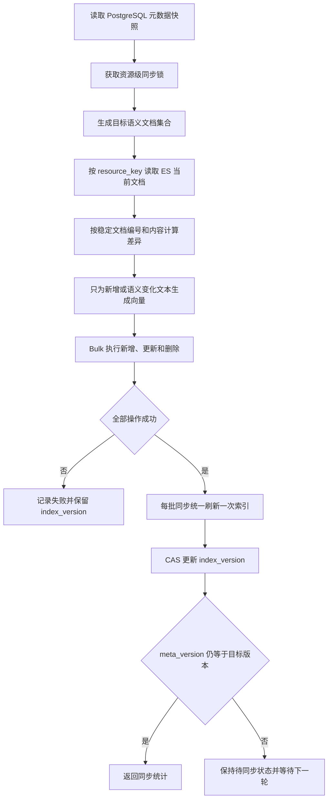

# 语义索引增量同步设计

## 1. 文档状态

| 项目 | 内容 |
| :--- | :--- |
| 设计状态 | 已实施 |
| 适用对象 | 字段语义索引、指标语义索引 |
| 数据源 | PostgreSQL 元数据 |
| 索引目标 | Elasticsearch 全文索引与稠密向量索引 |
| 核心入口 | [`MetaIndexService`](../app/metadata/services/index.py) |

本文定义资源内部文档级增量同步方案。字段和指标仍以一个元数据资源为同步与版本确认单位，每个名称、描述和别名分别对应一条 Elasticsearch 文档。

当前实现位于 [`MetaIndexService`](../app/metadata/services/index.py)、[`SemanticIndexDeltaRepo`](../app/metadata/repositories/semantic_index.py)、[`ColumnESRepo`](../app/metadata/repositories/column_index.py) 和 [`MetricESRepo`](../app/metadata/repositories/metric_index.py)。Celery Worker 返回新增、更新、删除、复用和 Embedding 数量，并通过 PostgreSQL CAS 确认索引版本。

---

## 2. 实施前实现与问题

实施前 [`MetaIndexService._sync_column_index`](../app/metadata/services/index.py) 和 [`MetaIndexService._sync_metric_index`](../app/metadata/services/index.py) 的同步流程如下：

1. 根据名称、描述、别名生成全部索引文本
2. 为全部文本重新生成向量
3. 删除该资源在 Elasticsearch 中的全部文档
4. 写入全部新文档并刷新索引
5. 将 PostgreSQL 中的 `index_version` 更新为 `meta_version`

该实现具备明确的资源边界，重复同步的计算和写入成本较高，并存在以下问题：

- 新增一个别名会重新计算名称、描述及其他别名的向量
- 调整别名顺序会改变当前文档编号，导致无实际内容变化的重建
- 删除后写入期间存在短暂检索空窗
- Elasticsearch 部分写入失败时，资源可能处于不完整状态
- 载荷字段变化会触发向量重算，即使向量文本未发生变化
- Embedding 模型或预处理规则变化缺少显式版本标识

---

## 3. 设计目标

- 只对新增或发生语义变化的文本调用 Embedding 服务
- 通过一次差异计算完成新增、更新、删除和保持不变的分类
- 别名调整顺序不产生 Elasticsearch 写入
- 仅载荷变化时复用已有向量并更新文档载荷
- 同步失败后不推进 PostgreSQL 索引版本
- 并发同步和失败重试最终收敛到同一结果
- Embedding 模型或预处理规则升级时支持受控全量重建
- 首次上线新文档编号规则时能够清理旧编号文档

### 3.1 非目标

- 本方案不调整语义检索的 BM25、KNN 和融合评分算法
- 本方案不引入跨资源的全局事务
- 字段、指标或 YAML 元数据更新成功后自动提交 Celery 同步任务，不使用 Beat 定期扫描

---

## 4. 核心模型

### 4.1 资源键

字段继续使用 [`column_resource_key`](../app/metadata/models/catalog.py) 生成无歧义联合资源键：

```text
["table_name","column_name"]
```

指标使用指标名称作为资源键。字段和指标文档均增加顶层 `resource_key`，避免删除、查询和差异比对依赖不同字段组合。

### 4.2 规范化文本

文档编号计算前执行统一文本规范化：

1. Unicode NFC 规范化
2. 去除首尾空白
3. 保留原有大小写
4. 空字符串不进入索引
5. 相同规范化文本只保留一个文档，类型优先级为 `name`、`description`、`alias`

大小写折叠会影响字段名和业务缩写的表达，首期不加入文档编号规则。后续若调整规范化规则，应同步提升预处理版本。

### 4.3 稳定文档编号

文档编号不包含文本在列表中的位置：

```text
uuid5(
  NAMESPACE_URL,
  JSON([resource_type, resource_key, canonical_text])
)
```

JSON 使用固定分隔符并保留 Unicode 字符，消除字符串拼接产生的边界歧义。相同资源下相同规范化文本始终生成相同编号。

### 4.4 Embedding 版本

每条语义索引文档增加 `embedding_revision`：

```text
{provider}:{model}:{dimensions}:{preprocess_version}
```

示例：

```text
openai:text-embedding-3-large:1024:v1
```

模型、向量维度或文本预处理规则任一发生变化时，版本随之变化。向量维度变化需要创建新索引并通过 Elasticsearch 别名完成切换，无法只更新现有 mapping。

### 4.5 领域对象

建议从最底层引入以下领域对象，并同步修改服务层和 API 调用方：

```python
@dataclass(frozen=True)
class SemanticIndexDocument:
    id: str
    resource_key: str
    text: str
    text_type: SemanticTextType
    embedding: list[float] | None
    embedding_revision: str
    payload: dict[str, Any]


@dataclass(frozen=True)
class SemanticIndexDelta:
    create: list[SemanticIndexDocument]
    update: list[SemanticIndexDocument]
    delete_ids: list[str]
    unchanged_count: int


@dataclass(frozen=True)
class SemanticIndexSyncResult:
    created_count: int
    updated_count: int
    deleted_count: int
    embedded_count: int
    unchanged_count: int
    target_version: int
```

---

## 5. 增量同步流程



### 5.1 获取目标快照

同步开始时读取资源及其 `meta_version`，将其记录为 `target_version`。后续全部目标文档由同一快照生成，避免一次同步混用多个元数据版本。

### 5.2 读取 Elasticsearch 当前状态

语义索引仓储增加以下底层接口：

```python
async def list_resource_documents(
    self,
    resource_key: str,
) -> list[SemanticIndexDocument]: ...

async def apply_delta(
    self,
    delta: SemanticIndexDelta,
) -> None: ...
```

`list_resource_documents` 只返回差异计算需要的字段，包括 `_id`、`text`、`text_type`、`embedding_revision`、载荷版本或载荷哈希。查询不需要返回完整向量。

`apply_delta` 使用 Elasticsearch Bulk API 在一个批次中混合执行 `index`、`update` 和 `delete`，并检查每个操作的结果。批次过大时按固定数量切分，全部批次成功后统一刷新一次索引。

### 5.3 差异分类

| 变化类型 | Embedding | Elasticsearch 操作 |
| :--- | :--- | :--- |
| 新增名称、描述或别名 | 只为新文本生成 | 新增文档，并更新受影响的资源载荷 |
| 删除别名或旧描述 | 无 | 删除旧文档，并更新剩余文档的资源载荷 |
| 别名顺序变化 | 无 | 无 |
| `text_type` 变化 | 复用 | `update` |
| 示例值、字段类型、引用关系等载荷变化 | 复用 | `update` |
| `embedding_revision` 变化 | 重新生成 | `index` |
| 内容与载荷均未变化 | 无 | 无 |

描述文本变化会形成“新增新文本”和“删除旧文本”两项差异。稳定编号以文本为组成部分，因此无需为同一编号覆盖不同语义向量。

### 5.4 载荷更新

字段的 `description`、`alias`、`examples`、`type`、`index_values`、引用关系，以及指标的 `description`、`alias`、`relevant_columns` 会影响检索结果组装。此类变化不改变某条文档文本时，只更新该文档的 `payload`、`meta_version` 和 `index_version`，复用现有向量。

建议在计算 `payload_hash` 前对别名和关联字段排序，保证列表顺序调整不产生更新。差异计算只比较哈希值，实际更新时写入完整载荷。

### 5.5 版本确认

PostgreSQL 仓储将当前直接赋值方法调整为条件更新：

```sql
update column_info
set index_version = :target_version
where t_name = :t_name
  and name = :c_name
  and meta_version = :target_version
```

指标采用同样规则。更新行数为 `0` 表示同步期间元数据再次变化，本轮 Elasticsearch 写入仍是有效中间状态，资源继续显示为待同步，下一轮会收敛到最新版本。

---

## 6. 一致性、并发与失败恢复

### 6.1 资源级互斥

同一资源同时只能有一个同步任务执行。首期可使用 PostgreSQL advisory lock 或独立同步任务表实现资源级锁，锁键由 `resource_type` 和 `resource_key` 计算。

不同字段和指标可以并行同步，单次请求设置并发上限，避免 Embedding 服务和 Elasticsearch 突发过载。

### 6.2 写入顺序

1. 获取目标元数据快照
2. 读取当前索引状态并计算差异
3. 在 Elasticsearch 变更前生成本轮所需的全部向量
4. 执行 Bulk 变更
5. 检查全部 Bulk 子项
6. 刷新索引
7. 条件更新 PostgreSQL 版本

向量生成失败不会改变 Elasticsearch。Bulk 任一子项失败时，本轮不推进 `index_version`，重试依靠稳定文档编号继续收敛。

### 6.3 删除与写入的检索可见性

Bulk API 可以在一次请求中提交多种文档操作，但不提供跨文档数据库事务语义。完整批次成功后统一刷新，资源级稳定编号和版本确认负责保证重试后的最终一致性。

---

## 7. Elasticsearch mapping 调整

字段和指标语义索引统一增加以下顶层字段：

| 字段 | 类型 | 用途 |
| :--- | :--- | :--- |
| `resource_key` | `keyword` | 资源查询、删除和权限过滤 |
| `meta_version` | `long` | 文档对应的元数据版本 |
| `embedding_revision` | `keyword` | Embedding 模型与预处理版本 |
| `payload_hash` | `keyword` | 判断载荷是否变化 |

现有 `payload` 可继续设置 `enabled: false`，顶层差异字段需要独立 mapping 才能参与查询。

---

## 8. API 与可观测性

现有同步接口的单一文档数量返回值调整为 `SemanticIndexSyncResult`，并同步修改路由 schema、前端生成类型和页面展示。

建议记录以下结构化日志和指标：

- `resource_type`、`resource_key`、`target_version`
- `created_count`、`updated_count`、`deleted_count`
- `embedded_count`、`unchanged_count`
- Embedding 耗时、Elasticsearch Bulk 耗时、总耗时
- Bulk 失败项数量和失败原因
- CAS 更新是否成功

`embedded_count` 能直接反映本方案节省的 Embedding 调用量。

---

## 9. 迁移方案

### 第一阶段：建立领域模型与仓储原语

1. 增加稳定文档编号和文本规范化函数
2. 为字段、指标 mapping 增加统一差异字段
3. 增加 `list_resource_documents` 和 `apply_delta`
4. 将仓储 `index` 接口替换为增量接口，并修改全部调用方

### 第二阶段：接入服务层差异计算

1. 在 `MetaIndexService` 中生成目标文档
2. 实现差异分类和选择性 Embedding
3. 增加同步结果对象
4. 将版本写入调整为 CAS

### 第三阶段：并发控制与观测

1. 增加资源级同步锁
2. 设置跨资源同步并发上限
3. 增加同步统计日志和监控指标

### 第四阶段：旧文档迁移

新编号方案首次执行时，仓储会读取资源下全部旧文档。旧编号不在目标编号集合中，会进入删除集合；目标文档使用新编号写入。迁移沿用同一差异流程，无需旧接口别名或兼容转发层。

---

## 10. 测试与验收标准

### 10.1 单元测试

- 无变化同步不调用 Embedding，不产生 Bulk 写操作
- 新增一个别名只生成一个向量，新增对应文档并完成必要的载荷更新
- 删除一个别名不生成向量，删除对应文档并完成必要的载荷更新
- 调整别名顺序不产生变化
- 修改描述只生成新描述向量并删除旧描述文档
- 仅载荷变化时复用全部向量
- `embedding_revision` 变化时重新生成全部目标向量
- 文本包含冒号、引号、Unicode 字符时文档编号仍无歧义且稳定
- Bulk 部分失败时不推进 `index_version`
- 同步期间元数据更新时 CAS 失败，资源保持待同步

### 10.2 集成测试

- 字段和指标索引均可完成首次构建及后续增量同步
- 旧编号文档在首次迁移后全部清理
- 同一资源并发同步不会互相覆盖版本状态
- 同步失败重试后 Elasticsearch 与 PostgreSQL 最新元数据一致
- BM25、KNN、权限过滤和拓扑补全的现有行为保持一致

### 10.3 验收指标

- 别名单项变更时 Embedding 调用量从资源全部文本数降为 `1`
- 无变化重试的 Embedding 调用量和 Elasticsearch 写入量均为 `0`
- 任意失败路径均不会错误标记资源为已同步
- 重复执行同一同步任务得到相同文档集合

---

## 11. 关键代码映射

- 同步服务：[`app/metadata/services/index.py`](../app/metadata/services/index.py)
- 字段语义索引仓储：[`app/metadata/repositories/column_index.py`](../app/metadata/repositories/column_index.py)
- 指标语义索引仓储：[`app/metadata/repositories/metric_index.py`](../app/metadata/repositories/metric_index.py)
- PostgreSQL 元数据仓储：[`app/metadata/repositories/postgres.py`](../app/metadata/repositories/postgres.py)
- 元数据模型与资源键：[`app/metadata/models/catalog.py`](../app/metadata/models/catalog.py)
- 同步 API：[`app/metadata/api/meta/router.py`](../app/metadata/api/meta/router.py)

## 12. 参考资料

- [Elasticsearch Bulk API](https://www.elastic.co/guide/en/elasticsearch/reference/current/docs-bulk.html)
