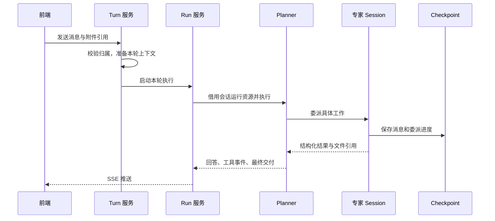

# 06. Assistant：把一个问题变成可交付的分析

用户看到的是一个聊天窗口。Assistant 要做的却不只是把消息转发给模型：它要判断这轮分析需要什么工作，安排合适的 Agent，保存中间进度，把工具输出整理成用户能理解的结果，并在刷新页面、取消任务和删除会话时保持状态一致。

理解这一模块，先分清两个问题：**谁负责分析，谁负责让分析可靠地运行。** Planner 和专家负责前者；执行服务、Checkpoint、事件流和会话生命周期负责后者。

## 1. 四个 Agent 各做什么

以“比较两年的销售趋势并解释变化”为例，Planner 可以先让 Explorer 查清销售口径并提取数据，再让 Analyst 计算同比、画图，必要时请 Reviewer 检查结论，最后向用户交付解释和文件。

| Agent | 主要职责 | 主要能力 |
| --- | --- | --- |
| Planner | 拆解问题、安排依赖、组织最终回答 | 委派专家、查看与删除专家 Session、读取文件、Shell 和图片工具 |
| Explorer | 弄清数据含义，取得可信的数据 | 元数据与查询经验召回、SQL 执行、配置的 MCP 工具，以及文件和 Shell 工具 |
| Analyst | 对已有数据进行计算、分析和展示 | 分析技能、文件与 Shell 工具、模型支持时的图片查看 |
| Reviewer | 检查口径、计算、证据和交付物 | 文件与 Shell 工具、模型支持时的图片查看 |

Analyst 和 Reviewer 没有直接配置 SQL 查询或元数据召回工具。需要补数时，它们应把缺口返回给 Planner，由 Planner 再安排 Explorer。专家也没有继续创建子 Agent 的默认工具，避免分析过程形成不受控制的嵌套委派。

Planner 的提示词要求它专注协调，不亲自做 SQL 和数据加工。这是工作分工约定，不能单独当作安全边界；实际权限仍由工具集合、后端身份校验和沙箱文件权限共同决定。

### 用小段程序安排协作

Planner 使用 QuickJS 中的 `eval` 表达调度逻辑，通过其中的 `tools.delegation` 委派专家。独立任务可以放进 `Promise.all` 并行执行，有依赖的任务则等待前一步结果。这里的 JavaScript 用来组织工作，不是替代沙箱里的数据分析环境。

委派记录会随状态保存，即使委派发生在 `eval` 内部，前端仍能展示专家工作的过程。QuickJS 默认内存上限为 64 MiB；解释器没有设置固定的总执行超时或工具调用次数上限，取消执行与专家并发控制由外围执行链负责。

## 2. 先分清 Conversation、Run 和 Session

| 名称 | 含义 | 生命周期 |
| --- | --- | --- |
| Conversation | 用户侧的一段对话 | 跨多轮消息保留，拥有历史和附件 |
| Turn | 一次用户输入或一次继续执行所形成的工作单元 | 从准备上下文到本轮结束 |
| Run | 后端正在执行这一轮工作的实例 | 当前 API 进程中的异步任务和事件缓冲 |
| Analysis | 一组相关分析工作的标识 | 用于组织专家 Session 和文件 |
| Session | 某个专家可继续使用的工作上下文 | 有独立 Checkpoint 命名空间和工作目录 |
| Delegation | Planner 发起的一次具体委派 | 对应一次工具调用，可产生结构化结果 |

同一个 Session 可以连续接收多次委派，例如先计算全年销售额，再在原有数据基础上补充季度分布。继续 Session 并不等于重新执行旧委派：新的工具调用代表新的工作，重复播放同一个工具调用则应复用已经记录的结果。

LangGraph 的 thread 标识包含用户和 Conversation；Planner 使用根命名空间，专家使用包含 Analysis、专家类型和 Session 的子命名空间。这样既能从同一对话追踪全部工作，也能隔离各专家的消息状态。

## 3. 发送一条消息后发生什么



Run 取得会话锁后执行准备阶段：检查用户是否拥有会话，把草稿会话转成正式会话，并整理本轮输入。短期数据库操作完成后，不把普通仓储事务一直带进模型请求。

执行阶段通过会话级 advisory lock 防止同一会话同时运行。`ConversationRunService` 持有真正的异步执行任务；`AgentManager` 负责可复用的运行资源，`RuntimeFactory` 负责组装这些资源，`SessionService` 管理专家工作上下文。把这几层分开，是为了让“停止一次执行”和“释放整个会话的资源”具有不同含义。

运行资源缓存默认最多保留 128 个会话，优先淘汰空闲资源；全部忙碌时可以暂时超过缓存目标。淘汰会释放相应的进程内资源和 Shell 作业，不会顺手删除数据库历史或用户文件。

如果 Planner 因输出长度等非正常结束原因停下，执行器可以自动续写，默认最多 3 次。这个机制用于完成当前回答，不是无限重试模型故障，也不是自动接受一个新的用户任务。

## 4. 专家怎样返回结果

专家返回的不是随意拼接的文本，而是包含状态、说明、交付文件和必要修复信息的结构化结果：

| 状态 | Planner 应如何理解 |
| --- | --- |
| `completed` | 本次工作已经完成，可以使用其结论或文件 |
| `needs_repair` | 发现需要其他工作补足的问题，应根据修复请求重新安排 |
| `failed` | 本次工作失败，应检查失败原因再决定后续动作 |

结构化结果限制文件、警告、修复请求和失败原因的数量，并检查状态与字段是否匹配。修复请求还要指向合法目标，不能让专家以无意义的自我修复请求制造循环。模型支持原生结构化输出时使用对应能力，否则通过工具策略获取结构化结果。

一次结果格式不合格时，系统允许一次内部纠正；仍然不合法就作为失败处理。这类内部纠正消息不会原样出现在用户历史中。复用已完成委派的结果时，也会重新检查文件和修复目标，不能只因为旧记录存在就假定资源仍然有效。

同一专家 Session 使用数据库锁互斥，避免两次委派同时修改同一上下文。每个会话默认允许 8 个并行专家任务、128 个专家 Session；Session 容量也计算正在创建但尚未写入首个 Checkpoint 的部分，避免并发创建绕过限制。

## 5. 历史消息与恢复执行不是同一件事

Checkpoint 保存图执行的状态；前端历史是从这些状态整理出来的阅读视图。历史接口不会为了展示聊天记录重新创建整个 Agent，也不会把框架内部的每一条消息暴露给用户。

整理历史时，需要处理两类数据：已经提交的状态，以及执行过程中已经写入、尚未合并进下一份 Checkpoint 的 pending writes。只读取最新 Checkpoint 中的 `messages`，可能漏掉刚完成的工具结果；把全部 pending writes 生硬拼进去，又可能混入错误或中断控制信息。

当前读取器借助 LangGraph 的通道与待执行任务计算逻辑，按任务对应关系恢复业务状态，区分普通消息、委派记录和控制信息，也处理通过 `Send` 派发的任务。判断是否仍有待执行工作时，可以只检查调度状态，不必重建全部历史消息。

这部分依赖框架内部行为，是项目中需要谨慎升级的一处。它服务于当前项目的消息和委派状态，并不是任意 LangGraph 图的通用读取器。

## 6. 流式页面怎样与后台保持一致

运行中的事件通过 SSE 推送，包含回答增量、工具活动、专家委派和执行状态。服务端每 15 秒发送心跳，帮助连接保持活跃。事件投影负责把内部消息转换成前端能够稳定消费的格式。

浏览器断开只取消订阅，不自动取消分析。重新连接时，服务端可以重放当前 Run 留存的事件；默认缓冲上限为 512 条、2 MiB，相邻文本增量会尽量合并。每个订阅者也有独立容量限制，消费太慢会断开该订阅，避免无限占用内存。

这里不是持久化事件队列：没有基于 `Last-Event-ID` 的精确断点续传，Run 结束后也不永久保留其内存事件缓冲。已完成内容应通过历史接口重新取得。用户主动停止时，后端才取消对应执行任务，并清理其运行活动。

Run 和事件订阅都属于当前 API 进程。部署多个 API 实例时，后续订阅和停止请求需要到达持有该 Run 的实例；PostgreSQL 锁只能阻止重复执行，不能把事件或取消指令转发给另一台服务器。

## 7. 模型看到什么，用户看到什么

模型上下文会在调用前补充附件和召回资料。Checkpoint 尽量保存引用，避免把每次展开的大段资料重复写进历史。语义召回引用在再次展开时按当前权限过滤；查询经验还要求角色和权限指纹匹配。旧会话中的召回引用不能保留已撤销的访问权限。

用户历史会过滤内部系统消息、格式纠正消息和结构化结果工具噪声，并把委派、附件和正常回答组织成可阅读内容。模型提供的思考事件可以用于展示过程，但它们不替代执行记录或数据证据，也不是每个模型都会提供。

最终文件通过独占一行的交付指令声明，例如：

```text
[[DATAAGENT_ARTIFACT:/data/<conversation>/sessions/<analysis>/<agent>/<session>/销售趋势.html]]
```

交付文件可以来自当前会话的 `sessions/` 或 `uploads/` 目录。前者保存专业 Agent 的工作文件，后者保存用户上传的资料；例如，将用户上传的图片返回为附件时可以使用：

```text
[[DATAAGENT_ARTIFACT:/data/<conversation>/uploads/销售趋势.png]]
```

这条指令只有出现在正常的最终回答、且不在代码围栏中时才会被识别。系统校验文件引用后，将其转换为附件并去重；无效引用不会凭空变成可下载文件。下载接口仍然校验会话归属和路径权限。文件存储和专家间读写规则见 [Sandbox](04_沙箱与隔离工作区.md)。

## 8. 模型和外部工具如何接入

模型配置显式区分供应商、接口协议、模型能力和上下文容量。不能把“接口长得像 OpenAI”理解成所有能力完全相同；图片输入和结构化输出都应以配置的模型能力为准。

工厂针对 Responses、DeepSeek Responses、OpenRouter 及其他受支持的模型路径做适配。例如 DeepSeek Responses 路径处理工具调用间所需的推理内容和响应事件差异；这些属于协议转换，不是另建一套对话状态。HTTP 客户端有明确的资源归属，后台标题任务也使用自己的客户端，避免跨事件循环复用连接。

MCP 工具由配置接入 Explorer。加载时会检查名称冲突，避免覆盖内置的委派、文件、Shell 或图片工具。外部工具可用性仍取决于对应服务、凭据和网络；接入一个 MCP 工具并不自动让它获得 Doris 查询身份。

## 9. 会话怎样结束和清理

新建会话先是草稿，首次发送消息后转为正式会话。首次输入还会触发后台标题生成，更新时避免覆盖用户已经手动修改的标题。长期未使用的草稿默认在 24 小时后具备清理条件，由生命周期任务处理。

删除会话先停止当前进程中的执行，再取得生命周期锁并标记删除。接口隐藏已标记会话，后台继续清理 Checkpoint、召回记录、会话文件和会话数据。删除标记与沙箱墓碑阻止资源在清理期间又被创建。

如果其他进程仍持有会话执行锁，当前进程不能直接取消远端任务；清理需要等待重试。用户注销则进一步删除该用户的全部会话及整个沙箱，见 [Workflows](07_跨模块工作流.md)。

## 10. 从哪里读代码

| 想了解的事情 | 入口 |
| --- | --- |
| 一条消息如何开始执行 | [Turn 服务](../app/assistant/execution/turn.py)、[Run 服务](../app/assistant/execution/run.py) |
| 运行资源和专家 Session | [Manager](../app/assistant/execution/manager.py)、[RuntimeFactory](../app/assistant/execution/runtime_factory.py)、[SessionService](../app/assistant/execution/session_service.py) |
| Agent 的具体分工与工具 | [Planner](../app/assistant/agents/planner/agent.py)、[专家组装](../app/assistant/agents/specialist_agent.py)、[模型工厂](../app/assistant/model_factory.py) |
| 状态还原与用户历史 | [Checkpoint 读取](../app/assistant/checkpoints/reader.py)、[历史服务](../app/assistant/conversations/history.py)、[事件投影](../app/assistant/events/projection.py) |
| 删除和后台处理 | [生命周期](../app/assistant/conversations/lifecycle.py)、[后台任务](../app/assistant/tasks.py) |

接口清单见 [接口索引](08_接口索引.md)。阅读执行代码时，可以依次追踪“发送一条消息”“委派一次查询”“刷新后读取历史”，不必从所有类的构造函数开始。
