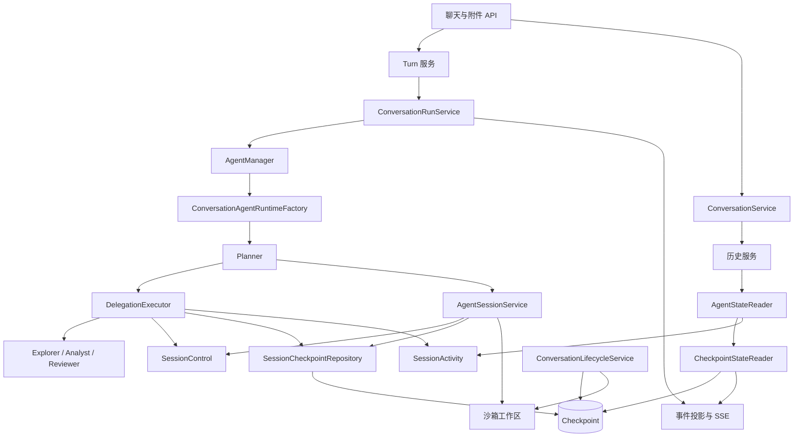
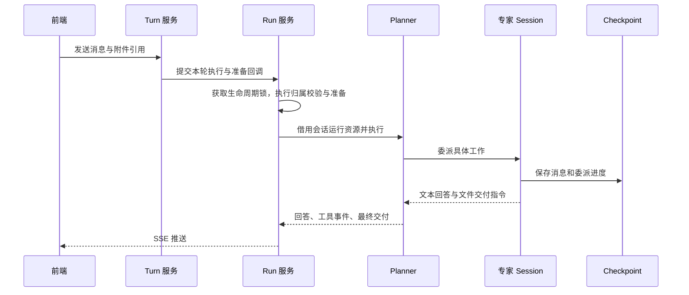

# 06. Assistant：对话执行与多智能体协作

Assistant 管理用户 Conversation、Planner 调度、专业 Agent Session、Checkpoint、流式事件、附件投影和会话清理。Agent 负责推理与分析，执行服务负责互斥、状态保存、恢复、取消和资源释放。

## 1. 提供哪些功能

| 功能 | 提供的能力 | 使用方 |
| --- | --- | --- |
| 会话与附件 | 创建、列表、标题、历史、附件上传下载、会话删除 | 聊天页面 |
| 回合执行 | 接收输入、恢复待执行任务、查询状态、停止运行 | 聊天 API |
| 多 Agent 协作 | Planner 委派 Explorer、Analyst、Reviewer，复用专家 Session | 分析任务 |
| 实时消息 | SSE 回答与思考增量、工具及专家活动、有界事件重放 | 前端订阅者 |
| 召回上下文 | 按稳定 query 检索、累积、查询、合并和删除上下文 | Explorer 工具 |
| 文件交付 | 识别产物指令，校验后投影为可下载附件 | 用户与消息展示 |
| 状态与清理 | Checkpoint 恢复、运行资源缓存、草稿回收和用户会话清理 | API、后台任务、Workflows |

## 2. 如何使用

### 2.1 聊天页面与 HTTP 调用

用户登录并绑定查询角色后，可新建会话、上传资料并发送分析问题。后端把工作过程通过 SSE 返回；前端可查看专家详情、停止分析和下载产物。

接口前缀为 `/api/v1/chat`，所有资源操作检查身份及会话归属：

| 操作 | 方法与路径 |
| --- | --- |
| 创建、列表、改名 | `POST /create`、`GET /ls`、`POST /update` |
| 读取历史 | `GET /ls/{conversation_id}` |
| 发送输入、恢复工作 | `POST /stream`、`POST /{conversation_id}/resume` |
| 当前状态、订阅、停止 | `GET /{conversation_id}/run`、`GET /{conversation_id}/events`、`POST /{conversation_id}/stop` |
| 专家委派历史 | `GET /{conversation_id}/subagents/{analysis_id}/{agent_type}/{session_id}/runs/{delegation_id}/messages` |
| 附件上传、下载、删除 | `POST /attachment/upload`、`GET /attachment/get`、`POST /attachment/delete` |
| 删除会话或草稿 | `POST /delete`、`DELETE /draft/{conversation_id}` |

首次执行先创建会话，再提交含 `conversation_id` 和用户消息的 stream 请求。连接断开后可查询 run 状态并订阅 events；已完成内容通过历史接口读取。

### 2.2 跨模块使用召回与清理能力

其他模块从 `app.assistant` 导入服务，数据类型从 `app.assistant.contracts` 导入。调用方接收已创建的服务实例，直接调用方法。

| 公开入口 | 方法与用途 |
| --- | --- |
| `SemanticRecallService` | `recall_context()` 检索并累计；`list_recalls()`、`get_recall()` 查询；`merge_recalls()`、`delete_recalls()` 管理上下文 |
| `ConversationLifecycleService` | `request_conversation_deletion()` 标记删除；`delete_conversation_resources()` 清理单会话；`delete_user_conversations()` 清理用户全部会话 |
| `conversation_lifecycle_resources()` | 为后台清理提供独立资源上下文及会话服务、沙箱实例 |

以下示例在异步业务方法中使用已注入的 `recalls`，用户和会话标识来自服务端上下文：

```python
from app.metadata.contracts import SemanticResourceRecallRequest

update = await recalls.recall_context(
    user_id,
    conversation_id,
    query="月度销售收入",
    request=SemanticResourceRecallRequest(
        terms=["销售收入", "订单日期"],
        resource_types=["column", "metric"],
    ),
)
record = await recalls.get_recall(user_id, conversation_id, "月度销售收入")
```

清理调用由会话管理或注销工作流发起。后台资源上下文负责退出时释放连接及本进程租约，业务方法负责目标会话的实际删除。

### 2.3 Agent 分工与工具

| Agent | 主要职责 | 主要能力 |
| --- | --- | --- |
| Planner | 拆解问题、安排依赖、组织最终回答 | 委派专家、查看与删除专家 Session、读取文件、Shell 和图片工具 |
| Explorer | 弄清数据含义，取得可信的数据 | 元数据与查询经验召回、SQL 执行、配置的 MCP 工具，以及文件和 Shell 工具 |
| Analyst | 对已有数据进行计算、分析和展示 | 分析技能、文件与 Shell 工具、模型支持时的图片查看 |
| Reviewer | 检查口径、计算、证据和交付物 | 文件与 Shell 工具、模型支持时的图片查看 |

`agents/runtime.py` 的 `create_specialist` 方法在委派时取得 Session 沙箱、创建 Shell 运行资源，并就地准备角色工具，通过公共 `create_agent` 创建专家。提示词按专家类型加载，Explorer 组合召回、SQL 与共享 MCP 工具，Analyst 挂载技能；共用的委派持久化状态位于 `agents/specialist_state.py`。

Analyst 和 Reviewer 没有直接配置 SQL 查询或元数据召回工具。需要补数时，它们应把缺口返回给 Planner，由 Planner 再安排 Explorer。专家也没有继续创建子 Agent 的默认工具，避免分析过程形成不受控制的嵌套委派。

工具请求模型由框架在入口校验，非法参数返回框架工具错误，不执行业务。委派工具的运行时字段由框架注入并从模型 schema 隐藏；召回工具通过 RunnableConfig 接收服务端身份。业务执行失败按工具错误码和分类返回，取消向上传播。图片工具保存路径引用，读取已持久化请求时独立校验。

Planner 的提示词要求它专注协调，不亲自做 SQL 和数据加工。这是工作分工约定，不能单独当作安全边界；实际权限仍由工具集合、后端身份校验和沙箱文件权限共同决定。

#### 直接工具委派

Planner 直接调用 `delegation` 委派专家。独立任务可以在同一轮发起多个工具调用并行执行，有依赖的任务则等待前一步结果。专业 Agent 的数据分析在 Docker 沙箱中执行。

委派记录随状态保存，前端通过 `delegation` 工具调用 ID 关联专家活动，展示实时过程和历史记录。取消执行与专家并发控制由执行链负责。

## 3. 关键业务规则

### 3.1 会话与执行标识

会话管理与回合操作位于 `conversations/`，执行机制、Session 管理、消息投影和召回分别位于 `execution/`、`sessions/`、`messages/`、`recall/`。`repositories/` 负责持久化访问，公开数据协议按功能放在 `contracts/`，框架执行活动位于 `execution/events.py`。Web 入口 `app/runtime.py` 直接创建运行时缓存、状态读取和 Run 服务，并让它们共享同一份活动注册表；`agents/runtime.py` 管理模型及 Agent 图的装配和资源生命周期。

| 名称 | 含义 | 生命周期 |
| --- | --- | --- |
| Conversation | 用户侧的一段对话 | 跨多轮消息保留，拥有历史和附件 |
| Turn | 一次用户输入或一次继续执行所形成的工作单元 | 从准备上下文到本轮结束 |
| Run | 后端正在执行这一轮工作的实例 | 当前 API 进程中的异步任务和事件缓冲 |
| Analysis | 一组相关分析工作的标识 | 用于组织专家 Session 和文件 |
| Session | 某个专家可继续使用的工作上下文 | 有独立 Checkpoint 命名空间和工作目录 |
| Delegation | Planner 发起的一次具体委派 | 对应一次工具调用，返回文本及文件交付指令 |

同一个 Session 可以连续接收多次委派，例如先计算全年销售额，再在原有数据基础上补充季度分布。继续 Session 并不等于重新执行旧委派：新的工具调用代表新的工作，重复播放同一个工具调用则应复用已经记录的结果。

LangGraph 的 thread 标识包含用户和 Conversation；Planner 使用根命名空间，专家使用包含 Analysis、专家类型和 Session 的子命名空间。这样既能从同一对话追踪全部工作，也能隔离各专家的消息状态。

### 3.2 专家委派与 Session 续接

专业 Agent 直接输出文本。运行时的委派结果包含 Session 身份、执行状态和原始 `content` 文本。`completed` 表示模型正常返回完整文本；业务目标是否完成、是否需要补充数据，由 Planner 根据正文判断。模型异常或缺少完整终答记为 `failed`，取消单独记录。完整终答必须来自本轮完成的模型回答。

发现上游输入问题时，专业 Agent 按提示词约定，在正文中说明目标 Agent、Session、依据和预期结果。Planner 核对目标后续接原 Session，修补完成再安排下游工作。

专业 Agent 与 Planner 均通过独占一行的 `[[DATAAGENT_ARTIFACT:<absolute_path>]]` 交付文件。历史消息、实时终态消息和委派结果展示共用文件指令解析与 Sandbox 下载验证；代码围栏内示例不解析，重复有效路径去重，无效指令保留原文，不生成下载附件。模型原始回答和 Checkpoint 保持不变，复用委派结果后展示附件时仍重新验证文件。

同一专家 Session 使用数据库锁互斥，避免两次委派同时修改同一上下文。每个会话默认允许 8 个并行专家任务、128 个专家 Session；Session 容量也计算正在创建但尚未写入首个 Checkpoint 的部分，避免并发创建绕过限制。

| 状态或标识 | 作用 |
| --- | --- |
| analysis_id | 在 Conversation 内区分分析目标 |
| agent_type + session_id | 在分析目标下定位专业工作上下文 |
| checkpoint_ns | 持久化 Session 的消息、任务和委派状态 |
| delegation_id | 区分一次具体工具委派，重放时定位既有结果 |
| delegation_records | 按委派 ID 保存运行状态和文本结果 |

新委派续接原 Session 的消息与文件；同一委派 ID 重放时，先核对已保存结果的 Session 身份，再复用执行状态和原始正文。文件引用在消息投影时校验。持久化状态仍为 running 的委派，若没有对应活跃执行，对外展示为 cancelled。

Session 锁保护同一上下文，容量预留覆盖尚未创建首个 Checkpoint 的新 Session。委派退出先清理遗留 Shell Job，再释放执行边界；取消期间也等待清理收尾。

### 3.3 订阅、重连与停止

运行中的事件通过 SSE 推送，包含回答增量、工具活动、专家委派和执行状态。服务端每 15 秒发送心跳，帮助连接保持活跃。事件投影负责把内部消息转换成前端能够稳定消费的格式。

浏览器断开只取消订阅，不自动取消分析。重新连接时，服务端可以重放当前 Run 留存的事件；默认缓冲上限为 512 条、2 MiB，相邻文本增量会尽量合并。每个订阅者也有独立容量限制，消费太慢会断开该订阅，避免无限占用内存。

这里不是持久化事件队列：没有基于 `Last-Event-ID` 的精确断点续传，Run 结束后也不永久保留其内存事件缓冲。已完成内容应通过历史接口重新取得。用户主动停止时，后端才取消对应执行任务，并清理其运行活动。

Run 和事件订阅都属于当前 API 进程。部署多个 API 实例时，后续订阅和停止请求需要到达持有该 Run 的实例；PostgreSQL 锁只能阻止重复执行，不能把事件或取消指令转发给另一台服务器。

### 3.4 文件交付

附件上下文在模型调用前准备。语义召回则直接保存固定工具结果：同一 query 首次返回全量，后续返回增量和本次实际召回数量，避免重复内容并保持历史消息前缀稳定。新检索和显式读取按当前权限过滤，历史消息不动态改写；SQL 执行仍校验当前权限。

用户历史会过滤内部系统消息，专业 Agent 的正文和思考按普通消息展示，并把委派、附件和正常回答组织成可阅读内容。模型提供的思考事件可以用于展示过程，但它们不替代执行记录或数据证据，也不是每个模型都会提供。

最终文件通过独占一行的 DATAAGENT_ARTIFACT 交付标记声明，标记携带容器内的产物绝对路径。允许的文件来源包括当前 Conversation 的 sessions 和 uploads，分别对应专业工作区和用户上传资料。

这条指令只有出现在正常的最终回答、且不在代码围栏中时才会被识别。系统校验文件引用后，将其转换为附件并去重；无效引用不会凭空变成可下载文件。最终回答和委派的附件统一通过 Sandbox 批量检查；历史中已删除或不可下载的文件不再展示为附件。下载接口仍然校验会话归属和路径权限。

### 3.5 query 上下文与缓存

Explorer 往往先找销售指标，再补地区字段，最后确认退款状态。如果每次工具调用都丢掉上一步，模型要不断重复检索。因此系统以用户、Conversation 和稳定 query 累积上下文。

query 是业务键，不是每次换一个说法的日志文本。后续补搜应复用相同 query，仅改变检索词和资源类型。合并时保留更新的元数据版本、较优排名和去重后的来源说明，不把每轮排名重新计算成一个全局分数。

搜索在写锁之外执行；保存时按 query 加锁，读取当前快照再合并，避免并发结果互相覆盖。快照存入助手数据库，新召回可以追加快照；显式合并或删除会移除相关历史，因此它不是不可删除的审计账本。

| 工具 | 对快照做什么 |
| --- | --- |
| `recall_context` | 检索并累积指定 query 的语义资源与查询经验；首次返回全量，后续返回增量及本次召回数量 |
| `list_recalls` | 列出当前 Conversation 的最近 query 摘要 |
| `get_recall` | 读取某个 query 的最新累计结果 |
| `merge_recalls` | 把来源 query 的语义资源并入目标，再删除来源；经验保留目标自己的结果 |
| `delete_recalls` | 删除整个 query，或指定表、字段、值、指标、经验；一次调用中 query 不重复 |

Checkpoint 固定保存工具当次返回的完整 JSON，模型请求和历史展示直接使用这份内容。`recall_context` 的首次结果为 `mode=full`，后续为 `mode=delta`，只包含新增或变更的模型可见信息；排名变化不会重复发送元数据。增量比较使用 query 写锁内读取的前后快照，避免并发调用都认为同一资源是新增。

`recalled_counts` 分别给出本次授权后的检索结果中表、字段、字段值、指标及 SQL 经验的数量，统计发生在累计合并前。表和字段包含关系补充，经验数量包含本次采用的有效缓存；重复命中仍计数，不能把该字段理解为新增量。当前检索的失败范围、警告与截断状态同时返回，空增量不代表检索没有命中。

增量表结构按表名、字段名组织，只返回改变的属性；`values` 仅列新增字段值，`removed` 表示移除的资源。`get_recall` 和 `merge_recalls` 显式返回操作时的完整上下文，删除返回固定确认。后续操作不会改变已经保存的工具消息，有需要时调用 `get_recall` 重新获取全量。

执行 `recall_context` 时，查询经验缓存只有在角色、权限指纹匹配且检索时间未满一天时才会复用，否则重新检索。经验检索失败不会把“暂时没有结果”缓存成一整天的正常成功。

显式读取已保存的快照时，系统检查当前角色、权限指纹和资产访问范围，但不检查这一天的缓存期限，也不重新查询经验的启用状态和元数据版本。因此，禁用经验或修改元数据后，已有快照仍可能包含此前保存的经验；一天期限控制搜索时的缓存复用；快照随所属 query 和 Conversation 保留或清理。

新检索和显式读取仍按当前权限过滤；已经保存的历史工具消息固定保留当次内容，不随权限或快照变化而重写。实际 SQL 执行继续按当前权限校验。`app.assistant.SemanticRecallService` 接收 Identity、Metadata、Query 的公开用例与助手数据库资源，负责授权、组合检索、查询经验缓存及记录保存的编排。召回快照使用 `AssistantBase`，保存在助手 PostgreSQL 中。读取目录的数据库会话在外部搜索前关闭；同次操作复用权限快照，独立读取重新授权。Assistant 工具只校验参数、传递服务端身份并投影结果。

### 3.6 草稿、标题与删除

前端新建会话使用草稿，首次发送消息后转为正式会话；API 创建请求通过 `is_draft` 指定是否创建草稿。首次输入还会触发后台标题生成，更新时避免覆盖用户已经手动修改的标题。长期未使用的草稿默认在 24 小时后具备清理条件，由生命周期任务处理。

删除会话先停止当前进程中的执行，再取得生命周期锁并标记删除。接口隐藏已标记会话，后台继续清理 Checkpoint、召回记录、会话文件和会话数据。删除标记与沙箱墓碑阻止资源在清理期间又被创建。

如果其他进程仍持有会话执行锁，当前进程不能直接取消远端任务；清理需要等待重试。用户注销则进一步删除该用户的全部会话及整个沙箱。

## 4. 内部实现

### 4.1 目录与职责

```text
assistant/
├── __init__.py          跨模块公开入口
├── conversations/
│   ├── service.py       会话目录、历史查询与删除请求
│   ├── turns.py         回合受理、恢复、订阅和停止
│   ├── lifecycle.py     删除标记、跨存储清理与短事务
│   ├── resources.py     后台清理资源的创建与释放
│   └── scheduler.py     会话标题及删除任务提交
├── execution/           Run、Planner、委派、运行时缓存和 Shell 作业
├── sessions/            Session 管理、锁与容量控制、状态读取和检查点寻址
├── messages/            消息历史、内容、投影、增量流与标题
├── recall/              组合召回、累计上下文和记录清理
├── agents/              Agent 图、模型、工具、中间件与 agents/runtime.py
├── attachments.py      附件上传、下载和删除
├── api/                 聊天及附件接口、共享请求依赖
├── repositories/        会话、召回、Checkpoint、Session 与墓碑访问
├── models/              模块独立的 ORM 注册表及模型、Session 身份
├── contracts/           按会话、消息、Session、召回分组的公开协议
├── errors.py            业务异常
├── resource_loader.py   提示词与技能资源定位
└── tasks.py             Celery 任务执行入口
```


```mermaid
flowchart TD
    API[聊天与附件 API] --> TURN[Turn 服务]
    TURN --> RUN[ConversationRunService]
    RUN --> MANAGER[AgentManager]
    MANAGER --> FACTORY[ConversationAgentRuntimeFactory]
    FACTORY --> PLANNER[Planner]
    PLANNER --> DELEGATE[DelegationExecutor]
    PLANNER --> SESSION[AgentSessionService]
    DELEGATE --> SPECIALIST[Explorer / Analyst / Reviewer]
    DELEGATE --> CONTROL[SessionControl]
    SESSION --> CONTROL
    SESSION --> STORE[SessionCheckpointRepository]
    DELEGATE --> STORE
    STORE --> PG[(Checkpoint)]
    SESSION --> SANDBOX[沙箱工作区]
    RUN --> EVENTS[事件投影与 SSE]
    API --> CONVERSATION[ConversationService]
    CONVERSATION --> HISTORY[历史服务]
    HISTORY --> STATE[AgentStateReader]
    STATE --> READER[CheckpointStateReader]
    STATE --> ACTIVE[SessionActivity]
    DELEGATE --> ACTIVE
    READER --> PG
    READER --> EVENTS
    LIFE[ConversationLifecycleService] --> PG
    LIFE --> SANDBOX
```

| 子域 | 主要职责 |
| --- | --- |
| Conversations | Conversation 归属、草稿、标题、历史、回合受理与删除流程 |
| Execution | Run、Planner 执行、Runtime 缓存、委派生命周期与 Shell 作业 |
| Sessions | 专家 Session 管理、锁与容量控制、状态读取和检查点寻址 |
| Messages | 内容识别、历史与实时消息投影、增量合并和标题生成 |
| Recall | 组合检索、查询经验缓存、累计上下文与记录清理 |
| Agents | Planner 和专家的提示词、工具、Skill、模型及中间件装配 |
| Attachments | 会话附件上传、下载与删除 |
| Models / Repositories | Conversation、删除墓碑、累计召回快照和 Checkpoint 持久化访问 |
| Contracts | 会话、消息、Session、召回与 SSE 公开协议 |
| Tasks | 标题生成、过期草稿和待删除会话清理 |

SQL 校验与执行、业务目录搜索、容器文件操作分别调用对应模块。Assistant 负责将它们绑定到当前用户与会话，提供 Agent 工具和前端可读结果。

其他模块从 `app.assistant` 导入 `ConversationLifecycleService`、`SemanticRecallService` 和清理任务资源上下文。HTTP 依赖在 `api/dependencies.py` 共享会话仓储；聊天与附件各自组装请求服务。生命周期服务直接持有数据库管理器，在内部打开短会话和事务；后台清理资源由 `conversations/resources.py` 管理。

### 4.2 回合执行和运行资源


```mermaid
sequenceDiagram
    participant UI as 前端
    participant Turn as Turn 服务
    participant Run as Run 服务
    participant Planner as Planner
    participant Expert as 专家 Session
    participant PG as Checkpoint
    UI->>Turn: 发送消息与附件引用
    Turn->>Run: 提交本轮执行与准备回调
    Run->>Run: 获取生命周期锁，执行归属校验与准备
    Run->>Planner: 借用会话运行资源并执行
    Planner->>Expert: 委派具体工作
    Expert->>PG: 保存消息和委派进度
    Expert-->>Planner: 文本回答与文件交付指令
    Planner-->>Run: 回答、工具事件、最终交付
    Run-->>UI: SSE 推送
```

Run 取得会话锁后执行准备阶段：检查用户是否拥有会话，把草稿会话转成正式会话，并整理本轮输入。短期数据库操作完成后，不把普通仓储事务一直带进模型请求。

执行阶段通过会话级 advisory lock 防止同一会话同时运行。`ConversationRunService` 持有真正的异步执行任务；`AgentManager` 负责可复用的运行资源，`ConversationAgentRuntimeFactory` 负责组装这些资源，`AgentSessionService` 管理专家工作上下文，`DelegationExecutor` 执行单次委派，两者共用 `SessionControl` 的锁和容量规则。把这几层分开，是为了让“停止一次执行”和“释放整个会话的资源”具有不同含义。

运行资源缓存默认最多保留 128 个会话，优先淘汰空闲资源；全部忙碌时可以暂时超过缓存目标。淘汰会释放相应的进程内资源和 Shell 作业，不会顺手删除数据库历史或用户文件。

如果 Planner 因输出长度等非正常结束原因停下，执行器可以自动续写，默认最多 3 次。这个机制用于完成当前回答，不是无限重试模型故障，也不是自动接受一个新的用户任务。

### 4.3 Checkpoint 读取

Checkpoint 保存图执行的状态；前端历史是从这些状态整理出来的阅读视图。历史接口不会为了展示聊天记录重新创建整个 Agent，也不会把框架内部的每一条消息暴露给用户。

整理历史时，需要处理两类数据：已经提交的状态，以及执行过程中已经写入、尚未合并进下一份 Checkpoint 的 pending writes。只读取最新 Checkpoint 中的 `messages`，可能漏掉刚完成的工具结果；把全部 pending writes 生硬拼进去，又可能混入错误或中断控制信息。

当前读取器借助 LangGraph 的通道与待执行任务计算逻辑，按任务对应关系恢复业务状态，区分普通消息、委派记录和控制信息，也处理通过 `Send` 派发的任务。判断是否仍有待执行工作时，可以只检查调度状态，不必重建全部历史消息。

这部分依赖框架内部行为，是项目中需要谨慎升级的一处。它服务于当前项目的消息和委派状态，并不是任意 LangGraph 图的通用读取器。

### 4.4 模型、技能与 MCP

模型配置显式区分供应商、接口协议、模型能力和上下文容量。不能把“接口长得像 OpenAI”理解成所有能力完全相同；图片输入应以配置的模型能力为准。

模型供应商支持 OpenAI 和 DeepSeek。工厂提供 Responses 协议适配，其中 DeepSeek Responses 路径处理工具调用间所需的推理内容和响应事件差异。HTTP 客户端有明确的资源归属，后台标题任务也使用自己的客户端，避免跨事件循环复用连接。

MCP 工具由 `agents/mcp.py` 根据连接配置加载，在运行时初始化时保存，供 Explorer 使用。接入配置需保证工具名称与内置工具区分。外部工具可用性取决于对应服务、凭据和网络；Doris 查询身份由查询模块管理。

Planner 与专业 Agent 共用 `agents/agent.py` 构造入口，通过 `agents/filesystem.py` 装配文件系统，显式选择文件工具和可选技能挂载；图、文件中间件和附件上下文共用返回的后端。角色提示词存放在 `resources/prompts/agents/`，公共文件协议和标题提示词存放在 `resources/prompts/`；文件读写规则集中在公共文件协议中。Skill 存放在 `resources/skills/<skill>/`，供 Analyst 使用，容器中的挂载路径为 `/skills/analyst/`。`app/assistant/resource_loader.py` 按源码位置定位资源，不依赖启动工作目录；调用方仅负责加载和传入模板变量。部署时须将 `resources/` 与 `app/` 一同保留。创建 Analyst 时通过 `analyst_skill_mount()` 取得技能挂载配置，以 `SandboxReadonlyMount` 传入 Agent 和文件系统装配。Sandbox 初始化时使用同一配置函数设置容器只读挂载。文件工具与容器挂载均禁止改写技能。统一的消息上下文中间件在调用前准备附件和 Shell Job 上下文，在调用后补充模型响应的创建时间。内部工具记录、公开活动和最终用户消息按各自协议投影。

Planner 默认模型来自 lm_config.active，专家配置为 default 时跟随，也可引用独立模型定义。相同配置名的模型在当前工厂内复用；image_inputs 决定图片工具，专业 Agent 统一使用文本输出。

### 4.5 状态归属

| 状态 | 保存位置 | 恢复与清理行为 |
| --- | --- | --- |
| Conversation 目录、删除标记 | Assistant PostgreSQL | 页面列表与归属判断，删除流程据此恢复 |
| Planner/专家状态及委派结果 | LangGraph PostgreSQL | 支持历史读取与未完成图执行恢复 |
| 上传、CSV、脚本与报告 | 用户沙箱卷 | 根据会话/Session 生命周期保留或删除 |
| 累计召回与查询经验缓存 | Assistant PostgreSQL | 按当前权限读取，随会话清理 |
| Run 与订阅者 | 当前 API 进程 | 断开订阅不取消执行，进程退出后无法原样恢复 |
| SSE 重放窗口 | 当前 Run 内存 | 有界缓冲，不是完整历史存储 |
| Shell 作业注册表 | 当前 Shell Runtime | 委派退出或 Runtime 关闭时清理，不保证跨进程接管 |

多个 API Worker 共用 Checkpoint 和数据库锁，但没有跨进程事件总线与取消总线。同一 Run 的启动、查询、订阅和停止需路由到拥有它的进程。数据库锁只能阻止冲突执行，不能让另一进程直接接管正在运行的模型调用。

格式合法、文件存在和分析正确分别验证。文件交付协议及 Reviewer 提供审查流程，实际结果仍需要与查询依据和产物内容一致。

### 4.6 标题与消息投影

标题服务只负责模型调用、输入截断和标题整理。后台任务在模型返回有效标题并关闭模型资源后，才打开数据库会话，用短事务按用户、Conversation、原即时标题和未删除状态条件更新。空输出、模型失败或取消不会创建数据库资源，也不会覆盖即时标题或用户手动改名。

最终产物指令在合并后的文本中扫描，围栏和指令可以横跨内容块；只移除代码围栏外且已验证的独占行指令，投影保留其他内容块顺序。改动只作用于新建的接口消息，Checkpoint 原始消息保持不变。正文和思考的空增量均跳过，首个非空增量才设置各自的 reset。

## 5. 异常与排障

| 现象 | 优先检查 |
| --- | --- |
| 无法开始分析 | 用户分析资格、会话归属、删除状态和会话锁 |
| 专家委派失败 | Session 锁、并行及容量上限、模型错误和完整终答 |
| 页面断线但后台仍运行 | Run 状态；重连订阅或显式调用 stop |
| 多实例下查不到 Run | 请求是否路由到持有该 Run 的 API 进程 |
| 页面重连后内容不完整 | SSE 缓冲范围、订阅容量；通过历史接口重新获取已完成消息 |
| 产物标记未变成附件 | 独占行格式、代码围栏、最终回答状态、文件归属及可下载性 |
| 召回重复或上下文割裂 | 后续补搜是否复用相同 query；full／delta 与 recalled_counts 的含义 |
| 标题没有自动更新 | 模型是否返回有效标题、是否已手工改名、标题任务日志 |
| 删除返回忙碌或未完成 | 当前 Run、跨进程会话锁、pending 清理和沙箱状态 |

Checkpoint、Run、Shell 作业和沙箱文件分别拥有自己的生命周期。排查时先确定缺失的是持久记录、内存执行还是文件资源，再查看对应组件。
