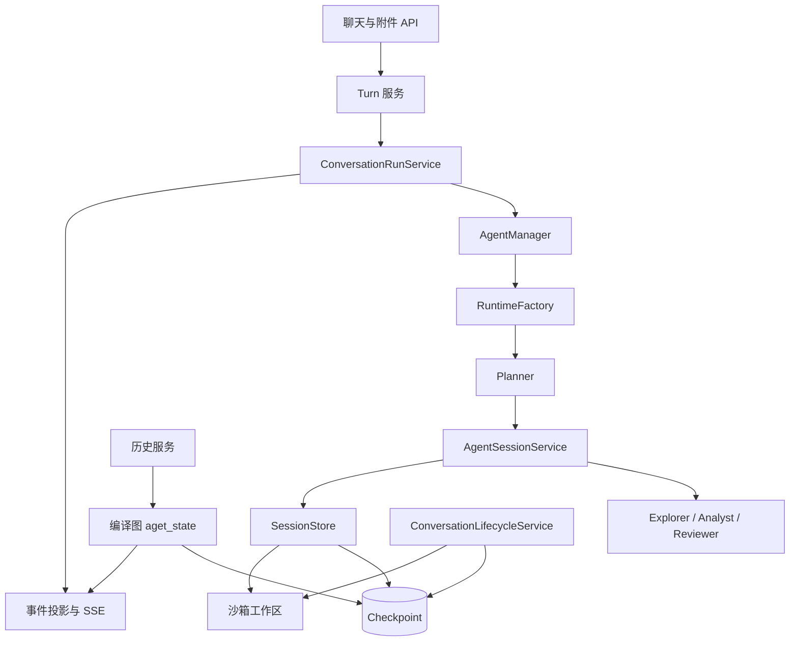

# 06. Assistant：对话执行与多智能体协作

Assistant 管理用户 Conversation、Planner 调度、专业 Agent Session、Checkpoint、流式事件、附件投影和会话清理。Agent 负责推理与分析，执行服务负责互斥、状态保存、恢复、取消和资源释放。

## 1. 模块结构与职责

```mermaid
flowchart TD
    API[聊天与附件 API] --> TURN[Turn 服务]
    TURN --> RUN[ConversationRunService]
    RUN --> MANAGER[AgentManager]
    MANAGER --> FACTORY[RuntimeFactory]
    FACTORY --> PLANNER[Planner]
    PLANNER --> SESSION[AgentSessionService]
    SESSION --> SPECIALIST[Explorer / Analyst / Reviewer]
    SESSION --> STORE[SessionStore]
    STORE --> PG[(Checkpoint)]
    STORE --> SANDBOX[沙箱工作区]
    RUN --> EVENTS[事件投影与 SSE]
    HISTORY[历史服务] --> READER[编译图 aget_state]
    READER --> PG
    READER --> EVENTS
    LIFE[ConversationLifecycleService] --> PG
    LIFE --> SANDBOX
```

| 子域 | 主要职责 |
| --- | --- |
| Conversations | Conversation 归属、草稿、标题、历史、附件与删除流程 |
| Execution | Turn、Run、Runtime 缓存、Session 并发与委派生命周期 |
| Agents | Planner 和专家的提示词、工具、Skill、模型及中间件装配 |
| Checkpoints | 从原生图状态整理委派记录、结果与 Session 摘要 |
| Events | 内容识别、消息投影、增量合并、专家活动与 SSE 协议 |
| Models / Repositories | Conversation 与删除墓碑的持久化 |
| Tasks | 标题生成、过期草稿和待删除会话清理 |

SQL 校验与执行、业务目录搜索、容器文件操作分别调用对应模块。Assistant 负责将它们绑定到当前用户与会话，提供 Agent 工具和前端可读结果。

## 2. Agent 分工与工具能力

| Agent | 主要职责 | 主要能力 |
| --- | --- | --- |
| Planner | 拆解问题、安排依赖、组织最终回答 | 委派专家、查看与删除专家 Session、读取文件、Shell 和图片工具 |
| Explorer | 弄清数据含义，取得可信的数据 | 元数据召回、SQL 执行、配置的 MCP 工具，以及文件和 Shell 工具 |
| Analyst | 对已有数据进行计算、分析和展示 | 分析技能、文件与 Shell 工具、模型支持时的图片查看 |
| Reviewer | 检查口径、计算、证据和交付物 | 文件与 Shell 工具、模型支持时的图片查看 |

Analyst 和 Reviewer 没有直接配置 SQL 查询或元数据召回工具。需要补数时，它们应把缺口返回给 Planner，由 Planner 再安排 Explorer。专家也没有继续创建子 Agent 的默认工具，避免分析过程形成不受控制的嵌套委派。

Planner 的提示词要求它专注协调，不亲自做 SQL 和数据加工。这是工作分工约定，不能单独当作安全边界；实际权限仍由工具集合、后端身份校验和沙箱文件权限共同决定。

### 2.1 专业 Agent 委派

Planner 直接调用 `delegation` 委派专家。独立任务可以在同一轮发起多个工具调用，有依赖的任务则等待前一步结果。

委派工具调用和结果随会话状态保存，前端根据 delegation 标识展示实时活动并读取历史记录。执行链负责取消任务，并通过专业 Session 的锁协调同一上下文的执行。

## 3. Conversation、Turn、Run 与专业 Session

| 名称 | 含义 | 生命周期 |
| --- | --- | --- |
| Conversation | 用户侧的一段对话 | 跨多轮消息保留，拥有历史和附件 |
| Turn | 一次用户输入或一次继续执行所形成的工作单元 | 从准备上下文到本轮结束 |
| Run | 后端正在执行这一轮工作的实例 | 当前 API 进程中的异步任务和事件缓冲 |
| Analysis | 一组相关分析工作的标识 | 用于组织专家 Session 和文件 |
| Session | 某个专家可继续使用的工作上下文 | 有独立 Checkpoint 线程和工作目录 |
| Delegation | Planner 发起的一次具体委派 | 对应一次工具调用，返回文本结果 |

同一个 Session 可以连续接收多次委派，例如先计算全年销售额，再在原有数据基础上补充季度分布。继续 Session 并不等于重新执行旧委派：新的工具调用代表新的工作，重复播放同一个工具调用则应复用已经记录的结果。

Planner 和每个专家 Session 分别使用独立的 LangGraph thread。专家线程标识包含用户、Conversation、Analysis、专家类型和 Session；同一 Session 多次委派使用同一线程继续对话，消息和检查点由 LangGraph 保存。

## 4. 回合受理、执行与 Runtime 缓存

```mermaid
sequenceDiagram
    participant UI as 前端
    participant Turn as Turn 服务
    participant Run as Run 服务
    participant Planner as Planner
    participant Expert as 专家 Session
    participant PG as Checkpoint
    UI->>Turn: 发送消息与附件引用
    Turn->>Run: 提交本轮执行与准备回调
    Run->>Run: 获取生命周期锁，执行归属校验与准备
    Run->>Planner: 借用会话运行资源并执行
    Planner->>Expert: 委派具体工作
    Expert->>PG: 保存消息和委派进度
    Expert-->>Planner: 文本结果与文件交付指令
    Planner-->>Run: 回答、工具事件、最终交付
    Run-->>UI: SSE 推送
```

Run 取得会话锁后执行准备阶段：检查用户是否拥有会话，把草稿会话转成正式会话，并整理本轮输入。短期数据库操作完成后，不把普通仓储事务一直带进模型请求。

执行阶段通过会话级 advisory lock 防止同一会话同时运行。`ConversationRunService` 持有真正的异步执行任务；`AgentManager` 负责可复用的运行资源，`RuntimeFactory` 负责组装这些资源，`SessionService` 管理专家工作上下文。把这几层分开，是为了让“停止一次执行”和“释放整个会话的资源”具有不同含义。

运行资源缓存默认最多保留 128 个会话，优先淘汰空闲资源；全部忙碌时可以暂时超过缓存目标。淘汰会释放相应的进程内会话资源，不会顺手删除数据库历史或用户文件。

如果 Planner 因输出长度等非正常结束原因停下，执行器可以自动续写，默认最多 3 次。这个机制用于完成当前回答，不是无限重试模型故障，也不是自动接受一个新的用户任务。

## 5. 专业委派、结果协议与并发控制

专业 Agent 用普通文本陈述结论、证据、限制、失败原因及所需上游修补，由 Planner 根据内容安排后续工作。交付文件与 Planner 使用相同的独占行指令：`[[DATAAGENT_ARTIFACT:<absolute_path>]]`。

程序记录委派的运行、完成、失败和取消状态；正常返回文本表示执行完成，业务问题是否解决由 Planner 阅读文本判断。实时消息与历史消息统一检查文件路径和下载资格，再显示附件。

同一专家 Session 使用数据库锁互斥，避免两次委派同时修改同一上下文。不同专家 Session 可以并行执行。

## 6. 委派持久化与续接语义

| 状态或标识 | 作用 |
| --- | --- |
| analysis_id | 在 Conversation 内区分分析目标 |
| agent_type + session_id | 在分析目标下定位专业工作上下文 |
| thread_id | 持久化 Session 的消息、任务和委派状态 |
| delegation_id | 区分一次具体工具委派，重放时定位既有结果 |
| delegation_records | 按委派 ID 保存运行状态和最终文本 |

新委派续接原 Session 的消息与文件；同一委派 ID 重放优先复用已保存结果。附件在对外展示时检查路径和下载资格。历史中仍标为 running 的委派，若没有对应活跃执行，对外按中断或取消展示，不能让页面永久显示工作中。

Session 锁保护同一上下文。Shell 在调用内等待命令完成；取消时等待进程组和执行线程收尾，再释放执行边界。

## 7. Checkpoint 物化与历史投影

Checkpoint 保存图执行状态。历史读取与实际执行使用同一套图构建代码，通过 LangGraph 的 `aget_state()` 获取 `StateSnapshot`。消息通道还原、pending writes 合并和待执行节点计算由框架完成；能否恢复由 `StateSnapshot.next` 判断。

图编译只装配模型能力声明、工具定义和本地后端对象。模型客户端与 MCP 工具在首次执行时初始化，用户工作区与沙箱执行身份在准备执行时取得。历史状态读取直接编译图并查询 Checkpointer。专业 Session 的列表和委派历史使用同样的原生状态读取方式。

历史列表、Planner 流式完整消息和专家活动统一调用消息投影入口，处理正文、思考、工具结果、接收时间和文件交付指令。Planner 与专家共用节点消息提取逻辑；增量消息仍按消息 ID 跟踪首次重置，完整消息与历史消息使用相同的附件展示规则。

## 8. SSE 订阅、重放与取消

运行中的事件通过 SSE 推送，包含回答增量、工具活动、专家委派和执行状态。服务端每 15 秒发送心跳，帮助连接保持活跃。事件投影负责把内部消息转换成前端能够稳定消费的格式。

浏览器断开只取消订阅，不自动取消分析。重新连接时，服务端可以重放当前 Run 留存的事件；默认缓冲上限为 512 条、2 MiB，相邻文本增量会尽量合并。每个订阅者也有独立容量限制，消费太慢会断开该订阅，避免无限占用内存。

这里不是持久化事件队列：没有基于 `Last-Event-ID` 的精确断点续传，Run 结束后也不永久保留其内存事件缓冲。已完成内容应通过历史接口重新取得。用户主动停止时，后端才取消对应执行任务，并清理其运行活动。

Run 和事件订阅都属于当前 API 进程。部署多个 API 实例时，后续订阅和停止请求需要到达持有该 Run 的实例；PostgreSQL 锁只能阻止重复执行，不能把事件或取消指令转发给另一台服务器。

## 9. 模型上下文、附件与产物投影

模型调用前按需加载 view_image 工具引用的图片。元数据召回直接返回结果正文，并作为普通工具消息保留在 Checkpoint 中，后续轮次持续可见。每次新召回按当前权限过滤，历史消息保留当次结果，不再折叠或回查展开。

用户历史展示模型和工具消息，过滤内部系统消息，并把委派、附件和正常回答组织成可阅读内容。模型提供的思考事件可以用于展示过程，但它们不替代执行记录或数据证据，也不是每个模型都会提供。

最终文件通过独占一行的 DATAAGENT_ARTIFACT 交付标记声明，标记携带容器内的产物绝对路径。文件来源限定在当前 Conversation 的 sessions 专业工作区。

这条指令只有出现在正常的最终回答、且不在代码围栏中时才会被识别。系统校验文件引用后，将其转换为附件并去重；无效引用不会凭空变成可下载文件。下载接口仍然校验会话归属和路径权限。

## 10. 模型协议、Skill 与 MCP 装配

模型配置显式区分供应商、接口协议、模型能力和上下文容量。不能把“接口长得像 OpenAI”理解成所有能力完全相同；图片输入和结构化输出都应以配置的模型能力为准。

工厂只保留 DeepSeek Responses 专用适配，处理工具调用间所需的推理内容和响应事件差异；其他供应商统一使用 OpenAI 兼容客户端，按配置选择 Chat Completions 或 Responses。供应商扩展请求字段通过 `params.extra_body` 传入。这些属于协议转换，不是另建一套对话状态。HTTP 客户端有明确的资源归属，后台标题任务按次创建并关闭自己的模型客户端。

MCP 工具由配置接入 Explorer。MCP 工具排在内置工具之前，按名称合并后内置工具优先；多个 MCP 工具同名时使用后加载的实现。模型看到的工具定义与实际执行使用相同优先级。外部工具可用性仍取决于对应服务、凭据和网络；接入一个 MCP 工具并不自动让它获得 Doris 查询身份。

Analyst 挂载分析与可视化 Skill；技能目录只读。用户消息上下文中间件在调用前投影接收时间和工具图片，时间戳中间件维护消息展示时间。内部工具记录、公开活动和最终用户消息按各自协议投影。

Planner 默认模型来自 lm_config.active，专家配置为 default 时跟随，也可引用独立模型定义。相同配置名的模型在当前工厂内复用；image_inputs 决定图片工具，structured_output 决定 ProviderStrategy 或 ToolStrategy。

## 11. 草稿、标题与会话清理

新建会话先是草稿，首次发送消息后转为正式会话。首次输入还会触发后台标题生成，更新时避免覆盖用户已经手动修改的标题。长期未使用的草稿默认在 24 小时后具备清理条件，由应用内周期任务处理。应用启动时立即扫描，之后默认每 300 秒扫描一次；扫描使用数据库互斥锁协调多个 API 进程。

删除会话先停止当前进程中的执行，再取得生命周期锁并标记删除。接口隐藏已标记会话，后台继续清理 Checkpoint、会话文件和会话数据。删除标记与沙箱墓碑阻止资源在清理期间又被创建。后台任务随应用关闭而取消，未完成的删除通过下次启动或周期扫描补偿；中断的标题生成保留即时标题。

如果其他进程仍持有会话执行锁，当前进程不能直接取消远端任务；清理需要等待重试。

## 12. 状态归属与恢复边界

| 状态 | 保存位置 | 恢复与清理行为 |
| --- | --- | --- |
| Conversation 目录、删除标记 | Assistant PostgreSQL | 页面列表与归属判断，删除流程据此恢复 |
| Planner/专家状态及委派结果 | LangGraph PostgreSQL | 支持历史读取与未完成图执行恢复 |
| CSV、脚本与报告 | 用户沙箱卷 | 根据会话/Session 生命周期保留或删除 |
| Run 与订阅者 | 当前 API 进程 | 断开订阅不取消执行，进程退出后无法原样恢复 |
| SSE 重放窗口 | 当前 Run 内存 | 有界缓冲，不是完整历史存储 |

多个 API Worker 共用 Checkpoint 和数据库锁，但没有跨进程事件总线与取消总线。同一 Run 的启动、查询、订阅和停止需路由到拥有它的进程。数据库锁只能阻止冲突执行，不能让另一进程直接接管正在运行的模型调用。

格式合法、文件存在和分析正确分别验证。文本结果说明及 Reviewer 提供审查流程，实际结果仍需要与查询依据和产物内容一致。
