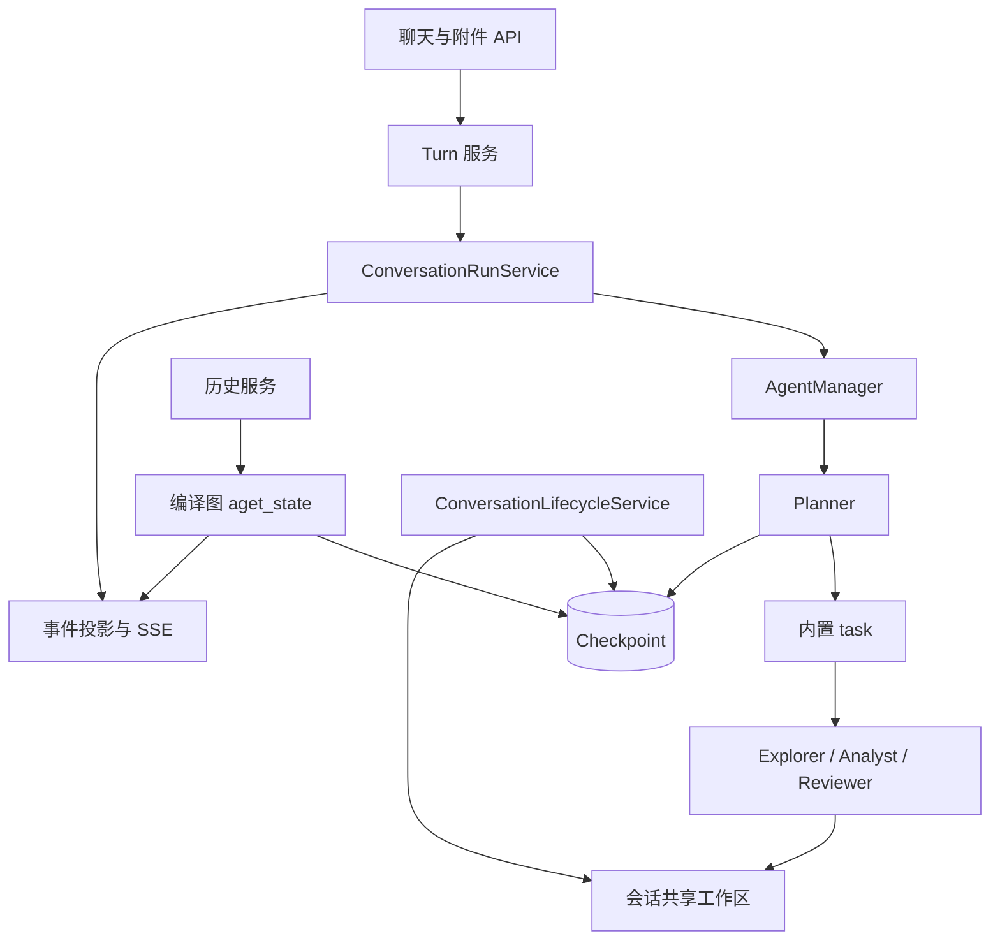
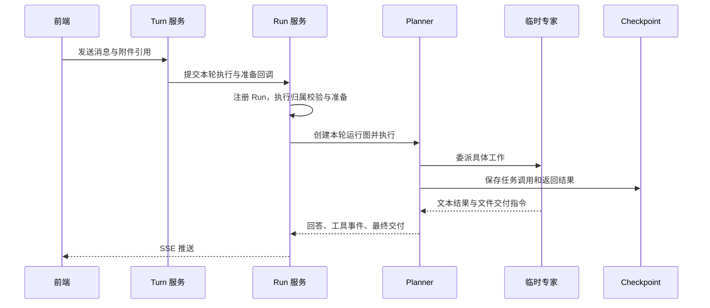

# 06. Assistant：对话执行与多智能体协作

Assistant 管理用户 Conversation、Planner 调度、临时专业 Agent、Checkpoint、流式事件、附件投影和会话清理。Agent 负责推理与分析，执行服务负责互斥、状态保存、恢复、取消和资源释放。

## 1. 模块结构与职责


```mermaid
flowchart TD
    API[聊天与附件 API] --> TURN[Turn 服务]
    TURN --> RUN[ConversationRunService]
    RUN --> MANAGER[AgentManager]
    MANAGER --> PLANNER[Planner]
    PLANNER --> TASK[内置 task]
    TASK --> SPECIALIST[Explorer / Analyst / Reviewer]
    PLANNER --> PG[(Checkpoint)]
    SPECIALIST --> SANDBOX[会话共享工作区]
    RUN --> EVENTS[事件投影与 SSE]
    HISTORY[历史服务] --> READER[编译图 aget_state]
    READER --> PG
    READER --> EVENTS
    LIFE[ConversationLifecycleService] --> PG
    LIFE --> SANDBOX
```

| 目录 | 主要职责 |
| --- | --- |
| `api/` | 聊天与附件路由；dependencies.py 统一应用资源和请求级服务依赖 |
| `services/` | Turn 受理、Run 执行、会话删除、历史、标题、附件和后台任务，保持平铺 |
| `agents/` | AgentManager、模型客户端、图装配、运行上下文、提示词加载、工具和中间件 |
| `messages.py` | 内容读取、完整消息与附件投影、流式增量解析 |
| `models/` | conversation.py 定义数据库会话；chat.py 定义请求、响应与 SSE 数据模型 |
| `repositories/` | 会话目录读写和生命周期操作所用的短事务仓库 |

定位代码时，先按下面的主链路阅读：

```text
api/chat.py → services/conversation.py → services/run.py → agents/manager.py
                                                  → _build_specialists() / create_deep_agent()
                                                  → agents/tools/、middleware/

services/run.py / conversation.py → messages.py → models/chat.py
services/tasks.py → services/title.py / conversation.py → repositories/、sandbox
```

Agent 装配层不依赖会话业务服务；消息投影不负责启动 Run。应用级资源由 `app/runtime.py` 直接组装，请求级服务由 `api/dependencies.py` 组装。

SQL 校验与执行、业务目录搜索、容器文件操作分别调用对应模块。Assistant 负责将它们绑定到当前用户与会话，提供 Agent 工具和前端可读结果。

## 2. Agent 分工与工具能力

| Agent | 主要职责 | 主要能力 |
| --- | --- | --- |
| Planner | 拆解问题、安排依赖、组织最终回答 | 通过 task 委派专家、读取文件、Shell 和图片工具 |
| Explorer | 弄清数据含义，取得可信的数据 | 元数据召回、SQL 执行，以及文件和 Shell 工具 |
| Analyst | 对已有数据进行计算、分析和展示 | 分析技能、文件与 Shell 工具 |
| Reviewer | 检查口径、计算、证据和交付物 | 文件与 Shell 工具 |

Analyst 和 Reviewer 没有直接配置 SQL 查询或元数据召回工具。需要补数时，它们应把缺口返回给 Planner，由 Planner 再安排 Explorer。专家也没有继续创建子 Agent 的默认工具，避免分析过程形成不受控制的嵌套委派。

Planner 的提示词要求它专注协调，不亲自做 SQL 和数据加工。这是工作分工约定，不能单独当作安全边界；实际权限仍由工具集合、后端身份校验和沙箱文件权限共同决定。

### 2.1 专业 Agent 委派

Planner 调用 DeepAgents 内置 `task`，通过 `subagent_type` 选择专家，`description` 提供完整任务。独立任务可以并行，有依赖的任务等待上游结果。

所有 Agent 共用 `/data/<conversation_id>/`。文件、Shell、图片和 SQL 产物采用同一套路径；SQL 文件带唯一后缀，其他并行任务也应使用不同输出文件名。

## 3. Conversation、Turn、Run 与 Task

| 名称 | 含义 | 生命周期 |
| --- | --- | --- |
| Conversation | 用户对话与共享文件目录 | 跨轮次保留 |
| Turn | 一次输入或继续执行 | 从受理到本轮结束 |
| Run | 当前进程的后台执行实例 | 包含任务与事件缓冲 |
| Task | Planner 的一次专业委派 | 全新消息上下文，结果写回 Planner |

只有 Planner 保存 Checkpoint。子 Agent 显式关闭 Checkpointer，不继承父图持久化；再次调用不自动记得上次任务，Planner 必须提供已有结论和文件路径。文件独立保存在用户卷中。

## 4. 回合受理、执行与资源归属


```mermaid
sequenceDiagram
    participant UI as 前端
    participant Turn as Turn 服务
    participant Run as Run 服务
    participant Planner as Planner
    participant Expert as 临时专家
    participant PG as Checkpoint
    UI->>Turn: 发送消息与附件引用
    Turn->>Run: 提交本轮执行与准备回调
    Run->>Run: 注册 Run，执行归属校验与准备
    Run->>Planner: 创建本轮运行图并执行
    Planner->>Expert: 委派具体工作
    Planner->>PG: 保存任务调用和返回结果
    Expert-->>Planner: 文本结果与文件交付指令
    Planner-->>Run: 回答、工具事件、最终交付
    Run-->>UI: SSE 推送
```

Run 在进程内注册后执行准备阶段：检查用户是否拥有会话，把草稿会话转成正式会话，并整理本轮输入。短期数据库操作完成后，不把普通仓储事务一直带进模型请求。

进程内 Run 注册表防止同一会话同时运行。每次 Run 创建 Planner 和无状态专业图；应用共享模型客户端，Run 结束不关闭模型。

每个回合只启动一次图执行。图内正常处理模型与工具调用；图结束后不因输出长度等结束原因自动发起续写，已有待执行检查点仍可通过恢复接口继续执行。

## 5. 专业委派、结果协议与并发控制

`semantic_recall.py`、`execute_sql.py` 由 Explorer 使用；文件、Shell 和按模型能力提供的图片工具由公共构造器装配。`task` 的专家选择、调用和结果提取使用框架实现。

`TaskActivityMiddleware` 只发送任务开始、完成、失败和取消状态，不转发子 Agent 的消息、推理或内部工具事件。事件中的 `delegation_id` 对应 task 工具调用 ID，用于区分并行任务，不作为持久化会话标识。取消沿调用链传递到子图和 Shell；Shell 等待进程组清理完成。

专业 Agent 用文本返回结论、证据、限制及失败原因，文件采用 `[[DATAAGENT_ARTIFACT:<absolute_path>]]` 指令交付。任务共享同一会话目录，并行写入时使用不同文件名。

## 6. 恢复与历史

Planner 保留任务调用和结果。前端展示任务目标、状态和最终返回结果，不展示子 Agent 中间消息；产物仍可从会话目录读取。Planner 恢复时尚未完成的 task 重新执行，不保证复用子 Agent 已执行的工具或结果。

## 7. Checkpoint 物化与历史投影

Checkpoint 保存图执行状态。历史读取与实际执行使用同一套图构建代码，通过 LangGraph 的 `aget_state()` 获取 `StateSnapshot`。消息通道还原、pending writes 合并和待执行节点计算由框架完成；能否恢复由 `StateSnapshot.next` 判断。

应用启动时初始化模型客户端，初始化失败会清理已创建的客户端并终止启动。图编译直接绑定共享模型和工具，无需延迟模型或动态工具中间件；用户工作区与沙箱执行身份仍在执行前准备。历史状态读取新建图并调用原生 aget_state，不发起模型请求或准备沙箱。

历史列表、Planner 流式完整消息和专家活动统一调用消息投影入口，处理正文、思考、工具结果和文件交付指令。Planner 与专家共用节点消息提取逻辑；增量消息仍按消息 ID 跟踪首次重置，完整消息与历史消息使用相同的附件展示规则。

## 8. SSE 订阅、重放与取消

运行中的事件通过 SSE 推送，包含回答增量、工具活动、专家委派和执行状态。服务端每 15 秒发送心跳，帮助连接保持活跃。事件投影负责把内部消息转换成前端能够稳定消费的格式。

浏览器断开只取消订阅，不自动取消分析。重新连接时，服务端可以重放当前 Run 留存的事件；默认缓冲上限为 512 条、2 MiB，相邻文本增量会尽量合并。每个订阅者也有独立容量限制，消费太慢会断开该订阅，避免无限占用内存。

这里不是持久化事件队列：没有基于 `Last-Event-ID` 的精确断点续传，Run 结束后也不永久保留其内存事件缓冲。已完成内容应通过历史接口重新取得。用户主动停止时，后端才取消对应执行任务，并清理其运行活动。

Run 和事件订阅都属于当前 API 进程。部署多个 API 实例时，后续订阅和停止请求需要到达持有该 Run 的实例；PostgreSQL 锁只能阻止重复执行，不能把事件或取消指令转发给另一台服务器。

## 9. 模型上下文、附件与产物投影

模型调用前添加用户消息的接收时间提示。元数据召回直接返回结果正文，并作为普通工具消息保留在 Checkpoint 中，后续轮次持续可见。每次新召回按当前权限过滤，消息保存当次结果。

用户历史展示模型和工具消息，过滤内部系统消息，并把委派、附件和正常回答组织成可阅读内容。模型提供的思考事件可以用于展示过程，但它们不替代执行记录或数据证据，也不是每个模型都会提供。

最终文件通过独占一行的 DATAAGENT_ARTIFACT 交付标记声明，标记携带容器内的产物绝对路径。文件来源限定在当前 Conversation 的 sessions 专业工作区。

这条指令只有出现在正常的最终回答、且不在代码围栏中时才会被识别。系统校验文件引用后，将其转换为附件并去重；无效引用不会凭空变成可下载文件。下载接口仍然校验会话归属和路径权限。

## 10. 模型协议与 Skill 装配

静态内容位于项目根目录的 `resources/assistant/`：各角色使用 `<角色>/prompt.md`，标题使用 `title.md`，Analyst 技能使用 `analyst/skills/`。应用通过 `app/assistant/agents/resources.py` 按项目绝对位置读取提示词，文件缺失直接报错，不依赖当前工作目录。修改提示词后重启后端；部署时必须同时交付整个资源目录。

技能继续只读挂载到沙箱 `/skills/<角色>/`，文件权限和模型看到的路径不变。包含当前会话工作目录的动态提示由代码生成。

模型配置显式区分供应商、接口协议、模型能力和上下文容量。不能把“接口长得像 OpenAI”理解成所有能力完全相同；图片输入和结构化输出都应以配置的模型能力为准。

工厂统一创建 Chat Completions 客户端。DeepSeek 使用 langchain-deepseek 处理思考增量，仅补充工具调用后所需的 reasoning_content 回传；其他供应商使用 OpenAI 兼容客户端。供应商扩展请求字段通过 `params.extra_body` 传入。这些属于协议转换，不是另建一套对话状态。HTTP 客户端有明确的资源归属，后台标题任务按次创建并关闭自己的模型客户端。

Analyst 挂载分析与可视化 Skill；技能目录只读。消息上下文中间件在模型调用前注入每条用户消息记录的接收时间，并临时加载工具图片。接收时间以带时区的 UTC 时间保存，历史消息和重试使用原接收时间；API 与前端不展示消息时间，模型回复不记录额外时间戳。内部工具记录、公开活动和最终用户消息按各自协议投影。

Planner 默认模型来自 lm_config.active，专家配置为 default 时跟随，也可引用独立模型定义。相同配置名的模型在当前工厂内复用；profile 向模型客户端声明 image_inputs 和 max_input_tokens，后者用于上下文压缩阈值。

## 11. 草稿、标题与会话清理

新建会话先是草稿，首次发送消息后转为正式会话。首次输入还会触发后台标题生成，模型返回非空标题后直接更新。长期未使用的草稿在 24 小时后具备清理条件，由应用内周期任务处理。应用启动时立即扫描，之后每轮结束等待 300 秒再扫描，每轮每类最多清理 100 条；这些值由代码常量定义；单个 Web 进程串行执行扫描。

删除会话先提交删除标记，再取消并等待当前执行退出。接口隐藏已标记会话，后台继续清理 Checkpoint、会话文件和会话数据。删除标记与沙箱墓碑阻止资源在清理期间又被创建。后台任务随应用关闭而取消，未完成的删除通过下次启动或周期扫描补偿；标题生成失败、超时或中断时保留即时标题，不自动重试。

如果其他进程仍持有会话执行锁，当前进程不能直接取消远端任务；清理需要等待重试。

## 12. 状态归属与恢复边界

| 状态 | 保存位置 | 恢复与清理行为 |
| --- | --- | --- |
| Conversation 目录、删除标记 | Assistant PostgreSQL | 页面列表与归属判断，删除流程据此恢复 |
| Planner 状态及 task 返回结果 | LangGraph PostgreSQL | 支持历史读取与未完成图执行恢复 |
| CSV、脚本与报告 | 用户沙箱卷 | 根据会话生命周期保留或删除 |
| Run 与订阅者 | 当前 API 进程 | 断开订阅不取消执行，进程退出后无法原样恢复 |
| SSE 重放窗口 | 当前 Run 内存 | 有界缓冲，不是完整历史存储 |

当前部署只运行一个 Web 进程，Run 注册、订阅、停止与删除均在同一事件循环内协调，不提供多 Worker 的执行互斥。

格式合法、文件存在和分析正确分别验证。文本结果说明及 Reviewer 提供审查流程，实际结果仍需要与查询依据和产物内容一致。
