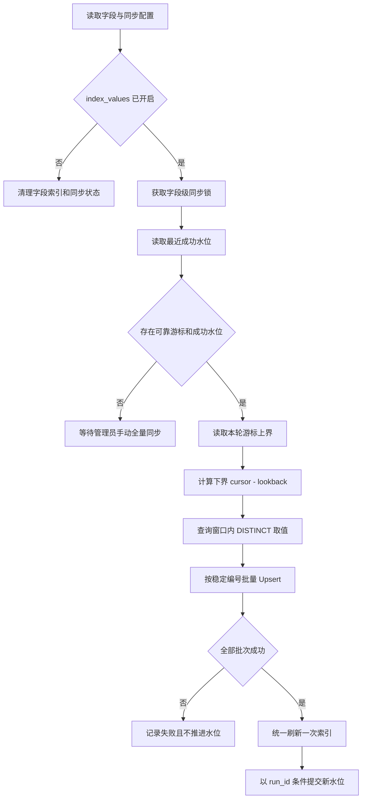
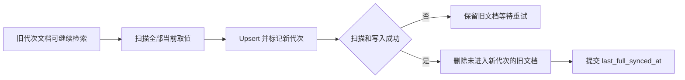

# 取值索引增量同步设计

## 1. 文档状态

| 项目 | 内容 |
| :--- | :--- |
| 设计状态 | 已实施 |
| 适用对象 | 已开启 `index_values` 的字段 |
| 数据源 | Doris 业务表 |
| 索引目标 | Elasticsearch 字段取值全文索引 |
| 核心入口 | [`MetaIndexService.sync_column_values`](../app/metadata/services/index.py) |

本文定义“每日或手动水位增量同步 + 手动全量校准”的取值索引方案。水位同步降低日常扫描量，管理员按需执行全量校准以清理已经失效的历史取值并修复漏数。

当前实现使用 [`ValueIndexSyncState`](../app/metadata/models.py) 持久化类型化水位、运行所有权和索引代次。Celery Beat 每天在配置时间筛选具备成功水位的字段，Worker 执行增量同步。管理员也可以对已建立水位的字段或表手动触发增量同步。首次构建和全量校准只能由管理员手动触发。

---

## 2. 实施前实现与问题

实施前 [`MetaIndexService.sync_column_values`](../app/metadata/services/index.py) 对每个字段执行以下操作：

1. 删除字段在 Elasticsearch 中的全部取值文档
2. 对 Doris 字段执行无条件 `SELECT DISTINCT`
3. 分批写入全部去重值
4. 刷新索引并记录同步成功时间

该流程可以生成准确的全量快照，数据量较大时存在以下成本和风险：

- 每次同步都扫描字段全部数据
- 删除后重建期间存在检索空窗
- 新增少量数据仍会重写全部取值
- 同步失败时旧索引已被删除，字段取值检索可能不完整
- 当前状态只记录时间和状态，无法从上次进度继续同步

实施前 [`ValueESRepo`](../app/metadata/repositories/value_index.py) 已使用确定性 UUID 写入取值。当前实现使用无歧义 JSON 序列生成稳定 UUID，同一取值在回看窗口和失败重试中会覆盖相同文档。

---

## 3. 设计目标

- 日常同步只读取上次成功水位之后发生变化的数据
- 延迟到达或边界重复数据可以安全重放
- 同步失败时不推进水位，不破坏上次成功索引
- 管理员手动全量校准能够删除源表中已经不存在的取值
- 首次开启取值索引后由管理员手动执行全量构建
- 关闭 `index_values` 后由每日任务清理索引文档和同步状态
- 缺少可靠游标的表仅支持管理员手动全量校准
- 同一字段并发同步时只有当前任务可以推进状态

### 3.1 增量能力边界

基于更新时间水位的查询能够发现新增值和当前值，无法直接知道某个旧值已经从所有源数据中消失。精确实时删除需要 CDC 的更新前镜像和取值引用计数。当前方案由管理员按需执行全量校准来清理失效值。

---

## 4. 同步模式

每个字段根据配置和同步状态进入以下模式之一：

| 模式 | 触发条件 | 读取范围 | 删除失效值 |
| :--- | :--- | :--- | :--- |
| `full` | 首次构建或管理员手动同步 | 全字段 | 是 |
| `incremental` | 每日任务领取或管理员手动选择已有成功水位且配置可靠游标的字段 | 水位窗口 | 否 |
| `clear` | `index_values=false` | 无 | 删除该字段全部索引 |

缺少游标配置的字段不参与每日自动任务，只能由管理员手动全量同步。

---

## 5. 游标配置与约束

### 5.1 表级配置

游标通常属于表级变更信息，建议在元数据配置中按表维护：

```yaml
value_index_cursor_column: dw_load_time
```

建议配置字段：

| 字段 | 类型 | 说明 |
| :--- | :--- | :--- |
| `value_index_cursor_column` | 字符串或空值 | 行级更新时间或批次游标字段 |

每日执行时间属于应用级任务配置，在 [`conf/app_config.yaml`](../conf/app_config.yaml) 中维护：

```yaml
metadata_index:
  value_lookback_seconds: 300

task_queue:
  value_index_sync_time: "08:00"
```

`metadata_index.value_lookback_seconds` 是所有表共用的增量回看窗口。`task_queue.value_index_sync_time` 使用 `Asia/Shanghai` 时区，格式为 `HH:MM`，Celery Beat 每天触发一次取值索引增量任务。

### 5.2 游标字段要求

游标字段应满足以下条件：

- 每次插入和更新时都会写入新值
- 对参与取值增量同步的行保持非空
- 可以稳定比较和排序
- 业务上接近单调递增
- 不依赖用户可修改的普通业务字段
- Doris 中存在且可被安全引用

`dw_load_time` 只有在行更新时同步更新才适合作为游标。只记录首次入仓时间的字段会漏掉后续修改。批次编号也可以作为游标，前提是批次之间具有稳定顺序。

`information_schema.tables.UPDATE_TIME` 只能判断表级别是否可能发生变化，无法限定发生变化的行，不作为行级增量游标。

项目自带的 [`conf/meta_config.yaml`](../conf/meta_config.yaml) 已为 14 张包含 `dw_update_time` 的维度表配置增量游标。其他表待确认可靠的行级更新字段后再显式启用每日水位同步，当前仅支持管理员手动全量同步。

---

## 6. 同步状态模型

新增独立表 `value_index_sync_state`，以 `(t_name, c_name)` 为主键：

| 字段 | 类型 | 说明 |
| :--- | :--- | :--- |
| `t_name` | `varchar(256)` | 表名 |
| `c_name` | `varchar(256)` | 字段名 |
| `cursor_value` | `jsonb` | 最近成功提交的类型化游标 |
| `status` | `varchar(16)` | `syncing`、`succeeded`、`failed` |
| `active_run_id` | `uuid` | 当前同步任务编号 |
| `current_generation` | `uuid` | 最近一次成功全量校准的代次 |
| `active_generation` | `uuid` | 当前全量构建或校准使用的代次 |
| `last_incremental_synced_at` | `timestamptz` | 最近增量同步成功时间 |
| `last_full_synced_at` | `timestamptz` | 最近全量构建或校准成功时间 |
| `last_error` | `text` | 最近一次失败摘要 |
| `updated_at` | `timestamptz` | 状态更新时间 |

独立状态表承载游标、运行编号和两类同步时间，避免继续扩展 `ColumnInfo` 的目录元数据职责。现有 `value_index_synced_at` 和 `value_index_sync_status` 在迁移完成后删除，所有服务、schema 和前端调用方同步使用新状态模型。

游标使用类型化 JSON 存储，避免时间、整数和字符串统一转换后产生比较语义偏差。

表级 `value_index_cursor_column` 配置发生变化时，PostgreSQL 仓储会删除该表已有字段水位状态。管理员需要重新执行一次手动全量同步，以新的游标语义建立索引和水位。

---

## 7. 稳定取值文档

### 7.1 文档编号

取值文档编号使用无歧义 JSON 作为 UUID 输入：

```text
uuid5(
  NAMESPACE_URL,
  JSON(["value", table_name, column_name, serialized_value])
)
```

同一字段的相同序列化取值在增量窗口内重复出现时覆盖相同文档，支持回看窗口和失败重试。

### 7.2 文档字段

取值索引增加 `sync_generation`：

| 字段 | 类型 | 用途 |
| :--- | :--- | :--- |
| `resource_key` | `keyword` | 字段资源键与权限过滤 |
| `value` | `text` | 取值全文检索 |
| `t_name` | `keyword` | 表名 |
| `c_name` | `keyword` | 字段名 |
| `sync_generation` | `keyword` | 全量校准代次 |

增量写入沿用状态表中的 `current_generation`。首次构建或全量校准开始时生成新代次，并在成功扫描后清理旧代次文档。

---

## 8. 水位增量同步流程



### 8.1 捕获固定上界

同步开始后先查询游标字段的当前最大值，记录为 `upper_bound`。本轮只读取不超过该值的数据，避免扫描过程中持续写入导致任务无法形成稳定边界。

### 8.2 重叠窗口

查询范围为：

```sql
where cursor_column >= :lower_bound
  and cursor_column <= :upper_bound
```

`lower_bound` 由上次成功水位减去回看窗口得到。重复读取由稳定取值编号吸收。非时间型游标应使用适合其类型的回退规则；无法安全回退时使用包含上次水位的闭区间重放边界值。

### 8.3 增量读取接口

[`SourceDorisRepo`](../app/metadata/repositories/source_doris.py) 增加底层接口：

```python
async def get_value_sync_upper_bound(
    self,
    table_name: str,
    cursor_column: str,
) -> Any | None: ...

async def iter_changed_column_value_batches(
    self,
    table_name: str,
    column_name: str,
    cursor_column: str,
    lower_bound: Any,
    upper_bound: Any,
    batch_size: int = 1000,
) -> AsyncIterator[list[Any]]: ...
```

表名、目标字段和游标字段继续使用数据库方言的 identifier preparer 安全引用，边界值通过绑定参数传入。

### 8.4 幂等写入

[`ValueESRepo.index`](../app/metadata/repositories/value_index.py) 重命名为 `upsert`，不保留旧接口别名。服务层和测试调用方同步修改。每批 Bulk 检查全部子项，所有批次成功后刷新一次索引。

### 8.5 提交水位

只有 Elasticsearch 写入和刷新全部成功后，才将 `cursor_value` 更新为 `upper_bound`。状态更新需要同时匹配 `active_run_id`，旧任务无法覆盖新任务的状态。

---

## 9. 手动首次构建与全量校准

直接删除旧索引再重建会产生检索空窗。首次构建和全量校准采用代次标记：

1. 为本轮生成唯一 `sync_generation`
2. 全量扫描字段当前全部 `DISTINCT` 取值
3. 按稳定编号 Upsert，并将文档标记为新代次
4. 所有扫描和写入成功后刷新索引
5. 删除同一 `resource_key` 下 `sync_generation` 不等于新代次的文档
6. 再次刷新并提交全量同步状态



稳定编号使现有值原地更新代次，已经消失的值保持旧代次，最终清理时被准确删除。同步失败会保留上一轮可用数据，不会形成空索引。

删除阶段失败时不提交新状态。管理员再次执行校准时生成新代次并重新扫描，保证上次失败后源数据继续变化时，旧的部分代次文档仍会进入清理范围。

---

## 10. 删除语义与 CDC 演进

### 10.1 首期策略

- 增量同步负责新增值和当前值的快速可见
- 管理员手动全量校准负责删除失效值
- 管理员可对单字段或整表强制触发 `full`
- 管理员可对已完成全量同步且配置可靠游标的单字段或整表触发 `incremental`
- 对历史行长期保留的追加型或 SCD 表，可降低校准频率

### 10.2 后续 CDC 策略

若未来要求旧值实时删除，可接入 Doris Binlog Table Stream 或上游 CDC，并维护 `(resource_key, value)` 引用计数：

1. 插入事件增加新值引用计数
2. 更新事件减少旧值计数并增加新值计数
3. 删除事件减少旧值计数
4. 引用计数降为 `0` 时删除 Elasticsearch 文档

该演进依赖可靠的更新前镜像、事件顺序和去重状态，首期不纳入实现范围。

---

## 11. 一致性、并发与失败恢复

### 11.1 字段级互斥

锁粒度为 `(t_name, c_name)`。同一字段只运行一个 `full` 或 `incremental` 任务，不同字段可按并发上限并行。

### 11.2 状态所有权

任务启动时写入 `active_run_id` 和 `syncing`。成功或失败更新都必须匹配当前 `active_run_id`。调度器会重新提交超过任务时限的 `syncing` 状态，字段级 PostgreSQL advisory lock 串行化新旧任务，新的运行编号接管后旧任务无法推进游标。

### 11.3 失败处理

| 失败位置 | 索引影响 | 状态处理 |
| :--- | :--- | :--- |
| 获取上界失败 | 无 | 记录失败，不推进水位 |
| Doris 扫描失败 | 可能已 Upsert 部分稳定文档 | 记录失败，不推进水位 |
| Bulk 部分失败 | 可能已写入部分稳定文档 | 记录失败，不推进水位 |
| Refresh 失败 | 文档等待后续刷新 | 记录失败，不推进水位 |
| 状态提交冲突 | ES 已包含本轮数据 | 不覆盖新任务状态，后续任务重放 |
| 校准清理失败 | 旧值暂时继续可见 | 保留代次并重试清理 |

稳定编号和重叠窗口确保重复扫描不会生成重复文档。

---

## 12. 服务返回值与可观测性

同步服务返回结构化结果：

```python
@dataclass(frozen=True)
class ValueIndexSyncResult:
    mode: Literal["full", "incremental", "clear"]
    read_value_count: int
    upserted_count: int
    removed_count: int
    cursor_value: Any | None
    sync_generation: str | None
```

管理接口根据 `last_full_synced_at` 和 `last_incremental_synced_at` 派生 `last_sync_mode`。管理列表紧凑展示最近成功同步模式和时间，悬停详情展示最近全量、最近增量、同步代次及失败原因，无需增加数据库字段。

路由 schema、前端类型和同步状态展示同步调整。建议记录以下指标：

- 各模式执行次数与成功率
- Doris 返回的去重取值数
- Elasticsearch Upsert 与删除数量
- 水位延迟，即当前上界与已提交水位的差距
- 全量校准耗时与失效值删除数量
- 回看窗口内重复文档比例

---

## 13. 迁移方案

### 第一阶段：状态与配置

1. 增加表级取值同步配置模型及 YAML schema
2. 新增 `value_index_sync_state` 数据表和仓储
3. 增加字段级锁和 `active_run_id` 状态所有权

### 第二阶段：底层增量能力

1. 为 Doris 仓储增加上界查询和窗口读取接口
2. 将 ValueESRepo 的写入接口改为 `upsert`
3. 将取值文档编号改为 JSON 结构输入
4. 增加 `sync_generation` mapping 和按代次删除接口

### 第三阶段：服务编排

1. 实现 `full`、`incremental` 和 `clear`
2. 接入回看窗口和水位提交
3. 将表级批量同步限制为已开启 `index_values` 的字段
4. 修改 API 返回结构和前端同步状态展示

### 第四阶段：旧状态清理

1. 将现有成功时间迁移为状态表的参考时间，不直接推导游标
2. 管理员对所有已开启字段手动执行一次 `full`
3. 确认新状态稳定后删除 `ColumnInfo` 上的旧取值同步状态字段

首次构建会通过稳定编号覆盖当前文档，并由代次清理删除旧编号文档，无需保留旧写入接口。

---

## 14. 测试与验收标准

### 14.1 单元测试

- 管理员首次手动同步字段时执行 `full`
- 管理员可手动触发已有水位字段的 `incremental`
- 已有水位且无新数据时不产生 Upsert
- 水位边界数据重复读取后文档数量不增加
- 回看窗口能够补偿延迟到达数据
- Doris、Bulk 或 Refresh 失败时水位保持不变
- 增量同步新增取值后可以立即检索
- 全量校准删除源表中已经不存在的取值
- 全量校准中途失败时旧文档继续可用
- 关闭 `index_values` 后索引和状态均被清理
- 旧任务无法使用过期 `run_id` 推进游标
- 表名、字段名和取值包含特殊字符时文档编号稳定且无歧义

### 14.2 集成测试

- 时间游标和整数批次游标都能正确推进
- 同一字段并发请求只执行一个同步任务
- 多字段表同步时仅处理已开启取值索引的字段
- 增量写入期间现有取值保持可检索
- 校准成功后 Elasticsearch 取值集合与 Doris `DISTINCT` 集合一致
- 权限过滤和字段值检索结果保持现有行为

### 14.3 验收指标

- 日常增量同步扫描范围限定在水位窗口内
- 任意失败路径均不会错误推进游标
- 首次构建和全量校准期间不存在字段级空索引窗口
- 同一任务重复执行后取值文档集合保持一致
- 管理员手动全量校准后失效值能够被清理

---

## 15. 关键代码映射

- 同步服务：[`app/metadata/services/index.py`](../app/metadata/services/index.py)
- Doris 数据源仓储：[`app/metadata/repositories/source_doris.py`](../app/metadata/repositories/source_doris.py)
- 取值索引仓储：[`app/metadata/repositories/value_index.py`](../app/metadata/repositories/value_index.py)
- PostgreSQL 元数据仓储：[`app/metadata/repositories/postgres.py`](../app/metadata/repositories/postgres.py)
- 元数据模型：[`app/metadata/models.py`](../app/metadata/models.py)
- 元数据配置 schema：[`app/shared/config/meta_config.py`](../app/shared/config/meta_config.py)
- 同步 API：[`app/metadata/api/meta/router.py`](../app/metadata/api/meta/router.py)

## 16. 参考资料

- [Elasticsearch Bulk API](https://www.elastic.co/guide/en/elasticsearch/reference/current/docs-bulk.html)
- [Apache Doris Unique Key](https://doris.apache.org/docs/dev/key-features/unique-key/)
- [Apache Doris Data Update and Delete](https://doris.apache.org/docs/dev/key-features/data-update-delete/)
