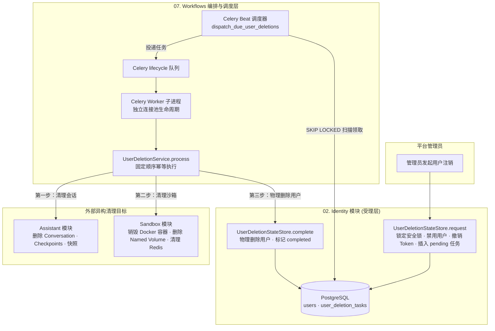

# 07. Workflows：实现跨存储注销

## 功能说明

Workflows 负责需要跨多个模块和存储系统才能完成的长期任务。当前只有用户注销流程：先停用账号，再清理会话、LangGraph Checkpoint、搜索快照、Docker 容器和存储卷，最后删除用户记录。

---

## 1. 模块总体架构与分层设计

### 1.1 架构定位与核心职责

用户注销会同时影响认证数据库、助手会话库、Docker 和存储卷。Workflows 负责按顺序协调这些操作：

1. **调用各模块提供的清理接口**：工作流只依赖少量 Protocol 和 `ConversationLifecycleService`，自己不直接保存 ORM 会话或 Docker 客户端。
2. **按固定顺序清理**：依次清理会话、沙箱和认证记录。每一步都允许重复执行，因此失败后可以从头重试。
3. **保留恢复所需记录**：外部资源全部清理前，用户 ID 和注销任务会一直留在数据库中。任务完成后，迟到的失败结果不能把状态改回去。
4. **自动重试未完成任务**：Celery 先进行几次快速重试，Celery Beat 再定期扫描数据库。多个调度器使用 `SKIP LOCKED` 分开领取任务。
5. **每个 Worker 子进程创建自己的连接**：任务开始时创建连接池和管理器，结束时在 `finally` 中关闭。

### 1.2 系统数据流与架构关系



### 1.3 主要组件职责

| 领域 | 核心类 / 函数 | 职责描述 |
| :--- | :--- | :--- |
| 清理接口 | `UserDeletionStateStore`, `UserSandboxCleaner` | 定义工作流真正需要的认证状态和沙箱清理操作 |
| 注销流程 | `UserDeletionService` | 受理注销，依次清理会话、沙箱和认证记录，并记录下次重试时间 |
| 任务提交 | `enqueue_user_deletion` | 将单个用户清理任务提交到 `lifecycle` 队列 |
| 任务执行 | `delete_user_task`, `_process_user_deletion` | 在 Worker 中创建本次任务需要的资源并执行清理 |
| 恢复调度 | `dispatch_due_user_deletions_task`, `_dispatch_due_user_deletions` | 领取到期任务，逐个提交并隔离发布失败 |

---

## 2. 创建一条可以持续重试的注销任务

用户注销需要修改多个 PostgreSQL 数据库，还要删除 Docker 容器和存储卷。一个数据库事务无法同时控制这些系统，因此流程必须保存进度，并允许失败后重试。

### 2.1 工作流只依赖实际需要的几个操作

Workflows 通过 `UserDeletionStateStore` 和 `UserSandboxCleaner` 调用认证与沙箱模块，通过 `ConversationLifecycleService.delete_user_conversations` 清理会话。PostgreSQL、LangGraph、Redis 和 Docker 的具体操作留在对应实现中。

### 2.2 一次事务停用账号并创建任务

管理员通过接口发起注销请求，系统首先执行业务安全约束校验：
- 禁止当前登录的操作员注销自身，核验系统中保留至少一个启用的管理员；
- 在单个认证数据库事务中执行：将目标用户的 `is_active` 置为 `False`，撤销该名下所有 Refresh Token，并在 `user_deletion_tasks` 表中插入或更新一条 `status='pending'` 的注销任务记录；
- 事务提交后，目标用户的访问令牌会因用户已禁用而失效，刷新令牌已全部撤销；管理接口返回 204。受理路径只创建或刷新 `pending` 任务，不直接发送 Celery 消息，定时恢复任务随后领取并投递物理清理。

---

## 3. 固定清理顺序，并允许从头重试

### 3.1 按下面的顺序清理

`UserDeletionService.process(user_id)` 按照固定的顺序执行清理：
1. **会话资源清理（`ConversationLifecycleService.delete_user_conversations`）**：
   清理所有 Conversation 行、物理删除 LangGraph Checkpoints、清除语义召回快照；
2. **沙箱资源清理（`UserSandboxCleaner.delete_user_sandbox`）**：
   强制删除用户专属 Docker 容器和 Named Volume，删除 Redis 中的用户活动时间，并保留永久用户删除标记来拒绝迟到请求；
3. **任务完成与用户物理删除（`UserDeletionStateStore.complete`）**：
   物理删除 users 表中的认证记录，将 `user_deletion_tasks` 标记为 `completed`。

### 3.2 清理完成前保留用户 ID 和任务记录

认证用户 `User` 记录与 `UserDeletionTask` 任务行保留至外部资源（会话、Checkpoints、Docker 容器与卷）全部清理完毕后才物理删除。若在清理的任何中间步骤遭遇进程崩溃、Docker 超时或网络中断，数据库中保留着带有 `pending` 状态的任务记录与用户 ID，作为后续自动恢复的基础。

### 3.3 每个清理步骤都可以重复执行

如果容器、存储卷或会话已经不存在，清理器会直接当作成功。任务重试时从第 1 步重新执行，不需要记录每个子步骤做到哪里。

---

## 4. 任务完成后不允许改回失败状态

### 4.1 completed 是最终状态

`UserDeletionTask` 只有 `pending` 和 `completed` 两种状态。状态变成 `completed` 后不能再改回 `pending`，因此迟到的旧 Worker 不会覆盖已经完成的结果。

### 4.2 更新状态前用 FOR UPDATE 锁住任务行

`complete()` 和 `record_failure()` 更新状态前，都会通过 `get_user_deletion_task_for_update(user_id)` 锁住任务行。如果任务已经是 `completed`，`record_failure()` 会直接返回。这样，重复投递产生的旧失败结果不会覆盖成功状态。

---

## 5. 快速重试和定时补漏

系统先快速重试临时故障，再通过定时扫描找回仍未完成的任务。

### 5.1 第一层：Celery 快速重试

任务进入 Celery 的 `lifecycle` 队列。遇到 Docker 短时繁忙等临时故障时，Celery 最多重试 3 次。每次等待时间逐渐增加，并加入少量随机时间，避免大量任务同时重试。

### 5.2 Celery Beat 定时找回未完成任务

Celery 快速重试全部失败，或者 Worker 因断电、OOM 等原因退出后，`UserDeletionTask` 仍会保持 `pending`。Celery Beat 默认每 60 秒扫描一次，把 `next_attempt_at` 已到期的 pending 任务重新提交。

### 5.3 多个调度器怎样避免领取同一任务

扫描时使用 `SELECT ... FOR UPDATE SKIP LOCKED`。一个调度器锁住任务后，其他调度器会跳过它并领取别的任务。领取后，`next_attempt_at` 会被推迟 3,900 秒，也就是当前 Celery 3,600 秒硬时限再加 300 秒可见性余量；Worker 开始执行时会再次设置同样长度的租约。如果进程崩溃，租约到期后这条任务会重新进入待领取状态。

### 5.4 一个任务发送失败不影响其他任务

分发器批量扫描到多个到期用户时，逐个调用 `enqueue_user_deletion`。若某单个用户的消息发布发生异常，系统记录该用户的错误并将该用户的 `next_attempt_at` 推迟，其余用户的消息发布不受影响。

---

## 6. Worker 子进程单独创建和关闭连接

在异步架构中，父进程在 fork 子进程前创建的异步事件循环、数据库连接池与 Socket 句柄不在子进程中复用。

### 6.1 每个任务创建自己的运行资源

Celery Worker 在子进程中执行 `dataagent.workflows.delete_user` 任务时，`_process_user_deletion(user_id)` 动态实例化当前任务专属的资源管理器：
- 独立的 `PostgresClientManager`（分别连接 `auth_postgresql`、`meta_postgresql`、`langgraph_postgresql`）；
- 独立的 `LangGraphPostgresManager`；
- 独立的 `DockerSandboxManager`；
- 独立的 `AgentManager` 与 `ConversationLifecycleService`。

### 6.2 初始化和关闭资源的顺序

连接池在任务入口显式执行 `init()`。全部初始化完成后，业务执行被包在 `try/finally` 中，`finally` 按 `AgentManager -> Sandbox -> LangGraph -> Meta PostgreSQL -> Assistant PostgreSQL -> Auth PostgreSQL` 的顺序调用 `close()` / `disconnect()`。

当前代码在进入 `try` 之前初始化资源。如果前几个资源成功、后一个资源初始化失败，`finally` 不会执行，已经创建的资源可能没有关闭。关闭资源时也没有逐项隔离异常，某一步关闭失败会导致后面的资源不再关闭。这是当前实现的两个已知缺口。

---

## 7. 关键实现代码摘录

以下代码选取当前实现中的关键类、函数和完整方法，保留源码里的名称、签名、处理流程和异常处理。没有展示的辅助定义和启动接线由正文说明。

### 1. 工作流依赖的最小接口

这些接口只暴露注销流程真正需要的操作，数据库和 Docker 细节留在各模块内部：

```python
"""跨模块工作流依赖协议。"""

from datetime import datetime
from typing import Protocol


class UserDeletionStateStore(Protocol):
    """用户注销编排所需的认证状态存储能力。"""

    async def request(self, user_id: int, requested_at: datetime) -> bool:
        """禁用用户、吊销令牌并创建注销任务。"""
        ...

    async def is_completed(self, user_id: int) -> bool:
        """判断用户注销任务是否完成。"""
        ...

    async def complete(self, user_id: int, completed_at: datetime) -> None:
        """删除认证用户并完成注销任务。"""
        ...

    async def record_failure(
        self,
        user_id: int,
        *,
        error: str,
        next_attempt_at: datetime,
    ) -> None:
        """记录注销失败并安排重试。"""
        ...


class UserSandboxCleaner(Protocol):
    """用户注销所需的沙箱清理能力。"""

    async def delete_user_sandbox(self, user_id: int) -> None:
        """删除用户全部沙箱资源。"""
        ...
```

### 2. 按顺序执行用户注销

按固定顺序清理资源，跳过已经完成的任务，并记录失败原因和下次重试时间：

```python
"""跨存储用户注销编排。"""

from datetime import UTC, datetime, timedelta
from loguru import logger

from app.assistant.services.conversation_lifecycle import ConversationLifecycleService
from app.identity import errors as auth_error
from app.shared.config.app_config import LifecycleConfig
from app.workflows.contracts import UserDeletionStateStore, UserSandboxCleaner


class UserDeletionService:
    """协调认证库、会话库、元数据库、索引和沙箱的用户注销。"""

    def __init__(
        self,
        state_store: UserDeletionStateStore,
        sandbox: UserSandboxCleaner,
        conversations: ConversationLifecycleService,
        config: LifecycleConfig,
    ) -> None:
        """绑定用户注销涉及的各存储和生命周期服务。"""
        self._state_store = state_store
        self._sandbox = sandbox
        self._conversations = conversations
        self._config = config

    async def request_deletion(self, user_id: int, *, operator_id: int) -> bool:
        """禁用目标用户并持久化注销任务。"""
        if user_id == operator_id:
            raise auth_error.InvalidUserMutationError(
                detail="不能注销当前操作的管理员账号"
            )

        submitted = await self._state_store.request(user_id, datetime.now(UTC))
        if submitted:
            logger.info(f"用户注销已受理: operator_id={operator_id}, user_id={user_id}")
        return submitted

    async def process(self, user_id: int) -> None:
        """幂等执行一个用户的跨存储注销清理。"""
        if await self._state_store.is_completed(user_id):
            logger.info(f"用户注销清理已完成，跳过重复任务: user_id={user_id}")
            return
        logger.info(f"开始用户注销清理编排: user_id={user_id}")
        try:
            await self._conversations.delete_user_conversations(user_id)
            logger.info(f"用户会话资源清理完成: user_id={user_id}")
            await self._sandbox.delete_user_sandbox(user_id)
            logger.info(f"用户沙箱资源清理完成: user_id={user_id}")
            await self._state_store.complete(user_id, datetime.now(UTC))
            logger.info(f"用户注销清理编排完成: user_id={user_id}")
        except Exception as exc:
            await self._record_failure(user_id, exc)
            logger.exception(
                "用户注销清理编排失败: "
                f"user_id={user_id}, error_type={type(exc).__name__}"
            )
            raise

    async def _record_failure(self, user_id: int, exc: Exception) -> None:
        """记录注销失败原因和下一次重试时间。"""
        now = datetime.now(UTC)
        next_attempt_at = now + timedelta(
            seconds=self._config.user_deletion_retry_seconds
        )
        await self._state_store.record_failure(
            user_id,
            error=f"{type(exc).__name__}: {exc}",
            next_attempt_at=next_attempt_at,
        )
        logger.warning(
            "用户注销失败状态已记录: "
            f"user_id={user_id}, error_type={type(exc).__name__}, "
            f"next_attempt_at={next_attempt_at.isoformat()}"
        )
```

### 3. 用数据库行锁保护完成状态

更新任务前先锁住对应数据库行，防止迟到的失败结果覆盖 `completed`：

```python
"""用户注销认证状态存储。"""

from datetime import datetime
from app.identity.repositories.identity import IdentityPGRepo
from app.shared.clients.postgres_client_manager import PostgresClientManager


class PostgresUserDeletionStateStore:
    """使用认证 PostgreSQL 原子维护用户注销状态。"""

    def __init__(self, postgres: PostgresClientManager) -> None:
        """绑定认证 PostgreSQL 管理器。"""
        self._postgres = postgres

    async def complete(self, user_id: int, completed_at: datetime) -> None:
        """删除认证用户并完成注销任务。"""
        async with self._postgres.session() as session:
            repo = IdentityPGRepo(session)
            async with session.begin():
                await repo.lock_security_mutation()
                # complete 与失败回写可能来自不同 Worker；行锁保证终态不会被迟到的失败覆盖。
                task = await repo.get_user_deletion_task_for_update(user_id)
                if task is None:
                    raise RuntimeError("用户注销任务记录不存在")
                user = await repo.get_user_by_id_for_update(user_id)
                if user is not None:
                    await repo.delete_user(user)
                await repo.complete_user_deletion(task, completed_at)

    async def record_failure(
        self,
        user_id: int,
        *,
        error: str,
        next_attempt_at: datetime,
    ) -> None:
        """记录注销失败并安排重试。"""
        async with self._postgres.session() as session:
            repo = IdentityPGRepo(session)
            async with session.begin():
                task = await repo.get_user_deletion_task_for_update(user_id)
                if task is not None and task.status != "completed":
                    await repo.record_user_deletion_failure(
                        task,
                        error=error,
                        next_attempt_at=next_attempt_at,
                    )
```

### 4. Celery Worker 创建并关闭任务资源

子进程为任务创建自己的连接池，并在 `finally` 中按顺序关闭：

```python
"""跨存储用户注销后台任务。"""

from datetime import UTC, datetime, timedelta
from loguru import logger

from app.assistant.agents.filesystem import packaged_skill_readonly_mounts
from app.assistant.agents.manager import AgentManager
from app.assistant.providers import build_conversation_lifecycle_service
from app.assistant.services.conversation_tombstone_store import ConversationTombstoneStore
from app.identity.services.user_deletion_store import PostgresUserDeletionStateStore
from app.sandbox.providers import create_sandbox_manager
from app.shared.clients.langgraph_postgres_manager import LangGraphPostgresManager
from app.shared.clients.postgres_client_manager import PostgresClientManager
from app.shared.config.app_config import cfg
from app.shared.database.base import AssistantBase, AuthBase, MetaBase
from app.shared.tasks.celery_app import TASK_VISIBILITY_TIMEOUT_SECONDS, celery_app
from app.shared.tasks.runner import run_async
from app.shared.tasks.submission import TaskSubmission
from app.workflows.user_deletion import UserDeletionService


def enqueue_user_deletion(user_id: int) -> TaskSubmission:
    """提交用户注销清理任务。"""
    task = celery_app.send_task(
        "dataagent.workflows.delete_user",
        args=[user_id],
        queue="lifecycle",
        routing_key="lifecycle",
    )
    submission = TaskSubmission(task_id=task.id)
    logger.info(
        f"用户注销清理任务已提交: task_id={submission.task_id}, user_id={user_id}"
    )
    return submission


async def _process_user_deletion(user_id: int) -> None:
    """初始化跨存储资源并处理单个用户注销任务。"""
    auth_postgres = PostgresClientManager(cfg.auth_postgresql, AuthBase)
    assistant_postgres = PostgresClientManager(
        cfg.langgraph_postgresql,
        AssistantBase,
    )
    meta_postgres = PostgresClientManager(
        cfg.meta_postgresql,
        MetaBase,
    )
    persistence = LangGraphPostgresManager(cfg.langgraph_postgresql)
    sandbox = create_sandbox_manager(
        cfg.sandbox,
        packaged_skill_readonly_mounts(),
    )
    agents = AgentManager(
        persistence,
        sandbox,
        ConversationTombstoneStore(assistant_postgres),
    )
    conversations = build_conversation_lifecycle_service(
        persistence,
        assistant_postgres,
        meta_postgres,
        agents,
        sandbox,
        cfg.lifecycle,
    )
    state_store = PostgresUserDeletionStateStore(auth_postgres)
    service = UserDeletionService(
        state_store,
        sandbox,
        conversations,
        cfg.lifecycle,
    )

    auth_postgres.init()
    assistant_postgres.init()
    meta_postgres.init()
    await persistence.init()
    await sandbox.init(start_cleanup=False)
    try:
        started_at = datetime.now(UTC)
        await state_store.extend_claim(
            user_id,
            lease_until=started_at + timedelta(seconds=TASK_VISIBILITY_TIMEOUT_SECONDS),
        )
        await service.process(user_id)
    finally:
        await agents.close()
        await sandbox.disconnect()
        await persistence.close()
        await meta_postgres.close()
        await assistant_postgres.close()
        await auth_postgres.close()


@celery_app.task(
    name="dataagent.workflows.delete_user",
    autoretry_for=(Exception,),
    retry_backoff=True,
    retry_jitter=True,
    max_retries=3,
)
def delete_user_task(user_id: int) -> dict[str, object]:
    """执行用户跨存储注销清理。"""
    logger.info(f"开始执行用户跨存储注销清理: user_id={user_id}")
    run_async(_process_user_deletion(user_id))
    logger.info(f"用户跨存储注销清理完成: user_id={user_id}")
    return {"user_id": user_id, "completed": True}


async def _dispatch_due_user_deletions() -> int:
    """原子领取到期注销记录并向生命周期队列提交任务。"""
    auth_postgres = PostgresClientManager(cfg.auth_postgresql, AuthBase)
    auth_postgres.init()
    try:
        state_store = PostgresUserDeletionStateStore(auth_postgres)
        claimed_at = datetime.now(UTC)
        user_ids = await state_store.claim_due_user_ids(
            claimed_at,
            lease_until=claimed_at + timedelta(seconds=TASK_VISIBILITY_TIMEOUT_SECONDS),
            limit=cfg.lifecycle.cleanup_batch_size,
        )
        dispatched_count = 0
        failed_count = 0
        for user_id in user_ids:
            try:
                enqueue_user_deletion(user_id)
            except Exception as exc:  # noqa: BLE001
                failed_at = datetime.now(UTC)
                await state_store.record_failure(
                    user_id,
                    error=f"{type(exc).__name__}: {exc}",
                    next_attempt_at=failed_at
                    + timedelta(seconds=cfg.lifecycle.user_deletion_retry_seconds),
                )
                failed_count += 1
                logger.exception(f"提交用户注销任务失败并释放领取: user_id={user_id}")
            else:
                dispatched_count += 1
        logger.info(
            "用户注销任务调度完成: "
            f"claimed_count={len(user_ids)}, dispatched_count={dispatched_count}, "
            f"failed_count={failed_count}"
        )
        return dispatched_count
    finally:
        await auth_postgres.close()


@celery_app.task(name="dataagent.workflows.dispatch_due_user_deletions")
def dispatch_due_user_deletions_task() -> dict[str, int]:
    """提交已到重试时间的用户注销任务。"""
    return {"dispatched_count": run_async(_dispatch_due_user_deletions())}
```

### 5. API 受理和数据库租约领取

管理员接口只负责原子受理注销请求。用户停用、Refresh Token 撤销和任务记录写入完成后即可返回 204，耗时的跨存储删除交给后台任务。

```python
@router.delete(
    "/users/{user_id}",
    status_code=status.HTTP_204_NO_CONTENT,
)
async def delete_user(
    user_id: int,
    current_admin: AdminUserDep,
    service: UserDeletionServiceDep,
) -> Response:
    """平台管理员删除指定用户。"""
    await service.request_deletion(user_id, operator_id=current_admin.id)
    return Response(status_code=status.HTTP_204_NO_CONTENT)
```

周期补漏领取任务时使用 `FOR UPDATE SKIP LOCKED`。多个调度器可以同时扫描，已经被另一个事务锁定的任务会直接跳过；领取成功后把 `next_attempt_at` 推到租约结束时间，避免任务执行期间被重复提交。

```python
class IdentityPGRepo:
    """身份认证和 Doris 角色配置数据访问。"""

    async def claim_due_user_deletions(
        self,
        now: datetime,
        *,
        lease_until: datetime,
        limit: int,
    ) -> list[UserDeletionTask]:
        """原子领取到期且未完成的用户注销任务。"""
        result = await self._session.scalars(
            select(UserDeletionTask)
            .where(
                UserDeletionTask.status == "pending",
                UserDeletionTask.next_attempt_at <= now,
            )
            .order_by(UserDeletionTask.next_attempt_at, UserDeletionTask.user_id)
            .limit(limit)
            .with_for_update(skip_locked=True)
        )
        tasks = list(result)
        for task in tasks:
            task.next_attempt_at = lease_until
        await self._session.flush()
        return tasks

    async def extend_user_deletion_claim(
        self,
        user_id: int,
        *,
        lease_until: datetime,
    ) -> bool:
        """延长一个未完成用户注销任务的领取租约。"""
        task = await self._session.get(
            UserDeletionTask,
            user_id,
            with_for_update=True,
        )
        if task is None or task.status == "completed":
            return False
        task.next_attempt_at = lease_until
        await self._session.flush()
        return True
```
