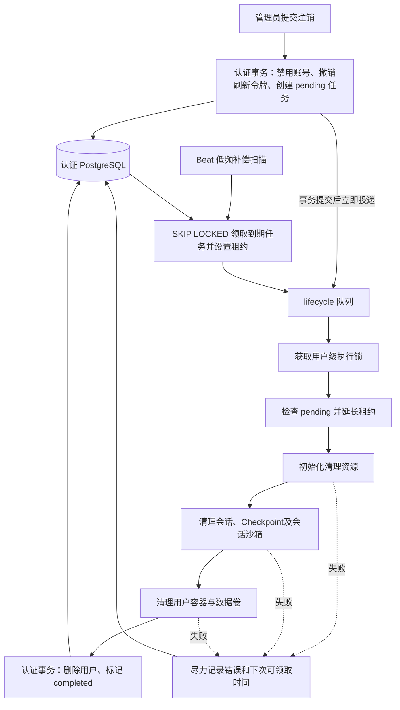

# 07. Workflows：跨模块变更与生命周期编排

Workflows 组合其他模块的公开能力，定义跨存储操作的执行顺序、提交边界和恢复策略。当前负责用户注销，以持久化任务驱动跨模块资源清理。

## 1. 模块结构与流程分类

| 工作流 | 输入 | 执行方式 | 状态归属 |
| --- | --- | --- | --- |
| 用户注销 | 用户 ID、操作管理员身份 | API 受理后投递 lifecycle，Worker 执行，Beat 补偿 | Identity 的 UserDeletionTask |

| 组件 | 职责 |
| --- | --- |
| UserDeletionService | 受理后的立即投递与清理顺序 |
| 任务执行入口 | 用户互斥、租约检查、资源创建与失败记录 |
| 到期调度入口 | 原子领取、逐条投递及批次错误隔离 |
| Task Scheduler | 提交消息并提供业务调用方所需的任务标识 |

工作流只协调顺序；各模块保留自己的验证、存储和幂等规则。持久化记录放在业务归属模块，不能把调用栈本身当作可靠进度。

## 2. 用户注销受理与执行流程

首次受理在数据库事务提交后立即投递 Celery，正常清理不等待扫描；管理员接口返回表示已受理，并非清理已完成。消息投递在线程中执行，避免阻塞 API 事件循环。投递失败仍保留 pending 记录，由补偿扫描恢复；重复受理不重复投递。禁用阻止后续认证请求，不等于立即取消其他进程中已经运行的 Agent。会话生命周期锁忙时，清理失败并等待重试。

## 3. 执行锁、短事务与资源生命周期

| 组件 | 职责 |
| --- | --- |
| `UserDeletionService.request_deletion()` | 禁止注销当前操作管理员，提交注销事务后立即投递 |
| `PostgresUserDeletionStateStore` | 注销受理、执行锁、领取/续租、失败及完成的数据库事务 |
| `IdentityPGRepo` | 注销记录的查询和更新，不负责消息投递 |
| `_dispatch_due_user_deletions()` | 批量领取并逐个投递，隔离每个用户的投递/回写错误 |
| `_process_user_deletion()` | 持锁校验任务，管理资源生命周期，统一记录执行失败 |
| `UserDeletionService.process()` | 在入口保护下依次清理会话、用户沙箱并完成认证状态 |

Worker 先创建认证库管理器，获取用户级非阻塞 advisory lock。未获得锁、任务缺失或已经完成时直接跳过，不初始化 LangGraph 或沙箱。

执行锁使用独立认证事务，清理期间占用一条认证数据库连接；受理、续租、失败回写和完成分别使用短事务。执行事务退出或数据库连接断开时释放锁。持锁后再次检查任务，避免仅凭消息中的 user_id 开始删除资源。

清理资源使用上下文管理器释放，失败回写在已取得的用户锁释放前执行。进程被强制终止、取消或数据库不可用时可能无法记录失败，后续依靠领取租约到期恢复。

## 4. 注销任务状态与幂等规则

任务只有 `pending` 和 `completed` 两种状态：

- 首次受理在同一认证事务内禁用账号、撤销刷新令牌并插入任务，保护最后一个活跃管理员。
- 重复受理不重置已有租约、失败信息或重试时间；插入冲突使用 `DO NOTHING`。
- 领取 pending 任务时把 `next_attempt_at` 推迟到租约截止时间；Worker 开始执行前再次延长。
- pending 同时包括等待执行、已投递、执行中和等待重试。租约用于控制重新调度，用户级执行锁负责防止并行清理。
- 部分资源已删除时可以从头重试。会话和沙箱模块处理自身的重复删除。
- 清理全部成功后，在同一认证事务内删除用户并标记 completed。重复完成和迟到失败不修改终态。

注销删除会话、Checkpoint、用户沙箱及认证用户。它不删除角色共享的 Doris 查询账号或搜索索引。是否扩展这些范围应作为独立行为调整。

## 5. 领取租约、补偿扫描与失败隔离

| 配置/常量 | 默认值 | 含义 |
| --- | --- | --- |
| `lifecycle.user_deletion_schedule_seconds` | 300 秒 | Beat 对漏投、失败和租约到期任务进行补偿扫描的周期 |
| `lifecycle.user_deletion_retry_seconds` | 60 秒 | 执行/投递失败后到下一次可领取的最短等待时间 |
| `lifecycle.cleanup_batch_size` | 100 | 每次领取任务数量上限 |
| `USER_DELETION_CLAIM_SECONDS` | 3900 秒 | 数据库领取租约，按任务硬时限加 300 秒计算 |
| `task_queue.task_time_limit_seconds` | 3600 秒 | Celery 单任务硬时间上限 |

首次清理以立即投递为主。注销任务不启用 Celery 自动重试；失败重试和漏投恢复统一由数据库到期任务扫描驱动。Broker 消息重投仍可能发生，由任务入口的用户锁和终态检查保护。不存在“整个注销最多重试三次”的限制。

失败后的最短等待不等于精确执行时间，还需等待下一轮补偿扫描及队列调度；正常首次投递只需等待队列调度。领取租约与 Redis 消息可见性分别命名，当前数值虽相同，职责不同。

投递某个用户失败时尽力记录重试时间；回写再次失败则保留原租约，继续处理批次中的其他用户。执行失败同样保留原始异常，不让记录异常替代清理根因。

## 6. 资源清理范围与完成条件

| 资源 | 用户注销时的处理 |
| --- | --- |
| 平台用户与 Refresh Token | 受理时禁用/撤销，清理成功后完成身份删除 |
| Conversation、Checkpoint | 调用 Assistant 清理全部会话及遗留记录 |
| 用户容器、卷及文件 | 调用 Sandbox 删除，用户删除标记保留 |
| 用户注销任务 | 完成后保持 completed，不被迟到失败覆盖 |
| 角色共享查询账号与权限 | 保留，不因一个平台用户注销而删除共享角色 |

完成条件是所有要求清理的外部资源操作成功后，认证事务删除用户并标记 completed。不存在覆盖 PostgreSQL、Docker 和 Redis 的统一事务；部分删除成功后再次运行，所属模块按资源已经不存在的情况继续完成。
