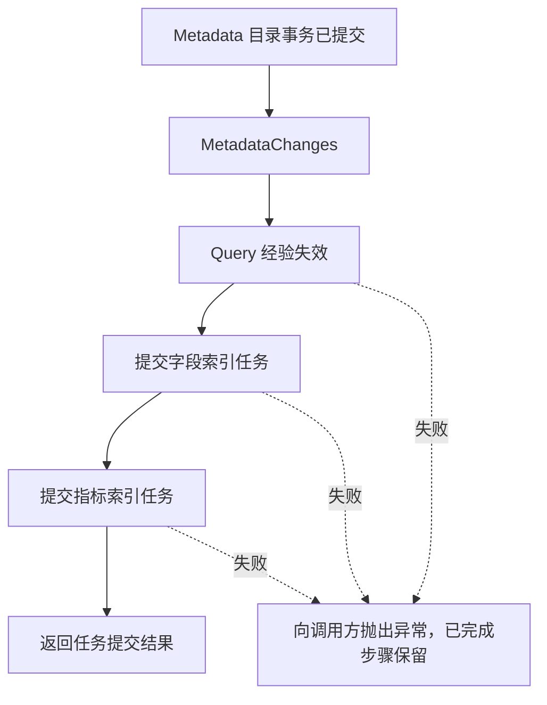
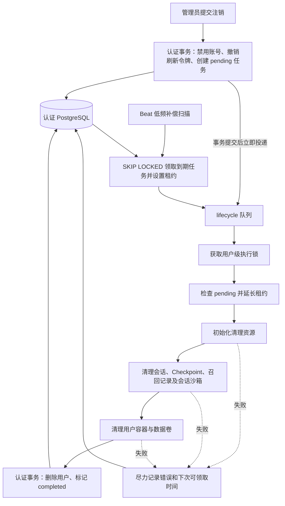

# 07. Workflows：跨模块变更与生命周期编排

Workflows 组合其他模块的公开能力，定义跨存储操作的执行顺序、提交边界和恢复策略。当前包含用户注销和元数据变更：注销以持久化任务驱动资源清理，元数据变更在目录提交后同步协调经验失效与索引投递。

工作流统一从 `app.workflows` 公开，业务调用只使用其他模块的公开出口（Identity、Metadata、Query、Sandbox、Assistant 的根包），数据契约和业务异常分别使用 `contracts`、`errors`。

## 1. 提供哪些功能

| 功能 | 触发方式 | 执行结果 |
| --- | --- | --- |
| 受理用户注销 | 管理员请求注销用户 | 禁用账号、撤销令牌、创建任务并立即投递 |
| 执行用户清理 | lifecycle Worker 消费任务 | 清理用户会话与沙箱，再完成身份删除 |
| 恢复未完成注销 | Beat 扫描到期任务 | 重新领取漏投、失败或租约过期的任务 |
| 处理元数据变更 | 目录写入提交后通知 | 先失效关联经验，再提交字段和指标索引 |

工作流调用各模块的公开服务，持久状态由业务归属模块保存。

## 2. 如何使用

### 2.1 受理注销请求

管理页面通过 `DELETE /api/v1/admin/users/{user_id}` 发起注销，要求管理员身份。HTTP 依赖取得 `UserDeletionService` 后调用：

```python
submitted = await user_deletions.request_deletion(
    user_id,
    operator_id=current_admin.id,
)
```

示例位于异步请求方法中，`user_deletions` 为已注入的 `app.workflows.UserDeletionService`。返回值表示是否首次受理；资源清理在 Worker 中继续执行。`process(user_id)` 由任务入口在取得用户执行锁并确认 pending 状态后调用。

### 2.2 处理已提交的元数据变更

从 `app.workflows` 导入 `MetadataChangeWorkflow` 或 `build_metadata_change_workflow`。HTTP 和 Worker 的组合入口使用查询数据库管理器创建工作流，并注入 Metadata 的目录或导入服务。

```python
from app.workflows import build_metadata_change_workflow

workflow = build_metadata_change_workflow(query_postgres)
# changes 为目录事务提交后生成的 MetadataChanges。
tasks = await workflow.handle(changes)
```

返回的 `MetadataChangeTasks` 包含字段和指标索引的可选任务提交结果。输入包含失效表、失效字段、待同步字段和待同步指标；空集合会跳过对应步骤。

### 2.3 运行后台任务

Worker 消费 `lifecycle` 队列，Beat 负责到期注销任务扫描。两者都需运行，注销首次投递和后续补偿才能持续推进。

```bash
uv run celery --app app.shared.tasks.celery_app:celery_app worker -l INFO
uv run celery --app app.shared.tasks.celery_app:celery_app beat -l INFO
```

任务相关周期、等待和批量参数位于 `conf/app_config.yaml` 的 `lifecycle` 和 `task_queue`。

## 3. 关键业务规则

### 3.1 注销状态与幂等

任务只有 `pending` 和 `completed` 两种状态：

- 首次受理在同一认证事务内禁用账号、撤销刷新令牌并插入任务，保护最后一个活跃管理员。
- 重复受理不重置已有租约、失败信息或重试时间；插入冲突使用 `DO NOTHING`。
- 领取 pending 任务时把 `next_attempt_at` 推迟到租约截止时间；Worker 开始执行前再次延长。
- pending 同时包括等待执行、已投递、执行中和等待重试。租约用于控制重新调度，用户级执行锁负责防止并行清理。
- 部分资源已删除时可以从头重试。会话和沙箱模块处理自身的重复删除。
- 清理全部成功后，在同一认证事务内删除用户并标记 completed。重复完成和迟到失败不修改终态。

注销删除会话、Checkpoint、召回记录、用户沙箱及认证用户。它不删除角色共享的 Doris 查询账号、查询经验或搜索索引，也不删除查询执行审计。

### 3.2 清理范围与完成条件

| 资源 | 用户注销时的处理 |
| --- | --- |
| 平台用户与 Refresh Token | 受理时禁用/撤销，清理成功后完成身份删除 |
| Conversation、Checkpoint、召回记录 | 调用 Assistant 清理全部会话及遗留记录 |
| 用户容器、卷及文件 | 调用 Sandbox 删除，用户删除标记保留 |
| 用户注销任务 | 完成后保持 completed，不被迟到失败覆盖 |
| 角色共享查询账号与权限 | 保留，不因一个平台用户注销而删除共享角色 |
| 查询经验与原始执行记录 | 不由此注销流程清除 |

完成条件是所有要求清理的外部资源操作成功后，认证事务删除用户并标记 completed。不存在覆盖 PostgreSQL、Docker 和 Redis 的统一事务；部分删除成功后再次运行，所属模块按资源已经不存在的情况继续完成。

### 3.3 元数据提交后顺序

管理员修改或导入元数据后，目录事务先提交，再把本次变更交给 `MetadataChangeWorkflow`。工作流只接收变更结果，不重新执行目录写入。

处理顺序是：先让受影响的旧查询经验失效，再投递字段语义索引任务，最后投递指标语义索引任务。受影响的经验会被排除在召回结果之外，新索引由 Worker 按版本异步建立。字段取值同步有自己的全量和增量入口，不是每次修改描述都重新扫描业务数据。

这里没有跨 PostgreSQL、Elasticsearch 和消息队列的原子提交。如果经验失效失败，后续索引任务不会继续投递；如果第二个任务投递失败，第一个任务可能已经进入队列。错误会向上暴露，不能把接口异常理解成目录事务已经回滚。排查时先确认目录当前值，再查看对应索引状态，必要时重新提交同步任务。

### 3.4 部分完成的恢复依据

| 变更字段 | 含义 | 后续动作 |
| --- | --- | --- |
| invalidated_tables | 已更新或删除的表资产 | 禁用依赖这些资产的经验 |
| invalidated_columns | 已更新或删除的字段资产 | 禁用依赖这些资产的经验 |
| sync_columns | 需要同步的字段目录 | 提交字段语义索引任务 |
| sync_metrics | 需要同步的指标目录 | 提交指标语义索引任务 |

删除资产只参与失效，不作为新索引资源重新提交。返回的 MetadataChangeTasks 保存字段和指标任务提交结果，便于接口返回任务标识。


```mermaid
flowchart TD
    COMMIT[Metadata 目录事务已提交] --> CHANGES[MetadataChanges]
    CHANGES --> INVALIDATE[Query 经验失效]
    INVALIDATE --> COLUMNS[提交字段索引任务]
    COLUMNS --> METRICS[提交指标索引任务]
    METRICS --> RESULT[返回任务提交结果]
    INVALIDATE -. 失败 .-> ERROR[向调用方抛出异常，已完成步骤保留]
    COLUMNS -. 失败 .-> ERROR
    METRICS -. 失败 .-> ERROR
```

该工作流没有独立持久化任务表，也没有自动回滚整个目录变更的机制。经验失效失败时不投递后续索引；指标任务投递失败时字段任务可能已经入队。恢复依据是目录版本、经验状态、索引版本和队列结果。

## 4. 内部实现

### 4.1 目录与流程归属

```text
workflows/
├── __init__.py          跨模块公开入口
├── metadata_changes.py 元数据变更工作流及其装配函数
├── user_deletion.py    用户注销受理与清理编排
├── task_scheduler.py   注销任务提交
└── tasks.py            执行锁、领取续租、资源管理和补偿扫描
```

| 工作流 | 输入 | 执行方式 | 状态归属 |
| --- | --- | --- | --- |
| 用户注销 | 用户 ID、操作管理员身份 | API 受理后投递 lifecycle，Worker 执行，Beat 补偿 | Identity 的 UserDeletionTask |
| 元数据变更 | 已提交的 MetadataChanges | 调用方等待经验失效和索引提交，索引工作异步执行 | Metadata 目录/索引版本与 Query 经验状态 |

| 组件 | 职责 |
| --- | --- |
| UserDeletionService | 受理后的立即投递与清理顺序 |
| MetadataChangeWorkflow | 先失效旧经验，再提交字段及指标索引 |
| 任务执行入口 | 用户互斥、租约检查、资源创建与失败记录 |
| 到期调度入口 | 原子领取、逐条投递及批次错误隔离 |
| `build_metadata_change_workflow` | 与元数据变更实现放在同一文件，为 HTTP 和 Worker 创建处理能力 |
| Task Scheduler | 提交消息并提供业务调用方所需的任务标识 |

工作流只协调顺序；各模块保留自己的验证、存储和幂等规则。持久化记录放在业务归属模块，不能把调用栈本身当作可靠进度。

### 4.2 注销执行流程


```mermaid
flowchart TD
    API[管理员提交注销] --> Request[认证事务：禁用账号、撤销刷新令牌、创建 pending 任务]
    Request --> DB[(认证 PostgreSQL)]
    Request -->|事务提交后立即投递| Queue
    Beat[Beat 低频补偿扫描] --> Claim[SKIP LOCKED 领取到期任务并设置租约]
    DB --> Claim
    Claim --> Queue[lifecycle 队列]
    Queue --> Lock[获取用户级执行锁]
    Lock --> Check[检查 pending 并延长租约]
    Check --> Init[初始化清理资源]
    Init --> Conversations[清理会话、Checkpoint、召回记录及会话沙箱]
    Conversations --> Sandbox[清理用户容器与数据卷]
    Sandbox --> Complete[认证事务：删除用户、标记 completed]
    Complete --> DB
    Init -. 失败 .-> Retry[尽力记录错误和下次可领取时间]
    Conversations -. 失败 .-> Retry
    Sandbox -. 失败 .-> Retry
    Retry --> DB
```

首次受理在数据库事务提交后立即投递 Celery，正常清理不等待扫描；管理员接口返回表示已受理，并非清理已完成。消息投递在线程中执行，避免阻塞 API 事件循环。投递失败仍保留 pending 记录，由补偿扫描恢复；重复受理不重复投递。禁用阻止后续认证请求，不等于立即取消其他进程中已经运行的 Agent。会话生命周期锁忙时，清理失败并等待重试。

### 4.3 锁、事务和资源

| 组件 | 职责 |
| --- | --- |
| `UserDeletionService.request_deletion()` | 禁止注销当前操作管理员，提交注销事务后立即投递 |
| `app.identity.UserDeletionStateService` | 注销受理、执行锁、领取/续租、失败及完成的数据库事务 |
| `IdentityPGRepo` | 注销记录的查询和更新，不负责消息投递 |
| `_dispatch_due_user_deletions()` | 批量领取并逐个投递，隔离每个用户的投递/回写错误 |
| `_process_user_deletion()` | 持锁校验任务，管理资源生命周期，统一记录执行失败 |
| `UserDeletionService.process()` | 在入口保护下依次清理会话、用户沙箱并完成认证状态 |

Worker 先创建认证库管理器，获取用户级非阻塞 advisory lock。未获得锁、任务缺失或已经完成时直接跳过，不初始化 LangGraph 或沙箱。

执行锁使用独立认证事务，清理期间占用一条认证数据库连接；受理、续租、失败回写和完成分别使用短事务。执行事务退出或数据库连接断开时释放锁。持锁后再次检查任务，避免仅凭消息中的 user_id 开始删除资源。

清理资源使用上下文管理器释放，失败回写在已取得的用户锁释放前执行。进程被强制终止、取消或数据库不可用时可能无法记录失败，后续依靠领取租约到期恢复。

### 4.4 领取、续租与补偿

| 配置/常量 | 默认值 | 含义 |
| --- | --- | --- |
| `lifecycle.user_deletion_schedule_seconds` | 300 秒 | Beat 对漏投、失败和租约到期任务进行补偿扫描的周期 |
| `lifecycle.user_deletion_retry_seconds` | 60 秒 | 执行/投递失败后到下一次可领取的最短等待时间 |
| `lifecycle.cleanup_batch_size` | 100 | 每次领取任务数量上限 |
| `USER_DELETION_CLAIM_SECONDS` | 3900 秒 | 数据库领取租约，按任务硬时限加 300 秒计算 |
| `task_queue.task_time_limit_seconds` | 3600 秒 | Celery 单任务硬时间上限 |

首次清理以立即投递为主。注销任务不启用 Celery 自动重试；失败重试和漏投恢复统一由数据库到期任务扫描驱动。Broker 消息重投仍可能发生，由任务入口的用户锁和终态检查保护。pending 任务持续按到期时间重新调度，直至成功完成。

失败后的最短等待不等于精确执行时间，还需等待下一轮补偿扫描及队列调度；正常首次投递只需等待队列调度。领取租约与 Redis 消息可见性分别命名，当前数值虽相同，职责不同。

投递某个用户失败时尽力记录重试时间；回写再次失败则保留原租约，继续处理批次中的其他用户。执行失败同样保留原始异常，不让记录异常替代清理根因。

## 5. 异常与排障

| 现象 | 检查与处理 |
| --- | --- |
| 注销接口已返回，资源仍存在 | UserDeletionTask 是否 pending、任务是否入队、Worker 是否消费 lifecycle |
| 注销重复投递 | 查看领取租约和用户执行锁，确认是否同一任务的恢复投递 |
| 注销失败后没有立即重试 | next_attempt_at、补偿扫描周期和队列等待时间 |
| 清理期间账号一直禁用 | pending 状态会保持禁用，先处理最后错误再等待重试 |
| 清理锁忙 | 当前会话或用户是否有其他执行，等待其退出后重试 |
| 元数据接口失败但目录已变化 | 目录已提交，按经验失效和索引投递阶段确认剩余工作 |
| 字段索引有任务、指标索引没有 | 检查第二阶段投递错误，已入队任务按各自状态继续 |
| 写失败记录也报错 | 保留原执行异常，待现有租约到期后由扫描恢复 |

注销以 Identity 中的任务状态为准，元数据变更以目录版本、经验状态和索引版本为准。修复故障后补做未完成阶段，已完成的外部操作按各模块幂等规则处理。
