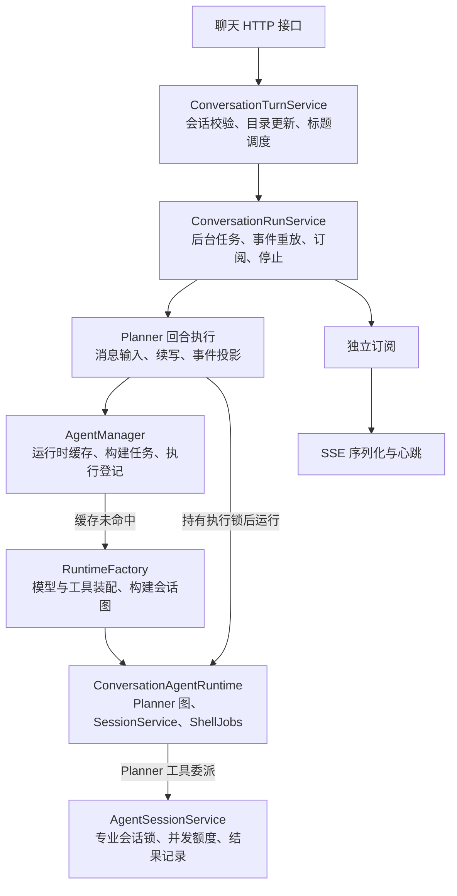

# 08. 业务链路审查与简化计划

本文记录代码组织优化之后的五部分检查范围、验收标准及审查结论。按实际业务链路判断职责是否重复，不以减少目录或类的数量作为目标。

## 1. 范围与实施顺序

| 顺序 | 检查范围 | 具体处理内容 | 验收标准 | 状态 |
| --- | --- | --- | --- | --- |
| 1 | 发送消息与执行管理 | 明确 Turn、Run、Agent Runtime、Specialist Session 的归属；检查运行状态、锁、取消、清理的重复维护；识别只转发的方法 | 新消息、断线重连、停止、恢复和并发限制保持一致；执行入口与结束路径更容易追踪 | 首轮审查完成；第 1～4 项已实施 |
| 2 | 召回能力 | 梳理工具转换、检索、权限过滤、快照读写、消息展开；收回跨模块仓储与事务组装；统一重复授权读取 | 工具层职责单一；历史展示与模型上下文仍使用当前权限；减少重复服务组装 | 待审查 |
| 3 | Checkpoint 读取 | 对照实际图状态检查消息还原、pending writes、待执行节点；评估公开接口能否替代手工逻辑 | 历史和恢复判断正确；历史读取无需启动模型与沙箱；无法消除的框架依赖集中并有测试 | 待审查 |
| 4 | 执行 SQL | 检查身份解析、权限校验、执行、产物、记录中的上下文传递、错误包装和转发；核对会话范围 | 权限、超时、结果限制和记录行为不变；Doris 执行不占用无关 PostgreSQL 事务 | 待审查 |
| 5 | 注销用户 | 核对受理、领取、清理、完成、重试的状态转换；检查重复调度和清理；明确扫描与重试配置含义 | 禁用立即生效；清理可重试、可重复执行；状态和调度规则可读 | 待审查 |

约束：

- 从底层职责和资源所有权开始调整，再同步所有调用方；不加旧路径转发或兼容别名。
- 每部分单独审查、实施和验证，避免同时改变多条业务链路。
- 性能、并发或正确性缺口单独说明，不把修复伪装成纯结构调整。
- “注销后立即投递，定时扫描仅做补偿”是行为调整，需单独决定，本计划不默认实施。

## 2. 第一部分：发送消息的实际链路

审查基线：`119c47b`，日期：2026-09-18。以下审查发现基于该版本；第 1～4 项的后续实施结果见文末。

此前用一条箭头串起所有类只是概览。实际包含请求受理、后台执行、运行时装配和工具委派几条协作关系：



### 2.1 审查基线的职责与保留理由

| 代码 | 实际职责 | 初步判断 |
| --- | --- | --- |
| [turn.py](../app/assistant/execution/turn.py) | 请求级会话归属校验、草稿转正式会话、标题更新与调度、恢复前检查 | 有业务内容，保留；不放入事件广播服务 |
| [run.py](../app/assistant/execution/run.py) | 持有后台 Task、订阅队列、有界重放、停止及关闭 | 有独立生命周期，保留；断开订阅不应取消执行 |
| [planner.py](../app/assistant/execution/planner.py) | 转换输入、执行图、处理自动续写、投影事件 | 核心职责保留，内部转发层有合并空间 |
| [manager.py](../app/assistant/execution/manager.py) | 缓存运行时、合并并发构建、登记执行、处理删除与墓碑 | 保留运行时管理；进一步明确与 Run 的 Task 所有权 |
| [runtime_factory.py](../app/assistant/execution/runtime_factory.py) | 管理模型客户端、构建工具和会话图 | 保留装配职责，不并入请求或消息循环 |
| [session_service.py](../app/assistant/execution/session_service.py) | 专业会话并发、锁、委派执行、结果校验与记录 | 粒度是 Specialist Session，与 Conversation Run 不重复 |

### 2.2 状态与锁不是简单重复

- `ConversationRunService._runs`：从任务创建起持有后台 Task，并管理 SSE 事件和订阅。
- `AgentManager._conversation_run_tasks`：进入 `execution()` 后登记当前 Task，用于删除取消、关闭和阻止活跃运行时被缓存淘汰。在当前 Web 执行链中，登记的是 Run 持有的同一个 Task，但覆盖时间不同。
- `AgentManager._runtime_build_tasks`：独立的运行时构建 Task。`asyncio.shield` 允许调用方取消后构建继续，不能视作 Run 的重复记录直接删掉。
- `AgentSessionService._active_sessions`：专业会话的运行状态与防重入标记，不代表整个 Conversation 是否运行。
- Run 的进程内锁保护注册、重放快照与订阅队列；Manager 的锁保护缓存和任务登记；数据库 advisory lock 防止跨进程同时执行/清理；Session 锁和并发额度保护专业会话。锁的对象与范围不同，不能按“锁多”合并。

## 3. 第一部分的具体发现

### 3.1 任务尚未开始时的取消不能完成收尾（已修复）

位置：`run.py` 的 `_start()`、`stop()`、`_execute()`、`_finish()`。

`_start()` 在注册 Run 后使用 `asyncio.create_task()`，结束通知只在 `_execute()` 的 `finally` 中发布。如果 Task 在协程首次执行之前被取消，该协程的 `finally` 不会运行。

本地使用真实 `ConversationRunService`、模拟其外部依赖，按下面顺序已复现：

```python
subscription = await runs.resume_turn(user_id, conversation_id)
stopped = await runs.stop(user_id, conversation_id)  # 中间不让出执行权
```

观察结果：

- `stop()` 返回 `True`，`is_running()` 返回 `False`。
- `_runs` 仍保留该 Run。
- 等待订阅首个事件超时，没有收到 `done`。

这是确定的服务级取消边界复现，不代表已复现浏览器请求的完整时序。现有取消测试都先等待执行开始，未覆盖这个窗口。`close()` 同样依赖后台协程的收尾，需要一并验证。

建议：让 Run 的任务拥有者保证任务结束后的收尾；完成动作应可重复调用但只广播一次。覆盖正常完成、运行中取消、启动前取消和应用关闭。不要只在 `stop()` 再发一次 `done`，否则可能重复通知。

### 3.2 Planner 的输入分支和生成器转发（已简化）

审查时的路径是：

```text
Run._execute
  → run_agent_turn / resume_agent_turn
  → _run_agent_turn
  → _execute_agent
  → runtime.planner.astream
```

`run_agent_turn` 与 `resume_agent_turn` 主要区别是日志和初始输入；`_execute_agent` 负责固定的配置构造后转发原始流。

建议：收敛为一个明确的 Planner 执行入口，合并只转发的生成器层，保留续写与事件转换逻辑。合并时必须保持三种输入语义：

| 场景 | 图输入 |
| --- | --- |
| 新消息 | `{"messages": [HumanMessage(...)]}` |
| 恢复 | `None` |
| 自动续写 | `{"messages": []}` |

不能用真值判断把 `None` 与空列表混淆。减少生成器层时同步保证取消和关闭能到达实际图流，不只检查输出内容。

### 3.3 同一执行 Task 的两处登记（已统一归属）

`Run._runs[key].task` 与 `Manager._conversation_run_tasks[key]` 在图执行期间指向同一个 Task，停止由 Run 发起，删除取消则由 Manager 发起。

这不是两次启动，但形成了两个控制入口。建议先记录并补齐“构建中、等待锁、执行中、结束后”四个阶段的取消和缓存保护测试，再决定是否由 Run 统一拥有执行 Task，Manager 只保留运行时使用状态与构建任务。

不能直接删除 Manager 的登记：会同时影响会话删除、运行时淘汰保护和关闭时的任务回收。也不建议为了统一而让 Manager 和 Run 相互调用形成循环依赖。

### 3.4 受理与实际执行存在两个阶段（已收敛持锁边界）

`Turn.start()` 先在生命周期锁内提交会话目录修改与标题任务，释放锁后才调用 Run 注册；后台 Planner 随后获取运行时并重新获取执行锁。

因此，目录更新完成不等同于消息已被图接收。`resume()` 的可恢复检查同样发生在实际执行锁之前。建议为双请求、删除交错和恢复交错补时序验证，确认期望的错误响应和目录更新行为，再调整受理边界。

这里是源码可见的时间窗口与审查候选，尚未把它认定为已复现的数据错误。不要把受理锁简单延长到整个模型调用，也不要删除跨进程执行锁。

## 4. 第一部分建议的实施次序

1. 补启动前停止、启动前关闭的测试，修复 Run 收尾缺口。
2. 合并 Planner 的纯转发生成器层，保持新消息、恢复和续写输入差异。
3. 补构建、删除、缓存淘汰等交错测试，再决定执行 Task 登记的归属调整。
4. 对请求受理与真正开始执行之间的窗口单独验证，不混入无证据的并发改写。

验证范围：新消息只写入一次、恢复不增加用户消息、自动续写上限、断线不停止后台执行、重连事件顺序、慢订阅隔离、停止后可重新运行、跨进程互斥、删除阻止重建、异常与取消释放资源。

## 5. 第 1、2 项实施结果

- Run 在创建 Task 时注册唯一的完成回调。任务正常返回、报错或首次执行前被取消，均由该回调移除注册、发送 `done` 并结束订阅。
- 完成回调同步运行，回调内不含 `await`；与同一事件循环中不让出执行权的注册表操作保持原子性。没有额外的异步清理任务，也不在 `stop()`、`close()` 分别补发结束事件。
- 底层执行流先关闭，Task 才完成，订阅者随后收到结束通知。慢订阅的队列上限和断开处理保留。
- Planner 保留单一 `run_agent_turn(..., user_message: UserMessageRequest | None)` 入口；删除 `resume_agent_turn`、`_run_agent_turn`、`_execute_agent` 三个生成器转发层，Run 直接传入消息或 `None`。
- 图流使用 `aclosing` 显式关闭，保证在消费方提前关闭或消息投影抛异常时，先清理图流，再释放执行上下文。
- 第 3、4 项的后续调整见下节。

验证：新增 6 项测试，覆盖启动前停止、启动前关闭、执行异常、断线后重连，以及提前关闭/投影异常时的图流清理顺序；原有测试继续验证恢复输入为 `None`、新消息及续写输入数量为 `[1, 0, 0]`、续写上限及执行中取消。

全量后端回归：234 个测试、61 个子测试通过。


## 6. 第 3、4 项实施结果

### 6.1 执行 Task 由 Run 统一持有

- 删除 Manager 的执行 Task 注册表、`execution()` 和执行取消入口；停止、应用关闭和删除请求均通过 Run 停止本进程执行。
- Manager 保留独立构建 Task 和 `use_runtime()` 借用计数。从等待构建开始保护运行时，借用结束后允许缓存淘汰；它不再持有执行 Task。
- 运行时对象只保存 Planner、SessionService、ShellJobs，删除锁和墓碑回调。Manager 负责墓碑检查，Run 负责执行互斥。
- 物理删除取得生命周期锁后才使构建失效；即便构建吞掉取消并迟到返回，结果也会被清理，不会重新进入缓存。
- Web 生命周期服务显式接收 Run；后台清理任务不创建 Run。依赖方向为生命周期服务 → Run → Planner → Manager，没有双向调用。

### 6.2 受理与执行共用一次生命周期锁

```text
HTTP → Turn 提供业务 prepare → Run 注册 Task
  → 后台 Task 获取会话生命周期锁
  → prepare：校验会话、提交目录事务、调度标题 / 检查恢复状态
  → 通知 HTTP 受理完成，返回 SSE 订阅
  → Planner 借用运行时、执行图、释放运行时
  → 释放生命周期锁 → Task 完成回调通知 done
```

- HTTP 只等待受理结果；后台 Task 独立执行。目录事务在模型执行前结束，不把 PostgreSQL 业务事务延长到整个模型调用。
- 不再先释放受理锁、再重新获取执行锁；跨进程生命周期锁继续覆盖执行全过程，同时覆盖构建阶段。
- 同进程重复请求在注册时拒绝，其他进程锁冲突在业务 prepare 前拒绝，避免失败请求更新目录或投递标题任务。
- 会话不存在、不可恢复和锁冲突在 SSE 开始前返回对应 HTTP 错误；受理成功后的执行错误仍走 SSE。
- 受理过程中请求取消会取消后台任务并等待清理；受理成功后断开 SSE 仍不停止执行。
- 删除请求先确认目标有效，再通过 Run 停止本进程执行，之后持锁重新检查并标记删除。其他进程执行仍返回忙碌，由调用方重试；没有新增跨进程取消机制。

### 6.3 验证范围与边界

新增测试覆盖同进程受理期间重复请求、两个 Run 实例共用锁时目录只更新一次、恢复检查持锁、目录事务先于模型关闭、删除与执行交错、无效草稿删除不停止执行、受理失败与取消、运行时借用保护、取消等待者后共享构建继续，以及删除时迟到构建结果回收。原有新消息、恢复、续写、断线重连和取消测试继续保留。

跨实例互斥使用可控的内存锁模拟 PostgreSQL advisory lock，不等同于真实多进程数据库联调；模型、沙箱同样使用替身。本次全量回归：245 个测试、61 个子测试通过；Pyright、Ruff、格式检查与 OpenAPI 类型同步校验通过。
