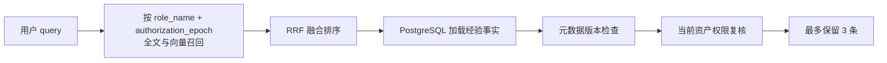

# 角色级查询经验共享改造方案

## 1. 结论

查询经验的共享范围收敛到同一个 Doris 角色。同一角色下的所有平台用户共享查询经验，不同角色之间完全隔离。

目标召回链路为：



核心设计决定：

- `QueryExecution` 继续记录执行用户、角色、原始 `purpose`、SQL 和结果摘要，承担用户查询审计职责。
- `QueryExperience` 改为角色级共享聚合，唯一键为 `(role_name, fingerprint)`。
- 成功执行沉淀的 `purpose` 进入角色共享经验，ES 索引可以继续使用最近的任务文本增强语义召回。
- 用户注销保留全部查询执行审计和角色共享经验，不触碰查询模块的 PostgreSQL 与 ES 数据。
- SQL 仍以字面量参数化后的 `sql_template` 形式共享，避免历史参数污染新问题，也保持指纹稳定。
- ES 只按角色授权范围预过滤；PostgreSQL 加载后继续执行当前权限复核和元数据版本检查。
- 最终返回相关性最高且仍然有效的最多 3 条经验。

## 2. 当前实现及需要调整的原因

当前经验按 `(owner_user_id, role_name, fingerprint)` 聚合，ES 全文与向量检索同时过滤 `owner_user_id` 和 `role_name`，PostgreSQL 回查也要求经验属于当前用户。因此一个角色内的多个用户无法复用彼此的成功查询。

直接移除 `owner_user_id` 过滤会带来以下问题：

1. 相同角色的每个用户都可能保存同一个 SQL 指纹，重复文档会占用召回候选池，最终结果也可能出现重复模板。
2. 当前经验拥有单一 `owner_user_id`，用户注销会删除该用户沉淀的全部经验，角色内其他用户无法继续复用。
3. 仅按角色名检索无法识别角色撤权、Row Policy 变化和同名角色重建，旧经验可能继续进入候选集。
4. 当前查询经验权限过滤对无显式字段的 SQL 使用“表可见”判断；`COUNT(*)` 等模板需要整表读取权限，判定应与 SQL Guard 对齐。
5. 会话级查询经验缓存没有记录来源角色。用户切换角色后，原角色的缓存结果可能继续复用。

## 3. 共享边界

### 3.1 角色是查询经验的安全边界

平台中的一个 Doris 角色对应一个稳定共享查询身份。同一角色用户具有相同的 Doris SELECT 授权与 Row Policy，因此可以共享：

- 原始 `purpose`；
- 参数化 SQL 模板；
- 表字段血缘；
- 查询经验的语义向量。

不同角色的经验不参与当前请求的候选召回。即使两个角色拥有相同的表字段权限，也不会互相看到 `purpose` 或 SQL 模板。

### 3.2 SQL 模板继续参数化

成功 SQL 继续通过 AST 将字面量替换为 `:p1`、`:p2` 等占位符，再生成结构指纹。例如：

```sql
SELECT SUM(amount) FROM orders WHERE region = '华东';
SELECT SUM(amount) FROM orders WHERE region = '华南';
```

会聚合到同一个模板：

```sql
SELECT SUM(amount) FROM orders WHERE region = :p1;
```

参数化的目的包括稳定聚合、避免历史过滤值干扰当前问题、限制索引中保存的数据内容。Agent 根据当前用户问题生成本次实际字面量，最终 SQL 仍经过 Guard 和当前角色执行。

## 4. 数据模型调整

### 4.1 `DorisQueryIdentity`

增加：

```text
authorization_epoch: UUID
```

语义：标识角色当前的安全授权代次。角色创建时生成随机 UUID；发生收窄权限或改变行级数据范围的操作时生成新的 UUID。

必须轮换代次的操作：

- `revoke_select`；
- `revoke_all_select`；
- 创建 Row Policy；
- 删除 Row Policy；
- 角色删除后使用同名角色重新创建。

`grant_select` 是权限扩大，可以保留当前代次。此前有效的经验仍然有效，新授权资产的经验会在成功执行后自然产生。

使用随机 UUID 可以避免同名角色删除重建后与旧整数版本发生碰撞。

### 4.2 `QueryExperience`

字段调整：

| 字段 | 调整 | 说明 |
| --- | --- | --- |
| `owner_user_id` | 删除 | 共享经验没有唯一用户所有者 |
| `role_name` | 保留 | 角色级共享边界 |
| `authorization_epoch` | 新增 | 记录经验产生时的角色授权代次 |
| `fingerprint` | 保留 | SQL 结构指纹 |
| `sql_template` | 保留 | 参数化的共享 SQL 模板 |
| `representative_sql` | 删除 | 原始字面量 SQL 已由执行记录保存，共享经验无需重复保存 |
| `purposes` | 保留 | 当前授权代次内最近的角色共享任务文本 |
| `quality/revision/indexed_revision` | 保留 | 有效性及 ES 投影同步状态 |

唯一约束改为：

```text
UNIQUE (role_name, fingerprint)
```

`QueryExperienceAsset` 保持经验资产快照职责，用于元数据版本检查和当前权限复核。

`purposes` 使用有界去重列表，例如最多保存最近 20 条。相同授权代次下出现新 `purpose` 时追加并裁剪；经验从旧 `authorization_epoch` 恢复到新代次时将列表重置为当前成功执行的 `purpose`，防止旧 Row Policy 范围下的任务文本进入新代次。

### 4.3 `QueryExecution`

继续保存：

- `user_id`；
- `role_name`；
- `authorization_epoch`；
- `purpose`；
- `raw_sql`、`normalized_sql` 和 `sql_template`；
- `experience_id`。

执行记录作为不可变审计事实长期保留。用户注销后，`user_id` 继续作为历史主体标识，原始 SQL、`purpose`、校验结果、执行状态和结果摘要均不删除。

### 4.4 会话召回快照

`SemanticRecallRecord` 的查询经验缓存增加作用域：

```text
query_experience_role_name: str | None
query_experience_authorization_epoch: UUID | None
```

读取一天有效期缓存时，只有以下条件同时满足才返回缓存：

- 当前用户角色与缓存角色一致；
- 当前角色 `authorization_epoch` 与缓存一致；
- 缓存时间仍在 TTL 内；
- 缓存中的每条经验仍通过当前资产权限过滤。

角色变化或授权代次变化时直接视为缓存未命中，重新执行经验召回。

## 5. 记录与聚合流程

### 5.1 查询身份上下文

`ResolvedQueryPrincipal` 和 `QueryExecutionContext` 增加 `authorization_epoch`。执行、Guard 校验和成功经验记录使用同一次解析得到的角色与授权代次，避免一次请求中混用两个权限状态。

### 5.2 成功执行

`QueryExperienceService.record_success` 调整为：

1. 从规范化 SQL 生成 `sql_template` 和 `fingerprint`。
2. 按 `(role_name, fingerprint)` 原子 upsert 角色经验。
3. 更新 `authorization_epoch`、SQL 模板、角色共享 `purposes` 和资产版本快照。
4. 写入当前用户的 `QueryExecution` 并关联共享经验，保留个人审计事实。
5. 增加经验 `revision`，提交 ES 投影同步任务。

同一个角色内，不同用户执行相同结构 SQL 时只更新一条经验。原始执行事实按用户记录，可复用的模板和 purpose 同时沉淀为角色知识。

### 5.3 ES 投影文本

索引同步时从经验的有界 `purposes` 中读取最近 5 个任务文本，与表字段名称组成索引文本：

```text
表名与字段名
最近的角色内 purpose
```

ES 文档不保存原始 SQL、历史字面量、结果样例和用户 ID。

## 6. ES 召回改造

ES 映射调整为：

```json
{
  "role_name": {"type": "keyword"},
  "authorization_epoch": {"type": "keyword"},
  "text": {"type": "text"},
  "embedding": {"type": "dense_vector"}
}
```

删除 `owner_user_id` 字段。全文检索和 KNN 检索统一使用：

```json
[
  {"term": {"role_name": "当前 Doris 角色"}},
  {"term": {"authorization_epoch": "当前角色授权代次"}}
]
```

这一过滤发生在候选召回阶段，因此其他角色和旧授权代次的经验不会占用当前角色的前 100 个全文或向量候选。

全文与向量通道继续使用 RRF 融合。融合后按得分降序处理，并在全部有效性检查完成后截取最多 3 条。

## 7. PostgreSQL 回查与最终权限复核

`QueryExperiencePGRepo.get_many` 调整为按以下条件读取：

- `id IN semantic_ids`；
- `role_name == current_role_name`；
- `authorization_epoch == current_authorization_epoch`。

不再接收 `user_id`。

服务层继续执行最终资产权限复核。该复核用于覆盖索引投影异常、并发权限变化和持久化数据错误，不能依赖 ES 过滤替代。

权限判定应抽成唯一的公共方法，供实时召回和会话缓存读取共同调用：

- 某张表存在显式字段资产时，要求所有引用字段均具备读取权限。
- 某张表没有字段资产时，要求具备整表读取权限；`table_is_visible` 不能用于该判断。
- 任一表或字段不满足条件时，整条查询经验不可见。

SQL 最终执行时仍由 Query Guard 和 Doris 权限进行后续校验。

## 8. 权限与 Row Policy 变更

### 8.1 授权代次轮换

权限收窄和 Row Policy 变化必须在管理用例中轮换 `authorization_epoch`。认证库中的授权投影变更与代次更新保持同一事务；Doris 操作失败时沿用现有补偿机制。

代次轮换后：

- 旧 ES 文档因代次不匹配立即退出新召回；
- 旧会话查询经验缓存因代次不匹配立即失效；
- PostgreSQL 回查拒绝旧代次经验；
- 新授权状态下成功执行的 SQL 会恢复或创建新代次经验。

可以在后台清理旧代次经验及其 ES 文档。正确性不依赖清理完成时间。

### 8.2 角色切换

用户切换 Doris 角色后，新的访问令牌与后续请求解析出新角色。查询经验缓存同时比较角色名和授权代次，因此不会复用原角色经验。

## 9. 用户注销

用户注销不清理查询模块中的任何历史数据。查询执行是审计事实，成功查询经验是对应 Doris 角色的共享知识，两者都需要持续保留。

保留范围：

1. 保留该用户的全部 `QueryExecution`，包括 `user_id`、角色、原始 SQL、`purpose`、校验信息、执行状态和结果摘要。
2. 保留所有 `QueryExperience`、`QueryExperienceAsset` 和对应 ES 文档。
3. 保留角色经验中的 `purposes`，供同角色用户检索和复用。

认证库中的用户主体可以被删除，Meta PostgreSQL 中的 `QueryExecution.user_id` 作为历史审计标识继续存在。两个数据库之间没有外键约束，不影响用户记录删除。该保留策略需要在产品的数据留存和审计规则中明确说明。

沙箱文件仍按现有用户注销流程清理。`QueryExecution.result_summary` 中的 Schema、行数和时间范围继续保留，其中记录的产物路径在沙箱删除后可能无法访问；查询结果样例和 CSV 内容原本就不保存在查询执行表中。

## 10. 接口与调用方调整

### 10.1 底层模型与仓储

- `app/identity/models/doris.py`
  - `DorisQueryIdentity` 增加 `authorization_epoch`。
- `app/query/models/experience.py`
  - 改为角色级经验模型和唯一约束。
- `app/query/models/execution.py`
  - 保存执行时的授权代次，继续承担用户级查询审计。
- `app/query/repositories/experience_postgres.py`
  - upsert 和批量加载改为角色级语义；删除按用户清理查询执行和经验的方法。
- `app/query/repositories/experience_index.py`
  - 删除用户字段和用户过滤，增加授权代次过滤。

### 10.2 服务与编排

- `app/query/services/principal.py`
  - 解析角色时同时返回授权代次。
- `app/query/services/execution_handler.py`
  - 将同一次解析得到的授权代次传给经验记录服务。
- `app/query/services/experience.py`
  - 按角色聚合、索引和召回；最终权限校验后取 3 条。
- `app/identity/services/doris_permission.py`
  - 在撤权和 Row Policy 变化时轮换角色授权代次。
- `app/query/services/user_cleanup.py`
  - 删除整个查询历史清理服务，用户注销不再调用查询模块。
- `app/metadata/services/authorization_filter.py`
  - 提供统一的查询经验资产权限判断。

用户注销编排同步收口：

- `app/workflows/contracts.py`
  - 删除 `UserQueryHistoryCleaner` 协议。
- `app/workflows/user_deletion.py`
  - 删除查询历史清理依赖和调用步骤。
- `app/workflows/tasks.py`、`app/providers.py`
  - 删除 `QueryHistoryCleanupService` 的构造与注入。

### 10.3 Explorer 与缓存

- `app/analytics/agents/explorer/tools/semantic_recall.py`
  - 传递当前角色和授权代次，移除经验召回的用户范围参数。
- `app/metadata/models/recall.py`
  - 保存经验缓存的角色和授权代次。
- `app/metadata/services/recall.py`
  - 缓存命中前检查角色、授权代次和当前资产权限。
- `app/metadata/repositories/recall.py`
  - 序列化与反序列化新的缓存作用域字段。

`QueryExperienceRecallResult` 可以继续保留 `purpose`、`sql_template` 和资产列表，上层 Agent 的消费结构无需增加兼容别名。

## 11. 测试范围

### 11.1 经验记录与聚合

- 不同用户、相同角色、相同指纹聚合为一条经验。
- 不同角色、相同指纹保存为两条经验。
- 相同结构、不同 SQL 字面量生成同一指纹。
- 最近 purpose 沉淀到角色经验的有界去重列表。
- 新授权代次恢复经验时重置 purposes，不保留旧代次任务文本。
- ES 投影不包含用户 ID、原始 SQL、历史字面量和结果样例。

### 11.2 召回与权限

- 当前用户可以召回同角色其他用户贡献的经验。
- 不同角色经验不会进入全文和向量候选。
- 旧 `authorization_epoch` 经验不会进入候选。
- PostgreSQL 回查再次限制角色和授权代次。
- 无显式字段的查询要求整表权限。
- 包含未授权字段的经验被整体过滤。
- 权限过滤完成后最多返回 3 条，顺序遵循 RRF 得分。
- 全文或向量单通道失败时仍保持现有 `partial` 行为。

### 11.3 权限与缓存生命周期

- 撤销 SELECT 权限后角色授权代次轮换。
- Row Policy 创建或删除后角色授权代次轮换。
- 用户切换角色后旧角色缓存不命中。
- 授权代次变化后旧缓存不命中。
- 用户注销后完整保留个人查询执行审计。
- 用户注销后其贡献的角色经验、purpose 和 ES 投影继续保留。
- 用户注销任务不调用查询历史清理服务。
- 沙箱删除后结果摘要仍保留，历史产物路径允许不可访问。

## 12. 实施顺序

按照底层抽象向上修改：

1. 调整角色身份、查询经验和执行记录模型。
2. 修改 PostgreSQL 仓储的角色级 upsert 和查询语义，删除用户查询历史清理能力。
3. 修改 ES 映射、索引文档和角色授权代次过滤。
4. 修改角色解析、权限变更与 Row Policy 管理链路。
5. 修改查询经验记录、召回、权限复核和索引同步服务。
6. 修改语义召回缓存作用域和 Explorer 调用方。
7. 更新单元测试、架构文档和后台任务说明。
8. 重建开发环境中的查询经验表、执行表和 ES 查询经验索引。

项目处于开发阶段，本次直接收口到新模型，不增加旧接口别名、转发方法或历史数据兼容层。SQLAlchemy `create_all` 不会修改已有表结构，开发数据库需要明确重建相关表；ES 索引映射变化后需要删除并重建查询经验索引。

## 13. 验收标准

- 用户能够召回同 Doris 角色内所有用户贡献的有效查询经验。
- 用户无法召回其他角色或旧授权代次的经验。
- 相同角色和 SQL 指纹只存在一条共享经验。
- 召回结果包含可读的原始 `purpose`，无需模型生成或改写。
- ES 候选阶段完成角色与授权代次过滤。
- 服务层使用最新资产权限和元数据版本再次校验。
- 最终结果按融合相关性排序并最多返回 3 条。
- 用户注销完整保留 `QueryExecution`、原始 SQL、结果摘要和历史主体标识。
- 用户注销不删除其贡献的角色共享经验。
- 角色切换、撤权和 Row Policy 变化后不存在陈旧经验泄露。
