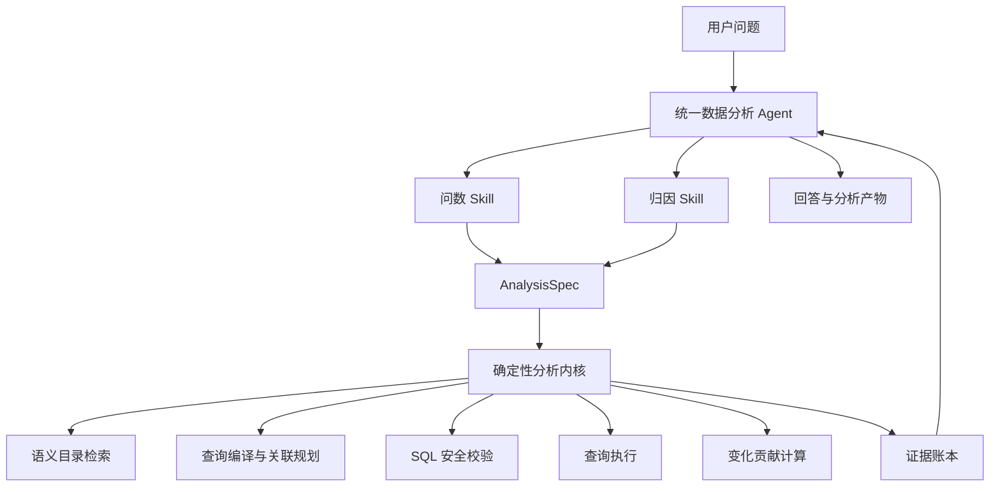

# 统一数据分析 Agent 架构设计

## 1. 文档状态

- 状态：方案草案
- 目标：将现有固定问数工作流改造成统一数据分析 Agent，并逐步整合问数与归因分析能力
- 原则：先确认边界和数据模型，再开始实现

## 2. 背景与现状

旧系统曾存在两层分析决策：

```text
Deep Agent
  └── db_query 工具
        └── QueryService
              └── 固定 LangGraph 工作流
                    ├── 关键词抽取
                    ├── 字段、字段值、指标召回
                    ├── 元数据合并与过滤
                    ├── SQL 生成与校正
                    └── SQL 验证与执行
```

旧架构的主要问题：

- 外层 Agent 无法直接观察内层工作流的分析过程和中间证据
- 简单查询和复杂分析都必须执行相同的固定流程
- 外层 Agent 与工作流内部 LLM 可能形成两套不同的计划
- 模型调用次数多，延迟和成本较高
- 归因分析需要反复查询，固定工作流每次都要重新召回和规划
- `db_query` 在进程内调用 `QueryService`，但仍通过 SSE 编码和解析传递结果
- 当前 SQL 验证主要依赖 `EXPLAIN`，没有形成完整的只读查询安全边界
- SQL 校正后缺少再次验证便直接执行的风险
- 当前指标元数据缺少机器可读的计算口径，无法稳定支持复杂问数和归因

固定工作流、`db_query` 和 `QueryService` 已删除。当前统一 Agent 已直接注册
`search_semantics`，SQL 分析与执行能力将在 `run_analysis` 和只读查询安全层完成后恢复。

## 3. 设计目标

### 3.1 核心目标

- 使用一个统一 Agent 承载问数、趋势、对比和归因分析
- 问数和归因共享同一套元数据、查询和证据能力
- Agent 负责决定分析目标和下一步动作
- 确定性服务负责检索、SQL、安全校验、执行和贡献计算
- 每个结论都能追溯到具体查询和数据结果
- 支持多轮对话中继续修改和复用已有分析计划

### 3.2 非目标

- 不把现有每个 LangGraph node 直接转换成一个 Tool
- 不在第一阶段拆分问数 Agent、归因 Agent 等多个独立 Agent
- 不允许 Agent 绕过查询安全层直接访问生产数据库
- 不默认把统计贡献或相关性描述成严格因果关系

## 4. 总体架构

采用“一个 Agent、两个 Skill、一个分析内核、一份证据账本”的结构：



核心边界：

- Agent 决定“需要分析什么、是否继续下钻”
- 分析内核决定“如何可靠、安全地获得结果”
- Tool 内部不得再次启动一套 LLM 工作流

## 5. 统一分析计划

所有数据分析请求统一表示为 `AnalysisSpec`。问数通常只需要执行一个计划，归因会基于初始计划派生一棵子计划树。

概念模型：

```python
class AnalysisSpec:
    intent: Literal["lookup", "aggregate", "trend", "compare", "diagnose"]
    metrics: list[str]
    dimensions: list[ColumnReference]
    filters: list[AnalysisFilter]
    time_range: TimeRange | None
    compare_to: TimeRange | None
    time_grain: str | None
    order_by: list[OrderBy]
    limit: int
```

典型映射：

| 用户问题             | `intent`    | 执行方式                   |
| -------------------- | ----------- | -------------------------- |
| 昨天销售额多少       | `aggregate` | 单次聚合                   |
| 最近三个月销售额趋势 | `trend`     | 按时间粒度聚合             |
| 本月和上月相比如何   | `compare`   | 当前周期与基准周期对比     |
| 本月销售额为什么下降 | `diagnose`  | 总体对比后进行维度贡献分解 |

多轮对话可以在上一次计划基础上增量修改。例如“按渠道看”“只看华东”“再下钻到类目”不需要重新理解全部查询。

## 6. Agent Skills

### 6.1 问数 Skill

适用场景：

- 明细查询
- 聚合统计
- 排名
- 趋势
- 简单周期对比

建议流程：

1. 判断指标、维度、过滤条件和时间范围是否明确
2. 必要时向用户澄清关键业务口径
3. 检索相关指标、字段和字段值
4. 构造 `AnalysisSpec`
5. 调用查询工具
6. 检查结果是否足以回答问题
7. 返回结论、必要数据和查询证据

### 6.2 归因 Skill

适用场景：

- 为什么上涨或下降
- 哪些业务分组贡献最大
- 某项异常主要来自哪里
- 希望继续下钻某个贡献分组

建议流程：

1. 明确目标指标
2. 明确当前周期和对比基准
3. 查询总体变化
4. 根据指标和元数据筛选候选分析维度
5. 批量计算各维度贡献
6. 选择 Top K 贡献分组继续下钻
7. 达到覆盖率、深度或样本量阈值后停止
8. 汇总主要贡献、未解释残差和分析限制

问数和归因 Skill 使用同一个 Agent、同一组 Tool 和同一份会话上下文，不进行 Agent 切换。

## 7. 核心 Tools

### 7.1 `search_semantics`

职责：

- 检索字段、指标和字段值
- 合并向量索引、全文索引和关系数据库元数据
- 自动补齐主键、外键和关联目标字段
- 返回召回分数、召回原因和元数据版本
- 支持按资源类型、表和候选数量限制检索范围

该工具用于替代现有工作流中的：

- `extract_keywords`
- `recall_column`
- `recall_value`
- `recall_metric`
- `merge_retrieved_info`
- `filter_table`
- `filter_metric`

语义检索本身应为确定性服务。Agent 可以根据第一次返回结果修改关键词并再次调用，而不是在 Tool 内部调用 LLM 扩词。

#### 第一版实现

`search_semantics` 已按以下边界实现：

- Tool 位于 `app/agent/tools/search_semantics.py`，并已注册到统一 Agent
- 核心逻辑位于 `app/services/semantic_catalog_service.py`，Tool 只负责参数校验、依赖组装和结果序列化
- 输入包括原始问题、补充检索词、资源类型、表范围、每类候选上限和是否扩展关系
- MySQL 提供当前元数据快照，用于校验索引命中并补全关系上下文
- Elasticsearch 提供字段和指标的名称、别名、描述精确匹配、全文与向量候选，以及字段值全文候选
- 多个检索词和索引通道使用 RRF 思路融合，`rank_score` 仅用于同类资源排序，不表示概率
- 索引命中必须使用 MySQL 当前记录重新补全，残留资源会被丢弃
- 字段和指标返回 `meta_version`、`index_version` 和 `index_status`
- 指标依赖字段、字段值所属字段、已配置的主键字段以及一层外键关系会被自动补充
- YAML 中省略的主键不会被构造成虚假字段，只通过表的 `primary_key_columns` 返回名称
- 单个索引后端失败时返回 `partial` 和警告，MySQL 不可用时整体失败
- 每类默认返回 5 个直接候选，字段上下文最多返回 30 个资源
- 旧查询工作流已经删除，不再维护双重召回和嵌套 Agent 调用链

当前实现每次检索会从 MySQL 加载元数据快照用于校验候选和补全上下文，不在 MySQL 中执行检索。后续在元数据规模或调用量增大后，可以增加按版本失效的目录缓存和更细粒度的数据库查询。

### 7.2 `run_analysis`

输入 `AnalysisSpec`，完成：

1. 解析指标定义
2. 确定事实表和关联路径
3. 生成 SQL
4. 执行 SQL AST 安全校验
5. 执行 `EXPLAIN`
6. 运行只读查询
7. 保存完整结果文件
8. 返回结果预览和 `query_id`

建议返回：

```json
{
  "status": "success",
  "query_id": "query_xxx",
  "sql": "select ...",
  "fields": ["channel", "sales_amount"],
  "preview_rows": [],
  "row_count": 10,
  "result_file": "queries/query_xxx.csv",
  "metadata_versions": {}
}
```

### 7.3 `run_readonly_sql`

作为复杂查询的受控兜底能力，不应成为默认入口。

必须具备：

- 只允许一条 `SELECT` 或 CTE 查询
- 使用 SQL AST 判断语句类型，不依赖字符串匹配
- 禁止 DDL、DML、存储过程和多语句
- 限制允许访问的数据库、表和字段
- 使用只读数据库账户或只读事务
- 限制执行时间、扫描量和返回行数
- 执行前进行 `EXPLAIN`
- SQL 校正后必须重新执行完整验证

### 7.4 `decompose_change`

输入目标指标、当前周期、基准周期和候选维度，输出：

- 指标总体变化
- 各维度成员的当前值和基准值
- 变化量
- 贡献值
- 贡献比例
- 覆盖率
- 未解释残差
- 样本量
- 推荐继续下钻的 Top K 分组

该工具执行确定性计算，Agent 只负责选择候选维度、判断是否继续下钻以及解释结果。

### 7.5 产物工具

继续保留文件和工作区能力，用于：

- 保存完整查询结果
- 保存分析计划
- 保存贡献分析结果
- 生成 CSV、JSON 或报告
- 将指定文件返回给用户

## 8. 确定性分析内核

建议拆分为以下服务：

### 8.1 `SemanticCatalogService`

- 聚合字段、指标、字段值检索
- 计算和合并召回分数
- 扩展主外键关系
- 控制返回给 Agent 的元数据规模
- 提供确定的表关联图

### 8.2 `AnalysisQueryService`

- 接收 `AnalysisSpec`
- 选择指标定义和维度
- 生成查询逻辑
- 调用 SQL 编译器和执行器
- 生成 `QueryRecord`

### 8.3 `QueryGuardService`

- SQL AST 检查
- 资源白名单
- 只读约束
- 查询成本和超时控制
- 返回行数控制
- 敏感字段访问控制

### 8.4 `AttributionService`

- 根据指标类型选择贡献算法
- 批量执行候选维度分析
- 计算覆盖率和残差
- 对低样本或高基数维度进行限制
- 生成可继续下钻的候选路径

## 9. 指标语义模型

当前指标只有名称、描述、别名和关联字段，无法稳定表达计算公式。统一 Agent 落地前，需要确认机器可读指标定义的方案。

建议至少支持：

```yaml
name: 支付转化率
metric_type: ratio
numerator:
  aggregation: count_distinct
  column:
    t_name: dwd_trade_pay_detail_di
    c_name: order_id
  filters:
    pay_status: 已支付
denominator:
  aggregation: count_distinct
  column:
    t_name: dwd_traffic_page_view_di
    c_name: visitor_id
time_column:
  t_name: dwd_trade_pay_detail_di
  c_name: etl_date
```

建议支持的指标类型：

- `sum`
- `count`
- `distinct_count`
- `ratio`
- `derived`

建议记录：

- 事实表
- 聚合字段
- 默认时间字段
- 固定过滤条件
- 分子和分母
- 是否可跨维度加和
- 支持的时间粒度

## 10. 归因算法原则

不同指标不能使用同一种贡献计算方式。

### 10.1 加和型指标

例如销售额、订单量：

```text
分组贡献 = 当前周期分组值 - 基准周期分组值
贡献比例 = 分组贡献 / 总体变化
```

各分组贡献原则上能够加总到总体变化。

### 10.2 比率型指标

例如转化率、退款率：

- 必须分别查询分子和分母
- 需要区分分组内部表现变化与分组结构变化
- 不能直接把各分组比率差相加
- 后续需要确认采用加权分解、顺序替换还是 Shapley 分解

### 10.3 去重指标

例如去重用户数：

- 不同分组之间可能存在用户重叠
- 分组变化不能直接加总为总体变化
- 默认应展示分组变化、覆盖率和重叠限制

### 10.4 派生指标

例如客单价：

- 需要拆分销售额和订单数
- 分别分析分子、分母变化后再解释最终指标变化

### 10.5 因果边界

默认能力属于变化贡献分析和诊断归因，不等同于因果推断。

只有具备实验、控制组、干预记录或可信准实验设计时，才能输出因果结论。其他场景必须使用“贡献”“相关”“伴随变化”等表达。

## 11. 证据账本

每次查询生成一条 `QueryRecord`：

```python
class QueryRecord:
    query_id: str
    parent_query_id: str | None
    analysis_spec: AnalysisSpec
    sql: str
    metadata_versions: dict[str, int]
    executed_at: datetime
    duration_ms: int
    row_count: int
    result_file: str
    summary: dict
```

归因过程由多条有父子关系的查询组成：

```text
销售额下降
├── 渠道贡献分析
│   └── APP 渠道下降
│       └── 手机类目下降
└── 地区贡献分析
```

证据账本用于：

- 让最终答案中的数字可以追溯
- 避免 Agent 根据记忆重新拼接数值
- 支持用户继续追问和复用查询结果
- 支持调试、审计、缓存和离线评测

## 12. Agent 会话状态

新的 Agent 不再维护当前 `DataAgentState` 中大量一次性中间字段。建议保留精简的分析会话状态：

```python
class AnalysisSession:
    goal: str
    current_spec: AnalysisSpec | None
    metric_definition: dict | None
    active_query_ids: list[str]
    open_questions: list[str]
    hypotheses: list[str]
    confidence: str | None
```

完整查询结果保存在工作区和证据账本，不直接塞入对话上下文。

## 13. 安全与资源控制

- Agent 使用的业务数据库账户必须只读
- 禁止将数据库凭据暴露给 Agent 的 Shell 环境
- 工作区 Shell 不应继承不必要的服务端环境变量
- SQL 查询必须设置超时和最大结果行数
- 大结果集只写入文件，返回少量预览
- 高基数维度不得默认用于全量归因
- 每次归因限制最大深度、候选维度数和查询次数
- 敏感字段需要在元数据层标记并由查询安全层拦截

## 14. 建议代码结构

```text
app/agent/
├── agent.py
├── models.py
├── tools/
│   ├── semantic_search.py
│   ├── analysis_query.py
│   ├── attribution.py
│   └── artifact.py
└── skills/
    ├── ask_data/
    │   └── SKILL.md
    └── attribution/
        └── SKILL.md

app/services/
├── semantic_catalog_service.py
├── analysis_query_service.py
├── query_guard_service.py
└── attribution_service.py
```

Skill 建议纳入代码仓库版本管理，只将会话工作区保留为运行时可写目录。

## 15. 迁移步骤

### 阶段一：提取确定性服务

- [x] 从现有 nodes 提取元数据召回与关系扩展逻辑
- 建立问数和归因评测问题集

### 阶段二：建立统一 Tool

- [x] 实现 `search_semantics`
- 实现 `run_analysis`
- 实现只读 SQL 安全层
- 让现有 Deep Agent 直接调用这些 Tool
- [x] 移除 `db_query -> QueryService -> graph` 的嵌套调用

### 阶段三：迁移问数能力

- 建立 `AnalysisSpec`
- 增加问数 Skill
- 支持连续追问修改分析计划
- 对比新旧链路的正确率、延迟和模型调用次数

### 阶段四：增加归因能力

- 增加归因 Skill
- 先支持加和型指标
- 增加候选维度筛选、贡献计算和停止条件
- 建立证据树和归因报告
- 再逐步支持比率型、去重型和派生指标

### 阶段五：删除旧工作流

- [x] 删除不再使用的 `graph.py`
- [x] 删除不再使用的 `state.py` 和 `context.py`
- [x] 删除 `nodes/` 中已被 Service 或 Skill 替代的实现
- [x] 清理旧 Prompt 和内部 SSE 适配逻辑

## 16. 评测建议

实施前先建立固定评测集，至少覆盖：

- 单表明细查询
- 单指标聚合
- 多表关联
- 时间趋势
- 排行
- 同比和环比
- 模糊字段值过滤
- 指标口径冲突
- SQL 不可执行后的恢复
- 高基数维度
- 加和型指标归因
- 比率型指标归因
- 无法支持因果结论的请求
- 连续追问和上下文复用

重点指标：

- 最终答案正确率
- 指标口径正确率
- SQL 执行成功率
- 非法 SQL 拦截率
- 平均模型调用次数
- 首次结果延迟
- 归因贡献覆盖率
- 结论可追溯率

## 17. 待确认事项

以下细节需要在实现前逐项确认：

1. `AnalysisSpec` 是否由 Agent 直接生成，还是增加一层受约束的 Planner
2. SQL 默认由确定性编译器生成，还是允许 Agent 生成后交给安全层验证
3. 指标定义存储在现有 MySQL 元数据表、YAML，还是独立语义层
4. 第一阶段需要支持哪些指标类型
5. 比率型指标采用哪一种贡献分解算法
6. 归因默认允许分析哪些维度，如何排除 ID 等高基数字段
7. 归因最大深度、最大查询数和停止覆盖率
8. 是否允许 Agent 使用工作区 Python 进行计算，还是所有计算必须经过受控 Tool
9. 证据账本存储在会话工作区、MySQL，还是两者同时保存
10. 查询结果和证据的保存周期
11. 是否需要向用户展示 SQL、口径和查询证据
12. 何时必须向用户澄清，何时允许 Agent 使用默认口径
13. Skill 的代码仓库存放位置和部署同步方式
14. 是否保留 `run_readonly_sql` 作为复杂查询兜底
15. 如何设计旧工作流与新 Agent 的灰度切换和回退机制

## 18. 当前推荐结论

优先确认以下三个基础问题，再进入编码：

1. 指标语义模型
2. `AnalysisSpec` 的字段和职责边界
3. `run_analysis` 是确定性编译还是“Agent 生成 SQL + 强校验”

这三个决定会直接影响后续 Tool、归因算法和迁移成本。
