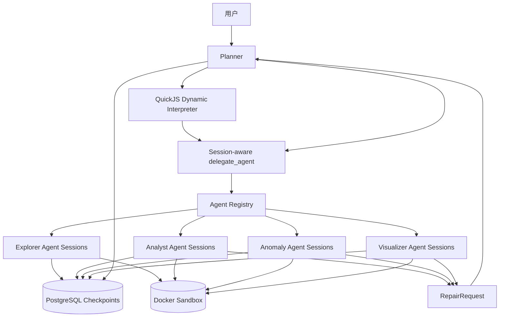
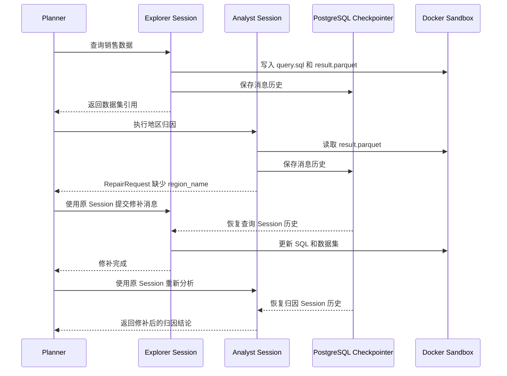

# AI-Native 数据分析多 Agent 架构设计

## 1. 文档信息

- 状态：设计方案
- 目标：设计由 Planner、数据查询 Agent、归因 Agent、审查 Agent 和可视化 Agent 组成的数据分析系统
- 编排方式：DeepAgents Dynamic Subagents
- 状态存储：LangGraph PostgreSQL Checkpointer
- 文件环境：本地 Docker 沙盒
- 核心能力：动态规划、同类型 Agent 并行、完整消息续接、跨 Agent 发现问题并回退修补

## 2. 架构结论

系统采用以下组合：

```text
持久化 Planner
    + QuickJS Dynamic Interpreter
    + Session-aware Agent Delegation
    + PostgreSQL Checkpoint
    + Docker Sandbox Artifacts
```

核心决策：

1. Planner 是用户会话的唯一协调者，负责理解目标、动态拆分任务、并行调度、处理修补请求和汇总结果
2. 专业 Agent 按逻辑类型注册，包括数据查询、归因、审查和可视化
3. Agent Definition 与 Agent Session 分离，同一个 Agent Definition 可以创建多个并行 Session
4. 每个 Session 使用独立的 `checkpoint_ns`，完整消息历史保存到 PostgreSQL
5. 不同 Session 可以并行执行，同一 Session 串行续接
6. 后续 Agent 发现上游问题时返回结构化 `RepairRequest`，Planner 使用原 Session 继续上游 Agent
7. 大型数据集、SQL、图表和报告保存在 Docker 沙盒，Agent 消息中只传递摘要和文件引用
8. Dynamic Interpreter 在运行时生成循环、分支和并行代码，不使用显式 LangGraph 业务工作流
9. 业务专业 Agent 的持久化委派统一经过 `delegate_agent`，避免直接使用无 Session 标识的临时 `task()`
10. 查询安全由确定性 Service 执行，归因、审查和可视化 Agent 在各自 Session 沙盒中自主编写并运行分析或核验代码

## 3. 设计目标

### 3.1 功能目标

- 支持简单问数、趋势分析、对比分析、归因分析、异常检测和可视化
- 根据用户问题动态选择需要的专业 Agent
- 根据数据和中间结论动态改变分析步骤
- 支持同一种 Agent 针对不同因素并行分析
- 保存每个 Agent Session 的完整消息和工具调用历史
- 支持在后续阶段重新唤起原 Session 修补结果
- 支持修补完成后自动重新执行受影响的下游 Session
- 支持多轮用户对话中继续已有分析
- 支持查询、证据、图表和最终结论之间的追溯

### 3.2 工程目标

- 复用现有 PostgreSQL Checkpointer 和 Store
- 复用现有用户级 Docker 容器和会话级工作目录
- 保持专业 Agent 定义集中、工具权限清晰
- 控制并发数、修补轮次、模型调用次数和查询成本
- 会话删除时同时清理 Planner、SubAgent 和沙盒状态
- 为后续增加新的专业 Agent 保留统一注册接口

### 3.3 非目标

- 不用代码预先固定完整分析流程
- 不为每种用户问题编写独立 LangGraph
- 不允许专业 Agent 自由形成无限递归调用
- 不将大型数据集写入消息历史
- 不允许 Agent 绕过只读查询安全层访问业务数据库
- 不在第一阶段部署 Agent Protocol 或远程 Async Subagents 服务

## 4. 核心概念

### 4.1 Agent Definition

Agent Definition 描述一种专业能力，由以下内容组成：

- `agent_type`
- 模型配置
- System Prompt
- Tool 白名单
- Skill 列表
- 文件系统权限
- 结构化输出协议

系统第一阶段包含：

| `agent_type` | 职责                                                                        |
| ------------ | --------------------------------------------------------------------------- |
| `explorer`   | 理解数据需求、检索语义目录、生成并执行只读查询、输出数据集                  |
| `analyst`    | 基于目标指标和数据集进行变化贡献分析、维度下钻和根因候选判断                |
| `reviewer`   | 独立审查数据查询、分析过程、结论、图表和报告，发现问题时请求原 Session 修补 |
| `visualizer` | 根据分析产物生成图表、表格和可下载报告                                      |

同一个 Agent Definition 在一个会话中只需要构建一次，可以被多个 Session 复用。

### 4.2 Agent Session

Agent Session 是一次可续接的专业分析上下文。它拥有独立的：

- 消息历史
- Tool 调用历史
- todo 状态
- 中间判断
- 修补记录
- 沙盒目录
- 输出产物

例如，同一个归因 Agent 可以创建三个 Session：

```text
analyst
├── session: region
├── session: product
└── session: channel
```

三个 Session 使用相同模型、Prompt 和 Tool，可以并行执行，消息历史相互隔离。

### 4.3 Analysis

Analysis 表示当前会话中的一项完整分析目标。一个会话可以先后产生多个 Analysis，例如：

```text
conversation
├── analysis: sales-decline-2026-07
└── analysis: refund-rise-2026-08
```

`analysis_id` 用于隔离不同分析任务下的 Agent Session 和文件产物。

### 4.4 Repair Request

Repair Request 是下游 Agent 对上游 Session 发起的修补请求。它至少包含：

- 目标 Agent 类型
- 目标 Session ID
- 问题描述
- 支持问题判断的证据
- 期望修补结果
- 发起请求的 Session

专业 Agent 只负责发现和报告问题，Planner 负责执行真正的重新委派。

## 5. 总体架构



职责边界：

| 组件                    | 负责                                                                   | 不负责                         |
| ----------------------- | ---------------------------------------------------------------------- | ------------------------------ |
| Planner                 | 目标理解、动态拆分、委派、修补控制、结果汇总                           | 直接编写复杂 SQL、执行统计算法 |
| Dynamic Interpreter     | 运行模型生成的循环、分支和并行调度代码                                 | 保存专业 Agent 消息历史        |
| Delegate Service        | Session 定位、配置构造、并发控制、Agent 调用                           | 决定业务分析流程               |
| Specialist Agent        | 选择输入数据与方法，编写并运行代码，验证结果，执行下钻并提交修补请求   | 绕过 Sandbox 或平台数据权限    |
| PostgreSQL Checkpointer | Planner 和各 Session 的消息及图状态                                    | 大数据文件存储                 |
| Docker Sandbox          | 专业 Agent 的 Shell 执行、Session 文件、数据集、代码、证据、图表和报告 | Agent 对话状态和业务数据库直连 |

## 6. 为什么需要 Session-aware Delegation

DeepAgents 普通同步 `task()` 每次调用使用新的 SubAgent 上下文，适合一次性任务。`checkpointer=True` 可以让同一个 CompiledSubAgent 跨调用续接，但同一个持久化 SubAgent 不适合在同一节点中并发调用多次。

本系统需要同时满足：

- 相同 Agent 类型并行
- 每个并行任务拥有完整历史
- 后续可以精确恢复其中一个任务
- 会话删除时能够统一清理

因此使用 `thread_id + checkpoint_ns` 标识状态：

```text
thread_id      = 用户会话
checkpoint_ns  = Analysis + Agent Type + Session
```

示例：

```text
thread_id:
user_12:conversation_550e8400-e29b-41d4-a716-446655440000

checkpoint_ns:
subagents/sales-decline/explorer/base
subagents/sales-decline/analyst/region
subagents/sales-decline/analyst/product
subagents/sales-decline/analyst/channel
subagents/sales-decline/reviewer/final-review
subagents/sales-decline/visualizer/summary
```

PostgreSQL Checkpointer 使用二者共同定位状态，不同 namespace 之间不会混合消息。

## 7. Dynamic Subagents 编排方式

### 7.1 编排原则

Planner 通过 QuickJS Interpreter 在运行时编写编排代码。代码可以使用：

- 条件分支
- 循环
- `Promise.all`
- 批次执行
- 结果筛选
- 修补循环
- 多视角验证

专业 Agent 的列表和权限由代码静态注册，具体调用数量、顺序和依赖由 Planner 动态决定。

### 7.2 PTC 白名单

持久化委派能力通过 Programmatic Tool Calling 暴露：

```python
CodeInterpreterMiddleware(
    mode="thread",
    ptc=["delegate_agent"],
)
```

第一阶段只允许 Interpreter 调用 `delegate_agent`。数据库查询、文件操作等能力属于专业 Agent，不直接暴露给 Planner 的解释器。

### 7.3 并行归因示例

```javascript
const factors = [
  { key: "region", instruction: "从地区维度分析销售额下降" },
  { key: "product", instruction: "从商品维度分析销售额下降" },
  { key: "channel", instruction: "从渠道维度分析销售额下降" },
];

const attributionResults = await Promise.all(
  factors.map((factor) =>
    tools.delegate_agent({
      analysis_id: "sales-decline",
      agent_type: "analyst",
      session_id: factor.key,
      message: factor.instruction,
    }),
  ),
);
```

以上三次调用复用同一个归因 Agent Definition，分别使用三个 checkpoint namespace。

### 7.4 Dynamic `task()` 的使用约定

业务专业 Agent 统一通过 `delegate_agent` 调用，以获得稳定 Session 和消息续接能力。

内置 `task()` 只用于满足以下条件的临时任务：

- 不需要恢复消息历史
- 不会产生关键业务证据
- 不参与修补链路
- 失败后可以完整重做

也可以关闭默认 general-purpose SubAgent，避免 Planner 在关键分析中绕过持久化委派协议。

## 8. 持久化模型

### 8.1 Planner 状态

Planner 使用当前会话的根 namespace：

```python
RunnableConfig(
    configurable={
        "thread_id": get_thread_id(user_id, conversation_id),
        "checkpoint_ns": "",
        "user_id": user_id,
        "conversation_id": str(conversation_id),
        "workspace_dir": "/",
    }
)
```

Planner 状态包括：

- 用户消息
- Planner 消息
- Dynamic Interpreter 线程变量
- todo
- 各 Session 返回的摘要
- Repair Request
- 最终回答

### 8.2 SubAgent 状态

专业 Agent 调用时复用 `thread_id`，替换 `checkpoint_ns`：

```python
checkpoint_ns = f"subagents/{analysis_id}/{agent_type}/{session_id}"
```

专业 Agent 图直接使用实际的 PostgreSQL Checkpointer：

```python
agent = create_deep_agent(
    model=model,
    tools=tools,
    system_prompt=system_prompt,
    backend=backend,
    checkpointer=postgres_checkpointer,
    store=postgres_store,
    name=agent_type,
)
```

每次调用只提交一条新的 HumanMessage。Checkpointer 会加载该 Session 之前的消息并继续执行。

### 8.3 消息历史与上下文压缩

PostgreSQL 保存每一步 checkpoint。专业 Agent 恢复时获得当前 Session 的有效消息历史。

长 Session 接近模型上下文限制时允许 DeepAgents 执行消息摘要。要求：

- SQL、数据集和证据必须在摘要前写入沙盒
- 摘要必须保留目标、关键判断、未解决问题和产物路径
- 原始 checkpoint 按会话保留策略清理
- 审计需要的原始 Tool 输入输出可以单独记录到日志或追踪系统

### 8.4 Store 的使用范围

LangGraph Store 用于跨线程长期信息：

- 用户偏好
- 常用指标
- 默认分析口径
- 已确认的业务解释规则

当前 Analysis 的消息和执行进度使用 Checkpointer，避免把临时状态写入长期记忆。

## 9. Agent Session 标识

### 9.1 数据结构

```python
from dataclasses import dataclass
from typing import Literal

type AgentType = Literal[
    "explorer",
    "analyst",
    "reviewer",
    "visualizer",
]


@dataclass(frozen=True)
class AgentSessionKey:
    user_id: int
    conversation_id: UUID
    analysis_id: str
    agent_type: AgentType
    session_id: str

    @property
    def checkpoint_ns(self) -> str:
        return f"subagents/{self.analysis_id}/{self.agent_type}/{self.session_id}"
```

### 9.2 命名规则

- `analysis_id` 和 `session_id` 只允许小写字母、数字、连字符和下划线
- 单个标识最大长度建议为 64
- 禁止 `/`、`..`、控制字符和空字符串
- `session_id` 在同一 `analysis_id + agent_type` 下唯一
- 修补时必须使用原 `session_id`

建议示例：

```text
analysis_id = sales-decline-2026-07
session_id  = region
session_id  = product-category
session_id  = channel
```

## 10. Agent Registry

### 10.1 注册结构

```python
@dataclass(frozen=True)
class AgentDefinition:
    agent_type: AgentType
    description: str
    system_prompt: str
    tools: tuple[BaseTool, ...]
    skills: tuple[str, ...] = ()


class AgentRegistry:
    def __init__(self) -> None:
        self._definitions: dict[AgentType, AgentDefinition] = {}
        self._agents: dict[AgentType, CompiledStateGraph] = {}

    def get_agent(self, agent_type: AgentType) -> CompiledStateGraph:
        return self._agents[agent_type]
```

### 10.2 生命周期

当前 `AgentManager` 按 `(user_id, conversation_id)` 缓存 Agent。扩展后每个缓存项包含：

```python
@dataclass
class ConversationAgentRuntime:
    planner: CompiledStateGraph
    specialists: dict[AgentType, CompiledStateGraph]
    session_locks: dict[str, asyncio.Lock]
    parallelism: asyncio.Semaphore
```

构建顺序：

1. 获取当前用户和会话的 DockerSandboxBackend
2. 构造共享 CompositeBackend
3. 构造四种专业 Agent Definition
4. 使用同一个 PostgreSQL Checkpointer 编译四个专业 Agent
5. 创建 `delegate_agent` Tool，并绑定 Registry、Backend 和并发控制器
6. 创建带 CodeInterpreterMiddleware 的 Planner
7. 将会话运行时缓存到 AgentManager

会话级缓存可以保证所有 Agent 使用同一个沙盒会话目录。

## 11. Session-aware Delegate Service

### 11.1 请求协议

```python
class DelegateAgentRequest(BaseModel):
    analysis_id: str
    agent_type: AgentType
    session_id: str
    message: str


class ArtifactReference(BaseModel):
    path: str
    media_type: str | None = None
    description: str | None = None


class RepairRequest(BaseModel):
    target_agent_type: AgentType
    target_session_id: str
    reason: str
    evidence: list[ArtifactReference]
    expected_result: str


class DelegateAgentResult(BaseModel):
    status: Literal[
        "completed",
        "needs_repair",
        "failed",
    ]
    analysis_id: str
    agent_type: AgentType
    session_id: str
    summary: str
    artifacts: list[ArtifactReference]
    repair_requests: list[RepairRequest]
```

### 11.2 调用流程

```text
delegate_agent(request)
  1. 校验 agent_type
  2. 校验 analysis_id 和 session_id
  3. 生成 checkpoint_ns
  4. 获取 Session 锁
  5. 获取全局并发许可
  6. 从 Registry 获取专业 Agent
  7. 使用 Session RunnableConfig 调用 Agent
  8. 校验结构化输出
  9. 释放并发许可和 Session 锁
  10. 返回 Session 标识、摘要、产物和修补请求
```

### 11.3 配置构造

```python
def build_subagent_config(
    parent_config: RunnableConfig,
    session_key: AgentSessionKey,
) -> RunnableConfig:
    parent_configurable = parent_config.get("configurable", {})
    return RunnableConfig(
        configurable={
            **parent_configurable,
            "thread_id": get_thread_id(
                session_key.user_id,
                session_key.conversation_id,
            ),
            "checkpoint_ns": session_key.checkpoint_ns,
            "analysis_id": session_key.analysis_id,
            "agent_type": session_key.agent_type,
            "session_id": session_key.session_id,
        }
    )
```

### 11.4 并发约束

```text
不同 Session  → 允许并行
相同 Session  → 必须串行
```

例如：

```text
analyst/region   ─┐
analyst/product  ─┼─ 并行
analyst/channel  ─┘

analyst/region 初次执行
        ↓
analyst/region 修补
        ↓
同一个 Session 串行
```

第一阶段使用：

- `asyncio.Semaphore` 控制会话级总并发
- `asyncio.Lock` 控制单 Session 串行

多进程或多副本部署后，Session 锁升级为 PostgreSQL advisory lock 或分布式锁。不同 namespace 的 checkpoint 写入可以并发执行。

## 12. Repair Loop

### 12.1 设计原则

- 专业 Agent 可以发现其他 Session 的输入或产物问题
- 专业 Agent 不直接递归调用其他专业 Agent
- Planner 是修补请求的唯一执行者
- 修补使用目标 Session 原来的 `checkpoint_ns`
- 修补完成后重新执行受到影响的下游 Session
- 每次修补都带上具体证据和预期结果

### 12.2 修补流程



### 12.3 Dynamic Interpreter 示例

```javascript
let queryResult = await tools.delegate_agent({
  analysis_id: "sales-decline",
  agent_type: "explorer",
  session_id: "base",
  message: "生成用于销售额下降分析的基础数据集",
});

let regionResult = await tools.delegate_agent({
  analysis_id: "sales-decline",
  agent_type: "analyst",
  session_id: "region",
  message: `从地区维度分析 ${queryResult.artifacts[0].path}`,
});

let repairRound = 0;
while (regionResult.status === "needs_repair" && repairRound < 3) {
  const request = regionResult.repair_requests[0];

  queryResult = await tools.delegate_agent({
    analysis_id: "sales-decline",
    agent_type: request.target_agent_type,
    session_id: request.target_session_id,
    message: request.reason,
  });

  regionResult = await tools.delegate_agent({
    analysis_id: "sales-decline",
    agent_type: "analyst",
    session_id: "region",
    message: `上游已经修补，请读取新产物并重新分析：${queryResult.artifacts[0].path}`,
  });

  repairRound += 1;
}
```

### 12.4 防止无限回退

默认限制：

- 单个 Analysis 最大修补轮次：3
- 单个 Session 最大连续恢复次数：3
- 单次 Planner 执行最大委派次数：20
- 最大回退链深度：5
- 禁止 Session 请求修补自身
- 禁止没有证据的修补请求
- 同一个原因连续出现两次时要求 Planner 改变方案或停止
- 达到上限后向用户说明未解决问题和影响范围

## 13. Docker 沙盒设计

### 13.1 隔离层级

当前沙盒保持：

```text
一个用户
  └── 一个 Docker 容器和 Volume
        └── conversations/{conversation_id}
              └── 当前会话全部文件
```

Agent Session 在会话目录内继续隔离：

```text
/
├── uploads/
├── analyses/
│   └── sales-decline/
│       ├── shared/
│       └── sessions/
│           ├── explorer/
│           │   └── base/
│           ├── analyst/
│           │   ├── region/
│           │   ├── product/
│           │   └── channel/
│           ├── reviewer/
│           │   └── final-review/
│           └── visualizer/
│               └── summary/
└── downloads/
```

### 13.2 Session 目录约定

每个 Session 只写自己的目录：

```text
/analyses/{analysis_id}/sessions/{agent_type}/{session_id}/
```

公共产物写入：

```text
/analyses/{analysis_id}/shared/
```

公共目录中的文件应采用不可变版本命名：

```text
sales_dataset_v1.parquet
sales_dataset_v2.parquet
region_attribution_v1.json
summary_v1.html
```

修补时生成新版本，避免正在运行的下游 Agent 读取到一半更新的文件。

### 13.3 Agent 间传递数据

消息中传递：

- 文件路径
- Schema
- 行数
- 时间范围
- 版本号
- 内容摘要
- 校验信息

消息中不传递：

- 大量原始数据行
- 完整 CSV 内容
- 大型模型中间结果
- 数据库凭据

## 14. 专业 Agent 设计

### 14.1 Planner

职责：

- 理解用户目标和约束
- 创建 `analysis_id`
- 决定需要哪些专业 Agent
- 为并行工作创建 Session ID
- 使用 Interpreter 动态生成编排代码
- 维护 Session 引用和依赖关系
- 处理 Repair Request
- 判断是否需要重新执行下游 Session
- 汇总最终结论和文件

Planner 工具：

- `delegate_agent`
- `return_file`
- 必要的会话文件读取工具

Planner 不直接拥有：

- Doris 查询工具
- SQL 执行工具
- 专业 Agent 的 Shell 执行能力

### 14.2 Explorer Agent

职责：

- 理解专业 Agent 提出的数据需求
- 调用语义目录搜索
- 确认指标、字段、表和关联关系
- 构造受控查询计划
- 执行只读 SQL
- 校验数据集字段、行数和时间范围
- 输出 SQL、数据集和数据说明
- 接收后续修补要求并基于历史继续修改

建议工具：

- `search_semantic_resources`
- `list_semantic_recalls`
- `get_semantic_recall`
- `merge_semantic_recalls`
- `delete_semantic_recalls`
- `execute_sql`
- 配置的全部 MCP 工具
- 文件读写工具

`execute_sql` 是唯一暴露给 Explorer Agent 的 SQL Tool。语法、只读边界、资产权限、字段、类型和 JOIN 校验在工具执行链前部完成；校验失败直接返回结构化问题和修正提示，不连接 Doris。

每次 `search_semantic_resources` 成功召回后，使用 `search_id` 作为独立的
`recall_id`，在会话级 Store 命名空间中保存检索请求、完整结果和创建时间。
不同查询通过 `recall_id` 和原始请求区分。合并操作创建去重后的新快照并记录
`source_recall_ids`，源记录保持不变；召回记录可以单独查询和删除。聊天接口提供
分页列表、详情、合并和批量删除入口，删除会话时同步清理全部召回记录。
语义工具从首次返回开始只向 `ToolMessage` 写入 `recall_id` 和引用类型。Explorer Agent 的
Middleware 在每次模型调用前，对当前用户回合产生的引用按最新权限临时展开，展开内容只存在于
`ModelRequest.messages`，不回写 Agent state 或 checkpoint。后续回合需要旧召回详情时，Agent 通过
`get_semantic_recall` 重新读取；删除独立记录后，历史引用无法再展开内容。

输出至少包含：

- 查询目标
- SQL 文件路径
- 数据集文件路径
- 字段 Schema
- 行数
- 时间范围
- 指标口径
- 数据质量提示

### 14.3 Analyst Agent

职责：

- 选择输入数据、归因维度、分析方法和计算参数
- 编写并运行适合当前指标和数据的归因分析代码
- 评估贡献覆盖率和残差
- 解释计算结果并继续维度下钻
- 分析分组内部变化和结构变化
- 识别需要补充的数据
- 返回根因候选、证据和置信度
- 对数据或口径缺失发起 Repair Request
- 针对不同因素创建多个并行 Session

执行能力：

- DeepAgents 内置 `execute`
- DeepAgents 内置文件读取、写入、编辑和检索工具

归因结论默认属于变化贡献分析，不直接表述为严格因果关系。

### 14.4 Reviewer Agent

职责：

- 独立检查数据来源、SQL、分析代码、结论和交付产物
- 复算关键结果并识别遗漏条件、错误聚合和样本偏差
- 区分事实、推断和不确定性
- 检查图表、表格和报告是否与底层数据一致
- 保存审查代码、验证记录和反例证据
- 对可修复的上游问题发起 Repair Request

执行能力：

- DeepAgents 内置 `execute`
- DeepAgents 内置文件读取、写入、编辑和检索工具

### 14.5 Visualizer Agent

职责：

- 选择输入数据、图表类型、视觉编码和渲染参数
- 编写并运行可视化代码
- 生成图表配置和交付文件
- 校验图表与分析数据一致
- 解释图表表达范围并按分析问题调整展示层级
- 生成可下载文件
- 发现数据字段或结论不足时发起 Repair Request

执行能力：

- DeepAgents 内置 `execute`
- DeepAgents 内置文件读取、写入、编辑和检索工具

## 15. 执行能力与安全边界

AI-native 编排负责决定分析路径。归因、审查和可视化 Agent 使用 DeepAgents 内置 Shell 与文件能力直接完成专业工作。审查 Agent 可以核验数据查询结果，也可以核验归因、统计分析、图表和最终报告。自定义 Tool 只承载必须经过平台鉴权和审计的外部能力，例如语义检索与只读数据查询。

### 15.1 Meta Search Service

- 字段、指标和字段值检索
- 元数据版本校验
- 表关联关系补全
- 主外键关系扩展

### 15.2 Query Guard Service

- SQL AST 检查
- 只读语句约束
- 数据库、表和字段白名单
- 超时、扫描量和返回行数限制
- 敏感字段控制
- 执行前 `EXPLAIN`

### 15.3 Analysis Query Service

- 查询计划编译
- SQL 执行
- 结果文件写入
- 查询记录生成
- 数据 Schema 和预览生成

### 15.4 Professional Agent Execution

- Agent 使用 `execute` 编写和运行 Python、Shell 及沙盒内已有的分析程序
- Agent 使用文件工具管理代码、中间数据、日志和最终产物
- Agent 根据指标口径、数据分布、样本量和业务问题自主选择算法
- 同一 Session 中可以多轮运行、检查结果、修正代码和重新验证
- 代码、参数、输入引用和输出文件共同形成可追溯证据

### 15.5 Sandbox Boundary

- 每个专业 Agent Session 只能写入自己的工作目录
- 授权输入和上游产物以只读方式提供
- 容器不暴露业务数据库凭据，数据库访问统一经过只读查询工具
- 容器禁止外网，并限制 CPU、内存、执行时间、进程数和输出大小
- 同一 Session 在迭代期间可以修改自身文件，其他 Session 只能读取组内共享产物
- 对外发布产物的不可变版本控制属于后续平台约束

## 16. 结构化结果协议

所有专业 Agent 必须返回结构化结果。推荐基础协议：

```python
class SpecialistResult(BaseModel):
    status: Literal["completed", "needs_repair", "failed"]
    summary: str
    findings: list[str]
    artifacts: list[ArtifactReference]
    repair_requests: list[RepairRequest]
    confidence: Literal["low", "medium", "high"] | None
    limitations: list[str]
```

要求：

- `completed` 时给出摘要、证据和产物
- `needs_repair` 时至少包含一个 Repair Request
- `failed` 时说明失败原因和已完成工作
- 不允许只返回“已完成”而没有可验证结果
- 引用数据结论时必须带上数据文件或查询证据

Dynamic Interpreter 可以使用 `responseSchema` 或 Delegate Service 的 Pydantic 校验获得稳定对象。

## 17. 配置设计

建议在 `conf/app_config.yaml` 增加：

```yaml
agent:
  orchestration:
    mode: dynamic_subagents
    max_parallel_sessions: 8
    max_delegations_per_run: 20
    max_repair_rounds: 3
    max_repair_depth: 5
    session_lock_timeout: 300

  interpreter:
    mode: thread
    ptc:
      - delegate_agent

  specialists:
    explorer:
      model: default
    analyst:
      model: default
    reviewer:
      model: default
    visualizer:
      model: default
```

对应配置模型：

```python
class OrchestrationConfig(BaseModel):
    mode: Literal["dynamic_subagents"]
    max_parallel_sessions: int
    max_delegations_per_run: int
    max_repair_rounds: int
    max_repair_depth: int
    session_lock_timeout: float


class InterpreterConfig(BaseModel):
    mode: Literal["thread", "session"]
    ptc: list[str]


class SpecialistConfig(BaseModel):
    model: str


class AgentConfig(BaseModel):
    orchestration: OrchestrationConfig
    interpreter: InterpreterConfig
    specialists: dict[AgentType, SpecialistConfig]
```

第一阶段所有专业 Agent 可以共用当前激活模型，配置结构保留后续按角色切换模型的能力。

## 18. 建议代码结构

```text
app/agents/
├── manager.py
├── contracts.py
├── registry.py
├── session_service.py
├── mcp.py
├── planner/
│   ├── agent.py
│   ├── prompt.py
│   └── tools.py
├── explorer/
│   ├── agent.py
│   ├── prompt.py
│   └── tools/
│       ├── semantic_recall.py
│       ├── query_support.py
│       └── execute_sql.py
├── analyst/
│   ├── agent.py
│   └── prompt.py
├── reviewer/
│   ├── agent.py
│   └── prompt.py
└── visualizer/
    ├── agent.py
    └── prompt.py

app/services/
├── meta_search_service.py
├── semantic_recall_service.py
├── analysis_query_service.py
└── query_guard_service.py
```

依赖方向：

```text
AgentManager / ChatService
   ↓
Planner
   ↓
AgentSessionService / delegate_agent
   ↓
Agent Registry / Specialist Agents
   ↓
DeepAgents 内置 Shell 与文件工具
   ↓
Session 级 Docker Sandbox
```

## 19. 与当前代码的衔接

### 19.1 AgentManager

当前 `AgentManager` 已经：

- 按用户和会话缓存 Agent
- 按会话获取 DockerSandboxBackend
- 使用 PostgreSQL Checkpointer 和 Store
- 构造共享模型和 Tool
- 在删除会话时删除根 `thread_id`

改造方向：

- 缓存对象从单个 Planner 改为 `ConversationAgentRuntime`
- 为专业 Agent 按职责分配 Tool
- 创建 Session-aware Delegate Service
- Planner 加入 CodeInterpreterMiddleware
- 增加 Session 锁和全局并发 Semaphore
- `delete_agent` 同时清理会话运行时的锁和 Agent 实例

### 19.2 PostgreSQL Manager

现有 `AsyncPostgresSaver` 可以继续使用。`adelete_thread(thread_id)` 会删除该 thread 下所有 namespace 的 checkpoint、blob 和 write，因此会话删除无需逐个枚举 Session。

第一阶段不需要新增 Agent Session 数据表。

### 19.3 Docker Sandbox Manager

现有设计已经满足：

- 每个用户一个容器和 Volume
- 每个会话独立目录
- 上传、下载和 Agent 文件共享
- 会话级路径映射

新增内容只包括标准化 `/analyses/` 目录和 Session 产物约定。

## 20. 生命周期

### 20.1 创建会话 Agent

```text
Chat 请求
  → AgentManager.get_conversation_runtime
  → 获取 DockerSandboxBackend
  → 构建 Specialist Agents
  → 构建 Delegate Service
  → 构建 Planner
  → 缓存 ConversationAgentRuntime
```

### 20.2 执行分析

```text
用户消息
  → Planner 恢复根线程
  → Interpreter 生成动态编排代码
  → delegate_agent 创建或恢复专业 Session
  → 专业 Agent 写 checkpoint 和沙盒产物
  → Planner 处理结果或 Repair Request
  → Planner 返回最终回答
```

### 20.3 继续对话

```text
用户追问
  → Planner 恢复会话历史
  → 找到已有 analysis_id 和 session_id
  → 使用原 Session 继续专业 Agent
  → 复用已有数据和证据
```

### 20.4 删除会话

```text
删除 conversation
  → 清除 Agent Bundle 缓存
  → 取消正在构建或执行的任务
  → adelete_thread(thread_id)
  → 删除 Docker 会话目录
```

## 21. 安全控制

### 21.1 委派安全

- `agent_type` 必须来自 Registry
- `analysis_id` 和 `session_id` 必须通过格式校验
- Planner 不能传入任意 `checkpoint_ns`
- Delegate Service 统一生成 namespace
- Interpreter PTC 只允许调用白名单工具
- 专业 Agent 默认不拥有 `delegate_agent`

### 21.2 数据库安全

- 平台管理员身份与 Doris 数据角色分离，每个用户必须且只能绑定一个 Doris 角色
- 公开注册绑定唯一缺省 Doris 角色，管理员可替换用户绑定并保护最后一位管理员
- 每个配置 Doris 角色使用独立稳定共享查询账号、Workload Group 和连接池
- 查询账号只绑定一个预期角色，服务端按持久化角色精确选择并在启动时校验
- 表、列 SELECT 权限和 Row Policy 由独立 Doris 管理身份维护，查询执行仍由数据库授权兜底
- SELECT 权限同步为应用可见性投影，语义检索和 SQL Guard 在连接 Doris 前过滤
- 所有元数据和权限管理接口只允许平台管理员调用
- 所有 SQL 经过 AST 校验
- 禁止 DDL、DML、多语句和存储过程
- 限制数据库、表、字段和敏感列
- 设置查询超时、扫描限制和最大返回行数
- SQL 修正后重新执行全部校验

### 21.3 沙盒安全

- 容器使用非 root 用户
- 根文件系统只读
- 限制内存、CPU 和进程数
- 禁止把数据库密码注入 Agent Shell
- 文件路径必须位于当前会话工作区
- Session ID 不能直接参与未校验的宿主机路径拼接

### 21.4 资源安全

- 限制最大并行 Session 数
- 限制最大模型调用次数
- 限制单次 Analysis 总运行时间
- 限制 Repair Loop 次数
- 限制单文件和总产物大小
- 限制解释器 PTC 工具范围

## 22. 可观测性

每次委派建议记录：

- `user_id`
- `conversation_id`
- `analysis_id`
- `agent_type`
- `session_id`
- `checkpoint_ns`
- 调用类型：`start` 或 `resume`
- 开始和结束时间
- 模型调用次数
- Tool 调用次数
- 状态
- Repair Request 数量
- 产物路径
- 错误信息

建议事件：

```text
analysis_started
subagent_session_started
subagent_session_resumed
subagent_session_completed
repair_requested
repair_started
repair_completed
analysis_completed
analysis_failed
```

前端可以按 `analysis_id + agent_type + session_id` 展示并行 Agent 卡片和修补历史。

## 23. 异常处理

| 异常                         | 处理方式                                  |
| ---------------------------- | ----------------------------------------- |
| 未知 Agent 类型              | Delegate Service 直接拒绝                 |
| 非法 Session ID              | 参数校验失败，不创建 checkpoint           |
| Session 正在执行             | 等待 Session 锁或超时返回                 |
| 不同 Session 并发超限        | 等待 Semaphore                            |
| 专业 Agent 输出不符合 Schema | 允许一次结构化重试                        |
| 查询失败                     | Explorer Agent 基于同一 Session 修正      |
| Repair Loop 达到上限         | Planner 输出限制和未解决问题              |
| Docker 容器异常              | Manager 恢复容器后使用 checkpoint 继续    |
| 服务进程重启                 | 从 PostgreSQL 和 Docker Volume 恢复       |
| Interpreter Beta API 变化    | 将 Interpreter 构造集中封装，避免扩散调用 |

## 24. 测试方案

### 24.1 单元测试

- AgentSessionKey namespace 生成
- 标识格式校验
- Agent Registry 查找
- Delegate Request 和 Result Schema
- Repair Request 校验
- Session 锁获取与释放
- 并发 Semaphore 限制
- 专业 Agent Tool 白名单

### 24.2 持久化测试

1. 首次调用归因 Session 并保存消息
2. 再次调用相同 Session，确认能够看到此前消息
3. 调用另一个归因 Session，确认看不到第一个 Session 的消息
4. 删除 conversation thread，确认所有 namespace 被删除
5. 重启应用后继续 Session，确认状态可恢复

### 24.3 并发测试

- 同一归因 Agent 的三个不同 Session 并行成功
- 三个 Session 的 checkpoint namespace 相互隔离
- 相同 Session 的两个请求被串行执行
- 一个 Session 失败不会取消其他 Session
- 并发数超过限制后正确等待

### 24.4 修补测试

- 归因 Agent 发现查询字段缺失
- Planner 恢复原 Explorer Session
- Explorer Agent 能看到此前 SQL 和 Tool 历史
- 修补后生成新版本数据集
- 原归因 Session 能恢复历史并重新分析
- 超过修补上限后停止

### 24.5 集成测试

- PostgreSQL checkpoint 实际写入和恢复
- Docker 沙盒文件跨 Agent 可见
- Dynamic Interpreter 并行委派
- Explorer、Analyst、Reviewer 和 Visualizer 完整链路
- 会话删除同时清理数据库状态和沙盒目录

## 25. 评测指标

### 25.1 正确性

- 最终答案正确率
- 指标口径正确率
- SQL 执行成功率
- 归因贡献覆盖率
- 异常检测准确率
- 图表与数据一致率

### 25.2 协作质量

- Planner 正确选择 Agent 的比例
- 并行任务拆分合理率
- Session 恢复成功率
- Repair Request 有效比例
- 修补后问题解决率
- 无限修补拦截率

### 25.3 性能

- 首次响应延迟
- Analysis 总耗时
- 并行加速比
- 平均模型调用次数
- 平均 Tool 调用次数
- PostgreSQL checkpoint 增长量
- 沙盒产物存储量

## 26. 实施阶段

状态说明：`[x]` 表示当前仓库已有实现和对应测试，`[ ]` 表示仍需完成。

### 阶段一：基础依赖与协议

- [x] 安装 `deepagents[quickjs]`
- [x] 增加 Agent 编排配置
- [x] 定义 AgentType、SessionKey 和结构化结果协议
- [x] 定义 RepairRequest
- [x] 编写 Session namespace 测试

### 阶段二：专业 Agent 注册

- [x] 实现 Agent Registry
- [x] 拆分 Planner 和专业 Agent Prompt
- [x] 为每个专业 Agent 配置 Tool 白名单
- [x] 构建会话与 Session 级 Backend，共享 Checkpointer 和 Store
- [x] 将 AgentManager 缓存升级为 ConversationAgentRuntime

### 阶段三：持久化委派

- [x] 实现 AgentSessionService
- [x] 实现 `delegate_agent`
- [x] 实现 Session 锁和并发 Semaphore
- [x] 使用 `checkpoint_ns` 隔离并行 Session
- [x] 验证相同 Session 消息续接
- [x] 验证同类型 Agent 多 Session 并行

### 阶段四：Dynamic Interpreter

- [x] 接入 CodeInterpreterMiddleware
- [x] 配置 `mode="thread"`
- [x] 配置 PTC 白名单
- [x] 编写 Planner 动态编排 Prompt
- [ ] 增加真实 Planner 模型生成循环、分支和 `Promise.all` 的端到端验证

### 阶段五：修补闭环

- [x] 实现 Repair Request 解析
- [x] 实现修补轮次和深度限制
- [x] 实现原 Session 恢复
- [x] 实现下游原 Session 恢复与重新分析
- [ ] 建立独立修补事件记录和平台级产物版本索引

### 阶段六：完整数据分析能力

- [x] 完善只读查询安全层
- [x] 完善专业 Agent 的 Session 级 Sandbox 隔离
- [x] 验证 Shell 与文件工具的权限、资源和网络边界
- [ ] 建立代码、参数、输入引用和产物的完整审计链路
- [ ] 建立端到端评测集

## 27. 验收标准

满足以下条件后，架构第一阶段完成：

1. Planner 能动态选择四种专业 Agent
2. Planner 能通过 Interpreter 生成并运行并行委派代码
3. 同一个归因 Agent 可以创建至少三个并行 Session
4. 每个 Session 在 PostgreSQL 中保存独立消息历史
5. 相同 Session 再次调用时能使用此前消息和 Tool 历史
6. 下游 Agent 能返回指向上游 Session 的 Repair Request
7. Planner 能唤起原 Session 完成修补
8. 修补后的下游 Session 能恢复历史并重新分析
9. 所有大型数据和图表都存放在 Docker 沙盒
10. 删除会话能清理 Planner 和全部 SubAgent checkpoint
11. 同 Session 并发不会破坏 checkpoint
12. Repair Loop 达到限制后能够安全终止

## 28. 风险与应对

### 28.1 Dynamic Interpreter 仍处于 Beta

应对：

- 在 Planner 构造器中直接使用上游 CodeInterpreterMiddleware
- QuickJS 集成测试通过 `RUN_QUICKJS_INTEGRATION=1` 在允许跨线程事件循环唤醒的 CI 或容器中运行
- 将 PTC Tool 协议保持最小化
- 为模型生成的编排代码设置超时和并发限制
- 为核心分析链路保留直接串行委派的降级能力

### 28.2 Session 历史持续增长

应对：

- 启用模型上下文摘要
- 大结果集只保存到沙盒
- 设置会话保留周期
- 对长期 Session 创建新的 Analysis

### 28.3 并发写入冲突

应对：

- 每个并行任务使用独立 checkpoint namespace
- 相同 Session 使用互斥锁
- 公共文件使用不可变版本名
- 多副本部署后使用分布式锁

### 28.4 Agent 形成修补循环

应对：

- 专业 Agent 只能提交 Repair Request
- Planner 统一执行修补
- 限制修补轮次和深度
- 重复问题触发停止条件

### 28.5 专业 Agent 职责重叠

应对：

- 每个 Agent 使用明确的 System Prompt 和 Tool 白名单
- 查询能力集中到 Explorer Agent
- 归因、审查和可视化 Agent 在各自 Session 中自主实现专业分析或独立核验
- Session Sandbox 统一限制文件、网络、资源和进程权限
- 代码、参数和产物全部进入可追溯记录
- Planner 只负责协调和汇总

## 29. 最终架构摘要

```text
用户会话
└── Planner
    ├── PostgreSQL 根线程消息历史
    ├── QuickJS Dynamic Interpreter
    └── delegate_agent
        ├── explorer/base
        │   ├── 独立 checkpoint namespace
        │   └── SQL 与数据集
        ├── analyst/region
        │   ├── 独立 checkpoint namespace
        │   └── 地区归因历史
        ├── analyst/product
        │   ├── 独立 checkpoint namespace
        │   └── 商品归因历史
        ├── analyst/channel
        │   ├── 独立 checkpoint namespace
        │   └── 渠道归因历史
        ├── reviewer/final-review
        │   ├── 独立 checkpoint namespace
        │   └── 数据查询与分析结果审查历史
        └── visualizer/summary
            ├── 独立 checkpoint namespace
            └── 图表与报告历史
```

该架构以模型动态生成的编排代码驱动分析流程，以 Agent Session 提供并行和完整历史续接，以 Repair Request 建立跨 Agent 修补闭环，以 PostgreSQL 和 Docker 沙盒分别承载对话状态与数据产物。专业 Agent 使用 DeepAgents 内置 Shell 与文件能力自主选择方法、编写代码、验证结果、下钻和修补；平台 Tool 只承载需要统一鉴权和审计的外部能力；Session Sandbox 负责隔离文件、网络和计算资源。
