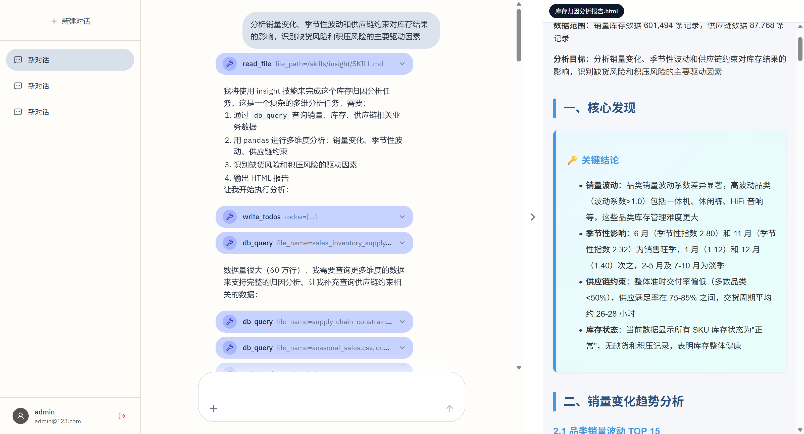
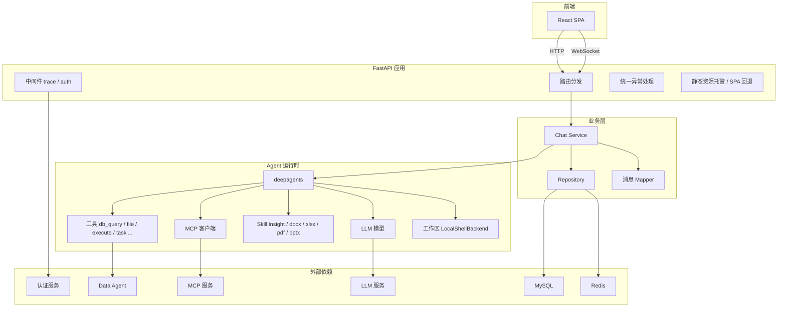
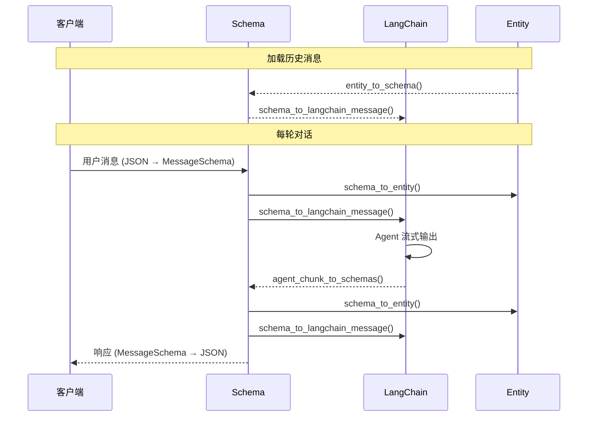

# 1. 项目介绍
## 1.1 项目背景
`insight-agent` 是一个面向归因分析场景的智能体应用。  
主要服务于业务分析、经营诊断和问题定位这类需要“先提出问题，再逐步收集证据，最后形成分析结论”的工作。  
这个项目强调的是让系统能够围绕一个真实分析任务持续推进，直到生成阶段性结论、分析材料和可交付结果。  
同时，用户可以保留历史对话、继续追问前面的结论、复用已经上传的附件和已经生成的中间产物，从而把一次分析逐渐发展成一个可持续推进的工作过程。



## 1.2 功能支持
### 1.2.1 Agent
基于 `deepagents` 组织 Agent 运行时
- 模型
- 本地工具:
  - `db_query` 数据查询
  - `return_file` 返回文件
  - `read_file` 读取文件
  - `write_file` 写入新文件
  - `edit_file` 修改已有文件
  - `ls` 列出目录中的文件
  - `glob` 按模式匹配搜索文件
  - `grep` 在文件中搜索文本
  - `execute` 执行命令行
  - `task` 启动独立子 Agent/隔离任务
  - `write_todos` 创建与管理任务清单
- MCP 工具: `tavily_search`...
- Skill: 
  - `insight` 业务数据分析与归因（需配合 db_query）
  - `docx` 处理 Word 文档
  - `pdf` 处理 PDF 文件
  - `pptx` 处理 PPT
  - `xlsx` 处理 Excel 表格
- 上下文压缩: `SummarizationMiddleware`
- 工作区: `LocalShellBackend`

### 1.2.2 系统能力
- 对话管理:
  - 创建对话
  - 删除对话
  - 修改对话信息
  - 获取所有对话
  - 获取对话历史消息
- 流式输出: 基于 WebSocket 流式返回模型回复、工具调用和工具结果
- 消息格式转换: 消息在 DTO、数据库存储、模型运行时 三种消息格式之间转换
- 消息持久化: 存储对话历史消息，存储上下文压缩结果
- 用户鉴权：通过认证中间件实现用户鉴权
- 文件上传
- 日志记录
- 统一异常处理
- 热更新配置

## 1.3 接口定义
所有接口需要在请求头中携带 Bearer Token 鉴权（WebSocket 除外，通过临时令牌替代），由认证中间件统一校验。

### 1.3.1 对话管理
#### 1.3.1.1 创建对话 `POST /api/chat/create`
创建新的对话，初始标题为"新对话"。  
可指定是否创建草稿。草稿对话允许先上传附件到工作区，等用户发送第一条消息时再自动转为正式对话。  

**请求参数：**
```json
{
  "is_draft": 0
}
```
- `is_draft` (int, 可选) — 是否创建草稿对话，`0`=正式对话，`1`=草稿对话，默认 `0`

**响应结果（201）：**
```json
{
  "conversation_id": 1,
  "title": "新对话",
  "update_at": "2026-05-04T12:00:00"
}
```
- `conversation_id` (int) — 对话 ID
- `title` (str) — 对话标题
- `update_at` (datetime) — 最后更新时间

**内部执行：**
- 将对话记录写入对话表

#### 1.3.1.2 删除对话 `POST /api/chat/delete`
逻辑删除指定对话，同时清理该对话下的所有消息、上下文压缩记录和工作区文件。

**请求参数：**
```json
{
  "conversation_ids": [1, 2, 3]
}
```
- `conversation_ids` (list[int], 必填) — 要删除的对话 ID 列表

**响应结果：** 无

**内部执行：**
- 逻辑删除对话表中数据及其所有关联数据（消息、摘要记录、工作区文件）

#### 1.3.1.3 修改对话信息 `POST /api/chat/update`
修改指定对话的标题。

**请求参数：**
```json
{
  "conversation_id": 1,
  "title": "新标题"
}
```
- `conversation_id` (int, 必填) — 对话 ID
- `title` (str, 必填) — 新标题

**响应结果：** 无

**内部执行：**
- 更新对话表中相应对话记录的标题

#### 1.3.1.4 获取所有对话 `GET /api/chat/ls`
查询当前用户的所有对话列表，按最后更新时间倒序排列。

**请求参数：** 无

**响应结果：**
```json
{
  "conversations": [
    {
      "conversation_id": 1,
      "title": "归因分析-2026年5月",
      "update_at": "2026-05-04T12:00:00"
    }
  ]
}
```
- `conversations` (list) — 对话列表，按更新时间倒序排列
- `conversations[].conversation_id` (int) — 对话 ID
- `conversations[].title` (str) — 对话标题
- `conversations[].update_at` (datetime) — 最后更新时间

**内部执行：**
- 从对话表中查询当前用户所有未删除对话记录

#### 1.3.1.5 获取对话历史消息 `GET /api/chat/ls/{conversation_id}`
查询指定对话下的所有历史消息，按上下文顺序排列。

**请求参数：**
- `conversation_id` (路径参数, 必填) — 对话 ID

**响应结果：**
```json
{
  "messages": [
    {
      "message_id": 1,
      "context_seq": 1,
      "role": "user",
      "parts": [{"type": "text", "text": "帮我分析一下最近的销售数据"}],
      "attachments": null,
      "finish_reason": null,
      "timestamp": "2026-05-04T12:00:00"
    }
  ]
}
```
- `messages` (list[MessageSchema]) — 消息列表，按 context_seq 顺序排列
- `messages[].message_id` (int) — 消息 ID
- `messages[].context_seq` (int) — 对话内上下文顺序号
- `messages[].role` (str) — 发送者角色：`user` / `assistant` / `tool`
- `messages[].parts` (list) — 消息片段，支持 text / image_url / tool_call / tool_result
- `messages[].attachments` (list) — 附件列表（可空）
- `messages[].finish_reason` (str) — 完成原因：`stop`（正常结束）/ `tool_calls`（进入工具调用），用户消息为 null
- `messages[].timestamp` (datetime) — 消息时间戳

**内部执行：**
- 从消息表读取消息记录并转换为前端格式

#### 1.3.1.6 创建 WebSocket 临时令牌 `POST /api/chat/ws-token`
浏览器 WebSocket API 无法在握手阶段自定义请求头，因此不能直接携带 Bearer Token 鉴权。  
因此先通过 HTTP 接口获取一个短时效的一次性令牌，WebSocket 连接时以查询参数传入，消费后立即失效。

**请求参数：** 无

**响应结果：**
```json
{
  "websocket_token": "dGhpcyBpcyBhIHRva2Vu...",
  "expires_in": 30
}
```
- `websocket_token` (str) — WebSocket 临时令牌（一次性使用，消费后即失效）
- `expires_in` (int) — 过期时间，单位秒（30s）

**内部执行：**
- 生成一次性令牌并写入 Redis

#### 1.3.1.7 基于 WebSocket 聊天 `WS /api/chat/ws/chat?websocket_token={token}&conversation_id={id}`
建立 WebSocket 长连接，承载实时对话过程。前端发送用户消息，后端流式返回模型回复、工具调用和工具结果。

**连接参数：**
- `websocket_token` (str, 必填) — WebSocket 临时令牌（通过 `/api/chat/ws-token` 获取）
- `conversation_id` (int, 必填) — 对话 ID

**发送消息（JSON）：**
```json
{
  "message": {
    "role": "user",
    "parts": [{"type": "text", "text": "帮我分析最近的趋势"}]
  }
}
```
- `message` (MessageSchema, 必填) — 用户消息，role 必须为 `user`
- `message.role` (str, 必填) — 必须为 `user`
- `message.parts` (list, 必填) — 消息片段
- `message.attachments` (list, 可选) — 附件列表

**取消生成：**
```json
{"type": "cancel"}
```

**接收消息（流式，JSON）：**
```json
{
  "type": "message",
  "message": {
    "message_id": 2,
    "context_seq": 2,
    "role": "assistant",
    "parts": [{"type": "text", "text": "根据分析..."}],
    "finish_reason": null,
    "timestamp": "2026-05-04T12:00:01"
  }
}
```
- 每条消息为一个 JSON 帧，`finish_reason` 为 `stop` 或 `tool_calls` 时表示本轮回复结束
- 工具调用和工具结果分别以 `tool_call` 和 `tool_result` 类型发送

**错误响应：**
```json
{
  "type": "error",
  "content": "错误描述"
}
```

**连接关闭状态码：**
- `4401` — WebSocket 令牌无效、过期或已被消费
- `4404` — 对话不存在或不属于当前用户

**内部执行：**
- 校验令牌
- 恢复身份
- 加载历史消息
- 应用压缩上下文
- Agent 流式输出

### 1.3.2 附件管理
#### 1.3.2.1 上传文件 `POST /api/chat/attachment/upload`
将附件上传到指定对话的工作区目录，供 Agent 使用。

**请求参数：** `multipart/form-data`
- `conversation_id` (int, 必填) — 对话 ID
- `file` (file, 必填) — 上传的文件

**响应结果：**
```json
{
  "attachment": {
    "f_path": "report.xlsx"
  }
}
```
- `attachment.f_path` (str) — 文件在对话工作区内的相对路径

**内部执行：**
- 将文件写入工作区

#### 1.3.2.2 删除文件 `POST /api/chat/attachment/delete`
删除指定对话工作区中的附件文件。

**请求参数：**
```json
{
  "conversation_id": 1,
  "f_path": "report.xlsx"
}
```
- `conversation_id` (int, 必填) — 对话 ID
- `f_path` (str, 必填) — 文件在对话工作区内的相对路径

**响应结果：** 无

**内部执行：**
- 删除工作区中的文件

#### 1.3.2.3 下载文件 `GET /api/chat/attachment/get?conversation_id={id}&f_path={path}`
从对话工作区下载附件文件。

**请求参数：**
- `conversation_id` (int, 必填) — 对话 ID
- `f_path` (str, 必填) — 文件在对话工作区内的相对路径

**响应结果：** 文件二进制流（`FileResponse`）

**内部执行：**
- 从工作区读取并返回文件流

### 1.3.3 服务管理
#### 1.3.3.1 热更新配置 `POST /api/reload`
不重启服务的情况下重新加载配置并重建 Agent 实例。

**请求参数：** 无

**响应结果：**
```json
{
  "status": "ok",
  "message": "..."
}
```

**内部执行：**
- 重新加载配置并重建 Agent 实例

```bash
curl -X POST http://127.0.0.1:7300/api/reload -H 'Authorization: Bearer <access_token>'
```

## 1.4 数据存储定义
### 1.4.1 MySQL 存储
#### 1.4.1.1 `conversation` — 对话表
- `id` (BIGINT, PK) — 对话 ID
- `user_id` (BIGINT, NOT NULL, INDEX) — 用户 ID
- `title` (VARCHAR 128, NOT NULL) — 对话标题
- `is_draft` (TINYINT, NOT NULL, DEFAULT 0) — 是否草稿对话，0=正式，1=草稿
- `create_at` (DATETIME, NOT NULL) — 创建时间
- `update_at` (DATETIME, NOT NULL, ON UPDATE) — 最后更新时间
- `yn` (TINYINT, NOT NULL, DEFAULT 1) — 启用标记，0=逻辑删除，1=正常

#### 1.4.1.2 `message` — 消息表
- `id` (BIGINT, PK) — 消息 ID
- `conversation_id` (BIGINT, NOT NULL, FK → conversation.id ON DELETE CASCADE) — 所属对话 ID
- `context_seq` (BIGINT, NOT NULL, UNIQUE(conversation_id, context_seq)) — 对话内上下文顺序号
- `role` (VARCHAR 10, NOT NULL) — 发送者角色：`user` / `assistant` / `tool`
- `parts` (MEDIUMTEXT, NOT NULL) — 消息片段，JSON 数组，元素按 type 区分：text / image_url / tool_call / tool_result
- `finish_reason` (VARCHAR 128, NULLABLE) — 完成原因：`stop` / `tool_calls`，用户消息为 null
- `attachments` (TEXT, NULLABLE) — 附件列表，JSON 数组
- `create_at` (DATETIME, NOT NULL) — 创建时间
- `yn` (TINYINT, NOT NULL, DEFAULT 1) — 启用标记，0=逻辑删除，1=正常

#### 1.4.1.3 `context_compaction` — 上下文压缩记录表
- `id` (BIGINT, PK) — 压缩记录 ID
- `conversation_id` (BIGINT, NOT NULL, FK → conversation.id ON DELETE CASCADE) — 所属对话 ID
- `end_seq` (BIGINT, NOT NULL, INDEX(conversation_id, end_seq)) — 压缩范围的截止 context_seq（不包含）
- `summary_message` (MEDIUMTEXT, NOT NULL) — 压缩后的摘要内容
- `create_at` (DATETIME, NOT NULL) — 创建时间
- `yn` (TINYINT, NOT NULL, DEFAULT 1) — 启用标记，0=逻辑删除，1=正常

### 1.4.2 Redis 存储
#### 1.4.2.1 WebSocket 临时令牌
- Key 格式：`ws_token:{token}`（token 为 `secrets.token_urlsafe(32)` 生成的 43 字符字符串）
- Value：`{"user_id": <int>}`（JSON）
- TTL：30 秒
- 写入：`SETEX ws_token:{token} 30 '{"user_id": ...}'`
- 消费：`GETDEL ws_token:{token}` — 读取并原子删除，保证一次性使用。Key 不存在则连接被拒绝（状态码 4401）

## 1.5 系统架构


- **前端**：
  - React SPA，构建产物由 FastAPI 托管
  - 通过 HTTP 接口和 WebSocket 与后端通信
- **应用层**：
  - 路由按前缀分发（`/api/*` 业务接口、`/auth-api/*` 认证代理、`/*` SPA 回退）
  - 中间件负责 trace 打点和 Bearer Token 鉴权
  - 异常处理器统一错误响应格式
- **业务层**：
  - Chat Service 管理对话上下文和流式编排
  - Repository 封装数据库和 Redis 访问
  - Mapper 负责 DTO / 数据库实体 / LangChain 消息三种格式的互转
- **Agent 运行时**：
  - `deepagents` 框架组装模型、工具、Skill、MCP 客户端和工作区
  - 中间件链在模型调用前后注入系统提示、上下文压缩等逻辑
- **外部依赖**：
  - 认证服务校验用户身份
  - Data Agent 提供数据库查询能力
  - MCP 服务扩展外部工具
  - LLM 服务提供模型推理
  - MySQL 持久化对话和消息
  - Redis 存储 WebSocket 一次性令牌

# 2. 项目基础设施
## 2.1 项目依赖
[pyproject.toml](./pyproject.toml)
- Web 框架与接口能力：`fastapi[standard]`
- 数据库与 ORM：`sqlalchemy`、`asyncmy`、`pymysql`
- 数据库辅助工具：`sqlacodegen`
- 缓存与临时状态：`redis`
- Agent 与模型相关：`deepagents`、`openai`、`langchain-openai`、`langchain-mcp-adapters`
- 配置与日志：`omegaconf`、`loguru`
- 数据分析与文件处理：`pandas`、`pdfplumber`、`pypdf`

## 2.2 基础设施内容
```text
insight-agent/
└── app/
    └── core/                   基础设施核心
        ├── context.py          上下文变量管理
        ├── database.py         数据库连接与会话管理
        ├── exceptions/         异常定义与错误码
        │   ├── base.py         基础异常
        │   └── exc_handlers.py 统一异常处理器
        ├── http_client.py      外部 HTTP 客户端封装
        ├── log_setup.py        日志配置与初始化
        ├── middlewares/        中间件
        │   ├── auth.py         Bearer Token 鉴权
        │   └── trace.py        链路追踪与日志
        ├── redis.py            Redis 客户端封装
        └── settings.py         项目配置管理
```

## 2.3 项目配置管理
[config.yml](./configs/config.yml) 存放项目配置，包括：
- 数据库连接配置
- Redis 连接配置
- 模型相关配置（模型名称、地址等）
- MCP 服务配置
- 认证服务地址与接口配置
- 跨域配置
- 服务启动端口

[.env](./configs/.env) 中存放敏感的账号、密钥和令牌信息 ，通过环境变量注入，避免硬编码到代码或配置文件中。

[settings.py](./app/core/settings.py) 统一完成配置加载。  
应用启动时先读取 `.env` 中的环境变量，再加载 `config.yml`，合并组织成项目内部统一使用的配置对象。  
此外还提供了 `reload_config()` 方法，用于在不重启进程的情况下重新加载 `.env` 和 `config.yml` 并更新全局配置对象。

## 2.4 数据库工具
[database.py](./app/core/database.py) 统一管理数据库引擎、会话工厂，对外提供：
- `get_db()` — FastAPI 依赖，请求级自动注入 `AsyncSession`
- `get_db_session()` — 上下文管理器，用于后台任务等非请求场景
- `close_db()` — 应用关闭时释放所有数据库连接

## 2.5 Redis 工具
[redis.py](./app/core/redis.py) 统一管理 Redis 客户端连接，对外提供：
- `get()` — 获取 Redis 客户端单例，断连时自动重连
- `close_redis()` — 关闭 Redis 连接

## 2.6 HTTP 客户端工具
[http_client.py](./app/core/http_client.py) 统一管理外部 HTTP 客户端连接，对外提供：
- `get_http_client()` — 获取全局异步 HTTP 客户端单例
- `close_http_client()` — 关闭客户端连接

## 2.7 上下文工具
[context.py](./app/core/context.py) 管理请求级上下文（user_id 等），供日志和业务链路使用。

## 2.8 日志工具
[log_setup.py](./app/core/log_setup.py) 基于 loguru 配置日志输出，对外提供：
- `setup_logger()` — 应用启动时初始化日志，配置控制台和文件输出

控制台输出带颜色的可读格式。  
文件输出按 `jsonl` 格式写入。  
JSON 日志包含 `request_id`、`trace_id`、`user_id`、`method`、`path`、`client_ip` 等上下文信息。  

## 2.9 异常体系与统一错误处理
异常体系包括：
- `app/core/exceptions/`（基础异常和处理器）
- `app/errors/`（业务异常）

### 2.9.1 基础异常
[base.py](./app/core/exceptions/base.py) 采用 RFC 9457 Problem Details 风格，定义了：
- `ProblemError` — 异常基类，包含 `type`、`title`、`status`、`detail`，提供 `to_problem()` 转为结构化响应
- `ValidationError` — 参数校验失败
- `AuthError` — 认证失败
- `PermissionDeniedError` — 权限不足
- `NotFoundError` — 资源不存在
- `ConflictError` — 资源冲突
- `BadRequestError` — 请求参数错误
- `InternalServerError` — 500 内部错误兜底

### 2.9.2 统一异常处理器
[exc_handlers.py](./app/core/exceptions/exc_handlers.py) 将不同来源的异常收敛成 `application/problem+json` 格式，包含 `type`、`title`、`status`、`detail`、`instance`。注册了四个处理器：
- `problem_error_handler` — 处理 `ProblemError` 及其子类
- `validation_error_handler` — 处理 FastAPI `RequestValidationError`
- `http_exception_handler` — 处理 FastAPI `HTTPException`
- `unhandled_exception_handler` — 处理所有未捕获异常

## 2.10 中间件
中间件统一放在 `app/core/middlewares/` 下，在请求进入业务路由前完成通用处理。

### 2.10.1 trace 与日志体系
[trace.py](./app/core/middlewares/trace.py) 的 `middleware()` 给每个请求补齐链路信息：
- 从请求头继承或生成 `request_id`、`trace_id`，写入 `ContextVar`
- 提取客户端 IP（支持 `X-Forwarded-For`）、请求方法和路径
- 调用 `call_next(request)` 执行请求
- 将 `X-Request-ID` 和 `X-Trace-ID` 写回响应头

### 2.10.2 auth 中间件
[auth.py](./app/core/middlewares/auth.py) 的 `middleware()` 负责 Bearer Token 鉴权：
- 只对 `/api` 前缀的路径进行鉴权，其余路径直接放行
- 调用 `authenticate_authorization()` 从 `Authorization` 头提取令牌，请求认证服务 introspection 接口校验
- 通过 [auth_schema.py](./app/schemas/auth_schema.py) 将认证结果转为 `IntrospectionResponse`
- 校验成功后，用户信息写入 `request.state.payload`，`user_id` 写入上下文变量
- 认证失败时通过 `problem_error_handler` 返回统一错误响应，涉及 [auth_error.py](./app/errors/auth_error.py) 中的业务异常：
  - `MissingAccessTokenError` — 缺少访问令牌
  - `InvalidAccessTokenError` — 访问令牌无效
  - `AuthServiceUnavailableError` — 认证服务不可用
  - `AuthServiceResponseError` — 认证服务响应异常

## 2.11 数据库初始化
[chat.sql](sql/mysql/chat.sql) 数据库建表脚本  
[init_db.py](./app/init_db.py) 建库脚本：
- 从环境变量读取数据库连接信息
- 收集 `sql/mysql/*.sql` 建表脚本
- 建库并执行 SQL
- 通过 `sqlacodegen` 反射数据库结构生成 `app/entities/*.py` ORM 模型

# 3. Agent 组装
## 3.1 组件概览
Agent 运行时由以下组件组成：
- **模型** — 负责推理与决策，决定回复内容、是否调用工具及调用哪个工具
- **工作区** — 承接对话级文件、中间分析产物和最终交付文件
- **本地工具** — `db_query`（数据查询）、`return_file`（返回文件）等定义的工具，以及 `deepagents` 内置的 `read_file`、`execute`、`task` 等通用工具
- **MCP 工具** — 通过 MCP 客户端接入的外部扩展能力（如 `tavily_search`）
- **Skill** — 注入任务方法论、执行规范和交付要求
- **中间件** — `SummarizationMiddleware`（长对话上下文压缩）、`TodoListMiddleware`（任务拆解）、`SubAgentMiddleware`（子 Agent 协作）

## 3.2 工作区
每个对话分配独立的工作区，路径为 `.deepagents/workspaces/user_{user_id}/{conversation_id}`。

工作区解决的问题：
- **对话级隔离** — 不同用户、不同对话的文件互不干扰
- **文件承接** — `db_query` 查询结果写入文件，工具执行结果稳定落盘
- **结果回传** — 工作区文件可通过 `return_file` 返回给前端作为附件

`get_workspace_dir()`（[agent.py:26-31](./app/agent/agent.py#L26-L31)）负责确保目录存在。  
`_backend_factory()`（[agent.py:33-56](./app/agent/agent.py#L33-L56)）中的 `LocalShellBackend` 将工作区目录挂载为 Agent 可读写的文件系统。

## 3.3 本地工具
### 3.3.1 `db_query`
[db_query.py](./app/agent/tools/db_query.py) 将自然语言查询发送给 Data Agent，结果写入工作区文件，接收两个参数：
- `query` — 用户的自然语言查询需求
- `file_name` — 输出结果文件的文件名（不含路径）

执行流程：
- 流式调用 Data Agent 的 SSE 接口，收集最终结果
- 表格结果写入 CSV，非表格结果写入 JSON

返回结构包含以下字段：
- `status` — 操作状态，`"success"` 或 `"error"`
- `file_path` — 结果文件绝对路径
- `file_format` — 文件格式，`"csv"` 或 `"json"`
- `pandas_read_hint` — pandas 读取提示，如 `pd.read_csv('...')`
- `fields` — 表格结果的列名列表；非表格结果为空列表
- `preview_rows` — 前 5 行数据预览，帮助 Agent 理解数据结构
- `row_count` — 表格结果总行数；非表格结果为 `None`
- 查询失败时返回 `message` — 错误描述

### 3.3.2 `return_file`
[return_file.py](./app/agent/tools/return_file.py) 校验工作区文件路径，将文件元信息返回给后续流程，本身不传输文件二进制内容。接收两个参数：
- `f_path` — 相对于工作区的文件路径，自动去除前导 `/`
- `f_name`（可选）— 展示给用户的文件名，未提供时回退为路径中的文件名

返回结构：
- `status` — 操作状态，`"success"` 或 `"error"`
- `message` — 状态描述
- `f_path` — 工作区相对路径，前端可拼接下载 URL
- `f_name` — 展示给用户的文件名

安全校验：解析绝对路径后检查是否仍在工作区目录范围内，防止路径逃逸。

实际文件返回由后续的 Message Mapper 识别 `return_file` 的工具结果，将其转换为附件结构，前端再通过 `/api/chat/attachment/get` 接口下载。

### 3.3.3 内置工具
`deepagents` 框架提供的内置工具，Agent 初始化时自动可用：
- `read_file` — 读取文件
- `write_file` — 写入新文件
- `edit_file` — 修改已有文件
- `ls` — 列出目录中的文件
- `glob` — 按模式匹配搜索文件
- `grep` — 在文件中搜索文本
- `execute` — 在工作区内执行命令行
- `task` — 启动独立子 Agent 执行隔离任务
- `write_todos` — 创建与管理任务清单

文件操作工具（`read_file`、`write_file`、`edit_file`、`ls`、`glob`、`grep` 等）的路径都经过 `FilesystemBackend._resolve_path()` 统一解析。`virtual_mode=True` 时该方法将路径锚定到 `root_dir`，禁止 `..` 和 `~` 穿越，并校验解析后的路径不超出 `root_dir` 范围。`execute()` 不走此路径，直接在宿主机上执行命令。

## 3.4 MCP 工具
[mcp.py](./app/agent/mcp.py) 将配置文件中的多个 MCP 服务统一初始化为 `MultiServerMCPClient`：
- 支持 `sse`、`stdio`、`websocket`、`streamable_http` 四种传输协议
- Agent 通过 `get_mcp_tools()` 获取所有 MCP 工具
- MCP 工具与本地工具合并为统一工具列表，Agent 无需区分来源

## 3.5 Skill 系统
Skill 指导 Agent “遇到某类任务时，应按什么流程推进、产出什么结果”。项目 Skill 放在 `.deepagents/skills/` 下。
- Agent 初始化时通过 `skills=[“/skills/”]` 整体挂载（[agent.py:81](./app/agent/agent.py#L81)）
- `_backend_factory()` 中的 `FilesystemBackend` 将 `/skills/` 路由到 Skill 目录（[agent.py:49-56](./app/agent/agent.py#L49-L56)）
- Agent 运行时根据任务类型自动发现并使用对应 Skill

## 3.6 insight Skill
[insight/SKILL.md](./.deepagents/skills/insight/SKILL.md) 将归因分析任务约束为固定工作流：
- **进入条件** — 属于归因分析、经营诊断、活动复盘等场景时按分析模式推进
- **数据获取** — 统一通过 `db_query` 获取，优先基于结果文件继续处理
- **分析动作** — 补齐基线对比、规模/结构/效率/贡献拆解和异常识别
- **分析维度** — 围绕用户、渠道、商品、地域、时间、行为等展开
- **文件产物** — 原始查询、中间分析、最终交付分别落到约定目录
- **报告交付** — 输出 HTML 报告，含摘要、指标卡片、多维拆解、结论与建议
- **执行环境** — Python 命令使用 `uv run`，依赖安装使用 `uv add`

辅助脚本 [render_report.py](./.deepagents/skills/insight/scripts/render_report.py) 将结构化 JSON 渲染为自包含 HTML 报告，支持以下区块类型：
- `callout` — 高亮提示（info / warning / success / danger）
- `metrics` — 指标卡片（label / value / note）
- `cards` — 多维卡片展示
- `table` — 数据表格
- `bar_chart` / `line_chart` — 条形图与折线图（基于 ECharts）
- `prose` / `list` / `columns` — 文本与布局
- `section` — 带标题的分组容器

使用方式：`uv run python render_report.py --input analysis/report_payload.json --output outputs/report.html`

## 3.7 Agent 组装
[agent.py](./app/agent/agent.py) 集中装配所有组件。

**_build_agent()** 装配流程：
- 从配置读取模型参数，通过 `init_chat_model()` 初始化 LLM
- 加载本地工具（`db_query`、`return_file`）和 MCP 工具
- `_backend_factory()` 动态创建 `CompositeBackend`（工作区 `LocalShellBackend` + Skill `FilesystemBackend`）
- 调用 `create_deep_agent()` 将模型、工具、后端、Skill 组装为 `CompiledStateGraph`

**get_agent()** 实例管理：
- 全局变量 `_agent` 持有单例，首次请求时按需创建，后续复用
- `_agent_lock` 保证并发场景下只创建一次
- `reset_agent()` 使实例失效，下次调用时用最新配置重建（供热更新使用）

# 4. 项目中三种消息格式
## 4.1 三种消息格式
项目在运行时、前后端交互和数据库存储三个层面使用不同的消息格式。

### 4.1.1 Agent 运行时消息格式
Agent 消费和产出的运行时格式，主要有三种角色：

`user` 消息
```json
{
  “role”: “user”,
  “content”: [
    {“type”: “text”, “text”: “...”},
    {“type”: “image_url”, “image_url”: “data:image/png;base64,...”}
  ]
}
```
- `content` 为 `list[dict]`，支持文本和图片片段
- 文档附件转为文本提示追加到 `content`，图片附件读取工作区文件转为 `data URL`

`assistant` 消息
```json
{
  “role”: “assistant”,
  “content”: [{“type”: “text”, “text”: “...”}],
  “tool_calls”: [{“type”: “tool_call”, “id”: “...”, “name”: “...”, “args”: {}}]
}
```
- `content` 承载文本，`tool_calls` 承载工具调用

`tool` 消息
```json
{
  “role”: “tool”,
  “tool_call_id”: “...”,
  “name”: “...”,
  “content”: “...”
}
```
- `tool_call_id` 关联对应的工具调用，`content` 统一按字符串处理

### 4.1.2 前后端交互消息格式
前后端通过 `MessageSchema` 交互（[chat_schema.py:52-108](./app/schemas/chat_schema.py#L52-L108)），采用统一的片段结构：

```python
class MessageSchema(BaseModel):
    message_id: int | None       # 消息 ID
    context_seq: int | None      # 对话内上下文顺序号
    role: MessageRole            # user / assistant / tool / system
    parts: list[MessagePart]     # 消息片段（text / image_url / tool_call / tool_result）
    attachments: list[Attachment] | None  # 附件列表
    finish_reason: FinishReason | None    # stop / tool_calls
    timestamp: datetime | None   # 发送时间
```

`parts` 是核心设计，一条消息支持四种片段类型：
- `TextContent` — `{“type”: “text”, “text”: “...”}`
- `ImageContent` — `{“type”: “image_url”, “image_url”: “...”}`
- `ToolCallPart` — `{“type”: “tool_call”, “tool_call_id”: “...”, “name”: “...”, “args”: {...}}`
- `ToolResultPart` — `{“type”: “tool_result”, “tool_call_id”: “...”, “name”: “...”, “content”: “...”}`

`attachments` 中存放附件列表，附件结构为 `{“f_path”: “...”}`。

### 4.1.3 数据库存储消息格式
数据库使用 `Message` 实体存储（[chat.py:50-70](./app/entities/chat.py#L50-L70)），与 Schema 的差异在于：
- `parts` 和 `attachments` 在 Entity 中为 JSON 字符串，Schema 中为结构化对象
- 表结构保持稳定，不需要为每种消息片段单独拆表

```python
class Message(Base):
    id: int
    conversation_id: int
    context_seq: int
    role: str
    parts: str              # JSON 字符串
    create_at: datetime
    yn: int
    finish_reason: str | None
    attachments: str | None # JSON 字符串或 None
```

## 4.2 消息格式转换
三种消息格式在请求链路中不断相互转换，Mapper 层负责做稳定、可逆的格式转换。



### 4.2.1 Agent 流式消息转 Schema
Agent 流式输出的 `chunk` 按 LangGraph 节点组织。

**`agent_chunk_to_schemas()`**（[message_mapper.py:173-187](./app/mappers/message_mapper.py#L173-L187)）遍历 `model` 和 `tools` 节点，提取其中的 `messages` 列表后逐条调用 `langchain_message_to_schema()` 进行转换。中间件节点（如 `SkillsMiddleware`、`TodoListMiddleware`）的输出不含 `messages` 列表，不会被转成消息。

**`langchain_message_to_schema()`**（[message_mapper.py:86-171](./app/mappers/message_mapper.py#L86-L171)）将单条 LangChain 消息转为 `MessageSchema`，转换规则：

`AIMessage` / `ChatMessage` → `role: "assistant"`：
- `content`（字符串或列表）转为 `TextContent`
- `tool_calls` 转为一个或多个 `ToolCallPart`，字段：`tool_call_id`、`name`、`args`
- `response_metadata.finish_reason` 写入 `finish_reason`

`ToolMessage` → `role: "tool"`：
- 工具结果转为 `ToolResultPart`，字段：`tool_call_id`、`name`、`content`
- 当 `name == "return_file"` 且结果为成功状态时，提取 `f_path` 组装为 `Attachment`

### 4.2.2 Schema 转 Agent 运行时消息
**`schema_to_langchain_message()`**（[message_mapper.py:282-329](./app/mappers/message_mapper.py#L282-L329)）将 `MessageSchema` 转为 LangChain 运行时消息：

- `user` / `assistant`：
  - `TextContent` / `ImageContent` → `content`
  - `ToolCallPart` → `tool_calls`
- `tool`：提取 `ToolResultPart` 转为运行时工具消息
- 用户消息有附件时调用 `_process_attachments()`（[message_mapper.py:226-280](./app/mappers/message_mapper.py#L226-L280)）：
  - 文档附件：追加文本提示告知 Agent 文件已保存到工作区
  - 图片附件：通过 `_build_image_data_url()`（[message_mapper.py:189-209](./app/mappers/message_mapper.py#L189-L209)）从工作区读取并转为 `data URL`
  - 图片文件丢失时：追加文本提示告知图片已不可用

### 4.2.3 Schema 转数据库存储消息
**`schema_to_entity()`**（[message_mapper.py:48-84](./app/mappers/message_mapper.py#L48-L84)）将 `MessageSchema` 转为数据库实体：

- 检查 `context_seq` 是否存在
- `parts` 序列化为 JSON 字符串
- `attachments` 序列化为 JSON 字符串（可空）
- 补上 `conversation_id` 等数据库字段
- 若 `message_id` 或 `timestamp` 存在则保留

### 4.2.4 数据库存储消息转 Schema
**`entity_to_schema()`**（[message_mapper.py:15-46](./app/mappers/message_mapper.py#L15-L46)）将数据库实体恢复为 `MessageSchema`：

- `parts` JSON 字符串按 `type` 字段解析为 `TextContent` / `ImageContent` / `ToolCallPart` / `ToolResultPart`
- `attachments` JSON 字符串解析为 `Attachment` 列表
- 不支持的片段类型抛出 `ValueError`

# 5. 接口实现
## 5.1 对话接口
### 5.1.1 创建对话 `POST /api/chat/create`
[chat.py:35-59](./app/routers/api/chat.py#L35-L59)

- Request: [CreateConversationRequest](./app/schemas/chat_schema.py#L9-L13)
  - `is_draft`: 是否创建草稿对话（默认 0）
- Response: [ConversationResponse](./app/schemas/chat_schema.py#L28-L34)
  - `conversation_id`: 对话 ID
  - `title`: 对话标题
  - `update_at`: 最后更新时间
- Repo:
  - [conversation_repo.create()](./app/repositories/conversation_repo.py#L9-L31) — 创建新对话记录

实现：
- 从 `request.state.payload.sub` 获取用户 ID
- 调用 `conversation_repo.create()` 创建标题为"新对话"的对话

### 5.1.2 删除对话 `POST /api/chat/delete`
[chat.py:61-95](./app/routers/api/chat.py#L61-L95)

- Request: [DeleteConversationRequest](./app/schemas/chat_schema.py#L15-L19)
  - `conversation_ids`: 要删除的对话 ID 列表
- Response: 无
- Error: [ConversationNotFound](./app/errors/chat_error.py#L4-L7)
- Repo:
  - [conversation_repo.get_by_id()](./app/repositories/conversation_repo.py#L74-L98) — 按 ID 查询对话
  - [conversation_repo.update()](./app/repositories/conversation_repo.py#L33-L58) — 更新对话字段（此处将 `yn` 置 0）
  - [message_repo.update_yn_by_conversation_id()](./app/repositories/message_repo.py#L42-L61) — 按对话 ID 级联禁用消息
  - [context_compaction_repo.update_yn_by_conversation_id()](./app/repositories/context_compaction_repo.py#L20-L33) — 按对话 ID 级联禁用压缩记录

实现：
- 遍历 `conversation_ids`，调用 `conversation_repo.get_by_id()` 校验归属
- 调用 `conversation_repo.update()` 将对话 `yn` 置 0
- 调用 `message_repo.update_yn_by_conversation_id()` 和 `context_compaction_repo.update_yn_by_conversation_id()` 级联禁用消息和压缩记录
- 删除工作区目录

### 5.1.3 修改对话 `POST /api/chat/update`
[chat.py:97-114](./app/routers/api/chat.py#L97-L114)

- Request: [UpdateConversationRequest](./app/schemas/chat_schema.py#L21-L26)
  - `conversation_id`: 对话 ID
  - `title`: 新标题
- Response: 无
- Error: [ConversationNotFound](./app/errors/chat_error.py#L4-L7)
- Repo:
  - [conversation_repo.get_by_id()](./app/repositories/conversation_repo.py#L74-L98) — 按 ID 查询对话
  - [conversation_repo.update()](./app/repositories/conversation_repo.py#L33-L58) — 更新对话字段（此处更新 `title`）

实现：
- 调用 `conversation_repo.get_by_id()` 校验对话归属
- 调用 `conversation_repo.update()` 更新标题

### 5.1.4 获取对话列表 `GET /api/chat/ls`
[chat.py:116-134](./app/routers/api/chat.py#L116-L134)

- Response: [ConversationListResponse](./app/schemas/chat_schema.py#L36-L40)
  - `conversations`: 对话列表，每项为 [ConversationResponse](./app/schemas/chat_schema.py#L28-L34)（含 `conversation_id`、`title`、`update_at`）
- Repo:
  - [conversation_repo.ls()](./app/repositories/conversation_repo.py#L100-L125) — 按用户 ID 查询非草稿、未删除的对话，按 `update_at` 倒序排序

实现：
- 调用 `conversation_repo.ls()` 获取对话列表
- 封装为 `ConversationResponse` 列表返回

## 5.2 消息接口
### 5.2.1 获取消息列表 `GET /api/chat/ls/{conversation_id}`
[chat.py:136-146](./app/routers/api/chat.py#L136-L146)

- Response: [MessageListResponse](./app/schemas/chat_schema.py#L123-L127)
  - `messages`: 消息列表，每项为 [MessageSchema](./app/schemas/chat_schema.py#L98-L108)（含 `message_id`、`context_seq`、`role`、`parts`、`attachments`、`finish_reason`、`timestamp`）
- Repo:
  - [message_repo.ls()](./app/repositories/message_repo.py#L63-L84) — 按对话 ID 查询所有未删除消息，按 `context_seq`、`id` 正序排序

实现：
- 调用 `message_repo.ls()` 获取消息列表
- 通过 `entity_to_schema()` 将实体转换为 `MessageSchema` 列表返回

## 5.3 附件接口
### 5.3.1 上传附件 `POST /api/attachment/upload`
[attachment.py:26-55](./app/routers/api/attachment.py#L26-L55)

- Request: `multipart/form-data`
  - `conversation_id`: 对话 ID
  - `file`: 上传文件（UploadFile）
- Response: [UploadAttachmentResponse](./app/schemas/chat_schema.py#L143-L147)
  - `attachment`: 附件信息（`Attachment`，含 `f_path`）
- Error: [ConversationNotFound](./app/errors/chat_error.py#L4-L7)、[PathTraversalError](./app/errors/attachment_error.py#L4-L7)
- Repo:
  - [conversation_repo.get_by_id()](./app/repositories/conversation_repo.py#L74-L98) — 按 ID 查询对话
- Helper: [_build_attachment_path()](./app/routers/api/attachment.py#L18-L24) — 基于工作区目录构造路径，阻止路径逃逸

实现：
- 调用 `conversation_repo.get_by_id()` 校验对话归属
- 按 1MB 分块将文件写入工作区目录
- 返回附件路径

### 5.3.2 删除附件 `POST /api/attachment/delete`
[attachment.py:57-82](./app/routers/api/attachment.py#L57-L82)

- Request: [DeleteAttachmentRequest](./app/schemas/chat_schema.py#L116-L121)
  - `conversation_id`: 对话 ID
  - `f_path`: 工作区内的文件路径
- Response: 无
- Error: [ConversationNotFound](./app/errors/chat_error.py#L4-L7)、[PathTraversalError](./app/errors/attachment_error.py#L4-L7)
- Repo:
  - [conversation_repo.get_by_id()](./app/repositories/conversation_repo.py#L74-L98) — 按 ID 查询对话
- Helper: [_build_attachment_path()](./app/routers/api/attachment.py#L18-L24) — 基于工作区目录构造路径，阻止路径逃逸

实现：
- 调用 `conversation_repo.get_by_id()` 校验对话归属
- 通过 `_build_attachment_path()` 构造文件路径并阻止路径逃逸
- 若文件存在则删除

### 5.3.3 获取附件 `GET /api/attachment/get`
[attachment.py:84-116](./app/routers/api/attachment.py#L84-L116)

- Request: Query 参数
  - `conversation_id`: 对话 ID
  - `f_path`: 工作区内的文件路径
- Response: `FileResponse`，自动推断 MIME 类型
- Error: [ConversationNotFound](./app/errors/chat_error.py#L4-L7)、[PathTraversalError](./app/errors/attachment_error.py#L4-L7)、HTTP 404
- Repo:
  - [conversation_repo.get_by_id()](./app/repositories/conversation_repo.py#L74-L98) — 按 ID 查询对话
- Helper: [_build_attachment_path()](./app/routers/api/attachment.py#L18-L24) — 基于工作区目录构造路径，阻止路径逃逸

实现：
- 调用 `conversation_repo.get_by_id()` 校验对话归属
- 通过 `_build_attachment_path()` 构造路径并阻止路径逃逸
- 文件不存在返回 404，否则以 `FileResponse` 返回

## 5.4 聊天接口
### 5.4.1 创建 WebSocket 令牌 `POST /api/chat/ws-token`
[chat.py:148-174](./app/routers/api/chat.py#L148-L174)

- Response: [WebSocketTokenResponse](./app/schemas/chat_schema.py#L42-L47)
  - `websocket_token`: 32 字节随机令牌
  - `expires_in`: 过期时间（30 秒）
- Repo:
  - [websocket_token_repo.create()](./app/repositories/websocket_token_repo.py#L28-L40) — 将令牌写入 Redis 并设过期时间

实现：
- 生成 32 字节 URL-safe 随机令牌
- 调用 `websocket_token_repo.create()` 存入 Redis 并设 30 秒过期

### 5.4.2 WebSocket 聊天 `WS /api/chat/ws/chat`
[chat.py:316-381](./app/routers/api/chat.py#L316-L381)

- Query 参数:
  - `conversation_id`: 对话 ID
  - `websocket_token`: WebSocket 临时令牌
- Request: [WebSocketChatRequest](./app/schemas/chat_schema.py#L110-L114)
  - `message`: 用户消息（`MessageSchema`，role 须为 `"user"`）
- 取消: `{"type": "cancel"}` 中断当前生成
- Response: [WebSocketMessageResponse](./app/schemas/chat_schema.py#L129-L134)（逐条流式推送）或 [WebSocketErrorResponse](./app/schemas/chat_schema.py#L136-L141)
- Error: 令牌无效/过期返回 4401，会话不存在返回 4404
- Router helpers:
  - [_validate_and_accept()](./app/routers/api/chat.py#L176-L202) — WebSocket 令牌校验与连接建立
  - [_receive_user_message()](./app/routers/api/chat.py#L204-L240) — 接收并校验用户消息（cancel / 格式错误返回 None）
  - [_ensure_not_draft()](./app/routers/api/chat.py#L242-L247) — 草稿对话转正式对话
  - [_TurnStream](./app/routers/api/chat.py#L249-L314) — 管理单轮 Agent 调用的 WebSocket I/O 与 cancel 协调；作为 `async with` context manager 使用，进入时启动 cancel 监听任务（与 Agent 并行），退出时自动取消；`send()` 断连时同步设 `cancel` 通知 Agent 中断
- Service:
  - [ConversationContext](./app/services/chat_service.py#L16-L23) — WebSocket 会话状态数据类（`messages`, `context_seq`, `is_draft`）
  - [load_conversation_context()](./app/services/chat_service.py#L25-L75) — 加载历史消息并应用上下文压缩，返回 `ConversationContext | None`
    - [conversation_repo.get_by_id()](./app/repositories/conversation_repo.py#L74-L98) — 校验会话归属
    - [message_repo.ls()](./app/repositories/message_repo.py#L63-L84) — 加载历史消息
    - [entity_to_schema()](./app/mappers/message_mapper.py#L15-L46) / [schema_to_langchain_message()](./app/mappers/message_mapper.py#L282-L330) — 消息格式转换
    - [context_compaction_repo.get_latest_by_conversation_id()](./app/repositories/context_compaction_repo.py#L35-L49) — 加载压缩上下文
  - [run_agent_turn()](./app/services/chat_service.py#L147-L217) — 调用 Agent 流式生成回复；通过 `asyncio.Event` 接收取消信号；`finish_reason != "stop"` 时自动重试
    - [_add_message()](./app/services/chat_service.py#L77-L96) — 消息持久化与列表同步
    - [_execute_agent()](./app/services/chat_service.py#L98-L113) — agent.astream 薄封装
    - [_extract_compaction()](./app/services/chat_service.py#L115-L145) — 从 agent chunk 中提取上下文压缩事件
    - [get_agent()](./app/agent/agent.py#L87-L97) — 获取 Agent 实例
    - [agent_chunk_to_schemas()](./app/mappers/message_mapper.py#L173-L187) — Agent 输出块转 Schema
    - [context_compaction_repo.create()](./app/repositories/context_compaction_repo.py#L9-L18) — 保存压缩记录
- Repo:
  - [websocket_token_repo.consume()](./app/repositories/websocket_token_repo.py#L42-L57) — 一次性消费 Redis 中的令牌

实现流程：

1. **令牌校验** — `_validate_and_accept()` 从 query 参数获取 `websocket_token`，调用 `websocket_token_repo.consume()` 一次性消费令牌，无效或已消费则关闭连接（4401）
2. **上下文加载** — 调用 `load_conversation_context()` 加载历史消息并应用上下文压缩，返回 `ConversationContext` 数据类；会话不存在则关闭连接（4404）
3. **消息循环** — `_receive_user_message()` 接收 JSON 请求并校验 `message.role == "user"`；分配 `context_seq` 后进入 `async with _TurnStream(...)` 块，调用 `run_agent_turn()` 流式生成，每条消息通过 `stream.send()` 推送
4. **取消机制** — `_TurnStream` 在 `__aenter__` 时启动 `_listen_cancel()` 任务与 Agent 执行并行运行，收到 `{"type": "cancel"}` 时设置 `asyncio.Event` 通知 `run_agent_turn()` 中断；`send()` 检测到客户端断开时同步设 `cancel`；`__aexit__` 时自动取消监听任务
5. **草稿转换** — 首轮收到有效用户消息后调用 `_ensure_not_draft()` 将 `is_draft` 置为 0
6. **异常处理** — Agent 调用异常时通过 `stream.send_error()` 推送错误响应；客户端断开（WebSocketDisconnect）时退出循环

## 5.5 管理接口
### 5.5.1 热重载配置 `POST /api/admin/reload`
[admin.py:8-14](./app/routers/api/admin.py#L8-L14)

- Response: `{"status": "ok", "message": "..."}`

实现：
- 调用 `reload_config()` 重新加载 `.env` 和 `config.yml`
- 调用 `reset_agent()` 使当前 Agent 实例失效，下次请求时自动重建

# 6. 应用组装与前端路由
## 6.1 前端路由
### 6.1.1 SPA 回退 `GET /{full_path:path}`
[frontend.py:81-96](./app/routers/frontend.py#L81-L96)
- 前端是 SPA 单页应用，用户在地址栏刷新或直接访问前端子路径时，浏览器会向服务端请求该路径，但这些路径在后端并不存在，需要 SPA 回退机制兜底
- 通过 `_matches_prefix()` 排除 `/api`、`/auth-api`、`/assets`、`/docs`、`/openapi.json`、`/redoc` 等后端专用前缀，命中时返回 404，避免错误地将接口请求回退到前端
- 未命中排除前缀时，检查 `index.html` 是否存在（前端是否已构建），若不存在返回 404
- 前端已构建时返回 `SPA_ENTRY_FILE`（`STATIC_DIST_DIR/index.html`），后续路由交由前端 JS 处理

### 6.1.2 认证反向代理 `ALL /auth-api/{path:path}`
[frontend.py:34-79](./app/routers/frontend.py#L34-L79)
- 认证服务独立部署，若未配置 CORS，浏览器会因同源策略拦截前端的跨域请求，因此通过后端反向代理中转（服务端请求不受跨域限制）
- 支持 GET/POST/PUT/PATCH/DELETE/OPTIONS 全部 HTTP 方法，覆盖认证接口的各类操作
- 请求转发：将 method、body、query params 原样发往 `cfg.auth_service.base_url`，透传 headers 时剥离 `host` 和 `content-length`（这些头指向代理自身，不能透传）
- 响应回传：透传上游的 status_code 和 headers，剥离 `transfer-encoding`、`connection` 等逐跳头（这些头只对代理-上游这一段有效，不能传回客户端）
- 认证服务不可达时捕获 `httpx.HTTPError` 并返回 502

### 6.1.3 静态资源与路由注册
[frontend.py:98-107](./app/routers/frontend.py#L98-L107)
- 将前端构建产物 `STATIC_ASSETS_DIR`（JS/CSS/图片等）通过 `StaticFiles` 挂载到 `/assets` 路径，`check_dir=False` 表示目录不存在时不报错（允许先启动后端再构建前端）
- 注册前端 router，使 SPA 回退和认证反向代理两个端点生效

## 6.2 应用组装
### 6.2.1 生命周期 `lifespan`
[main.py:19-26](./app/main.py#L19-L26)
| 阶段 | 操作 |
|---|---|
| 启动 | 调用 `setup_logger()` 初始化日志 |
| 关闭 | 依次调用 `close_http_client()`、`close_redis()`、`close_db()` 释放连接池和资源 |

### 6.2.2 中间件注册
[main.py:28-39](./app/main.py#L28-L39)
| 中间件 | 说明 |
|---|---|
| `auth.middleware` | 校验 Bearer Token，解析用户身份写入 `request.state` |
| `trace.middleware` | 注入追踪 ID，便于日志关联 |
| `CORSMiddleware` | `allow_origins` 由配置决定，允许所有 method 和 header，支持携带凭证 |

后注册的在外层，执行顺序为 trace → auth → 业务。

### 6.2.3 异常处理器注册
[main.py:41-59](./app/main.py#L41-L59)

### 6.2.4 路由注册
[main.py:61-67](./app/main.py#L61-L67)
| 路由模块 | 挂载前缀 | 承载内容 |
|---|---|---|
| `chat.router` | `/api/chat` | 对话管理、消息查询、WebSocket 聊天和令牌接口 |
| `attachment.router` | `/api/chat/attachment` | 附件上传/删除/下载 |
| `admin.router` | `/api` | 管理接口（热重载配置） |
| `frontend` | `/assets` + `/*` | 静态资源、SPA 回退、认证反向代理 |

### 6.2.5 创建应用
[main.py:69-76](./app/main.py#L69-L76)
- `create_app()` 按顺序组装：
  - 创建 `FastAPI(lifespan=lifespan)`
  - 注册中间件
  - 注册异常处理器
  - 注册路由
- 模块级 `app = create_app()`