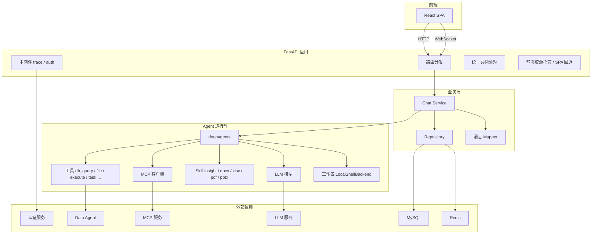
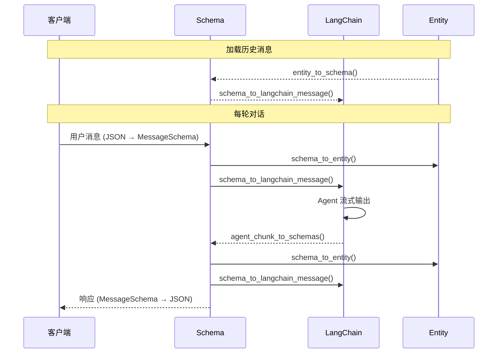

# 1. 项目介绍
## 1.1 项目背景
`insight-agent` 是一个面向归因分析场景的智能体应用。  
主要服务于业务分析、经营诊断和问题定位这类需要“先提出问题，再逐步收集证据，最后形成分析结论”的工作。  
这个项目强调的是让系统能够围绕一个真实分析任务持续推进，直到生成阶段性结论、分析材料和可交付结果。  
同时，用户可以保留历史对话、继续追问前面的结论、复用已经上传的附件和已经生成的中间产物，从而把一次分析逐渐发展成一个可持续推进的工作过程。


## 1.2 功能支持
### 1.2.1 Agent
基于 `deepagents` 组织 Agent 运行时
- 模型
- 本地工具:
  - `db_query` 数据查询
  - `return_file` 返回文件
  - `read_file` 读取文件
  - `write_file` 写入新文件
  - `edit_file` 修改已有文件
  - `ls` 列出目录中的文件
  - `glob` 按模式匹配搜索文件
  - `grep` 在文件中搜索文本
  - `execute` 执行命令行
  - `task` 启动独立子 Agent/隔离任务
  - `write_todos` 创建与管理任务清单
- MCP 工具: `tavily_search`...
- Skill: 
  - `insight` 业务数据分析与归因（需配合 db_query）
  - `docx` 处理 Word 文档
  - `pdf` 处理 PDF 文件
  - `pptx` 处理 PPT
  - `xlsx` 处理 Excel 表格
- 上下文压缩: `SummarizationMiddleware`
- 工作区: `LocalShellBackend`

### 1.2.2 系统能力
- 对话管理:
  - 创建对话
  - 删除对话
  - 修改对话信息
  - 获取所有对话
  - 获取对话历史消息
- 流式输出: 基于 WebSocket 流式返回模型回复、工具调用和工具结果
- 消息格式转换: 消息在 DTO、数据库存储、模型运行时 三种消息格式之间转换
- 消息持久化: 存储对话历史消息，存储上下文压缩结果
- 用户鉴权：通过认证中间件实现用户鉴权
- 文件上传
- 日志记录
- 统一异常处理
- 热更新配置

## 1.3 接口定义
所有接口需要在请求头中携带 Bearer Token 鉴权（WebSocket 除外，通过临时令牌替代），由认证中间件统一校验。

### 1.3.1 对话管理
#### 1.3.1.1 创建对话 `POST /api/chat/create`
创建新的对话，初始标题为"新对话"。  
可指定是否创建草稿。草稿对话允许先上传附件到工作区，等用户发送第一条消息时再自动转为正式对话。  

**请求参数：**
```json
{
  "is_draft": 0
}
```
- `is_draft` (int, 可选) — 是否创建草稿对话，`0`=正式对话，`1`=草稿对话，默认 `0`

**响应结果（201）：**
```json
{
  "conversation_id": 1,
  "title": "新对话",
  "update_at": "2026-05-04T12:00:00"
}
```
- `conversation_id` (int) — 对话 ID
- `title` (str) — 对话标题
- `update_at` (datetime) — 最后更新时间

**内部执行：**
- 将对话记录写入对话表

#### 1.3.1.2 删除对话 `POST /api/chat/delete`
逻辑删除指定对话，同时清理该对话下的所有消息、上下文压缩记录和工作区文件。

**请求参数：**
```json
{
  "conversation_ids": [1, 2, 3]
}
```
- `conversation_ids` (list[int], 必填) — 要删除的对话 ID 列表

**响应结果：** 无

**内部执行：**
- 逻辑删除对话表中数据及其所有关联数据（消息、摘要记录、工作区文件）

#### 1.3.1.3 修改对话信息 `POST /api/chat/update`
修改指定对话的标题。

**请求参数：**
```json
{
  "conversation_id": 1,
  "title": "新标题"
}
```
- `conversation_id` (int, 必填) — 对话 ID
- `title` (str, 必填) — 新标题

**响应结果：** 无

**内部执行：**
- 更新对话表中相应对话记录的标题

#### 1.3.1.4 获取所有对话 `GET /api/chat/ls`
查询当前用户的所有对话列表，按最后更新时间倒序排列。

**请求参数：** 无

**响应结果：**
```json
{
  "conversations": [
    {
      "conversation_id": 1,
      "title": "归因分析-2026年5月",
      "update_at": "2026-05-04T12:00:00"
    }
  ]
}
```
- `conversations` (list) — 对话列表，按更新时间倒序排列
- `conversations[].conversation_id` (int) — 对话 ID
- `conversations[].title` (str) — 对话标题
- `conversations[].update_at` (datetime) — 最后更新时间

**内部执行：**
- 从对话表中查询当前用户所有未删除对话记录

#### 1.3.1.5 获取对话历史消息 `GET /api/chat/ls/{conversation_id}`
查询指定对话下的所有历史消息，按上下文顺序排列。

**请求参数：**
- `conversation_id` (路径参数, 必填) — 对话 ID

**响应结果：**
```json
{
  "messages": [
    {
      "message_id": 1,
      "context_seq": 1,
      "role": "user",
      "parts": [{"type": "text", "text": "帮我分析一下最近的销售数据"}],
      "attachments": null,
      "finish_reason": null,
      "timestamp": "2026-05-04T12:00:00"
    }
  ]
}
```
- `messages` (list[MessageSchema]) — 消息列表，按 context_seq 顺序排列
- `messages[].message_id` (int) — 消息 ID
- `messages[].context_seq` (int) — 对话内上下文顺序号
- `messages[].role` (str) — 发送者角色：`user` / `assistant` / `tool`
- `messages[].parts` (list) — 消息片段，支持 text / image_url / tool_call / tool_result
- `messages[].attachments` (list) — 附件列表（可空）
- `messages[].finish_reason` (str) — 完成原因：`stop`（正常结束）/ `tool_calls`（进入工具调用），用户消息为 null
- `messages[].timestamp` (datetime) — 消息时间戳

**内部执行：**
- 从消息表读取消息记录并转换为前端格式

#### 1.3.1.6 创建 WebSocket 临时令牌 `POST /api/chat/ws-token`
浏览器 WebSocket API 无法在握手阶段自定义请求头，因此不能直接携带 Bearer Token 鉴权。  
因此先通过 HTTP 接口获取一个短时效的一次性令牌，WebSocket 连接时以查询参数传入，消费后立即失效。

**请求参数：** 无

**响应结果：**
```json
{
  "websocket_token": "dGhpcyBpcyBhIHRva2Vu...",
  "expires_in": 30
}
```
- `websocket_token` (str) — WebSocket 临时令牌（一次性使用，消费后即失效）
- `expires_in` (int) — 过期时间，单位秒（30s）

**内部执行：**
- 生成一次性令牌并写入 Redis

#### 1.3.1.7 基于 WebSocket 聊天 `WS /api/chat/ws/chat?websocket_token={token}&conversation_id={id}`
建立 WebSocket 长连接，承载实时对话过程。前端发送用户消息，后端流式返回模型回复、工具调用和工具结果。

**连接参数：**
- `websocket_token` (str, 必填) — WebSocket 临时令牌（通过 `/api/chat/ws-token` 获取）
- `conversation_id` (int, 必填) — 对话 ID

**发送消息（JSON）：**
```json
{
  "message": {
    "role": "user",
    "parts": [{"type": "text", "text": "帮我分析最近的趋势"}]
  }
}
```
- `message` (MessageSchema, 必填) — 用户消息，role 必须为 `user`
- `message.role` (str, 必填) — 必须为 `user`
- `message.parts` (list, 必填) — 消息片段
- `message.attachments` (list, 可选) — 附件列表

**取消生成：**
```json
{"type": "cancel"}
```

**接收消息（流式，JSON）：**
```json
{
  "type": "message",
  "message": {
    "message_id": 2,
    "context_seq": 2,
    "role": "assistant",
    "parts": [{"type": "text", "text": "根据分析..."}],
    "finish_reason": null,
    "timestamp": "2026-05-04T12:00:01"
  }
}
```
- 每条消息为一个 JSON 帧，`finish_reason` 为 `stop` 或 `tool_calls` 时表示本轮回复结束
- 工具调用和工具结果分别以 `tool_call` 和 `tool_result` 类型发送

**错误响应：**
```json
{
  "type": "error",
  "content": "错误描述"
}
```

**连接关闭状态码：**
- `4401` — WebSocket 令牌无效、过期或已被消费
- `4404` — 对话不存在或不属于当前用户

**内部执行：**
- 校验令牌
- 恢复身份
- 加载历史消息
- 应用压缩上下文
- Agent 流式输出

### 1.3.2 附件管理
#### 1.3.2.1 上传文件 `POST /api/chat/attachment/upload`
将附件上传到指定对话的工作区目录，供 Agent 使用。

**请求参数：** `multipart/form-data`
- `conversation_id` (int, 必填) — 对话 ID
- `file` (file, 必填) — 上传的文件

**响应结果：**
```json
{
  "attachment": {
    "f_path": "report.xlsx"
  }
}
```
- `attachment.f_path` (str) — 文件在对话工作区内的相对路径

**内部执行：**
- 将文件写入工作区

#### 1.3.2.2 删除文件 `POST /api/chat/attachment/delete`
删除指定对话工作区中的附件文件。

**请求参数：**
```json
{
  "conversation_id": 1,
  "f_path": "report.xlsx"
}
```
- `conversation_id` (int, 必填) — 对话 ID
- `f_path` (str, 必填) — 文件在对话工作区内的相对路径

**响应结果：** 无

**内部执行：**
- 删除工作区中的文件

#### 1.3.2.3 下载文件 `GET /api/chat/attachment/get?conversation_id={id}&f_path={path}`
从对话工作区下载附件文件。

**请求参数：**
- `conversation_id` (int, 必填) — 对话 ID
- `f_path` (str, 必填) — 文件在对话工作区内的相对路径

**响应结果：** 文件二进制流（`FileResponse`）

**内部执行：**
- 从工作区读取并返回文件流

### 1.3.3 服务管理
#### 1.3.3.1 热更新配置 `POST /api/reload`
不重启服务的情况下重新加载配置并重建 Agent 实例。

**请求参数：** 无

**响应结果：**
```json
{
  "status": "ok",
  "message": "..."
}
```

**内部执行：**
- 重新加载配置并重建 Agent 实例

```bash
curl -X POST http://127.0.0.1:7300/api/reload -H 'Authorization: Bearer <access_token>'
```

## 1.4 数据存储定义
### 1.4.1 MySQL 存储
#### 1.4.1.1 `conversation` — 对话表
- `id` (BIGINT, PK) — 对话 ID
- `user_id` (BIGINT, NOT NULL, INDEX) — 用户 ID
- `title` (VARCHAR 128, NOT NULL) — 对话标题
- `is_draft` (TINYINT, NOT NULL, DEFAULT 0) — 是否草稿对话，0=正式，1=草稿
- `create_at` (DATETIME, NOT NULL) — 创建时间
- `update_at` (DATETIME, NOT NULL, ON UPDATE) — 最后更新时间
- `yn` (TINYINT, NOT NULL, DEFAULT 1) — 启用标记，0=逻辑删除，1=正常

#### 1.4.1.2 `message` — 消息表
- `id` (BIGINT, PK) — 消息 ID
- `conversation_id` (BIGINT, NOT NULL, FK → conversation.id ON DELETE CASCADE) — 所属对话 ID
- `context_seq` (BIGINT, NOT NULL, UNIQUE(conversation_id, context_seq)) — 对话内上下文顺序号
- `role` (VARCHAR 10, NOT NULL) — 发送者角色：`user` / `assistant` / `tool`
- `parts` (MEDIUMTEXT, NOT NULL) — 消息片段，JSON 数组，元素按 type 区分：text / image_url / tool_call / tool_result
- `finish_reason` (VARCHAR 128, NULLABLE) — 完成原因：`stop` / `tool_calls`，用户消息为 null
- `attachments` (TEXT, NULLABLE) — 附件列表，JSON 数组
- `create_at` (DATETIME, NOT NULL) — 创建时间
- `yn` (TINYINT, NOT NULL, DEFAULT 1) — 启用标记，0=逻辑删除，1=正常

#### 1.4.1.3 `context_compaction` — 上下文压缩记录表
- `id` (BIGINT, PK) — 压缩记录 ID
- `conversation_id` (BIGINT, NOT NULL, FK → conversation.id ON DELETE CASCADE) — 所属对话 ID
- `end_seq` (BIGINT, NOT NULL, INDEX(conversation_id, end_seq)) — 压缩范围的截止 context_seq（不包含）
- `summary_message` (MEDIUMTEXT, NOT NULL) — 压缩后的摘要内容
- `create_at` (DATETIME, NOT NULL) — 创建时间
- `yn` (TINYINT, NOT NULL, DEFAULT 1) — 启用标记，0=逻辑删除，1=正常

### 1.4.2 Redis 存储
#### 1.4.2.1 WebSocket 临时令牌
- Key 格式：`ws_token:{token}`（token 为 `secrets.token_urlsafe(32)` 生成的 43 字符字符串）
- Value：`{"user_id": <int>}`（JSON）
- TTL：30 秒
- 写入：`SETEX ws_token:{token} 30 '{"user_id": ...}'`
- 消费：`GETDEL ws_token:{token}` — 读取并原子删除，保证一次性使用。Key 不存在则连接被拒绝（状态码 4401）

## 1.5 系统架构


- **前端**：
  - React SPA，构建产物由 FastAPI 托管
  - 通过 HTTP 接口和 WebSocket 与后端通信
- **应用层**：
  - 路由按前缀分发（`/api/*` 业务接口、`/auth-api/*` 认证代理、`/*` SPA 回退）
  - 中间件负责 trace 打点和 Bearer Token 鉴权
  - 异常处理器统一错误响应格式
- **业务层**：
  - Chat Service 管理对话上下文和流式编排
  - Repository 封装数据库和 Redis 访问
  - Mapper 负责 DTO / 数据库实体 / LangChain 消息三种格式的互转
- **Agent 运行时**：
  - `deepagents` 框架组装模型、工具、Skill、MCP 客户端和工作区
  - 中间件链在模型调用前后注入系统提示、上下文压缩等逻辑
- **外部依赖**：
  - 认证服务校验用户身份
  - Data Agent 提供数据库查询能力
  - MCP 服务扩展外部工具
  - LLM 服务提供模型推理
  - MySQL 持久化对话和消息
  - Redis 存储 WebSocket 一次性令牌

# 2. 项目基础设施
## 2.1 项目依赖
[pyproject.toml](./pyproject.toml)
- Web 框架与接口能力：`fastapi[standard]`
- 数据库与 ORM：`sqlalchemy`、`asyncmy`、`pymysql`
- 数据库辅助工具：`sqlacodegen`
- 缓存与临时状态：`redis`
- Agent 与模型相关：`deepagents`、`openai`、`langchain-openai`、`langchain-mcp-adapters`
- 配置与日志：`omegaconf`、`loguru`
- 数据分析与文件处理：`pandas`、`pdfplumber`、`pypdf`

## 2.2 基础设施内容
```text
insight-agent/
└── app/
    └── core/                   基础设施核心
        ├── context.py          上下文变量管理
        ├── database.py         数据库连接与会话管理
        ├── exceptions/         异常定义与错误码
        │   ├── base.py         基础异常
        │   └── exc_handlers.py 统一异常处理器
        ├── http_client.py      外部 HTTP 客户端封装
        ├── log_setup.py        日志配置与初始化
        ├── middlewares/        中间件
        │   ├── auth.py         Bearer Token 鉴权
        │   └── trace.py        链路追踪与日志
        ├── redis.py            Redis 客户端封装
        └── settings.py         项目配置管理
```

## 2.3 项目配置管理
[config.yml](./configs/config.yml) 存放项目配置，包括：
- 数据库连接配置
- Redis 连接配置
- 模型相关配置（模型名称、地址等）
- MCP 服务配置
- 认证服务地址与接口配置
- 跨域配置
- 服务启动端口

[.env](./configs/.env) 中存放敏感的账号、密钥和令牌信息 ，通过环境变量注入，避免硬编码到代码或配置文件中。

[settings.py](./app/core/settings.py) 统一完成配置加载。  
应用启动时先读取 `.env` 中的环境变量，再加载 `config.yml`，合并组织成项目内部统一使用的配置对象。  
此外还提供了 `reload_config()` 方法，用于在不重启进程的情况下重新加载 `.env` 和 `config.yml` 并更新全局配置对象。

## 2.4 数据库工具
[database.py](./app/core/database.py) 统一管理数据库引擎、会话工厂，对外提供：
- `get_db()` — FastAPI 依赖，请求级自动注入 `AsyncSession`
- `get_db_session()` — 上下文管理器，用于后台任务等非请求场景
- `close_db()` — 应用关闭时释放所有数据库连接

## 2.5 Redis 工具
[redis.py](./app/core/redis.py) 统一管理 Redis 客户端连接，对外提供：
- `get()` — 获取 Redis 客户端单例，断连时自动重连
- `close_redis()` — 关闭 Redis 连接

## 2.6 HTTP 客户端工具
[http_client.py](./app/core/http_client.py) 统一管理外部 HTTP 客户端连接，对外提供：
- `get_http_client()` — 获取全局异步 HTTP 客户端单例
- `close_http_client()` — 关闭客户端连接

## 2.7 上下文工具
[context.py](./app/core/context.py) 管理请求级上下文（user_id 等），供日志和业务链路使用。

## 2.8 日志工具
[log_setup.py](./app/core/log_setup.py) 基于 loguru 配置日志输出，对外提供：
- `setup_logger()` — 应用启动时初始化日志，配置控制台和文件输出

控制台输出带颜色的可读格式。  
文件输出按 `jsonl` 格式写入。  
JSON 日志包含 `request_id`、`trace_id`、`user_id`、`method`、`path`、`client_ip` 等上下文信息。  

## 2.9 异常体系与统一错误处理
异常体系包括：
- `app/core/exceptions/`（基础异常和处理器）
- `app/errors/`（业务异常）

### 2.9.1 基础异常
[base.py](./app/core/exceptions/base.py) 采用 RFC 9457 Problem Details 风格，定义了：
- `ProblemError` — 异常基类，包含 `type`、`title`、`status`、`detail`，提供 `to_problem()` 转为结构化响应
- `ValidationError` — 参数校验失败
- `AuthError` — 认证失败
- `PermissionDeniedError` — 权限不足
- `NotFoundError` — 资源不存在
- `ConflictError` — 资源冲突
- `BadRequestError` — 请求参数错误
- `InternalServerError` — 500 内部错误兜底

### 2.9.2 统一异常处理器
[exc_handlers.py](./app/core/exceptions/exc_handlers.py) 将不同来源的异常收敛成 `application/problem+json` 格式，包含 `type`、`title`、`status`、`detail`、`instance`。注册了四个处理器：
- `problem_error_handler` — 处理 `ProblemError` 及其子类
- `validation_error_handler` — 处理 FastAPI `RequestValidationError`
- `http_exception_handler` — 处理 FastAPI `HTTPException`
- `unhandled_exception_handler` — 处理所有未捕获异常

## 2.10 中间件
中间件统一放在 `app/core/middlewares/` 下，在请求进入业务路由前完成通用处理。

### 2.10.1 trace 与日志体系
[trace.py](./app/core/middlewares/trace.py) 的 `middleware()` 给每个请求补齐链路信息：
- 从请求头继承或生成 `request_id`、`trace_id`，写入 `ContextVar`
- 提取客户端 IP（支持 `X-Forwarded-For`）、请求方法和路径
- 调用 `call_next(request)` 执行请求
- 将 `X-Request-ID` 和 `X-Trace-ID` 写回响应头

### 2.10.2 auth 中间件
[auth.py](./app/core/middlewares/auth.py) 的 `middleware()` 负责 Bearer Token 鉴权：
- 只对 `/api` 前缀的路径进行鉴权，其余路径直接放行
- 调用 `authenticate_authorization()` 从 `Authorization` 头提取令牌，请求认证服务 introspection 接口校验
- 通过 [auth_schema.py](./app/schemas/auth_schema.py) 将认证结果转为 `IntrospectionResponse`
- 校验成功后，用户信息写入 `request.state.payload`，`user_id` 写入上下文变量
- 认证失败时通过 `problem_error_handler` 返回统一错误响应，涉及 [auth_error.py](./app/errors/auth_error.py) 中的业务异常：
  - `MissingAccessTokenError` — 缺少访问令牌
  - `InvalidAccessTokenError` — 访问令牌无效
  - `AuthServiceUnavailableError` — 认证服务不可用
  - `AuthServiceResponseError` — 认证服务响应异常

### 2.11 数据库初始化
[chat.sql](sql/mysql/chat.sql) 数据库建表脚本  
[init_db.py](./app/init_db.py) 建库脚本：
- 从环境变量读取数据库连接信息
- 收集 `sql/mysql/*.sql` 建表脚本
- 建库并执行 SQL
- 通过 `sqlacodegen` 反射数据库结构生成 `app/entities/*.py` ORM 模型

# 3. Agent 组装
## 3.1 组件概览
Agent 运行时由以下组件组成：
- **模型** — 负责推理与决策，决定回复内容、是否调用工具及调用哪个工具
- **工作区** — 承接对话级文件、中间分析产物和最终交付文件
- **本地工具** — `db_query`（数据查询）、`return_file`（返回文件）等定义的工具，以及 `deepagents` 内置的 `read_file`、`execute`、`task` 等通用工具
- **MCP 工具** — 通过 MCP 客户端接入的外部扩展能力（如 `tavily_search`）
- **Skill** — 注入任务方法论、执行规范和交付要求
- **中间件** — `SummarizationMiddleware`（长对话上下文压缩）、`TodoListMiddleware`（任务拆解）、`SubAgentMiddleware`（子 Agent 协作）

## 3.2 工作区
每个对话分配独立的工作区，路径为 `.deepagents/workspaces/user_{user_id}/{conversation_id}`。

工作区解决的问题：
- **对话级隔离** — 不同用户、不同对话的文件互不干扰
- **文件承接** — `db_query` 查询结果写入文件，工具执行结果稳定落盘
- **结果回传** — 工作区文件可通过 `return_file` 返回给前端作为附件

`get_workspace_dir()`（[agent.py:26-31](./app/agent/agent.py#L26-L31)）负责确保目录存在。  
`_backend_factory()`（[agent.py:33-56](./app/agent/agent.py#L33-L56)）中的 `LocalShellBackend` 将工作区目录挂载为 Agent 可读写的文件系统。

## 3.3 本地工具
### 3.3.1 `db_query`
[db_query.py](./app/agent/tools/db_query.py) 将自然语言查询发送给 Data Agent，结果写入工作区文件，接收两个参数：
- `query` — 用户的自然语言查询需求
- `file_name` — 输出结果文件的文件名（不含路径）

执行流程：
- 流式调用 Data Agent 的 SSE 接口，收集最终结果
- 表格结果写入 CSV，非表格结果写入 JSON

返回结构包含以下字段：
- `status` — 操作状态，`"success"` 或 `"error"`
- `file_path` — 结果文件绝对路径
- `file_format` — 文件格式，`"csv"` 或 `"json"`
- `pandas_read_hint` — pandas 读取提示，如 `pd.read_csv('...')`
- `fields` — 表格结果的列名列表；非表格结果为空列表
- `preview_rows` — 前 5 行数据预览，帮助 Agent 理解数据结构
- `row_count` — 表格结果总行数；非表格结果为 `None`
- 查询失败时返回 `message` — 错误描述

### 3.3.2 `return_file`
[return_file.py](./app/agent/tools/return_file.py) 校验工作区文件路径，将文件元信息返回给后续流程，本身不传输文件二进制内容。接收两个参数：
- `f_path` — 相对于工作区的文件路径，自动去除前导 `/`
- `f_name`（可选）— 展示给用户的文件名，未提供时回退为路径中的文件名

返回结构：
- `status` — 操作状态，`"success"` 或 `"error"`
- `message` — 状态描述
- `f_path` — 工作区相对路径，前端可拼接下载 URL
- `f_name` — 展示给用户的文件名

安全校验：解析绝对路径后检查是否仍在工作区目录范围内，防止路径逃逸。

实际文件返回由后续的 Message Mapper 识别 `return_file` 的工具结果，将其转换为附件结构，前端再通过 `/api/chat/attachment/get` 接口下载。

### 3.3.3 内置工具
`deepagents` 框架提供的内置工具，Agent 初始化时自动可用：
- `read_file` — 读取文件
- `write_file` — 写入新文件
- `edit_file` — 修改已有文件
- `ls` — 列出目录中的文件
- `glob` — 按模式匹配搜索文件
- `grep` — 在文件中搜索文本
- `execute` — 在工作区内执行命令行
- `task` — 启动独立子 Agent 执行隔离任务
- `write_todos` — 创建与管理任务清单

文件操作工具（`read_file`、`write_file`、`edit_file`、`ls`、`glob`、`grep` 等）的路径都经过 `FilesystemBackend._resolve_path()` 统一解析。`virtual_mode=True` 时该方法将路径锚定到 `root_dir`，禁止 `..` 和 `~` 穿越，并校验解析后的路径不超出 `root_dir` 范围。`execute()` 不走此路径，直接在宿主机上执行命令。

## 3.4 MCP 工具
[mcp.py](./app/agent/mcp.py) 将配置文件中的多个 MCP 服务统一初始化为 `MultiServerMCPClient`：
- 支持 `sse`、`stdio`、`websocket`、`streamable_http` 四种传输协议
- Agent 通过 `get_mcp_tools()` 获取所有 MCP 工具
- MCP 工具与本地工具合并为统一工具列表，Agent 无需区分来源

## 3.5 Skill 系统
Skill 指导 Agent “遇到某类任务时，应按什么流程推进、产出什么结果”。项目 Skill 放在 `.deepagents/skills/` 下。
- Agent 初始化时通过 `skills=[“/skills/”]` 整体挂载（[agent.py:81](./app/agent/agent.py#L81)）
- `_backend_factory()` 中的 `FilesystemBackend` 将 `/skills/` 路由到 Skill 目录（[agent.py:49-56](./app/agent/agent.py#L49-L56)）
- Agent 运行时根据任务类型自动发现并使用对应 Skill

## 3.6 insight Skill
[insight/SKILL.md](./.deepagents/skills/insight/SKILL.md) 将归因分析任务约束为固定工作流：
- **进入条件** — 属于归因分析、经营诊断、活动复盘等场景时按分析模式推进
- **数据获取** — 统一通过 `db_query` 获取，优先基于结果文件继续处理
- **分析动作** — 补齐基线对比、规模/结构/效率/贡献拆解和异常识别
- **分析维度** — 围绕用户、渠道、商品、地域、时间、行为等展开
- **文件产物** — 原始查询、中间分析、最终交付分别落到约定目录
- **报告交付** — 输出 HTML 报告，含摘要、指标卡片、多维拆解、结论与建议
- **执行环境** — Python 命令使用 `uv run`，依赖安装使用 `uv add`

辅助脚本 [render_report.py](./.deepagents/skills/insight/scripts/render_report.py) 将结构化 JSON 渲染为自包含 HTML 报告，支持以下区块类型：
- `callout` — 高亮提示（info / warning / success / danger）
- `metrics` — 指标卡片（label / value / note）
- `cards` — 多维卡片展示
- `table` — 数据表格
- `bar_chart` / `line_chart` — 条形图与折线图（基于 ECharts）
- `prose` / `list` / `columns` — 文本与布局
- `section` — 带标题的分组容器

使用方式：`uv run python render_report.py --input analysis/report_payload.json --output outputs/report.html`

## 3.7 Agent 组装
[agent.py](./app/agent/agent.py) 集中装配所有组件。

**_build_agent()** 装配流程：
- 从配置读取模型参数，通过 `init_chat_model()` 初始化 LLM
- 加载本地工具（`db_query`、`return_file`）和 MCP 工具
- `_backend_factory()` 动态创建 `CompositeBackend`（工作区 `LocalShellBackend` + Skill `FilesystemBackend`）
- 调用 `create_deep_agent()` 将模型、工具、后端、Skill 组装为 `CompiledStateGraph`

**get_agent()** 实例管理：
- 全局变量 `_agent` 持有单例，首次请求时按需创建，后续复用
- `_agent_lock` 保证并发场景下只创建一次
- `reset_agent()` 使实例失效，下次调用时用最新配置重建（供热更新使用）

# 4. 项目中三种消息格式
## 4.1 三种消息格式
项目在运行时、前后端交互和数据库存储三个层面使用不同的消息格式。

### 4.1.1 Agent 运行时消息格式
Agent 消费和产出的运行时格式，主要有三种角色：

`user` 消息
```json
{
  “role”: “user”,
  “content”: [
    {“type”: “text”, “text”: “...”},
    {“type”: “image_url”, “image_url”: “data:image/png;base64,...”}
  ]
}
```
- `content` 为 `list[dict]`，支持文本和图片片段
- 文档附件转为文本提示追加到 `content`，图片附件读取工作区文件转为 `data URL`

`assistant` 消息
```json
{
  “role”: “assistant”,
  “content”: [{“type”: “text”, “text”: “...”}],
  “tool_calls”: [{“type”: “tool_call”, “id”: “...”, “name”: “...”, “args”: {}}]
}
```
- `content` 承载文本，`tool_calls` 承载工具调用

`tool` 消息
```json
{
  “role”: “tool”,
  “tool_call_id”: “...”,
  “name”: “...”,
  “content”: “...”
}
```
- `tool_call_id` 关联对应的工具调用，`content` 统一按字符串处理

### 4.1.2 前后端交互消息格式
前后端通过 `MessageSchema` 交互（[chat_schema.py:52-108](./app/schemas/chat_schema.py#L52-L108)），采用统一的片段结构：

```python
class MessageSchema(BaseModel):
    message_id: int | None       # 消息 ID
    context_seq: int | None      # 对话内上下文顺序号
    role: MessageRole            # user / assistant / tool / system
    parts: list[MessagePart]     # 消息片段（text / image_url / tool_call / tool_result）
    attachments: list[Attachment] | None  # 附件列表
    finish_reason: FinishReason | None    # stop / tool_calls
    timestamp: datetime | None   # 发送时间
```

`parts` 是核心设计，一条消息支持四种片段类型：
- `TextContent` — `{“type”: “text”, “text”: “...”}`
- `ImageContent` — `{“type”: “image_url”, “image_url”: “...”}`
- `ToolCallPart` — `{“type”: “tool_call”, “tool_call_id”: “...”, “name”: “...”, “args”: {...}}`
- `ToolResultPart` — `{“type”: “tool_result”, “tool_call_id”: “...”, “name”: “...”, “content”: “...”}`

`attachments` 中存放附件列表，附件结构为 `{“f_path”: “...”}`。

### 4.1.3 数据库存储消息格式
数据库使用 `Message` 实体存储（[chat.py:50-70](./app/entities/chat.py#L50-L70)），与 Schema 的差异在于：
- `parts` 和 `attachments` 在 Entity 中为 JSON 字符串，Schema 中为结构化对象
- 表结构保持稳定，不需要为每种消息片段单独拆表

```python
class Message(Base):
    id: int
    conversation_id: int
    context_seq: int
    role: str
    parts: str              # JSON 字符串
    create_at: datetime
    yn: int
    finish_reason: str | None
    attachments: str | None # JSON 字符串或 None
```

## 4.2 消息格式转换
三种消息格式在请求链路中不断相互转换，Mapper 层负责做稳定、可逆的格式转换。



### 4.2.1 Agent 流式消息转 Schema
Agent 流式输出的 `chunk` 按 LangGraph 节点组织。

**`agent_chunk_to_schemas()`**（[message_mapper.py:173-187](./app/mappers/message_mapper.py#L173-L187)）遍历 `model` 和 `tools` 节点，提取其中的 `messages` 列表后逐条调用 `langchain_message_to_schema()` 进行转换。中间件节点（如 `SkillsMiddleware`、`TodoListMiddleware`）的输出不含 `messages` 列表，不会被转成消息。

**`langchain_message_to_schema()`**（[message_mapper.py:86-171](./app/mappers/message_mapper.py#L86-L171)）将单条 LangChain 消息转为 `MessageSchema`，转换规则：

`AIMessage` / `ChatMessage` → `role: "assistant"`：
- `content`（字符串或列表）转为 `TextContent`
- `tool_calls` 转为一个或多个 `ToolCallPart`，字段：`tool_call_id`、`name`、`args`
- `response_metadata.finish_reason` 写入 `finish_reason`

`ToolMessage` → `role: "tool"`：
- 工具结果转为 `ToolResultPart`，字段：`tool_call_id`、`name`、`content`
- 当 `name == "return_file"` 且结果为成功状态时，提取 `f_path` 组装为 `Attachment`

### 4.2.2 Schema 转 Agent 运行时消息
**`schema_to_langchain_message()`**（[message_mapper.py:282-329](./app/mappers/message_mapper.py#L282-L329)）将 `MessageSchema` 转为 LangChain 运行时消息：

- `user` / `assistant`：
  - `TextContent` / `ImageContent` → `content`
  - `ToolCallPart` → `tool_calls`
- `tool`：提取 `ToolResultPart` 转为运行时工具消息
- 用户消息有附件时调用 `_process_attachments()`（[message_mapper.py:226-280](./app/mappers/message_mapper.py#L226-L280)）：
  - 文档附件：追加文本提示告知 Agent 文件已保存到工作区
  - 图片附件：通过 `_build_image_data_url()`（[message_mapper.py:189-209](./app/mappers/message_mapper.py#L189-L209)）从工作区读取并转为 `data URL`
  - 图片文件丢失时：追加文本提示告知图片已不可用

### 4.2.3 Schema 转数据库存储消息
**`schema_to_entity()`**（[message_mapper.py:48-84](./app/mappers/message_mapper.py#L48-L84)）将 `MessageSchema` 转为数据库实体：

- 检查 `context_seq` 是否存在
- `parts` 序列化为 JSON 字符串
- `attachments` 序列化为 JSON 字符串（可空）
- 补上 `conversation_id` 等数据库字段
- 若 `message_id` 或 `timestamp` 存在则保留

### 4.2.4 数据库存储消息转 Schema
**`entity_to_schema()`**（[message_mapper.py:15-46](./app/mappers/message_mapper.py#L15-L46)）将数据库实体恢复为 `MessageSchema`：

- `parts` JSON 字符串按 `type` 字段解析为 `TextContent` / `ImageContent` / `ToolCallPart` / `ToolResultPart`
- `attachments` JSON 字符串解析为 `Attachment` 列表
- 不支持的片段类型抛出 `ValueError`

# 5. 接口实现
## 5.1 对话接口
## 5.1 消息接口
## 5.1 附件接口
## 5.1 聊天接口
## 5.1 管理接口


## 5.1 后端功能接口
- `GET /health`：健康检查
- `GET /api/chat/ls`：获取对话列表
- `POST /api/chat/create`：创建对话
- `POST /api/chat/update`：修改对话
- `POST /api/chat/delete`：删除对话
- `GET /api/chat/ls/{conversation_id}`：获取历史消息
- `POST /api/chat/attachment/upload`：上传附件
- `POST /api/chat/attachment/delete`：删除附件
- `GET /api/chat/attachment/get`：获取附件文件
- `POST /api/chat/ws-token`：创建 WebSocket 临时令牌
- `WS /api/chat/ws/chat`：流式聊天

附代码片段：
- [chat.py](./insight-agent/app/routers/api/chat.py)

```python
...

router = APIRouter(prefix="/chat", tags=["chat"])

...
```

## 5.2 对话与消息列表接口
### 5.2.1 接口介绍
这一组接口负责承接聊天系统最基础的资源管理能力，包括对话本身的创建、更新、删除，以及历史消息列表的查询。

相关接口包括：
- `GET /api/chat/ls`：按当前用户查询对话列表
- `POST /api/chat/create`：创建对话，初始标题为“新对话”，可指定是否创建草稿对话
- `POST /api/chat/update`：校验对话归属后更新标题
- `POST /api/chat/delete`：逻辑删除对话，并一并清理消息、上下文压缩记录和工作区目录
- `GET /api/chat/ls/{conversation_id}`：查询某个对话下的历史消息列表

### 5.2.2 相关依赖
这一组接口背后主要依赖三个 Repository：
- `conversation_repo`
  - 负责对话的查询、创建、更新和逻辑删除，是对话接口最核心的数据访问层。
  附代码：
  - [conversation_repo.py](./insight-agent/app/repositories/conversation_repo.py)

- `message_repo`
  - 负责历史消息查询，以及删除对话时批量禁用该对话下的消息记录。
  附代码：
  - [message_repo.py](./insight-agent/app/repositories/message_repo.py)

- `context_compaction_repo`
  - 负责上下文压缩记录的写入、查询，以及删除对话时批量禁用压缩记录。
  附代码：
  - [context_compaction_repo.py](./insight-agent/app/repositories/context_compaction_repo.py)


### 5.2.3 `GET /api/chat/ls`
`GET /api/chat/ls` 实现：
- 从认证信息中拿到当前用户 ID
- 调用 `conversation_repo.ls` 只查询当前用户自己的对话
- 把查询结果转换成 `ConversationListResponse`

附代码片段：
- [chat.py](./insight-agent/app/routers/api/chat.py)

```python
...

@router.get("/ls")
async def api_get_conversations(
    request: Request, db_session: Annotated[AsyncSession, Depends(get_app_db)]
) -> chat_schema.ConversationListResponse:
    """获取所有对话"""
    user_id = request.state.payload.sub
    conversations = await conversation_repo.ls(db_session, user_id)
    logger.info(f"Get conversations: conversation_ids={[i.id for i in conversations]}")
    return chat_schema.ConversationListResponse(
        conversations=[
            chat_schema.ConversationResponse(
                conversation_id=i.id,
                title=i.title,
                update_at=i.update_at,
            )
            for i in conversations
        ]
    )

...
```

- [chat_schema.py](./insight-agent/app/schemas/chat_schema.py)

```python
...

class ConversationResponse(BaseModel):
    conversation_id: int
    title: str
    update_at: datetime


class ConversationListResponse(BaseModel):
    conversations: list[ConversationResponse]

...
```

### 5.2.4 `POST /api/chat/create`
`POST /api/chat/create` 实现：
- 调用 `conversation_repo.create` 创建对话
- 初始标题固定为“新对话”
- 允许通过 `is_draft` 控制是否创建草稿对话

草稿对话的处理流程如下：
- 前端可以先调用 `POST /api/chat/create` 创建 `is_draft=1` 的草稿对话
- 这类对话先出现在列表和工作区体系中，但还没有真正进入正式对话
- WebSocket 首次收到用户消息后，会检查对话是否仍处于草稿状态
- 如果仍是草稿，会先把 `is_draft` 更新为 `0`
- 后续这条对话再按正式对话继续写入消息、更新标题和维护上下文

这种设计用于解决“附件先上传、消息稍后发送”的场景。前端可以先创建一个草稿对话，把附件上传到对应工作区，等用户真正发出第一条消息时，再把它转换成正式对话。

附代码片段：
- [chat.py](./insight-agent/app/routers/api/chat.py)

```python
...

@router.post("/create", status_code=status.HTTP_201_CREATED)
async def api_create_conversation(
    request: Request,
    body: chat_schema.CreateConversationRequest,
    db_session: Annotated[AsyncSession, Depends(get_app_db)],
) -> chat_schema.ConversationResponse:
    """创建新对话"""
    user_id = request.state.payload.sub
    conversation = await conversation_repo.create(
        db_session, user_id, "新对话", is_draft=body.is_draft
    )
    logger.info(
        f"Create conversation: conversation_id={conversation.id}, is_draft={conversation.is_draft}"
    )
    return chat_schema.ConversationResponse(
        conversation_id=conversation.id,
        title=conversation.title,
        update_at=conversation.update_at,
    )

...
```

- [chat_schema.py](./insight-agent/app/schemas/chat_schema.py)

```python
...

class CreateConversationRequest(BaseModel):
    is_draft: Literal[0, 1] = Field(default=0, description="是否创建草稿对话")

...
```

### 5.2.5 `POST /api/chat/update`
`POST /api/chat/update` 实现：
- 先校验对话是否存在且属于当前用户
- 再调用 `conversation_repo.update` 更新标题

附代码片段：
- [chat.py](./insight-agent/app/routers/api/chat.py)

```python
...

@router.post("/update")
async def api_update_conversation(
    request: Request,
    body: chat_schema.UpdateConversationRequest,
    db_session: Annotated[AsyncSession, Depends(get_app_db)],
) -> None:
    """修改对话信息"""
    user_id = request.state.payload.sub
    # 检查对话是否存在且属于当前用户
    conversation = await conversation_repo.get_by_id(db_session, body.conversation_id)
    if (conversation is None) or (conversation.user_id != user_id):
        raise chat_error.ConversationNotFound
    await conversation_repo.update(db_session, conversation, title=body.title)
    logger.info(f"Update conversation: conversation_id={body.conversation_id}")

...
```

- [chat_schema.py](./insight-agent/app/schemas/chat_schema.py)

```python
...

class UpdateConversationRequest(BaseModel):
    conversation_id: int = Field(..., description="对话ID")
    title: str = Field(..., description="对话标题")

...
```

### 5.2.6 `POST /api/chat/delete`
`POST /api/chat/delete` 实现：
- 先校验对话归属
- 调用 `conversation_repo.update` 把对话逻辑删除
- 调用 `message_repo.update_yn_by_conversation_id` 禁用该对话下的消息
- 调用 `context_compaction_repo.update_yn_by_conversation_id` 禁用该对话下的摘要记录
- 删除该对话对应的工作区目录

附代码片段：
- [chat.py](./insight-agent/app/routers/api/chat.py)

```python
...

@router.post("/delete")
async def api_delete_conversations(
    request: Request,
    body: chat_schema.DeleteConversationRequest,
    db_session: Annotated[AsyncSession, Depends(get_app_db)],
) -> None:
    """删除对话(逻辑删除)"""
    user_id = request.state.payload.sub
    for conversation_id in body.conversation_ids:
        # 检查对话是否存在且属于当前用户
        conversation = await conversation_repo.get_by_id(db_session, conversation_id)
        if (conversation is None) or (conversation.user_id != user_id):
            continue
        # 禁用对话
        await conversation_repo.update(db_session, conversation, yn=0)
        # 禁用对话下所有消息
        await message_repo.update_yn_by_conversation_id(
            db_session, conversation_id, yn=0
        )
        # 禁用对话下所有上下文压缩记录
        await context_compaction_repo.update_yn_by_conversation_id(
            db_session, conversation_id, yn=0
        )
        # 删除对话对应工作区
        shutil.rmtree(get_workspace_dir(user_id, conversation_id), ignore_errors=True)
    logger.info(f"Delete conversations: conversation_ids={body.conversation_ids}")

...
```

- [chat_schema.py](./insight-agent/app/schemas/chat_schema.py)

```python
...

class DeleteConversationRequest(BaseModel):
    conversation_ids: list[int] = Field(..., description="对话ID列表")

...
```

### 5.2.7 `GET /api/chat/ls/{conversation_id}`
`GET /api/chat/ls/{conversation_id}` 实现：
- 读取指定对话下的历史消息
- 调用 `message_repo.ls` 返回消息实体列表
- 再通过 `entity_to_schema` 把数据库消息恢复成前端可直接使用的 `MessageSchema`

附代码片段：
- [chat.py](./insight-agent/app/routers/api/chat.py)

```python
...

@router.get("/ls/{conversation_id}")
async def api_get_messages(
    conversation_id: int, db_session: Annotated[AsyncSession, Depends(get_app_db)]
) -> chat_schema.MessageListResponse:
    """获取某个对话所有消息"""
    messages = await message_repo.ls(db_session, conversation_id)
    logger.info(f"Get messages: {conversation_id=}, message_count={len(messages)}")
    return chat_schema.MessageListResponse(
        messages=[message_mapper.entity_to_schema(message) for message in messages]
    )

...
```

- [chat_schema.py](./insight-agent/app/schemas/chat_schema.py)

```python
...

class MessageListResponse(BaseModel):
    messages: list[MessageSchema]

...
```

## 5.3 附件接口
### 5.3.1 接口介绍
附件接口负责把文件写入对话工作区，并把工作区中的文件重新返回给前端。

附件相关接口包括：
- `POST /api/chat/attachment/upload`：上传附件到对话工作区
- `POST /api/chat/attachment/delete`：删除工作区中的附件
- `GET /api/chat/attachment/get`：获取工作区中的附件文件

### 5.3.2 相关依赖
这一组接口背后主要依赖两类基础能力：
- `conversation_repo`：负责校验当前操作的对话是否存在且属于当前用户
- 工作区相关函数：`get_workspace_dir()` 用来定位对话工作区，`_build_attachment_unique_name()` 和 `_build_attachment_path()` 用来保证文件名安全和路径安全

### 5.3.3 `POST /api/chat/attachment/upload`
`POST /api/chat/attachment/upload` 实现：
- 接收 `conversation_id` 和 `file`
- 校验对话是否存在且属于当前用户
- 用 `_build_attachment_unique_name()` 生成唯一文件名，避免重名覆盖
- 用 `get_workspace_dir()` 获取对话工作区
- 用 `_build_attachment_path()` 校验路径，防止路径逃逸
- 按块写入文件
- 返回上传后的附件元数据

附代码片段：
- [chat.py](./insight-agent/app/routers/api/chat.py)

```python
...

def _build_attachment_unique_name(filename: str) -> str:
    """构造落盘文件名，尽量保留原文件名并附加唯一标识"""
    # 只保留文件名本身，避免客户端传入路径片段
    basename = filename.split("/")[-1].split("\\")[-1].strip()
    # 将特殊字符替换为下划线，保留中英文、数字和常见文件名符号
    normalized_name = re.sub(r"[^0-9A-Za-z._\-\u4e00-\u9fff]+", "_", basename)
    # 去掉首尾无意义的点和下划线，并为空文件名提供兜底值
    safe_name = normalized_name.strip("._") or "upload"
    # 附加一个短随机后缀，避免同名文件互相覆盖
    unique_suffix = uuid4().hex[:4]
    # 没有扩展名时，直接在文件名末尾追加随机后缀
    if "." not in safe_name:
        return f"{safe_name}_{unique_suffix}"
    # 有扩展名时，仅在主文件名后追加随机后缀，保留原始扩展名
    stem, suffix = safe_name.rsplit(".", 1)
    return f"{stem}_{unique_suffix}.{suffix}"


def _build_attachment_path(target_dir, path: str):
    """基于工作区目录构造附件路径，并阻止路径逃逸"""
    target_path = (target_dir / path).resolve()
    if target_dir.resolve() not in target_path.parents:
        raise chat_error.ConversationNotFound
    return target_path


@router.post("/attachment/upload")
async def api_upload_attachment(
    request: Request,
    db_session: Annotated[AsyncSession, Depends(get_app_db)],
    conversation_id: int = Form(...),
    file: UploadFile = File(...),
) -> chat_schema.UploadAttachmentResponse:
    """上传附件到当前对话工作区"""
    user_id = request.state.payload.sub
    # 检查对话是否存在且属于当前用户
    conversation = await conversation_repo.get_by_id(db_session, conversation_id)
    if (conversation is None) or (conversation.user_id != user_id):
        raise chat_error.ConversationNotFound

    # 获取原始文件名
    raw_name = file.filename or "upload"
    # 构造唯一文件名
    path = _build_attachment_unique_name(raw_name)
    # 构造文件路径
    workspace_dir = get_workspace_dir(user_id, conversation_id)
    target_path = _build_attachment_path(workspace_dir, path)
    # 按块读取并落盘，避免一次性把整个文件读入内存
    with target_path.open("wb") as target_file:
        while chunk := await file.read(1024 * 1024):
            target_file.write(chunk)

    logger.info(f"Upload attachment: {conversation_id=}, file={path}")
    return chat_schema.UploadAttachmentResponse(
        attachment=chat_schema.Attachment(raw_name=raw_name, path=path)
    )

...
```

- [chat_schema.py](./insight-agent/app/schemas/chat_schema.py)

```python
...

class UploadAttachmentResponse(BaseModel):
    attachment: Attachment = Field(..., description="上传后的附件信息")

...
```

### 5.3.4 `POST /api/chat/attachment/delete`
`POST /api/chat/attachment/delete` 实现：
- 接收 `conversation_id` 和相对路径 `path`
- 校验对话是否存在且属于当前用户
- 重新定位工作区路径并检查路径是否安全
- 如果目标文件存在，则执行删除

附代码片段：
- [chat.py](./insight-agent/app/routers/api/chat.py)

```python
...

@router.post("/attachment/delete")
async def api_delete_attachment(
    request: Request,
    body: chat_schema.DeleteAttachmentRequest,
    db_session: Annotated[AsyncSession, Depends(get_app_db)],
) -> None:
    """删除当前对话工作区中的附件"""
    user_id = request.state.payload.sub
    # 检查对话是否存在且属于当前用户
    conversation = await conversation_repo.get_by_id(db_session, body.conversation_id)
    if (conversation is None) or (conversation.user_id != user_id):
        raise chat_error.ConversationNotFound

    # 获取工作区目录并删除附件
    workspace_dir = get_workspace_dir(user_id, body.conversation_id)
    target_path = _build_attachment_path(workspace_dir, body.path)
    if target_path.exists() and target_path.is_file():
        target_path.unlink()

    logger.info(
        f"Delete attachment: conversation_id={body.conversation_id}, file={body.path}"
    )

...
```

- [chat_schema.py](./insight-agent/app/schemas/chat_schema.py)

```python
...

class DeleteAttachmentRequest(BaseModel):
    conversation_id: int = Field(..., description="对话ID")
    path: str = Field(..., description="相对工作区路径")

...
```

### 5.3.5 `GET /api/chat/attachment/get`
`GET /api/chat/attachment/get` 实现：
- 接收 `conversation_id` 和附件相对路径
- 校验对话是否存在且属于当前用户
- 重新定位文件路径并防止路径逃逸
- 根据文件名推断 `media_type`
- 用 `FileResponse` 把工作区中的附件返回给前端

附代码片段：
- [chat.py](./insight-agent/app/routers/api/chat.py)

```python
...

@router.get("/attachment/get")
async def api_get_attachment(
    request: Request,
    conversation_id: int,
    path: str,
    db_session: Annotated[AsyncSession, Depends(get_app_db)],
) -> FileResponse:
    """获取当前对话工作区中的附件文件"""
    user_id = request.state.payload.sub
    # 检查对话是否存在且属于当前用户
    conversation = await conversation_repo.get_by_id(db_session, conversation_id)
    if (conversation is None) or (conversation.user_id != user_id):
        raise chat_error.ConversationNotFound

    workspace_dir = get_workspace_dir(user_id, conversation_id)
    target_path = _build_attachment_path(workspace_dir, path)
    if not target_path.is_file():
        raise HTTPException(status_code=404, detail="Attachment not found")

    media_type, _ = mimetypes.guess_type(target_path.name)

    logger.info(f"Get attachment: {conversation_id=}, file={path}")
    return FileResponse(
        path=target_path,
        media_type=media_type or "application/octet-stream",
        filename=target_path.name,
    )

...
```

## 5.4 WebSocket Token 接口
### 5.4.1 接口介绍
WebSocket Token 接口负责把已经完成 HTTP 认证的用户身份，转换成一个短时可消费的建连令牌。

接口如下：
- `POST /api/chat/ws-token`

这一接口的核心目标，是把已经在 HTTP 请求里完成校验的用户身份，安全地传递给后续 WebSocket 建连过程。因为浏览器发起 WebSocket 连接时，不适合继续沿用原本那套 HTTP 认证处理链，所以后端先发放一个短时有效、且只能消费一次的临时令牌，再由前端在建立 WebSocket 连接时携带这个令牌完成身份确认。

### 5.4.2 相关依赖
这一接口背后主要依赖：
- `websocket_token_repo`：负责创建和消费 WebSocket 临时令牌
- Redis：负责保存短期有效且只能消费一次的令牌数据

附代码：
- [websocket_token_repo.py](./insight-agent/app/repositories/websocket_token_repo.py)

### 5.4.3 `POST /api/chat/ws-token`
`POST /api/chat/ws-token` 实现：
- 从 `request.state.payload.sub` 读取用户 ID
- 设置临时令牌过期时间 `WS_TOKEN_EXPIRE_SECONDS = 30`
- 用 `secrets.token_urlsafe(32)` 生成随机 `websocket_token`
- 调用 `websocket_token_repo.create()` 把令牌、用户 ID 和过期时间写入 Redis
- 返回 `WebSocketTokenResponse`

响应对象字段包括：
- `websocket_token`
- `expires_in`

附代码片段：
- [chat.py](./insight-agent/app/routers/api/chat.py)

```python
...

@router.post("/ws-token")
async def api_create_websocket_token(
    request: Request,
) -> chat_schema.WebSocketTokenResponse:
    """创建 WebSocket 临时令牌"""
    # 临时令牌过期时间
    WS_TOKEN_EXPIRE_SECONDS = 30
    # 获取用户ID
    user_id = request.state.payload.sub
    # 创建 WebSocket 临时令牌
    websocket_token = secrets.token_urlsafe(32)
    await websocket_token_repo.create(
        token=websocket_token,
        user_id=user_id,
        expire_seconds=WS_TOKEN_EXPIRE_SECONDS,
    )
    logger.info("Create websocket token")
    return chat_schema.WebSocketTokenResponse(
        websocket_token=websocket_token,
        expires_in=WS_TOKEN_EXPIRE_SECONDS,
    )

...
```

- [chat_schema.py](./insight-agent/app/schemas/chat_schema.py)

```python
...

class WebSocketTokenResponse(BaseModel):
    websocket_token: str = Field(..., description="WebSocket 临时令牌")
    expires_in: int = Field(..., description="过期时间（秒）")

...
```

## 5.5 WebSocket 聊天接口
### 5.5.1 接口介绍
这个 WebSocket 聊天接口承载实时对话过程。

接口为：
- `WS /api/chat/ws/chat?conversation_id=...&websocket_token=...`

这个接口的职责包括：
- 建立 WebSocket 长连接
- 校验临时令牌并恢复用户身份
- 检查当前对话是否存在且属于当前用户
- 加载历史消息和最近一次上下文压缩结果
- 接收前端发送的用户消息
- 调用 `chat_service.stream_chat()` 执行一轮聊天
- 把模型消息、工具消息和错误消息持续推送给前端

和前面的普通 HTTP 接口相比，这里最大的区别在于它承接的是一条持续存在的对话链路。前端不再是“一次请求拿一次响应”，而是在连接建立后持续发送消息、持续接收返回结果。因此，WebSocket 路由除了要完成建连本身，还要负责把身份、历史上下文和当前对话状态都准备好，再把后续真正的聊天执行交给 Service 层。

从代码分工上看，这一层主要负责三件事：
- 处理 WebSocket 连接本身，包括令牌校验、连接建立和异常关闭
- 处理进入聊天前的准备工作，包括对话校验、历史恢复和请求格式校验
- 作为 Router 层调用 `chat_service.stream_chat()`，再把 Service 返回的消息包装成 WebSocket 事件发回前端

### 5.5.2 相关依赖
这一层的主要依赖包括：
- `websocket_token_repo`：负责消费前一步通过 HTTP 接口签发的临时 WebSocket Token，并恢复出当前用户身份。
- `conversation_repo`：负责校验当前对话是否存在，以及是否属于当前用户。
- `message_repo`：负责读取当前对话的历史消息记录。
- `context_compaction_repo`：负责读取最近一次上下文压缩结果，用于恢复长对话时的运行时上下文。
- `message_mapper`：负责把数据库里的历史消息恢复成 `MessageSchema`，再转换成 Agent 可直接消费的运行时消息。
- `chat_service`：负责真正执行一轮聊天，Router 只负责把准备好的上下文和本轮用户消息交给它。
- `chat_schema`：负责约束 WebSocket 请求体、消息事件和错误事件的数据格式。
- `context`：负责把当前用户 ID 写入上下文变量，供日志和后续链路复用。

可以看到，这个 WebSocket 路由本身并不承担复杂业务计算，它更多像一层编排入口：把身份恢复、对话检查、历史准备、请求校验和 Service 调用按顺序串起来。

### 5.5.3 `WS /api/chat/ws/chat` 建连与身份恢复
WebSocket 路由的第一步是校验建连参数里的临时令牌。

具体流程如下：
- 从查询参数中读取 `websocket_token`
- 如果参数缺失，直接 `close(code=4401)`
- 调用 `websocket_token_repo.consume(websocket_token)` 校验并消费令牌
- 如果令牌不存在、已过期或已被消费，同样直接 `close(code=4401)`
- 令牌校验成功后，取出其中的 `user_id`
- 把 `user_id` 写入上下文变量
- 调用 `websocket.accept()` 正式建立连接

这里有两个要点：

第一，WebSocket 建连不是直接复用 HTTP 那套中间件鉴权链路，而是依赖前面 `POST /api/chat/ws-token` 签发的临时令牌。这样可以把“HTTP 已经完成的认证结果”安全传递给后续 WebSocket 连接。

第二，令牌在这里不是“读取”，而是“消费”。也就是说，一个令牌只能成功使用一次。这样可以降低令牌泄漏后被重复利用的风险，也能让 WebSocket 建连的身份恢复过程更清晰。

身份恢复完成之后，路由还会继续做一次对话校验：
- 调用 `conversation_repo.get_by_id(db_session, conversation_id)`
- 检查对话是否存在
- 检查对话是否属于当前 `user_id`

如果对话不存在，或不属于当前用户，路由不会继续进入聊天流程，而是先发送一个 `WebSocketErrorResponse`，再主动关闭连接。

### 5.5.4 历史消息与上下文恢复
在确认连接和用户身份都有效之后，WebSocket 路由会先恢复这条对话已经存在的上下文，而不是直接拿本轮用户消息去调用 Agent。

恢复过程分成两步。

第一步是恢复历史消息：
- 调用 `message_repo.ls(db_session, conversation_id)` 读取数据库里的历史消息
- 取最后一条消息的 `context_seq`，作为当前对话上下文顺序号的起点
- 逐条通过 `entity_to_schema` 把 Entity 消息恢复成 `MessageSchema`
- 再通过 `schema_to_langchain_message` 把 `MessageSchema` 转成 Agent 运行时消息

做完这一步之后，Router 手里拿到的 `messages` 已经不是数据库实体，而是后续可以直接传给 Agent 的运行时消息数组。

第二步是恢复最近一次上下文压缩结果：
- 调用 `context_compaction_repo.get_latest_by_conversation_id(...)`
- 如果存在最近一次摘要压缩记录,就把历史消息前段替换成一条新的运行时消息：

```python
{"role": "user", "content": context_compaction_entity.summary_message}
```

这一步的作用，是把长对话已经被压缩过的前半段历史收敛成一条摘要消息，避免每次重连都重新把完整长历史塞回模型上下文里。这样既能降低上下文长度和推理成本，也能保持后续继续追问时的语义连续性。

### 5.5.5 接收前端消息
历史上下文准备好之后，路由才进入持续收发消息的主循环。这里的实现是一个 `while True` 循环，不断从 WebSocket 里接收前端发来的 JSON 请求。

接收与校验的流程如下：
- 调用 `await websocket.receive_json()` 读取前端消息
- 用 `chat_schema.WebSocketChatRequest` 进行结构校验
- 检查 `body.message.role` 是否为 `user`
- 如果不是 `user`，就发送 `WebSocketErrorResponse`，继续等待下一条消息
- 如果请求合法，就为这条用户消息补上新的 `context_seq`

这里补 `context_seq` 的逻辑很关键。因为用户通过 WebSocket 发来的消息还只是一个前端协议对象，真正落库和进入上下文之前，需要先由 Router 按当前对话状态补齐顺序号。这样后续 Service 层和数据库层才能知道这条消息在整条对话里的位置。

此外，这一层还处理了草稿对话转正式对话的逻辑：
- 如果当前对话 `conversation.is_draft == 1`
- 就先调用 `conversation_repo.update(..., is_draft=0)`

这样就把“先上传附件、后发送第一条消息”的草稿对话，正式切换成普通对话。

### 5.5.6 调用 `chat_service.stream_chat`
当本轮用户消息准备好之后，Router 不再自己处理聊天细节，而是把本轮对话状态交给 `chat_service.stream_chat()`。

调用时传入的关键参数包括：
- `db_session`
- `user_id`
- `conversation_id`
- 已经恢复好的运行时 `messages`
- 当前这一轮的 `body.message`
- `has_applied_summary=context_compaction_entity is not None`

这里最后一个参数表示当前运行时上下文里，是否已经提前应用过摘要压缩结果。Service 层后面在处理新的 `_summarization_event` 时，需要知道这个状态，才能正确计算本轮上下文替换边界，避免重复替换或边界错位。

从职责划分上看，Router 到这里就完成了自己的主要工作：
- 连接准备好了
- 身份恢复好了
- 对话校验好了
- 历史消息准备好了
- 当前用户消息也准备好了

接下来真正和 Agent 交互、消费流式 `chunk`、落库和返回消息，都会进入 Service 层完成。

### 5.5.7 流式返回消息给前端
虽然聊天执行已经交给了 Service，但消息最终还是需要由 WebSocket 路由发回前端。

这里的实现方式是：
- `async for message in chat_service.stream_chat(...)`
- 每拿到一条 `MessageSchema`
- 就包成一个 `WebSocketMessageResponse`
- 再通过 `await websocket.send_json(...)` 发给前端

也就是说，Router 并不关心这条消息到底是：
- 模型回复
- 工具调用
- 工具结果
- 还是兜底返回的错误提示消息

对它来说，Service 只要持续产出标准的 `MessageSchema`，它就统一包装成：

```python
{
    "type": "message",
    "message": ...
}
```

再推送给前端。

这种设计的好处是前后端协议会比较稳定。前端只需要持续消费 `message` 类型事件并渲染消息，不需要知道 Service 内部到底经历了多少次工具调用、摘要压缩或者异常兜底。

### 5.5.8 接口代码与 WebSocket Schema
这条 WebSocket 聊天链路里，前后端真正直接交互的数据结构主要有三类：

- `WebSocketChatRequest`:前端发送给后端的请求对象，核心字段是 `message`
- `WebSocketMessageResponse`:后端把正常消息事件返回给前端时使用
- `WebSocketErrorResponse`:后端把错误事件返回给前端时使用

其中 `WebSocketChatRequest` 内部包的是一个完整的 `MessageSchema`。也就是说，前端并不是单独传一段裸文本，而是沿用整个消息协议，把用户消息以统一结构发给后端。这样做的好处是，后续如果用户消息里包含附件、图片或其他消息片段，协议层不用重新设计。

返回给前端时，后端会显式区分两种事件：
- `type = "message"`：表示一条正常消息
- `type = "error"`：表示一条错误事件

这样前端在处理 WebSocket 事件时，就可以先按 `type` 分流，再分别决定是渲染消息气泡，还是展示错误提示。

附代码片段：
- [chat.py](./insight-agent/app/routers/api/chat.py)

```python
...

@router.websocket("/ws/chat")
async def api_websocket_chat(
    websocket: WebSocket,
    conversation_id: int,
    db_session: Annotated[AsyncSession, Depends(get_app_db)],
):
    """WebSocket 聊天接口"""
    # 检查 WebSocket 临时令牌(从请求参数中获取)
    websocket_token = websocket.query_params.get("websocket_token")
    if not websocket_token:
        await websocket.close(code=4401)
        return
    token_data = await websocket_token_repo.consume(websocket_token)
    if token_data is None:
        await websocket.close(code=4401)
        return
    user_id = token_data.user_id

    # 将用户ID添加到上下文变量
    context.user_id_ctx.set(str(user_id))

    # 建立 WebSocket 连接
    await websocket.accept()
    logger.info(f"WebSocket connected: {conversation_id=}")

    # 检查对话是否存在且属于当前用户，如不是则关闭连接
    conversation = await conversation_repo.get_by_id(db_session, conversation_id)
    if conversation is None or conversation.user_id != user_id:
        await websocket.send_json(
            chat_schema.WebSocketErrorResponse(
                content=chat_error.ConversationNotFound.message
            ).model_dump(mode="json")
        )
        await websocket.close(code=4404)
        logger.info(f"WebSocket disconnected: {conversation_id=}")
        return

    # 从数据库加载历史消息
    message_entities = await message_repo.ls(db_session, conversation_id)
    # 获取最后一个消息的 context_seq；若没有历史消息，则首条消息从 0 开始
    cur_context_seq = message_entities[-1].context_seq if message_entities else -1
    # 将历史消息转换为 LangChain Message
    messages = [
        message_mapper.schema_to_langchain_message(
            message_mapper.entity_to_schema(i),
            user_id=user_id,
            conversation_id=conversation_id,
        )
        for i in message_entities
    ]
    logger.info(
        f"Load history messages: {conversation_id=}, message_count={len(messages)}"
    )

    # 从数据库加载最新压缩上下文
    context_compaction_entity = (
        await context_compaction_repo.get_latest_by_conversation_id(
            db_session, conversation_id
        )
    )
    if context_compaction_entity:
        # 将历史消息替换为压缩上下文
        messages[: context_compaction_entity.end_seq] = [
            {"role": "user", "content": context_compaction_entity.summary_message}
        ]
        logger.info(f"Load context_compaction: {conversation_id=}")

    try:
        while True:
            # 接收并解析 WebSocket 请求
            try:
                body = chat_schema.WebSocketChatRequest(
                    **await websocket.receive_json()
                )
                # 检查是否为用户消息
                if body.message.role != "user":
                    await websocket.send_json(
                        chat_schema.WebSocketErrorResponse(
                            content="Invalid request format: message.role must be 'user'"
                        ).model_dump(mode="json")
                    )
                    continue
                # 为用户消息添加 context_seq
                cur_context_seq += 1
                body.message.context_seq = cur_context_seq
            except (json.JSONDecodeError, ValidationError) as e:
                await websocket.send_json(
                    chat_schema.WebSocketErrorResponse(
                        content=f"Invalid request: {str(e)}"
                    ).model_dump(mode="json")
                )
                continue

            # 将草稿对话修改为正式对话
            if conversation.is_draft == 1:
                await conversation_repo.update(db_session, conversation, is_draft=0)

            # 调用 Agent
            async for message in chat_service.stream_chat(
                db_session,
                user_id,
                conversation_id,
                messages,
                body.message,
                has_applied_summary=context_compaction_entity is not None,
            ):
                cur_context_seq += 1
                event = chat_schema.WebSocketMessageResponse(message=message)
                # 发送 WebSocket 响应
                await websocket.send_json(event.model_dump(mode="json"))

    # 客户端断开连接
    except WebSocketDisconnect:
        logger.info(f"WebSocket disconnected: {conversation_id=}")

...
```

- [chat_schema.py](./insight-agent/app/schemas/chat_schema.py)

```python
...

class WebSocketChatRequest(BaseModel):
    message: MessageSchema = Field(..., description="用户消息")


class WebSocketMessageResponse(BaseModel):
    type: Literal["message"] = "message"
    message: MessageSchema = Field(..., description="消息内容")


class WebSocketErrorResponse(BaseModel):
    type: Literal["error"] = "error"
    content: str = Field(..., description="错误信息")

...
```

## 5.6 `chat_service` 聊天服务
### 5.6.1 职责介绍
 `chat_service.stream_chat()` 负责真正的一轮聊天执行。

这一层的职责可以概括为：
- 接收 Router 传入的本轮用户消息和当前运行时上下文
- 先把用户消息同步写入运行时消息数组和数据库
- 调用 Agent，并持续消费流式返回的 `chunk`
- 把普通消息转换成 `MessageSchema`，再落库并返回给 Router
- 识别 `_summarization_event`，同步更新运行时上下文和摘要记录
- 在模型异常或特殊能力不支持时，统一生成兜底回复

### 5.6.2 用户消息入库与上下文准备
`stream_chat()` 一开始做的第一件事是先把本轮用户消息写入当前对话状态。

这里实际走的是内部辅助函数 `_add_message()`，它会做三件事：
- 调用 `schema_to_langchain_message()`，把 `MessageSchema` 追加进运行时 `messages`
- 调用 `schema_to_entity()` 并通过 `message_repo.create()` 把消息写入数据库
- 调用 `conversation_repo.touch_update_at()` 刷新对话更新时间

也就是说，用户消息一进入 Service 层，就会同时进入两份上下文：
- 一份是 Agent 接下来要直接消费的运行时消息数组
- 一份是数据库里的持久化消息记录

做完这一步之后，`stream_chat()` 会初始化几个和本轮聊天执行有关的状态变量：
- `cur_context_seq`:当前已落库的最后一条消息顺序号，后续每产生一条新消息都会继续递增
- `summary_message`:保存本轮压缩后得到的摘要文本
- `last_saved_cutoff_index`:防止同一轮里相同压缩边界被重复写入 `context_compaction`
- `seq_offset`:用于把运行时 `cutoff_index` 换算成数据库里的 `end_seq`
- `applied_cutoff_index`:记录当前运行时上下文已经应用到哪一个压缩边界

这些变量共同解决的是一个核心问题：运行时消息数组和数据库消息顺序不是简单的一一等长关系，尤其在引入摘要压缩之后，必须显式维护“运行时下标”和“数据库上下文顺序号”之间的对应关系。

### 5.6.3 调用 Agent 并消费流式 `chunk`
准备好用户消息和运行时上下文之后，Service 才真正开始调用 Agent。

调用流程如下：
- 用 `get_workspace_dir(user_id, conversation_id)` 获取当前对话工作区
- 构造 `RunnableConfig(configurable={"workspace_dir": ...})`
- 调用 `get_agent()` 获取全局复用的 Agent 实例
- 执行 `agent.astream(input={"messages": messages}, config=config)`
- 用 `async for chunk in ...` 持续消费 Agent 的流式输出

这里可以看到，Service 从 Agent 拿到的并不是最终已经整理好的消息列表，而是一个个 `chunk`。这些 `chunk` 里既可能包含：
- `model.messages`
- `tools.messages`
- `_summarization_event`
- 也可能包含中间件节点返回的其他运行过程信息

因此，Service 在这一层做的不是“直接把 chunk 发回前端”，而是先判断：
- 如果是摘要压缩事件，就走 `_summarization_event` 的处理逻辑
- 如果是普通消息，就交给 `agent_chunk_to_schemas()` 转成标准 `MessageSchema`

### 5.6.4 普通消息的转换、落库与返回
对于 Agent 返回的普通消息，Service 的处理流程相对统一：
- 调用 `message_mapper.agent_chunk_to_schemas(chunk)` 提取并转换消息
- 如果这一批 `responses` 为空，就继续消费下一个 `chunk`
- 如果有消息，就逐条处理

逐条处理时会做三件事：
- `cur_context_seq += 1`
- 把新的 `context_seq` 写回 `response.context_seq`
- 再次调用 `_add_message()`，把消息同步写入运行时上下文和数据库

最后，这条已经完成顺序号补齐并落库的 `response` 会被 `yield` 回 Router 层。这样 Router 就可以继续把它包装成 `WebSocketMessageResponse` 发给前端。

通过 `_add_message()` 和 `yield response` 这一组固定流程，Service 保证了同一条 Agent 消息在运行时、数据库和前端三边都保持一致。

### 5.6.5 `_summarization_event` 的处理
`_summarization_event` 是这条聊天链路里最特殊的一类流式事件。它不是普通消息，因此不会被转成 `MessageSchema` 返回前端，而是由 Service 单独识别和处理。

当发现：

```python
"model" in chunk and "_summarization_event" in chunk["model"]
```

时，Service 会执行以下逻辑：
- 读取 `cutoff_index`
- 读取 `summary_message`
- 计算当前这次应该替换运行时消息数组的边界
- 用一条新的摘要消息替换历史消息前段
- 把这次压缩结果写入 `context_compaction`

这里最关键的是两次“换算”。

第一层换算，是运行时消息数组里的替换边界：
- 如果当前对话在进入本轮聊天之前已经应用过摘要
- 那么新的 `cutoff_index` 不能直接拿来切片
- 需要结合 `applied_cutoff_index` 和 `has_applied_summary` 计算增量替换范围

第二层换算，是数据库里的 `end_seq`：
- `cutoff_index` 是运行时数组里的下标概念
- 数据库里保存的是整条对话的绝对上下文顺序号
- 因此需要通过 `seq_offset + cutoff_index` 计算出实际的 `end_seq`

做完这两步之后，Service 会构造一个 `ContextCompaction` 实体并调用 `context_compaction_repo.create()` 持久化。这样下次 WebSocket 重连时，Router 就能直接读取最近一次摘要结果，恢复成更短的运行时上下文。

### 5.6.6 异常兜底与特殊场景处理
`chat_service` 的最后一层职责，是兜底。

当前实现里主要处理两类异常场景。

第一类是模型不支持图片输入：
- 捕获 `openai.NotFoundError`
- 检查错误信息里是否包含 `No endpoints found that support image input`
- 如果是，就生成一条固定的助手消息：

```python
当前模型不支持图片输入。
```

然后像普通消息一样：
- 添加 `context_seq`
- 调用 `_add_message()` 落库
- `yield` 给 Router 返回前端

第二类是其他未预期异常：
- 统一记录异常日志
- 生成一条固定的助手兜底消息：

```python
模型调用失败，请稍后重试。
```

同样按正常消息流程落库并返回。

这样做的好处是，无论 Agent、模型还是工具链路中间发生了什么问题，前端都不会直接“断流”或者拿到一个无法渲染的异常对象，而是始终能够收到一条结构合法的 `MessageSchema`。

### 5.6.7 代码实现
附代码：
- [chat_service.py](./insight-agent/app/services/chat_service.py)

# 6. 前端接入与应用入口

这一部分的目标是把已经构建好的前端资源稳定挂到后端服务上，并让前端页面、后端 API 和认证服务之间能够顺畅协同。

在这个项目里，前端相关能力主要由 `app/routers/frontend.py` 承接，职责包括：
- 定位前端构建产物目录
- 挂载 `/assets` 静态资源目录
- 提供 SPA 路由回退，把前端页面入口接到后端服务上
- 提供 `/auth-api/{path:path}` 代理，把前端认证请求转发到独立认证服务

## 6.1 前端构建产物的目录约定
前端构建完成后的文件放在 `app/static/dist` 下，其中：
- `app/static/dist/index.html` 是前端页面入口
- `app/static/dist/assets` 存放构建后的 JS、CSS 等静态资源

附代码片段：
- [frontend.py](./insight-agent/app/routers/frontend.py)

```python
...

router = APIRouter()

# 前端构建产物目录
APP_DIR = Path(__file__).resolve().parent.parent
STATIC_DIST_DIR = APP_DIR / "static" / "dist"
STATIC_ASSETS_DIR = STATIC_DIST_DIR / "assets"
SPA_ENTRY_FILE = STATIC_DIST_DIR / "index.html"

...
```

## 6.2 静态资源挂载
后端启动时会调用 `register_frontend(app)`，把前端构建后的 `/assets` 目录挂载到服务上。这样浏览器访问页面时，前端引用到的脚本、样式和其他静态资源都可以直接通过后端统一访问。

附代码片段：
- [frontend.py](./insight-agent/app/routers/frontend.py)

```python
...

def register_frontend(app: FastAPI) -> None:
    # 挂载构建后的静态资源，并注册前端相关路由
    app.mount(
        "/assets",
        StaticFiles(directory=STATIC_ASSETS_DIR, check_dir=False),
        name="assets",
    )
    app.include_router(router)

...
```

## 6.3 SPA 路由回退
由于前端是单页应用，很多页面路径实际上都由前端路由接管，而不是后端真实存在对应接口。因此后端需要提供一个兜底路由：当请求没有命中 `/api`、`/assets`、`/health` 等后端专用路径时，统一返回 `index.html`，交给前端继续处理页面路由。

这里还做了两个保护：
- 如果路径命中了后端专用前缀，就不能错误回退到前端首页，而是直接返回 404
- 如果前端构建产物不存在，也明确返回 404，避免返回无意义的空响应

附代码片段：
- [frontend.py](./insight-agent/app/routers/frontend.py)

```python
...

# 这些前缀由后端接口、静态资源或文档页占用，不能回退到 SPA
SPA_EXCLUDED_PREFIXES = (
    "/api",
    "/auth-api",
    "/assets",
    "/health",
    "/docs",
    "/openapi.json",
    "/redoc",
)


@router.get("/{full_path:path}")
async def serve_spa(full_path: str):
    # SPA 前端路由回退：未命中后端接口时统一返回 index.html
    request_path = f"/{full_path}" if full_path else "/"
    # 后端专用路径不能错误回退到前端首页，命中这些前缀时直接返回 404
    if any(_matches_prefix(request_path, prefix) for prefix in SPA_EXCLUDED_PREFIXES):
        raise HTTPException(status_code=404)
    # 前端尚未构建或产物缺失时，明确返回 404，避免返回无意义的空响应
    if not SPA_ENTRY_FILE.exists():
        raise HTTPException(status_code=404, detail="Frontend build not found")
    return FileResponse(SPA_ENTRY_FILE)

...
```

## 6.4 认证代理转发
前端认证并不是直接在本服务里完成的，而是由独立认证服务负责。为了让前端可以继续通过统一入口访问认证能力，后端额外提供了 `/auth-api/{path:path}` 代理接口，把请求原样转发到认证服务。

这样设计有两个直接好处：
- 前端页面、后端 API 和认证服务可以统一挂在一个访问入口下
- 前端不需要额外感知独立认证服务的真实地址

附代码片段：
- [frontend.py](./insight-agent/app/routers/frontend.py)

```python
...

@router.api_route(
    "/auth-api/{path:path}",
    methods=["GET", "POST", "PUT", "PATCH", "DELETE", "OPTIONS"],
)
async def proxy_auth_api(path: str, request: Request) -> Response:
    # 将前端访问的 /auth-api 请求转发到独立认证服务
    upstream_url = f"{CFG.auth_service.base_url.rstrip('/')}/{path.lstrip('/')}"
    client = get_http_client()
    body = await request.body()
    try:
        upstream_response = await client.request(
            request.method,
            upstream_url,
            content=body or None,
            params=request.query_params,
            headers={
                key: value
                for key, value in request.headers.items()
                if key.lower() not in {"host", "content-length"}
            },
            follow_redirects=False,
        )
    except httpx.HTTPError as exc:
        raise HTTPException(
            status_code=502,
            detail=f"Auth service unavailable: {exc}",
        ) from exc

...
```

## 6.5 项目入口 `main.py`
`app/main.py` 是整个项目的应用入口。中间件、后端 API、异常处理、前端路由与静态资源挂载，最终都会在这里统一注册到 FastAPI 主应用中。

从职责上看，`main.py` 主要做了几件事：
- 定义应用生命周期，统一处理日志初始化和资源释放
- 注册认证中间件、日志中间件和 CORS 中间件
- 提供 `/health` 健康检查接口
- 挂载后端 API 路由
- 注册全局异常处理
- 挂载前端静态资源、SPA 回退路由和认证代理

附代码：
- [routers/api/__init__.py](./insight-agent/app/routers/api/__init__.py)
- [routers/__init__.py](./insight-agent/app/routers/__init__.py)
- [main.py](./insight-agent/app/main.py)
